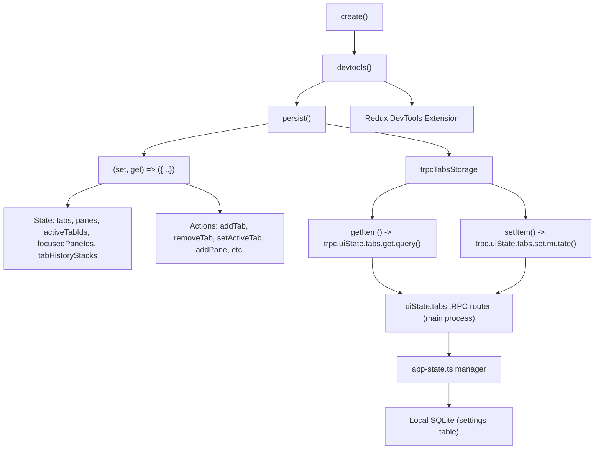
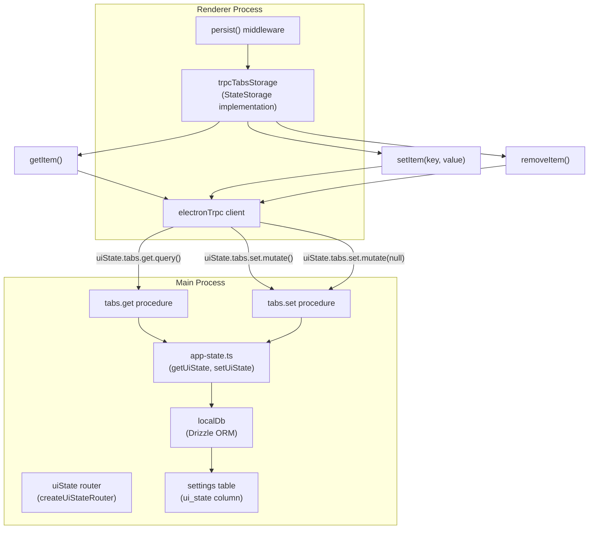
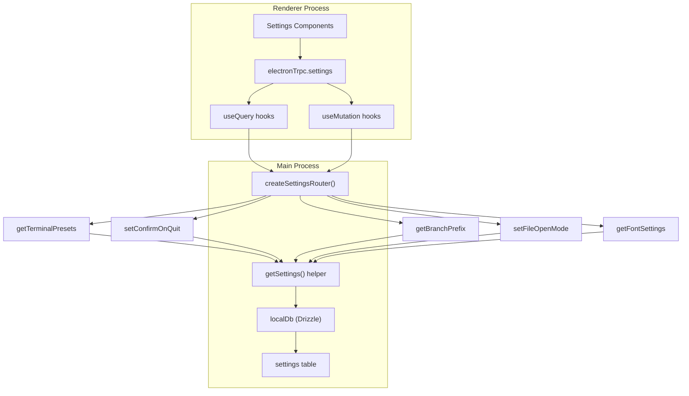
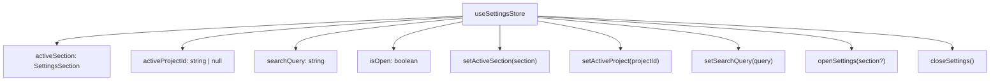
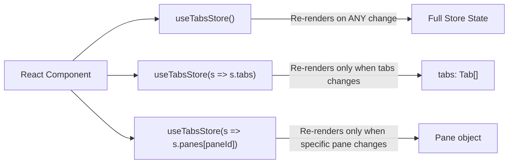
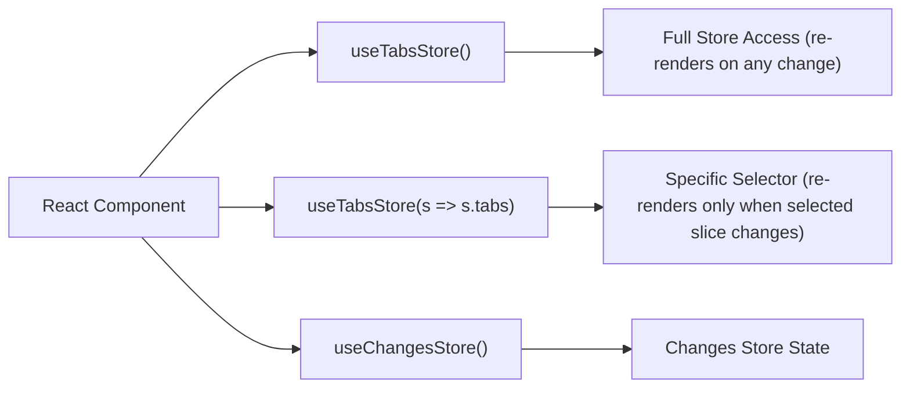
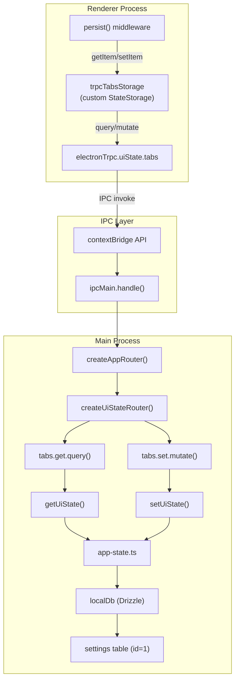

# State Management

<details>
<summary>Relevant source files</summary>

The following files were used as context for generating this wiki page:

- [apps/desktop/src/lib/trpc/routers/ui-state/index.ts](apps/desktop/src/lib/trpc/routers/ui-state/index.ts)
- [apps/desktop/src/renderer/routes/\_authenticated/\_dashboard/workspace/$workspaceId/page.tsx](apps/desktop/src/renderer/routes/_authenticated/_dashboard/workspace/$workspaceId/page.tsx)
- [apps/desktop/src/renderer/screens/main/components/WorkspaceView/ContentView/TabsContent/GroupStrip/GroupItem.tsx](apps/desktop/src/renderer/screens/main/components/WorkspaceView/ContentView/TabsContent/GroupStrip/GroupItem.tsx)
- [apps/desktop/src/renderer/screens/main/components/WorkspaceView/ContentView/TabsContent/GroupStrip/GroupStrip.tsx](apps/desktop/src/renderer/screens/main/components/WorkspaceView/ContentView/TabsContent/GroupStrip/GroupStrip.tsx)
- [apps/desktop/src/renderer/screens/main/components/WorkspaceView/ContentView/TabsContent/TabContentContextMenu.tsx](apps/desktop/src/renderer/screens/main/components/WorkspaceView/ContentView/TabsContent/TabContentContextMenu.tsx)
- [apps/desktop/src/renderer/screens/main/components/WorkspaceView/ContentView/TabsContent/TabView/FileViewerPane/FileViewerPane.tsx](apps/desktop/src/renderer/screens/main/components/WorkspaceView/ContentView/TabsContent/TabView/FileViewerPane/FileViewerPane.tsx)
- [apps/desktop/src/renderer/screens/main/components/WorkspaceView/ContentView/TabsContent/TabView/FileViewerPane/components/DiffViewerContextMenu/DiffViewerContextMenu.tsx](apps/desktop/src/renderer/screens/main/components/WorkspaceView/ContentView/TabsContent/TabView/FileViewerPane/components/DiffViewerContextMenu/DiffViewerContextMenu.tsx)
- [apps/desktop/src/renderer/screens/main/components/WorkspaceView/ContentView/TabsContent/TabView/FileViewerPane/components/FileEditorContextMenu/FileEditorContextMenu.tsx](apps/desktop/src/renderer/screens/main/components/WorkspaceView/ContentView/TabsContent/TabView/FileViewerPane/components/FileEditorContextMenu/FileEditorContextMenu.tsx)
- [apps/desktop/src/renderer/screens/main/components/WorkspaceView/ContentView/TabsContent/TabView/FileViewerPane/components/FileViewerContent/FileViewerContent.tsx](apps/desktop/src/renderer/screens/main/components/WorkspaceView/ContentView/TabsContent/TabView/FileViewerPane/components/FileViewerContent/FileViewerContent.tsx)
- [apps/desktop/src/renderer/screens/main/components/WorkspaceView/ContentView/TabsContent/TabView/TabPane.tsx](apps/desktop/src/renderer/screens/main/components/WorkspaceView/ContentView/TabsContent/TabView/TabPane.tsx)
- [apps/desktop/src/renderer/screens/main/components/WorkspaceView/ContentView/TabsContent/TabView/index.tsx](apps/desktop/src/renderer/screens/main/components/WorkspaceView/ContentView/TabsContent/TabView/index.tsx)
- [apps/desktop/src/renderer/screens/main/components/WorkspaceView/ContentView/components/EditorContextMenu/EditorContextMenu.tsx](apps/desktop/src/renderer/screens/main/components/WorkspaceView/ContentView/components/EditorContextMenu/EditorContextMenu.tsx)
- [apps/desktop/src/renderer/screens/main/components/WorkspaceView/ContentView/components/PaneContextMenuItems/PaneContextMenuItems.tsx](apps/desktop/src/renderer/screens/main/components/WorkspaceView/ContentView/components/PaneContextMenuItems/PaneContextMenuItems.tsx)
- [apps/desktop/src/renderer/screens/main/components/WorkspaceView/ContentView/components/index.ts](apps/desktop/src/renderer/screens/main/components/WorkspaceView/ContentView/components/index.ts)
- [apps/desktop/src/renderer/stores/tabs/store.ts](apps/desktop/src/renderer/stores/tabs/store.ts)
- [apps/desktop/src/renderer/stores/tabs/terminal-callbacks.ts](apps/desktop/src/renderer/stores/tabs/terminal-callbacks.ts)
- [apps/desktop/src/renderer/stores/tabs/types.ts](apps/desktop/src/renderer/stores/tabs/types.ts)
- [apps/desktop/src/renderer/stores/tabs/utils.test.ts](apps/desktop/src/renderer/stores/tabs/utils.test.ts)
- [apps/desktop/src/renderer/stores/tabs/utils.ts](apps/desktop/src/renderer/stores/tabs/utils.ts)
- [apps/desktop/src/shared/hotkeys.ts](apps/desktop/src/shared/hotkeys.ts)
- [apps/desktop/src/shared/tabs-types.ts](apps/desktop/src/shared/tabs-types.ts)

</details>

## Purpose and Scope

This document describes the state management architecture in the Superset Desktop Application. It covers the four primary Zustand stores used throughout the renderer process, their responsibilities, and the tRPC-based persistence mechanism.

For information about IPC communication channels, see [IPC and tRPC Communication](#2.5). For details about specific UI components that consume this state, see [Tab and Pane System](#2.7).

---

## Overview

The desktop application uses **Zustand** as its primary state management solution. Zustand provides a hook-based API for managing application state in React components with minimal boilerplate.

### Primary Stores

The application maintains several Zustand stores, each with distinct responsibilities:

| Store                       | Location                                     | Purpose                   | Key State                                                                                | Persistence                |
| --------------------------- | -------------------------------------------- | ------------------------- | ---------------------------------------------------------------------------------------- | -------------------------- |
| `useTabsStore`              | `renderer/stores/tabs/store.ts`              | Tab and pane management   | `tabs`, `panes`, `activeTabIds`, `focusedPaneIds`, `tabHistoryStacks`, `closedTabsStack` | tRPC via `trpcTabsStorage` |
| `useSettingsStore`          | `renderer/stores/settings-state.ts`          | Settings UI state         | `activeSection`, `activeProjectId`, `searchQuery`, `isOpen`                              | Zustand devtools only      |
| `useTerminalCallbacksStore` | `renderer/stores/tabs/terminal-callbacks.ts` | Terminal action callbacks | `clearCallbacks`, `scrollToBottomCallbacks`, `getSelectionCallbacks`, `pasteCallbacks`   | None (transient)           |
| `useSidebarStore`           | Referenced in layouts                        | Sidebar state             | `isSidebarOpen`, `sidebarWidth`, `currentMode`                                           | localStorage               |

The tabs store uses workspace-scoped state to prevent cross-workspace rendering bugs and persists via tRPC to the local SQLite database. Settings data (presets, preferences) are managed through tRPC routers rather than client-side stores.

**Sources:** [apps/desktop/src/renderer/stores/tabs/store.ts:1-1346](), [apps/desktop/src/renderer/stores/settings-state.ts:1-80](), [apps/desktop/src/renderer/stores/tabs/terminal-callbacks.ts:1-120]()

---

## Store Architecture

### Store Creation Pattern

All stores follow a consistent pattern using Zustand middleware:



**Diagram: Zustand Store Creation and Persistence Pipeline**

The store creation pipeline applies middleware in sequence:

1. **`create<TabsStore>()`** - Initializes the Zustand store with TypeScript types
2. **`devtools()`** - Enables Redux DevTools integration with name `"TabsStore"`
3. **`persist()`** - Enables automatic persistence with version and migration support
4. **Store implementation** - `(set, get) => ({})` closure defining state and actions

Each store exports:

- A custom hook (e.g., `useTabsStore`) for components to consume state
- State properties accessed via selectors (e.g., `useTabsStore(s => s.tabs)`)
- Action methods that call `set()` to update state (e.g., `addTab`, `removePane`)

**Sources:** [apps/desktop/src/renderer/stores/tabs/store.ts:106-1346](), [apps/desktop/src/renderer/lib/trpc-storage.ts]()

### Persistence Mechanism

The tabs store uses a custom tRPC-based storage adapter instead of localStorage:



**Diagram: tRPC Storage Adapter Architecture**

The `trpcTabsStorage` adapter implements the Zustand `StateStorage` interface:

- **`getItem()`** → calls `electronTrpc.uiState.tabs.get.query()` to fetch state from main process
- **`setItem(key, value)`** → calls `electronTrpc.uiState.tabs.set.mutate()` to persist state
- **`removeItem()`** → calls `electronTrpc.uiState.tabs.set.mutate(null)` to clear state

This approach:

- Provides type-safe persistence using tRPC's inference
- Centralizes all data access through tRPC routers
- Uses the same `settings` table as other application preferences
- Enables future state synchronization across windows

**Sources:** [apps/desktop/src/renderer/stores/tabs/store.ts:1273-1346](), [apps/desktop/src/renderer/lib/trpc-storage.ts](), [apps/desktop/src/lib/trpc/routers/index.ts:1-64]()

---

## Tabs Store (`useTabsStore`)

The tabs store is the most complex store in the application, managing all tabs and panes across all workspaces with workspace-scoped state.

### Store Structure

```mermaid
graph TB
    useTabsStore["useTabsStore"]

    useTabsStore --> State["State"]
    useTabsStore --> Actions["Actions"]
    useTabsStore --> Queries["Query Helpers"]

    State --> tabs["tabs: Tab[]"]
    State --> panes["panes: Record<paneId, Pane>"]
    State --> activeTabIds["activeTabIds: Record<workspaceId, tabId?>"]
    State --> focusedPaneIds["focusedPaneIds: Record<tabId, paneId>"]
    State --> tabHistoryStacks["tabHistoryStacks: Record<workspaceId, tabId[]>"]

    Actions --> TabOps["Tab Operations"]
    Actions --> PaneOps["Pane Operations"]
    Actions --> SplitOps["Split Operations"]
    Actions --> MoveOps["Move Operations"]

    TabOps --> addTab["addTab()"]
    TabOps --> removeTab["removeTab()"]
    TabOps --> renameTab["renameTab()"]
    TabOps --> setActiveTab["setActiveTab()"]
    TabOps --> reorderTabs["reorderTabs()"]
    TabOps --> updateTabLayout["updateTabLayout()"]

    PaneOps --> addPane["addPane()"]
    PaneOps --> addFileViewerPane["addFileViewerPane()"]
    PaneOps --> removePane["removePane()"]
    PaneOps --> setFocusedPane["setFocusedPane()"]
    PaneOps --> setPaneStatus["setPaneStatus()"]
    PaneOps --> pinPane["pinPane()"]

    SplitOps --> splitPaneVertical["splitPaneVertical()"]
    SplitOps --> splitPaneHorizontal["splitPaneHorizontal()"]
    SplitOps --> splitPaneAuto["splitPaneAuto()"]

    MoveOps --> movePaneToTab["movePaneToTab()"]
    MoveOps --> movePaneToNewTab["movePaneToNewTab()"]

    Queries --> getTabsByWorkspace["getTabsByWorkspace()"]
    Queries --> getActiveTab["getActiveTab()"]
    Queries --> getPanesForTab["getPanesForTab()"]
    Queries --> getFocusedPane["getFocusedPane()"]
```



**Diagram: useTabsStore Structure and API Surface**

**Sources:** [apps/desktop/src/renderer/stores/tabs/store.ts:75-1003](), [apps/desktop/src/renderer/stores/tabs/types.ts:57-125]()

### State Properties

| Property           | Type                             | Purpose                                                                              |
| ------------------ | -------------------------------- | ------------------------------------------------------------------------------------ |
| `tabs`             | `Tab[]`                          | All tabs across all workspaces, each with `workspaceId`, `name`, and Mosaic `layout` |
| `panes`            | `Record<string, Pane>`           | All panes (terminal, file-viewer, webview, chat-mastra, devtools) indexed by pane ID |
| `activeTabIds`     | `Record<string, string \| null>` | Maps workspace ID to currently active tab ID                                         |
| `focusedPaneIds`   | `Record<string, string>`         | Maps tab ID to focused pane ID within that tab                                       |
| `tabHistoryStacks` | `Record<string, string[]>`       | MRU (most-recently-used) history of tab IDs per workspace for Cmd+[ navigation       |
| `closedTabsStack`  | `ClosedTabEntry[]`               | Stack of recently closed tabs for "reopen closed tab" feature (max 20)               |

Each `Tab` has a `layout: MosaicNode<string>` field which defines the binary tree structure of pane IDs within the tab. Each `Pane` has a `tabId` field linking it to its parent tab and a `type` field indicating its pane type.

**Sources:** [apps/desktop/src/renderer/stores/tabs/types.ts:18-43](), [apps/desktop/src/renderer/stores/tabs/store.ts:109-115]()

### Workspace-Scoped State

The store maintains workspace isolation through several mechanisms:

1. **Tab-to-workspace association**: Each `Tab` has a `workspaceId` field [apps/desktop/src/renderer/stores/tabs/types.ts:31-34]()
2. **Active tab per workspace**: `activeTabIds[workspaceId]` stores the active tab for each workspace
3. **History per workspace**: `tabHistoryStacks[workspaceId]` maintains MRU tab history per workspace
4. **Sanitization on load**: The persist `merge` function uses `resolveActiveTabIdForWorkspace` to ensure `activeTabIds` only points to tabs that belong to the correct workspace [apps/desktop/src/renderer/stores/tabs/store.ts:1308-1345]()

This prevents cross-workspace rendering bugs where a tab from workspace A could accidentally render while viewing workspace B. The `resolveActiveTabIdForWorkspace` helper validates that the stored active tab actually exists and belongs to the requested workspace, falling back to MRU history or the first available tab.

**Sources:** [apps/desktop/src/renderer/stores/tabs/store.ts:1308-1345](), [apps/desktop/src/renderer/stores/tabs/utils.ts:63-104]()

### Tab Operations

#### Creating and Removing Tabs

**`addTab(workspaceId, options?)`** [apps/desktop/src/renderer/stores/tabs/store.ts:118-160]():

- Creates a new tab with a single terminal pane using `createTabWithPane` utility
- Updates `activeTabIds[workspaceId]` to point to the new tab
- Pushes the previous active tab to `tabHistoryStacks[workspaceId]` for MRU history
- Captures PostHog analytics event `"panel_opened"` with `panel_type: "terminal"`
- Returns `{ tabId, paneId }` for both the new tab and initial pane

**`removeTab(tabId)`** [apps/desktop/src/renderer/stores/tabs/store.ts:274-334]():

- Finds all pane IDs in the tab using `getPaneIdsForTab` from the panes record
- Snapshots the tab + panes to `closedTabsStack` for "reopen closed tab" (max 20 entries)
- Kills terminal sessions for terminal panes via `killTerminalForPane` utility
- Removes the tab from `tabs[]` and all its panes from `panes` record
- Uses `findNextTab` helper to select the next best tab (MRU history → position → fallback)
- Cleans up `focusedPaneIds[tabId]` and removes tab from `tabHistoryStacks`

**`reopenClosedTab(workspaceId)`** [apps/desktop/src/renderer/stores/tabs/store.ts:1208-1263]():

- Pops the most recent `ClosedTabEntry` from `closedTabsStack`
- Restores the tab with all its panes and layout
- Updates `activeTabIds` and `tabHistoryStacks` to point to the restored tab
- Returns `true` if a tab was restored, `false` if stack was empty

#### Active Tab Management

**`setActiveTab(workspaceId, tabId)`** [apps/desktop/src/renderer/stores/tabs/store.ts:358-399]():

- Validates that the tab belongs to the workspace
- Updates `activeTabIds[workspaceId]` to the new active tab
- Pushes the previous active to `tabHistoryStacks[workspaceId]` MRU stack
- Clears attention status for panes in the newly active tab using `acknowledgedStatus`
  - `"review"` → `"idle"` (user has acknowledged completion)
  - `"permission"`, `"working"` → unchanged (persists until agent action)

The `findNextTab` helper [apps/desktop/src/renderer/stores/tabs/store.ts:52-95]() implements selection priority:

1. Most recently used tab from `tabHistoryStacks[workspaceId]`
2. Next/previous tab by position in `tabs[]` array
3. First available tab in the workspace
4. `null` if no tabs remain

**Sources:** [apps/desktop/src/renderer/stores/tabs/store.ts:52-399](), [apps/desktop/src/renderer/stores/tabs/store.ts:1208-1263]()

### Pane Operations

#### Creating Panes

**addPane(tabId, options?)** [apps/desktop/src/renderer/stores/tabs/store.ts:343-369]():

- Creates a new terminal pane with optional `initialCommands` and `initialCwd`
- Adds it to the tab's layout as a horizontal split (50/50)
- Sets it as the focused pane for the tab

**addFileViewerPane(workspaceId, options)** [apps/desktop/src/renderer/stores/tabs/store.ts:371-540]():

- Resolves the active tab for the workspace using `resolveActiveTabIdForWorkspace`
- Implements preview vs pinned logic:
  - If file is already open in a **pinned** pane, just focus it
  - If an **unpinned** (preview) pane exists and it's the same file, pin it
  - If an unpinned pane exists and it's a different file, replace its content
  - Otherwise, create a new pane
- Determines default `viewMode`: `"diff"` if `diffCategory` provided, `"rendered"` for Markdown, else `"raw"`

This preview/pin workflow allows single-click file browsing without cluttering the workspace.

#### Removing Panes

**removePane(paneId)** [apps/desktop/src/renderer/stores/tabs/store.ts:542-589]():

- If it's the last pane in the tab, removes the entire tab via `removeTab`
- Otherwise, removes the pane from the Mosaic layout using `removePaneFromLayout`
- Kills terminal sessions for terminal panes
- Updates `focusedPaneIds[tabId]` to an adjacent pane

**Sources:** [apps/desktop/src/renderer/stores/tabs/store.ts:343-589]()

### Split Operations

**splitPaneVertical / splitPaneHorizontal** [apps/desktop/src/renderer/stores/tabs/store.ts:734-830]():

- Creates a new terminal pane
- Updates the Mosaic layout using `react-mosaic-component`'s `updateTree` if a path is provided, otherwise wraps the current layout in a new branch
- Sets the new pane as focused

**splitPaneAuto** [apps/desktop/src/renderer/stores/tabs/store.ts:832-838]():

- Splits vertically if `width >= height`, otherwise horizontally
- Delegates to `splitPaneVertical` or `splitPaneHorizontal`

**Sources:** [apps/desktop/src/renderer/stores/tabs/store.ts:734-838]()

### Pane Move Operations

**movePaneToTab(paneId, targetTabId)** [apps/desktop/src/renderer/stores/tabs/store.ts:840-843]():

- Calls `movePaneToTab` helper from `actions/move-pane` module
- Removes the pane from its source tab layout and adds it to the target tab layout
- Handles last-pane cleanup: if the source tab is left empty, removes it

**movePaneToNewTab(paneId)** [apps/desktop/src/renderer/stores/tabs/store.ts:845-861]():

- Calls `movePaneToNewTab` helper from `actions/move-pane` module
- Creates a new tab in the same workspace with the pane as its only content
- Returns the new tab ID

**Sources:** [apps/desktop/src/renderer/stores/tabs/store.ts:840-861](), [apps/desktop/src/renderer/stores/tabs/store.ts:6-7]()

### State Migrations

The store includes migration logic to handle breaking schema changes [apps/desktop/src/renderer/stores/tabs/store.ts:896-922]():

- **Version 2**: Migrated `needsAttention` boolean to `status` enum (`"review"` | `"permission"` | `"working"` | `"idle"`)
- **Version 3**: Migrated `isLocked` boolean to `isPinned` in file-viewer panes

The `merge` function also sanitizes stale state on load [apps/desktop/src/renderer/stores/tabs/store.ts:923-997]():

- Clears transient statuses (`"working"`, `"permission"`) that can't be valid after restart
- Uses `resolveActiveTabIdForWorkspace` to fix cross-workspace `activeTabIds`
- Filters `tabHistoryStacks` to remove stale/cross-workspace tab IDs
- Removes invalid `focusedPaneIds` entries

**Sources:** [apps/desktop/src/renderer/stores/tabs/store.ts:896-997]()

### Persistence Configuration

The store uses version 3 persistence with `trpcTabsStorage` [apps/desktop/src/renderer/stores/tabs/store.ts:892-999]():

```typescript
persist(
  (set, get) => ({
    /* store implementation */
  }),
  {
    name: 'tabs-storage',
    version: 3,
    storage: trpcTabsStorage,
    migrate: (persistedState, version) => {
      /* migrations */
    },
    merge: (persistedState, currentState) => {
      /* sanitization */
    },
  }
)
```

**Sources:** [apps/desktop/src/renderer/stores/tabs/store.ts:892-999]()

---

## Settings State Management

Settings in the application are managed through two distinct systems:

### Settings Data (tRPC Router)

Settings data (presets, preferences, configuration) are managed through the `settings` tRPC router in the main process, not a Zustand store. This router provides procedures for reading and writing settings to the local SQLite database.



**Diagram: Settings Data Management via tRPC**

Key procedures in `createSettingsRouter()` [apps/desktop/src/lib/trpc/routers/settings/index.ts:140-721]():

| Procedure              | Purpose                                           | Returns                     |
| ---------------------- | ------------------------------------------------- | --------------------------- |
| `getTerminalPresets`   | Fetch all terminal presets with execution modes   | `TerminalPreset[]`          |
| `createTerminalPreset` | Add a new preset with commands and execution mode | `TerminalPreset`            |
| `getConfirmOnQuit`     | Get quit confirmation preference                  | `boolean`                   |
| `setConfirmOnQuit`     | Update quit confirmation preference               | `{ success: true }`         |
| `getBranchPrefix`      | Get branch naming configuration                   | `{ mode, customPrefix }`    |
| `setBranchPrefix`      | Update branch naming configuration                | `{ success: true }`         |
| `getFileOpenMode`      | Get file opening behavior                         | `"split-pane" \| "new-tab"` |
| `setFileOpenMode`      | Update file opening behavior                      | `{ success: true }`         |
| `getFontSettings`      | Get terminal and editor font settings             | Font configuration object   |
| `setFontSettings`      | Update font settings                              | `{ success: true }`         |

The `getSettings()` helper [apps/desktop/src/lib/trpc/routers/settings/index.ts:59-65]() ensures the settings row exists before reading.

**Sources:** [apps/desktop/src/lib/trpc/routers/settings/index.ts:59-721](), [packages/local-db/src/schema/schema.ts:171-214]()

### Settings UI State (Zustand Store)

The `useSettingsStore` manages ephemeral UI state for the settings interface:



**Diagram: Settings UI Store Structure**

The store manages:

- **`activeSection`**: Current settings page (`"account"`, `"appearance"`, `"terminal"`, etc.)
- **`activeProjectId`**: Active project when viewing project-specific settings
- **`searchQuery`**: Current search filter text for settings items
- **`isOpen`**: Whether settings modal/page is currently displayed

This store uses Zustand `devtools()` but does **not** persist state — settings always open to the "account" section on app restart.

**Sources:** [apps/desktop/src/renderer/stores/settings-state.ts:1-80]()

---

## Terminal Callbacks Store

The `useTerminalCallbacksStore` manages imperative callback functions for terminal pane interactions. Unlike other stores, this does not persist state — it only holds transient callback references.

```mermaid
graph TB
    useTerminalCallbacksStore["useTerminalCallbacksStore"]

    useTerminalCallbacksStore --> clearCallbacks["clearCallbacks: Map<paneId, callback>"]
    useTerminalCallbacksStore --> scrollToBottomCallbacks["scrollToBottomCallbacks: Map<paneId, callback>"]
    useTerminalCallbacksStore --> getSelectionCallbacks["getSelectionCallbacks: Map<paneId, callback>"]
    useTerminalCallbacksStore --> pasteCallbacks["pasteCallbacks: Map<paneId, callback>"]

    useTerminalCallbacksStore --> registerClearCallback["registerClearCallback(paneId, fn)"]
    useTerminalCallbacksStore --> registerScrollToBottomCallback["registerScrollToBottomCallback(paneId, fn)"]
    useTerminalCallbacksStore --> registerGetSelectionCallback["registerGetSelectionCallback(paneId, fn)"]
    useTerminalCallbacksStore --> registerPasteCallback["registerPasteCallback(paneId, fn)"]

    useTerminalCallbacksStore --> getClearCallback["getClearCallback(paneId)"]
    useTerminalCallbacksStore --> getScrollToBottomCallback["getScrollToBottomCallback(paneId)"]
    useTerminalCallbacksStore --> getGetSelectionCallback["getGetSelectionCallback(paneId)"]
    useTerminalCallbacksStore --> getPasteCallback["getPasteCallback(paneId)"]
```



**Diagram: Terminal Callbacks Store Structure**

The `Terminal` component registers callbacks when mounting:

- **`clearCallback`** - Clears the XTerm buffer and scrollback
- **`scrollToBottomCallback`** - Scrolls XTerm viewport to bottom
- **`getSelectionCallback`** - Returns currently selected text
- **`pasteCallback`** - Writes text to the terminal input

These callbacks are then invoked by:

- Context menu handlers (`TabContentContextMenu`) [apps/desktop/src/renderer/screens/main/components/WorkspaceView/ContentView/TabsContent/TabContentContextMenu.tsx:83-101]()
- Hotkey handlers in `WorkspacePage`
- Toolbar actions in `TabPane` [apps/desktop/src/renderer/screens/main/components/WorkspaceView/ContentView/TabsContent/TabView/TabPane.tsx:83-90]()

This architecture allows context menus and hotkeys to trigger terminal actions without direct XTerm instance references.

**Sources:** [apps/desktop/src/renderer/stores/tabs/terminal-callbacks.ts:1-120](), [apps/desktop/src/renderer/screens/main/components/WorkspaceView/ContentView/TabsContent/TabContentContextMenu.tsx:83-101]()

---

## Reactive State Patterns

### Selector-Based Subscriptions

Components consume store state using selector functions to minimize re-renders:



**Diagram: Selector-Based Subscription Patterns**

Recommended patterns:

```typescript
// ❌ Re-renders on ANY tabs store change (bad)
const store = useTabsStore()

// ✅ Re-renders only when tabs array changes
const tabs = useTabsStore((s) => s.tabs)

// ✅ Re-renders only when panes record changes
const panes = useTabsStore((s) => s.panes)

// ✅ Re-renders only when this specific pane changes
const pane = useTabsStore((s) => s.panes[paneId])

// ✅ Re-renders only when action reference changes (never, actions are stable)
const removeTab = useTabsStore((s) => s.removeTab)
```

Zustand uses shallow equality checks for selector results, so components only re-render when the selected slice actually changes.

**Sources:** [apps/desktop/src/renderer/stores/tabs/store.ts:106-1346]()

### Component Integration Example

The `TabPane` component demonstrates granular state selection [apps/desktop/src/renderer/screens/main/components/WorkspaceView/ContentView/TabsContent/TabView/TabPane.tsx:59-62]():

```typescript
const paneName = useTabsStore((s) => s.panes[paneId]?.name)
const paneStatus = useTabsStore((s) => s.panes[paneId]?.status)
const setPaneStatus = useTabsStore((s) => s.setPaneStatus)
```

This component:

- Only re-renders when its specific pane's `name` or `status` changes
- Does not re-render when other panes, tabs, or activeTabIds change
- Uses stable action references (`setPaneStatus`) without triggering re-renders

**Sources:** [apps/desktop/src/renderer/screens/main/components/WorkspaceView/ContentView/TabsContent/TabView/TabPane.tsx:59-62]()

---

## Store Consumption in Components

Components consume store state using Zustand's hook-based API with selective subscriptions to minimize re-renders:



**Diagram: Store Hook Consumption Pattern**

### Selective Subscriptions

The recommended pattern is to use selector functions to subscribe to specific slices of state:

```typescript
// ❌ Re-renders on ANY tabs store change
const store = useTabsStore()

// ✅ Re-renders only when tabs array changes
const tabs = useTabsStore((s) => s.tabs)

// ✅ Re-renders only when panes map changes
const panes = useTabsStore((s) => s.panes)

// ✅ Re-renders only when this specific pane changes
const pane = useTabsStore((s) => s.panes[paneId])

// ✅ Re-renders only when specific action changes (never, since actions are stable)
const removeTab = useTabsStore((s) => s.removeTab)
```

This pattern prevents unnecessary re-renders when unrelated state updates.

**Sources:** [apps/desktop/src/renderer/stores/tabs/store.ts:75-1003]()

### Example: FileViewerPane Component

The `FileViewerPane` component [apps/desktop/src/renderer/screens/main/components/WorkspaceView/ContentView/TabsContent/TabView/FileViewerPane/FileViewerPane.tsx:59-60]() demonstrates granular state selection:

```typescript
// Only subscribes to this specific pane's fileViewer state
const fileViewer = useTabsStore((s) => s.panes[paneId]?.fileViewer)

// Uses changes store for view preferences
const {
  viewMode: diffViewMode,
  setViewMode: setDiffViewMode,
  hideUnchangedRegions,
  toggleHideUnchangedRegions,
} = useChangesStore()

// Auto-pins on edit
const pinPane = useTabsStore((s) => s.pinPane)
```

This component:

- Only re-renders when its own pane's `fileViewer` state changes
- Accesses changes store preferences without subscribing to selectedFiles
- Uses stable action references without causing re-renders

**Sources:** [apps/desktop/src/renderer/screens/main/components/WorkspaceView/ContentView/TabsContent/TabView/FileViewerPane/FileViewerPane.tsx:59-138]()

### Example: FileViewerToolbar Component

The `FileViewerToolbar` component [apps/desktop/src/renderer/screens/main/components/WorkspaceView/ContentView/TabsContent/TabView/FileViewerPane/components/FileViewerToolbar/FileViewerToolbar.tsx:1-186]() receives state via props rather than direct store subscription:

```typescript
interface FileViewerToolbarProps {
  fileName: string
  isDirty: boolean
  viewMode: FileViewerMode
  isPinned: boolean
  // ... other props
}
```

This pattern:

- Makes the component reusable and testable
- Lets the parent control re-render frequency
- Follows React best practices for prop-based composition

**Sources:** [apps/desktop/src/renderer/screens/main/components/WorkspaceView/ContentView/TabsContent/TabView/FileViewerPane/components/FileViewerToolbar/FileViewerToolbar.tsx:15-51]()

---

## DevTools Integration

All stores use the `devtools()` middleware which enables Redux DevTools Extension integration:

- **State inspection** - View current state for all stores
- **Action logging** - See every action dispatched with before/after state
- **Time-travel debugging** - Replay actions and undo/redo state changes
- **Action naming** - Each store is named for easy identification

The tabs store is named `"TabsStore"` and changes store is named `"ChangesStore"` in DevTools.

**Sources:** [apps/desktop/src/renderer/stores/tabs/store.ts:1001](), [apps/desktop/src/renderer/stores/changes/store.ts:158]()

---

## State Persistence Architecture

The tabs store uses a tRPC-based persistence mechanism for cross-process state synchronization:



**Diagram: tRPC-Based State Persistence Flow**

Key components:

- **`trpcTabsStorage`** - Custom Zustand `StateStorage` adapter translating `getItem`/`setItem`/`removeItem` to tRPC calls
- **`electronTrpc.uiState.tabs`** - Renderer-side tRPC client proxying IPC calls to main process
- **`createUiStateRouter()`** - Main process tRPC router exposing `tabs.get` and `tabs.set` procedures
- **`app-state.ts`** - Singleton manager wrapping Drizzle ORM access to `settings` table
- **`settings` table** - SQLite table with `ui_state` JSON column storing serialized tabs state

This approach:

- Provides end-to-end type safety using tRPC's type inference
- Centralizes all data access through tRPC routers (no raw IPC handlers)
- Uses the same persistence layer as other settings (terminal presets, fonts, etc.)
- Validates state shape with TypeScript before persisting
- Enables future state synchronization across multiple windows

**Sources:** [apps/desktop/src/renderer/stores/tabs/store.ts:1273-1346](), [apps/desktop/src/lib/trpc/routers/index.ts:32-61]()

---

## Performance Considerations

### Selective Re-renders

Zustand's hook-based API enables fine-grained subscriptions:

```typescript
// ❌ Re-renders on ANY store change
const store = useTabsStore()

// ✅ Re-renders only when tabs array changes
const tabs = useTabs()

// ✅ Re-renders only when activeTabIds changes
const activeTabIds = useActiveTabIds()

// ✅ Re-renders only when specific action changes (never)
const removeTab = useTabsStore((state) => state.removeTab)
```

This pattern is used throughout components to minimize unnecessary re-renders.

### Persistence Debouncing

The persist middleware automatically debounces writes to electron-store, preventing excessive IPC calls and file system operations when state updates rapidly.

### Immer Integration

Zustand internally uses Immer for immutable state updates, making it safe to write "mutative" code:

```typescript
set((state) => {
  state.tabs.push(newTab) // Looks mutative but creates new state
  return state
})
```

This simplifies reducer logic while maintaining immutability guarantees.

**Sources:** Implementation patterns observed in [apps/desktop/src/renderer/stores/tabs/store.ts:1-141]()
