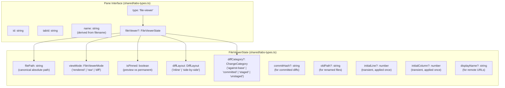
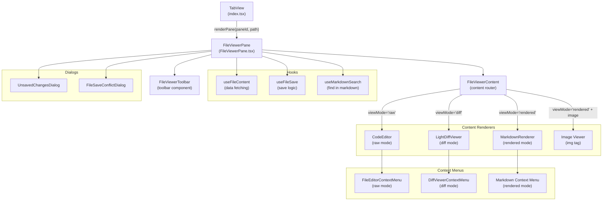
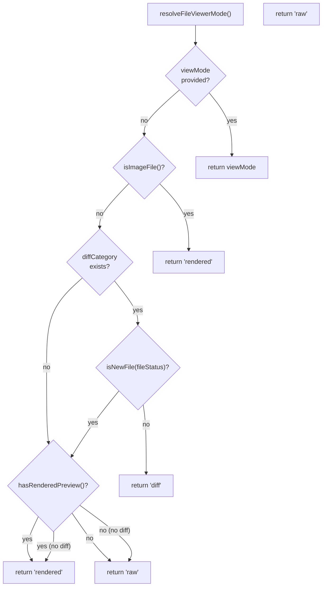
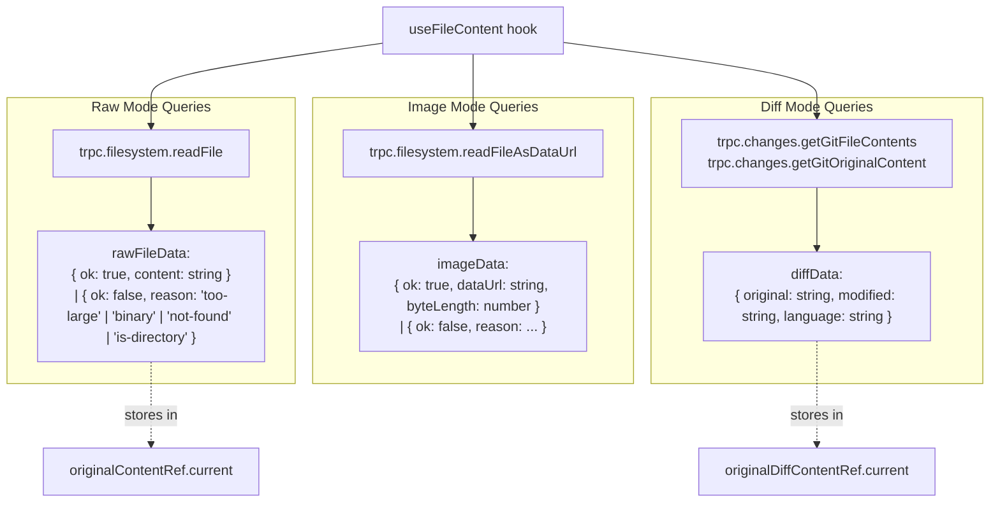
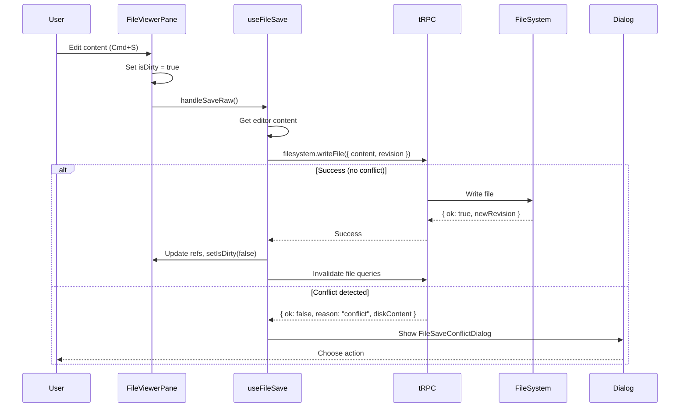
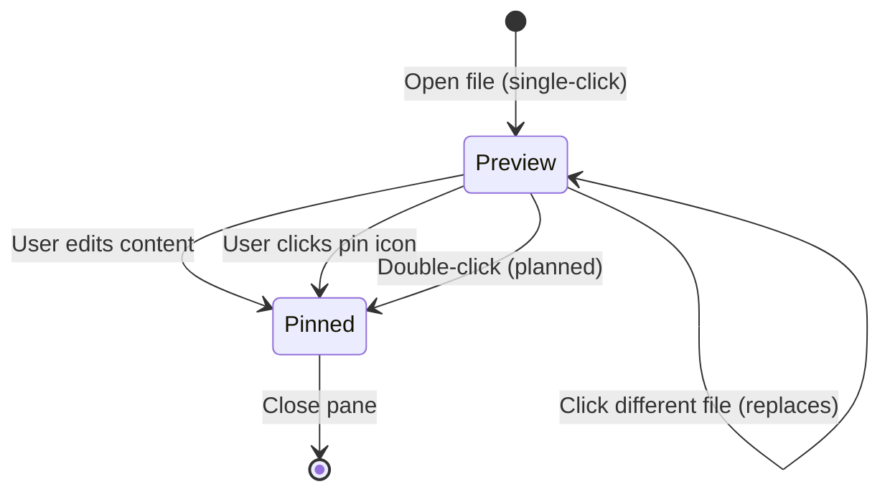
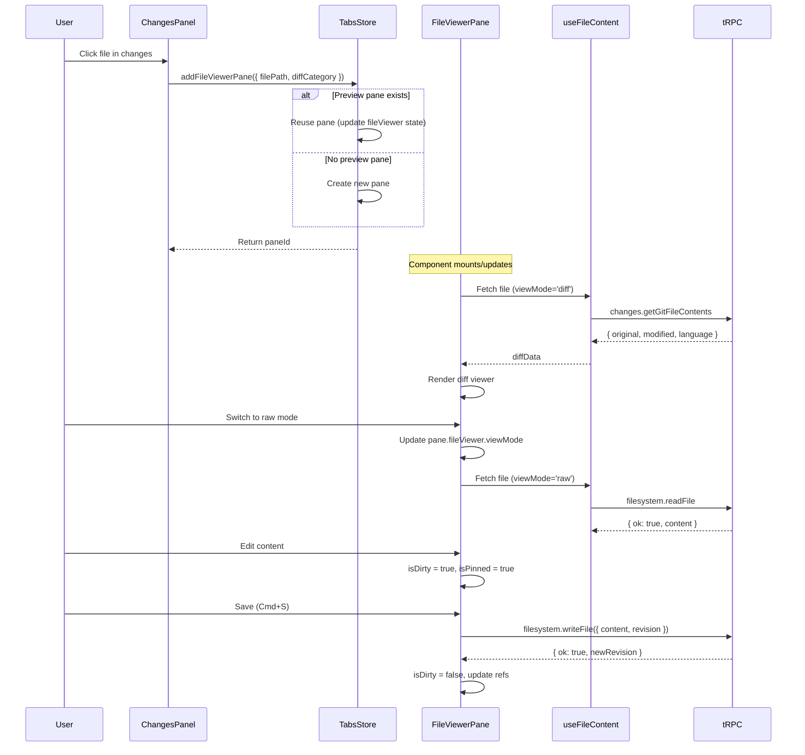

# File Viewer Pane

<details>
<summary>Relevant source files</summary>

The following files were used as context for generating this wiki page:

- [apps/desktop/src/lib/trpc/routers/ui-state/index.ts](apps/desktop/src/lib/trpc/routers/ui-state/index.ts)
- [apps/desktop/src/renderer/routes/_authenticated/_dashboard/workspace/$workspaceId/page.tsx](apps/desktop/src/renderer/routes/_authenticated/_dashboard/workspace/$workspaceId/page.tsx)
- [apps/desktop/src/renderer/screens/main/components/WorkspaceView/ContentView/TabsContent/GroupStrip/GroupItem.tsx](apps/desktop/src/renderer/screens/main/components/WorkspaceView/ContentView/TabsContent/GroupStrip/GroupItem.tsx)
- [apps/desktop/src/renderer/screens/main/components/WorkspaceView/ContentView/TabsContent/GroupStrip/GroupStrip.tsx](apps/desktop/src/renderer/screens/main/components/WorkspaceView/ContentView/TabsContent/GroupStrip/GroupStrip.tsx)
- [apps/desktop/src/renderer/screens/main/components/WorkspaceView/ContentView/TabsContent/TabContentContextMenu.tsx](apps/desktop/src/renderer/screens/main/components/WorkspaceView/ContentView/TabsContent/TabContentContextMenu.tsx)
- [apps/desktop/src/renderer/screens/main/components/WorkspaceView/ContentView/TabsContent/TabView/FileViewerPane/FileViewerPane.tsx](apps/desktop/src/renderer/screens/main/components/WorkspaceView/ContentView/TabsContent/TabView/FileViewerPane/FileViewerPane.tsx)
- [apps/desktop/src/renderer/screens/main/components/WorkspaceView/ContentView/TabsContent/TabView/FileViewerPane/components/DiffViewerContextMenu/DiffViewerContextMenu.tsx](apps/desktop/src/renderer/screens/main/components/WorkspaceView/ContentView/TabsContent/TabView/FileViewerPane/components/DiffViewerContextMenu/DiffViewerContextMenu.tsx)
- [apps/desktop/src/renderer/screens/main/components/WorkspaceView/ContentView/TabsContent/TabView/FileViewerPane/components/FileEditorContextMenu/FileEditorContextMenu.tsx](apps/desktop/src/renderer/screens/main/components/WorkspaceView/ContentView/TabsContent/TabView/FileViewerPane/components/FileEditorContextMenu/FileEditorContextMenu.tsx)
- [apps/desktop/src/renderer/screens/main/components/WorkspaceView/ContentView/TabsContent/TabView/FileViewerPane/components/FileViewerContent/FileViewerContent.tsx](apps/desktop/src/renderer/screens/main/components/WorkspaceView/ContentView/TabsContent/TabView/FileViewerPane/components/FileViewerContent/FileViewerContent.tsx)
- [apps/desktop/src/renderer/screens/main/components/WorkspaceView/ContentView/TabsContent/TabView/TabPane.tsx](apps/desktop/src/renderer/screens/main/components/WorkspaceView/ContentView/TabsContent/TabView/TabPane.tsx)
- [apps/desktop/src/renderer/screens/main/components/WorkspaceView/ContentView/TabsContent/TabView/index.tsx](apps/desktop/src/renderer/screens/main/components/WorkspaceView/ContentView/TabsContent/TabView/index.tsx)
- [apps/desktop/src/renderer/screens/main/components/WorkspaceView/ContentView/components/EditorContextMenu/EditorContextMenu.tsx](apps/desktop/src/renderer/screens/main/components/WorkspaceView/ContentView/components/EditorContextMenu/EditorContextMenu.tsx)
- [apps/desktop/src/renderer/screens/main/components/WorkspaceView/ContentView/components/PaneContextMenuItems/PaneContextMenuItems.tsx](apps/desktop/src/renderer/screens/main/components/WorkspaceView/ContentView/components/PaneContextMenuItems/PaneContextMenuItems.tsx)
- [apps/desktop/src/renderer/screens/main/components/WorkspaceView/ContentView/components/index.ts](apps/desktop/src/renderer/screens/main/components/WorkspaceView/ContentView/components/index.ts)
- [apps/desktop/src/renderer/stores/tabs/store.ts](apps/desktop/src/renderer/stores/tabs/store.ts)
- [apps/desktop/src/renderer/stores/tabs/terminal-callbacks.ts](apps/desktop/src/renderer/stores/tabs/terminal-callbacks.ts)
- [apps/desktop/src/renderer/stores/tabs/types.ts](apps/desktop/src/renderer/stores/tabs/types.ts)
- [apps/desktop/src/renderer/stores/tabs/utils.test.ts](apps/desktop/src/renderer/stores/tabs/utils.test.ts)
- [apps/desktop/src/renderer/stores/tabs/utils.ts](apps/desktop/src/renderer/stores/tabs/utils.ts)
- [apps/desktop/src/shared/hotkeys.ts](apps/desktop/src/shared/hotkeys.ts)
- [apps/desktop/src/shared/tabs-types.ts](apps/desktop/src/shared/tabs-types.ts)

</details>


## Purpose and Scope

The File Viewer Pane is a specialized pane type within the Tab and Pane System that displays file contents in three distinct modes: raw (source code editing), rendered (markdown/image preview), and diff (change visualization). This document covers the file viewer architecture, state management, view mode switching, file operations (loading/saving), and conflict resolution.

For information about the overall tab and pane system, see [Tab and Pane System](#2.7). For terminal panes, see [Terminal System](#2.8). For chat panes, see [AI Chat Integration](#2.9).

---

## Overview

The file viewer pane is one of five pane types (`"terminal" | "webview" | "file-viewer" | "chat" | "devtools"`) that can be displayed within a tab. It provides a dedicated interface for viewing and editing files with support for:

- **Three view modes**: raw source editing, rendered previews (markdown/images), and git diffs
- **Preview vs pinned behavior**: unpinned panes can be replaced by new file clicks (VSCode-style preview tabs)
- **Dirty state tracking**: monitors unsaved changes with conflict detection
- **Context-sensitive actions**: different context menus and toolbar actions per view mode
- **File path retargeting**: automatically updates paths when files are renamed/moved

**Key Characteristics:**
- **Single workspace scope**: File viewer panes always belong to a workspace and operate on files within that workspace's worktree
- **Transient positioning**: `initialLine` and `initialColumn` are applied once when opening a file, then discarded (not persisted)
- **Automatic pinning**: panes automatically pin themselves when the user makes edits to prevent accidental replacement

Sources: [apps/desktop/src/shared/tabs-types.ts:103-124](), [apps/desktop/src/renderer/stores/tabs/types.ts:68-90]()

---

## State Model

### FileViewerState Interface



**State Persistence:**
- `initialLine` and `initialColumn` are **intentionally omitted** from persistence (see `fileViewerStateSchema` in [apps/desktop/src/lib/trpc/routers/ui-state/index.ts:18-28]())
- These fields are transient — applied once when the pane opens, then discarded
- All other fields persist across app restarts via the UI state tRPC router

Sources: [apps/desktop/src/shared/tabs-types.ts:103-124](), [apps/desktop/src/lib/trpc/routers/ui-state/index.ts:18-28]()

---

## Component Architecture



**Component Hierarchy:**
1. `TabView` ([apps/desktop/src/renderer/screens/main/components/WorkspaceView/ContentView/TabsContent/TabView/index.tsx:156-193]()) routes `"file-viewer"` panes to `FileViewerPane`
2. `FileViewerPane` ([apps/desktop/src/renderer/screens/main/components/WorkspaceView/ContentView/TabsContent/TabView/FileViewerPane/FileViewerPane.tsx:58-712]()) is the orchestrator component that:
   - Manages state (dirty tracking, conflict detection, mode switching)
   - Coordinates hooks (`useFileContent`, `useFileSave`, `useMarkdownSearch`)
   - Renders toolbar, content area, and dialogs
3. `FileViewerContent` ([apps/desktop/src/renderer/screens/main/components/WorkspaceView/ContentView/TabsContent/TabView/FileViewerPane/components/FileViewerContent/FileViewerContent.tsx:130-447]()) routes to the appropriate renderer based on `viewMode`
4. **Renderers**: `CodeEditor`, `MarkdownRenderer`, `LightDiffViewer`, or `` tag
5. **Context Menus**: Each mode has a specialized context menu with mode-appropriate actions

Sources: [apps/desktop/src/renderer/screens/main/components/WorkspaceView/ContentView/TabsContent/TabView/index.tsx:169-192](), [apps/desktop/src/renderer/screens/main/components/WorkspaceView/ContentView/TabsContent/TabView/FileViewerPane/FileViewerPane.tsx:58-712]()

---

## View Modes

### View Mode Resolution



**View Mode Logic** ([apps/desktop/src/renderer/stores/tabs/utils.ts:18-40]()):
1. If `viewMode` explicitly provided → use it
2. If file is an image → always `"rendered"` (no meaningful diff for binary files)
3. If `diffCategory` exists and file is **not** new → `"diff"`
4. If `diffCategory` exists but file **is** new → `"rendered"` or `"raw"` (no previous version to diff against)
5. If file has rendered preview (markdown, etc.) → `"rendered"`
6. Otherwise → `"raw"`

| View Mode | Description | Use Case |
|-----------|-------------|----------|
| `"raw"` | Monaco-based code editor | Editing source files, viewing plain text |
| `"rendered"` | Markdown renderer or `` tag | Previewing markdown docs, images |
| `"diff"` | Side-by-side or inline diff viewer | Reviewing uncommitted/committed changes |

Sources: [apps/desktop/src/renderer/stores/tabs/utils.ts:18-40](), [apps/desktop/src/renderer/screens/main/components/WorkspaceView/ContentView/TabsContent/TabView/FileViewerPane/components/FileViewerContent/FileViewerContent.tsx:162-262]()

### Mode Switching with Dirty State

Mode switches are **blocked** when the editor has unsaved changes. The workflow:

1. User attempts to switch modes while `isDirty === true`
2. `UnsavedChangesDialog` displays with three options:
   - **Save & Switch**: calls `handleSaveRaw()`, waits for completion, then switches
   - **Discard & Switch**: resets dirty state, switches immediately
   - **Cancel**: aborts the mode switch
3. If save succeeds → mode switch proceeds
4. If save fails with conflict → `FileSaveConflictDialog` displays (see [File Save Conflicts](#file-save-conflicts))

Sources: [apps/desktop/src/renderer/screens/main/components/WorkspaceView/ContentView/TabsContent/TabView/FileViewerPane/FileViewerPane.tsx:321-401]()

---

## File Operations

### File Content Loading



**Loading Strategy:**
- **Conditional fetching**: Only queries relevant to the current `viewMode` are enabled
- **Reference caching**: Content stored in refs (`originalContentRef`, `originalDiffContentRef`) for dirty state comparison
- **Error handling**: Each query type returns a discriminated union with `ok: boolean` for graceful error UI

**Query Details:**
- `trpc.filesystem.readFile`: Returns file content as string or error reason (too-large, binary, not-found, is-directory)
- `trpc.filesystem.readFileAsDataUrl`: For images, returns base64 data URL
- `trpc.changes.getGitFileContents`: For diffs, fetches both original and modified versions with language detection

Sources: [apps/desktop/src/renderer/screens/main/components/WorkspaceView/ContentView/TabsContent/TabView/FileViewerPane/hooks/useFileContent.ts](), [apps/desktop/src/renderer/screens/main/components/WorkspaceView/ContentView/TabsContent/TabView/FileViewerPane/FileViewerPane.tsx:130-149]()

### File Saving



**Save Process:**
1. Editor content captured via `editorRef.current?.getValue()`
2. `writeFile` mutation called with current content and `revision` (last known file modification time)
3. Backend checks if file modified since last read (optimistic concurrency control)
4. If no conflict → file written, `isDirty` cleared, original content ref updated
5. If conflict → `FileSaveConflictDialog` displayed (see below)

**Dirty State Tracking:**
- `isDirty`: Boolean flag indicating unsaved changes
- `originalContentRef.current`: Reference snapshot of last loaded/saved content
- `draftContentRef.current`: Current editor content (updated on each keystroke)
- Comparison: `isDirty = (draftContentRef.current !== originalContentRef.current)`

**Auto-Pinning:** When a file becomes dirty, the pane automatically pins itself (`isPinned = true`) to prevent accidental replacement by new file clicks.

Sources: [apps/desktop/src/renderer/screens/main/components/WorkspaceView/ContentView/TabsContent/TabView/FileViewerPane/hooks/useFileSave.ts](), [apps/desktop/src/renderer/screens/main/components/WorkspaceView/ContentView/TabsContent/TabView/FileViewerPane/FileViewerPane.tsx:86-128](), [apps/desktop/src/renderer/screens/main/components/WorkspaceView/ContentView/TabsContent/TabView/FileViewerPane/FileViewerPane.tsx:234-238]()

### File Save Conflicts

When the file on disk has been modified since it was last loaded (detected via `revision` mismatch), the `FileSaveConflictDialog` presents three resolution options:

| Option | Behavior |
|--------|----------|
| **Overwrite** | Discard disk changes, write local content |
| **Compare in Diff** | Open diff viewer to review changes before deciding |
| **Reload** | Discard local changes, reload disk content |

**Conflict Detection:**
- Each file read operation stores a `revision` (last modified timestamp)
- Each write operation includes the expected `revision`
- Backend compares expected vs actual revision before writing
- Mismatch triggers `{ ok: false, reason: "conflict", diskContent }` response

**User Experience:**
- Conflict dialog is non-blocking (can continue editing)
- "Compare in Diff" opens a temporary diff pane showing local vs disk
- Resolution choice clears the conflict state and dirty flag

Sources: [apps/desktop/src/renderer/screens/main/components/WorkspaceView/components/FileSaveConflictDialog.tsx](), [apps/desktop/src/renderer/screens/main/components/WorkspaceView/ContentView/TabsContent/TabView/FileViewerPane/FileViewerPane.tsx:449-587]()

### File Rename/Move Handling

The file viewer pane automatically updates its `filePath` when the underlying file is renamed or moved:

1. **Workspace file events** stream filesystem changes to all open workspaces
2. `useWorkspaceFileEvents` hook subscribes to events (see [apps/desktop/src/renderer/screens/main/components/WorkspaceView/ContentView/TabsContent/TabView/FileViewerPane/FileViewerPane.tsx:246-283]())
3. On `"rename"` event:
   - `retargetAbsolutePath()` checks if current `filePath` is affected
   - If affected → pane state updated with new path via `retargetFileViewerPaths()` action
4. `pendingRenamePathRef` prevents spurious state resets during path transitions

**Bulk Retargeting:** The tabs store action `retargetFileViewerPaths` ([apps/desktop/src/renderer/stores/tabs/store.ts:1150-1222]()) updates all file viewer panes in a workspace when a directory is renamed.

Sources: [apps/desktop/src/renderer/screens/main/components/WorkspaceView/ContentView/TabsContent/TabView/FileViewerPane/FileViewerPane.tsx:246-283](), [apps/desktop/src/renderer/stores/tabs/store.ts:1150-1222]()

---

## Preview vs Pinned Panes

File viewer panes implement a **preview/pinned** pattern similar to VSCode's preview tabs:

### Preview Mode (`isPinned: false`)

- **Reusable**: Clicking a new file **replaces** the content of the preview pane
- **Single preview per tab**: At most one unpinned file viewer pane exists in a tab at any time
- **Visual indicator**: File name typically shown in italics (implementation detail)

### Pinned Mode (`isPinned: true`)

- **Permanent**: Clicking a new file opens a **new pane** or reuses another preview pane
- **Multiple pinned allowed**: Many pinned file viewer panes can coexist in a tab
- **Explicit pinning**: User can manually pin via toolbar action

### Automatic Transitions



**Auto-Pin Triggers:**
1. **Editing**: Any content modification sets `isPinned = true` (see [apps/desktop/src/renderer/screens/main/components/WorkspaceView/ContentView/TabsContent/TabView/FileViewerPane/FileViewerPane.tsx:234-238]())
2. **Manual pin**: User clicks pin icon in toolbar
3. **Open in new tab**: `openInNewTab` option always creates pinned panes

### Preview Pane Reuse Logic

When `addFileViewerPane` is called ([apps/desktop/src/renderer/stores/tabs/store.ts:667-917]()):

1. **Check for existing pinned pane** with matching file path → focus it (no new pane created)
2. **Find unpinned file viewer panes** in active tab → reuse the first one (replace content)
3. **No reusable pane found** → create new pane (pinned if `isPinned` option, unpinned otherwise)

This prevents tab clutter while allowing users to keep important files open.

Sources: [apps/desktop/src/renderer/stores/tabs/store.ts:667-917](), [apps/desktop/src/renderer/screens/main/components/WorkspaceView/ContentView/TabsContent/TabView/FileViewerPane/FileViewerPane.tsx:234-238]()

---

## Context Menus

Three specialized context menus provide mode-appropriate actions:

### FileEditorContextMenu (Raw Mode)

**Available Actions:**
- **Clipboard**: Cut, Copy, Paste (with Cmd+X/C/V shortcuts)
- **Select All**: Cmd+A
- **Copy Path**: Copy absolute file path to clipboard
- **Copy Path with Line**: Copy path with `:line` suffix (e.g., `/path/to/file.ts:42`)
- **Find**: Open find widget (Cmd+F)
- **Pane Actions**: Split, move, close (via `PaneContextMenuItems`)

Sources: [apps/desktop/src/renderer/screens/main/components/WorkspaceView/ContentView/TabsContent/TabView/FileViewerPane/components/FileEditorContextMenu/FileEditorContextMenu.tsx:25-67]()

### DiffViewerContextMenu (Diff Mode)

**Available Actions:**
- **Copy**: Copy selected diff text
- **Select All**: Select all diff content
- **Copy Path**: Copy file path
- **Edit at Location**: Switch to raw mode at clicked line (context-aware position mapping)
- **Pane Actions**: Split, move, close

**Special Feature:** Clicking in diff viewer captures the click location (`getDiffLocationFromEvent`), which is used to compute the corresponding raw file line number when switching to edit mode.

Sources: [apps/desktop/src/renderer/screens/main/components/WorkspaceView/ContentView/TabsContent/TabView/FileViewerPane/components/DiffViewerContextMenu/DiffViewerContextMenu.tsx:49-144]()

### Markdown Context Menu (Rendered Mode)

Uses the same `EditorContextMenu` wrapper but with limited actions:
- **Copy**: Copy selected markdown text
- **Select All**
- **Copy Path**
- **Find**: Markdown search (highlights text in rendered output)
- **Pane Actions**

Note: Paste/Cut are disabled since rendered mode is read-only.

Sources: [apps/desktop/src/renderer/screens/main/components/WorkspaceView/ContentView/TabsContent/TabView/FileViewerPane/components/FileViewerContent/FileViewerContent.tsx:318-360]()

---

## Toolbar Actions

The `FileViewerToolbar` component ([FileViewerToolbar.tsx]) provides mode-specific actions:

### Mode Switcher

Segmented control to switch between view modes:
- **Raw**: Source code editor
- **Diff**: Change visualization (only enabled if `diffCategory` present)
- **Rendered**: Markdown/image preview (only enabled if file has rendered preview)

Switching is blocked if `isDirty` (shows unsaved changes dialog first).

### View Mode-Specific Actions

| Mode | Actions |
|------|---------|
| **Raw** | Save (Cmd+S), Pin/Unpin |
| **Diff** | View mode toggle (inline/side-by-side), Hide/Show unchanged regions, Edit at location |
| **Rendered** | Pin/Unpin, Search (markdown only) |

### Status Indicators

- **Dirty indicator**: Shows when `isDirty === true`
- **Save conflict warning**: Shows when external file modification detected
- **Loading spinner**: Shows during file operations

Sources: [apps/desktop/src/renderer/screens/main/components/WorkspaceView/ContentView/TabsContent/TabView/FileViewerPane/components/FileViewerToolbar/]()

---

## Integration Points

### Tabs Store Integration

File viewer panes are created via the `addFileViewerPane` action:

```typescript
addFileViewerPane: (
  workspaceId: string,
  options: AddFileViewerPaneOptions
) => string // returns paneId
```

**Options Interface:**
| Field | Type | Description |
|-------|------|-------------|
| `filePath` | `string` | Canonical absolute path or remote URL |
| `displayName` | `string?` | Override display name (for URLs) |
| `viewMode` | `FileViewerMode?` | Force specific view mode |
| `diffCategory` | `ChangeCategory?` | Diff source category |
| `fileStatus` | `FileStatus?` | For view mode resolution (new files) |
| `commitHash` | `string?` | For committed diffs |
| `oldPath` | `string?` | For renamed files |
| `line` | `number?` | Scroll to line (raw mode only) |
| `column` | `number?` | Scroll to column (raw mode only) |
| `isPinned` | `boolean?` | Open as pinned vs preview |
| `openInNewTab` | `boolean?` | Create new tab vs reuse active tab |

Sources: [apps/desktop/src/renderer/stores/tabs/types.ts:68-90](), [apps/desktop/src/renderer/stores/tabs/store.ts:667-917]()

### Changes Panel Integration

The Changes panel (sidebar) uses `addFileViewerPane` to open files:
- Clicking a changed file → opens in preview mode with appropriate `diffCategory`
- Clicking line numbers in diff snippets → opens at specific line via `line` option
- Respects user's file open mode preference (new tab vs reuse)

### Command Palette Integration

Quick Open (Cmd+P) and Keyword Search (Cmd+Shift+F) both open files via `addFileViewerPane`:
- Always opens at specific line/column when search result provides it
- Respects file open mode preference
- Automatically pins if opening from search (user explicitly selected it)

### File System Events

File viewer panes subscribe to workspace file events via `useWorkspaceFileEvents`:
- **Rename/Move**: Updates `filePath` via `retargetFileViewerPaths`
- **Change**: Invalidates file content queries (triggers reload)
- **Delete**: Pane shows "file not found" error
- **Overflow**: Invalidates all queries (too many events to process individually)

Sources: [apps/desktop/src/renderer/screens/main/components/WorkspaceView/ContentView/TabsContent/TabView/FileViewerPane/FileViewerPane.tsx:246-283]()

---

## State Lifecycle



**Key State Transitions:**
1. Pane created (or reused) via `addFileViewerPane`
2. `FileViewerPane` component mounts, reads `fileViewer` state
3. `useFileContent` fetches content based on `viewMode`
4. User interactions update `fileViewer` state (mode switches, line/column updates)
5. Edits set `isDirty` and auto-pin
6. Save clears `isDirty` and updates reference content
7. File events may update `filePath` or invalidate queries

Sources: [apps/desktop/src/renderer/screens/main/components/WorkspaceView/ContentView/TabsContent/TabView/FileViewerPane/FileViewerPane.tsx:58-712](), [apps/desktop/src/renderer/stores/tabs/store.ts:667-917]()