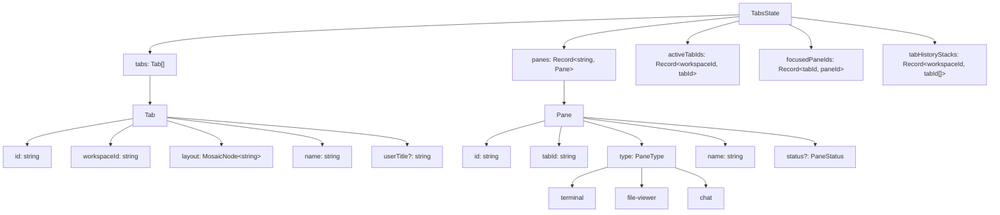
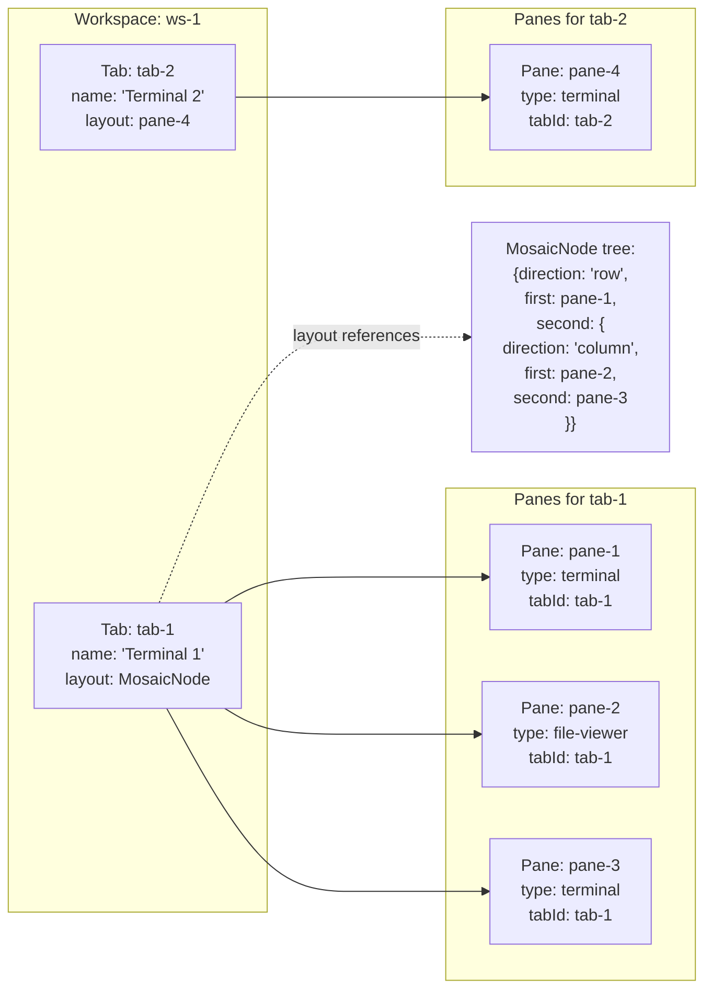
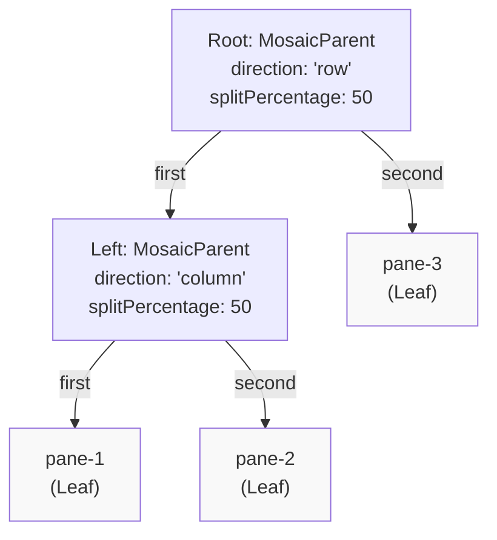
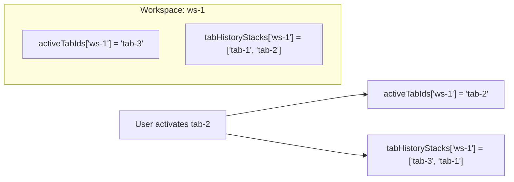
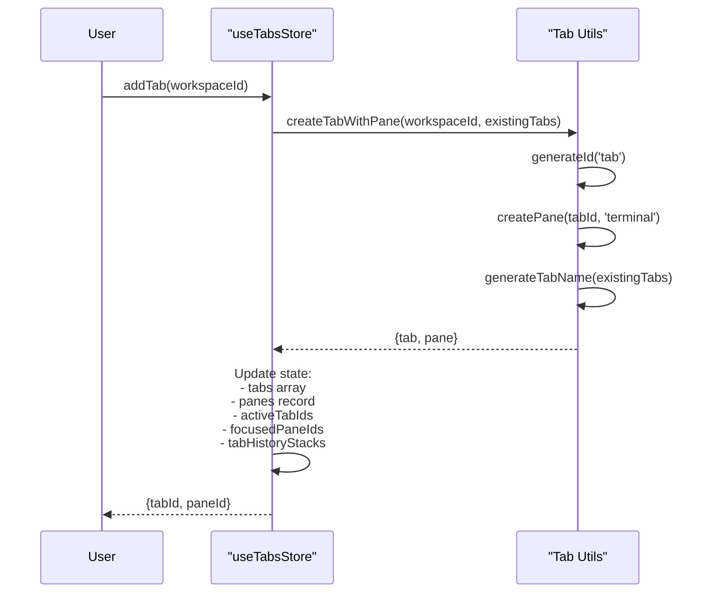
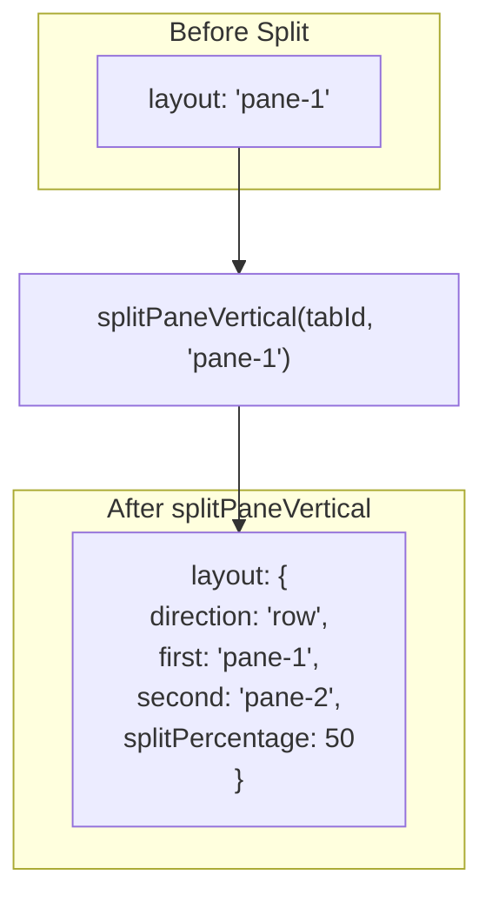
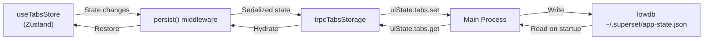
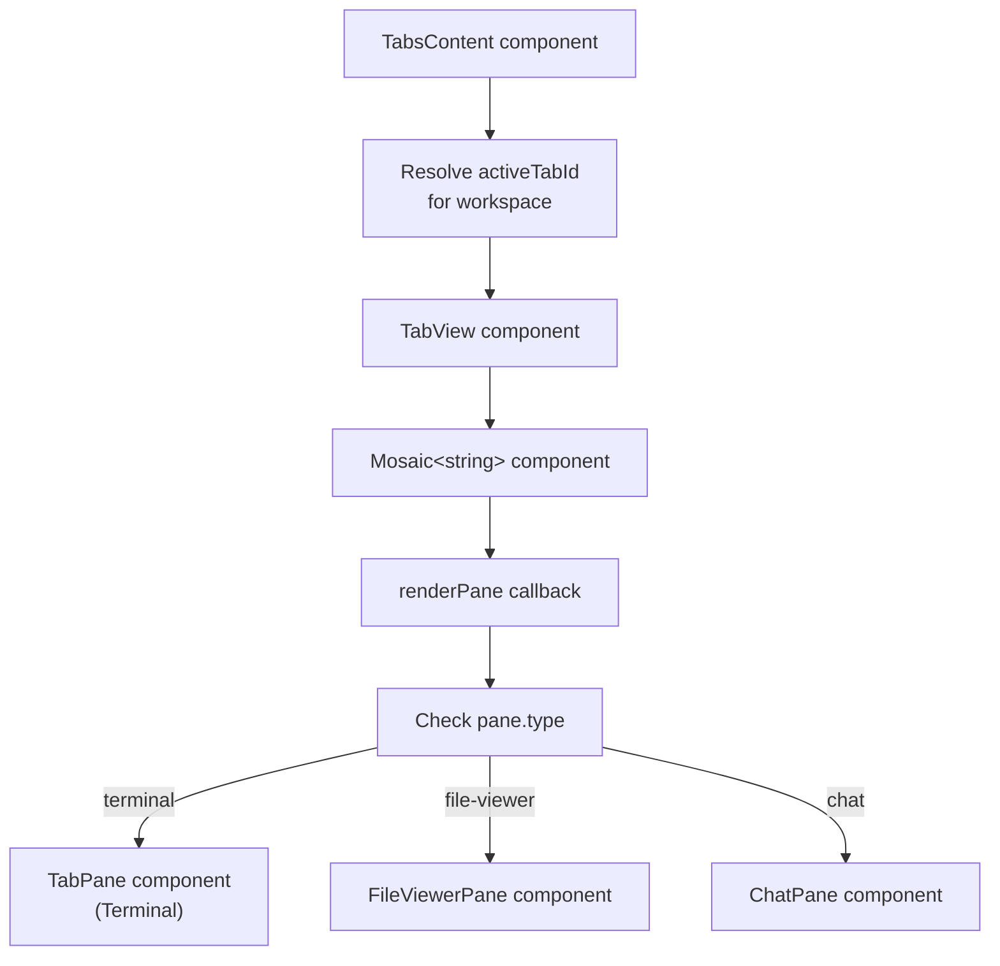
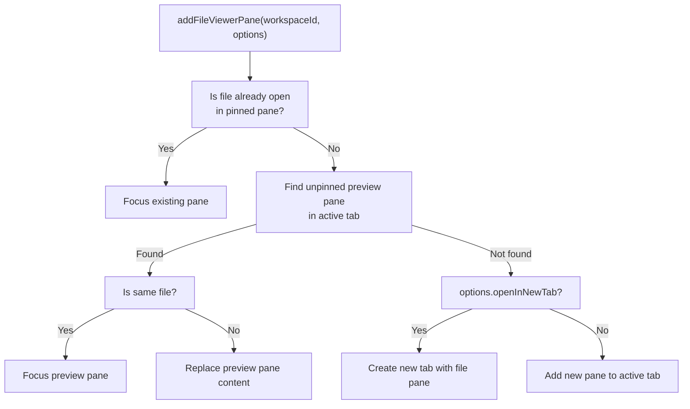
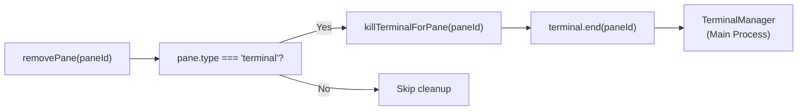

# Tab and Pane System

<details>
<summary>Relevant source files</summary>

The following files were used as context for generating this wiki page:

- [apps/desktop/src/lib/trpc/routers/ui-state/index.ts](apps/desktop/src/lib/trpc/routers/ui-state/index.ts)
- [apps/desktop/src/renderer/routes/_authenticated/_dashboard/workspace/$workspaceId/page.tsx](apps/desktop/src/renderer/routes/_authenticated/_dashboard/workspace/$workspaceId/page.tsx)
- [apps/desktop/src/renderer/screens/main/components/WorkspaceView/ContentView/TabsContent/GroupStrip/GroupItem.tsx](apps/desktop/src/renderer/screens/main/components/WorkspaceView/ContentView/TabsContent/GroupStrip/GroupItem.tsx)
- [apps/desktop/src/renderer/screens/main/components/WorkspaceView/ContentView/TabsContent/GroupStrip/GroupStrip.tsx](apps/desktop/src/renderer/screens/main/components/WorkspaceView/ContentView/TabsContent/GroupStrip/GroupStrip.tsx)
- [apps/desktop/src/renderer/screens/main/components/WorkspaceView/ContentView/TabsContent/TabContentContextMenu.tsx](apps/desktop/src/renderer/screens/main/components/WorkspaceView/ContentView/TabsContent/TabContentContextMenu.tsx)
- [apps/desktop/src/renderer/screens/main/components/WorkspaceView/ContentView/TabsContent/TabView/FileViewerPane/FileViewerPane.tsx](apps/desktop/src/renderer/screens/main/components/WorkspaceView/ContentView/TabsContent/TabView/FileViewerPane/FileViewerPane.tsx)
- [apps/desktop/src/renderer/screens/main/components/WorkspaceView/ContentView/TabsContent/TabView/FileViewerPane/components/DiffViewerContextMenu/DiffViewerContextMenu.tsx](apps/desktop/src/renderer/screens/main/components/WorkspaceView/ContentView/TabsContent/TabView/FileViewerPane/components/DiffViewerContextMenu/DiffViewerContextMenu.tsx)
- [apps/desktop/src/renderer/screens/main/components/WorkspaceView/ContentView/TabsContent/TabView/FileViewerPane/components/FileEditorContextMenu/FileEditorContextMenu.tsx](apps/desktop/src/renderer/screens/main/components/WorkspaceView/ContentView/TabsContent/TabView/FileViewerPane/components/FileEditorContextMenu/FileEditorContextMenu.tsx)
- [apps/desktop/src/renderer/screens/main/components/WorkspaceView/ContentView/TabsContent/TabView/FileViewerPane/components/FileViewerContent/FileViewerContent.tsx](apps/desktop/src/renderer/screens/main/components/WorkspaceView/ContentView/TabsContent/TabView/FileViewerPane/components/FileViewerContent/FileViewerContent.tsx)
- [apps/desktop/src/renderer/screens/main/components/WorkspaceView/ContentView/TabsContent/TabView/TabPane.tsx](apps/desktop/src/renderer/screens/main/components/WorkspaceView/ContentView/TabsContent/TabView/TabPane.tsx)
- [apps/desktop/src/renderer/screens/main/components/WorkspaceView/ContentView/TabsContent/TabView/index.tsx](apps/desktop/src/renderer/screens/main/components/WorkspaceView/ContentView/TabsContent/TabView/index.tsx)
- [apps/desktop/src/renderer/screens/main/components/WorkspaceView/ContentView/components/EditorContextMenu/EditorContextMenu.tsx](apps/desktop/src/renderer/screens/main/components/WorkspaceView/ContentView/components/EditorContextMenu/EditorContextMenu.tsx)
- [apps/desktop/src/renderer/screens/main/components/WorkspaceView/ContentView/components/PaneContextMenuItems/PaneContextMenuItems.tsx](apps/desktop/src/renderer/screens/main/components/WorkspaceView/ContentView/components/PaneContextMenuItems/PaneContextMenuItems.tsx)
- [apps/desktop/src/renderer/screens/main/components/WorkspaceView/ContentView/components/index.ts](apps/desktop/src/renderer/screens/main/components/WorkspaceView/ContentView/components/index.ts)
- [apps/desktop/src/renderer/stores/tabs/store.ts](apps/desktop/src/renderer/stores/tabs/store.ts)
- [apps/desktop/src/renderer/stores/tabs/terminal-callbacks.ts](apps/desktop/src/renderer/stores/tabs/terminal-callbacks.ts)
- [apps/desktop/src/renderer/stores/tabs/types.ts](apps/desktop/src/renderer/stores/tabs/types.ts)
- [apps/desktop/src/renderer/stores/tabs/utils.test.ts](apps/desktop/src/renderer/stores/tabs/utils.test.ts)
- [apps/desktop/src/renderer/stores/tabs/utils.ts](apps/desktop/src/renderer/stores/tabs/utils.ts)
- [apps/desktop/src/shared/hotkeys.ts](apps/desktop/src/shared/hotkeys.ts)
- [apps/desktop/src/shared/tabs-types.ts](apps/desktop/src/shared/tabs-types.ts)

</details>


## Purpose and Scope

The tab and pane system manages the multi-tab, multi-pane workspace layout in the Superset desktop application. Each workspace can have multiple tabs, and each tab can contain multiple panes arranged in a split layout. This system handles tab creation/deletion, pane management, layout persistence, and focus tracking.

For information about terminal session management within terminal panes, see [Terminal System](#2.8). For workspace-level management, see [Workspace System](#2.6).

**Sources:** [apps/desktop/src/renderer/stores/tabs/store.ts:1-1272](), [apps/desktop/src/renderer/stores/tabs/types.ts:1-150]()

---

## Core State Architecture

The tab and pane system is built on a Zustand store (`useTabsStore`) that maintains all tab and pane state in the renderer process. State is persisted via tRPC to the main process using `trpcTabsStorage`.

### State Structure



**Key Concepts:**

| Field | Purpose |
|-------|---------|
| `tabs` | Array of all tabs across all workspaces |
| `panes` | Record mapping pane IDs to pane objects |
| `activeTabIds` | Tracks the currently active tab per workspace |
| `focusedPaneIds` | Tracks the currently focused pane per tab |
| `tabHistoryStacks` | Most-recently-used history for tab switching |

**Sources:** [apps/desktop/src/renderer/stores/tabs/types.ts:24-29](), [apps/desktop/src/renderer/stores/tabs/store.ts:95-104]()

---

## Tab and Pane Relationship

Tabs are containers that hold one or more panes arranged in a tree-based split layout. Each pane belongs to exactly one tab.



**Invariants:**

1. Every tab must have at least one pane (enforced by removing the tab when the last pane is removed)
2. Every pane's `tabId` must reference an existing tab
3. Every pane ID in a tab's `layout` must exist in the `panes` record
4. A workspace can have zero or more tabs

**Sources:** [apps/desktop/src/renderer/stores/tabs/types.ts:15-21](), [apps/desktop/src/shared/tabs-types.ts:122-137]()

---

## MosaicNode Layout Structure

The tab layout system uses `react-mosaic-component`'s `MosaicNode<string>` type to represent split pane arrangements as a binary tree. Each leaf node is a pane ID, and each branch node specifies a split direction.

### Layout Tree Example



**Visual Result:**

```
┌──────────┬──────────┐
│  pane-1  │          │
├──────────┤  pane-3  │
│  pane-2  │          │
└──────────┴──────────┘
```

- **direction: "row"** = horizontal split (left/right)
- **direction: "column"** = vertical split (top/bottom)
- **first/second** = the two children of a split
- **splitPercentage** = percentage allocated to the first child (50 = equal split)

**Sources:** [apps/desktop/src/renderer/stores/tabs/types.ts:1-1](), [apps/desktop/src/renderer/stores/tabs/utils.ts:113-124]()

---

## Pane Types

The system supports three pane types, each with specialized properties:

| Type | Purpose | Specific Fields |
|------|---------|----------------|
| `terminal` | Interactive shell session | `initialCommands`, `initialCwd`, `cwd`, `cwdConfirmed` |
| `file-viewer` | File display (raw/diff/rendered) | `fileViewer: FileViewerState` with `filePath`, `viewMode`, `isPinned`, `diffCategory` |
| `chat` | AI chat interface | `chat: ChatPaneState` with `sessionId` |

### File Viewer Modes

File viewer panes support preview vs. pinned behavior:

- **Preview mode** (`isPinned: false`): Clicking a new file replaces the preview pane
- **Pinned mode** (`isPinned: true`): Clicking a new file opens a new pane

**Sources:** [apps/desktop/src/shared/tabs-types.ts:11-11](), [apps/desktop/src/shared/tabs-types.ts:98-118](), [apps/desktop/src/renderer/stores/tabs/store.ts:527-748]()

---

## Active Tab and Focus Management

The system maintains two levels of focus:

1. **Active Tab per Workspace** (`activeTabIds[workspaceId]`)
2. **Focused Pane per Tab** (`focusedPaneIds[tabId]`)

### Tab History Stack

Each workspace maintains a most-recently-used history stack of tab IDs (`tabHistoryStacks[workspaceId]`). When a tab is activated, the previous active tab is pushed onto the history stack.



When a tab is closed, `findNextTab` uses this priority order:
1. Most recent tab from history stack
2. Next/previous tab by position
3. Any remaining tab in the workspace

**Sources:** [apps/desktop/src/renderer/stores/tabs/store.ts:36-84](), [apps/desktop/src/renderer/stores/tabs/store.ts:306-347]()

---

## Tab and Pane Operations

### Key Store Methods

| Method | Purpose |
|--------|---------|
| `addTab(workspaceId, options?)` | Create new tab with initial terminal pane |
| `addChatTab(workspaceId)` | Create new tab with chat pane |
| `addTabWithMultiplePanes(workspaceId, options)` | Create tab with multiple panes in grid layout |
| `removeTab(tabId)` | Delete tab and all its panes, kill terminal sessions |
| `setActiveTab(workspaceId, tabId)` | Switch active tab, update history, clear attention status |
| `reorderTabs(workspaceId, startIndex, endIndex)` | Reorder tabs via drag-and-drop |
| `updateTabLayout(tabId, layout)` | Update Mosaic layout after split/close operations |
| `addPane(tabId, options?)` | Add new pane to existing tab |
| `addFileViewerPane(workspaceId, options)` | Open file in viewer, reuse preview pane if available |
| `removePane(paneId)` | Delete pane, remove from layout, kill terminal if applicable |
| `setFocusedPane(tabId, paneId)` | Set focused pane, clear attention status |
| `splitPaneVertical(tabId, sourcePaneId, path?, options?)` | Create vertical split (left/right) |
| `splitPaneHorizontal(tabId, sourcePaneId, path?, options?)` | Create horizontal split (top/bottom) |
| `movePaneToTab(paneId, targetTabId)` | Move pane to different tab |
| `movePaneToNewTab(paneId)` | Extract pane into its own tab |

**Sources:** [apps/desktop/src/renderer/stores/tabs/types.ts:67-149](), [apps/desktop/src/renderer/stores/tabs/store.ts:106-1112]()

---

## Tab Lifecycle Flow

### Creating a New Tab



**Sources:** [apps/desktop/src/renderer/stores/tabs/store.ts:106-142](), [apps/desktop/src/renderer/stores/tabs/utils.ts:281-303]()

---

## Layout Operations

### Splitting a Pane

When a user splits a pane (either vertically or horizontally), the system:

1. Creates a new pane
2. Updates the tab's `layout` tree to insert a new split node
3. Updates the focused pane to the newly created pane



**Sources:** [apps/desktop/src/renderer/stores/tabs/store.ts:955-1005](), [apps/desktop/src/renderer/stores/tabs/store.ts:1007-1057]()

---

## State Persistence

The tab and pane state is persisted to disk via the `trpcTabsStorage` adapter, which uses tRPC to communicate with the main process and store data in `lowdb` (JSON file).

### Storage Flow



### Migration Logic

The store includes version-based migrations in the `persist` middleware:

- **Version 2**: Migrated `needsAttention` boolean to `status` enum
- **Version 3**: Migrated `isLocked` to `isPinned` in file viewer panes

On app startup, the `merge` function clears transient statuses (`working`, `permission`) that cannot persist across restarts.

**Sources:** [apps/desktop/src/renderer/stores/tabs/store.ts:1160-1266](), [apps/desktop/src/lib/trpc/routers/ui-state/index.ts:199-214]()

---

## Rendering Pipeline

### From State to UI



The `Mosaic` component from `react-mosaic-component` handles:
- Rendering the split layout based on the `MosaicNode` tree
- Drag-and-drop for rearranging panes
- Built-in split and close buttons

**Sources:** [apps/desktop/src/renderer/screens/main/components/WorkspaceView/ContentView/TabsContent/index.tsx:8-40](), [apps/desktop/src/renderer/screens/main/components/WorkspaceView/ContentView/TabsContent/TabView/index.tsx:29-233]()

---

## Pane Status Indicators

Panes can have a `status` field used for agent lifecycle indicators:

| Status | Color | Meaning |
|--------|-------|---------|
| `idle` | None | Default state, no indicator shown |
| `working` | Amber | Agent actively processing |
| `permission` | Red | Agent blocked, needs user action |
| `review` | Green | Agent completed, ready for review |

### Status Acknowledgment

When a user interacts with a pane (focuses it, selects its tab, or switches to its workspace), attention statuses are acknowledged:

- `review` → `idle` (user saw the completion)
- `permission` → `working` (user saw the prompt, assume granted)
- `working` → unchanged (persists until agent stops)

**Sources:** [apps/desktop/src/shared/tabs-types.ts:14-20](), [apps/desktop/src/shared/tabs-types.ts:80-84](), [apps/desktop/src/renderer/stores/tabs/store.ts:325-346]()

---

## Layout Utility Functions

The system includes extensive utilities for manipulating `MosaicNode` trees:

| Function | Purpose |
|----------|---------|
| `extractPaneIdsFromLayout(layout)` | Extract all pane IDs in visual order (left-to-right, top-to-bottom) |
| `removePaneFromLayout(layout, paneId)` | Remove a pane from the tree, collapsing splits |
| `cleanLayout(layout, validPaneIds)` | Remove invalid pane references |
| `getFirstPaneId(layout)` | Get the leftmost/topmost pane ID |
| `getNextPaneId(layout, currentId)` | Get next pane in visual order (with wrapping) |
| `getPreviousPaneId(layout, currentId)` | Get previous pane in visual order (with wrapping) |
| `getAdjacentPaneId(layout, closingPaneId)` | Find best adjacent pane for focus when closing a pane |
| `findPanePath(layout, paneId)` | Get the path to a pane as `["first", "second", ...]` |
| `buildMultiPaneLayout(paneIds)` | Create balanced grid layout for multiple panes |

**Sources:** [apps/desktop/src/renderer/stores/tabs/utils.ts:113-557]()

---

## File Viewer Preview System

The `addFileViewerPane` method implements a sophisticated preview/pinned behavior:



This allows VS Code-style single-click (preview) vs. double-click (pin) file opening behavior.

**Sources:** [apps/desktop/src/renderer/stores/tabs/store.ts:527-748]()

---

## Integration with Terminal System

Terminal panes maintain a reference to a PTY session in the main process. When a terminal pane is removed, the store calls `killTerminalForPane(paneId)` to end the PTY session via tRPC.



**Sources:** [apps/desktop/src/renderer/stores/tabs/store.ts:246-252](), [apps/desktop/src/renderer/stores/tabs/utils/terminal-cleanup.ts]()