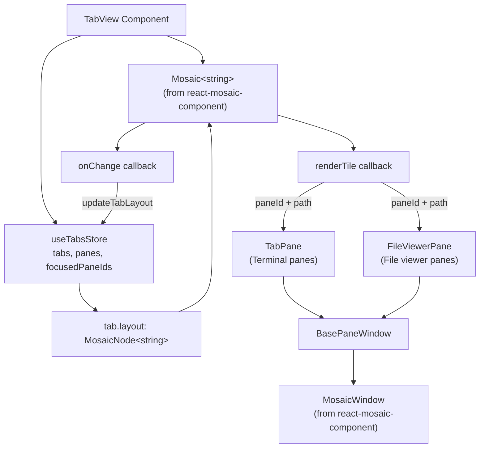
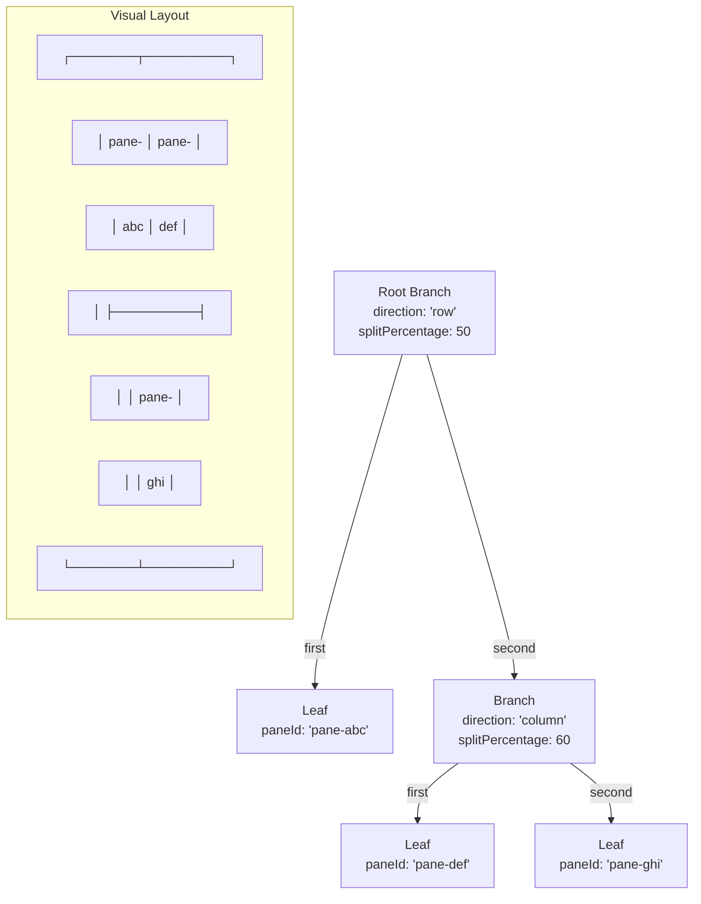
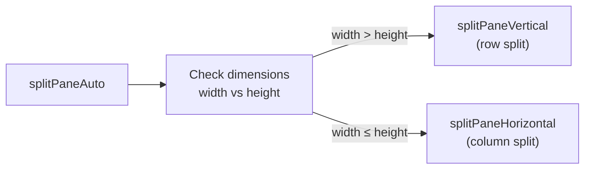
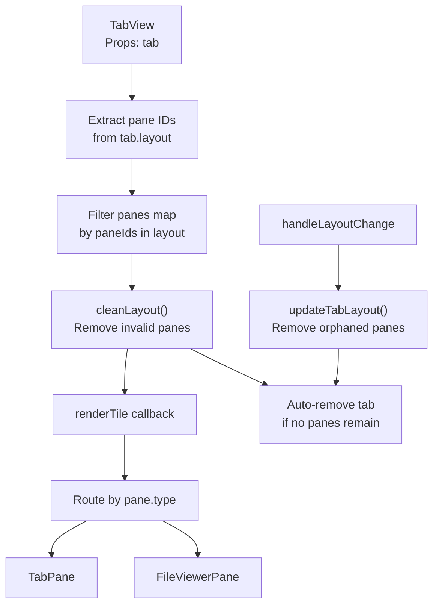
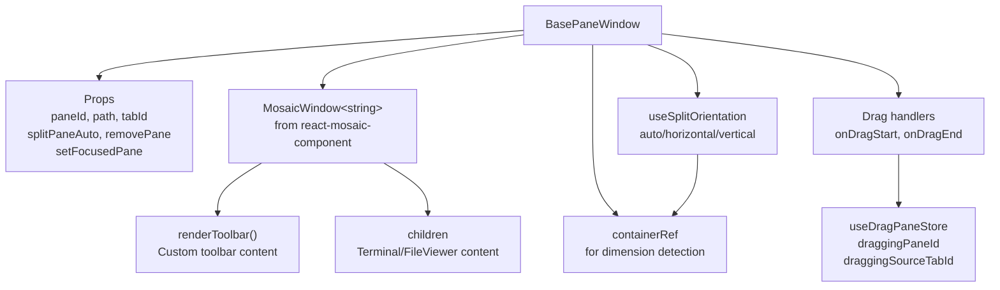
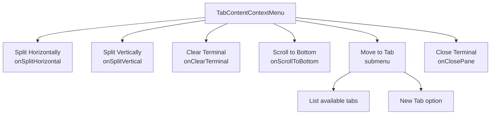

# Mosaic Layout System

<details>
<summary>Relevant source files</summary>

The following files were used as context for generating this wiki page:

- [apps/desktop/src/lib/trpc/routers/ui-state/index.ts](apps/desktop/src/lib/trpc/routers/ui-state/index.ts)
- [apps/desktop/src/renderer/routes/_authenticated/_dashboard/workspace/$workspaceId/page.tsx](apps/desktop/src/renderer/routes/_authenticated/_dashboard/workspace/$workspaceId/page.tsx)
- [apps/desktop/src/renderer/screens/main/components/WorkspaceView/ContentView/TabsContent/GroupStrip/GroupItem.tsx](apps/desktop/src/renderer/screens/main/components/WorkspaceView/ContentView/TabsContent/GroupStrip/GroupItem.tsx)
- [apps/desktop/src/renderer/screens/main/components/WorkspaceView/ContentView/TabsContent/GroupStrip/GroupStrip.tsx](apps/desktop/src/renderer/screens/main/components/WorkspaceView/ContentView/TabsContent/GroupStrip/GroupStrip.tsx)
- [apps/desktop/src/renderer/screens/main/components/WorkspaceView/ContentView/TabsContent/TabContentContextMenu.tsx](apps/desktop/src/renderer/screens/main/components/WorkspaceView/ContentView/TabsContent/TabContentContextMenu.tsx)
- [apps/desktop/src/renderer/screens/main/components/WorkspaceView/ContentView/TabsContent/TabView/FileViewerPane/FileViewerPane.tsx](apps/desktop/src/renderer/screens/main/components/WorkspaceView/ContentView/TabsContent/TabView/FileViewerPane/FileViewerPane.tsx)
- [apps/desktop/src/renderer/screens/main/components/WorkspaceView/ContentView/TabsContent/TabView/FileViewerPane/components/DiffViewerContextMenu/DiffViewerContextMenu.tsx](apps/desktop/src/renderer/screens/main/components/WorkspaceView/ContentView/TabsContent/TabView/FileViewerPane/components/DiffViewerContextMenu/DiffViewerContextMenu.tsx)
- [apps/desktop/src/renderer/screens/main/components/WorkspaceView/ContentView/TabsContent/TabView/FileViewerPane/components/FileEditorContextMenu/FileEditorContextMenu.tsx](apps/desktop/src/renderer/screens/main/components/WorkspaceView/ContentView/TabsContent/TabView/FileViewerPane/components/FileEditorContextMenu/FileEditorContextMenu.tsx)
- [apps/desktop/src/renderer/screens/main/components/WorkspaceView/ContentView/TabsContent/TabView/FileViewerPane/components/FileViewerContent/FileViewerContent.tsx](apps/desktop/src/renderer/screens/main/components/WorkspaceView/ContentView/TabsContent/TabView/FileViewerPane/components/FileViewerContent/FileViewerContent.tsx)
- [apps/desktop/src/renderer/screens/main/components/WorkspaceView/ContentView/TabsContent/TabView/TabPane.tsx](apps/desktop/src/renderer/screens/main/components/WorkspaceView/ContentView/TabsContent/TabView/TabPane.tsx)
- [apps/desktop/src/renderer/screens/main/components/WorkspaceView/ContentView/TabsContent/TabView/index.tsx](apps/desktop/src/renderer/screens/main/components/WorkspaceView/ContentView/TabsContent/TabView/index.tsx)
- [apps/desktop/src/renderer/screens/main/components/WorkspaceView/ContentView/components/EditorContextMenu/EditorContextMenu.tsx](apps/desktop/src/renderer/screens/main/components/WorkspaceView/ContentView/components/EditorContextMenu/EditorContextMenu.tsx)
- [apps/desktop/src/renderer/screens/main/components/WorkspaceView/ContentView/components/PaneContextMenuItems/PaneContextMenuItems.tsx](apps/desktop/src/renderer/screens/main/components/WorkspaceView/ContentView/components/PaneContextMenuItems/PaneContextMenuItems.tsx)
- [apps/desktop/src/renderer/screens/main/components/WorkspaceView/ContentView/components/index.ts](apps/desktop/src/renderer/screens/main/components/WorkspaceView/ContentView/components/index.ts)
- [apps/desktop/src/renderer/stores/tabs/store.ts](apps/desktop/src/renderer/stores/tabs/store.ts)
- [apps/desktop/src/renderer/stores/tabs/terminal-callbacks.ts](apps/desktop/src/renderer/stores/tabs/terminal-callbacks.ts)
- [apps/desktop/src/renderer/stores/tabs/types.ts](apps/desktop/src/renderer/stores/tabs/types.ts)
- [apps/desktop/src/renderer/stores/tabs/utils.test.ts](apps/desktop/src/renderer/stores/tabs/utils.test.ts)
- [apps/desktop/src/renderer/stores/tabs/utils.ts](apps/desktop/src/renderer/stores/tabs/utils.ts)
- [apps/desktop/src/shared/hotkeys.ts](apps/desktop/src/shared/hotkeys.ts)
- [apps/desktop/src/shared/tabs-types.ts](apps/desktop/src/shared/tabs-types.ts)

</details>


## Purpose and Scope

This document explains the pane tiling system that enables flexible split-screen terminal and file viewer layouts within tabs. The system uses the `react-mosaic-component` library to manage a binary tree layout structure where panes can be split horizontally or vertically and rearranged via drag-and-drop.

For information about tab-level operations (creation, switching, removal), see [2.7.2](#2.7.2). For pane types and lifecycle, see [2.7.3](#2.7.3). For drag-and-drop between tabs, see [2.7.5](#2.7.5).

---

## React Mosaic Component Integration

The application uses `react-mosaic-component` (imported at [apps/desktop/src/renderer/screens/main/components/WorkspaceView/ContentView/TabsContent/TabView/index.tsx:1-11]()) to provide a flexible tiling window manager. Each tab maintains a `layout: MosaicNode<string>` property (defined in [apps/desktop/src/renderer/stores/tabs/types.ts:19-21]()) that stores the mosaic's binary tree structure.

The `Mosaic<string>` component renders at the tab level ([apps/desktop/src/renderer/screens/main/components/WorkspaceView/ContentView/TabsContent/TabView/index.tsx:224-231]()) and orchestrates the entire pane layout system:



**Sources:** [apps/desktop/src/renderer/screens/main/components/WorkspaceView/ContentView/TabsContent/TabView/index.tsx:1-11](), [apps/desktop/src/renderer/screens/main/components/WorkspaceView/ContentView/TabsContent/TabView/index.tsx:224-231](), [apps/desktop/src/renderer/stores/tabs/types.ts:19-21]()

---

## Binary Tree Layout Structure

The mosaic layout is stored as a `MosaicNode<string>` (from `react-mosaic-component`, used in [apps/desktop/src/renderer/stores/tabs/types.ts:1]() and [apps/desktop/src/renderer/stores/tabs/store.ts:1]()), which is either:
- A **leaf node**: A string representing a paneId
- A **branch node**: An object with structure `{ direction: 'row' | 'column', first: MosaicNode, second: MosaicNode, splitPercentage?: number }`



The `direction` property determines split orientation:
- `'row'`: Horizontal split (left/right panes)
- `'column'`: Vertical split (top/bottom panes)

The `splitPercentage` (optional, defaults to 50) controls the division ratio between `first` and `second` children.

**Sources:** [apps/desktop/src/renderer/stores/tabs/types.ts:1](), [apps/desktop/src/renderer/stores/tabs/store.ts:1](), [apps/desktop/src/renderer/screens/main/components/WorkspaceView/ContentView/TabsContent/TabView/index.tsx:83-121]()

---

## Pane Paths and Addressing

Each pane in the mosaic tree has a unique path represented as `MosaicBranch[]` (from `react-mosaic-component`, used in [apps/desktop/src/renderer/stores/tabs/types.ts:1]() and passed to split operations), where `MosaicBranch` is a type alias for `'first' | 'second'`. This path describes the traversal from root to the pane's leaf node.

| Path | Description |
|------|-------------|
| `[]` | Root node (single pane, no splits) |
| `['first']` | First child of root split |
| `['second']` | Second child of root split |
| `['second', 'first']` | First child of root's second branch |
| `['first', 'second', 'second']` | Second child of first branch's second child |

The path is passed to `BasePaneWindow` and used for split operations:

```typescript
// When splitting a pane, the path identifies where to insert the new branch
splitPaneAuto(tabId: string, sourcePaneId: string, 
              dimensions: { width: number; height: number }, 
              path?: MosaicBranch[])
```

**Sources:** [apps/desktop/src/renderer/stores/tabs/types.ts:1](), [apps/desktop/src/renderer/screens/main/components/WorkspaceView/ContentView/TabsContent/TabView/TabPane.tsx:2]()

---

## Split Operations

The tabs store provides three split methods ([apps/desktop/src/renderer/stores/tabs/store.ts:954-1065]()), exposed via the `useTabsWithPresets` hook:

### Split Auto

The `splitPaneAuto` method ([apps/desktop/src/renderer/stores/tabs/store.ts:1059-1065]()) automatically determines split direction based on pane dimensions:



### Split Horizontal

The `splitPaneHorizontal` method ([apps/desktop/src/renderer/stores/tabs/store.ts:1007-1057]()) creates a vertical split (top/bottom panes) using `direction: 'column'`:

```
Before:           After:
┌─────────┐      ┌─────────┐
│         │      │  pane1  │
│  pane1  │  →   ├─────────┤
│         │      │  pane2  │
└─────────┘      └─────────┘
```

### Split Vertical

The `splitPaneVertical` method ([apps/desktop/src/renderer/stores/tabs/store.ts:955-1005]()) creates a horizontal split (left/right panes) using `direction: 'row'`:

```
Before:           After:
┌─────────┐      ┌────┬────┐
│         │      │    │    │
│  pane1  │  →   │ p1 │ p2 │
│         │      │    │    │
└─────────┘      └────┴────┘
```

All split operations use the `updateTree` function from `react-mosaic-component` ([apps/desktop/src/renderer/stores/tabs/store.ts:2]()) when a path is provided, allowing precise insertion at any node in the layout tree. The operations:

1. Create a new pane via `createPane(tabId, "terminal", options)` ([apps/desktop/src/renderer/stores/tabs/store.ts:964]())
2. Construct a new branch node at the split location using `updateTree` or direct object creation
3. Update the tab's layout via `set()` with the new `MosaicNode`
4. Set the focused pane to the newly created pane

**Sources:** [apps/desktop/src/renderer/stores/tabs/store.ts:2](), [apps/desktop/src/renderer/stores/tabs/store.ts:954-1065]()

---

## Layout Manipulation Utilities

The tabs store uses several utility functions from [apps/desktop/src/renderer/stores/tabs/utils.ts]() for layout management:

### extractPaneIdsFromLayout

The `extractPaneIdsFromLayout` function ([apps/desktop/src/renderer/stores/tabs/utils.ts:113-124]()) recursively traverses the binary tree to collect all paneIds in the layout in visual navigation order (left-to-right, top-to-bottom):

```typescript
export const extractPaneIdsFromLayout = (
  layout: MosaicNode<string>,
): string[]
```

Used to:
- Validate pane membership in a tab ([apps/desktop/src/renderer/screens/main/components/WorkspaceView/ContentView/TabsContent/TabView/index.tsx:56-59]())
- Detect removed panes during layout changes ([apps/desktop/src/renderer/screens/main/components/WorkspaceView/ContentView/TabsContent/TabView/index.tsx:98-106]())
- Clear attention status for panes in a tab ([apps/desktop/src/renderer/stores/tabs/store.ts:325]())

### cleanLayout

The `cleanLayout` function ([apps/desktop/src/renderer/stores/tabs/utils.ts:359-386]()) removes invalid pane references from the layout tree:

```typescript
export const cleanLayout = (
  layout: MosaicNode<string> | null,
  validPaneIds: Set<string>,
): MosaicNode<string> | null
```

Recursively prunes:
- Leaf nodes with invalid paneIds
- Branch nodes where both children become null after pruning
- Returns null if entire tree becomes invalid

Used in `TabView` ([apps/desktop/src/renderer/screens/main/components/WorkspaceView/ContentView/TabsContent/TabView/index.tsx:74]()) to ensure only valid panes are rendered.

### addPaneToLayout

The `addPaneToLayout` function ([apps/desktop/src/renderer/stores/tabs/utils.ts:486-494]()) appends a pane to an existing layout using a horizontal split:

```typescript
export const addPaneToLayout = (
  existingLayout: MosaicNode<string>,
  newPaneId: string,
): MosaicNode<string>
```

### removePaneFromLayout

The `removePaneFromLayout` function ([apps/desktop/src/renderer/stores/tabs/utils.ts:331-354]()) removes a specific pane from the layout, collapsing the tree structure:

```typescript
export const removePaneFromLayout = (
  layout: MosaicNode<string> | null,
  paneIdToRemove: string,
): MosaicNode<string> | null
```

When removing a pane from a branch, the sibling pane is promoted to replace the branch. Used by the `removePane` store method ([apps/desktop/src/renderer/stores/tabs/store.ts:772]()).

### buildMultiPaneLayout

The `buildMultiPaneLayout` function ([apps/desktop/src/renderer/stores/tabs/utils.ts:500-530]()) constructs balanced multi-pane layouts for presets:

```typescript
export const buildMultiPaneLayout = (
  paneIds: string[],
  direction: "row" | "column" = "column",
): MosaicNode<string>
```

Creates recursive binary splits that alternate direction to produce grid-like layouts. Used when creating tabs with multiple panes ([apps/desktop/src/renderer/stores/tabs/store.ts:193]()).

**Sources:** [apps/desktop/src/renderer/stores/tabs/utils.ts:113-124](), [apps/desktop/src/renderer/stores/tabs/utils.ts:331-354](), [apps/desktop/src/renderer/stores/tabs/utils.ts:359-386](), [apps/desktop/src/renderer/stores/tabs/utils.ts:486-494](), [apps/desktop/src/renderer/stores/tabs/utils.ts:500-530](), [apps/desktop/src/renderer/stores/tabs/store.ts:193](), [apps/desktop/src/renderer/stores/tabs/store.ts:772]()

---

## TabView Orchestration

The `TabView` component ([apps/desktop/src/renderer/screens/main/components/WorkspaceView/ContentView/TabsContent/TabView/index.tsx:29-233]()) coordinates the mosaic system with the tabs store:



Key responsibilities:

1. **Pane Filtering**: Only render panes that belong to this tab ([apps/desktop/src/renderer/screens/main/components/WorkspaceView/ContentView/TabsContent/TabView/index.tsx:62-71]()) by comparing `pane.tabId` with `tab.id`

2. **Layout Cleaning**: Remove references to deleted panes via `cleanLayout(tab.layout, validPaneIds)` ([apps/desktop/src/renderer/screens/main/components/WorkspaceView/ContentView/TabsContent/TabView/index.tsx:73-74]())

3. **Auto-removal**: Delete the tab when all panes are removed via `useEffect` hook ([apps/desktop/src/renderer/screens/main/components/WorkspaceView/ContentView/TabsContent/TabView/index.tsx:77-81]())

4. **Change Detection**: The `handleLayoutChange` callback ([apps/desktop/src/renderer/screens/main/components/WorkspaceView/ContentView/TabsContent/TabView/index.tsx:83-121]()) compares old and new layouts to identify removed panes, but skips panes that were moved to another tab (detected via `pane.tabId !== tab.id`)

5. **Pane Routing**: The `renderPane` callback ([apps/desktop/src/renderer/screens/main/components/WorkspaceView/ContentView/TabsContent/TabView/index.tsx:123-215]()) routes by `paneInfo.type` to render `FileViewerPane` for `'file-viewer'`, `ChatPane` for `'chat'`, or `TabPane` for terminals

**Sources:** [apps/desktop/src/renderer/screens/main/components/WorkspaceView/ContentView/TabsContent/TabView/index.tsx:29-233]()

---

## BasePaneWindow Component

`BasePaneWindow` wraps each pane with `MosaicWindow` from `react-mosaic-component`:



The component:

1. **Dimension Tracking**: Uses `containerRef` to measure pane size for auto-split decisions

2. **Split Orientation Hook**: Uses `useSplitOrientation` to determine whether to split horizontally or vertically based on aspect ratio

3. **Drag-and-Drop**: Sets drag state in `useDragPaneStore` when drag starts/ends, enabling cross-tab pane movement

4. **Focus Management**: Calls `setFocusedPane(tabId, paneId)` when the pane wrapper is clicked

5. **Toolbar Rendering**: Accepts a `renderToolbar` prop that receives handlers (`onSplitPane`, `onClosePane`, `splitOrientation`) for split/close operations

The component is used by both `TabPane` ([apps/desktop/src/renderer/screens/main/components/WorkspaceView/ContentView/TabsContent/TabView/TabPane.tsx:87-129]()) and `FileViewerPane` to provide consistent mosaic integration.

**Sources:** [apps/desktop/src/renderer/screens/main/components/WorkspaceView/ContentView/TabsContent/TabView/TabPane.tsx:87-129]()

---

## Drag-and-Drop Integration

The mosaic system integrates with `react-dnd` (via `dragDropManager` from [apps/desktop/src/renderer/lib/dnd.ts]() passed to the `Mosaic` component at [apps/desktop/src/renderer/screens/main/components/WorkspaceView/ContentView/TabsContent/TabView/index.tsx:229]()) for pane movement both within and across tabs:

| Component | Role | DnD Integration |
|-----------|------|-----------------|
| `BasePaneWindow` | Draggable pane | Sets `draggingPaneId` and `draggingSourceTabId` in `useDragPaneStore` |
| `MosaicWindow` | Built-in drop zones | Handles drops within same tab (split/swap operations) |
| Tab system | Cross-tab drops | See [2.7.5](#2.7.5) for details |

The `MosaicWindow` component from `react-mosaic-component` provides built-in drop zones for rearranging panes within a tab. For cross-tab movement, see the drag-and-drop system described in [2.7.5](#2.7.5).

### Drag State Store

The `useDragPaneStore` Zustand store tracks ephemeral drag state to enable cross-tab validation:

```typescript
interface DragPaneState {
  draggingPaneId: string | null;        // Currently dragging pane
  draggingSourceTabId: string | null;   // Source tab of dragged pane
}
```

This prevents stale closure issues during async drag operations and enables drop targets to validate drop eligibility.

**Sources:** [apps/desktop/src/renderer/lib/dnd.ts](), [apps/desktop/src/renderer/screens/main/components/WorkspaceView/ContentView/TabsContent/TabView/index.tsx:12](), [apps/desktop/src/renderer/screens/main/components/WorkspaceView/ContentView/TabsContent/TabView/index.tsx:229]()

---

## Layout Persistence

Tab layouts are persisted automatically through the tabs store's Zustand persist middleware configured with `trpcTabsStorage` ([apps/desktop/src/renderer/stores/tabs/store.ts:3](), [apps/desktop/src/renderer/stores/tabs/store.ts:1163]()):

```mermaid
graph LR
    UserAction["User splits/closes pane"]
    UpdateStore["updateTabLayout()<br/>or removePane()"]
    TabsStore["useTabsStore<br/>tabs array updated"]
    PersistMiddleware["Zustand persist middleware"]
    TrpcStorage["trpcTabsStorage<br/>custom storage adapter"]
    TrpcMutation["uiState.tabs.set<br/>tRPC mutation"]
    AppState["appState.data.tabsState<br/>lowdb JSON file"]
    
    UserAction --> UpdateStore
    UpdateStore --> TabsStore
    TabsStore --> PersistMiddleware
    PersistMiddleware --> TrpcStorage
    TrpcStorage --> TrpcMutation
    TrpcMutation --> AppState
```



The Zustand persist middleware ([apps/desktop/src/renderer/stores/tabs/store.ts:97-1268]()) automatically syncs state changes to the main process via the `trpcTabsStorage` custom storage adapter ([apps/desktop/src/renderer/lib/trpc-storage.ts]()). The `tab.layout` property is serialized as part of the `tabsState` and persisted in the lowdb JSON file. The `cleanLayout` utility ensures only valid paneIds are persisted.

**Sources:** [apps/desktop/src/renderer/stores/tabs/store.ts:3](), [apps/desktop/src/renderer/stores/tabs/store.ts:97-1268](), [apps/desktop/src/renderer/lib/trpc-storage.ts](), [apps/lib/trpc/routers/ui-state/index.ts:52-82]()

---

## Custom Mosaic Styling

The application applies custom CSS via `mosaic-theme.css` ([apps/desktop/src/renderer/screens/main/components/WorkspaceView/ContentView/TabsContent/TabView/index.tsx:2]()) to override react-mosaic's default styles:

| Selector | Customization |
|----------|---------------|
| `.mosaic-window` | Border: 0.5px solid `--color-border`, no box-shadow |
| `.mosaic-window-toolbar` | Background: `--color-tertiary`, height: 28px |
| `.mosaic-window-focused .mosaic-window-toolbar` | Background: `--color-secondary` |
| `.mosaic-window-controls` | Opacity: 0 by default, 1 on hover/focus |
| `.mosaic-split` | Transparent background, custom cursor |
| `.drop-target-hover` | Blue overlay with opacity during drop preview |

The `.mosaic-theme-dark` class is applied to the root `Mosaic` component to scope these overrides ([apps/desktop/src/renderer/screens/main/components/WorkspaceView/ContentView/TabsContent/TabView/index.tsx:228]()).

**Sources:** [apps/desktop/src/renderer/screens/main/components/WorkspaceView/ContentView/TabsContent/TabView/index.tsx:2](), [apps/desktop/src/renderer/screens/main/components/WorkspaceView/ContentView/TabsContent/TabView/index.tsx:228]()

---

## Context Menu Integration

The `TabContentContextMenu` component provides right-click actions for panes:



The context menu wraps the pane content and provides split/move operations as an alternative to the toolbar buttons and drag-and-drop ([apps/desktop/src/renderer/screens/main/components/WorkspaceView/ContentView/TabsContent/TabContentContextMenu.tsx:1-114]()).

**Sources:** [apps/desktop/src/renderer/screens/main/components/WorkspaceView/ContentView/TabsContent/TabContentContextMenu.tsx:1-114](), [apps/desktop/src/renderer/screens/main/components/WorkspaceView/ContentView/TabsContent/TabView/TabPane.tsx:114-128]()