# Pane Types and Management

<details>
<summary>Relevant source files</summary>

The following files were used as context for generating this wiki page:

- [apps/desktop/src/lib/trpc/routers/ui-state/index.ts](apps/desktop/src/lib/trpc/routers/ui-state/index.ts)
- [apps/desktop/src/renderer/routes/\_authenticated/\_dashboard/workspace/$workspaceId/page.tsx](apps/desktop/src/renderer/routes/_authenticated/_dashboard/workspace/$workspaceId/page.tsx)
- [apps/desktop/src/renderer/screens/main/components/WorkspaceView/ContentView/TabsContent/GroupStrip/GroupItem.tsx](apps/desktop/src/renderer/screens/main/components/WorkspaceView/ContentView/TabsContent/GroupStrip/GroupItem.tsx)
- [apps/desktop/src/renderer/screens/main/components/WorkspaceView/ContentView/TabsContent/GroupStrip/GroupStrip.tsx](apps/desktop/src/renderer/screens/main/components/WorkspaceView/ContentView/TabsContent/GroupStrip/GroupStrip.tsx)
- [apps/desktop/src/renderer/screens/main/components/WorkspaceView/ContentView/TabsContent/TabContentContextMenu.tsx](apps/desktop/src/renderer/screens/main/components/WorkspaceView/ContentView/TabsContent/TabContentContextMenu.tsx)
- [apps/desktop/src/renderer/screens/main/components/WorkspaceView/ContentView/TabsContent/TabView/FileViewerPane/FileViewerPane.tsx](apps/desktop/src/renderer/screens/main/components/WorkspaceView/ContentView/TabsContent/TabView/FileViewerPane/FileViewerPane.tsx)
- [apps/desktop/src/renderer/screens/main/components/WorkspaceView/ContentView/TabsContent/TabView/FileViewerPane/components/DiffViewerContextMenu/DiffViewerContextMenu.tsx](apps/desktop/src/renderer/screens/main/components/WorkspaceView/ContentView/TabsContent/TabView/FileViewerPane/components/DiffViewerContextMenu/DiffViewerContextMenu.tsx)
- [apps/desktop/src/renderer/screens/main/components/WorkspaceView/ContentView/TabsContent/TabView/FileViewerPane/components/FileEditorContextMenu/FileEditorContextMenu.tsx](apps/desktop/src/renderer/screens/main/components/WorkspaceView/ContentView/TabsContent/TabView/FileViewerPane/components/FileEditorContextMenu/FileEditorContextMenu.tsx)
- [apps/desktop/src/renderer/screens/main/components/WorkspaceView/ContentView/TabsContent/TabView/FileViewerPane/components/FileViewerContent/FileViewerContent.tsx](apps/desktop/src/renderer/screens/main/components/WorkspaceView/ContentView/TabsContent/TabView/FileViewerPane/components/FileViewerContent/FileViewerContent.tsx)
- [apps/desktop/src/renderer/screens/main/components/WorkspaceView/ContentView/TabsContent/TabView/TabPane.tsx](apps/desktop/src/renderer/screens/main/components/WorkspaceView/ContentView/TabsContent/TabView/TabPane.tsx)
- [apps/desktop/src/renderer/screens/main/components/WorkspaceView/ContentView/TabsContent/TabView/index.tsx](apps/desktop/src/renderer/screens/main/components/WorkspaceView/ContentView/TabsContent/TabView/index.tsx)
- [apps/desktop/src/renderer/screens/main/components/WorkspaceView/ContentView/components/EditorContextMenu/EditorContextMenu.tsx](apps/desktop/src/renderer/screens/main/components/WorkspaceView/ContentView/components/EditorContextMenu/EditorContextMenu.tsx)
- [apps/desktop/src/renderer/screens/main/components/WorkspaceView/ContentView/components/PaneContextMenuItems/PaneContextMenuItems.tsx](apps/desktop/src/renderer/screens/main/components/WorkspaceView/ContentView/components/PaneContextMenuItems/PaneContextMenuItems.tsx)
- [apps/desktop/src/renderer/screens/main/components/WorkspaceView/ContentView/components/index.ts](apps/desktop/src/renderer/screens/main/components/WorkspaceView/ContentView/components/index.ts)
- [apps/desktop/src/renderer/stores/tabs/store.ts](apps/desktop/src/renderer/stores/tabs/store.ts)
- [apps/desktop/src/renderer/stores/tabs/terminal-callbacks.ts](apps/desktop/src/renderer/stores/tabs/terminal-callbacks.ts)
- [apps/desktop/src/renderer/stores/tabs/types.ts](apps/desktop/src/renderer/stores/tabs/types.ts)
- [apps/desktop/src/renderer/stores/tabs/utils.test.ts](apps/desktop/src/renderer/stores/tabs/utils.test.ts)
- [apps/desktop/src/renderer/stores/tabs/utils.ts](apps/desktop/src/renderer/stores/tabs/utils.ts)
- [apps/desktop/src/shared/hotkeys.ts](apps/desktop/src/shared/hotkeys.ts)
- [apps/desktop/src/shared/tabs-types.ts](apps/desktop/src/shared/tabs-types.ts)

</details>

## Purpose and Scope

This document describes the three types of panes (terminal, file-viewer, webview) supported by the tab system, their state models, and how panes are created, managed, and removed. Panes are the leaf nodes in a tab's Mosaic layout tree and represent the actual content units users interact with.

For information about how panes are arranged in layouts, see [Mosaic Layout System](#2.7.4). For tab-level operations, see [Tab Lifecycle and Operations](#2.7.2). For the overall state architecture, see [Tab Store Architecture](#2.7.1).

---

## Pane Types Overview

The system supports five distinct pane types, each serving a different purpose within the workspace environment.

### Type Hierarchy

**Pane Type Enumeration**

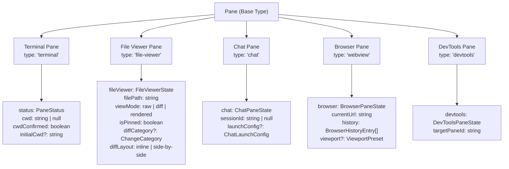

| Type          | Purpose                      | Primary Use Case                                    | State Extension                                 |
| ------------- | ---------------------------- | --------------------------------------------------- | ----------------------------------------------- |
| `terminal`    | Interactive shell session    | Running commands, agents, builds                    | `status`, `cwd`, `initialCwd`                   |
| `file-viewer` | File content display/editing | Viewing diffs, editing files, markdown preview      | `fileViewer` object with mode and path          |
| `chat`        | AI chat interface            | Conversational AI assistance with workspace context | `chat` object with session ID and launch config |
| `webview`     | Embedded browser             | In-app web browsing, previewing web apps            | `browser` object with navigation history        |
| `devtools`    | Browser developer tools      | Debugging webview panes                             | `devtools` object with target pane reference    |

Sources: [apps/desktop/src/shared/tabs-types.ts:10-16](), [apps/desktop/src/shared/tabs-types.ts:129-145](), [apps/desktop/src/renderer/stores/tabs/types.ts:9-16]()

**Pane Routing in TabView**

The `TabView` component's `renderPane` callback routes pane rendering based on type:

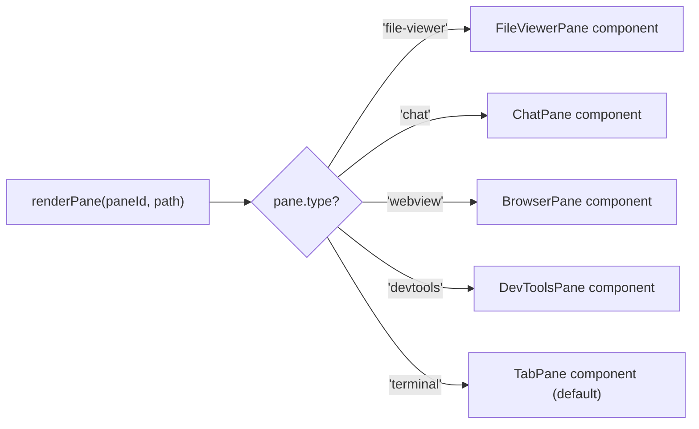

The routing logic is implemented in [apps/desktop/src/renderer/screens/main/components/WorkspaceView/ContentView/TabsContent/TabView/index.tsx:156-260]().

Sources: [apps/desktop/src/shared/tabs-types.ts:10-16](), [apps/desktop/src/renderer/screens/main/components/WorkspaceView/ContentView/TabsContent/TabView/index.tsx:156-260]()

---

## Pane State Model

Every pane, regardless of type, shares a common base structure with type-specific extensions.

### Core Pane Fields

```typescript
interface Pane {
  id: string // Unique identifier (e.g., "pane-1234567890-abc")
  tabId: string // Parent tab reference
  type: PaneType // "terminal" | "file-viewer" | "chat" | "webview" | "devtools"
  name: string // Display name (e.g., "Terminal", "App.tsx", "Chat")
  userTitle?: string // User-defined custom title
  status?: PaneStatus // Agent/terminal status for UI indicators
  isNew?: boolean // If true, shows "new" indicator in UI
  cwd?: string | null // Current working directory (terminals only)
  cwdConfirmed?: boolean // If true, cwd is from OSC 7 escape sequence
  initialCwd?: string // Initial working directory override
  fileViewer?: FileViewerState // File viewer configuration
  chat?: ChatPaneState // Chat session configuration
  browser?: BrowserPaneState // Browser navigation state
  devtools?: DevToolsPaneState // DevTools target reference
}
```

**Field Semantics**

- **`id`**: Generated via `generateId("pane")` using timestamp + random suffix ([apps/desktop/src/renderer/stores/tabs/utils.ts:45-46]())
- **`tabId`**: Immutable after creation; determines which tab contains the pane
- **`name`**: Defaults to "Terminal" for terminals, filename for file viewers, "Chat" for chat panes
- **`userTitle`**: Optional user-defined title that overrides the auto-generated name
- **`isNew`**: Cleared via `markPaneAsUsed` when terminal establishes connection ([apps/desktop/src/renderer/stores/tabs/store.ts:1013-1024]())
- **`cwd`** and **`cwdConfirmed`**: Updated via `updatePaneCwd` from terminal host ([apps/desktop/src/renderer/stores/tabs/store.ts:1130-1148]())
- **`initialCwd`**: Consumed once, then cleared via `clearPaneInitialData` ([apps/desktop/src/renderer/stores/tabs/store.ts:1224-1241]())

Sources: [apps/desktop/src/shared/tabs-types.ts:129-145](), [apps/desktop/src/renderer/stores/tabs/store.ts:1013-1024](), [apps/desktop/src/renderer/stores/tabs/store.ts:1130-1148](), [apps/desktop/src/renderer/stores/tabs/store.ts:1224-1241]()

### Pane Status State Machine

The `status` field drives UI indicators for agent/terminal activity. It uses a four-state model.

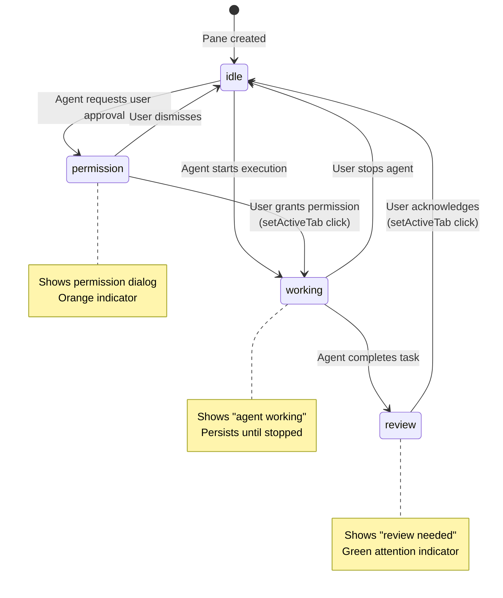

**Status Transitions**

| From         | To           | Trigger                        | Location                             |
| ------------ | ------------ | ------------------------------ | ------------------------------------ |
| `idle`       | `permission` | Agent requests approval        | `setPaneStatus` action               |
| `permission` | `working`    | User clicks tab (auto-grant)   | `setActiveTab` [store.ts:219-222]()  |
| `working`    | `review`     | Agent emits completion event   | `setPaneStatus` action               |
| `review`     | `idle`       | User clicks tab (acknowledge)  | `setActiveTab` [store.ts:215-218]()  |
| `working`    | `idle`       | App restart (transient status) | Persist `merge` [store.ts:930-933]() |

**Important Invariant**: The `working` status is **not** cleared by clicking the tab. It persists until the agent explicitly stops or the user manually stops it, ensuring users don't accidentally dismiss long-running tasks.

Sources: [apps/desktop/src/renderer/stores/tabs/store.ts:209-237](), [apps/desktop/src/renderer/stores/tabs/store.ts:618-630](), [apps/desktop/src/renderer/stores/tabs/store.ts:923-935]()

---

## Pane Creation

Panes are created through several pathways depending on their type and context.

### Terminal Pane Creation

**Direct Creation via `createPane`**

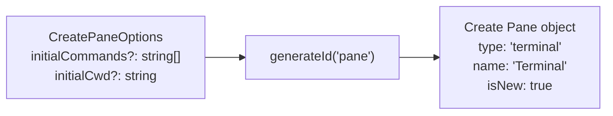

Terminal panes are created when:

1. User clicks "New Tab" → `addTab` creates tab + initial terminal pane
2. User splits a pane → `splitPaneVertical/Horizontal/Auto` creates new terminal
3. User runs a command in a new pane → passes `initialCommands` and `initialCwd`

The `createPane` utility ([apps/desktop/src/renderer/stores/tabs/utils.ts:140-156]()) generates a unique ID and sets defaults. The `initialCommands` and `initialCwd` fields are consumed by the terminal component on mount, then cleared via `clearPaneInitialData` to prevent re-execution.

Sources: [apps/desktop/src/renderer/stores/tabs/utils.ts:140-156](), [apps/desktop/src/renderer/stores/tabs/store.ts:106-142]()

### Chat Pane Creation

Chat panes are created through the `addChatTab` action or via `createChatPane` utility.

**Creation Flow**

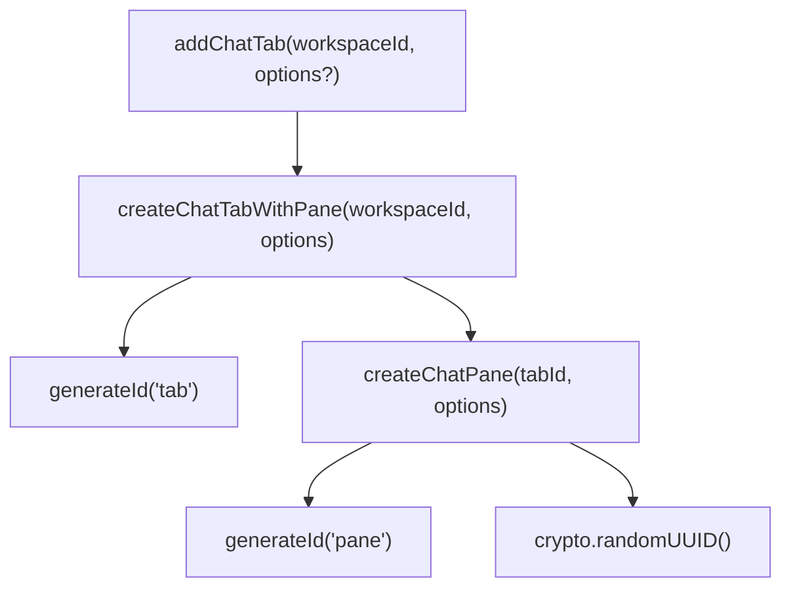

**Chat Pane State**

```typescript
{
  id: "pane-...",
  tabId: "tab-...",
  type: "chat",
  name: "New Chat",
  chat: {
    sessionId: "uuid-v4-string",
    launchConfig?: {
      initialPrompt?: string,
      draftInput?: string,
      initialFiles?: Array<{data, mediaType, filename}>,
      metadata?: { model?: string },
      retryCount?: number
    }
  }
}
```

The `createChatPane` function ([apps/desktop/src/renderer/stores/tabs/utils.ts:232-249]()) creates a pane with a unique session ID using `crypto.randomUUID()`. The `createChatTabWithPane` function ([apps/desktop/src/renderer/stores/tabs/utils.ts:330-346]()) atomically creates both tab and pane, with the name "New Chat" (auto-title will be set from session data).

**Chat Launch Configuration**

The `launchConfig` field supports pre-populating chat sessions with:

- `initialPrompt`: First message to send automatically
- `draftInput`: Text to pre-fill in the input box
- `initialFiles`: Attachments to include with the first message
- `metadata.model`: Override the default AI model
- `retryCount`: For retry attempts tracking

This configuration is set via `setChatLaunchConfig` ([apps/desktop/src/renderer/stores/tabs/store.ts:1451-1468]()) and consumed by the chat UI component.

**Session Switching**

Chat panes support switching between different chat sessions via `switchChatSession`:

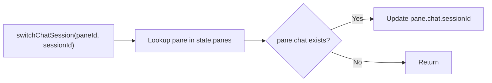

This allows users to maintain multiple concurrent chat conversations within the same pane slot.

Sources: [apps/desktop/src/renderer/stores/tabs/utils.ts:232-249](), [apps/desktop/src/renderer/stores/tabs/utils.ts:330-346](), [apps/desktop/src/renderer/stores/tabs/store.ts:197-235](), [apps/desktop/src/renderer/stores/tabs/store.ts:1431-1468](), [apps/desktop/src/shared/tabs-types.ts:147-165]()

### File Viewer Pane Creation

File viewer panes have more complex creation logic due to the preview vs pinned distinction.

**Creation Flow via `addFileViewerPane`**

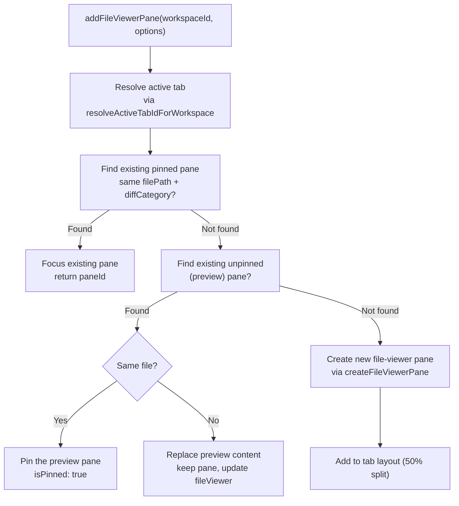

**Preview vs Pinned Logic**

The system implements a "single preview slot" pattern per tab:

- **Pinned panes**: Permanent until explicitly closed. Multiple pinned panes can coexist.
- **Preview panes**: Temporary, shown with italic name. Only one preview pane per tab; clicking another file replaces it.
- **Pin on click again**: Clicking the same file in the preview pane pins it.
- **Auto-pin on edit**: Editing an unpinned file viewer auto-pins it ([FileViewerPane.tsx:133-137]()).

Sources: [apps/desktop/src/renderer/stores/tabs/store.ts:528-748](), [apps/desktop/src/renderer/stores/tabs/utils.ts:179-213]()

### `createFileViewerPane` Implementation

The utility function determines default view mode based on file type and diff category via `resolveFileViewerMode`:

**View Mode Resolution Logic**

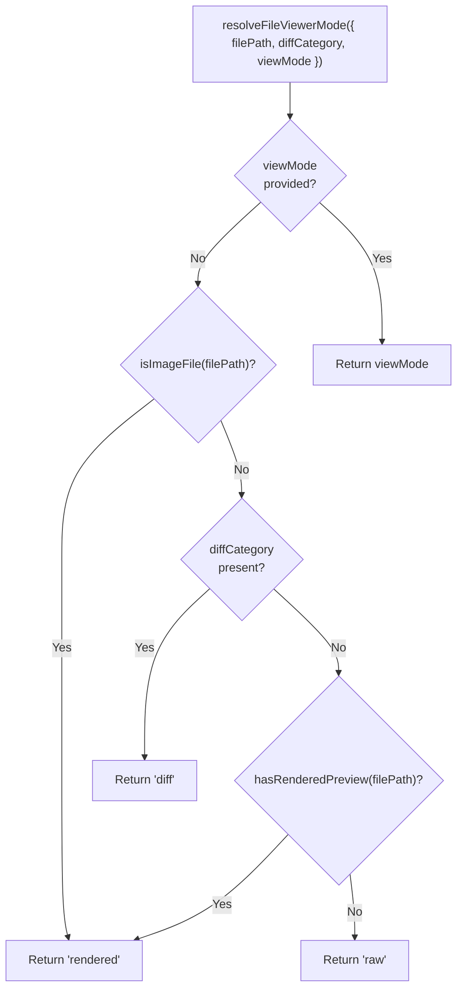

File viewer state includes:

- `filePath`: Worktree-relative file path
- `viewMode`: `"raw" | "diff" | "rendered"`
- `isPinned`: `false` for preview, `true` for permanent
- `diffLayout`: `"inline" | "side-by-side"`
- `diffCategory`: `"staged" | "unstaged" | "committed" | "against-base"`
- `commitHash`: For viewing historical versions
- `oldPath`: For renamed files in diffs
- `initialLine` / `initialColumn`: Scroll-to position for raw mode (transient)

The `createFileViewerPane` function is implemented in [apps/desktop/src/renderer/stores/tabs/utils.ts:179-213](). The view mode resolution logic is in [apps/desktop/src/renderer/stores/tabs/utils.ts:11-26]().

Sources: [apps/desktop/src/renderer/stores/tabs/utils.ts:18-40](), [apps/desktop/src/renderer/stores/tabs/utils.ts:194-230]()

### Browser Pane Creation

Browser (webview) panes are created through the `addBrowserTab` action or via `createBrowserPane` utility.

**Creation Flow**

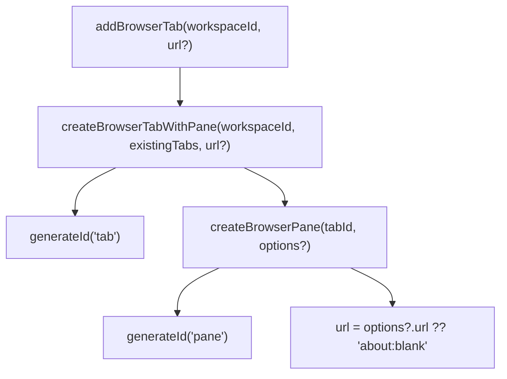

**Browser Pane State**

```typescript
{
  id: "pane-...",
  tabId: "tab-...",
  type: "webview",
  name: "Browser",
  browser: {
    currentUrl: "https://example.com",
    history: [
      { url: "https://example.com", title: "Example", timestamp: 1234567890, faviconUrl?: "..." }
    ],
    historyIndex: 0,
    isLoading: false,
    error?: { code: "...", message: "..." },
    viewport?: { name: "iPhone 14", width: 390, height: 844 }
  }
}
```

The `createBrowserPane` function ([apps/desktop/src/renderer/stores/tabs/utils.ts:263-284]()) creates a pane with navigation history tracking. The `createBrowserTabWithPane` function ([apps/desktop/src/renderer/stores/tabs/utils.ts:307-328]()) atomically creates both tab and pane, with auto-incrementing browser names (e.g., "Browser 1", "Browser 2").

**Navigation State Management**

Browser panes maintain a history stack similar to web browsers:

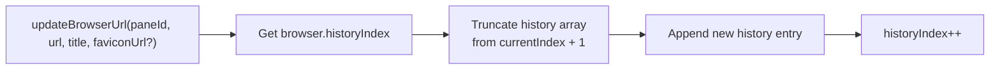

Navigation history supports:

- `navigateBrowserHistory(paneId, direction)` - Back/forward navigation ([apps/desktop/src/renderer/stores/tabs/store.ts:1348-1377]())
- `updateBrowserUrl(paneId, url, title, faviconUrl?)` - Record new navigation ([apps/desktop/src/renderer/stores/tabs/store.ts:1316-1346]())
- `updateBrowserLoading(paneId, isLoading)` - Loading state indicator ([apps/desktop/src/renderer/stores/tabs/store.ts:1379-1391]())
- `setBrowserError(paneId, error)` - Error handling for failed loads ([apps/desktop/src/renderer/stores/tabs/store.ts:1393-1405]())
- `setBrowserViewport(paneId, viewport)` - Responsive design testing ([apps/desktop/src/renderer/stores/tabs/store.ts:1407-1419]())

Sources: [apps/desktop/src/renderer/stores/tabs/utils.ts:263-328](), [apps/desktop/src/renderer/stores/tabs/store.ts:1287-1419](), [apps/desktop/src/shared/tabs-types.ts:167-189]()

### DevTools Pane Creation

DevTools panes are created to debug browser (webview) panes. They have a special relationship where closing the target browser pane also closes its DevTools pane.

**Creation Flow**

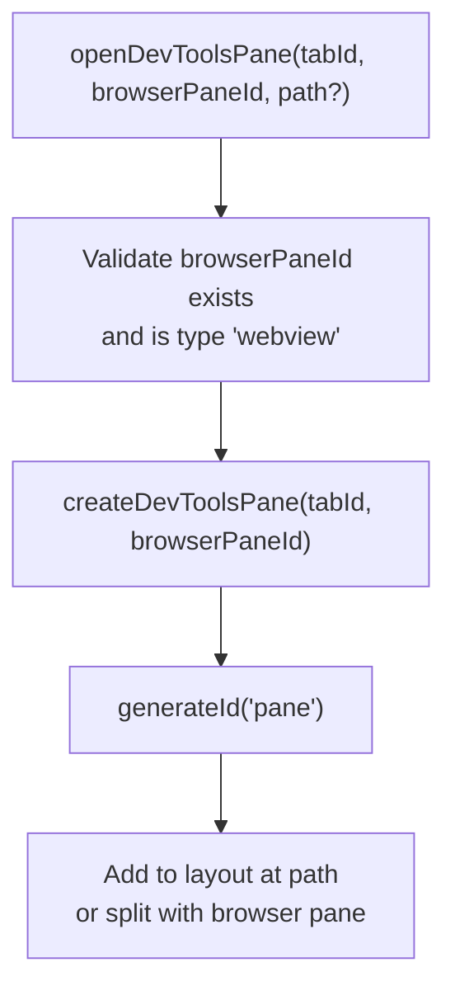

**DevTools Pane State**

```typescript
{
  id: "pane-...",
  tabId: "tab-...",
  type: "devtools",
  name: "DevTools",
  devtools: {
    targetPaneId: "pane-..." // References the browser pane
  }
}
```

The `createDevToolsPane` function ([apps/desktop/src/renderer/stores/tabs/utils.ts:289-301]()) creates a pane that targets a specific browser pane. The `openDevToolsPane` action ([apps/desktop/src/renderer/stores/tabs/store.ts:1421-1449]()) handles the full flow including layout updates.

**Cascade Cleanup**

When a browser pane is removed, all DevTools panes targeting it are automatically removed as well ([apps/desktop/src/renderer/stores/tabs/store.ts:927-933]()):

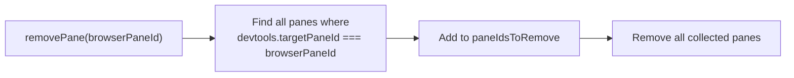

Sources: [apps/desktop/src/renderer/stores/tabs/utils.ts:289-301](), [apps/desktop/src/renderer/stores/tabs/store.ts:1421-1449](), [apps/desktop/src/renderer/stores/tabs/store.ts:919-987]()

---

## Preview vs Pinned File Viewers

The preview mechanism reduces tab clutter by allowing users to quickly browse files without creating a permanent pane for each one.

### Behavior Comparison

| Aspect             | Preview Pane                                       | Pinned Pane            |
| ------------------ | -------------------------------------------------- | ---------------------- |
| Visual indicator   | Italic filename + "preview" label                  | Normal filename        |
| Replacement        | Replaced by next file click                        | Persists until closed  |
| Edit behavior      | Auto-pins on edit ([FileViewerPane.tsx:133-137]()) | Already pinned         |
| Double-click       | Pins the pane                                      | No-op                  |
| Single-click again | Pins the pane                                      | No-op (already pinned) |
| Toolbar icon       | Shows pin icon to manually pin                     | No pin icon            |

### State Transitions

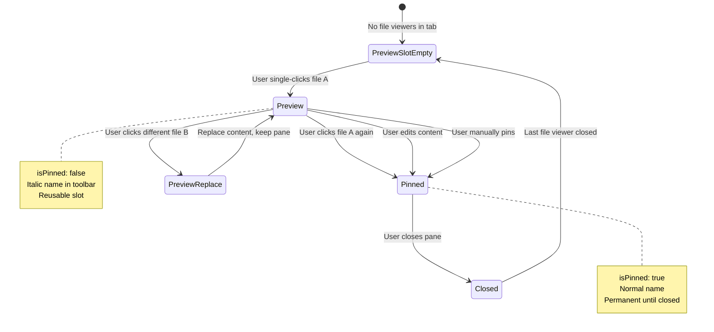

**Implementation Details**

The search for reusable preview panes ([apps/desktop/src/renderer/stores/tabs/store.ts:585-592]()) filters for:

```typescript
p?.type === 'file-viewer' && p.fileViewer && !p.fileViewer.isPinned
```

When a preview pane is found and it's the same file ([apps/desktop/src/renderer/stores/tabs/store.ts:604-608]()), the system just focuses it. If it's a different file, the content is replaced ([apps/desktop/src/renderer/stores/tabs/store.ts:641-675]()).

Sources: [apps/desktop/src/renderer/stores/tabs/store.ts:528-748]()

---

## Pane Removal and Cleanup

Pane removal requires careful cleanup of terminal sessions, layout updates, and focus management.

### Removal Flow

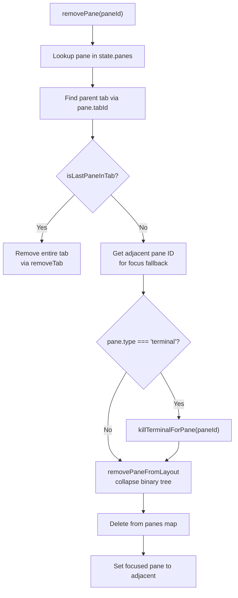

**Critical Invariant**: The adjacent pane ID must be computed **before** removing the pane from the layout ([apps/desktop/src/renderer/stores/tabs/store.ts:765]()). After layout update, the removed pane is no longer findable.

**Terminal Cleanup**

When removing a terminal pane, `killTerminalForPane` is called to:

1. Send exit signal to the terminal host daemon
2. Clean up IPC subscriptions
3. Remove history listeners

File viewer and chat panes require no cleanup beyond state removal since they hold no active system resources.

Sources: [apps/desktop/src/renderer/stores/tabs/store.ts:750-799](), [apps/desktop/src/renderer/stores/tabs/utils/terminal-cleanup.ts:1-20]()

### Last Pane Special Case

When removing the last pane in a tab, the entire tab is removed instead of leaving an empty tab ([apps/desktop/src/renderer/stores/tabs/store.ts:759-762]()). This maintains the invariant that every tab has at least one pane.

The `isLastPaneInTab` check ([apps/desktop/src/renderer/stores/tabs/utils.ts:320-325]()) counts panes by filtering the panes map for `pane.tabId === tabId`.

Sources: [apps/desktop/src/renderer/stores/tabs/utils.ts:320-325](), [apps/desktop/src/renderer/stores/tabs/store.ts:759-762]()

---

## Pane Operations and Updates

Beyond creation and removal, panes support several update operations for state synchronization and user interaction.

### Focus Management

```typescript
setFocusedPane(tabId: string, paneId: string)
```

Updates `focusedPaneIds[tabId]` to track which pane has focus. This is used for:

- Keyboard navigation (next/prev pane hotkeys)
- Terminal input routing
- Visual focus indicator in `BasePaneWindow`

The operation validates that `pane.tabId === tabId` before updating and automatically acknowledges any attention status ([apps/desktop/src/renderer/stores/tabs/store.ts:801-816]()).

Sources: [apps/desktop/src/renderer/stores/tabs/store.ts:801-816]()

### Status Updates

```typescript
setPaneStatus(paneId: string, status: PaneStatus)
```

Updates the status field, typically called by agent lifecycle event listeners. Includes a no-op guard if status hasn't changed to avoid unnecessary re-renders ([apps/desktop/src/renderer/stores/tabs/store.ts:831-842]()).

```typescript
clearWorkspaceAttentionStatus(workspaceId: string)
```

Batch operation to clear attention statuses (`review` and `permission`) across all panes in a workspace. Used when switching to a workspace to acknowledge all pending notifications ([apps/desktop/src/renderer/stores/tabs/store.ts:863-889]()).

Sources: [apps/desktop/src/renderer/stores/tabs/store.ts:831-889]()

### CWD Tracking

```typescript
updatePaneCwd(paneId: string, cwd: string | null, confirmed: boolean)
```

Updates current working directory for terminal panes. The `confirmed` flag distinguishes:

- **confirmed = true**: CWD from OSC 7 escape sequence (shell integration)
- **confirmed = false**: CWD from heuristic (initial spawn directory)

Includes a no-op guard to avoid re-renders when CWD hasn't changed ([apps/desktop/src/renderer/stores/tabs/store.ts:891-909]()).

Sources: [apps/desktop/src/renderer/stores/tabs/store.ts:891-909]()

### Pin Operation

```typescript
pinPane(paneId: string)
```

Converts a preview file-viewer pane to a pinned pane by setting `fileViewer.isPinned = true`. Includes guards to:

- Ignore non-file-viewer panes
- Skip if already pinned (no-op)

This is called when:

- User manually clicks the pin icon in the toolbar
- User edits content in an unpinned file viewer (auto-pin)
- User clicks the same file twice in the preview pane

Sources: [apps/desktop/src/renderer/stores/tabs/store.ts:934-952]()

### Initial Data Lifecycle

```typescript
markPaneAsUsed(paneId: string)
clearPaneInitialData(paneId: string)
```

These operations manage the lifecycle of transient initialization data:

- `markPaneAsUsed`: Clears the `isNew` flag, removing the "new" UI indicator
- `clearPaneInitialData`: Removes `initialCommands` and `initialCwd` after consumption

Both include no-op guards to avoid unnecessary re-renders ([apps/desktop/src/renderer/stores/tabs/store.ts:818-829](), [apps/desktop/src/renderer/stores/tabs/store.ts:911-932]()).

Sources: [apps/desktop/src/renderer/stores/tabs/store.ts:818-932]()

### Chat Session Management

```typescript
switchChatSession(paneId: string, sessionId: string)
```

Switches a chat pane to a different session. This allows users to maintain multiple concurrent chat conversations and switch between them without losing context. The operation validates that the pane is a chat pane before updating.

**Implementation**

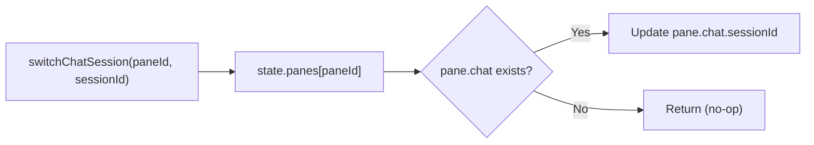

Sources: [apps/desktop/src/renderer/stores/tabs/store.ts:1115-1129]()

---

## Type-Specific Pane State

### Terminal Pane State Extensions

Terminal panes extend the base pane type with execution-related fields:

```typescript
{
  type: "terminal",
  status?: "idle" | "working" | "permission" | "review",
  cwd?: string | null,
  cwdConfirmed?: boolean,
  initialCommands?: string[],
  initialCwd?: string
}
```

These fields are managed by the terminal system (see [Terminal System](#2.8)) and are read by the UI to display directory navigator breadcrumbs and status indicators.

Sources: [apps/desktop/src/shared/tabs-types.ts:15-45]()

### File Viewer Pane State Extensions

File viewer panes extend the base with a rich `fileViewer` object:

```typescript
{
  type: "file-viewer",
  fileViewer: {
    filePath: string,
    viewMode: "raw" | "diff" | "rendered",
    isPinned: boolean,
    diffLayout: "inline" | "side-by-side",
    diffCategory?: "staged" | "unstaged" | "committed" | "against-base",
    commitHash?: string,
    oldPath?: string,
    initialLine?: number,
    initialColumn?: number
  }
}
```

The file viewer implementation ([FileViewerPane.tsx]()) reads these fields to:

- Fetch file content via tRPC (`readWorkingFile` or `getFileContents`)
- Configure Monaco editor or DiffViewer
- Show appropriate toolbar controls (mode toggle, diff options)
- Scroll to initial line/column on mount

Sources: [apps/desktop/src/shared/tabs-types.ts:47-75](), [apps/desktop/src/renderer/screens/main/components/WorkspaceView/ContentView/TabsContent/TabView/FileViewerPane/FileViewerPane.tsx:44-334]()
