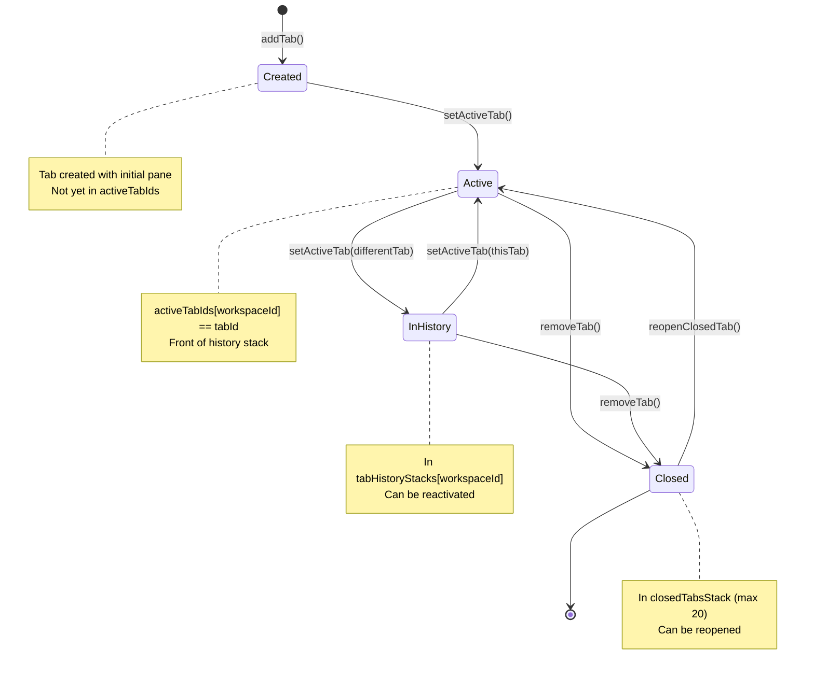
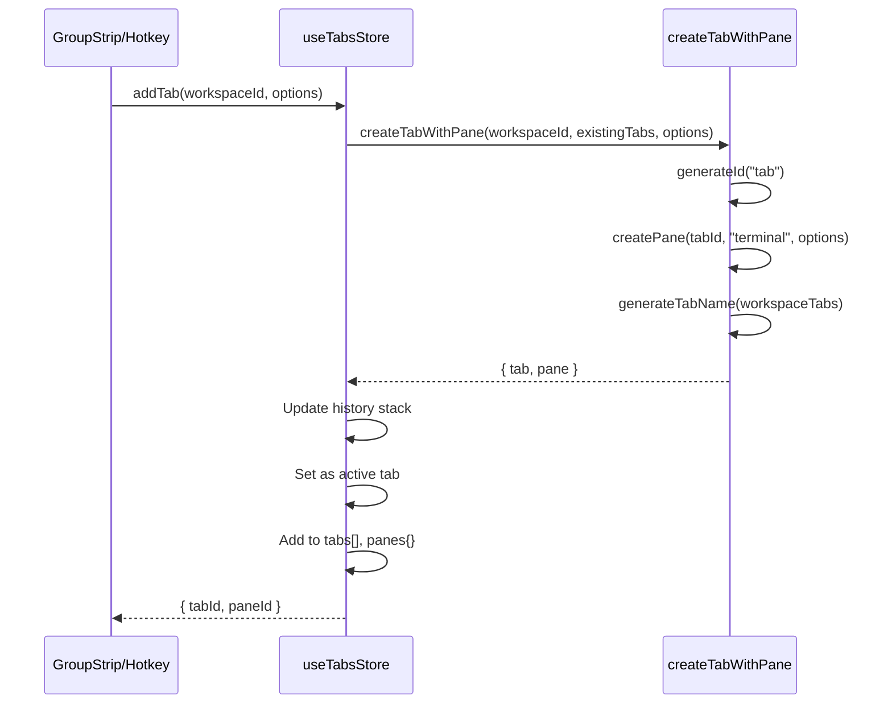
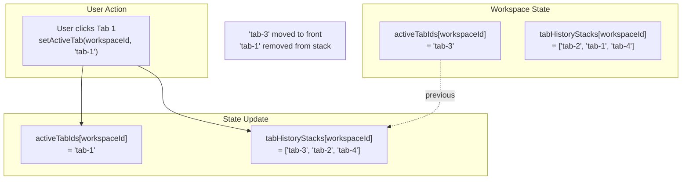
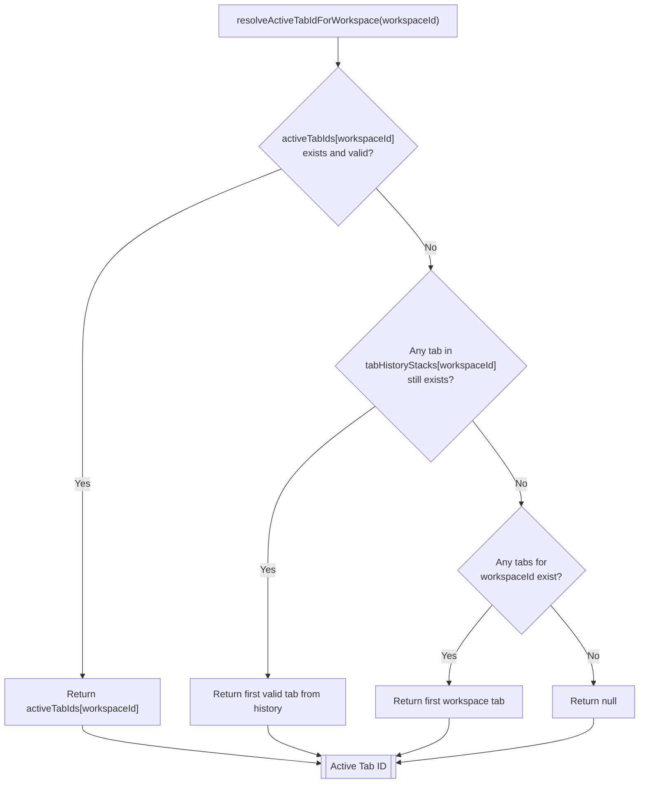
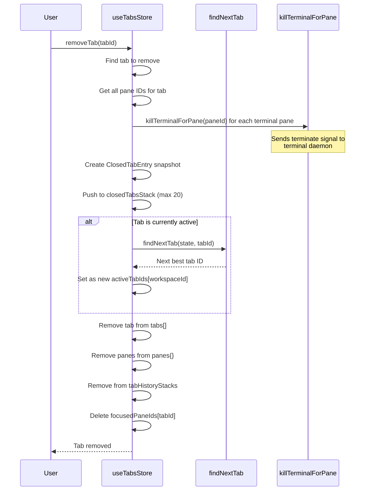
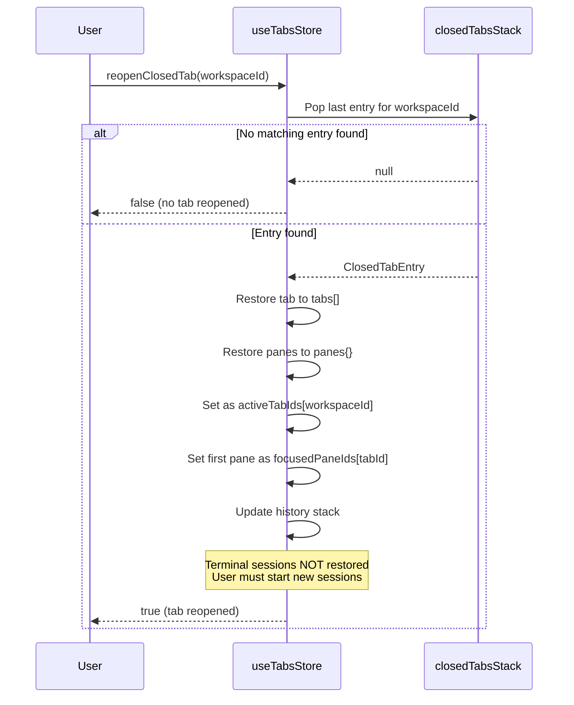
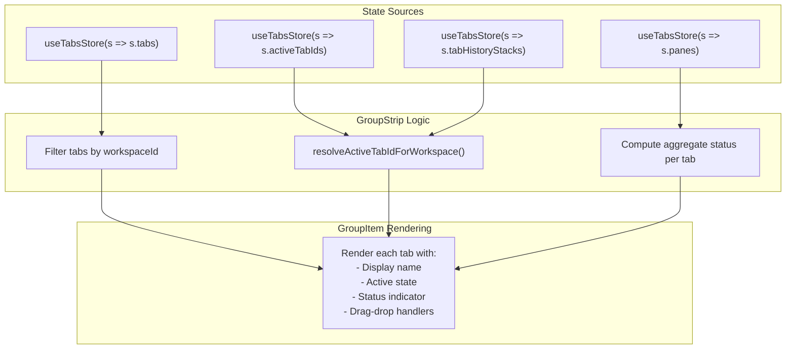

# Tab Lifecycle and History

<details>
<summary>Relevant source files</summary>

The following files were used as context for generating this wiki page:

- [apps/desktop/src/lib/trpc/routers/ui-state/index.ts](apps/desktop/src/lib/trpc/routers/ui-state/index.ts)
- [apps/desktop/src/renderer/routes/_authenticated/_dashboard/workspace/$workspaceId/page.tsx](apps/desktop/src/renderer/routes/_authenticated/_dashboard/workspace/$workspaceId/page.tsx)
- [apps/desktop/src/renderer/screens/main/components/WorkspaceView/ContentView/TabsContent/GroupStrip/GroupItem.tsx](apps/desktop/src/renderer/screens/main/components/WorkspaceView/ContentView/TabsContent/GroupStrip/GroupItem.tsx)
- [apps/desktop/src/renderer/screens/main/components/WorkspaceView/ContentView/TabsContent/GroupStrip/GroupStrip.tsx](apps/desktop/src/renderer/screens/main/components/WorkspaceView/ContentView/TabsContent/GroupStrip/GroupStrip.tsx)
- [apps/desktop/src/renderer/screens/main/components/WorkspaceView/ContentView/TabsContent/TabContentContextMenu.tsx](apps/desktop/src/renderer/screens/main/components/WorkspaceView/ContentView/TabsContent/TabContentContextMenu.tsx)
- [apps/desktop/src/renderer/screens/main/components/WorkspaceView/ContentView/TabsContent/TabView/FileViewerPane/FileViewerPane.tsx](apps/desktop/src/renderer/screens/main/components/WorkspaceView/ContentView/TabsContent/TabView/FileViewerPane/FileViewerPane.tsx)
- [apps/desktop/src/renderer/screens/main/components/WorkspaceView/ContentView/TabsContent/TabView/FileViewerPane/components/DiffViewerContextMenu/DiffViewerContextMenu.tsx](apps/desktop/src/renderer/screens/main/components/WorkspaceView/ContentView/TabsContent/TabView/FileViewerPane/components/DiffViewerContextMenu/DiffViewerContextMenu.tsx)
- [apps/desktop/src/renderer/screens/main/components/WorkspaceView/ContentView/TabsContent/TabView/FileViewerPane/components/FileEditorContextMenu/FileEditorContextMenu.tsx](apps/desktop/src/renderer/screens/main/components/WorkspaceView/ContentView/TabsContent/TabView/FileViewerPane/components/FileEditorContextMenu/FileEditorContextMenu.tsx)
- [apps/desktop/src/renderer/screens/main/components/WorkspaceView/ContentView/TabsContent/TabView/FileViewerPane/components/FileViewerContent/FileViewerContent.tsx](apps/desktop/src/renderer/screens/main/components/WorkspaceView/ContentView/TabsContent/TabView/FileViewerPane/components/FileViewerContent/FileViewerContent.tsx)
- [apps/desktop/src/renderer/screens/main/components/WorkspaceView/ContentView/TabsContent/TabView/TabPane.tsx](apps/desktop/src/renderer/screens/main/components/WorkspaceView/ContentView/TabsContent/TabView/TabPane.tsx)
- [apps/desktop/src/renderer/screens/main/components/WorkspaceView/ContentView/TabsContent/TabView/index.tsx](apps/desktop/src/renderer/screens/main/components/WorkspaceView/ContentView/TabsContent/TabView/index.tsx)
- [apps/desktop/src/renderer/screens/main/components/WorkspaceView/ContentView/components/EditorContextMenu/EditorContextMenu.tsx](apps/desktop/src/renderer/screens/main/components/WorkspaceView/ContentView/components/EditorContextMenu/EditorContextMenu.tsx)
- [apps/desktop/src/renderer/screens/main/components/WorkspaceView/ContentView/components/PaneContextMenuItems/PaneContextMenuItems.tsx](apps/desktop/src/renderer/screens/main/components/WorkspaceView/ContentView/components/PaneContextMenuItems/PaneContextMenuItems.tsx)
- [apps/desktop/src/renderer/screens/main/components/WorkspaceView/ContentView/components/index.ts](apps/desktop/src/renderer/screens/main/components/WorkspaceView/ContentView/components/index.ts)
- [apps/desktop/src/renderer/stores/tabs/store.ts](apps/desktop/src/renderer/stores/tabs/store.ts)
- [apps/desktop/src/renderer/stores/tabs/terminal-callbacks.ts](apps/desktop/src/renderer/stores/tabs/terminal-callbacks.ts)
- [apps/desktop/src/renderer/stores/tabs/types.ts](apps/desktop/src/renderer/stores/tabs/types.ts)
- [apps/desktop/src/renderer/stores/tabs/utils.test.ts](apps/desktop/src/renderer/stores/tabs/utils.test.ts)
- [apps/desktop/src/renderer/stores/tabs/utils.ts](apps/desktop/src/renderer/stores/tabs/utils.ts)
- [apps/desktop/src/shared/hotkeys.ts](apps/desktop/src/shared/hotkeys.ts)
- [apps/desktop/src/shared/tabs-types.ts](apps/desktop/src/shared/tabs-types.ts)

</details>


This document describes the lifecycle of tabs within the desktop application, including creation, activation, navigation, and removal. It covers the Most Recently Used (MRU) history system that enables intelligent tab switching and the closed tabs stack that supports "reopen closed tab" functionality.

For information about tab layout and pane management within tabs, see [Tab Store Architecture](#2.7.1). For details on tab UI components and drag-drop interactions, see [Tab UI Components](#2.7.6).

---

## Overview

Tabs in Superset are workspace-scoped containers that hold one or more panes in a Mosaic layout. Each workspace maintains its own set of tabs with independent activation state and navigation history. The tab lifecycle system ensures that:

- Tabs always have at least one pane (tabs with zero panes are automatically removed)
- Each workspace has exactly one active tab at any time
- Tab navigation follows a predictable MRU (Most Recently Used) order
- Closed tabs can be restored with their full state (panes, layout, names)

The lifecycle is managed entirely by the `useTabsStore` Zustand store, with no persistence to disk—tabs are ephemeral and reset on app restart.

**Sources:** [apps/desktop/src/renderer/stores/tabs/store.ts:141-151](), [apps/desktop/src/renderer/stores/tabs/types.ts:31-42]()

---

## Tab State Model



**Tab State Fields:**

| Field | Type | Purpose |
|-------|------|---------|
| `id` | `string` | Unique tab identifier (e.g., `"tab-1234567890-abc123"`) |
| `name` | `string` | Display name, auto-generated or user-provided |
| `userTitle` | `string?` | User-defined override for `name` |
| `workspaceId` | `string` | Parent workspace identifier |
| `layout` | `MosaicNode<string>` | Tree of pane IDs (see [Mosaic Layout System](#2.7.5)) |
| `createdAt` | `number` | Timestamp in milliseconds |

**Sources:** [apps/desktop/src/renderer/stores/tabs/types.ts:28-34](), [apps/desktop/src/renderer/stores/tabs/store.ts:141-151]()

---

## Tab Creation

Tabs are created atomically with at least one initial pane to maintain the invariant that tabs never have zero panes. All creation methods follow the pattern: generate tab ID → create pane(s) → construct tab → update store.

### Standard Terminal Tab



The `addTab` method creates a standard terminal tab:

1. **Generate IDs**: Creates unique IDs for tab and pane using timestamp + random string
2. **Name Generation**: Finds next available number (e.g., "Terminal 1", "Terminal 2")
3. **History Update**: Pushes current active tab (if any) to front of history stack
4. **Activation**: Sets new tab as `activeTabIds[workspaceId]`
5. **Analytics**: Emits `panel_opened` event to PostHog

**Sources:** [apps/desktop/src/renderer/stores/tabs/store.ts:153-195](), [apps/desktop/src/renderer/stores/tabs/utils.ts:372-394]()

### Specialized Tab Types

The store provides dedicated methods for non-terminal tabs:

| Method | Pane Type | Use Case |
|--------|-----------|----------|
| `addChatTab(workspaceId, options)` | `chat` | AI conversation sessions |
| `addBrowserTab(workspaceId, url)` | `webview` | Embedded browser panes |
| `addTabWithMultiplePanes(workspaceId, options)` | `terminal` (multiple) | Multi-command presets |

Each specialized method follows the same lifecycle pattern but creates different pane types with appropriate initial state (e.g., `sessionId` for chat, `currentUrl` for browser).

**Sources:** [apps/desktop/src/renderer/stores/tabs/store.ts:197-235](), [apps/desktop/src/renderer/stores/tabs/store.ts:237-304](), [apps/desktop/src/renderer/stores/tabs/utils.ts:330-346]()

---

## Tab Activation and History

### History Stack Mechanism

Each workspace maintains a **Most Recently Used (MRU) stack** in `tabHistoryStacks[workspaceId]`. When a tab is activated, the previous active tab is pushed to the front of this stack, creating a breadcrumb trail of recently viewed tabs.



**Stack Maintenance Rules:**

1. The active tab is **never** in the history stack
2. When activating a tab already in the stack, remove it first
3. Only push to stack if there was a previous active tab (`currentActiveId !== tabId`)
4. Stack order: `[most-recent-previous, second-most-recent, ...]`

**Sources:** [apps/desktop/src/renderer/stores/tabs/store.ts:390-431]()

### setActiveTab Implementation

```typescript
// Simplified from store.ts:390-431
setActiveTab: (workspaceId, tabId) => {
    const state = get();
    const tab = state.tabs.find(t => t.id === tabId);
    if (!tab || tab.workspaceId !== workspaceId) return;

    const currentActiveId = state.activeTabIds[workspaceId];
    const historyStack = state.tabHistoryStacks[workspaceId] || [];

    // Remove target tab from history (if present)
    let newHistoryStack = historyStack.filter(id => id !== tabId);
    
    // Push previous active to front of history
    if (currentActiveId && currentActiveId !== tabId) {
        newHistoryStack = [
            currentActiveId,
            ...newHistoryStack.filter(id => id !== currentActiveId)
        ];
    }

    // Clear "review" status for panes in activated tab
    const tabPaneIds = extractPaneIdsFromLayout(tab.layout);
    const newPanes = { ...state.panes };
    for (const paneId of tabPaneIds) {
        const resolved = acknowledgedStatus(newPanes[paneId]?.status);
        if (resolved !== newPanes[paneId]?.status) {
            newPanes[paneId] = { ...newPanes[paneId], status: resolved };
        }
    }

    set({
        activeTabIds: { ...state.activeTabIds, [workspaceId]: tabId },
        tabHistoryStacks: { ...state.tabHistoryStacks, [workspaceId]: newHistoryStack },
        panes: newPanes
    });
}
```

**Status Acknowledgement:** When a tab becomes active, all panes with `status: "review"` are reset to `"idle"`. This clears attention indicators when the user views the tab. Other statuses (`"working"`, `"permission"`) persist.

**Sources:** [apps/desktop/src/renderer/stores/tabs/store.ts:390-431](), [apps/desktop/src/shared/tabs-types.ts:77-88]()

### Active Tab Resolution

When retrieving the active tab for a workspace, the system uses `resolveActiveTabIdForWorkspace` with a fallback chain:



This fallback mechanism handles edge cases like tabs being removed from other UI contexts or state corruption.

**Sources:** [apps/desktop/src/renderer/stores/tabs/utils.ts:63-104]()

---

## Tab Navigation

### Keyboard Shortcuts

Tab navigation is implemented via hotkey handlers in the workspace route component. The system supports multiple navigation patterns:

| Hotkey | Action | Behavior |
|--------|--------|----------|
| `⌘⌥←` / `Ctrl+Shift+Tab` | Previous Tab | Cycles to previous tab (wraps to last) |
| `⌘⌥→` / `Ctrl+Tab` | Next Tab | Cycles to next tab (wraps to first) |
| `⌘⌥1` - `⌘⌥9` | Jump to Tab N | Switches to Nth tab by position |
| `⌘T` | New Terminal | Creates new terminal tab |
| `⌘⇧T` | New Chat | Creates new chat tab |
| `⌘⇧W` | Close Tab | Closes active tab |
| `⌘⇧R` | Reopen Closed Tab | Restores last closed tab |

**Sources:** [apps/desktop/src/shared/hotkeys.ts:589-665](), [apps/desktop/src/renderer/routes/_authenticated/_dashboard/workspace/$workspaceId/page.tsx:243-311]()

### Sequential Navigation (Previous/Next)

```typescript
// Simplified from page.tsx:243-266
useAppHotkey("PREV_TAB", () => {
    if (!activeTabId || tabs.length === 0) return;
    const index = tabs.findIndex(t => t.id === activeTabId);
    const prevIndex = index <= 0 ? tabs.length - 1 : index - 1;
    setActiveTab(workspaceId, tabs[prevIndex].id);
});

useAppHotkey("NEXT_TAB", () => {
    if (!activeTabId || tabs.length === 0) return;
    const index = tabs.findIndex(t => t.id === activeTabId);
    const nextIndex = index >= tabs.length - 1 || index === -1 ? 0 : index + 1;
    setActiveTab(workspaceId, tabs[nextIndex].id);
});
```

Navigation wraps around: pressing "Previous" on the first tab jumps to the last tab, and vice versa. Tab order is determined by insertion order (no user reordering except via drag-drop in `GroupStrip`).

**Sources:** [apps/desktop/src/renderer/routes/_authenticated/_dashboard/workspace/$workspaceId/page.tsx:243-291]()

### Direct Jump (⌘⌥N)

Jump shortcuts activate tabs by zero-indexed position:

```typescript
// Simplified from page.tsx:293-311
const switchToTab = useCallback((index: number) => {
    const tab = tabs[index];
    if (tab) {
        setActiveTab(workspaceId, tab.id);
    }
}, [tabs, workspaceId, setActiveTab]);

useAppHotkey("JUMP_TO_TAB_1", () => switchToTab(0));
useAppHotkey("JUMP_TO_TAB_2", () => switchToTab(1));
// ... up to JUMP_TO_TAB_9
```

If a workspace has fewer than N tabs, the shortcut has no effect.

**Sources:** [apps/desktop/src/renderer/routes/_authenticated/_dashboard/workspace/$workspaceId/page.tsx:293-311]()

---

## Tab Removal

### Removal Flow



**Sources:** [apps/desktop/src/renderer/stores/tabs/store.ts:306-366]()

### Next Tab Selection Algorithm

When removing the active tab, `findNextTab` determines which tab should become active using a priority chain:

```typescript
// Simplified from store.ts:57-100
const findNextTab = (state: TabsState, tabIdToClose: string): string | null => {
    const tabToClose = state.tabs.find(t => t.id === tabIdToClose);
    if (!tabToClose) return null;

    const workspaceId = tabToClose.workspaceId;
    const workspaceTabs = state.tabs.filter(
        t => t.workspaceId === workspaceId && t.id !== tabIdToClose
    );

    if (workspaceTabs.length === 0) return null;

    // 1. Try history stack (most recently used)
    const historyStack = state.tabHistoryStacks[workspaceId] || [];
    for (const historyTabId of historyStack) {
        if (historyTabId === tabIdToClose) continue;
        if (workspaceTabs.some(t => t.id === historyTabId)) {
            return historyTabId;
        }
    }

    // 2. Try position-based (next, then previous)
    const allWorkspaceTabs = state.tabs.filter(t => t.workspaceId === workspaceId);
    const currentIndex = allWorkspaceTabs.findIndex(t => t.id === tabIdToClose);

    if (currentIndex !== -1) {
        const nextIndex = currentIndex + 1;
        if (nextIndex < allWorkspaceTabs.length) {
            return allWorkspaceTabs[nextIndex].id;
        }
        const prevIndex = currentIndex - 1;
        if (prevIndex >= 0) {
            return allWorkspaceTabs[prevIndex].id;
        }
    }

    // 3. Fallback to first available
    return workspaceTabs[0]?.id || null;
};
```

**Priority Order:**

1. **History-based**: First valid tab from `tabHistoryStacks[workspaceId]` (MRU)
2. **Position-based**: Next tab by index (or previous if closing last tab)
3. **Fallback**: First tab in workspace

This algorithm ensures that closing a tab returns focus to the most contextually relevant tab, typically the one you were viewing before.

**Sources:** [apps/desktop/src/renderer/stores/tabs/store.ts:57-100]()

### Terminal Session Cleanup

Before removing terminal panes, the store calls `killTerminalForPane` to gracefully terminate the associated terminal session:

```typescript
// From store.ts:327-333
for (const paneId of paneIds) {
    const pane = state.panes[paneId];
    if (pane?.type === "terminal") {
        killTerminalForPane(paneId);
    }
}
```

This sends a termination signal to the terminal host daemon, allowing it to clean up PTY processes and session state. Non-terminal panes (file viewers, chat, browser) are simply removed from state without cleanup.

**Sources:** [apps/desktop/src/renderer/stores/tabs/store.ts:327-333](), [apps/desktop/src/renderer/stores/tabs/utils/terminal-cleanup.ts:1-14]()

---

## Closed Tabs Stack

The `closedTabsStack` is a bounded LIFO (Last In, First Out) stack that stores snapshots of recently closed tabs, enabling the "Reopen Closed Tab" feature.

### ClosedTabEntry Structure

```typescript
interface ClosedTabEntry {
    tab: Tab;              // Full tab state (id, name, layout, etc.)
    panes: Pane[];         // All panes that belonged to the tab
    closedAt: number;      // Timestamp in milliseconds
}
```

When a tab is closed, the store creates a snapshot containing:
- The tab object itself (name, layout tree, workspace ID)
- All panes that belonged to that tab (including their state: CWD, URLs, file paths, etc.)
- A timestamp for potential TTL/expiry logic

**Stack Bounds:** The stack is limited to the 20 most recent entries. When pushing a new entry, older entries beyond this limit are discarded.

**Sources:** [apps/desktop/src/renderer/stores/tabs/types.ts:19-25](), [apps/desktop/src/renderer/stores/tabs/store.ts:317-325]()

### Reopen Closed Tab



**Implementation:**

```typescript
// Simplified from store.ts (reopenClosedTab method)
reopenClosedTab: (workspaceId: string) => {
    const state = get();
    const entryIndex = state.closedTabsStack.findIndex(
        entry => entry.tab.workspaceId === workspaceId
    );
    
    if (entryIndex === -1) return false;
    
    const entry = state.closedTabsStack[entryIndex];
    const { tab, panes } = entry;
    
    // Restore tab and panes
    const newPanes = { ...state.panes };
    for (const pane of panes) {
        newPanes[pane.id] = pane;
    }
    
    const currentActiveId = state.activeTabIds[workspaceId];
    const historyStack = state.tabHistoryStacks[workspaceId] || [];
    const newHistoryStack = currentActiveId
        ? [currentActiveId, ...historyStack]
        : historyStack;
    
    const newClosedTabsStack = state.closedTabsStack.filter(
        (_, i) => i !== entryIndex
    );
    
    set({
        tabs: [...state.tabs, tab],
        panes: newPanes,
        activeTabIds: { ...state.activeTabIds, [workspaceId]: tab.id },
        focusedPaneIds: {
            ...state.focusedPaneIds,
            [tab.id]: getFirstPaneId(tab.layout)
        },
        tabHistoryStacks: {
            ...state.tabHistoryStacks,
            [workspaceId]: newHistoryStack
        },
        closedTabsStack: newClosedTabsStack
    });
    
    return true;
}
```

**Limitations:**

- **Terminal sessions are not restored**: While terminal panes are restored with their metadata (name, CWD), the actual PTY session is gone. Users must start new sessions in the restored panes.
- **File viewer panes restore fully**: File paths, view modes, scroll positions, and diff states are all preserved.
- **Chat panes restore session IDs**: If the Electric session still exists, conversation history is accessible.

**Sources:** [apps/desktop/src/renderer/stores/tabs/store.ts:1357-1419]()

---

## Tab Reordering

Users can reorder tabs via drag-and-drop in the `GroupStrip` component. The store provides two methods for reordering:

### reorderTabs (by indices)

```typescript
reorderTabs: (workspaceId, startIndex, endIndex) => {
    const state = get();
    const workspaceTabs = state.tabs.filter(t => t.workspaceId === workspaceId);
    const otherTabs = state.tabs.filter(t => t.workspaceId !== workspaceId);
    
    // Validation to prevent state corruption
    if (startIndex < 0 || startIndex >= workspaceTabs.length || !Number.isInteger(startIndex)) {
        return;
    }
    
    const clampedEndIndex = Math.max(0, Math.min(endIndex, workspaceTabs.length));
    
    const reorderedTabs = [...workspaceTabs];
    const [removed] = reorderedTabs.splice(startIndex, 1);
    reorderedTabs.splice(clampedEndIndex, 0, removed);
    
    set({ tabs: [...otherTabs, ...reorderedTabs] });
}
```

**Validation:** The method includes bounds checking and clamping to prevent `undefined` elements from corrupting the tabs array (which would cause rendering crashes).

### reorderTabById (by target index)

```typescript
reorderTabById: (tabId, targetIndex) => {
    const state = get();
    const tabToMove = state.tabs.find(t => t.id === tabId);
    if (!tabToMove) return;
    
    const workspaceId = tabToMove.workspaceId;
    const workspaceTabs = state.tabs.filter(t => t.workspaceId === workspaceId);
    const otherTabs = state.tabs.filter(t => t.workspaceId !== workspaceId);
    
    const currentIndex = workspaceTabs.findIndex(t => t.id === tabId);
    if (currentIndex === -1) return;
    
    workspaceTabs.splice(currentIndex, 1);
    workspaceTabs.splice(targetIndex, 0, tabToMove);
    
    set({ tabs: [...otherTabs, ...workspaceTabs] });
}
```

**Usage:** `reorderTabs` is called during drag hover for live reordering, while `reorderTabById` is used for programmatic reordering (e.g., from context menu actions).

**Sources:** [apps/desktop/src/renderer/stores/tabs/store.ts:433-485]()

---

## Integration with UI Components

### GroupStrip Tab Rendering

The `GroupStrip` component consumes tab lifecycle state to render the tab bar:



**Aggregate Status:** The `GroupStrip` computes a per-tab status indicator by folding over all panes in the tab using `pickHigherStatus`. The highest priority status is displayed (e.g., if one pane is `"permission"` and another is `"review"`, the tab shows `"permission"`).

**Sources:** [apps/desktop/src/renderer/screens/main/components/WorkspaceView/ContentView/TabsContent/GroupStrip/GroupStrip.tsx:106-135]()

### Tab Synchronization with Electric Sessions

For chat panes, the `GroupStrip` synchronizes tab/pane names with Electric session titles in real-time:

```typescript
// Simplified from GroupStrip.tsx:194-214
useEffect(() => {
    if (!shouldSyncChatTitles) return;
    if (!chatSessions) return;
    
    for (const session of chatSessions) {
        const target = chatSessionTargets.get(session.id);
        const title = session.title?.trim();
        if (!target || !title) continue;
        
        // Update tab auto-titles
        for (const tabId of target.tabIds) {
            setTabAutoTitle(tabId, title);
        }
        
        // Update pane auto-titles
        for (const paneId of target.paneIds) {
            setPaneAutoTitle(paneId, title);
        }
    }
}, [chatSessions, chatSessionTargets, setPaneAutoTitle, setTabAutoTitle, shouldSyncChatTitles]);
```

This ensures that when an AI session is renamed in the database, the tab title updates automatically without user intervention.

**Sources:** [apps/desktop/src/renderer/screens/main/components/WorkspaceView/ContentView/TabsContent/GroupStrip/GroupStrip.tsx:194-214]()

---

## Persistence and State Management

**In-Memory Only:** Tab lifecycle state (`tabs`, `panes`, `activeTabIds`, `tabHistoryStacks`, `closedTabsStack`) is **not** persisted to disk by default. When the app restarts, all tabs are lost.

**Optional Persistence:** The UI state router (`apps/desktop/src/lib/trpc/routers/ui-state/index.ts`) provides procedures to save/restore tabs state to `~/.superset/config/ui-state.json`, but this is currently only used for development/debugging purposes.

**State Shape:**

```typescript
interface TabsState {
    tabs: Tab[];                                    // All tabs across all workspaces
    panes: Record<string, Pane>;                    // All panes by ID
    activeTabIds: Record<string, string | null>;    // workspaceId -> activeTabId
    focusedPaneIds: Record<string, string>;         // tabId -> focusedPaneId
    tabHistoryStacks: Record<string, string[]>;     // workspaceId -> tabId[]
    closedTabsStack: ClosedTabEntry[];              // Global closed tabs (max 20)
}
```

**Zustand Middleware:** The store uses `devtools` middleware for Redux DevTools integration and `persist` middleware with `trpcTabsStorage` adapter for optional file-based persistence.

**Sources:** [apps/desktop/src/renderer/stores/tabs/types.ts:36-42](), [apps/desktop/src/renderer/stores/tabs/store.ts:141-151](), [apps/desktop/src/lib/trpc/routers/ui-state/index.ts:1-264]()