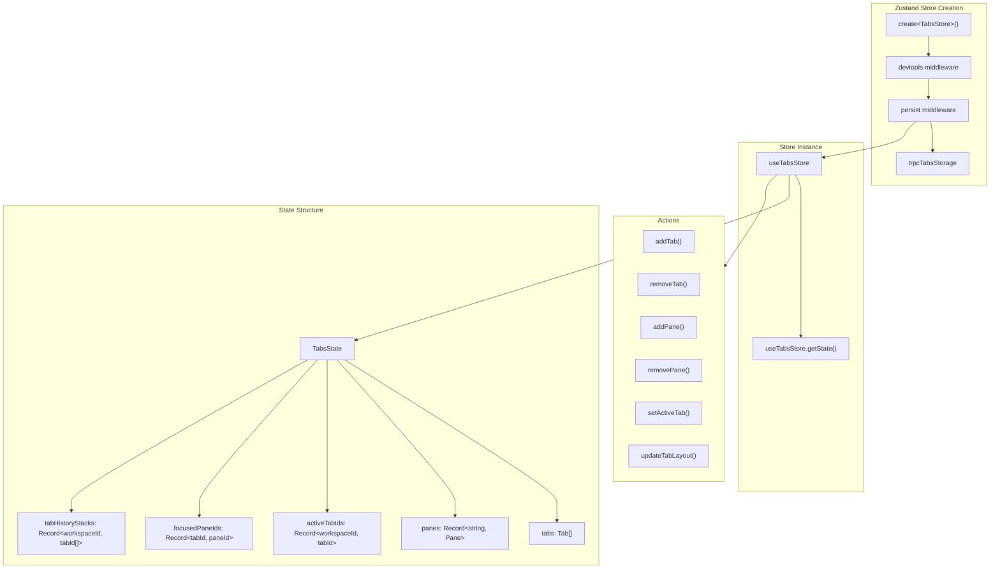
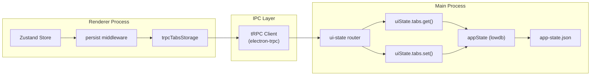
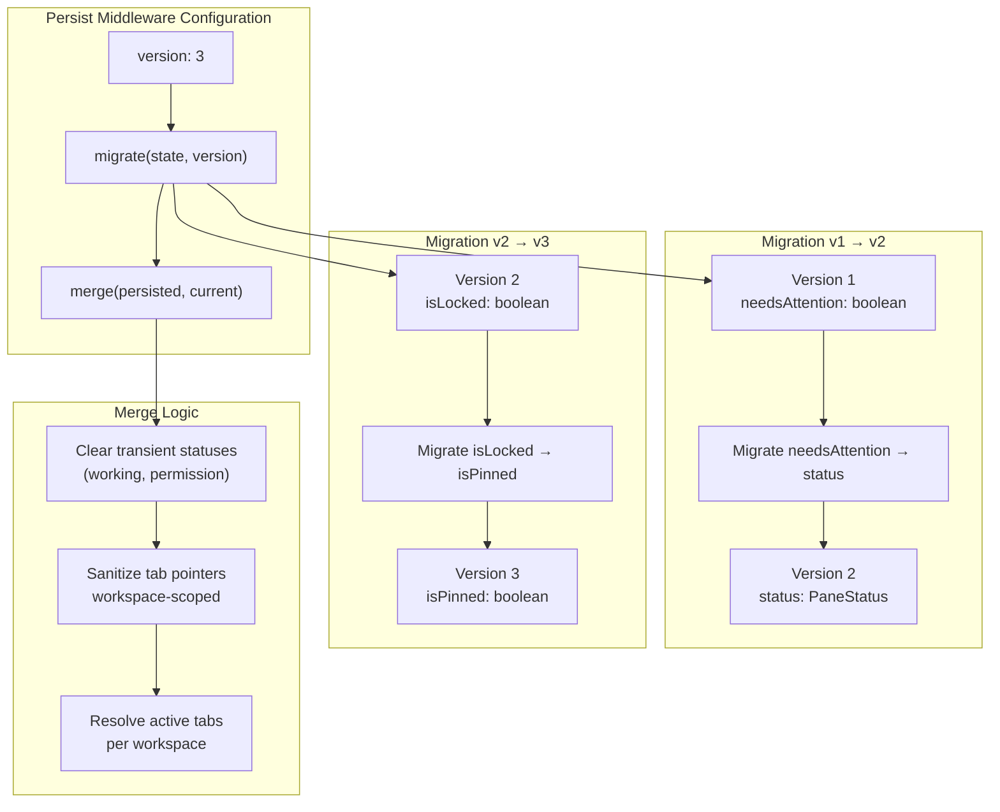
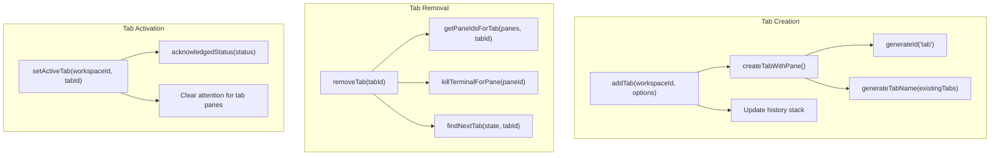
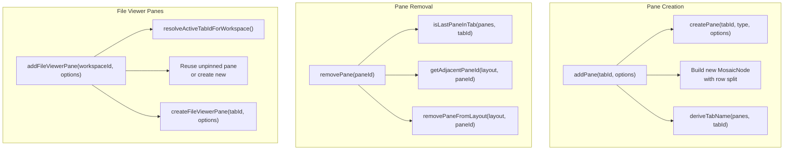
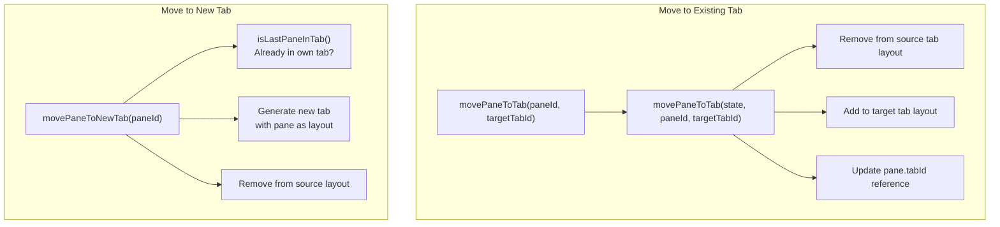

# Tab Store Architecture

<details>
<summary>Relevant source files</summary>

The following files were used as context for generating this wiki page:

- [apps/desktop/src/lib/trpc/routers/ui-state/index.ts](apps/desktop/src/lib/trpc/routers/ui-state/index.ts)
- [apps/desktop/src/renderer/routes/\_authenticated/\_dashboard/workspace/$workspaceId/page.tsx](apps/desktop/src/renderer/routes/_authenticated/_dashboard/workspace/$workspaceId/page.tsx)
- [apps/desktop/src/renderer/screens/main/components/WorkspaceView/ContentView/TabsContent/GroupStrip/GroupItem.tsx](apps/desktop/src/renderer/screens/main/components/WorkspaceView/ContentView/TabsContent/GroupStrip/GroupItem.tsx)
- [apps/desktop/src/renderer/screens/main/components/WorkspaceView/ContentView/TabsContent/GroupStrip/GroupStrip.tsx](apps/desktop/src/renderer/screens/main/components/WorkspaceView/ContentView/TabsContent/GroupStrip/GroupStrip.tsx)
- [apps/desktop/src/renderer/screens/main/components/WorkspaceView/ContentView/TabsContent/TabContentContextMenu.tsx](apps/desktop/src/renderer/screens/main/components/WorkspaceView/ContentView/TabsContent/TabContentContextMenu.tsx)
- [apps/desktop/src/renderer/screens/main/components/WorkspaceView/ContentView/TabsContent/TabView/FileViewerPane/FileViewerPane.tsx](apps/desktop/src/renderer/screens/main/components/WorkspaceView/ContentView/TabsContent/TabView/FileViewerPane/FileViewerPane.tsx)
- [apps/desktop/src/renderer/screens/main/components/WorkspaceView/ContentView/TabsContent/TabView/FileViewerPane/components/DiffViewerContextMenu/DiffViewerContextMenu.tsx](apps/desktop/src/renderer/screens/main/components/WorkspaceView/ContentView/TabsContent/TabView/FileViewerPane/components/DiffViewerContextMenu/DiffViewerContextMenu.tsx)
- [apps/desktop/src/renderer/screens/main/components/WorkspaceView/ContentView/TabsContent/TabView/FileViewerPane/components/FileEditorContextMenu/FileEditorContextMenu.tsx](apps/desktop/src/renderer/screens/main/components/WorkspaceView/ContentView/TabsContent/TabView/FileViewerPane/components/FileEditorContextMenu/FileEditorContextMenu.tsx)
- [apps/desktop/src/renderer/screens/main/components/WorkspaceView/ContentView/TabsContent/TabView/FileViewerPane/components/FileViewerContent/FileViewerContent.tsx](apps/desktop/src/renderer/screens/main/components/WorkspaceView/ContentView/TabsContent/TabView/FileViewerPane/components/FileViewerContent/FileViewerContent.tsx)
- [apps/desktop/src/renderer/screens/main/components/WorkspaceView/ContentView/TabsContent/TabView/TabPane.tsx](apps/desktop/src/renderer/screens/main/components/WorkspaceView/ContentView/TabsContent/TabView/TabPane.tsx)
- [apps/desktop/src/renderer/screens/main/components/WorkspaceView/ContentView/TabsContent/TabView/index.tsx](apps/desktop/src/renderer/screens/main/components/WorkspaceView/ContentView/TabsContent/TabView/index.tsx)
- [apps/desktop/src/renderer/screens/main/components/WorkspaceView/ContentView/components/EditorContextMenu/EditorContextMenu.tsx](apps/desktop/src/renderer/screens/main/components/WorkspaceView/ContentView/components/EditorContextMenu/EditorContextMenu.tsx)
- [apps/desktop/src/renderer/screens/main/components/WorkspaceView/ContentView/components/PaneContextMenuItems/PaneContextMenuItems.tsx](apps/desktop/src/renderer/screens/main/components/WorkspaceView/ContentView/components/PaneContextMenuItems/PaneContextMenuItems.tsx)
- [apps/desktop/src/renderer/screens/main/components/WorkspaceView/ContentView/components/index.ts](apps/desktop/src/renderer/screens/main/components/WorkspaceView/ContentView/components/index.ts)
- [apps/desktop/src/renderer/stores/tabs/store.ts](apps/desktop/src/renderer/stores/tabs/store.ts)
- [apps/desktop/src/renderer/stores/tabs/terminal-callbacks.ts](apps/desktop/src/renderer/stores/tabs/terminal-callbacks.ts)
- [apps/desktop/src/renderer/stores/tabs/types.ts](apps/desktop/src/renderer/stores/tabs/types.ts)
- [apps/desktop/src/renderer/stores/tabs/utils.test.ts](apps/desktop/src/renderer/stores/tabs/utils.test.ts)
- [apps/desktop/src/renderer/stores/tabs/utils.ts](apps/desktop/src/renderer/stores/tabs/utils.ts)
- [apps/desktop/src/shared/hotkeys.ts](apps/desktop/src/shared/hotkeys.ts)
- [apps/desktop/src/shared/tabs-types.ts](apps/desktop/src/shared/tabs-types.ts)

</details>

This document describes the Zustand-based state management system for tabs and panes in the desktop application. The tab store manages workspace-scoped tabs, their mosaic layouts, individual panes (terminal, file-viewer, chat), and maintains navigation history. For information about tab UI components and rendering, see [2.7.6](#2.7.6). For pane lifecycle and types, see [2.7.3](#2.7.3). For the Mosaic layout system, see [2.7.4](#2.7.4).

Sources: [apps/desktop/src/renderer/stores/tabs/store.ts:1-1272](), [apps/desktop/src/renderer/stores/tabs/types.ts:1-150]()

## Store Implementation

The tab store is implemented using Zustand with middleware for persistence and Redux DevTools integration. It is the single source of truth for all tab/pane state in the renderer process.



**Store Creation and Middleware**

Sources: [apps/desktop/src/renderer/stores/tabs/store.ts:95-1271]()

The store is created with a three-layer middleware stack:

1. **devtools**: Redux DevTools integration for state debugging [store.ts:96]()
2. **persist**: Automatic persistence with custom storage adapter [store.ts:97]()
3. **trpcTabsStorage**: tRPC-based storage that syncs to main process [store.ts:163]()

## State Properties

The `TabsState` interface defines five core properties that work together to manage the tab/pane system.

| Property           | Type                             | Purpose                                 |
| ------------------ | -------------------------------- | --------------------------------------- |
| `tabs`             | `Tab[]`                          | Array of all tabs across all workspaces |
| `panes`            | `Record<string, Pane>`           | Map of pane IDs to pane objects         |
| `activeTabIds`     | `Record<string, string \| null>` | Current active tab per workspace        |
| `focusedPaneIds`   | `Record<string, string>`         | Current focused pane per tab            |
| `tabHistoryStacks` | `Record<string, string[]>`       | MRU history of tabs per workspace       |

Sources: [apps/desktop/src/renderer/stores/tabs/types.ts:27-29](), [apps/desktop/src/shared/tabs-types.ts:161-167]()

### Tab Structure

Each `Tab` contains:

```typescript
interface Tab extends BaseTab {
  id: string // Unique identifier
  name: string // Auto-generated or derived from panes
  userTitle?: string // User-provided override
  workspaceId: string // Parent workspace
  layout: MosaicNode<string> // Tree structure of pane IDs
  createdAt: number // Timestamp
}
```

The `layout` field is a recursive tree structure where leaf nodes are pane IDs and branch nodes define splits (row/column direction).

Sources: [apps/desktop/src/renderer/stores/tabs/types.ts:19-21](), [apps/desktop/src/shared/tabs-types.ts:149-156]()

### Pane Structure

Each `Pane` contains type-specific state:

```typescript
interface Pane {
  id: string
  tabId: string
  type: PaneType // "terminal" | "file-viewer" | "chat"
  name: string
  isNew?: boolean // First-time pane indicator
  status?: PaneStatus // Agent lifecycle status
  initialCommands?: string[] // Commands to run on creation
  initialCwd?: string // Working directory
  cwd?: string | null // Current directory (OSC-7 tracked)
  cwdConfirmed?: boolean // True if OSC-7, false if seeded
  fileViewer?: FileViewerState
  chat?: ChatPaneState
}
```

Sources: [apps/desktop/src/shared/tabs-types.ts:122-137]()

### Active Tab Resolution

The `activeTabIds` map is consulted first, but may contain stale references. The store uses `resolveActiveTabIdForWorkspace()` with fallback logic:

1. Check `activeTabIds[workspaceId]` - if valid, return it
2. Check `tabHistoryStacks[workspaceId]` - return first valid tab
3. Return first tab in workspace by order
4. Return `null` if workspace has no tabs

Sources: [apps/desktop/src/renderer/stores/tabs/utils.ts:49-90](), [apps/desktop/src/renderer/stores/tabs/utils.test.ts:199-293]()

## Persistence Mechanism

The store uses a custom storage adapter that communicates with the main process via tRPC to persist state in lowdb.



Sources: [apps/desktop/src/renderer/stores/tabs/store.ts:160-1267](), [apps/desktop/src/lib/trpc/routers/ui-state/index.ts:1-286]()

### Storage Adapter Implementation

The `trpcTabsStorage` adapter implements the Zustand persist storage interface:

| Method         | tRPC Call                   | Purpose                      |
| -------------- | --------------------------- | ---------------------------- |
| `getItem()`    | `uiState.tabs.get.query()`  | Load state from main process |
| `setItem()`    | `uiState.tabs.set.mutate()` | Save state to main process   |
| `removeItem()` | (no-op)                     | Not used for this store      |

Sources: [apps/desktop/src/renderer/lib/trpc-storage.ts]()

### Main Process Storage

The main process stores tab state in `~/.superset/app-state.json` using lowdb. The tRPC router validates incoming state with Zod schemas before writing.

Sources: [apps/desktop/src/lib/trpc/routers/ui-state/index.ts:87-93](), [apps/desktop/src/lib/trpc/routers/ui-state/index.ts:202-213]()

## Migration System

The persist middleware includes a versioned migration system to handle schema changes across releases.



Sources: [apps/desktop/src/renderer/stores/tabs/store.ts:1160-1267]()

### Version 2 Migration: needsAttention → status

Converted boolean attention flag to a multi-state status enum:

```typescript
if (version < 2 && state.panes) {
  for (const pane of Object.values(state.panes)) {
    if (legacyPane.needsAttention === true) {
      pane.status = 'review'
    }
    delete legacyPane.needsAttention
  }
}
```

Sources: [apps/desktop/src/renderer/stores/tabs/store.ts:1166-1176]()

### Version 3 Migration: isLocked → isPinned

Renamed file viewer locking mechanism to "pinned" terminology:

```typescript
if (version < 3 && state.panes) {
  for (const pane of Object.values(state.panes)) {
    if (pane.fileViewer) {
      pane.fileViewer.isPinned = legacyFileViewer.isLocked ?? true
      delete legacyFileViewer.isLocked
    }
  }
}
```

Sources: [apps/desktop/src/renderer/stores/tabs/store.ts:1177-1189]()

### Merge Strategy

The merge function handles state rehydration with safety checks:

1. **Clear transient statuses**: `working` and `permission` statuses reset to `idle` on app restart since they represent ephemeral agent state [store.ts:1197-1202]()
2. **Sanitize pointers**: Remove cross-workspace references in `activeTabIds` and filter invalid entries from history stacks [store.ts:1207-1246]()
3. **Resolve active tabs**: Use `resolveActiveTabIdForWorkspace()` to ensure each workspace has a valid active tab [store.ts:1231-1237]()
4. **Clean focused panes**: Remove focused pane pointers for deleted tabs or mismatched tab ownership [store.ts:1248-1258]()

Sources: [apps/desktop/src/renderer/stores/tabs/store.ts:1191-1266]()

## Core Operations

The store exposes actions grouped by scope: tab operations, pane operations, split operations, and move operations.

### Tab Operations



Sources: [apps/desktop/src/renderer/stores/tabs/store.ts:106-401]()

#### addTab

Creates a new tab with a single terminal pane:

1. Generate unique tab/pane IDs using `generateId()` [store.ts:109]()
2. Create tab object with `createTabWithPane()` [store.ts:109-113]()
3. Update history stack to include current active tab [store.ts:115-122]()
4. Set new tab as active and focus the pane [store.ts:124-139]()

Returns `{ tabId, paneId }` for further actions.

Sources: [apps/desktop/src/renderer/stores/tabs/store.ts:106-142](), [apps/desktop/src/renderer/stores/tabs/utils.ts:281-303]()

#### removeTab

Removes a tab and cleans up all its panes:

1. Extract all pane IDs from the tab [store.ts:245]()
2. Kill terminal sessions for terminal-type panes [store.ts:246-252]()
3. Delete panes from state [store.ts:254-257]()
4. Find next best tab using `findNextTab()` [store.ts:268]()
5. Update focused pane and history stack [store.ts:271-282]()

Sources: [apps/desktop/src/renderer/stores/tabs/store.ts:240-284]()

#### findNextTab

Determines which tab to activate when closing a tab, with priority order:

1. Most recently used tab from history stack [store.ts:52-59]()
2. Next tab by position (current index + 1) [store.ts:68-76]()
3. Previous tab by position (current index - 1) [store.ts:77-79]()
4. First available tab in workspace [store.ts:83]()

Sources: [apps/desktop/src/renderer/stores/tabs/store.ts:41-84]()

### Pane Operations



Sources: [apps/desktop/src/renderer/stores/tabs/store.ts:452-862]()

#### addPane

Adds a new terminal pane to an existing tab:

1. Create pane object with `createPane()` [store.ts:457]()
2. Build new layout with row split (50/50) [store.ts:459-464]()
3. Derive new tab name from pane count [store.ts:467]()
4. Update tab layout and focus new pane [store.ts:469-478]()

Sources: [apps/desktop/src/renderer/stores/tabs/store.ts:452-481]()

#### removePane

Removes a pane from its tab with focus management:

1. Check if this is the last pane - if so, remove entire tab [store.ts:759-761]()
2. Get adjacent pane for focus fallback before removal [store.ts:765]()
3. Kill terminal session if pane is terminal type [store.ts:768-770]()
4. Remove pane from layout tree using `removePaneFromLayout()` [store.ts:772]()
5. Update focused pane to adjacent or first pane [store.ts:783-788]()

Sources: [apps/desktop/src/renderer/stores/tabs/store.ts:750-799]()

#### addFileViewerPane

Adds a file viewer pane with preview/pinned mode logic:

1. Resolve active tab for the workspace [store.ts:532-540]()
2. Check if file is already open in a pinned pane - if so, focus it [store.ts:561-582]()
3. Look for existing unpinned (preview) pane to reuse [store.ts:584-592]()
4. If preview pane found, replace its content (preview behavior) [store.ts:595-677]()
5. If no reusable pane, create new pane in current/new tab [store.ts:679-747]()

Sources: [apps/desktop/src/renderer/stores/tabs/store.ts:527-748]()

### Split Operations

Split operations create new terminal panes by dividing the layout tree at a specific path:

| Operation             | Direction  | Split Type          |
| --------------------- | ---------- | ------------------- |
| `splitPaneVertical`   | `"row"`    | Left/right split    |
| `splitPaneHorizontal` | `"column"` | Top/bottom split    |
| `splitPaneAuto`       | (dynamic)  | Based on dimensions |

All splits use `updateTree()` from react-mosaic-component to modify the layout at the specified path.

Sources: [apps/desktop/src/renderer/stores/tabs/store.ts:955-1065]()

### Move Operations



Sources: [apps/desktop/src/renderer/stores/tabs/store.ts:1067-1112](), [apps/desktop/src/renderer/stores/tabs/actions/move-pane.ts]()

Both operations re-derive tab names for affected tabs after the move to reflect the new pane composition.

## State Selectors

The store provides query helpers for common access patterns:

| Selector             | Parameters    | Returns        | Purpose                        |
| -------------------- | ------------- | -------------- | ------------------------------ |
| `getTabsByWorkspace` | `workspaceId` | `Tab[]`        | Filter tabs for workspace      |
| `getActiveTab`       | `workspaceId` | `Tab \| null`  | Get active tab with resolution |
| `getPanesForTab`     | `tabId`       | `Pane[]`       | Get all panes in tab           |
| `getFocusedPane`     | `tabId`       | `Pane \| null` | Get focused pane in tab        |

These selectors encapsulate common queries and ensure consistent resolution logic (especially `getActiveTab` which uses `resolveActiveTabIdForWorkspace()`).

Sources: [apps/desktop/src/renderer/stores/tabs/store.ts:1132-1158]()

## Usage Patterns

### Component Integration

Components subscribe to specific slices of state to minimize re-renders:

```typescript
// Subscribe to active tab for a workspace
const activeTab = useTabsStore((s) => s.getActiveTab(workspaceId))

// Subscribe to focused pane for a tab
const focusedPaneId = useTabsStore((s) => s.focusedPaneIds[tabId])

// Subscribe to specific pane properties
const paneName = useTabsStore((s) => s.panes[paneId]?.name)
const paneStatus = useTabsStore((s) => s.panes[paneId]?.status)
```

Sources: [apps/desktop/src/renderer/screens/main/components/WorkspaceView/ContentView/TabsContent/index.tsx:10-28](), [apps/desktop/src/renderer/screens/main/components/WorkspaceView/ContentView/TabsContent/TabView/TabPane.tsx:59-60]()

### Imperative Actions

Actions are called directly from the store:

```typescript
const { addTab, removeTab, setActiveTab } = useTabsStore()

// Create new tab
const { tabId, paneId } = addTab(workspaceId, {
  initialCwd: '/path/to/dir',
  initialCommands: ['npm install'],
})

// Activate tab
setActiveTab(workspaceId, tabId)

// Remove tab
removeTab(tabId)
```

Sources: [apps/desktop/src/renderer/stores/tabs/store.ts:68-150]()

### State Access

Use `getState()` to access fresh state in callbacks where closure staleness is a concern:

```typescript
const handleLayoutChange = useCallback(
  (newLayout) => {
    // Get fresh state to avoid stale closure issues
    const state = useTabsStore.getState()
    const freshTab = state.tabs.find((t) => t.id === tabId)
    // ... use fresh state
  },
  [tabId]
)
```

This pattern is critical for drag-drop operations where state may change between callback creation and invocation.

Sources: [apps/desktop/src/renderer/screens/main/components/WorkspaceView/ContentView/TabsContent/TabView/index.tsx:83-120]()
