# Tab UI Components

<details>
<summary>Relevant source files</summary>

The following files were used as context for generating this wiki page:

- [apps/desktop/src/lib/trpc/routers/ui-state/index.ts](apps/desktop/src/lib/trpc/routers/ui-state/index.ts)
- [apps/desktop/src/renderer/routes/_authenticated/_dashboard/workspace/$workspaceId/page.tsx](apps/desktop/src/renderer/routes/_authenticated/_dashboard/workspace/$workspaceId/page.tsx)
- [apps/desktop/src/renderer/screens/main/components/WorkspaceView/ContentView/TabsContent/GroupStrip/GroupItem.tsx](apps/desktop/src/renderer/screens/main/components/WorkspaceView/ContentView/TabsContent/GroupStrip/GroupItem.tsx)
- [apps/desktop/src/renderer/screens/main/components/WorkspaceView/ContentView/TabsContent/GroupStrip/GroupStrip.tsx](apps/desktop/src/renderer/screens/main/components/WorkspaceView/ContentView/TabsContent/GroupStrip/GroupStrip.tsx)
- [apps/desktop/src/renderer/screens/main/components/WorkspaceView/ContentView/TabsContent/TabContentContextMenu.tsx](apps/desktop/src/renderer/screens/main/components/WorkspaceView/ContentView/TabsContent/TabContentContextMenu.tsx)
- [apps/desktop/src/renderer/screens/main/components/WorkspaceView/ContentView/TabsContent/TabView/FileViewerPane/FileViewerPane.tsx](apps/desktop/src/renderer/screens/main/components/WorkspaceView/ContentView/TabsContent/TabView/FileViewerPane/FileViewerPane.tsx)
- [apps/desktop/src/renderer/screens/main/components/WorkspaceView/ContentView/TabsContent/TabView/FileViewerPane/components/DiffViewerContextMenu/DiffViewerContextMenu.tsx](apps/desktop/src/renderer/screens/main/components/WorkspaceView/ContentView/TabsContent/TabView/FileViewerPane/components/DiffViewerContextMenu/DiffViewerContextMenu.tsx)
- [apps/desktop/src/renderer/screens/main/components/WorkspaceView/ContentView/TabsContent/TabView/FileViewerPane/components/FileEditorContextMenu/FileEditorContextMenu.tsx](apps/desktop/src/renderer/screens/main/components/WorkspaceView/ContentView/TabsContent/TabView/FileViewerPane/components/FileEditorContextMenu/FileEditorContextMenu.tsx)
- [apps/desktop/src/renderer/screens/main/components/WorkspaceView/ContentView/TabsContent/TabView/FileViewerPane/components/FileViewerContent/FileViewerContent.tsx](apps/desktop/src/renderer/screens/main/components/WorkspaceView/ContentView/TabsContent/TabView/FileViewerPane/components/FileViewerContent/FileViewerContent.tsx)
- [apps/desktop/src/renderer/screens/main/components/WorkspaceView/ContentView/TabsContent/TabView/TabPane.tsx](apps/desktop/src/renderer/screens/main/components/WorkspaceView/ContentView/TabsContent/TabView/TabPane.tsx)
- [apps/desktop/src/renderer/screens/main/components/WorkspaceView/ContentView/TabsContent/TabView/index.tsx](apps/desktop/src/renderer/screens/main/components/WorkspaceView/ContentView/TabsContent/TabView/index.tsx)
- [apps/desktop/src/renderer/screens/main/components/WorkspaceView/ContentView/components/EditorContextMenu/EditorContextMenu.tsx](apps/desktop/src/renderer/screens/main/components/WorkspaceView/ContentView/components/EditorContextMenu/EditorContextMenu.tsx)
- [apps/desktop/src/renderer/screens/main/components/WorkspaceView/ContentView/components/PaneContextMenuItems/PaneContextMenuItems.tsx](apps/desktop/src/renderer/screens/main/components/WorkspaceView/ContentView/components/PaneContextMenuItems/PaneContextMenuItems.tsx)
- [apps/desktop/src/renderer/screens/main/components/WorkspaceView/ContentView/components/index.ts](apps/desktop/src/renderer/screens/main/components/WorkspaceView/ContentView/components/index.ts)
- [apps/desktop/src/renderer/stores/tabs/store.ts](apps/desktop/src/renderer/stores/tabs/store.ts)
- [apps/desktop/src/renderer/stores/tabs/terminal-callbacks.ts](apps/desktop/src/renderer/stores/tabs/terminal-callbacks.ts)
- [apps/desktop/src/renderer/stores/tabs/types.ts](apps/desktop/src/renderer/stores/tabs/types.ts)
- [apps/desktop/src/renderer/stores/tabs/utils.test.ts](apps/desktop/src/renderer/stores/tabs/utils.test.ts)
- [apps/desktop/src/renderer/stores/tabs/utils.ts](apps/desktop/src/renderer/stores/tabs/utils.ts)
- [apps/desktop/src/shared/hotkeys.ts](apps/desktop/src/shared/hotkeys.ts)
- [apps/desktop/src/shared/tabs-types.ts](apps/desktop/src/shared/tabs-types.ts)

</details>


This page documents the UI components that render and manage tabs in the Superset desktop application. Tabs are containers that hold one or more panes in a Mosaic layout. The tab system includes the horizontal tab strip (GroupStrip), individual tab buttons (GroupItem), the add tab button with presets, and the content area that displays either a TabView or EmptyTabView.

For information about the underlying tab/pane state management and data structures, see [Tab Store Architecture](#2.7.1). For details on the Mosaic layout system that organizes panes within tabs, see [Mosaic Layout System](#2.7.4). For drag-and-drop mechanics, see [Drag and Drop Pane Movement](#2.7.5).

## Component Hierarchy

The tab UI components are organized in a hierarchical structure, with TabsContent at the top level determining what to render:

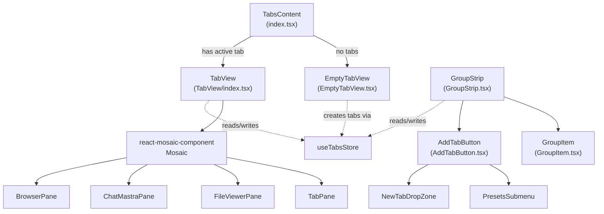

**Sources:** [apps/desktop/src/renderer/screens/main/components/WorkspaceView/ContentView/TabsContent/index.tsx:1-60](), [apps/desktop/src/renderer/screens/main/components/WorkspaceView/ContentView/TabsContent/GroupStrip/GroupStrip.tsx:1-385](), [apps/desktop/src/renderer/screens/main/components/WorkspaceView/ContentView/TabsContent/TabView/index.tsx:1-291]()

## TabsContent Component

The `TabsContent` component is the top-level coordinator that determines what to display based on whether the workspace has an active tab.

### Responsibilities

| Responsibility | Implementation |
|----------------|----------------|
| Active tab resolution | Uses `resolveActiveTabIdForWorkspace` to find the correct tab to display |
| Empty state detection | Renders `EmptyTabView` when no active tab exists |
| Tab validation | Ensures the resolved tab belongs to the current workspace |
| State subscription | Subscribes to `tabs`, `activeTabIds`, and `tabHistoryStacks` from store |

### Resolution Logic

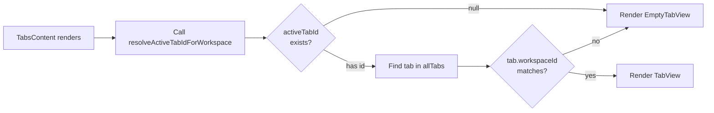

The active tab resolution follows a priority order defined in `resolveActiveTabIdForWorkspace`:
1. Current `activeTabIds[workspaceId]` (if valid)
2. Most recent tab from `tabHistoryStacks[workspaceId]` (if valid)
3. First tab in workspace by iteration order
4. `null` if no tabs exist for the workspace

**Sources:** [apps/desktop/src/renderer/screens/main/components/WorkspaceView/ContentView/TabsContent/index.tsx:15-59](), [apps/desktop/src/renderer/stores/tabs/utils.ts:63-104]()

## GroupStrip Component

The `GroupStrip` component renders the horizontal strip of tab buttons at the top of the workspace content area. It manages tab selection, reordering, status indicators, and the add tab button.

### Component Structure

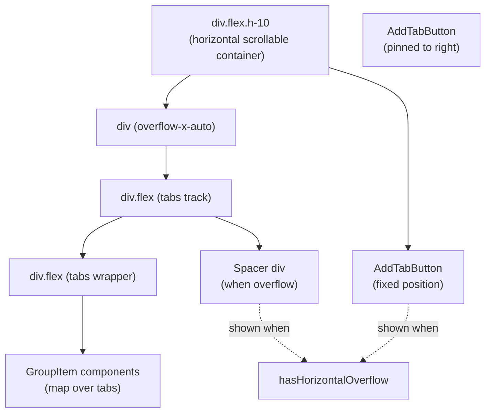

### Key Features

| Feature | Description | Implementation |
|---------|-------------|----------------|
| Horizontal overflow detection | Detects when tabs exceed container width | ResizeObserver on both container and track elements |
| Status aggregation | Shows highest-priority status from all panes in tab | `pickHigherStatus` reducer over pane statuses |
| Chat title sync | Syncs Electric SQL chat session titles to tab/pane names | `useLiveQuery` on `chatSessions` collection with `setTabAutoTitle`/`setPaneAutoTitle` |
| Preset bar toggle | Shows/hides preset bar via settings | `getShowPresetsBar` and `setShowPresetsBar` mutations |
| Compact button mode | Toggles between expanded and compact add button | `getUseCompactTerminalAddButton` setting |

### Status Aggregation

The component computes a `tabStatusMap` that aggregates all pane statuses within each tab:

```typescript
// From GroupStrip.tsx:125-135
const tabStatusMap = useMemo(() => {
  const result = new Map<string, ActivePaneStatus>();
  for (const pane of Object.values(panes)) {
    if (!pane.status || pane.status === "idle") continue;
    const higher = pickHigherStatus(result.get(pane.tabId), pane.status);
    if (higher !== "idle") {
      result.set(pane.tabId, higher);
    }
  }
  return result;
}, [panes]);
```

Status priorities are defined in `STATUS_PRIORITY` from `shared/tabs-types.ts`:
- `permission` (3) - highest priority
- `working` (2)
- `review` (1)
- `idle` (0) - no indicator shown

**Sources:** [apps/desktop/src/renderer/screens/main/components/WorkspaceView/ContentView/TabsContent/GroupStrip/GroupStrip.tsx:32-385](), [apps/desktop/src/shared/tabs-types.ts:34-74]()

### Chat Session Title Synchronization

The component subscribes to Electric SQL `chatSessions` for all chat panes in the workspace and updates their titles automatically:

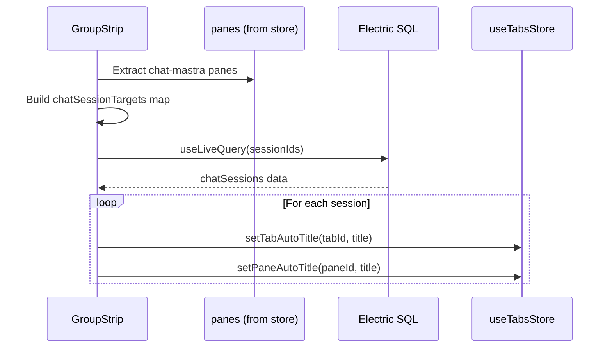

This ensures that when a user updates a chat session title in the database (e.g., via the chat interface), all tabs and panes displaying that session automatically reflect the new title.

**Sources:** [apps/desktop/src/renderer/screens/main/components/WorkspaceView/ContentView/TabsContent/GroupStrip/GroupStrip.tsx:138-214]()

## GroupItem Component

The `GroupItem` component renders an individual tab button with drag-and-drop support, inline editing, context menu, and status indicators.

### Component Features

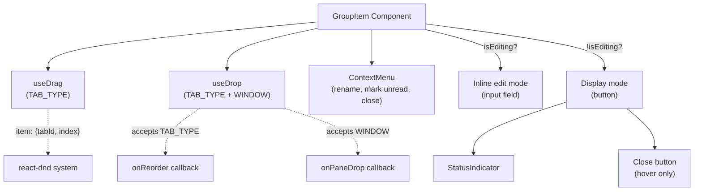

### Drag-and-Drop Mechanics

The component supports two types of drops:

| Drop Type | Item Type | Behavior | Implementation |
|-----------|-----------|----------|----------------|
| Tab reordering | `TAB_TYPE` | Reorders tabs by index | Calls `onReorder(fromIndex, toIndex)` in hover callback |
| Pane movement | `MosaicDragType.WINDOW` | Moves pane to this tab | Calls `onPaneDrop(paneId)` in drop callback |

The drag source sets up the tab as draggable:

```typescript
// From GroupItem.tsx:55-64
const [{ isDragging }, drag, preview] = useDrag(
  () => ({
    type: TAB_TYPE,
    item: { tabId: tab.id, index },
    collect: (monitor) => ({
      isDragging: monitor.isDragging(),
    }),
  }),
  [tab.id, index],
);
```

The drop target accepts both types and uses `getItemType()` to distinguish:

```typescript
// From GroupItem.tsx:96-105
hover: (item, monitor) => {
  const itemType = monitor.getItemType();
  if (itemType === TAB_TYPE && item.index !== undefined && item.index !== index) {
    onReorder?.(item.index, index);
    item.index = index; // Update for next hover
  }
}
```

**Sources:** [apps/desktop/src/renderer/screens/main/components/WorkspaceView/ContentView/TabsContent/GroupStrip/GroupItem.tsx:37-266]()

### Inline Editing

Double-clicking a tab enters edit mode with an inline text input:

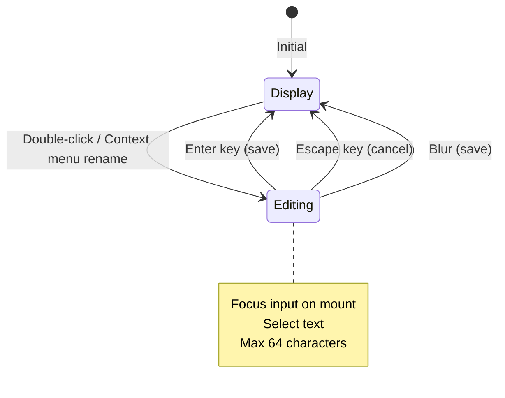

The edit value is trimmed and only saved if it differs from the current display name. The `getTabDisplayName` utility extracts the user title or falls back to the auto-generated name.

**Sources:** [apps/desktop/src/renderer/screens/main/components/WorkspaceView/ContentView/TabsContent/GroupStrip/GroupItem.tsx:144-165](), [apps/desktop/src/renderer/stores/tabs/utils.ts:49-61]()

### Context Menu Actions

| Action | Icon | Behavior |
|--------|------|----------|
| Rename | `LuPencil` | Enters inline edit mode |
| Mark as Unread | `LuEyeOff` | Sets all panes in tab to `"review"` status |
| Close | `HiMiniXMark` | Removes the tab |

**Sources:** [apps/desktop/src/renderer/screens/main/components/WorkspaceView/ContentView/TabsContent/GroupStrip/GroupItem.tsx:248-263]()

## AddTabButton Component

The `AddTabButton` component provides a dropdown menu for creating new tabs with different pane types (Terminal, Chat, Browser) and accessing presets.

### UI Modes

The component supports two display modes controlled by the `useCompactAddButton` setting:

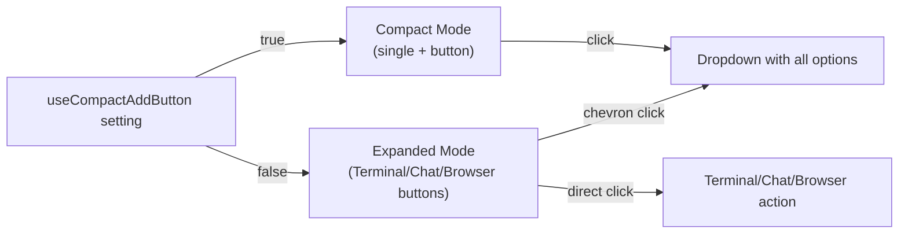

### Expanded Mode Layout

In expanded mode, the button splits into multiple segments:

| Segment | Label | Action | Style |
|---------|-------|--------|-------|
| 1 | Terminal + icon | `onAddTerminal()` | `rounded-r-none` |
| 2 | Chat + icon | `onAddChat()` | `rounded-none border-l-0` |
| 3 | Browser + icon | `onAddBrowser()` | `rounded-none border-l-0` |
| 4 | Chevron down | Opens dropdown | `rounded-l-none border-l-0` |

### Dropdown Menu Content

The dropdown menu content varies based on mode and settings:

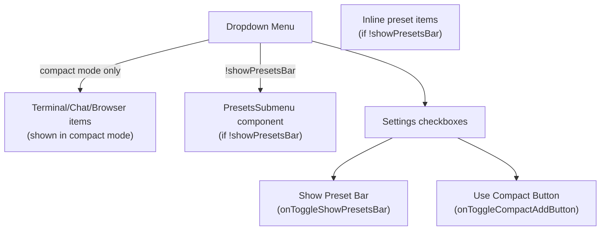

Each menu item includes a hotkey shortcut displayed via `HotkeyMenuShortcut` component (e.g., `NEW_GROUP`, `NEW_CHAT`, `NEW_BROWSER` for the three pane types).

**Sources:** [apps/desktop/src/renderer/screens/main/components/WorkspaceView/ContentView/TabsContent/GroupStrip/components/AddTabButton/AddTabButton.tsx:1-155]()

### Preset Integration

The `PresetsSubmenu` component displays up to the first N presets with hotkey shortcuts:

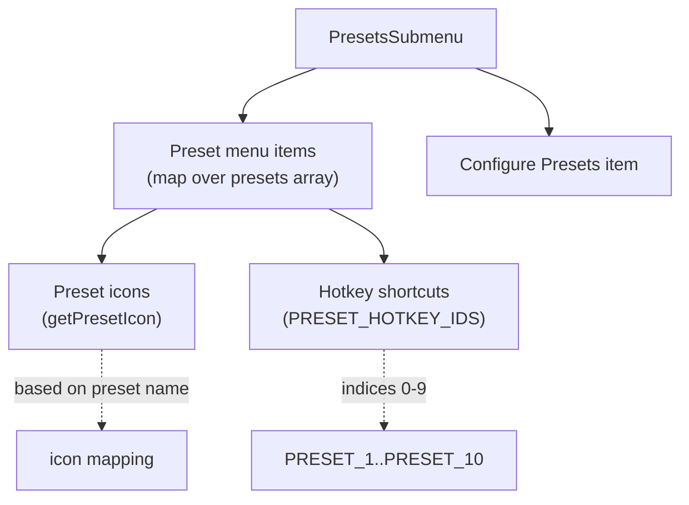

The `PRESET_HOTKEY_IDS` array maps preset indices to hotkey IDs like `"PRESET_1"`, `"PRESET_2"`, etc., allowing the first 10 presets to have dedicated keyboard shortcuts.

**Sources:** [apps/desktop/src/renderer/screens/main/components/WorkspaceView/ContentView/TabsContent/GroupStrip/components/AddTabButton/components/PresetsSubmenu/PresetsSubmenu.tsx:1-73]()

### Drop Zone for New Tab Creation

The `AddTabButton` is wrapped in a `NewTabDropZone` component that accepts pane drops to create a new tab:

```typescript
<NewTabDropZone onDrop={onDropToNewTab} isLastPaneInTab={isLastPaneInTab}>
  <DropdownMenu>...</DropdownMenu>
</NewTabDropZone>
```

When a pane is dropped on this zone, it calls `movePaneToNewTab(paneId)` to extract the pane into its own new tab.

**Sources:** [apps/desktop/src/renderer/screens/main/components/WorkspaceView/ContentView/TabsContent/GroupStrip/components/AddTabButton/AddTabButton.tsx:52-154]()

## TabView Component

The `TabView` component renders the active tab's content using `react-mosaic-component` to display panes in a split layout.

### Component Responsibilities

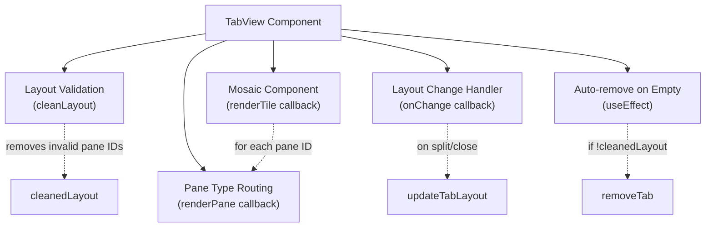

### Pane Type Routing

The `renderPane` callback routes each pane ID to the appropriate component based on its type:

| Pane Type | Component | Props Passed |
|-----------|-----------|--------------|
| `"terminal"` | `TabPane` | Standard pane props + workspace ID |
| `"file-viewer"` | `FileViewerPane` | Standard pane props + worktree path |
| `"chat-mastra"` | `ChatMastraPane` | Standard pane props + workspace ID |
| `"webview"` | `BrowserPane` | Standard pane props |
| `"devtools"` | `DevToolsPane` | Standard pane props + target pane ID |

Standard pane props include:
- `paneId`, `path`, `tabId`
- `splitPaneAuto`, `splitPaneHorizontal`, `splitPaneVertical`
- `removePane`, `setFocusedPane`
- `availableTabs`, `onMoveToTab`, `onMoveToNewTab`

**Sources:** [apps/desktop/src/renderer/screens/main/components/WorkspaceView/ContentView/TabsContent/TabView/index.tsx:136-256]()

### Layout Change Handling

When the Mosaic layout changes (e.g., user closes a pane via Mosaic's close button), the component must:

1. Get fresh state from store to avoid stale closure issues
2. Identify removed panes by comparing old and new layouts
3. Only remove panes that still belong to this tab (not moved to another tab)
4. Update the tab's layout in the store

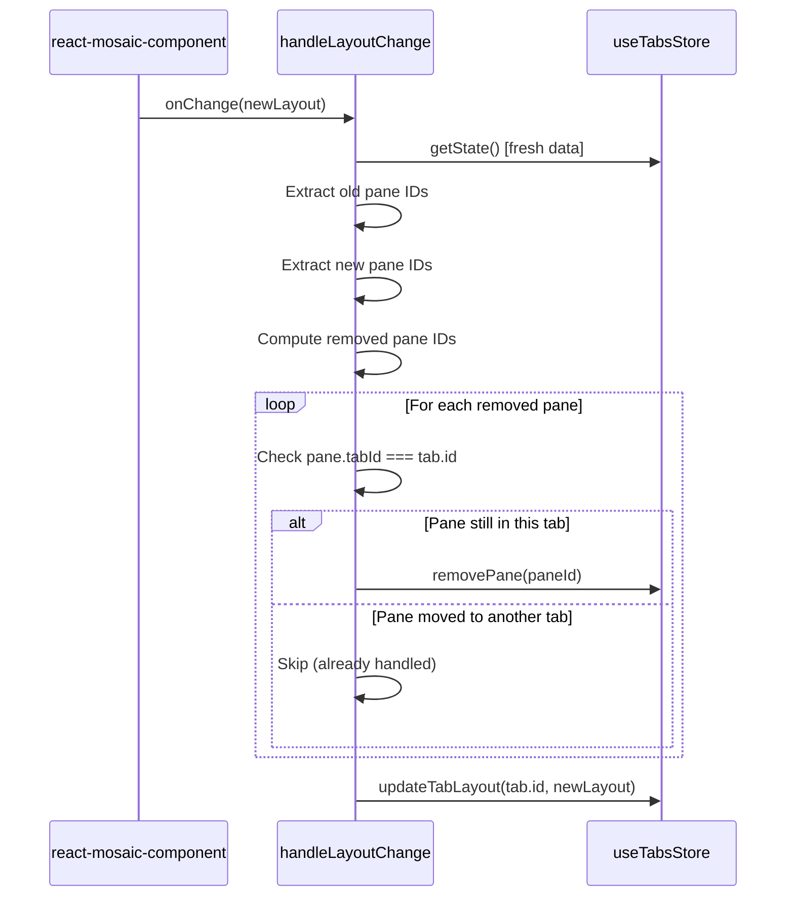

**Sources:** [apps/desktop/src/renderer/screens/main/components/WorkspaceView/ContentView/TabsContent/TabView/index.tsx:96-134]()

### Layout Validation and Auto-removal

The component validates the layout against valid pane IDs and automatically removes the tab if the layout becomes empty:

```typescript
// From TabView/index.tsx:86-94
const validPaneIds = new Set(Object.keys(tabPanes));
const cleanedLayout = cleanLayout(tab.layout, validPaneIds);

useEffect(() => {
  if (!cleanedLayout) {
    removeTab(tab.id);
  }
}, [cleanedLayout, removeTab, tab.id]);
```

The `cleanLayout` function recursively removes any pane IDs from the Mosaic tree that don't exist in the valid set, collapsing branches as needed.

**Sources:** [apps/desktop/src/renderer/screens/main/components/WorkspaceView/ContentView/TabsContent/TabView/index.tsx:57-94](), [apps/desktop/src/renderer/stores/tabs/utils.ts:450-477]()

## EmptyTabView Component

The `EmptyTabView` component is displayed when a workspace has no active tabs. It provides a centered UI with action buttons for creating tabs and a workspace deletion button.

### Component Layout

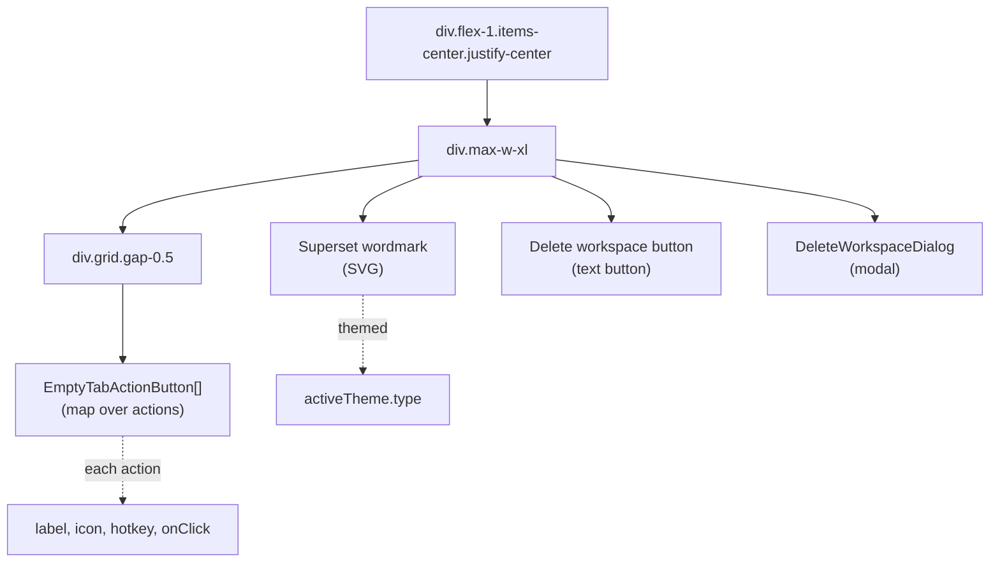

### Action Buttons

The component builds an array of actions based on available features:

| Action ID | Label | Icon | Hotkey | Always Shown |
|-----------|-------|------|--------|--------------|
| `terminal` | Open Terminal | `BsTerminalPlus` | `NEW_GROUP` | Yes |
| `new-agent` | Open Chat | `TbMessageCirclePlus` | `NEW_CHAT` | Yes |
| `open-browser` | Open Browser | `TbWorld` | `NEW_BROWSER` | Yes |
| `open-in-app` | Open in {App} | `LuExternalLink` | `OPEN_IN_APP` | If `defaultExternalApp` exists |
| `search-files` | Search Files | `LuSearch` | `QUICK_OPEN` | Yes |

Each button is rendered as an `EmptyTabActionButton` component that displays:
- Icon on the left
- Label text
- Hotkey hint on the right (using `Kbd` components)

**Sources:** [apps/desktop/src/renderer/screens/main/components/WorkspaceView/ContentView/TabsContent/EmptyTabView.tsx:33-184]()

### EmptyTabActionButton Component

This component renders a single action button with consistent styling:

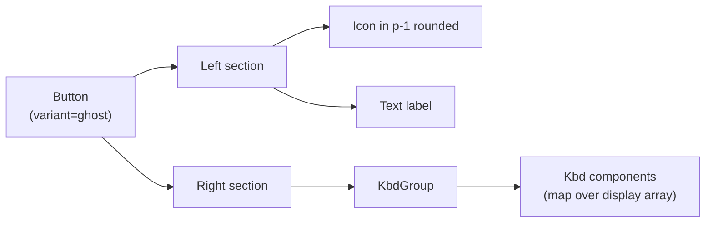

The `display` prop is an array of key labels (e.g., `["⌘", "T"]`) that are each rendered in a `Kbd` component for visual consistency.

**Sources:** [apps/desktop/src/renderer/screens/main/components/WorkspaceView/ContentView/TabsContent/components/EmptyTabActionButton/EmptyTabActionButton.tsx:1-44]()

## Integration with Tab Store

All tab UI components interact with the `useTabsStore` to read and modify state:

### Store Subscriptions

```mermaid
graph TB
    GroupStrip["GroupStrip"]
    GroupItem["GroupItem"]
    AddTabButton["AddTabButton"]
    TabView["TabView"]
    EmptyTabView["EmptyTabView"]
    
    Store["useTabsStore"]
    
    GroupStrip -->|"reads"| Tabs["tabs"]
    GroupStrip -->|"reads"| Panes["panes"]
    GroupStrip -->|"reads"| ActiveIds["activeTabIds"]
    GroupStrip -->|"reads"| History["tabHistoryStacks"]
    
    GroupStrip -->|"calls"| SetActive["setActiveTab"]
    GroupStrip -->|"calls"| Remove["removeTab"]
    GroupStrip -->|"calls"| Rename["renameTab"]
    GroupStrip -->|"calls"| Reorder["reorderTabs"]
    GroupStrip -->|"calls"| SetStatus["setPaneStatus"]
    GroupStrip -->|"calls"| MoveTo["movePaneToTab / movePaneToNewTab"]
    
    TabView -->|"calls"| UpdateLayout["updateTabLayout"]
    TabView -->|"calls"| RemovePane["removePane"]
    
    EmptyTabView -->|"calls"| AddTab["addTab / addChatMastraTab / addBrowserTab"]
    
    Store -.->|"provides"| Tabs
    Store -.->|"provides"| Panes
    Store -.->|"provides"| ActiveIds
    Store -.->|"provides"| History
```

**Sources:** [apps/desktop/src/renderer/screens/main/components/WorkspaceView/ContentView/TabsContent/GroupStrip/GroupStrip.tsx:35-48](), [apps/desktop/src/renderer/screens/main/components/WorkspaceView/ContentView/TabsContent/TabView/index.tsx:33-42](), [apps/desktop/src/renderer/screens/main/components/WorkspaceView/ContentView/TabsContent/EmptyTabView.tsx:41-43]()

### Store Actions Used by UI Components

| Component | Actions Called |
|-----------|----------------|
| `GroupStrip` | `setActiveTab`, `removeTab`, `renameTab`, `reorderTabs`, `setPaneStatus`, `movePaneToTab`, `movePaneToNewTab`, `setTabAutoTitle`, `setPaneAutoTitle` |
| `GroupItem` | (Actions passed down from `GroupStrip`) |
| `AddTabButton` | (Calls passed from `GroupStrip`: `addTab`, `addChatMastraTab`, `addBrowserTab`, `openPreset`) |
| `TabView` | `updateTabLayout`, `removePane`, `removeTab`, `splitPaneAuto`, `splitPaneHorizontal`, `splitPaneVertical`, `setFocusedPane`, `movePaneToTab`, `movePaneToNewTab` |
| `EmptyTabView` | `addTab`, `addChatMastraTab`, `addBrowserTab` |

**Sources:** [apps/desktop/src/renderer/stores/tabs/store.ts:106-1410]()

## Horizontal Overflow Handling

The `GroupStrip` component handles horizontal overflow by detecting when tabs exceed the container width and adjusting the layout:

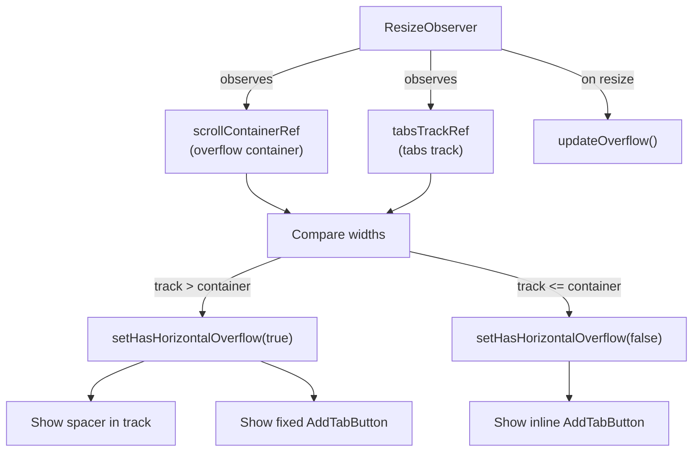

When overflow is detected:
1. A spacer `div` is added to the end of the scrollable track to reserve space
2. The `AddTabButton` is rendered in a fixed position outside the scroll container
3. This ensures the add button remains visible and accessible even when many tabs exist

**Sources:** [apps/desktop/src/renderer/screens/main/components/WorkspaceView/ContentView/TabsContent/GroupStrip/GroupStrip.tsx:282-309](), [apps/desktop/src/renderer/screens/main/components/WorkspaceView/ContentView/TabsContent/GroupStrip/GroupStrip.tsx:334-382]()

## Theme Integration

Components adapt their appearance based on the active theme from `useTheme()`:

| Component | Theme Usage |
|-----------|-------------|
| `TabView` | Sets Mosaic `className` to `"mosaic-theme-light"` or `"mosaic-theme-dark"` |
| `EmptyTabView` | Adjusts logo opacity/brightness: `opacity-85` (dark) or `brightness-0 opacity-75` (light) |
| `PresetsSubmenu` | Uses `useIsDarkTheme()` to select light/dark preset icons |

The Mosaic theme classes are defined in `apps/desktop/src/renderer/screens/main/components/WorkspaceView/ContentView/TabsContent/TabView/mosaic-theme.css` and override react-mosaic-component's default styles to match Superset's design system.

**Sources:** [apps/desktop/src/renderer/screens/main/components/WorkspaceView/ContentView/TabsContent/TabView/index.tsx:32-282](), [apps/desktop/src/renderer/screens/main/components/WorkspaceView/ContentView/TabsContent/EmptyTabView.tsx:44-148](), [apps/desktop/src/renderer/screens/main/components/WorkspaceView/ContentView/TabsContent/GroupStrip/components/AddTabButton/components/PresetsSubmenu/PresetsSubmenu.tsx:28-72]()