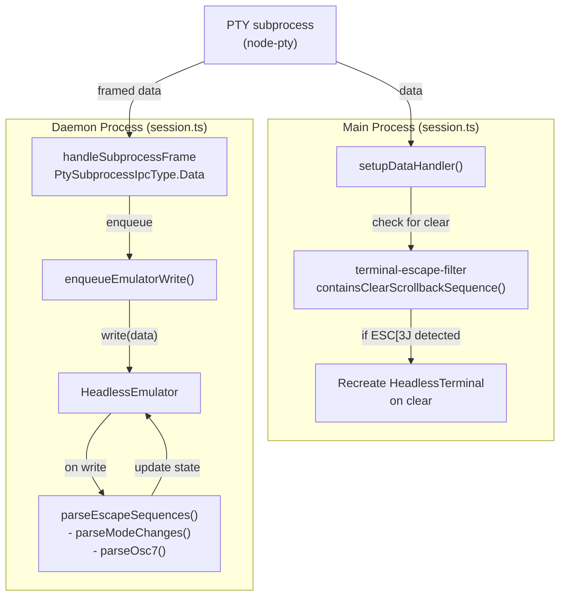
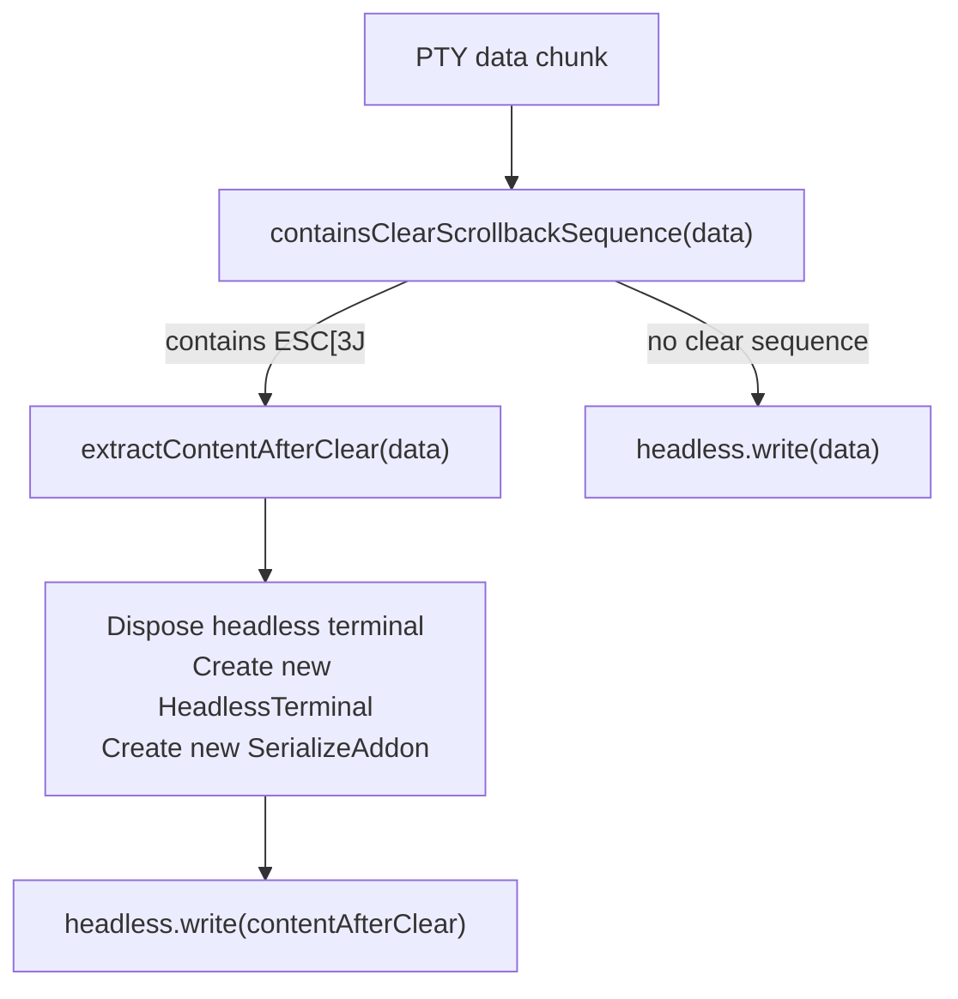
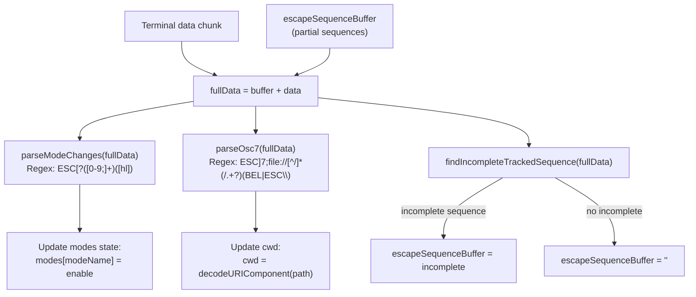

# Escape Sequence Processing

<details>
<summary>Relevant source files</summary>

The following files were used as context for generating this wiki page:

- [apps/desktop/src/lib/trpc/routers/terminal/terminal.ts](apps/desktop/src/lib/trpc/routers/terminal/terminal.ts)
- [apps/desktop/src/main/lib/app-environment.ts](apps/desktop/src/main/lib/app-environment.ts)
- [apps/desktop/src/main/lib/data-batcher.ts](apps/desktop/src/main/lib/data-batcher.ts)
- [apps/desktop/src/main/lib/terminal-escape-filter.test.ts](apps/desktop/src/main/lib/terminal-escape-filter.test.ts)
- [apps/desktop/src/main/lib/terminal-escape-filter.ts](apps/desktop/src/main/lib/terminal-escape-filter.ts)
- [apps/desktop/src/main/lib/terminal-history.ts](apps/desktop/src/main/lib/terminal-history.ts)
- [apps/desktop/src/main/lib/terminal-host/headless-emulator.test.ts](apps/desktop/src/main/lib/terminal-host/headless-emulator.test.ts)
- [apps/desktop/src/main/lib/terminal-host/headless-emulator.ts](apps/desktop/src/main/lib/terminal-host/headless-emulator.ts)
- [apps/desktop/src/main/lib/terminal/port-manager.ts](apps/desktop/src/main/lib/terminal/port-manager.ts)
- [apps/desktop/src/main/lib/terminal/port-scanner.test.ts](apps/desktop/src/main/lib/terminal/port-scanner.test.ts)
- [apps/desktop/src/main/lib/terminal/port-scanner.ts](apps/desktop/src/main/lib/terminal/port-scanner.ts)
- [apps/desktop/src/main/lib/terminal/session.test.ts](apps/desktop/src/main/lib/terminal/session.test.ts)
- [apps/desktop/src/main/lib/terminal/session.ts](apps/desktop/src/main/lib/terminal/session.ts)
- [apps/desktop/src/main/lib/terminal/types.ts](apps/desktop/src/main/lib/terminal/types.ts)
- [apps/desktop/src/main/terminal-host/session.ts](apps/desktop/src/main/terminal-host/session.ts)
- [apps/desktop/src/renderer/screens/main/components/WorkspaceView/ContentView/TabsContent/Terminal/config.ts](apps/desktop/src/renderer/screens/main/components/WorkspaceView/ContentView/TabsContent/Terminal/config.ts)
- [apps/desktop/src/renderer/stores/tabs/utils/terminal-cleanup.ts](apps/desktop/src/renderer/stores/tabs/utils/terminal-cleanup.ts)

</details>

Escape sequence processing handles the parsing and interpretation of ANSI escape sequences in terminal output to enable key features: clear scrollback detection, terminal mode tracking (bracketed paste, application cursor keys, mouse tracking), and current working directory (CWD) tracking. This processing occurs in two locations: the `terminal-escape-filter` module for clear detection, and the `HeadlessEmulator` class for mode and CWD tracking.

For information about terminal session management and PTY communication, see [Terminal Session Lifecycle](#2.8.2). For details on how terminal state is persisted and restored, see [Terminal Persistence and Cold Restore](#2.8.5).

---

## Architecture Overview

Escape sequence processing is distributed across two main components that serve different purposes:

**Diagram: Escape Sequence Processing Flow**



**Sources:**

- [apps/desktop/src/main/lib/terminal/session.ts:169-190]()
- [apps/desktop/src/main/terminal-host/session.ts:282-293]()
- [apps/desktop/src/main/lib/terminal-host/headless-emulator.ts:127-151]()

---

## Clear Scrollback Detection

The `terminal-escape-filter` module detects when the terminal emits sequences that intentionally clear the scrollback buffer. This detection is critical for maintaining accurate scrollback state in the headless emulator used for session persistence.

### Detected Sequences

| Sequence | Name                         | Detection | Purpose                                           |
| -------- | ---------------------------- | --------- | ------------------------------------------------- |
| `ESC[3J` | ED3 (Erase Display 3)        | **Yes**   | Clear scrollback buffer (intentional user action) |
| `ESC c`  | RIS (Reset to Initial State) | **No**    | Screen repaint by TUI apps (vim, htop, etc.)      |

The distinction is critical: `ESC c` (RIS) is commonly used by TUI applications for screen repaints and refreshes, not for clearing history. Only `ESC[3J` represents a deliberate "clear scrollback" action triggered by commands like `clear` or `Cmd+K`.

**Diagram: Clear Scrollback Handling**



**Sources:**

- [apps/desktop/src/main/lib/terminal-escape-filter.ts:1-46]()
- [apps/desktop/src/main/lib/terminal/session.ts:169-190]()

### Implementation Details

The `containsClearScrollbackSequence()` function uses a regex pattern to detect the ED3 sequence:

```typescript
const CLEAR_SCROLLBACK_PATTERN = new RegExp(`${ESC}\\[3J`)
```

When detected, `extractContentAfterClear()` returns only the content following the **last** clear sequence in the data chunk, discarding all previous output:

```typescript
export function extractContentAfterClear(data: string): string {
  const ed3Index = data.lastIndexOf(ED3_SEQUENCE)
  if (ed3Index === -1) {
    return data
  }
  return data.slice(ed3Index + ED3_SEQUENCE.length)
}
```

This ensures that when a user clears the terminal, the scrollback buffer starts fresh without accumulating stale content.

**Sources:**

- [apps/desktop/src/main/lib/terminal-escape-filter.ts:5-46]()

### Integration in Session Data Handler

In the main process terminal session, the data handler checks each chunk for clear sequences and recreates the headless terminal when detected:

```typescript
session.pty.onData((data) => {
  if (containsClearScrollbackSequence(data)) {
    session.headless.dispose()
    const { headless, serializer } = createHeadlessTerminal({
      cols: session.cols,
      rows: session.rows,
    })
    session.headless = headless
    session.serializer = serializer
    const contentAfterClear = extractContentAfterClear(data)
    if (contentAfterClear) {
      session.headless.write(contentAfterClear)
    }
  } else {
    session.headless.write(data)
  }
  session.dataBatcher.write(data)
})
```

**Sources:**

- [apps/desktop/src/main/lib/terminal/session.ts:169-190]()

---

## Mode Tracking

The `HeadlessEmulator` class tracks terminal modes by parsing DECSET (DEC Private Mode Set) and DECRST (DEC Private Mode Reset) escape sequences. These modes control terminal behavior like bracketed paste, mouse tracking, and cursor visibility.

### Tracked Terminal Modes

**Table: Terminal Modes Tracked by HeadlessEmulator**

| Mode Number | Mode Name                  | Default | Description                                 |
| ----------- | -------------------------- | ------- | ------------------------------------------- |
| 1           | `applicationCursorKeys`    | false   | Application cursor keys vs normal mode      |
| 6           | `originMode`               | false   | Origin mode for cursor positioning          |
| 7           | `autoWrap`                 | true    | Automatic line wrapping                     |
| 9           | `mouseTrackingX10`         | false   | X10 mouse tracking (legacy)                 |
| 25          | `cursorVisible`            | true    | Cursor visibility                           |
| 47          | `alternateScreen`          | false   | Legacy alternate screen buffer              |
| 1000        | `mouseTrackingNormal`      | false   | Normal mouse tracking                       |
| 1001        | `mouseTrackingHighlight`   | false   | Highlight mouse tracking                    |
| 1002        | `mouseTrackingButtonEvent` | false   | Button event mouse tracking                 |
| 1003        | `mouseTrackingAnyEvent`    | false   | Any event mouse tracking                    |
| 1004        | `focusReporting`           | false   | Focus in/out reporting                      |
| 1005        | `mouseUtf8`                | false   | UTF-8 mouse encoding                        |
| 1006        | `mouseSgr`                 | false   | SGR mouse encoding                          |
| 1049        | `alternateScreen`          | false   | Modern alternate screen (with save/restore) |
| 2004        | `bracketedPaste`           | false   | Bracketed paste mode                        |

**Sources:**

- [apps/desktop/src/main/lib/terminal-host/headless-emulator.ts:23-50]()

### Sequence Format

DECSET/DECRST sequences follow the CSI (Control Sequence Introducer) format:

- **DECSET (enable):** `ESC[?<mode>h` or `ESC[?<mode1>;<mode2>;...h`
- **DECRST (disable):** `ESC[?<mode>l` or `ESC[?<mode1>;<mode2>;...l`

Examples:

- `ESC[?2004h` - Enable bracketed paste mode
- `ESC[?1;2004h` - Enable application cursor keys AND bracketed paste
- `ESC[?25l` - Hide cursor

**Diagram: Mode Sequence Parsing**



**Sources:**

- [apps/desktop/src/main/lib/terminal-host/headless-emulator.ts:340-370]()
- [apps/desktop/src/main/lib/terminal-host/headless-emulator.ts:440-471]()

### Chunk-Safe Buffering

PTY output can split escape sequences across multiple chunks. The `HeadlessEmulator` buffers partial sequences that we track:

```typescript
private escapeSequenceBuffer = "";

private parseEscapeSequences(data: string): void {
  // Prepend buffered partial sequence
  const fullData = this.escapeSequenceBuffer + data;
  this.escapeSequenceBuffer = "";

  this.parseModeChanges(fullData);
  this.parseOsc7(fullData);

  // Check for incomplete sequences we care about
  const incompleteSequence = this.findIncompleteTrackedSequence(fullData);

  if (incompleteSequence) {
    // Cap buffer size to prevent unbounded growth
    if (incompleteSequence.length <= MAX_ESCAPE_BUFFER_SIZE) {
      this.escapeSequenceBuffer = incompleteSequence;
    }
  }
}
```

**Critical:** Only sequences we actively track (DECSET/DECRST and OSC-7) are buffered. Other CSI sequences (colors, cursor moves, etc.) are NOT buffered to prevent memory leaks from unbounded buffer growth.

**Sources:**

- [apps/desktop/src/main/lib/terminal-host/headless-emulator.ts:73-77]()
- [apps/desktop/src/main/lib/terminal-host/headless-emulator.ts:340-370]()

### Mode Change Parsing

The `parseModeChanges()` method extracts mode numbers and set/reset actions from DECSET/DECRST sequences:

```typescript
private parseModeChanges(data: string): void {
  const modeRegex = new RegExp(
    `${escapeRegex(ESC)}\\[\\?([0-9;]+)([hl])`,
    "g",
  );

  for (const match of data.matchAll(modeRegex)) {
    const modesStr = match[1];
    const action = match[2]; // 'h' = set, 'l' = reset
    const enable = action === "h";

    const modeNumbers = modesStr
      .split(";")
      .map((s) => Number.parseInt(s, 10));

    for (const modeNum of modeNumbers) {
      const modeName = MODE_MAP[modeNum];
      if (modeName) {
        this.modes[modeName] = enable;
      }
    }
  }
}
```

This supports both single modes (`ESC[?2004h`) and multiple modes in one sequence (`ESC[?1;2004h`).

**Sources:**

- [apps/desktop/src/main/lib/terminal-host/headless-emulator.ts:440-471]()

---

## CWD Tracking via OSC-7

The OSC-7 (Operating System Command 7) sequence reports the terminal's current working directory. This is emitted by shells when the directory changes (configured via shell integration scripts).

### Sequence Format

```
ESC]7;file://hostname/path<terminator>
```

Where:

- **hostname**: Can be empty, `localhost`, or a machine name
- **path**: Absolute path (may be URL-encoded by some shells)
- **terminator**: Either `BEL` (0x07) or `ESC\` (ST - String Terminator)

Examples:

- `ESC]7;file://localhost/Users/user/projectBEL`
- `ESC]7;file:///home/user/workspaceESC\`

### CWD Parsing Implementation

The `parseOsc7()` method extracts the path portion after the hostname:

```typescript
private parseOsc7(data: string): void {
  const escEscaped = escapeRegex(ESC);
  const belEscaped = escapeRegex(BEL);

  // Match: ESC]7;file://[^/]*(/.+?)(BEL|ESC\)
  const osc7Pattern = `${escEscaped}\\]7;file://[^/]*(/.+?)(?:${belEscaped}|${escEscaped}\\\\)`;
  const osc7Regex = new RegExp(osc7Pattern, "g");

  for (const match of data.matchAll(osc7Regex)) {
    if (match[1]) {
      try {
        this.cwd = decodeURIComponent(match[1]);
      } catch {
        this.cwd = match[1]; // Use raw path if decoding fails
      }
    }
  }
}
```

The regex captures the path group (`/.+?`) which starts after the hostname and continues until the terminator.

**Sources:**

- [apps/desktop/src/main/lib/terminal-host/headless-emulator.ts:473-509]()

### Why CWD Tracking Matters

The tracked CWD is included in terminal snapshots and used for:

1. **Cold Restore**: When restoring a session after app restart, the shell can be spawned in the last known directory
2. **Workspace Context**: Displays current directory in UI
3. **File Operations**: Resolving relative paths in terminal output

The CWD is stored in the emulator state and included in snapshots:

```typescript
getSnapshot(): TerminalSnapshot {
  return {
    snapshotAnsi,
    rehydrateSequences,
    cwd: this.cwd,  // ← OSC-7 tracked value
    modes: { ...this.modes },
    // ...
  };
}
```

**Sources:**

- [apps/desktop/src/main/lib/terminal-host/headless-emulator.ts:231-299]()

---

## Rehydration Sequences

When restoring a terminal session (after attach or cold restore), the `HeadlessEmulator` generates "rehydration sequences" that restore the terminal's mode state. These are escape sequences that re-enable any modes that differ from the default.

### Rehydration Logic

```typescript
private generateRehydrateSequences(): string {
  const sequences: string[] = [];

  const addModeSequence = (
    modeNum: number,
    enabled: boolean,
    defaultEnabled: boolean,
  ) => {
    // Only add sequence if different from default
    if (enabled !== defaultEnabled) {
      sequences.push(`${ESC}[?${modeNum}${enabled ? "h" : "l"}`);
    }
  };

  addModeSequence(1, this.modes.applicationCursorKeys, false);
  addModeSequence(2004, this.modes.bracketedPaste, false);
  // ... etc for all modes

  return sequences.join("");
}
```

**Key insight:** Rehydration sequences are **minimal** - they only include modes that differ from defaults. This prevents unnecessary terminal state changes and keeps the sequences compact.

**Sources:**

- [apps/desktop/src/main/lib/terminal-host/headless-emulator.ts:511-565]()

### Alternate Screen Handling

The `alternateScreen` mode (1049/47) is **not** included in rehydration sequences because:

1. The serialized snapshot already contains the correct buffer (normal or alternate)
2. Re-enabling alternate screen would cause incorrect behavior (switching buffers)

The snapshot from `SerializeAddon.serialize()` includes buffer-switching sequences like `ESC[?1049h` if the terminal was in alternate screen mode, so restoring it is implicit.

**Sources:**

- [apps/desktop/src/main/lib/terminal-host/headless-emulator.ts:560-562]()

---

## Integration with Terminal Session

Escape sequence processing integrates into the terminal session lifecycle at different points depending on the runtime mode:

**Diagram: Escape Processing Integration Points**

```mermaid
flowchart TB
    subgraph MainProcess["Main Process Session (session.ts)"]
        CreateSession["createSession()"]
        SetupData["setupDataHandler()"]
        PtyData["pty.onData(data)"]
        CheckClear["containsClearScrollbackSequence(data)"]
        HeadlessWrite["headless.write(data)"]
        RecreateHeadless["Recreate headless + serializer"]
        BatchData["dataBatcher.write(data)"]
    end

    subgraph DaemonSession["Daemon Session (session.ts)"]
        SpawnPty["spawn() - Start PTY subprocess"]
        HandleFrame["handleSubprocessFrame(Data)"]
        EnqueueWrite["enqueueEmulatorWrite(data)"]
        ProcessQueue["processEmulatorWriteQueue()"]
        EmulatorWrite["emulator.write(chunk)"]
        ParseSequences["parseEscapeSequences(chunk)<br/>- parseModeChanges()<br/>- parseOsc7()"]
    end

    CreateSession --> SetupData
    SetupData --> PtyData
    PtyData --> CheckClear
    CheckClear -->|"ESC[3J detected"| RecreateHeadless
    CheckClear -->|"normal data"| HeadlessWrite
    RecreateHeadless --> HeadlessWrite
    PtyData --> BatchData

    SpawnPty --> HandleFrame
    HandleFrame --> EnqueueWrite
    EnqueueWrite --> ProcessQueue
    ProcessQueue --> EmulatorWrite
    EmulatorWrite --> ParseSequences
```



**Sources:**

- [apps/desktop/src/main/lib/terminal/session.ts:79-196]()
- [apps/desktop/src/main/terminal-host/session.ts:176-246]()
- [apps/desktop/src/main/terminal-host/session.ts:282-293]()
- [apps/desktop/src/main/terminal-host/session.ts:490-558]()

### Main Process (Non-Daemon Mode)

In the main process, clear detection happens synchronously in the `onData` handler. The headless terminal is recreated immediately when `ESC[3J` is detected.

**Sources:**

- [apps/desktop/src/main/lib/terminal/session.ts:169-190]()

### Daemon Process

In the daemon, escape processing happens inside the `HeadlessEmulator.write()` method, which is called from the time-budgeted write queue processor. Mode and CWD tracking are updated as data is written to the emulator.

Clear scrollback detection is **not** needed in the daemon because the daemon uses the HeadlessEmulator's built-in `clear()` method when a clear scrollback tRPC mutation is received.

**Sources:**

- [apps/desktop/src/main/terminal-host/session.ts:490-558]()
- [apps/desktop/src/main/lib/terminal-host/headless-emulator.ts:127-151]()

---

## Performance Considerations

### Regex Performance

The mode and CWD parsing uses global regexes with `matchAll()`, which iterates through all matches in the data. For typical terminal output (a few KB per batch), this is negligible. For high-throughput scenarios (e.g., `cat large-file`), the regex overhead is measured:

```typescript
const DEBUG_EMULATOR_TIMING =
  process.env.SUPERSET_TERMINAL_EMULATOR_DEBUG === '1'

if (DEBUG_EMULATOR_TIMING) {
  const parseStart = performance.now()
  this.parseEscapeSequences(data)
  const parseTime = performance.now() - parseStart

  if (parseTime > 2) {
    console.warn(`[HeadlessEmulator] parse=${parseTime.toFixed(1)}ms`)
  }
}
```

**Sources:**

- [apps/desktop/src/main/lib/terminal-host/headless-emulator.ts:127-151]()

### Buffer Size Limits

To prevent memory exhaustion from malicious or malformed input, the escape sequence buffer is capped:

```typescript
private static readonly MAX_ESCAPE_BUFFER_SIZE = 1024;

if (incompleteSequence.length <= HeadlessEmulator.MAX_ESCAPE_BUFFER_SIZE) {
  this.escapeSequenceBuffer = incompleteSequence;
}
// If buffer too large, discard it (likely malformed or attack)
```

This ensures that even if a stream contains a very long partial sequence (e.g., a corrupted OSC sequence that never terminates), memory usage is bounded.

**Sources:**

- [apps/desktop/src/main/lib/terminal-host/headless-emulator.ts:77]()
- [apps/desktop/src/main/lib/terminal-host/headless-emulator.ts:362-368]()

---

## Testing

Escape sequence processing is thoroughly tested with unit tests covering edge cases:

### Clear Scrollback Tests

- Detection of `ESC[3J` in isolation and mixed content
- **Non-detection** of `ESC c` (RIS) to avoid false positives from TUI apps
- Content extraction after multiple clear sequences (uses last occurrence)
- Handling of unicode and ANSI colors after clear

**Sources:**

- [apps/desktop/src/main/lib/terminal-escape-filter.test.ts:1-140]()

### Mode Tracking Tests

- Single mode sequences: `ESC[?2004h`
- Multiple modes in one sequence: `ESC[?1;2004h`
- Rapid toggling (enable/disable repeatedly)
- Interleaved content and mode changes
- Round-trip snapshots (verify modes restore correctly)

**Sources:**

- [apps/desktop/src/main/lib/terminal-host/headless-emulator.test.ts:89-165]()
- [apps/desktop/src/main/lib/terminal-host/headless-emulator.test.ts:271-304]()

### CWD Tracking Tests

- OSC-7 with BEL terminator: `ESC]7;file://localhost/pathBEL`
- OSC-7 with ST terminator: `ESC]7;file:///pathESC\`
- Paths with spaces (URL encoding)
- CWD updates on directory changes

**Sources:**

- [apps/desktop/src/main/lib/terminal-host/headless-emulator.test.ts:167-186]()
