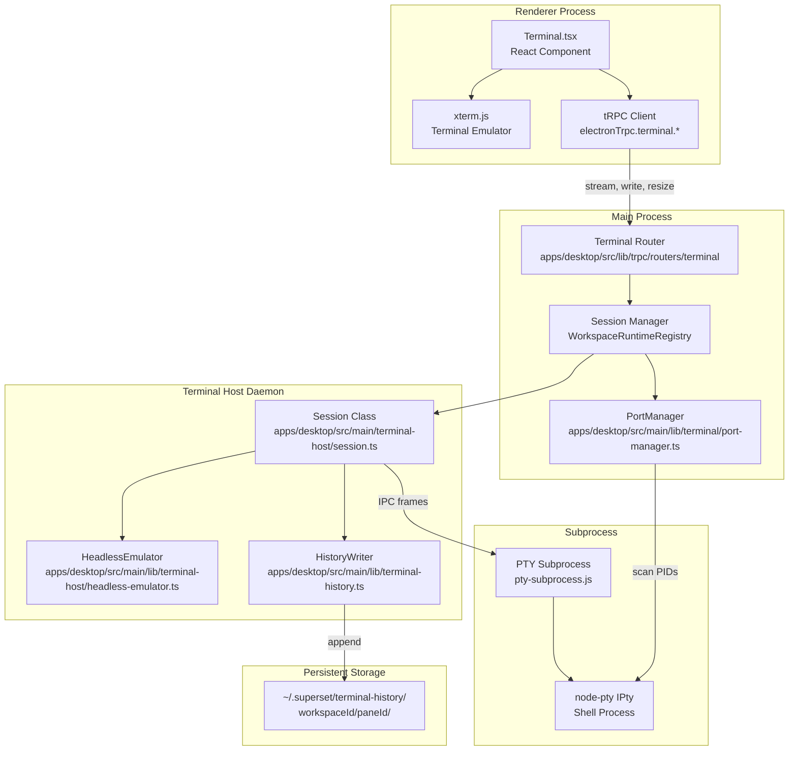
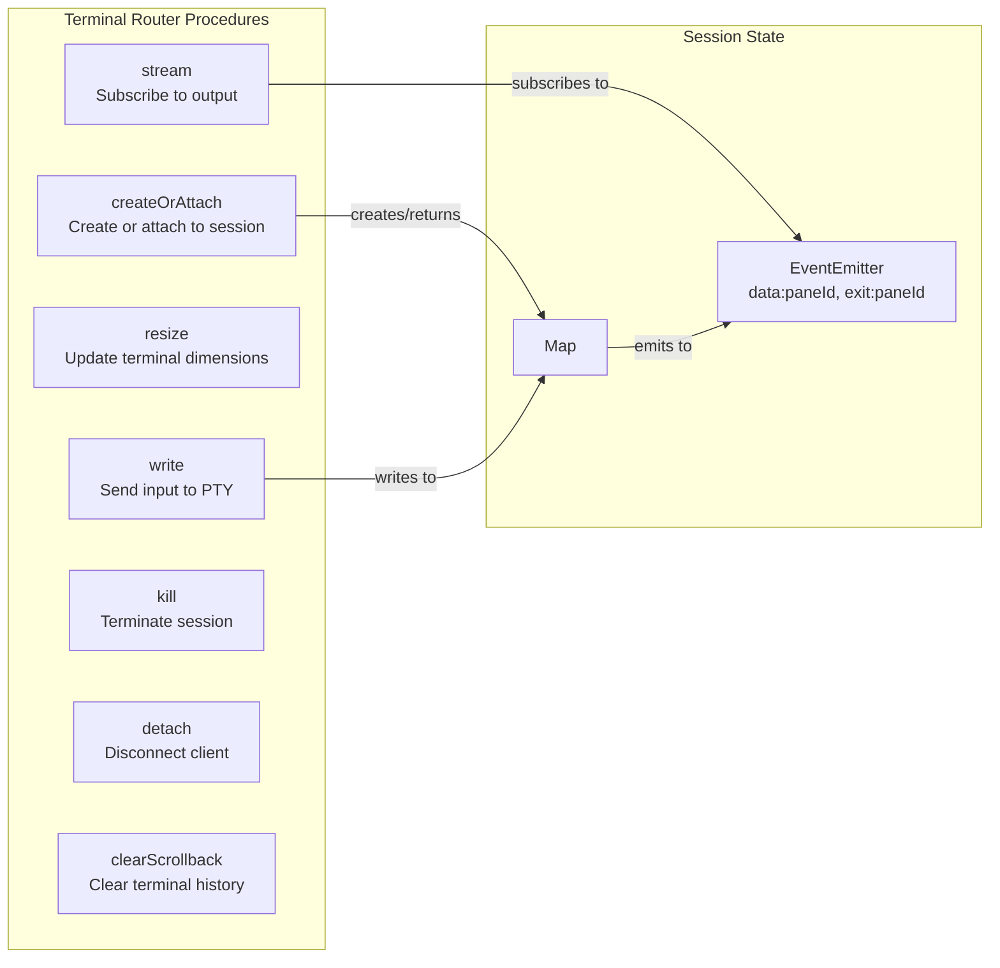
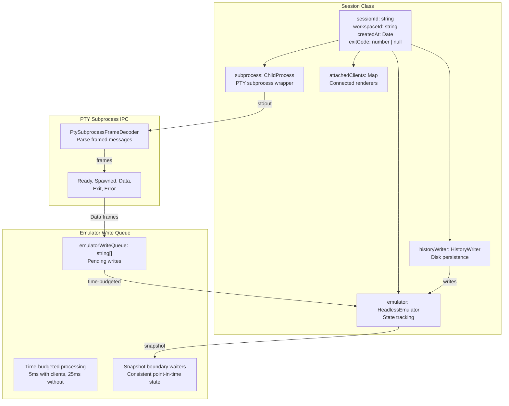
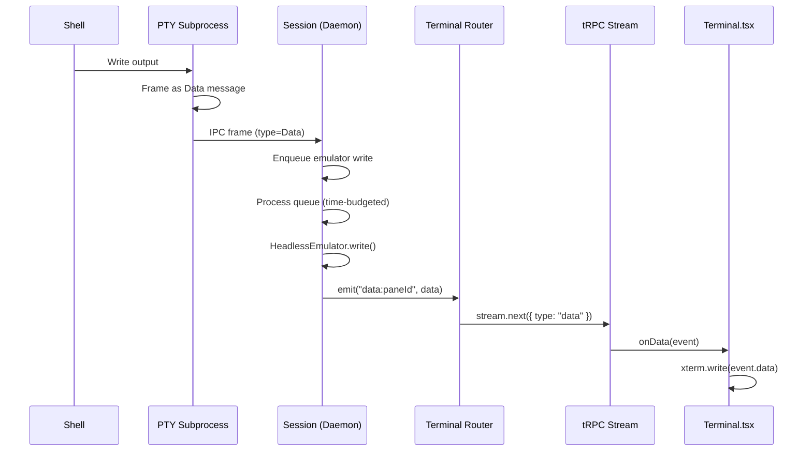
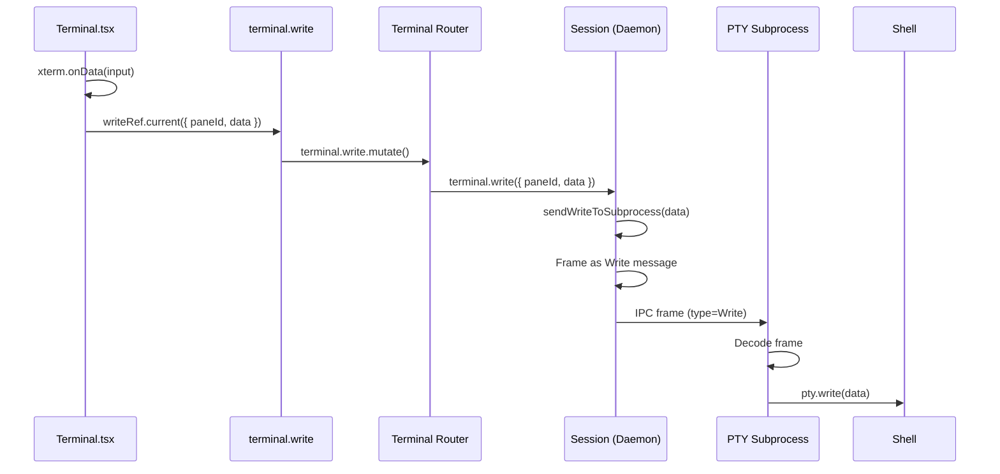
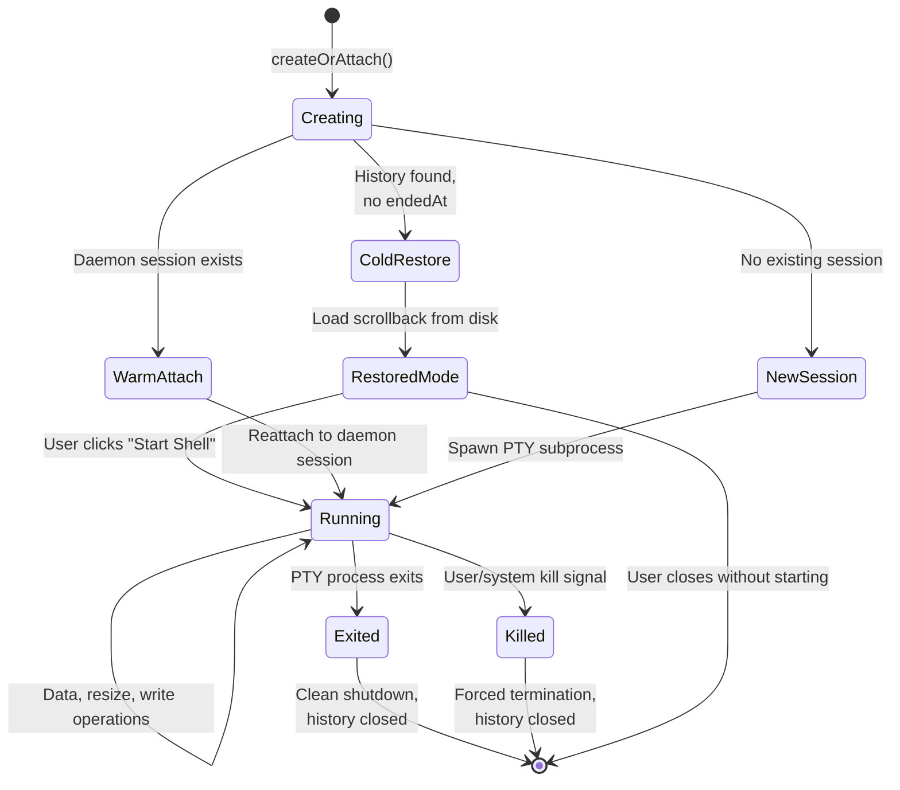

# Terminal System

<details>
<summary>Relevant source files</summary>

The following files were used as context for generating this wiki page:

- [apps/desktop/src/lib/trpc/routers/terminal/terminal.ts](apps/desktop/src/lib/trpc/routers/terminal/terminal.ts)
- [apps/desktop/src/main/lib/app-environment.ts](apps/desktop/src/main/lib/app-environment.ts)
- [apps/desktop/src/main/lib/data-batcher.ts](apps/desktop/src/main/lib/data-batcher.ts)
- [apps/desktop/src/main/lib/terminal-escape-filter.test.ts](apps/desktop/src/main/lib/terminal-escape-filter.test.ts)
- [apps/desktop/src/main/lib/terminal-escape-filter.ts](apps/desktop/src/main/lib/terminal-escape-filter.ts)
- [apps/desktop/src/main/lib/terminal-history.ts](apps/desktop/src/main/lib/terminal-history.ts)
- [apps/desktop/src/main/lib/terminal-host/headless-emulator.test.ts](apps/desktop/src/main/lib/terminal-host/headless-emulator.test.ts)
- [apps/desktop/src/main/lib/terminal-host/headless-emulator.ts](apps/desktop/src/main/lib/terminal-host/headless-emulator.ts)
- [apps/desktop/src/main/lib/terminal/port-manager.ts](apps/desktop/src/main/lib/terminal/port-manager.ts)
- [apps/desktop/src/main/lib/terminal/port-scanner.test.ts](apps/desktop/src/main/lib/terminal/port-scanner.test.ts)
- [apps/desktop/src/main/lib/terminal/port-scanner.ts](apps/desktop/src/main/lib/terminal/port-scanner.ts)
- [apps/desktop/src/main/lib/terminal/session.test.ts](apps/desktop/src/main/lib/terminal/session.test.ts)
- [apps/desktop/src/main/lib/terminal/session.ts](apps/desktop/src/main/lib/terminal/session.ts)
- [apps/desktop/src/main/lib/terminal/types.ts](apps/desktop/src/main/lib/terminal/types.ts)
- [apps/desktop/src/main/terminal-host/session.ts](apps/desktop/src/main/terminal-host/session.ts)
- [apps/desktop/src/renderer/screens/main/components/WorkspaceView/ContentView/TabsContent/Terminal/ScrollToBottomButton/ScrollToBottomButton.tsx](apps/desktop/src/renderer/screens/main/components/WorkspaceView/ContentView/TabsContent/Terminal/ScrollToBottomButton/ScrollToBottomButton.tsx)
- [apps/desktop/src/renderer/screens/main/components/WorkspaceView/ContentView/TabsContent/Terminal/ScrollToBottomButton/index.ts](apps/desktop/src/renderer/screens/main/components/WorkspaceView/ContentView/TabsContent/Terminal/ScrollToBottomButton/index.ts)
- [apps/desktop/src/renderer/screens/main/components/WorkspaceView/ContentView/TabsContent/Terminal/Terminal.tsx](apps/desktop/src/renderer/screens/main/components/WorkspaceView/ContentView/TabsContent/Terminal/Terminal.tsx)
- [apps/desktop/src/renderer/screens/main/components/WorkspaceView/ContentView/TabsContent/Terminal/config.ts](apps/desktop/src/renderer/screens/main/components/WorkspaceView/ContentView/TabsContent/Terminal/config.ts)
- [apps/desktop/src/renderer/screens/main/components/WorkspaceView/ContentView/TabsContent/Terminal/helpers.test.ts](apps/desktop/src/renderer/screens/main/components/WorkspaceView/ContentView/TabsContent/Terminal/helpers.test.ts)
- [apps/desktop/src/renderer/screens/main/components/WorkspaceView/ContentView/TabsContent/Terminal/helpers.ts](apps/desktop/src/renderer/screens/main/components/WorkspaceView/ContentView/TabsContent/Terminal/helpers.ts)
- [apps/desktop/src/renderer/screens/main/components/WorkspaceView/ContentView/TabsContent/Terminal/link-providers/index.ts](apps/desktop/src/renderer/screens/main/components/WorkspaceView/ContentView/TabsContent/Terminal/link-providers/index.ts)
- [apps/desktop/src/renderer/screens/main/components/WorkspaceView/ContentView/TabsContent/Terminal/link-providers/multi-line-link-provider.ts](apps/desktop/src/renderer/screens/main/components/WorkspaceView/ContentView/TabsContent/Terminal/link-providers/multi-line-link-provider.ts)
- [apps/desktop/src/renderer/screens/main/components/WorkspaceView/ContentView/TabsContent/Terminal/link-providers/url-link-provider.test.ts](apps/desktop/src/renderer/screens/main/components/WorkspaceView/ContentView/TabsContent/Terminal/link-providers/url-link-provider.test.ts)
- [apps/desktop/src/renderer/screens/main/components/WorkspaceView/ContentView/TabsContent/Terminal/link-providers/url-link-provider.ts](apps/desktop/src/renderer/screens/main/components/WorkspaceView/ContentView/TabsContent/Terminal/link-providers/url-link-provider.ts)
- [apps/desktop/src/renderer/screens/main/components/WorkspaceView/ContentView/TabsContent/Terminal/utils.ts](apps/desktop/src/renderer/screens/main/components/WorkspaceView/ContentView/TabsContent/Terminal/utils.ts)
- [apps/desktop/src/renderer/screens/main/components/WorkspaceView/RightSidebar/FilesView/types.ts](apps/desktop/src/renderer/screens/main/components/WorkspaceView/RightSidebar/FilesView/types.ts)
- [apps/desktop/src/renderer/stores/tabs/utils/terminal-cleanup.ts](apps/desktop/src/renderer/stores/tabs/utils/terminal-cleanup.ts)

</details>

## Purpose and Scope

The Terminal System provides integrated terminal emulation within the Superset desktop application. It implements a multi-process architecture that enables terminal sessions to persist across app restarts, tracks ports opened by terminal processes, and maintains terminal state including scrollback, working directory, and mode flags.

This page provides a high-level overview of the terminal system architecture and its core components. For detailed coverage of specific subsystems, see:

- [Terminal Architecture Overview](#2.8.1) for multi-layer design patterns
- [Terminal Session Lifecycle](#2.8.2) for session state management
- [Terminal UI Components](#2.8.3) for xterm.js integration
- [Terminal Backend and Daemon](#2.8.4) for daemon process architecture
- [Terminal Persistence and Cold Restore](#2.8.5) for session recovery
- [Port Detection System](#2.8.6) for automatic port tracking
- [Escape Sequence Processing](#2.8.7) for mode and CWD tracking

---

## System Architecture

The terminal system operates across multiple processes and layers to achieve session persistence and state tracking:

**Terminal System Layers**



Sources: [apps/desktop/src/renderer/screens/main/components/WorkspaceView/ContentView/TabsContent/Terminal/Terminal.tsx:1-430](), [apps/desktop/src/lib/trpc/routers/terminal/terminal.ts:1-505](), [apps/desktop/src/main/terminal-host/session.ts:1-1000]()

---

## Core Components

### Terminal UI Layer

The terminal UI is built using `xterm.js` and wrapped in a React component that manages lifecycle, subscriptions, and user interactions.

| Component                  | Location                                                                                                                | Purpose                                                             |
| -------------------------- | ----------------------------------------------------------------------------------------------------------------------- | ------------------------------------------------------------------- |
| `Terminal.tsx`             | [apps/desktop/src/renderer/screens/main/components/WorkspaceView/ContentView/TabsContent/Terminal/Terminal.tsx]()       | Main React component, manages xterm instance and tRPC subscriptions |
| `createTerminalInstance()` | [apps/desktop/src/renderer/screens/main/components/WorkspaceView/ContentView/TabsContent/Terminal/helpers.ts:175-306]() | Creates xterm.js instance with addons and event handlers            |
| `setupKeyboardHandler()`   | [apps/desktop/src/renderer/screens/main/components/WorkspaceView/ContentView/TabsContent/Terminal/helpers.ts:525-694]() | Custom keyboard event handling for shortcuts and terminal input     |
| `setupPasteHandler()`      | [apps/desktop/src/renderer/screens/main/components/WorkspaceView/ContentView/TabsContent/Terminal/helpers.ts:383-515]() | Bracketed paste mode and chunked paste handling                     |

**Key Features:**

- GPU-accelerated rendering via WebGL addon with fallback to DOM renderer
- Font ligatures support via LigaturesAddon
- Multi-line link detection for URLs and file paths
- Custom keyboard shortcuts (Cmd+Backspace, Cmd+Left/Right, etc.)
- Drag-and-drop file path insertion

Sources: [apps/desktop/src/renderer/screens/main/components/WorkspaceView/ContentView/TabsContent/Terminal/Terminal.tsx:307-356](), [apps/desktop/src/renderer/screens/main/components/WorkspaceView/ContentView/TabsContent/Terminal/helpers.ts:109-158]()

---

### Terminal Backend (tRPC Router)

The terminal tRPC router exposes procedures for terminal lifecycle management and I/O operations.

**Terminal tRPC Procedures**



**Environment Variables Set Per Session:**

| Variable                  | Purpose                                             |
| ------------------------- | --------------------------------------------------- |
| `SUPERSET_PANE_ID`        | Unique pane identifier for the terminal             |
| `SUPERSET_TAB_ID`         | Parent tab identifier                               |
| `SUPERSET_WORKSPACE_ID`   | Workspace the terminal belongs to                   |
| `SUPERSET_WORKSPACE_NAME` | Workspace name for scripts                          |
| `SUPERSET_WORKSPACE_PATH` | Worktree path for the workspace                     |
| `SUPERSET_ROOT_PATH`      | Main repository path                                |
| `SUPERSET_PORT`           | Hooks server port for agent notifications           |
| `PATH`                    | Prepended with `~/.superset/bin` for agent wrappers |

Sources: [apps/desktop/src/lib/trpc/routers/terminal/terminal.ts:34-47](), [apps/desktop/src/lib/trpc/routers/terminal/terminal.ts:59-193]()

---

### Terminal Daemon (Persistent Sessions)

The terminal host daemon runs as a separate process, maintaining terminal sessions that survive app restarts.

**Daemon Session Architecture**



**Session Persistence Flow:**

1. **Spawn**: `Session.spawn()` creates PTY subprocess, sends spawn command
2. **Data Flow**: PTY output → framed IPC → emulator write queue → HeadlessEmulator
3. **Snapshot**: Emulator tracks modes, CWD, scrollback; generates ANSI snapshot
4. **History**: HistoryWriter appends output to disk (5MB cap per session)
5. **Attach**: Clients connect via socket, receive snapshot + live stream
6. **Detach**: Clients disconnect, daemon continues running session

Sources: [apps/desktop/src/main/terminal-host/session.ts:87-173](), [apps/desktop/src/main/terminal-host/session.ts:490-558]()

---

### HeadlessEmulator (State Tracking)

The `HeadlessEmulator` wraps `@xterm/headless` to track terminal modes and generate snapshots for session restoration.

**Tracked Terminal Modes:**

| Mode                    | Escape Sequence  | Purpose                                  |
| ----------------------- | ---------------- | ---------------------------------------- |
| `applicationCursorKeys` | `CSI ? 1 h/l`    | Arrow keys send application sequences    |
| `bracketedPaste`        | `CSI ? 2004 h/l` | Paste wrapped in `\x1b[200~...\x1b[201~` |
| `alternateScreen`       | `CSI ? 1049 h/l` | Full-screen apps (vim, less)             |
| `mouseTrackingNormal`   | `CSI ? 1000 h/l` | Mouse click tracking                     |
| `mouseSgr`              | `CSI ? 1006 h/l` | SGR mouse encoding                       |
| `focusReporting`        | `CSI ? 1004 h/l` | Report focus in/out events               |
| `cursorVisible`         | `CSI ? 25 h/l`   | Show/hide cursor                         |

**CWD Tracking:**

- Parses `OSC 7 ; file://hostname/path BEL` sequences
- Shells emit this via `PROMPT_COMMAND` or equivalent hooks
- Enables terminal to resume in correct directory after restart

Sources: [apps/desktop/src/main/lib/terminal-host/headless-emulator.ts:34-50](), [apps/desktop/src/main/lib/terminal-host/headless-emulator.ts:339-427]()

---

## Data Flow

### Terminal Output Stream

**Output Path (PTY → Renderer)**



Sources: [apps/desktop/src/main/terminal-host/session.ts:260-335](), [apps/desktop/src/lib/trpc/routers/terminal/terminal.ts:436-502]()

### Terminal Input Stream

**Input Path (Renderer → PTY)**



Sources: [apps/desktop/src/lib/trpc/routers/terminal/terminal.ts:195-234](), [apps/desktop/src/main/terminal-host/session.ts:452-467]()

---

## Terminal Session Lifecycle

**Session State Transitions**



**Session Creation Flow:**

1. **Check Cold Restore**: Read `~/.superset/terminal-history/{workspaceId}/{paneId}/meta.json`
   - If exists and `!endedAt` → cold restore mode
   - If `endedAt` → clean shutdown, no restore
2. **Check Daemon Session**: Query daemon for existing session
   - If exists and alive → warm attach (reuse session)
   - If killed → allow restart if `allowKilled=true`
3. **Create New Session**: Spawn PTY subprocess, initialize HeadlessEmulator, start HistoryWriter

Sources: [apps/desktop/src/lib/trpc/routers/terminal/terminal.ts:73-192](), [apps/desktop/src/main/lib/terminal-history.ts:469-547]()

---

## Port Detection

The `PortManager` automatically detects TCP ports opened by terminal processes and their children.

**Port Scanning Strategy:**

| Platform    | Command                             | Filtering                                            |
| ----------- | ----------------------------------- | ---------------------------------------------------- |
| macOS/Linux | `lsof -p {pids} -iTCP -sTCP:LISTEN` | PID validation (lsof ignores -p if PIDs don't exist) |
| Windows     | `netstat -ano`                      | Parse output, filter by PID set                      |

**Detection Methods:**

1. **Periodic Scan**: Every 2.5 seconds, scan all session process trees
2. **Hint-Based Scan**: Detect output patterns (`listening on port X`, `server started on :X`) → scan after 500ms

**Port Information Tracked:**

```typescript
interface DetectedPort {
  port: number // TCP port number
  pid: number // Process ID
  processName: string // Process command name
  paneId: string // Terminal pane ID
  workspaceId: string // Workspace ID
  detectedAt: number // Timestamp
  address: string // Bind address (0.0.0.0, 127.0.0.1, etc.)
}
```

**Ignored Ports**: `22, 80, 443, 5432, 3306, 6379, 27017` (common system services)

Sources: [apps/desktop/src/main/lib/terminal/port-manager.ts:59-505](), [apps/desktop/src/main/lib/terminal/port-scanner.ts:34-115]()

---

## Scrollback Persistence

Terminal scrollback is persisted to disk to enable "cold restore" after app/system restarts.

**Storage Layout:**

```
~/.superset/terminal-history/
  {workspaceId}/
    {paneId}/
      scrollback.bin    # Raw ANSI output (UTF-8, max 5MB)
      meta.json         # Session metadata
```

**Meta.json Schema:**

```typescript
interface SessionMetadata {
  cwd: string // Working directory
  cols: number // Terminal columns
  rows: number // Terminal rows
  startedAt: string // ISO timestamp
  endedAt?: string // ISO timestamp (missing = unclean shutdown)
  exitCode?: number // Process exit code
}
```

**Write Strategy:**

- **Append-only**: `HistoryWriter` opens append stream, writes PTY output
- **Backpressure handling**: Queues up to 256KB in memory, drops beyond
- **Size cap**: 5MB per session, drops additional output with warning
- **Clean shutdown**: `endedAt` written on session exit
- **Unclean shutdown**: `endedAt` missing → enables cold restore

**Cold Restore Detection:**

1. Check if `meta.json` exists
2. Check if `endedAt` is missing
3. If both true → load `scrollback.bin` and `meta.json.cwd`
4. Display restored scrollback in read-only mode
5. Offer "Start Shell" button to resume in same directory

Sources: [apps/desktop/src/main/lib/terminal-history.ts:1-547](), [apps/desktop/src/main/lib/terminal-history.ts:124-464]()

---

## Escape Sequence Processing

The system parses ANSI escape sequences to maintain terminal state and detect special commands.

**Clear Scrollback Detection:**

The system detects when the user clears scrollback (Cmd+K in most shells) to reset history tracking:

- **ED3 Sequence** (`ESC [ 3 J`): Clear scrollback buffer - triggers history reinit
- **RIS Sequence** (`ESC c`): NOT detected as clear (TUI apps use for repaints)

When clear is detected:

1. Dispose current HeadlessEmulator
2. Create fresh emulator instance
3. Extract content after clear sequence
4. Reinitialize HistoryWriter with empty file

**Mode Tracking:**

Parses `CSI ? {mode} h` (DECSET) and `CSI ? {mode} l` (DECRST) sequences:

```typescript
const MODE_MAP: Record<number, keyof TerminalModes> = {
  1: 'applicationCursorKeys',
  6: 'originMode',
  7: 'autoWrap',
  25: 'cursorVisible',
  47: 'alternateScreen', // Legacy
  1000: 'mouseTrackingNormal',
  1006: 'mouseSgr',
  1049: 'alternateScreen', // Modern
  2004: 'bracketedPaste',
  // ... (see source for full list)
}
```

**CWD Extraction:**

Parses `OSC 7 ; file://hostname/path BEL` sequences:

- Shell emits via `PROMPT_COMMAND` (bash) or `precmd` (zsh)
- Path is NOT URL-encoded in the sequence
- Enables terminal to track current directory for session restore

Sources: [apps/desktop/src/main/lib/terminal-escape-filter.ts:1-46](), [apps/desktop/src/main/lib/terminal-host/headless-emulator.ts:428-605]()

---

## Integration Points

The terminal system integrates with other Superset subsystems:

| System               | Integration Point             | Purpose                               |
| -------------------- | ----------------------------- | ------------------------------------- |
| **Tab/Pane System**  | `useTabsStore`, paneId        | Terminal panes live in mosaic layout  |
| **Workspace System** | `workspaceId`, workspace path | CWD resolution, environment variables |
| **Settings System**  | Font, theme, presets          | Terminal appearance and behavior      |
| **Agent System**     | `~/.superset/bin` in PATH     | Intercept agent commands              |
| **Git System**       | Workspace path, CWD           | Commands run in worktree context      |
| **File System**      | Drag-and-drop, file links     | Shell-escaped path insertion          |
| **Theme System**     | Terminal colors, theme type   | Light/dark mode, custom themes        |

Sources: [apps/desktop/src/renderer/screens/main/components/WorkspaceView/ContentView/TabsContent/Terminal/Terminal.tsx:39-83](), [apps/desktop/src/lib/trpc/routers/terminal/terminal.ts:113-139]()
