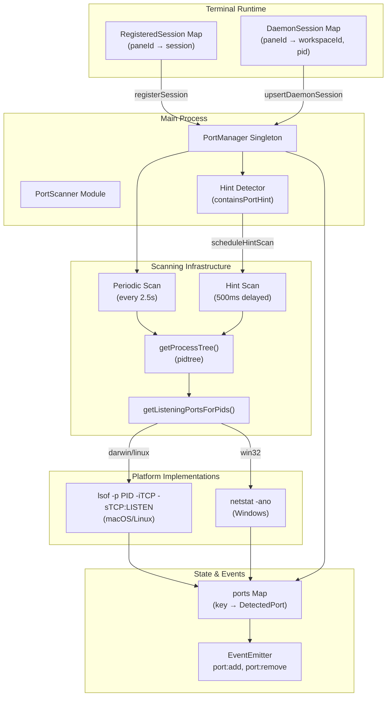
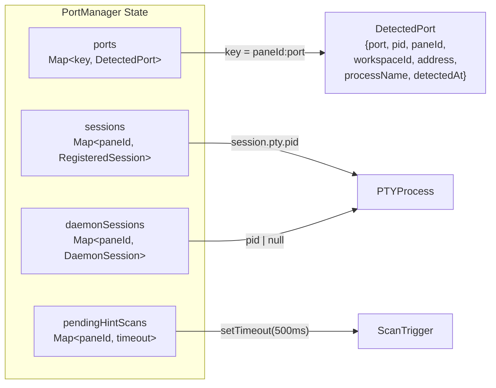
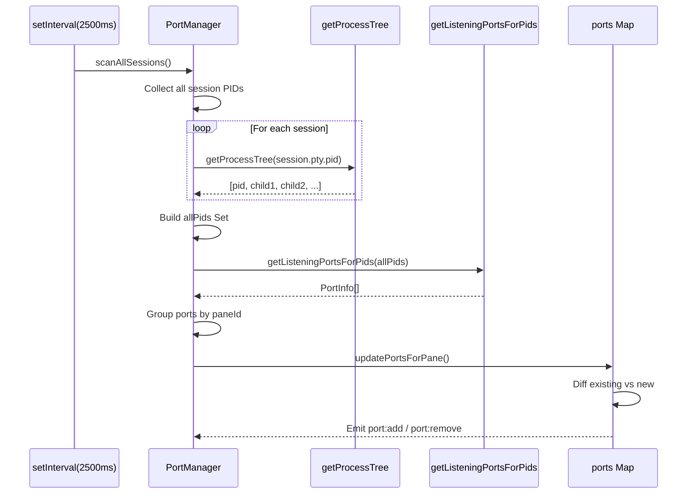
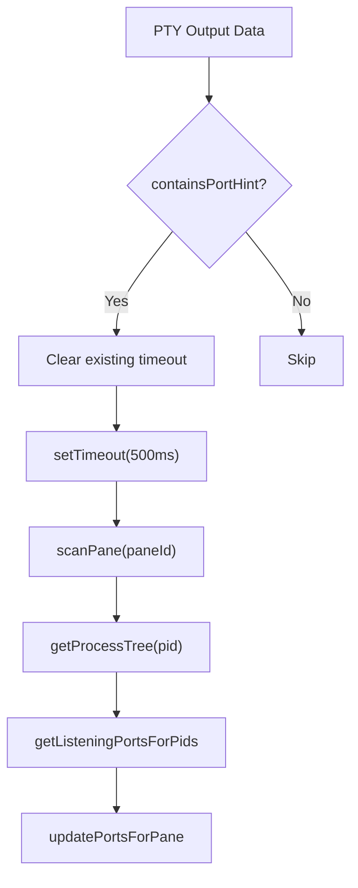
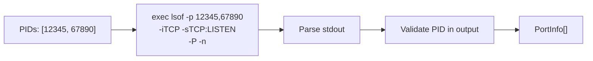
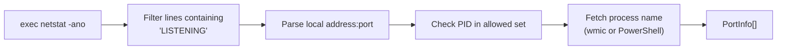
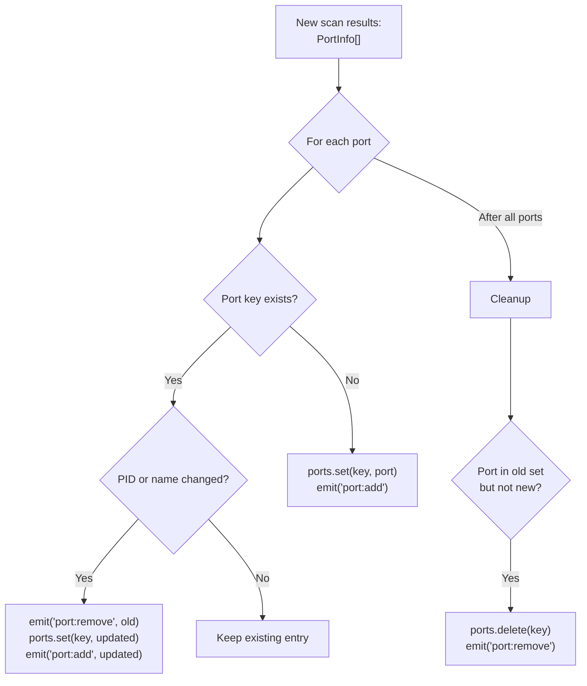
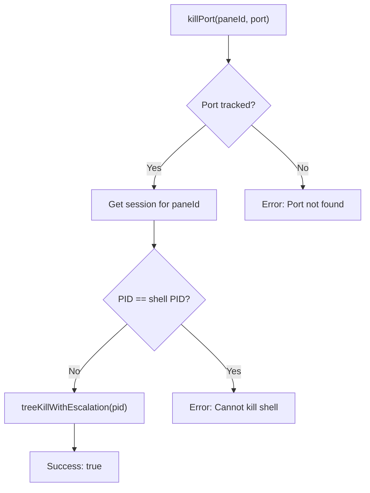

# Port Detection System

<details>
<summary>Relevant source files</summary>

The following files were used as context for generating this wiki page:

- [apps/desktop/src/lib/trpc/routers/terminal/terminal.ts](apps/desktop/src/lib/trpc/routers/terminal/terminal.ts)
- [apps/desktop/src/main/lib/app-environment.ts](apps/desktop/src/main/lib/app-environment.ts)
- [apps/desktop/src/main/lib/data-batcher.ts](apps/desktop/src/main/lib/data-batcher.ts)
- [apps/desktop/src/main/lib/terminal-escape-filter.test.ts](apps/desktop/src/main/lib/terminal-escape-filter.test.ts)
- [apps/desktop/src/main/lib/terminal-escape-filter.ts](apps/desktop/src/main/lib/terminal-escape-filter.ts)
- [apps/desktop/src/main/lib/terminal-history.ts](apps/desktop/src/main/lib/terminal-history.ts)
- [apps/desktop/src/main/lib/terminal-host/headless-emulator.test.ts](apps/desktop/src/main/lib/terminal-host/headless-emulator.test.ts)
- [apps/desktop/src/main/lib/terminal-host/headless-emulator.ts](apps/desktop/src/main/lib/terminal-host/headless-emulator.ts)
- [apps/desktop/src/main/lib/terminal/port-manager.ts](apps/desktop/src/main/lib/terminal/port-manager.ts)
- [apps/desktop/src/main/lib/terminal/port-scanner.test.ts](apps/desktop/src/main/lib/terminal/port-scanner.test.ts)
- [apps/desktop/src/main/lib/terminal/port-scanner.ts](apps/desktop/src/main/lib/terminal/port-scanner.ts)
- [apps/desktop/src/main/lib/terminal/session.test.ts](apps/desktop/src/main/lib/terminal/session.test.ts)
- [apps/desktop/src/main/lib/terminal/session.ts](apps/desktop/src/main/lib/terminal/session.ts)
- [apps/desktop/src/main/lib/terminal/types.ts](apps/desktop/src/main/lib/terminal/types.ts)
- [apps/desktop/src/main/terminal-host/session.ts](apps/desktop/src/main/terminal-host/session.ts)
- [apps/desktop/src/renderer/screens/main/components/WorkspaceView/ContentView/TabsContent/Terminal/config.ts](apps/desktop/src/renderer/screens/main/components/WorkspaceView/ContentView/TabsContent/Terminal/config.ts)
- [apps/desktop/src/renderer/stores/tabs/utils/terminal-cleanup.ts](apps/desktop/src/renderer/stores/tabs/utils/terminal-cleanup.ts)

</details>

The Port Detection System automatically tracks TCP ports opened by processes running in terminal sessions. It monitors process trees spawned by PTY subprocesses, detects when development servers or other network services start listening, and emits events that enable UI features like port forwarding indicators and "open in browser" actions.

For terminal session management, see [Terminal Session Lifecycle](#2.8.2). For the broader terminal architecture context, see [Terminal Architecture Overview](#2.8.1).

---

## Purpose and Scope

The port detection system provides:

- **Automatic port discovery**: Scans terminal process trees periodically to detect listening TCP ports
- **Hint-based opportunistic scanning**: Triggers immediate scans when terminal output contains port-related patterns (e.g., "listening on port 3000")
- **Cross-platform support**: Uses `lsof` on macOS/Linux and `netstat` on Windows
- **Session isolation**: Tracks which workspace and pane each port belongs to
- **Event emission**: Notifies subscribers when ports are added or removed
- **Process attribution**: Associates ports with specific PIDs and process names

This system is specific to detecting ports opened by terminal sessions. For general process management, see the Terminal Backend documentation.

---

## Architecture Overview



**Port Detection Flow**

Sources: [apps/desktop/src/main/lib/terminal/port-manager.ts:1-505](), [apps/desktop/src/main/lib/terminal/port-scanner.ts:1-246]()

---

## PortManager Class

The `PortManager` is a singleton that orchestrates port detection across all terminal sessions. It maintains registries of both regular and daemon-mode sessions, schedules scans, and emits port lifecycle events.

### Core Responsibilities

| Responsibility       | Implementation                                           |
| -------------------- | -------------------------------------------------------- |
| Session registration | `registerSession()`, `upsertDaemonSession()`             |
| Periodic scanning    | `setInterval()` every 2500ms                             |
| Hint-based scanning  | Pattern matching + delayed scan                          |
| Port tracking        | `Map<string, DetectedPort>` keyed by `${paneId}:${port}` |
| Event emission       | Extends `EventEmitter`                                   |
| Port termination     | `killPort()` with safety checks                          |

### State Management



**PortManager Internal State**

Sources: [apps/desktop/src/main/lib/terminal/port-manager.ts:59-67](), [shared/types:DetectedPort]()

### Session Registration

Terminal sessions must register with the `PortManager` to be included in port scans:

**Regular Sessions** (main process mode):

```typescript
// apps/desktop/src/main/lib/terminal/port-manager.ts:76-78
registerSession(session: TerminalSession, workspaceId: string): void
```

**Daemon Sessions** (persistent mode):

```typescript
// apps/desktop/src/main/lib/terminal/port-manager.ts:94-100
upsertDaemonSession(paneId: string, workspaceId: string, pid: number | null): void
```

The dual registration pattern supports both:

- **Embedded mode**: Session runs in main process, direct access to `TerminalSession.pty.pid`
- **Daemon mode**: Session runs in separate daemon process, PID communicated via IPC

Sources: [apps/desktop/src/main/lib/terminal/port-manager.ts:76-109]()

---

## Periodic Scanning

The `PortManager` runs background scans every 2.5 seconds to detect port changes:



**Periodic Scan Sequence**

### Scan Algorithm

The scan process follows these steps:

1. **PID Collection** ([port-manager.ts:223-253]()):
   - Iterate all registered and daemon sessions
   - Call `getProcessTree(pid)` for each session's PTY PID
   - Build a `Map<paneId, {workspaceId, pids}>` and unified `Set<number>` of all PIDs

2. **Batch Port Query** ([port-manager.ts:299-323]()):
   - Single call to `getListeningPortsForPids(allPids)` for all processes
   - Returns `PortInfo[]` with `{port, pid, address, processName}`

3. **Port Attribution** ([port-manager.ts:311-320]()):
   - Map each `PortInfo.pid` back to its owning `paneId` via `pidOwnerMap`
   - Group ports by pane: `Map<paneId, PortInfo[]>`

4. **State Reconciliation** ([port-manager.ts:380-436]()):
   - Compare new ports with existing `ports` Map
   - Emit `port:add` for new entries
   - Emit `port:remove` for disappeared entries
   - Update metadata (PID, process name) for existing ports that changed ownership

Sources: [apps/desktop/src/main/lib/terminal/port-manager.ts:355-378](), [apps/desktop/src/main/lib/terminal/port-manager.ts:214-342]()

---

## Hint-Based Detection

To reduce latency when servers start, the `PortManager` detects port-related patterns in terminal output and triggers immediate scans:

### Hint Patterns

```typescript
// apps/desktop/src/main/lib/terminal/port-manager.ts:24-34
function containsPortHint(data: string): boolean {
  const portPatterns = [
    /listening\s+on\s+(?:port\s+)?(\d+)/i,
    /server\s+(?:started|running)\s+(?:on|at)\s+(?:http:\/\/)?(?:localhost|127\.0\.0\.1|0\.0\.0\.0)?:?(\d+)/i,
    /ready\s+on\s+(?:http:\/\/)?(?:localhost|127\.0\.0\.1|0\.0\.0\.0)?:?(\d+)/i,
    /port\s+(\d+)/i,
    /:(\d{4,5})\s*$/,
  ]
  return portPatterns.some((pattern) => pattern.test(data))
}
```

### Hint Scan Flow



**Hint-Based Scan Trigger**

The 500ms delay ([port-manager.ts:15]()) prevents redundant scans when:

- Multiple hint-containing lines appear in rapid succession
- Server startup prints several status messages
- Build tools emit progress updates

Only the most recent hint schedules a scan; earlier timeouts are cancelled.

Sources: [apps/desktop/src/main/lib/terminal/port-manager.ts:111-160](), [apps/desktop/src/main/lib/terminal/port-manager.ts:24-34]()

---

## Cross-Platform Port Scanning

The system uses platform-specific commands to query listening ports:

### macOS / Linux: lsof



**lsof-based Port Detection**

#### Command Flags

| Flag           | Purpose                                     |
| -------------- | ------------------------------------------- |
| `-p ${pids}`   | Filter by process IDs (comma-separated)     |
| `-iTCP`        | Only TCP connections                        |
| `-sTCP:LISTEN` | Only listening sockets                      |
| `-P`           | Don't convert port numbers to service names |
| `-n`           | Don't resolve hostnames to IPs              |

#### Output Format

```
COMMAND   PID   USER  FD  TYPE  DEVICE    SIZE/OFF  NODE  NAME
node      12345 user  23u IPv4  0x123456  0t0       TCP   *:3000 (LISTEN)
```

The parser extracts ([port-scanner.ts:73-108]()):

- Column 0: `processName` (e.g., "node")
- Column 1: `pid` (verified against requested set)
- Column N-2: `NAME` field (e.g., "\*:3000"), parsed for address and port

#### Critical: PID Validation

**Bug Prevention**: `lsof` ignores the `-p` filter when requested PIDs don't exist, returning ALL listening ports system-wide. The parser MUST validate each line's PID against the requested set ([port-scanner.ts:87-88]()):

```typescript
if (!pidSet.has(pid)) continue
```

Sources: [apps/desktop/src/main/lib/terminal/port-scanner.ts:54-113](), [apps/desktop/src/main/lib/terminal/port-scanner.test.ts:306-324]()

### Windows: netstat



**netstat-based Port Detection (Windows)**

#### Output Format

```
Proto  Local Address      Foreign Address    State       PID
TCP    0.0.0.0:3000       0.0.0.0:0          LISTENING   12345
```

#### Process Name Resolution

Windows requires a separate query for process names ([port-scanner.ts:198-220]()):

1. **Primary**: `wmic process where processid=${pid} get name`
2. **Fallback**: `powershell -Command "(Get-Process -Id ${pid}).ProcessName"`

Process names are batched during the initial parse pass to minimize shell invocations.

Sources: [apps/desktop/src/main/lib/terminal/port-scanner.ts:119-193]()

---

## Port Lifecycle and Events

The `PortManager` extends `EventEmitter` to notify subscribers of port changes:

### Event Types

```typescript
// Event: "port:add"
{
  port: number
  pid: number
  processName: string
  paneId: string
  workspaceId: string
  detectedAt: number
  address: string // "0.0.0.0", "127.0.0.1", "::", etc.
}

// Event: "port:remove"
// Same shape as DetectedPort
```

### Update Logic



**Port State Reconciliation**

The reconciliation algorithm ([port-manager.ts:380-436]()):

1. Iterate new ports from scan
2. For each port:
   - If new: add to map and emit `port:add`
   - If exists with different PID/name: emit `port:remove` + `port:add` pair
   - If unchanged: no-op
3. After processing new ports, iterate existing map
4. Remove any ports not seen in latest scan, emitting `port:remove`

This ensures the map always reflects current state and subscribers receive accurate deltas.

Sources: [apps/desktop/src/main/lib/terminal/port-manager.ts:380-436]()

---

## Port Termination

The `PortManager` provides a `killPort()` method to terminate processes listening on tracked ports:

### Safety Checks



**Port Kill Safety Validation**

### Implementation

```typescript
// apps/desktop/src/main/lib/terminal/port-manager.ts:471-501
async killPort({ paneId, port }: { paneId: string; port: number }): Promise<{
  success: boolean;
  error?: string;
}>
```

**Protection**: The method refuses to kill the terminal's shell process ([port-manager.ts:493-498]()), preventing accidental terminal closure when the user meant to kill a child server process.

**Kill Strategy**: Uses `treeKillWithEscalation()` which:

1. Sends `SIGTERM` to process tree
2. Waits for graceful shutdown
3. Escalates to `SIGKILL` if processes don't exit

Sources: [apps/desktop/src/main/lib/terminal/port-manager.ts:471-502](), [apps/desktop/src/main/lib/tree-kill.ts]()

---

## Integration with Terminal System

### Registration Points

Terminal sessions register with the `PortManager` at creation and cleanup on disposal:

**Main Process Mode**:

```typescript
// After creating session in main process
portManager.registerSession(session, workspaceId)

// On session disposal
portManager.unregisterSession(paneId)
```

**Daemon Mode**:

```typescript
// When PTY spawns in daemon
portManager.upsertDaemonSession(paneId, workspaceId, ptyPid)

// When session exits
portManager.unregisterDaemonSession(paneId)
```

### Output Monitoring

The terminal data handler checks each chunk for port hints:

```typescript
// In terminal session data handler
pty.onData((data) => {
  portManager.checkOutputForHint(data, paneId)
  // ... continue with normal data handling
})
```

This tight integration enables zero-configuration port detection without requiring developers to manually annotate which commands open ports.

Sources: [apps/desktop/src/main/lib/terminal/port-manager.ts:76-109](), [apps/desktop/src/main/lib/terminal/session.ts:169-190]()

---

## Configuration and Constants

### Timing Parameters

| Constant             | Value  | Purpose                                 |
| -------------------- | ------ | --------------------------------------- |
| `SCAN_INTERVAL_MS`   | 2500ms | Periodic scan frequency                 |
| `HINT_SCAN_DELAY_MS` | 500ms  | Debounce delay for hint-triggered scans |
| `EXEC_TIMEOUT_MS`    | 5000ms | Shell command timeout (lsof/netstat)    |

### Ignored Ports

Common system services excluded from tracking ([port-manager.ts:18]()):

```typescript
const IGNORED_PORTS = new Set([22, 80, 443, 5432, 3306, 6379, 27017])
```

These ports (SSH, HTTP, HTTPS, PostgreSQL, MySQL, Redis, MongoDB) are typically long-running system services, not development servers spawned by terminal sessions.

Sources: [apps/desktop/src/main/lib/terminal/port-manager.ts:12-18](), [apps/desktop/src/main/lib/terminal/port-scanner.ts:8-9]()

---

## Performance Considerations

### Scan Throttling

The `isScanning` flag prevents concurrent scans ([port-manager.ts:66](), [port-manager.ts:356-357]()):

```typescript
if (this.isScanning) return
this.isScanning = true
// ... scan logic
this.isScanning = false
```

If a periodic scan is still running when the next interval fires, the new scan is skipped. This prevents queue buildup when the system is under heavy load or process enumeration is slow.

### Batch Processing

Instead of querying ports per session:

- Collect all PIDs across sessions first
- Single `getListeningPortsForPids()` call for all PIDs
- Parse output once and distribute to sessions

This reduces shell invocations from O(sessions) to O(1) per scan.

### Process Tree Caching

The `pidtree` library internally caches process relationships, reducing the cost of repeated `getProcessTree()` calls for the same PID.

Sources: [apps/desktop/src/main/lib/terminal/port-manager.ts:355-378](), [apps/desktop/src/main/lib/terminal/port-scanner.ts:21-28]()

---

## Testing

The port scanner includes comprehensive tests for lsof output parsing:

### Test Coverage

| Test Category    | Focus                                          |
| ---------------- | ---------------------------------------------- |
| Standard formats | IPv4, IPv6, wildcard addresses                 |
| Edge cases       | Empty output, malformed lines, invalid ports   |
| Real-world data  | Actual macOS lsof output with system processes |
| PID filtering    | Validation that unrelated ports are excluded   |

### Critical Test: PID Filter Bypass

The test suite includes a regression test for the PID validation bug ([port-scanner.test.ts:306-324]()):

```
Input: lsof output with system ports (947, 1020, 3457) + requested port (12345)
Expected: Only port from PID 12345 returned
Validates: Parser doesn't leak system ports when lsof ignores -p filter
```

This test ensures the parser correctly filters PIDs even when `lsof` returns unrelated processes.

Sources: [apps/desktop/src/main/lib/terminal/port-scanner.test.ts:1-327]()
