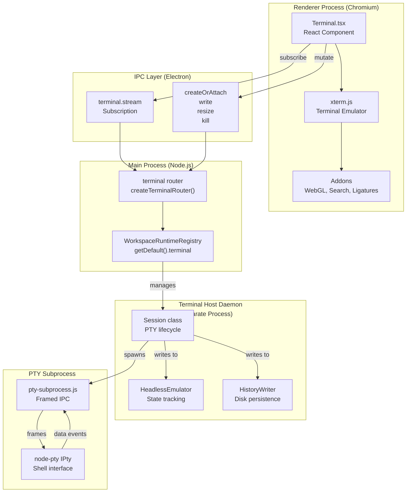
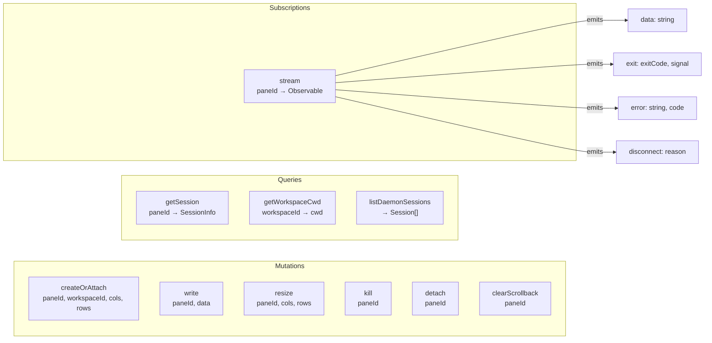
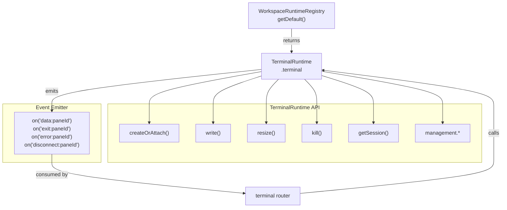
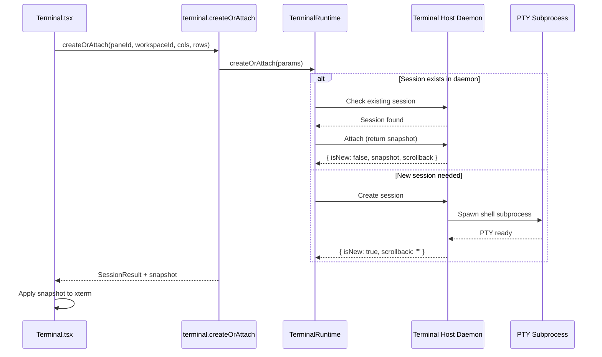
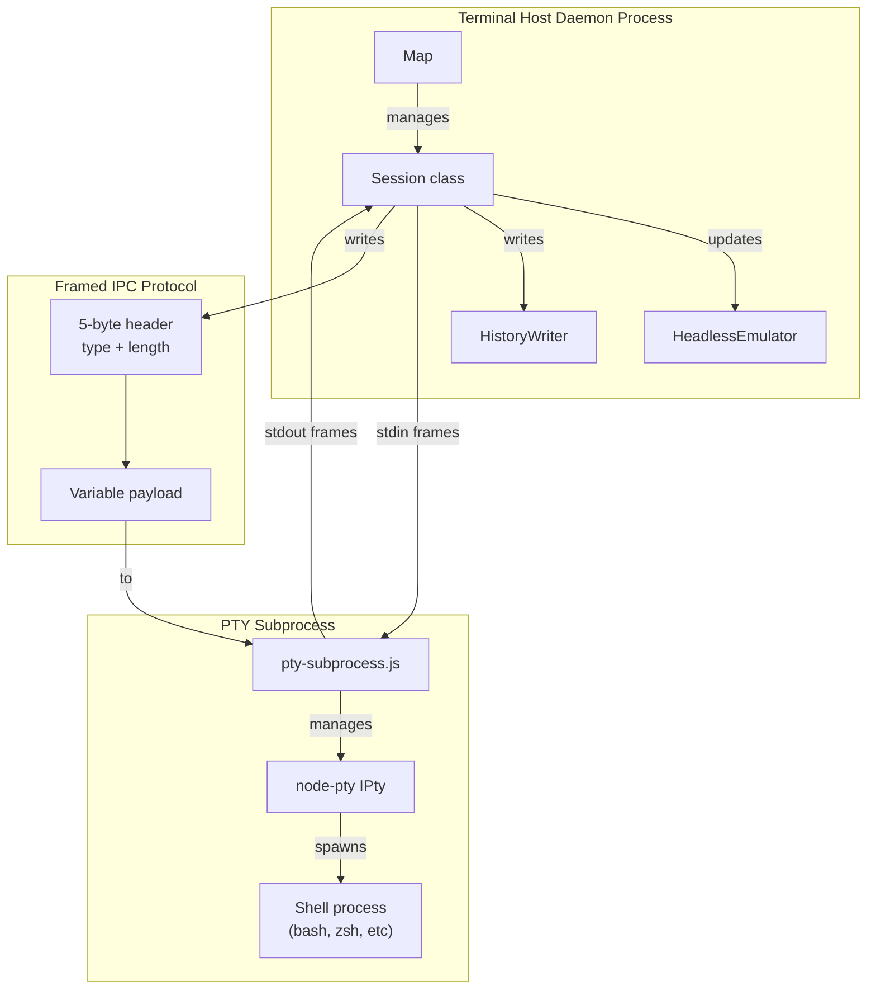
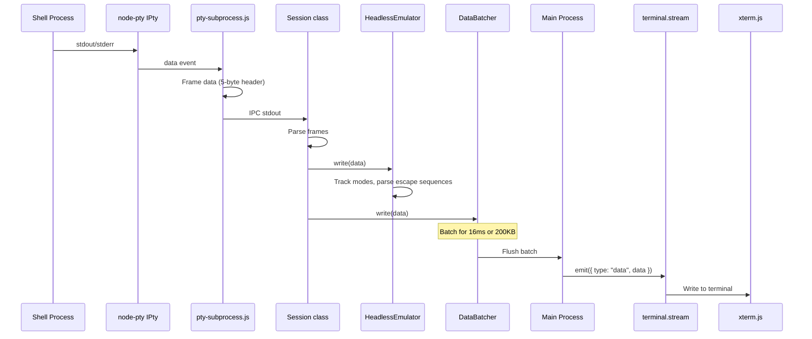
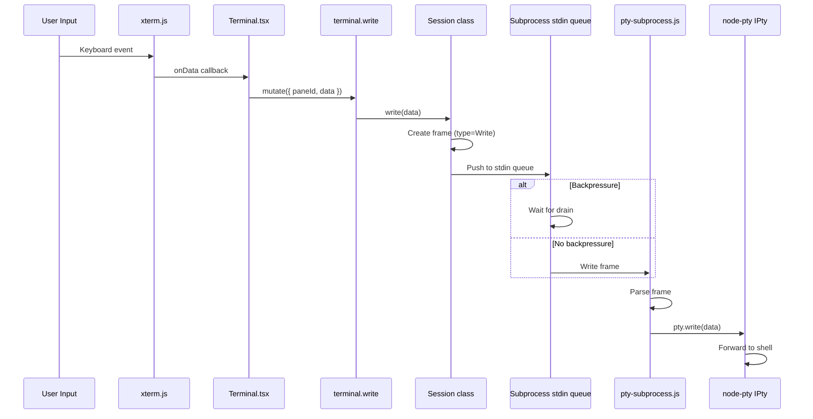
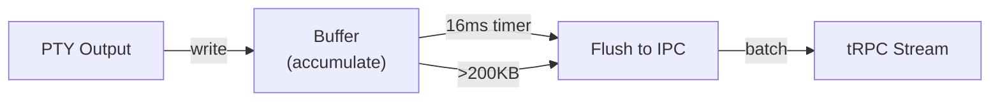
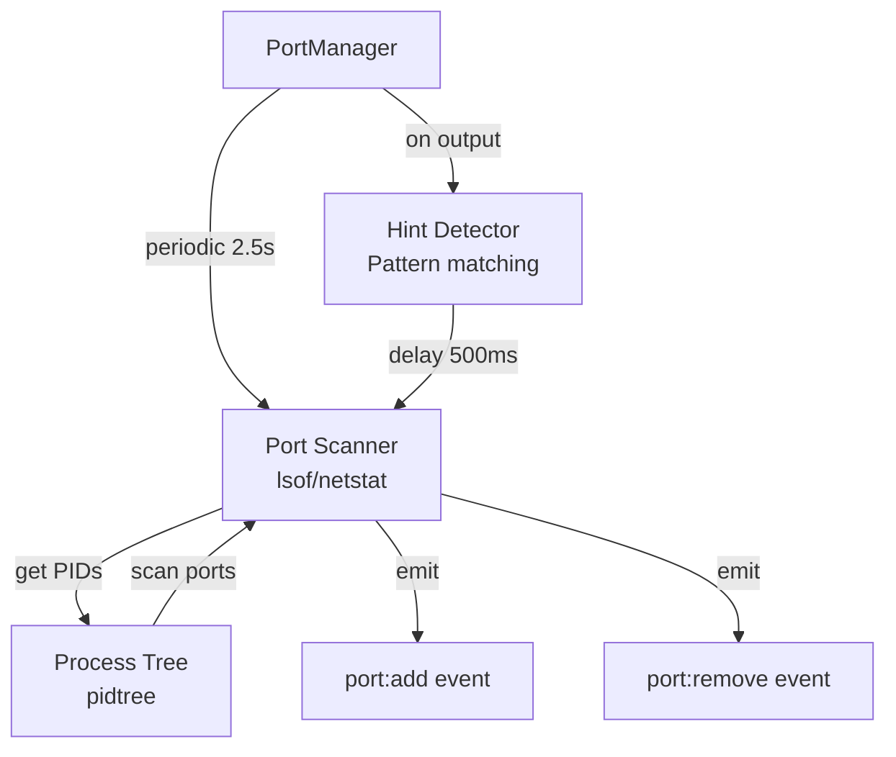

# Terminal Architecture Overview

<details>
<summary>Relevant source files</summary>

The following files were used as context for generating this wiki page:

- [apps/desktop/src/lib/trpc/routers/terminal/terminal.ts](apps/desktop/src/lib/trpc/routers/terminal/terminal.ts)
- [apps/desktop/src/main/lib/app-environment.ts](apps/desktop/src/main/lib/app-environment.ts)
- [apps/desktop/src/main/lib/data-batcher.ts](apps/desktop/src/main/lib/data-batcher.ts)
- [apps/desktop/src/main/lib/terminal-escape-filter.test.ts](apps/desktop/src/main/lib/terminal-escape-filter.test.ts)
- [apps/desktop/src/main/lib/terminal-escape-filter.ts](apps/desktop/src/main/lib/terminal-escape-filter.ts)
- [apps/desktop/src/main/lib/terminal-history.ts](apps/desktop/src/main/lib/terminal-history.ts)
- [apps/desktop/src/main/lib/terminal-host/headless-emulator.test.ts](apps/desktop/src/main/lib/terminal-host/headless-emulator.test.ts)
- [apps/desktop/src/main/lib/terminal-host/headless-emulator.ts](apps/desktop/src/main/lib/terminal-host/headless-emulator.ts)
- [apps/desktop/src/main/lib/terminal/port-manager.ts](apps/desktop/src/main/lib/terminal/port-manager.ts)
- [apps/desktop/src/main/lib/terminal/port-scanner.test.ts](apps/desktop/src/main/lib/terminal/port-scanner.test.ts)
- [apps/desktop/src/main/lib/terminal/port-scanner.ts](apps/desktop/src/main/lib/terminal/port-scanner.ts)
- [apps/desktop/src/main/lib/terminal/session.test.ts](apps/desktop/src/main/lib/terminal/session.test.ts)
- [apps/desktop/src/main/lib/terminal/session.ts](apps/desktop/src/main/lib/terminal/session.ts)
- [apps/desktop/src/main/lib/terminal/types.ts](apps/desktop/src/main/lib/terminal/types.ts)
- [apps/desktop/src/main/terminal-host/session.ts](apps/desktop/src/main/terminal-host/session.ts)
- [apps/desktop/src/renderer/screens/main/components/WorkspaceView/ContentView/TabsContent/Terminal/ScrollToBottomButton/ScrollToBottomButton.tsx](apps/desktop/src/renderer/screens/main/components/WorkspaceView/ContentView/TabsContent/Terminal/ScrollToBottomButton/ScrollToBottomButton.tsx)
- [apps/desktop/src/renderer/screens/main/components/WorkspaceView/ContentView/TabsContent/Terminal/ScrollToBottomButton/index.ts](apps/desktop/src/renderer/screens/main/components/WorkspaceView/ContentView/TabsContent/Terminal/ScrollToBottomButton/index.ts)
- [apps/desktop/src/renderer/screens/main/components/WorkspaceView/ContentView/TabsContent/Terminal/Terminal.tsx](apps/desktop/src/renderer/screens/main/components/WorkspaceView/ContentView/TabsContent/Terminal/Terminal.tsx)
- [apps/desktop/src/renderer/screens/main/components/WorkspaceView/ContentView/TabsContent/Terminal/config.ts](apps/desktop/src/renderer/screens/main/components/WorkspaceView/ContentView/TabsContent/Terminal/config.ts)
- [apps/desktop/src/renderer/screens/main/components/WorkspaceView/ContentView/TabsContent/Terminal/helpers.test.ts](apps/desktop/src/renderer/screens/main/components/WorkspaceView/ContentView/TabsContent/Terminal/helpers.test.ts)
- [apps/desktop/src/renderer/screens/main/components/WorkspaceView/ContentView/TabsContent/Terminal/helpers.ts](apps/desktop/src/renderer/screens/main/components/WorkspaceView/ContentView/TabsContent/Terminal/helpers.ts)
- [apps/desktop/src/renderer/screens/main/components/WorkspaceView/ContentView/TabsContent/Terminal/link-providers/index.ts](apps/desktop/src/renderer/screens/main/components/WorkspaceView/ContentView/TabsContent/Terminal/link-providers/index.ts)
- [apps/desktop/src/renderer/screens/main/components/WorkspaceView/ContentView/TabsContent/Terminal/link-providers/multi-line-link-provider.ts](apps/desktop/src/renderer/screens/main/components/WorkspaceView/ContentView/TabsContent/Terminal/link-providers/multi-line-link-provider.ts)
- [apps/desktop/src/renderer/screens/main/components/WorkspaceView/ContentView/TabsContent/Terminal/link-providers/url-link-provider.test.ts](apps/desktop/src/renderer/screens/main/components/WorkspaceView/ContentView/TabsContent/Terminal/link-providers/url-link-provider.test.ts)
- [apps/desktop/src/renderer/screens/main/components/WorkspaceView/ContentView/TabsContent/Terminal/link-providers/url-link-provider.ts](apps/desktop/src/renderer/screens/main/components/WorkspaceView/ContentView/TabsContent/Terminal/link-providers/url-link-provider.ts)
- [apps/desktop/src/renderer/screens/main/components/WorkspaceView/ContentView/TabsContent/Terminal/utils.ts](apps/desktop/src/renderer/screens/main/components/WorkspaceView/ContentView/TabsContent/Terminal/utils.ts)
- [apps/desktop/src/renderer/screens/main/components/WorkspaceView/RightSidebar/FilesView/types.ts](apps/desktop/src/renderer/screens/main/components/WorkspaceView/RightSidebar/FilesView/types.ts)
- [apps/desktop/src/renderer/stores/tabs/utils/terminal-cleanup.ts](apps/desktop/src/renderer/stores/tabs/utils/terminal-cleanup.ts)

</details>

## Purpose and Scope

This document describes the multi-layer architecture of the terminal system, which enables persistent terminal sessions that survive app restarts. The design spans from the React UI layer down to PTY subprocesses, with each layer serving a specific purpose in the overall system.

For information about specific terminal features:

- Terminal session lifecycle and state transitions: [2.8.2](#2.8.2)
- UI components and xterm.js integration: [2.8.3](#2.8.3)
- Daemon implementation details: [2.8.4](#2.8.4)
- Cold restore and persistence: [2.8.5](#2.8.5)
- Port detection: [2.8.6](#2.8.6)
- Escape sequence processing: [2.8.7](#2.8.7)

---

## Architecture Overview

The terminal system is designed as a **five-layer architecture** that isolates concerns and enables session persistence:



**Sources:**

- [apps/desktop/src/renderer/screens/main/components/WorkspaceView/ContentView/TabsContent/Terminal/Terminal.tsx:1-430]()
- [apps/desktop/src/lib/trpc/routers/terminal/terminal.ts:1-504]()
- [apps/desktop/src/main/terminal-host/session.ts:1-958]()

---

## Layer 1: UI Layer (Renderer Process)

The UI layer consists of React components and xterm.js instances that render terminal content to the user.

### Terminal.tsx Component

The `Terminal` component is the top-level React component that orchestrates terminal rendering and user interaction:

| Responsibility          | Implementation                                           |
| ----------------------- | -------------------------------------------------------- |
| **Terminal Instance**   | Creates xterm.js instance via `createTerminalInstance()` |
| **Session Connection**  | Calls `terminal.createOrAttach` mutation on mount        |
| **Stream Subscription** | Subscribes to `terminal.stream` for data events          |
| **User Input**          | Handles keyboard, paste, copy via event handlers         |
| **State Management**    | Tracks exit status, connection errors, restore mode      |

Key refs maintained by Terminal.tsx:

```
xtermRef: XTerm instance
fitAddonRef: FitAddon for responsive sizing
rendererRef: GPU renderer (WebGL or DOM)
createOrAttachRef: Mutation function ref
writeRef: Write mutation ref
resizeRef: Resize mutation ref
```

**Sources:**

- [apps/desktop/src/renderer/screens/main/components/WorkspaceView/ContentView/TabsContent/Terminal/Terminal.tsx:39-430]()
- [apps/desktop/src/renderer/screens/main/components/WorkspaceView/ContentView/TabsContent/Terminal/helpers.ts:175-306]()

### xterm.js Integration

Terminal rendering uses `@xterm/xterm` with several addons for enhanced functionality:

| Addon              | Purpose                                      |
| ------------------ | -------------------------------------------- |
| **FitAddon**       | Auto-resize terminal to container dimensions |
| **WebglAddon**     | GPU-accelerated rendering (fallback to DOM)  |
| **LigaturesAddon** | Font ligature support for programming fonts  |
| **ClipboardAddon** | Clipboard integration                        |
| **SearchAddon**    | Text search within scrollback                |
| **ImageAddon**     | Inline image rendering                       |

The GPU renderer uses a fallback strategy:

```
Try WebGL → Success: Use WebGL
         → Failure: Use DOM renderer
         → Context Loss: Switch to DOM + refresh
```

**Sources:**

- [apps/desktop/src/renderer/screens/main/components/WorkspaceView/ContentView/TabsContent/Terminal/helpers.ts:71-158]()
- [apps/desktop/src/renderer/screens/main/components/WorkspaceView/ContentView/TabsContent/Terminal/config.ts:34-51]()

---

## Layer 2: IPC Layer (tRPC)

Communication between renderer and main process uses **tRPC** for type-safe procedure calls.

### Terminal Router Procedures



### Stream Event Types

The `terminal.stream` subscription emits four event types:

| Event Type     | Payload                                        | When Emitted                     |
| -------------- | ---------------------------------------------- | -------------------------------- |
| **data**       | `{ type: "data", data: string }`               | PTY output received              |
| **exit**       | `{ type: "exit", exitCode, signal?, reason? }` | Shell exits                      |
| **error**      | `{ type: "error", error, code? }`              | Write failed or subprocess error |
| **disconnect** | `{ type: "disconnect", reason }`               | Daemon connection lost           |

**Sources:**

- [apps/desktop/src/lib/trpc/routers/terminal/terminal.ts:59-502]()
- [apps/desktop/src/lib/trpc/routers/terminal/terminal.ts:436-502]()

---

## Layer 3: Session Management (Main Process)

The main process manages terminal sessions through the `WorkspaceRuntimeRegistry`:



### createOrAttach Flow

The `createOrAttach` mutation handles both new session creation and reconnection to existing sessions:



**Sources:**

- [apps/desktop/src/lib/trpc/routers/terminal/terminal.ts:59-193]()
- [apps/desktop/src/main/lib/terminal/session.ts:79-196]()

---

## Layer 4: Daemon and Subprocess

### Terminal Host Daemon Architecture

The daemon runs as a **separate Node.js process** that manages persistent terminal sessions:



### Session Class Responsibilities

The `Session` class in the daemon manages the lifecycle of a single terminal session:

| Responsibility                | Implementation                                     |
| ----------------------------- | -------------------------------------------------- |
| **PTY Subprocess Management** | Spawns and communicates with pty-subprocess.js     |
| **Client Attachment**         | Tracks attached sockets (main process connections) |
| **Data Routing**              | Routes PTY output to attached clients              |
| **Backpressure Handling**     | Pauses PTY output when clients are slow            |
| **State Tracking**            | Maintains HeadlessEmulator for snapshot generation |
| **Persistence**               | Writes scrollback to disk via HistoryWriter        |

**Sources:**

- [apps/desktop/src/main/terminal-host/session.ts:87-958]()
- [apps/desktop/src/main/lib/terminal/session.ts:79-196]()

---

## Data Flow

### Output Path (PTY → UI)



### Input Path (UI → PTY)



**Sources:**

- [apps/desktop/src/main/terminal-host/session.ts:260-335]()
- [apps/desktop/src/main/lib/data-batcher.ts:1-87]()
- [apps/desktop/src/lib/trpc/routers/terminal/terminal.ts:195-234]()

---

## Performance Optimizations

### Data Batching

The `DataBatcher` class reduces IPC overhead by batching terminal output:

| Parameter             | Value | Reason                                           |
| --------------------- | ----- | ------------------------------------------------ |
| **BATCH_DURATION_MS** | 16ms  | Smooth 60fps updates                             |
| **BATCH_MAX_SIZE**    | 200KB | Prevent excessive memory usage                   |
| **String Decoder**    | UTF-8 | Handle multi-byte characters split across chunks |



**Sources:**

- [apps/desktop/src/main/lib/data-batcher.ts:1-87]()

### Emulator Write Queue

The daemon's `HeadlessEmulator` uses a **time-budgeted write queue** to prevent blocking:

```
Base budget: 5ms (with clients) or 25ms (no clients)
Large backlog: 25ms minimum budget
Chunk size: 8192 chars per iteration
```

This keeps the daemon responsive while processing large amounts of terminal output.

**Sources:**

- [apps/desktop/src/main/terminal-host/headless-emulator.ts:504-558]()

### GPU Rendering

xterm.js rendering uses WebGL when available for hardware acceleration:

```
WebGL available → WebglAddon.load()
WebGL context lost → Fallback to DOM
WebGL unavailable → DOM renderer
```

The renderer preference is cached in `localStorage` to avoid repeated WebGL initialization failures.

**Sources:**

- [apps/desktop/src/renderer/screens/main/components/WorkspaceView/ContentView/TabsContent/Terminal/helpers.ts:71-158]()

---

## State Tracking and Snapshots

### HeadlessEmulator

The daemon maintains a `HeadlessEmulator` instance for each session to track terminal state:

| Tracked State      | Purpose                                                    |
| ------------------ | ---------------------------------------------------------- |
| **Terminal Modes** | DECSET/DECRST flags (bracketed paste, mouse tracking, etc) |
| **Buffer Content** | Scrollback for snapshot generation                         |
| **CWD**            | Current working directory via OSC-7                        |
| **Dimensions**     | cols × rows                                                |

The emulator parses escape sequences to detect mode changes:

```
ESC [ ? <mode> h  →  Enable mode
ESC [ ? <mode> l  →  Disable mode
ESC ] 7 ; <url> BEL  →  Set CWD
```

**Sources:**

- [apps/desktop/src/main/lib/terminal-host/headless-emulator.ts:62-334]()
- [apps/desktop/src/main/lib/terminal-host/headless-emulator.ts:340-581]()

### Snapshot Generation

The `getSnapshot()` method produces a complete terminal state snapshot:

```typescript
interface TerminalSnapshot {
  snapshotAnsi: string // Serialized terminal content
  rehydrateSequences: string // Mode restoration sequences
  cwd: string | null // Current working directory
  modes: TerminalModes // Tracked mode flags
  cols: number // Terminal width
  rows: number // Terminal height
  scrollbackLines: number // Buffer line count
}
```

Snapshots are used for:

1. **Warm attach**: Reconnecting to existing daemon sessions
2. **Cold restore**: Recovering sessions after app restart (see [2.8.5](#2.8.5))

**Sources:**

- [apps/desktop/src/main/lib/terminal-host/types.ts:43-89]()
- [apps/desktop/src/main/lib/terminal-host/headless-emulator.ts:231-308]()

---

## Session Persistence

The architecture enables **three levels of session persistence**:

| Level            | Mechanism                            | Survives            |
| ---------------- | ------------------------------------ | ------------------- |
| **Hot attach**   | In-memory session in main process    | Window close/reopen |
| **Warm attach**  | Daemon session with snapshot         | App restart         |
| **Cold restore** | Disk-persisted scrollback + metadata | System reboot       |

### Daemon Persistence

When the app restarts, the daemon process continues running with active sessions. The main process reconnects by calling `createOrAttach` with `skipColdRestore: true`.

### Cold Restore

If the daemon is not running (system reboot), sessions can be restored from disk via `HistoryWriter`:

```
~/.superset/terminal-history/
  <workspaceId>/
    <paneId>/
      scrollback.bin    (UTF-8 PTY output)
      meta.json         (cols, rows, cwd, timestamps)
```

Detection logic:

- `meta.json` exists but lacks `endedAt` → unclean shutdown → can restore
- `meta.json` has `endedAt` → clean exit → no restore

**Sources:**

- [apps/desktop/src/main/lib/terminal-history.ts:1-576]()
- [apps/desktop/src/lib/trpc/routers/terminal/terminal.ts:156-162]()

---

## Auxiliary Systems

### Port Detection

The `PortManager` class detects listening ports in terminal sessions:



**Hint patterns** trigger immediate scans:

- "listening on port 3000"
- "server started on :8080"
- "ready on http://localhost:5173"

**Sources:**

- [apps/desktop/src/main/lib/terminal/port-manager.ts:1-504]()
- [apps/desktop/src/main/lib/terminal/port-scanner.ts:1-248]()

### Escape Sequence Filtering

The system detects clear scrollback sequences to recreate the emulator:

| Sequence      | Meaning                | Action                              |
| ------------- | ---------------------- | ----------------------------------- |
| **ESC [ 3 J** | Clear scrollback (ED3) | Dispose emulator, create new one    |
| **ESC c**     | Reset (RIS)            | Ignored (used by TUIs for repaints) |

This prevents corrupted scrollback when the user runs `clear` or presses Cmd+K.

**Sources:**

- [apps/desktop/src/main/lib/terminal-escape-filter.ts:1-47]()
- [apps/desktop/src/main/lib/terminal/session.ts:169-190]()

---

## Key Code Entities

### Core Classes

| Class                | Location                                | Responsibility          |
| -------------------- | --------------------------------------- | ----------------------- |
| **Terminal** (React) | `Terminal.tsx:39`                       | UI component            |
| **Session** (Daemon) | `terminal-host/session.ts:87`           | PTY lifecycle in daemon |
| **HeadlessEmulator** | `terminal-host/headless-emulator.ts:62` | State tracking          |
| **HistoryWriter**    | `terminal-history.ts:124`               | Disk persistence        |
| **PortManager**      | `terminal/port-manager.ts:59`           | Port detection          |
| **DataBatcher**      | `data-batcher.ts:20`                    | IPC optimization        |

### tRPC Procedures

| Procedure                  | Type         | Purpose                  |
| -------------------------- | ------------ | ------------------------ |
| `terminal.createOrAttach`  | Mutation     | Create/reconnect session |
| `terminal.stream`          | Subscription | Real-time output         |
| `terminal.write`           | Mutation     | Send input to PTY        |
| `terminal.resize`          | Mutation     | Update dimensions        |
| `terminal.kill`            | Mutation     | Terminate session        |
| `terminal.clearScrollback` | Mutation     | Clear buffer             |

**Sources:**

- [apps/desktop/src/renderer/screens/main/components/WorkspaceView/ContentView/TabsContent/Terminal/Terminal.tsx:39-430]()
- [apps/desktop/src/main/terminal-host/session.ts:87-958]()
- [apps/desktop/src/lib/trpc/routers/terminal/terminal.ts:48-504]()
