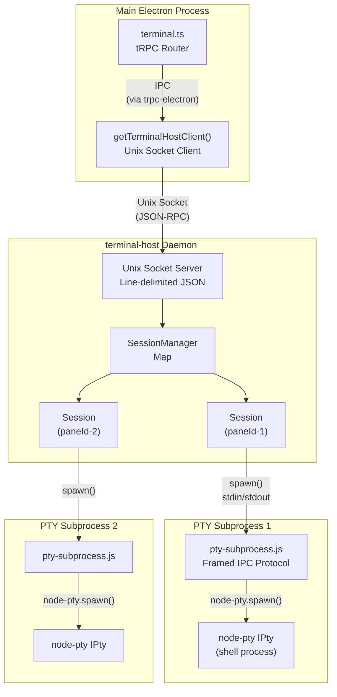
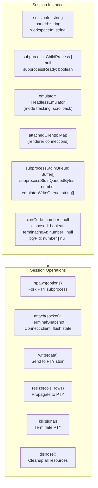
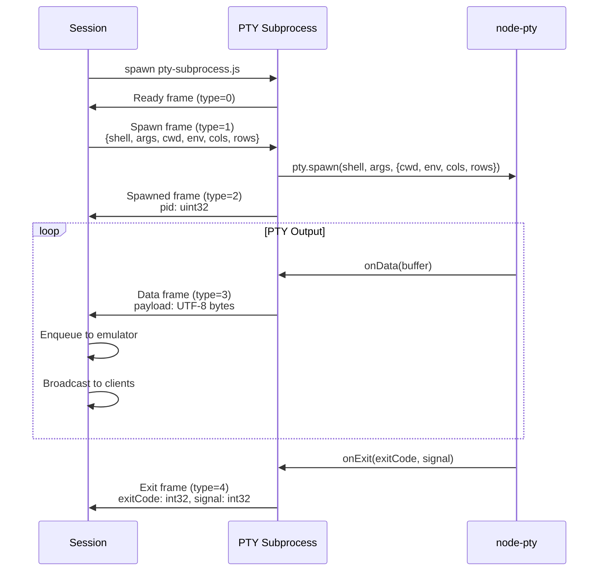
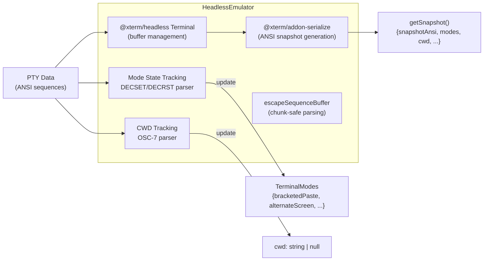
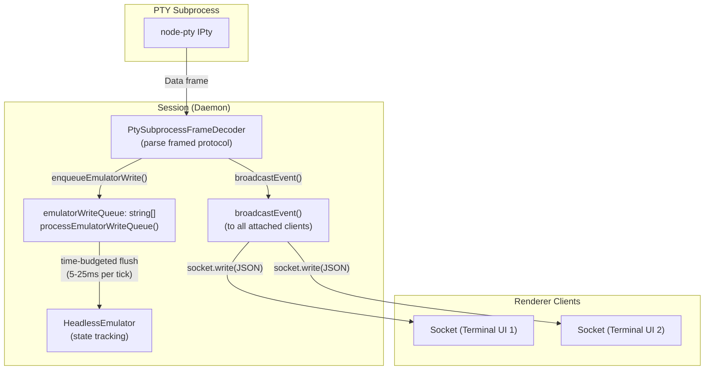
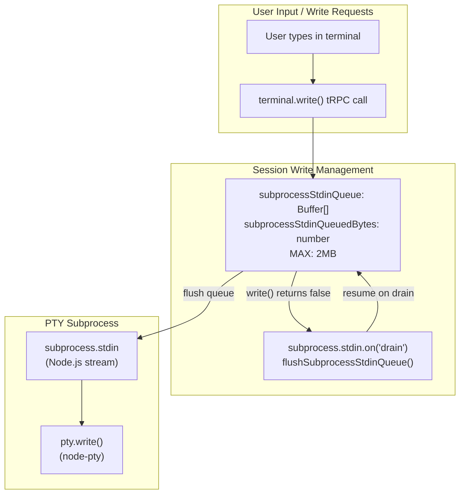
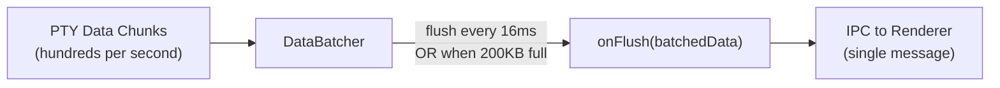

# Terminal Backend and Daemon

<details>
<summary>Relevant source files</summary>

The following files were used as context for generating this wiki page:

- [apps/desktop/src/lib/trpc/routers/terminal/terminal.ts](apps/desktop/src/lib/trpc/routers/terminal/terminal.ts)
- [apps/desktop/src/main/lib/app-environment.ts](apps/desktop/src/main/lib/app-environment.ts)
- [apps/desktop/src/main/lib/data-batcher.ts](apps/desktop/src/main/lib/data-batcher.ts)
- [apps/desktop/src/main/lib/terminal-escape-filter.test.ts](apps/desktop/src/main/lib/terminal-escape-filter.test.ts)
- [apps/desktop/src/main/lib/terminal-escape-filter.ts](apps/desktop/src/main/lib/terminal-escape-filter.ts)
- [apps/desktop/src/main/lib/terminal-history.ts](apps/desktop/src/main/lib/terminal-history.ts)
- [apps/desktop/src/main/lib/terminal-host/headless-emulator.test.ts](apps/desktop/src/main/lib/terminal-host/headless-emulator.test.ts)
- [apps/desktop/src/main/lib/terminal-host/headless-emulator.ts](apps/desktop/src/main/lib/terminal-host/headless-emulator.ts)
- [apps/desktop/src/main/lib/terminal/port-manager.ts](apps/desktop/src/main/lib/terminal/port-manager.ts)
- [apps/desktop/src/main/lib/terminal/port-scanner.test.ts](apps/desktop/src/main/lib/terminal/port-scanner.test.ts)
- [apps/desktop/src/main/lib/terminal/port-scanner.ts](apps/desktop/src/main/lib/terminal/port-scanner.ts)
- [apps/desktop/src/main/lib/terminal/session.test.ts](apps/desktop/src/main/lib/terminal/session.test.ts)
- [apps/desktop/src/main/lib/terminal/session.ts](apps/desktop/src/main/lib/terminal/session.ts)
- [apps/desktop/src/main/lib/terminal/types.ts](apps/desktop/src/main/lib/terminal/types.ts)
- [apps/desktop/src/main/terminal-host/session.ts](apps/desktop/src/main/terminal-host/session.ts)
- [apps/desktop/src/renderer/screens/main/components/WorkspaceView/ContentView/TabsContent/Terminal/config.ts](apps/desktop/src/renderer/screens/main/components/WorkspaceView/ContentView/TabsContent/Terminal/config.ts)
- [apps/desktop/src/renderer/stores/tabs/utils/terminal-cleanup.ts](apps/desktop/src/renderer/stores/tabs/utils/terminal-cleanup.ts)

</details>


## Purpose and Scope

This document describes the terminal-host daemon architecture and the `Session` class that manages persistent terminal sessions. The daemon runs as a separate process from the main Electron process, enabling terminal sessions to survive app restarts and providing process isolation for PTY operations.

For information about the overall terminal architecture and how the daemon fits into the larger system, see [Terminal Architecture Overview](#2.8.1). For details on terminal persistence and cold restore capabilities, see [Terminal Persistence and Cold Restore](#2.8.5).

**Sources:** [apps/desktop/src/main/terminal-host/session.ts:1-42]()

---

## Daemon Process Architecture

The terminal-host daemon isolates terminal sessions from the main Electron process using a three-tier architecture:



**Key isolation boundaries:**

| Boundary | Purpose | Communication |
|----------|---------|---------------|
| Main ↔ Daemon | App restart survival | Unix socket with JSON-RPC protocol |
| Daemon ↔ Subprocess | Write queue isolation | ChildProcess stdin/stdout with framed protocol |
| Subprocess ↔ PTY | Shell process lifecycle | node-pty native bindings |

**Sources:** [apps/desktop/src/main/terminal-host/session.ts:87-246](), [apps/desktop/src/main/lib/trpc/routers/terminal/terminal.ts:48-56]()

---

## Session Class Architecture

The `Session` class in [session.ts:87-941]() is the core abstraction that owns a PTY subprocess and manages its lifecycle, state tracking, and client attachments.



**Core responsibilities:**

- **PTY Subprocess Management**: Spawns and monitors the subprocess that owns the actual PTY
- **State Tracking**: Maintains a `HeadlessEmulator` that mirrors the PTY's terminal state
- **Client Multiplexing**: Broadcasts PTY output to multiple attached renderer clients
- **Backpressure Handling**: Manages write queues to prevent memory exhaustion under load
- **Snapshot Generation**: Produces complete terminal state for session restoration

**Sources:** [apps/desktop/src/main/terminal-host/session.ts:87-173]()

---

## PTY Subprocess Communication

The `Session` spawns a subprocess running [pty-subprocess.js]() that isolates blocking PTY operations from the daemon's event loop. Communication uses a framed binary protocol over stdin/stdout.



**Frame format** (5-byte header + payload):

```
[0]: type (uint8)
[1-4]: payload length (uint32, little-endian)
[5+]: payload bytes
```

**Frame types** defined in [pty-subprocess-ipc.ts:29-39]():

| Type | Name | Direction | Payload |
|------|------|-----------|---------|
| 0 | Ready | → Session | Empty |
| 1 | Spawn | → Subprocess | JSON config |
| 2 | Spawned | → Session | pid (uint32) |
| 3 | Data | → Session | UTF-8 terminal output |
| 4 | Exit | → Session | exitCode (int32) + signal (int32) |
| 5 | Write | → Subprocess | UTF-8 user input |
| 6 | Resize | → Subprocess | cols (uint32) + rows (uint32) |
| 7 | Kill | → Subprocess | signal name (UTF-8 string) |
| 8 | Signal | → Subprocess | signal name (UTF-8 string) |
| 9 | Error | → Session | error message (UTF-8) |
| 10 | Dispose | → Subprocess | Empty |

**Sources:** [apps/desktop/src/main/terminal-host/session.ts:257-335](), [apps/desktop/src/main/terminal-host/pty-subprocess-ipc.ts:1-95]()

---

## HeadlessEmulator State Tracking

The `HeadlessEmulator` class wraps `@xterm/headless` to track terminal state without a browser DOM. It parses escape sequences to maintain mode flags and CWD.



**Tracked modes** from [headless-emulator.ts:34-50]():

| Mode | DECSET/DECRST | Description |
|------|---------------|-------------|
| `applicationCursorKeys` | `?1h` / `?1l` | App cursor vs. normal cursor keys |
| `bracketedPaste` | `?2004h` / `?2004l` | Wrap pasted text in markers |
| `alternateScreen` | `?1049h` / `?1049l` | TUI alternate buffer |
| `cursorVisible` | `?25h` / `?25l` | Show/hide cursor |
| `mouseTrackingNormal` | `?1000h` / `?1000l` | Mouse click tracking |
| `mouseSgr` | `?1006h` / `?1006l` | SGR mouse encoding |
| `focusReporting` | `?1004h` / `?1004l` | Focus in/out events |

**Escape sequence parsing** with chunk-safe buffering:

The emulator buffers incomplete sequences that span chunk boundaries. Only tracked sequences (DECSET/DECRST and OSC-7) are buffered to prevent memory leaks from malformed data.

**Sources:** [apps/desktop/src/main/lib/terminal-host/headless-emulator.ts:62-175](), [apps/desktop/src/main/lib/terminal-host/headless-emulator.ts:340-437]()

---

## Data Flow and Event Broadcasting

Terminal data flows from PTY through the emulator to attached clients with batching and backpressure handling.



**Write queue processing strategy:**

The emulator write queue is processed with time budgets to keep the daemon responsive:

- **Base budget**: 5ms per tick when clients attached, 25ms when idle
- **Backlog boost**: Increase budget to 25ms when queue exceeds 1MB
- **Chunk size**: Process up to 8192 chars per write call

This prevents blocking the daemon event loop during high-throughput PTY output (e.g., `cat large.log`).

**Sources:** [apps/desktop/src/main/terminal-host/session.ts:282-293](), [apps/desktop/src/main/terminal-host/session.ts:504-558]()

---

## Write Queue and Backpressure Management

The `Session` manages two write queues to prevent memory exhaustion under backpressure:



**Backpressure limits:**

- **Subprocess stdin queue cap**: 2MB (`MAX_SUBPROCESS_STDIN_QUEUE_BYTES`)
- **Behavior when full**: Drop writes and emit `WRITE_QUEUE_FULL` error event
- **Recovery**: Automatic flush on `drain` event from subprocess stdin stream

**Client socket backpressure:**

When a client socket's write buffer fills (slow renderer or network), the `Session`:

1. Pauses `subprocess.stdout` reading
2. Waits for client `socket.on('drain')` event
3. Resumes subprocess output when all clients drain

This prevents runaway memory growth when clients can't keep up with PTY output.

**Sources:** [apps/desktop/src/main/terminal-host/session.ts:363-436](), [apps/desktop/src/main/terminal-host/session.ts:905-930]()

---

## Session Lifecycle Operations

### Spawn

The `spawn()` method initializes the PTY subprocess:

```typescript
session.spawn({ cwd, cols, rows, env });
```

**Flow:**
1. Build safe environment (filter NODE_ENV, etc.)
2. Spawn subprocess with `pty-subprocess.js`
3. Set up frame decoder for subprocess stdout
4. Wait for `Ready` frame, then send `Spawn` frame with config
5. Wait for `Spawned` frame containing PTY PID

**Sources:** [apps/desktop/src/main/terminal-host/session.ts:176-246]()

---

### Attach

The `attach()` method connects a renderer client to receive terminal events:

```typescript
const snapshot = await session.attach(socket);
```

**Flow:**
1. Register client socket in `attachedClients` map
2. Flush emulator write queue to snapshot boundary (500ms timeout)
3. Generate `TerminalSnapshot` with current state
4. Return snapshot to client for rehydration

**Snapshot boundary flushing:**

The `flushToSnapshotBoundary()` method ensures consistent state capture even with continuous output. It marks the current queue position and only waits for data received *before* attach was called, preventing indefinite waiting on streams like `tail -f`.

**Sources:** [apps/desktop/src/main/terminal-host/session.ts:676-701](), [apps/desktop/src/main/terminal-host/session.ts:586-623]()

---

### Write

User input flows from renderer to PTY via the write queue:

```typescript
session.write("ls -la\
");
```

**Processing:**
1. Chunk large writes into 8192-char segments
2. Frame each chunk with `Write` frame header
3. Enqueue to `subprocessStdinQueue` (respects 2MB cap)
4. Flush queue to subprocess stdin (respects stream backpressure)

**Sources:** [apps/desktop/src/main/terminal-host/session.ts:714-720](), [apps/desktop/src/main/terminal-host/session.ts:452-467]()

---

### Kill and Dispose

Termination has two phases:

**Kill** - Mark session as terminating and send signal:
```typescript
session.kill("SIGTERM"); // Idempotent
```

Sets `terminatingAt` timestamp immediately to prevent race conditions where attach is called after kill but before PTY exits.

**Dispose** - Full cleanup:
```typescript
await session.dispose();
```

1. Kill subprocess and PTY process tree (SIGKILL)
2. Dispose emulator
3. Close all client sockets
4. Clear all queues

**Sources:** [apps/desktop/src/main/terminal-host/session.ts:783-804](), [apps/desktop/src/main/terminal-host/session.ts:807-836]()

---

## Terminal Router Integration

The main process communicates with the daemon via the `terminal` tRPC router in [terminal.ts:48-504]().

**Key procedures:**

| Procedure | Purpose | Calls Daemon |
|-----------|---------|--------------|
| `createOrAttach` | Create or reattach to session | `terminal.createOrAttach()` |
| `write` | Send user input | `terminal.write()` |
| `resize` | Resize terminal | `terminal.resize()` |
| `kill` | Terminate session | `terminal.kill()` |
| `stream` | Subscribe to terminal events | Observable via EventEmitter |
| `listDaemonSessions` | List all sessions | `terminal.management.listSessions()` |

**Example createOrAttach flow:**

```typescript
const result = await terminal.createOrAttach({
  paneId,
  tabId,
  workspaceId,
  cwd,
  cols,
  rows,
  skipColdRestore: false,
});

// Result contains:
// - scrollback: Initial terminal content (empty in daemon mode)
// - snapshot: Terminal state from daemon (used for rehydration)
// - isColdRestore: Whether this is recovery from disk
// - wasRecovered: Whether this attached to existing session
```

**Sources:** [apps/desktop/src/main/lib/trpc/routers/terminal/terminal.ts:59-193]()

---

## Data Batcher for IPC Optimization

The `DataBatcher` class reduces IPC overhead by batching terminal data before sending to the renderer.



**Configuration:**

- **Time budget**: 16ms (~60fps) - [data-batcher.ts:15]()
- **Size threshold**: 200KB - [data-batcher.ts:18]()
- **UTF-8 handling**: Uses `StringDecoder` to correctly handle multi-byte characters split across chunks

**Sources:** [apps/desktop/src/main/lib/data-batcher.ts:1-86]()

---

## Session Attachability States

A session can be in different states that affect whether clients can attach:

| Property | Type | Condition | Attachable? |
|----------|------|-----------|-------------|
| `isAlive` | boolean | `subprocess != null && exitCode == null` | Required |
| `isTerminating` | boolean | `terminatingAt != null` | Blocks attach |
| `isAttachable` | boolean | `isAlive && !isTerminating` | Allows attach |

**Race condition prevention:**

The `terminatingAt` timestamp is set immediately when `kill()` is called, before the PTY actually exits. This prevents `createOrAttach()` from succeeding after a kill request but before the exit event arrives.

**Sources:** [apps/desktop/src/main/terminal-host/session.ts:627-656]()

---

## Summary

The terminal-host daemon architecture provides:

1. **Process Isolation**: PTY operations run in subprocess, preventing main process blocking
2. **Session Persistence**: Sessions survive app restarts via Unix socket communication
3. **State Tracking**: HeadlessEmulator mirrors terminal state for snapshot generation
4. **Backpressure Management**: Multi-level queuing prevents memory exhaustion
5. **Client Multiplexing**: Multiple renderer clients can attach to same session
6. **Crash Resilience**: Daemon independence enables recovery from main process crashes

The `Session` class is the central abstraction that coordinates subprocess management, emulator state tracking, client broadcasting, and resource lifecycle.