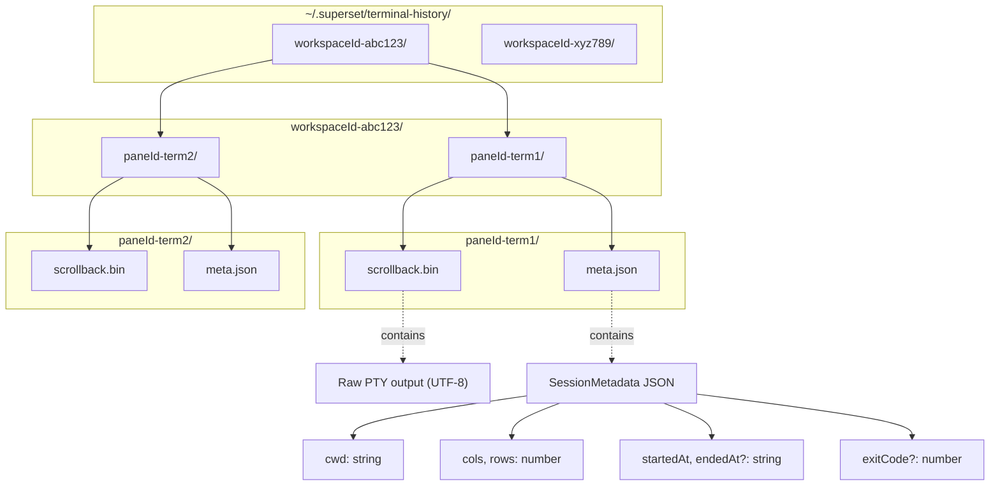
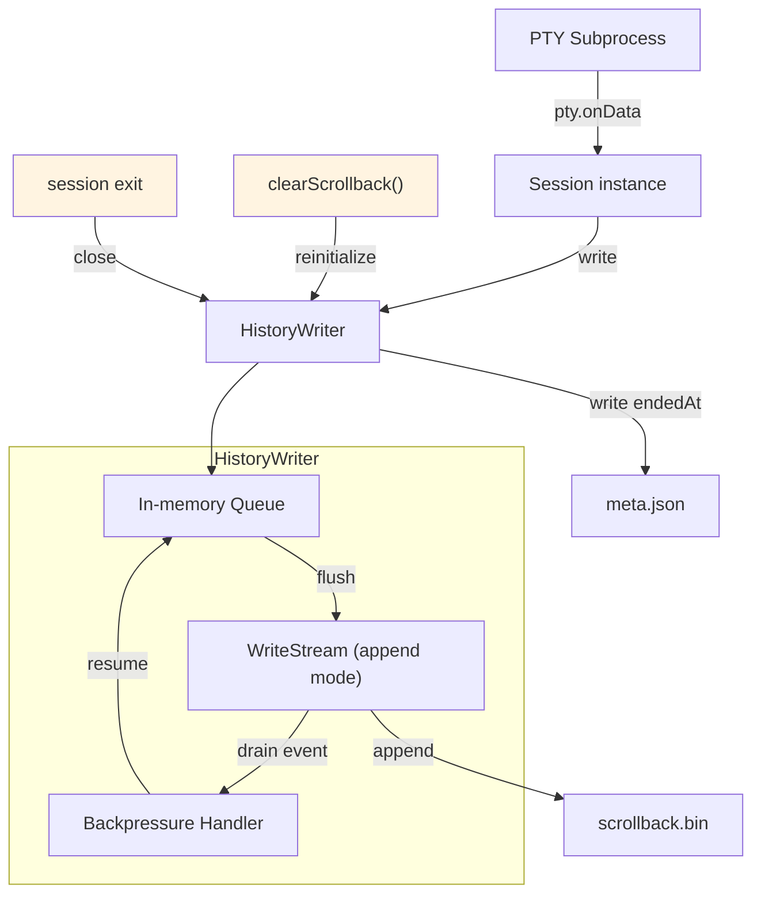
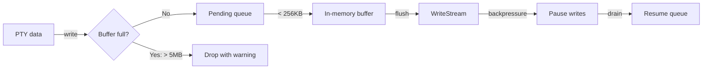
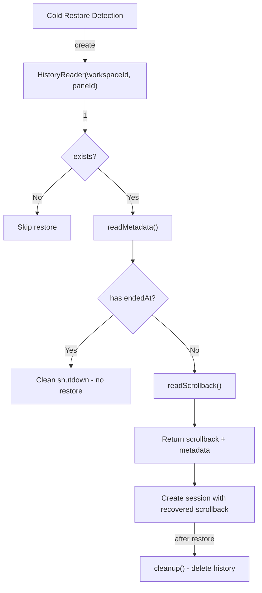
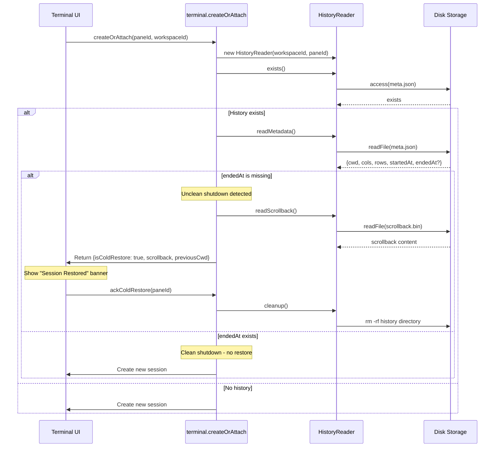
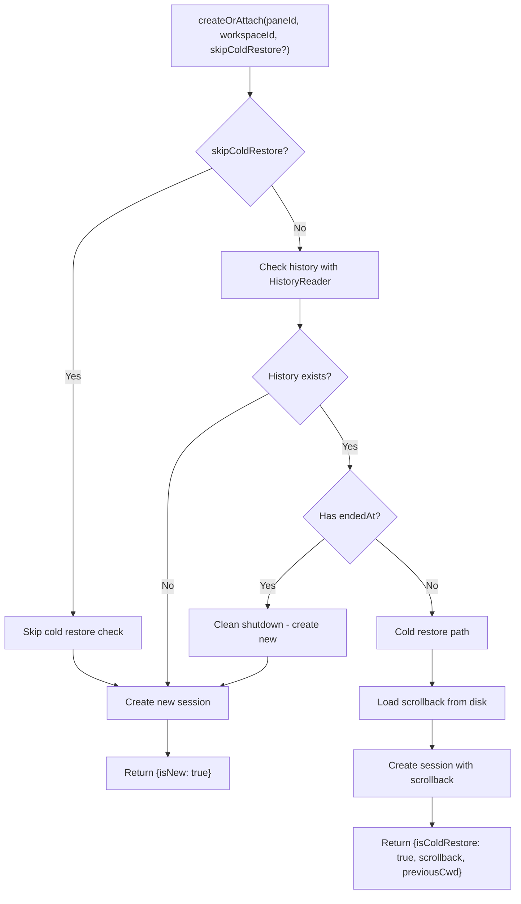
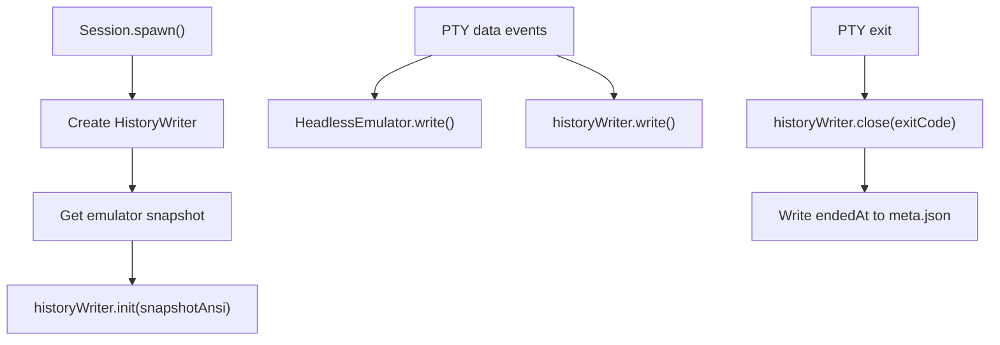

# Terminal Persistence and Cold Restore

<details>
<summary>Relevant source files</summary>

The following files were used as context for generating this wiki page:

- [apps/desktop/src/lib/trpc/routers/terminal/terminal.ts](apps/desktop/src/lib/trpc/routers/terminal/terminal.ts)
- [apps/desktop/src/main/lib/app-environment.ts](apps/desktop/src/main/lib/app-environment.ts)
- [apps/desktop/src/main/lib/data-batcher.ts](apps/desktop/src/main/lib/data-batcher.ts)
- [apps/desktop/src/main/lib/terminal-escape-filter.test.ts](apps/desktop/src/main/lib/terminal-escape-filter.test.ts)
- [apps/desktop/src/main/lib/terminal-escape-filter.ts](apps/desktop/src/main/lib/terminal-escape-filter.ts)
- [apps/desktop/src/main/lib/terminal-history.ts](apps/desktop/src/main/lib/terminal-history.ts)
- [apps/desktop/src/main/lib/terminal-host/headless-emulator.test.ts](apps/desktop/src/main/lib/terminal-host/headless-emulator.test.ts)
- [apps/desktop/src/main/lib/terminal-host/headless-emulator.ts](apps/desktop/src/main/lib/terminal-host/headless-emulator.ts)
- [apps/desktop/src/main/lib/terminal/port-manager.ts](apps/desktop/src/main/lib/terminal/port-manager.ts)
- [apps/desktop/src/main/lib/terminal/port-scanner.test.ts](apps/desktop/src/main/lib/terminal/port-scanner.test.ts)
- [apps/desktop/src/main/lib/terminal/port-scanner.ts](apps/desktop/src/main/lib/terminal/port-scanner.ts)
- [apps/desktop/src/main/lib/terminal/session.test.ts](apps/desktop/src/main/lib/terminal/session.test.ts)
- [apps/desktop/src/main/lib/terminal/session.ts](apps/desktop/src/main/lib/terminal/session.ts)
- [apps/desktop/src/main/lib/terminal/types.ts](apps/desktop/src/main/lib/terminal/types.ts)
- [apps/desktop/src/main/terminal-host/session.ts](apps/desktop/src/main/terminal-host/session.ts)
- [apps/desktop/src/renderer/screens/main/components/WorkspaceView/ContentView/TabsContent/Terminal/config.ts](apps/desktop/src/renderer/screens/main/components/WorkspaceView/ContentView/TabsContent/Terminal/config.ts)
- [apps/desktop/src/renderer/stores/tabs/utils/terminal-cleanup.ts](apps/desktop/src/renderer/stores/tabs/utils/terminal-cleanup.ts)

</details>


Terminal persistence provides the ability to restore terminal sessions after app or system restarts. Unlike warm attach (reconnecting to live daemon sessions, see [2.8.4](#2.8.4)), cold restore recovers sessions from disk when the daemon is not running, enabling seamless terminal recovery across crashes and reboots.

## Overview

The persistence system consists of two main components:

1. **Real-time History Writing** - `HistoryWriter` continuously appends PTY output to disk during active sessions
2. **Cold Restore Detection** - On app restart, the system detects unclean shutdowns by checking for metadata files without end timestamps

Storage location: `~/.superset/terminal-history/{workspaceId}/{paneId}/`

For general terminal architecture, see [2.8.1](#2.8.1). For session lifecycle, see [2.8.2](#2.8.2).

## Storage Architecture



**Sources:** [apps/desktop/src/main/lib/terminal-history.ts:66-109]()

### File Permissions

History files use restrictive permissions for security:
- Directories: `0o700` (owner-only access)
- Files: `0o600` (owner read/write only)

**Sources:** [apps/desktop/src/main/lib/terminal-history.ts:25-27]()

## HistoryWriter: Real-Time Persistence



**Sources:** [apps/desktop/src/main/lib/terminal-history.ts:114-464](), [apps/desktop/src/main/terminal-host/session.ts:1-966]()

### HistoryWriter Lifecycle

| Method | Purpose | Timing |
|--------|---------|--------|
| `constructor()` | Initialize paths and metadata | Session creation |
| `init(initialScrollback?)` | Create directory, write initial scrollback, open stream | After spawn |
| `write(data)` | Append PTY output to scrollback.bin | Every PTY data event |
| `flush()` | Force pending writes to disk | Before snapshot/close |
| `close(exitCode?)` | Write endedAt to meta.json, close stream | Session termination |
| `reinitialize()` | Reset files after clear scrollback | User clears terminal |
| `deleteHistory()` | Remove all history files | Session cleanup |

**Sources:** [apps/desktop/src/main/lib/terminal-history.ts:124-464]()

### Write Batching and Limits

The writer implements backpressure handling to prevent memory exhaustion:



**Constants:**
- `MAX_HISTORY_BYTES = 5 * 1024 * 1024` - Maximum scrollback per session
- `MAX_PENDING_WRITE_BYTES = 256 * 1024` - Maximum in-memory queue before dropping
- `DRAIN_TIMEOUT_MS = 1000` - Timeout for stream drain on close

**Sources:** [apps/desktop/src/main/lib/terminal-history.ts:22-24](), [apps/desktop/src/main/lib/terminal-history.ts:229-309]()

### UTF-8 Handling

Terminal output is stored as UTF-8. When scrollback exceeds the 5MB limit, `truncateUtf8ToLastBytes()` ensures truncation at valid UTF-8 character boundaries:

**Sources:** [apps/desktop/src/main/lib/terminal-history.ts:28-48](), [apps/desktop/src/main/lib/terminal-history.ts:168-183]()

## HistoryReader: Loading Persisted Sessions



**Sources:** [apps/desktop/src/main/lib/terminal-history.ts:469-554](), [apps/desktop/src/lib/trpc/routers/terminal/terminal.ts:59-193]()

### HistoryReader API

| Method | Returns | Purpose |
|--------|---------|---------|
| `exists()` | `Promise<boolean>` | Check if history files exist |
| `readMetadata()` | `Promise<{cols, rows, cwd, endedAt?} \| null>` | Load session metadata |
| `readScrollback()` | `Promise<string \| null>` | Load scrollback content |
| `cleanup()` | `Promise<void>` | Delete history files after restore |

**Sources:** [apps/desktop/src/main/lib/terminal-history.ts:479-554]()

## Cold Restore Detection Flow



**Sources:** [apps/desktop/src/lib/trpc/routers/terminal/terminal.ts:59-193]()

### Cold Restore vs Daemon Recovery

| Scenario | Detection | Mechanism | Result |
|----------|-----------|-----------|--------|
| **Cold Restore** | meta.json without `endedAt` | HistoryReader loads scrollback.bin | UI shows restored content + "Session Restored" banner |
| **Daemon Recovery** | Daemon session exists (isAlive) | HeadlessEmulator snapshot | UI shows live terminal snapshot |
| **Clean Shutdown** | meta.json with `endedAt` | N/A | New empty session created |

**Sources:** [apps/desktop/src/lib/trpc/routers/terminal/terminal.ts:145-161]()

## SessionMetadata Format

The `meta.json` file stores session metadata for cold restore:

```typescript
interface SessionMetadata {
  cwd: string;           // Working directory at session start
  cols: number;          // Terminal columns
  rows: number;          // Terminal rows
  startedAt: string;     // ISO 8601 timestamp
  endedAt?: string;      // ISO 8601 timestamp (missing = unclean shutdown)
  exitCode?: number;     // Shell exit code (if cleanly exited)
}
```

**Example (Unclean Shutdown):**
```json
{
  "cwd": "/Users/developer/project",
  "cols": 120,
  "rows": 40,
  "startedAt": "2024-01-15T14:30:00.000Z"
}
```

**Example (Clean Shutdown):**
```json
{
  "cwd": "/Users/developer/project",
  "cols": 120,
  "rows": 40,
  "startedAt": "2024-01-15T14:30:00.000Z",
  "endedAt": "2024-01-15T15:45:00.000Z",
  "exitCode": 0
}
```

**Sources:** [apps/desktop/src/main/lib/terminal-history.ts:54-61](), [apps/desktop/src/main/lib/terminal-history.ts:447-463]()

## Integration with Terminal Router

The `createOrAttach` tRPC procedure orchestrates cold restore:



**Parameters:**
- `skipColdRestore?: boolean` - Skip history check (used when auto-resuming after cold restore)
- `allowKilled?: boolean` - Allow restarting a session that was explicitly killed

**Return fields for cold restore:**
- `isColdRestore: true` - Indicates unclean shutdown recovery
- `scrollback: string` - Recovered terminal content
- `previousCwd: string` - Working directory from previous session
- `wasRecovered: false` - Not a daemon recovery (daemon wasn't running)

**Sources:** [apps/desktop/src/lib/trpc/routers/terminal/terminal.ts:59-193](), [apps/desktop/src/main/lib/terminal/types.ts:54-66]()

## Daemon-Mode Snapshot Persistence

When using the terminal daemon (see [2.8.4](#2.8.4)), the `Session` class creates a `HistoryWriter` and initializes it with the current emulator snapshot:



This ensures the initial snapshot (including scrollback from before the writer was created) is persisted.

**Sources:** [apps/desktop/src/main/terminal-host/session.ts:176-224](), [apps/desktop/src/main/lib/terminal-history.ts:157-224]()

## Clear Scrollback Handling

When the user clears the terminal (Cmd+K or `clear` command), the `HistoryWriter` detects the clear sequence and reinitializes:

```mermaid
graph LR
    User["User: Cmd+K"] --> PTY["PTY emits ESC[3J"]
    PTY --> Detect["containsClearScrollbackSequence()"]
    Detect --> Session["Session recreates HeadlessEmulator"]
    Session --> Writer["historyWriter.reinitialize()"]
    Writer --> Close["Close current stream"]
    Close --> Reset["Reset scrollback.bin"]
    Reset --> NewStart["Update startedAt, remove endedAt"]
    NewStart --> Reopen["Open new append stream"]
```



**Sources:** [apps/desktop/src/main/lib/terminal-escape-filter.ts:1-46](), [apps/desktop/src/main/lib/terminal/session.ts:169-190](), [apps/desktop/src/main/lib/terminal-history.ts:389-419]()

## HeadlessEmulator Snapshot Integration

The `HeadlessEmulator` provides rich snapshot capabilities for cold restore:

```typescript
interface TerminalSnapshot {
  snapshotAnsi: string;          // Serialized terminal content (ANSI)
  rehydrateSequences: string;    // Mode restore sequences (DECSET/DECRST)
  cwd: string | null;            // Current working directory (from OSC-7)
  modes: TerminalModes;          // Terminal mode flags
  cols: number;
  rows: number;
  scrollbackLines: number;
}
```

**Modes tracked:**
- `applicationCursorKeys` - DECSET 1
- `bracketedPaste` - DECSET 2004
- `alternateScreen` - DECSET 1049
- `mouseTrackingNormal` - DECSET 1000
- `mouseSgr` - DECSET 1006
- `focusReporting` - DECSET 1004
- `cursorVisible` - DECSET 25
- `autoWrap` - DECSET 7

**Sources:** [apps/desktop/src/main/lib/terminal-host/headless-emulator.ts:1-614](), [apps/desktop/src/main/lib/terminal-host/types.ts:64-90]()

## Error Handling and Limits

The persistence system is designed to be non-blocking and fault-tolerant:

| Error Condition | Behavior | Rationale |
|-----------------|----------|-----------|
| Disk write failure | Log warning, continue session | Terminal operation shouldn't fail due to logging issues |
| Directory creation failure | Throw error | Cannot persist without directory |
| Scrollback > 5MB | Truncate to last 5MB | Prevent unbounded disk usage |
| Pending writes > 256KB | Drop new writes | Prevent memory exhaustion under backpressure |
| Stream drain timeout (1s) | Abandon pending writes | Don't block session termination indefinitely |
| Corrupted meta.json | Return null, skip restore | Fall back to new session |
| Missing scrollback.bin | Return null, skip restore | Fall back to new session |

**Sources:** [apps/desktop/src/main/lib/terminal-history.ts:22-24](), [apps/desktop/src/main/lib/terminal-history.ts:202-224](), [apps/desktop/src/main/lib/terminal-history.ts:229-280](), [apps/desktop/src/main/lib/terminal-history.ts:334-387](), [apps/desktop/src/main/lib/terminal-history.ts:509-528](), [apps/desktop/src/main/lib/terminal-history.ts:534-541]()

## Path Validation

History paths are validated to prevent directory traversal attacks:

```typescript
// Reject unsafe IDs
if (value.includes("/") || value.includes("\\") || value.includes("..")) {
  throw new Error("Invalid id");
}

// Verify resolved path doesn't escape root
const rel = relative(root, dir);
if (rel.split(sep).includes("..")) {
  throw new Error("Resolved history dir escapes root");
}
```

**Sources:** [apps/desktop/src/main/lib/terminal-history.ts:73-97](), [apps/desktop/src/lib/trpc/routers/terminal/terminal.ts:25-32]()