# Terminal Session Lifecycle

<details>
<summary>Relevant source files</summary>

The following files were used as context for generating this wiki page:

- [apps/desktop/src/lib/trpc/routers/terminal/terminal.ts](apps/desktop/src/lib/trpc/routers/terminal/terminal.ts)
- [apps/desktop/src/main/lib/app-environment.ts](apps/desktop/src/main/lib/app-environment.ts)
- [apps/desktop/src/main/lib/data-batcher.ts](apps/desktop/src/main/lib/data-batcher.ts)
- [apps/desktop/src/main/lib/terminal-escape-filter.test.ts](apps/desktop/src/main/lib/terminal-escape-filter.test.ts)
- [apps/desktop/src/main/lib/terminal-escape-filter.ts](apps/desktop/src/main/lib/terminal-escape-filter.ts)
- [apps/desktop/src/main/lib/terminal-history.ts](apps/desktop/src/main/lib/terminal-history.ts)
- [apps/desktop/src/main/lib/terminal-host/headless-emulator.test.ts](apps/desktop/src/main/lib/terminal-host/headless-emulator.test.ts)
- [apps/desktop/src/main/lib/terminal-host/headless-emulator.ts](apps/desktop/src/main/lib/terminal-host/headless-emulator.ts)
- [apps/desktop/src/main/lib/terminal/port-manager.ts](apps/desktop/src/main/lib/terminal/port-manager.ts)
- [apps/desktop/src/main/lib/terminal/port-scanner.test.ts](apps/desktop/src/main/lib/terminal/port-scanner.test.ts)
- [apps/desktop/src/main/lib/terminal/port-scanner.ts](apps/desktop/src/main/lib/terminal/port-scanner.ts)
- [apps/desktop/src/main/lib/terminal/session.test.ts](apps/desktop/src/main/lib/terminal/session.test.ts)
- [apps/desktop/src/main/lib/terminal/session.ts](apps/desktop/src/main/lib/terminal/session.ts)
- [apps/desktop/src/main/lib/terminal/types.ts](apps/desktop/src/main/lib/terminal/types.ts)
- [apps/desktop/src/main/terminal-host/session.ts](apps/desktop/src/main/terminal-host/session.ts)
- [apps/desktop/src/renderer/screens/main/components/WorkspaceView/ContentView/TabsContent/Terminal/config.ts](apps/desktop/src/renderer/screens/main/components/WorkspaceView/ContentView/TabsContent/Terminal/config.ts)
- [apps/desktop/src/renderer/stores/tabs/utils/terminal-cleanup.ts](apps/desktop/src/renderer/stores/tabs/utils/terminal-cleanup.ts)

</details>

This document describes the complete lifecycle of a terminal session in the daemon-based architecture, covering session creation, state transitions, PTY subprocess management, attachment/detachment semantics, termination, and cleanup. Sessions are keyed by `paneId` and persist across UI detachments, enabling seamless tab switching and cold restore after app restarts.

For terminal UI components and rendering, see [Terminal UI Components](#2.8.3). For terminal host daemon architecture, see [Terminal Backend and Daemon](#2.8.4). For scrollback persistence and cold restore, see [Terminal Persistence and Cold Restore](#2.8.5).

## Overview

Terminal sessions follow a lifecycle managed by the Terminal Host Daemon (`Session` class). The lifecycle begins with a `createOrAttach` request from the renderer, which either spawns a new PTY subprocess or attaches to an existing session. Sessions track state via the `isAlive`, `isTerminating`, and `isAttachable` properties. Data flows from the PTY subprocess through an emulator write queue (time-budgeted processing) to attached clients via socket connections.

Sessions persist independently of UI state. Detaching a session updates metadata but keeps the PTY running. Killing a session sends SIGTERM (with SIGKILL escalation) and transitions to the terminated state. History persistence enables cold restore by writing scrollback to disk during the session lifecycle.

**Sources:** [apps/desktop/src/main/terminal-host/session.ts:1-966](), [apps/desktop/src/lib/trpc/routers/terminal/terminal.ts:1-505](), [apps/desktop/src/main/lib/terminal/types.ts:1-113]()

## Session Creation via createOrAttach

### createOrAttach Request Flow

The `createOrAttach` tRPC procedure is the entry point for all session lifecycle operations. It creates new sessions or attaches to existing ones based on `paneId`:

Title: **createOrAttach Flow: tRPC Router to Session**

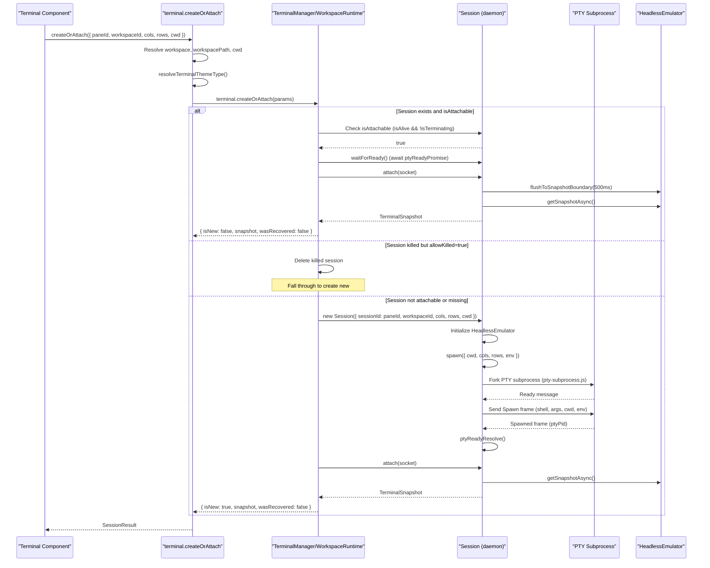

The `createOrAttach` procedure validates workspace usability via `assertWorkspaceUsable` for worktree-type workspaces. Sessions transition through states: spawning → ready (after Spawned IPC frame) → attachable. The `isAttachable` check prevents race conditions when `kill` is called immediately before `createOrAttach`.

**Sources:** [apps/desktop/src/lib/trpc/routers/terminal/terminal.ts:59-193](), [apps/desktop/src/main/terminal-host/session.ts:137-246](), [apps/desktop/src/main/lib/terminal/types.ts:45-91]()

### Session State Transitions

Title: **Session State Machine**

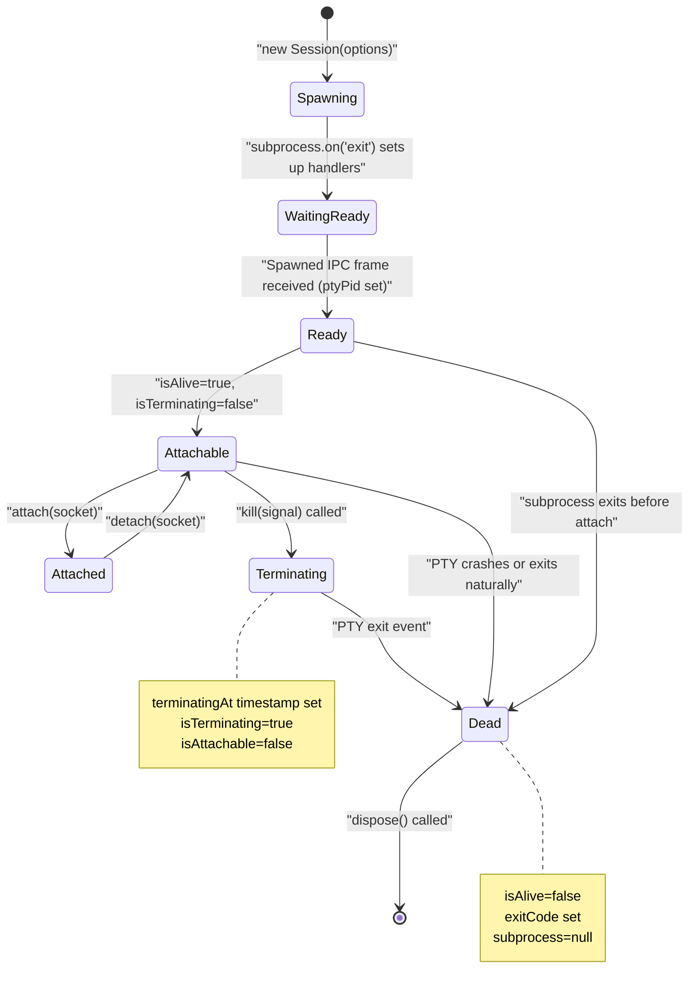

Sessions track three key boolean states:

- `isAlive`: `subprocess !== null && exitCode === null`
- `isTerminating`: `terminatingAt !== null` (kill called but not yet exited)
- `isAttachable`: `isAlive && !isTerminating`

The `terminatingAt` timestamp prevents race conditions where `createOrAttach` is called immediately after `kill` but before the PTY has exited.

**Sources:** [apps/desktop/src/main/terminal-host/session.ts:627-656](), [apps/desktop/src/main/lib/terminal/types.ts:7-27]()

## PTY Subprocess Architecture

### Subprocess Spawning and IPC Protocol

Sessions delegate PTY operations to a subprocess (`pty-subprocess.js`) to isolate blocking I/O from the daemon process. Communication uses a framed IPC protocol over stdin/stdout:

Title: **PTY Subprocess IPC Protocol**

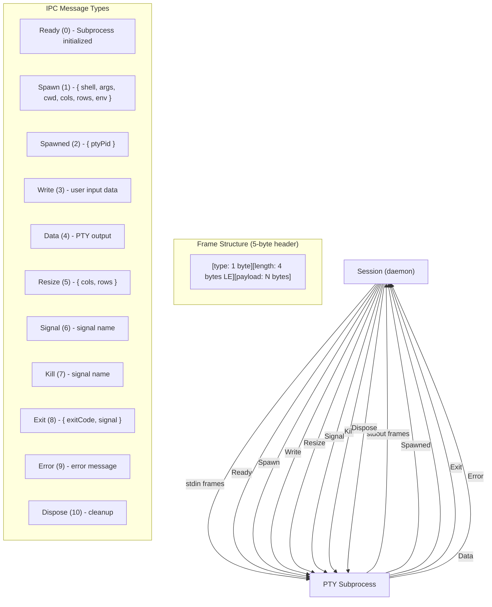

The subprocess decodes frames using `PtySubprocessFrameDecoder`. The session queues frames in `subprocessStdinQueue` with backpressure handling (max 2MB queue). When the queue fills, writes are dropped and an error event is emitted to prevent OOM.

**Sources:** [apps/desktop/src/main/terminal-host/session.ts:198-246](), [apps/desktop/src/main/terminal-host/session.ts:258-335](), [apps/desktop/src/main/terminal-host/pty-subprocess-ipc.ts]()

### Emulator Write Queue (Time-Budgeted Processing)

PTY output flows through an emulator write queue that processes data in time-budgeted chunks to prevent event loop starvation:

Title: **Emulator Write Queue Processing**

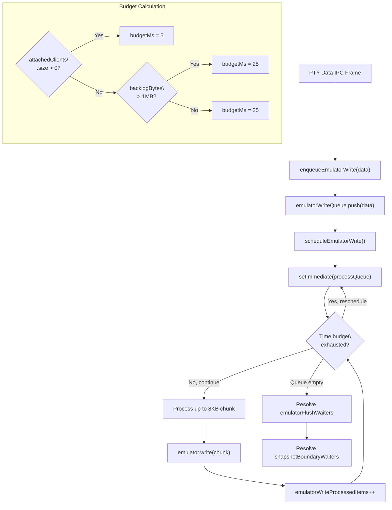

The budget is 5ms when clients are attached (responsive UI), 25ms when detached. Large backlogs (>1MB) get extended processing time to catch up. This prevents the daemon from blocking on write operations while ensuring eventual consistency.

**Sources:** [apps/desktop/src/main/terminal-host/session.ts:490-558](), [apps/desktop/src/main/terminal-host/session.ts:504-525]()

## Session Attachment and Detachment

### Socket-Based Client Attachment

Sessions track multiple attached clients via socket connections. Each client receives data events via JSON-encoded messages over the socket:

Title: **Client Attachment and Data Broadcasting**

```mermaid
sequenceDiagram
    participant Client1 as "Client Socket 1"
    participant Client2 as "Client Socket 2"
    participant Session as "Session"
    participant Emulator as "HeadlessEmulator"

    Client1->>Session: attach(socket)
    Session->>Session: attachedClients.set(socket, { attachedAt })
    Session->>Session: lastAttachedAt = new Date()
    Session->>Emulator: flushToSnapshotBoundary(500ms)
    Session->>Emulator: getSnapshotAsync()
    Emulator-->>Session: TerminalSnapshot
    Session-->>Client1: Return snapshot

    Note over Session: PTY data arrives
    Session->>Session: enqueueEmulatorWrite(data)
    Session->>Session: broadcastEvent('data', { type: 'data', data })

    Session->>Client1: socket.write('{"type":"event","event":"data",...}\
')

    Client2->>Session: attach(socket)
    Session->>Session: attachedClients.set(socket, { attachedAt })
    Session->>Emulator: flushToSnapshotBoundary(500ms)
    Session->>Emulator: getSnapshotAsync()
    Session-->>Client2: Return snapshot

    Note over Session: More PTY data
    Session->>Session: broadcastEvent('data', { type: 'data', data })
    Session->>Client1: socket.write(message)
    Session->>Client2: socket.write(message)

    Client1->>Session: detach(socket)
    Session->>Session: attachedClients.delete(socket)

    Note over Session: PTY data after detach
    Session->>Session: broadcastEvent('data', { type: 'data', data })
    Session->>Client2: socket.write(message) (only Client2 now)
```

The `attach` method flushes pending emulator writes to a snapshot boundary before capturing state. This ensures a consistent point-in-time snapshot even with continuous output. The 500ms timeout prevents indefinite hangs when output never stops (e.g., `tail -f`).

**Sources:** [apps/desktop/src/main/terminal-host/session.ts:676-701](), [apps/desktop/src/main/terminal-host/session.ts:586-623](), [apps/desktop/src/main/terminal-host/session.ts:874-903]()

### Backpressure Handling

When client sockets can't drain fast enough, the session pauses subprocess stdout to prevent memory exhaustion:

Title: **Socket Backpressure Flow**

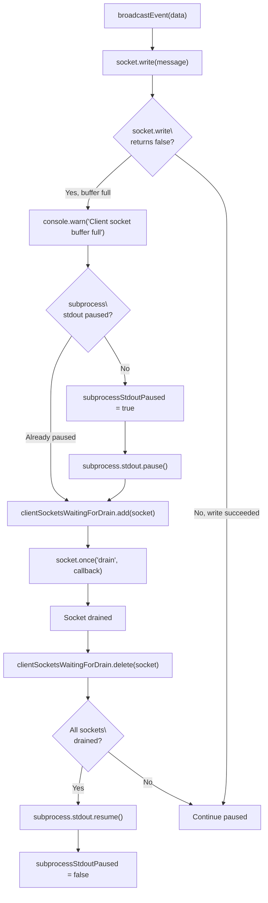

This backpressure mechanism prevents the daemon from consuming unbounded memory when clients are slow. The subprocess stdout pipe buffers PTY output, which in turn slows down PTY reads within the subprocess (preventing runaway CPU/memory).

**Sources:** [apps/desktop/src/main/terminal-host/session.ts:905-930]()

## Session Termination

### Kill vs Signal Semantics

Sessions support two types of process signaling with different semantics:

| Operation | Method               | Effect                                                   | Use Case                                    |
| --------- | -------------------- | -------------------------------------------------------- | ------------------------------------------- |
| `signal`  | `sendSignal(signal)` | Sends signal without marking as terminating              | Ctrl+C (SIGINT) - process continues running |
| `kill`    | `kill(signal)`       | Sets `terminatingAt`, sends signal, marks not attachable | User closes terminal - session will exit    |

Title: **Kill Flow with Termination Tracking**

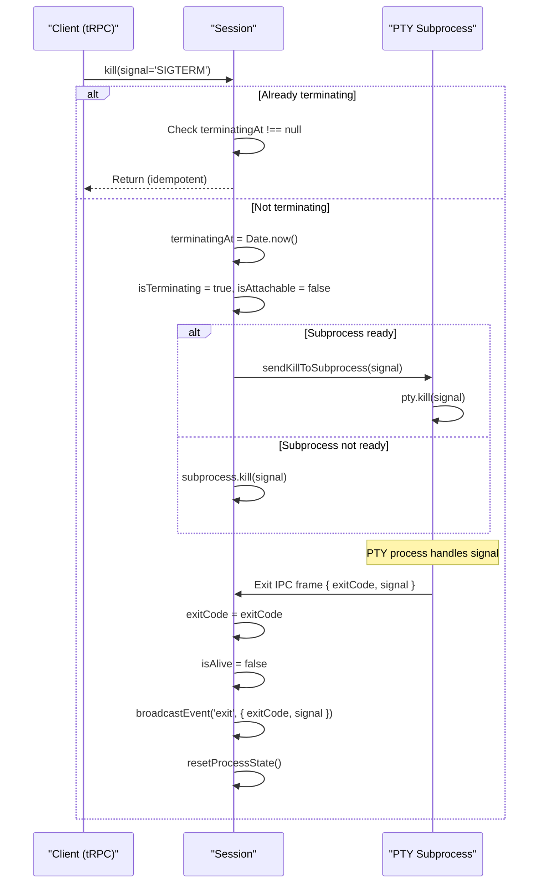

The `terminatingAt` timestamp makes `kill` idempotent and prevents `createOrAttach` from attaching to sessions mid-termination. The `sendSignal` method skips this tracking, allowing non-terminal signals (SIGINT, SIGTSTP) to be sent without affecting session state.

**Sources:** [apps/desktop/src/main/terminal-host/session.ts:767-804](), [apps/desktop/src/main/terminal-host/session.ts:783-804]()

### Exit Event Handling and Cleanup

Title: **Session Exit and Resource Cleanup**

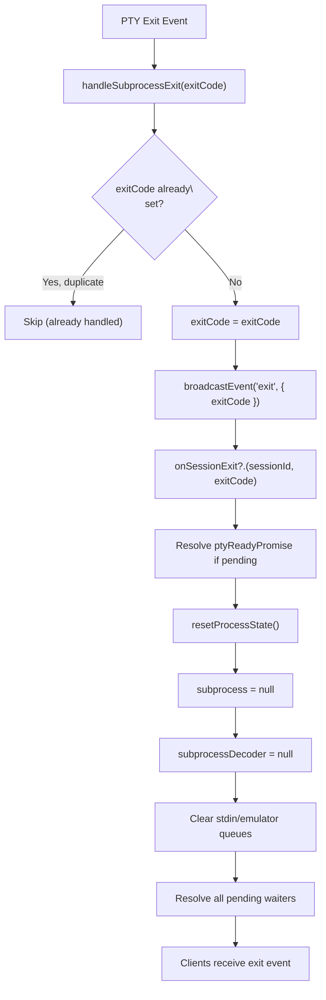

Exit handling includes several safety mechanisms:

- **Duplicate exit prevention**: Only the first exit event is processed
- **PTY ready resolution**: Ensures waiters don't hang if subprocess exits before spawning PTY
- **Queue cleanup**: Clears all pending write queues and resolves waiters
- **Client notification**: Broadcasts exit event before cleanup so clients receive final state

The `onSessionExit` callback is typically set by the daemon manager to perform registry cleanup and potentially restart the session.

**Sources:** [apps/desktop/src/main/terminal-host/session.ts:340-360](), [apps/desktop/src/main/terminal-host/session.ts:838-856]()

## History Persistence During Session Lifecycle

### HistoryWriter Integration

Sessions integrate with `HistoryWriter` to persist scrollback to disk for cold restore. The writer tracks session lifecycle events:

Title: **History Writer Lifecycle**

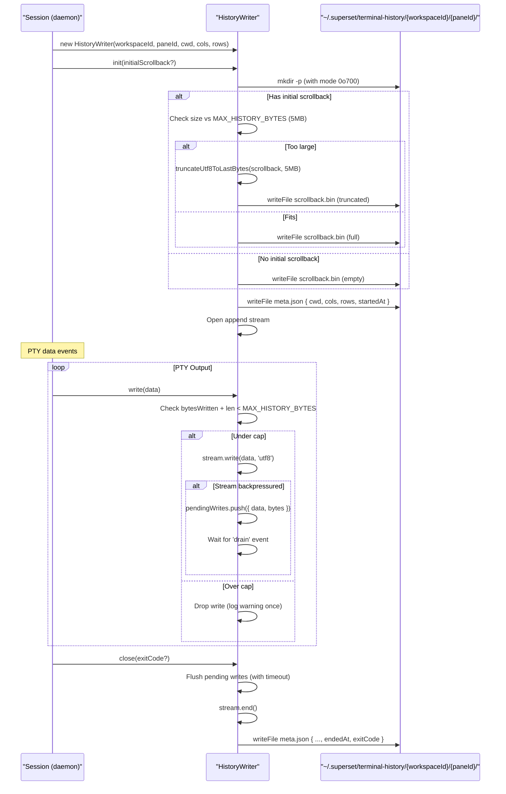

The writer maintains two files:

- **scrollback.bin**: Raw PTY output (UTF-8), append-only during session, capped at 5MB
- **meta.json**: Session metadata including `startedAt` and `endedAt` timestamps

Cold restore detection relies on `meta.json` existing without `endedAt` (unclean shutdown). Sessions that exit cleanly write `endedAt`, marking history as not recoverable.

**Sources:** [apps/desktop/src/main/lib/terminal-history.ts:115-464](), [apps/desktop/src/main/lib/terminal-history.ts:156-224]()

### Backpressure and Truncation

The `HistoryWriter` implements two safety mechanisms:

| Mechanism              | Trigger                               | Action                               | Purpose                        |
| ---------------------- | ------------------------------------- | ------------------------------------ | ------------------------------ |
| **Backpressure queue** | Stream returns `false` from `write()` | Queue writes in memory (up to 256KB) | Respect filesystem write speed |
| **Hard cap**           | Total written > 5MB                   | Drop writes, log warning once        | Prevent disk exhaustion        |

When the pending write queue exceeds 256KB (`MAX_PENDING_WRITE_BYTES`), additional writes are dropped until the stream drains. This prevents OOM when the disk is very slow or blocked.

**Sources:** [apps/desktop/src/main/lib/terminal-history.ts:230-310](), [apps/desktop/src/main/lib/terminal-history.ts:22-26]()

## Port Detection Integration

### Port Registration and Scanning

Sessions register with the `PortManager` for automatic port detection. The manager tracks ports via process trees and periodic scanning:

Title: **Port Detection Lifecycle**

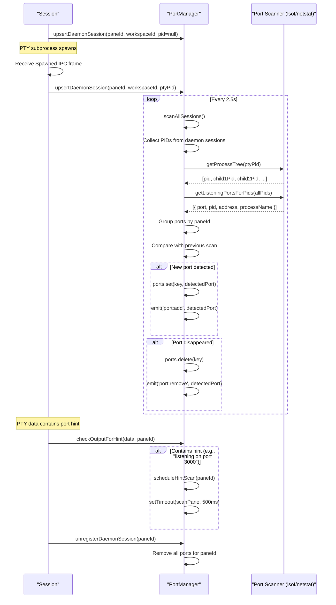

The port manager uses two detection strategies:

1. **Periodic scanning**: Every 2.5s, scan all registered session process trees via `lsof` (Unix) or `netstat` (Windows)
2. **Hint-based scanning**: Parse output for patterns like "listening on port 3000" and scan 500ms later

Ports are filtered by `IGNORED_PORTS` (22, 80, 443, 5432, etc.) to exclude common system services.

**Sources:** [apps/desktop/src/main/lib/terminal/port-manager.ts:1-505](), [apps/desktop/src/main/lib/terminal/port-manager.ts:92-114](), [apps/desktop/src/main/lib/terminal/port-scanner.ts:34-49]()

### PID Filtering for Security

Port scanning includes critical PID validation to prevent exposing unrelated system ports:

```typescript
// In parseLsofOutput (port-scanner.ts)
const pidSet = new Set(pids)
for (const line of lines) {
  const pid = parseInt(columns[1], 10)

  // CRITICAL: Verify PID is in requested set
  // lsof ignores -p filter when PIDs don't exist, returning ALL TCP listeners
  if (!pidSet.has(pid)) continue

  // ... parse port info
}
```

This prevents a security issue where `lsof -p 12345` (non-existent PID) returns all listening ports on the system instead of an empty result. Without PID filtering, terminal sessions would incorrectly display ports from unrelated processes.

**Sources:** [apps/desktop/src/main/lib/terminal/port-scanner.ts:54-114](), [apps/desktop/src/main/lib/terminal/port-scanner.test.ts:265-326]()

## Session Disposal and Resource Cleanup

### Dispose Flow and Process Termination

The `dispose` method performs comprehensive cleanup including process tree termination:

Title: **Session Dispose Flow**

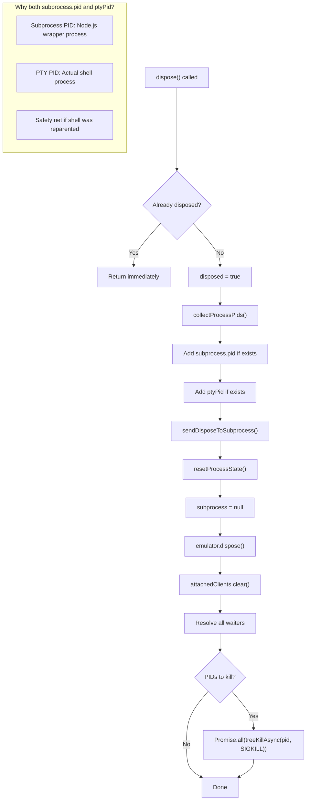

The `dispose` method kills both the subprocess (Node.js wrapper) and the PTY process (actual shell) to handle edge cases where the shell is reparented after subprocess exit. The `treeKillAsync` function enumerates all descendant processes via `ps`/`pgrep` before sending SIGKILL.

**Sources:** [apps/desktop/src/main/terminal-host/session.ts:807-856](), [apps/desktop/src/main/terminal-host/session.ts:831-836]()

### State Reset and Waiter Resolution

The `resetProcessState` method clears all subprocess-related state and resolves pending waiters:

```typescript
// From session.ts:838-856
private resetProcessState(): void {
  this.subprocess = null;
  this.subprocessReady = false;
  this.subprocessDecoder = null;
  this.subprocessStdinQueue = [];
  this.subprocessStdinQueuedBytes = 0;
  this.subprocessStdinDrainArmed = false;
  this.subprocessStdoutPaused = false;

  this.emulatorWriteQueue = [];
  this.emulatorWriteQueuedBytes = 0;
  this.emulatorWriteProcessedItems = 0;
  this.nextSnapshotBoundaryWaiterId = 1;
  this.emulatorWriteScheduled = false;
  this.resolveAllSnapshotBoundaryWaiters();

  const waiters = this.emulatorFlushWaiters;
  this.emulatorFlushWaiters = [];
  for (const resolve of waiters) resolve();
}
```

Resolving waiters prevents hanging promises when sessions are disposed while operations are in flight (e.g., `attach` waiting for emulator flush during daemon shutdown).

**Sources:** [apps/desktop/src/main/terminal-host/session.ts:838-856](), [apps/desktop/src/main/terminal-host/session.ts:574-579]()

## Session Cleanup

### Unmount and Detach

The `useTerminalLifecycle` hook schedules a 50ms delayed detach on component unmount:

```typescript
// useEffect cleanup in useTerminalLifecycle
return () => {
  const detachTimeout = setTimeout(() => {
    detachRef.current({ paneId })
    pendingDetaches.delete(paneId)
    coldRestoreState.delete(paneId)
  }, 50)
  pendingDetaches.set(paneId, detachTimeout)
}
```

On mount, pending detaches are cancelled:

```typescript
// useEffect mount in useTerminalLifecycle
const pendingDetach = pendingDetaches.get(paneId)
if (pendingDetach) {
  clearTimeout(pendingDetach)
  pendingDetaches.delete(paneId)
}
```

This 50ms delay prevents flickering when switching tabs rapidly. If the component remounts before the timeout fires (e.g., switching back to the tab), the detach is cancelled and the session remains attached.

**Sources:** [apps/desktop/src/renderer/screens/main/components/WorkspaceView/ContentView/TabsContent/Terminal/hooks/useTerminalLifecycle.ts]()

### Kill vs Detach Semantics

| Operation | Effect                                         | Use Case                         |
| --------- | ---------------------------------------------- | -------------------------------- |
| `detach`  | Updates `lastActive`, keeps session alive      | Tab/pane hidden but may return   |
| `kill`    | Sends SIGTERM, waits for exit, removes session | User closes terminal permanently |
| `signal`  | Sends arbitrary signal (default SIGTERM)       | Ctrl+C equivalent                |

The `detach` operation is purely metadata — it updates the session's `lastActive` timestamp but does not affect the running PTY process.

**Sources:** [apps/desktop/src/main/lib/terminal/manager.ts:267-277](), [apps/desktop/src/main/lib/terminal/manager.ts:251-265](), [apps/desktop/src/main/lib/terminal/manager.ts:236-249]()

### Workspace Cleanup

When closing a workspace, the system kills all associated terminal sessions:

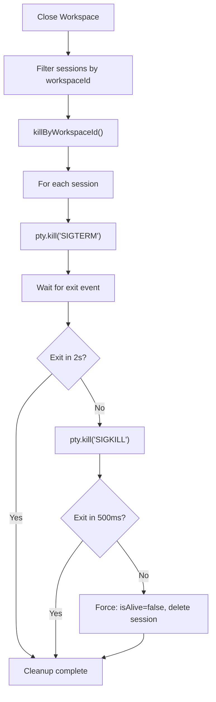

The escalation to SIGKILL prevents hanging processes from blocking workspace teardown.

**Sources:** [apps/desktop/src/main/lib/terminal/manager.ts:316-402]()
