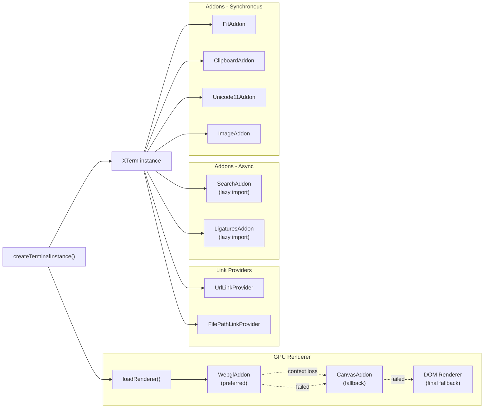
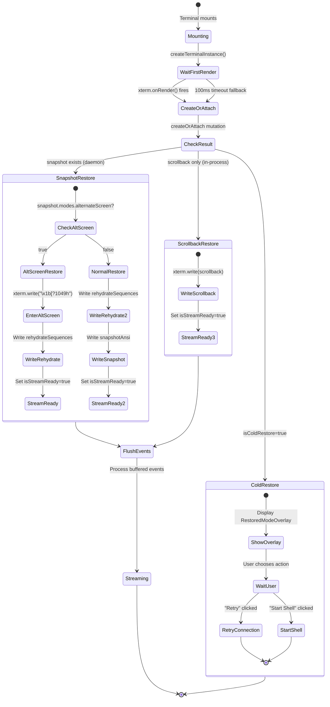
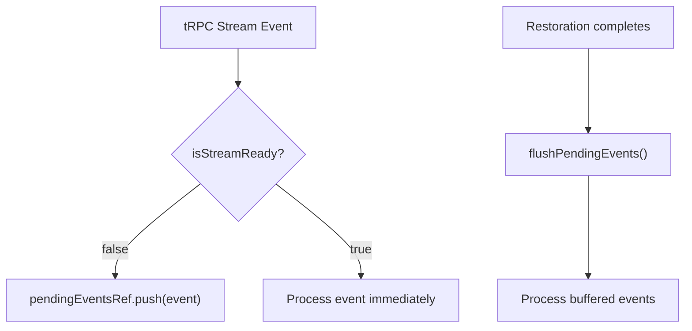
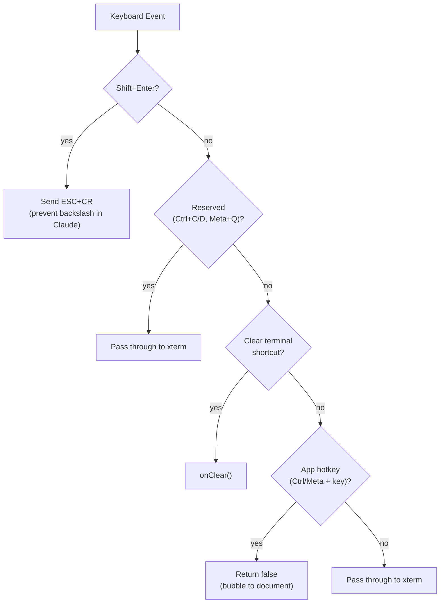
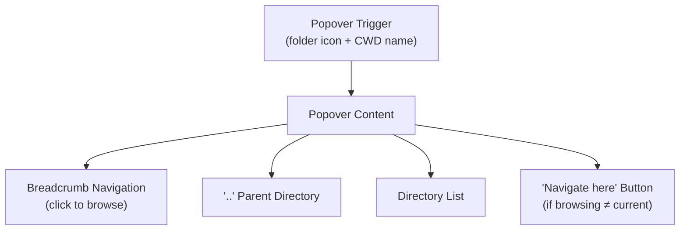
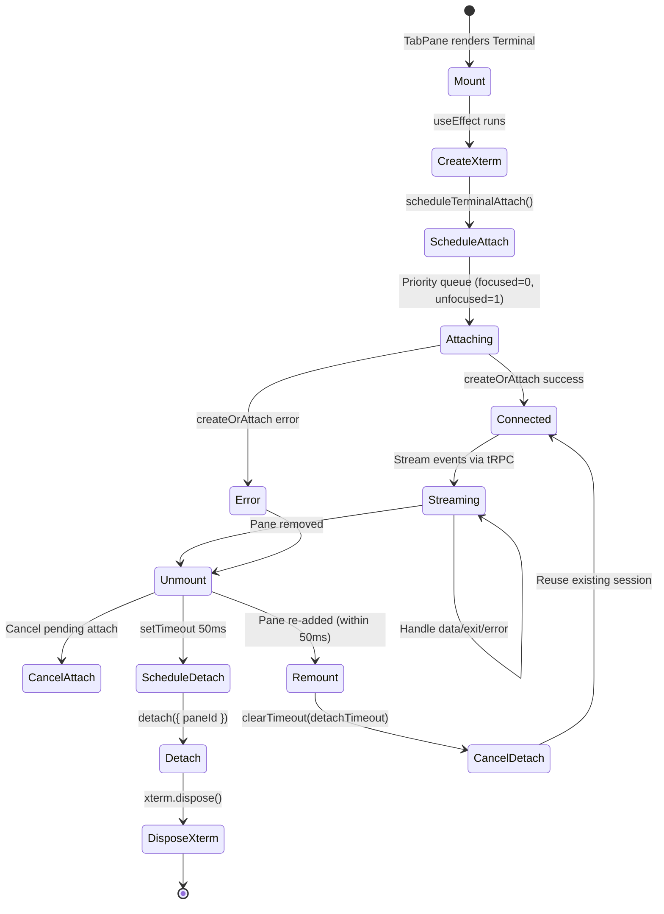

# Terminal UI Components

<details>
<summary>Relevant source files</summary>

The following files were used as context for generating this wiki page:

- [apps/desktop/src/renderer/screens/main/components/WorkspaceView/ContentView/TabsContent/Terminal/ScrollToBottomButton/ScrollToBottomButton.tsx](apps/desktop/src/renderer/screens/main/components/WorkspaceView/ContentView/TabsContent/Terminal/ScrollToBottomButton/ScrollToBottomButton.tsx)
- [apps/desktop/src/renderer/screens/main/components/WorkspaceView/ContentView/TabsContent/Terminal/ScrollToBottomButton/index.ts](apps/desktop/src/renderer/screens/main/components/WorkspaceView/ContentView/TabsContent/Terminal/ScrollToBottomButton/index.ts)
- [apps/desktop/src/renderer/screens/main/components/WorkspaceView/ContentView/TabsContent/Terminal/Terminal.tsx](apps/desktop/src/renderer/screens/main/components/WorkspaceView/ContentView/TabsContent/Terminal/Terminal.tsx)
- [apps/desktop/src/renderer/screens/main/components/WorkspaceView/ContentView/TabsContent/Terminal/helpers.test.ts](apps/desktop/src/renderer/screens/main/components/WorkspaceView/ContentView/TabsContent/Terminal/helpers.test.ts)
- [apps/desktop/src/renderer/screens/main/components/WorkspaceView/ContentView/TabsContent/Terminal/helpers.ts](apps/desktop/src/renderer/screens/main/components/WorkspaceView/ContentView/TabsContent/Terminal/helpers.ts)
- [apps/desktop/src/renderer/screens/main/components/WorkspaceView/ContentView/TabsContent/Terminal/link-providers/index.ts](apps/desktop/src/renderer/screens/main/components/WorkspaceView/ContentView/TabsContent/Terminal/link-providers/index.ts)
- [apps/desktop/src/renderer/screens/main/components/WorkspaceView/ContentView/TabsContent/Terminal/link-providers/multi-line-link-provider.ts](apps/desktop/src/renderer/screens/main/components/WorkspaceView/ContentView/TabsContent/Terminal/link-providers/multi-line-link-provider.ts)
- [apps/desktop/src/renderer/screens/main/components/WorkspaceView/ContentView/TabsContent/Terminal/link-providers/url-link-provider.test.ts](apps/desktop/src/renderer/screens/main/components/WorkspaceView/ContentView/TabsContent/Terminal/link-providers/url-link-provider.test.ts)
- [apps/desktop/src/renderer/screens/main/components/WorkspaceView/ContentView/TabsContent/Terminal/link-providers/url-link-provider.ts](apps/desktop/src/renderer/screens/main/components/WorkspaceView/ContentView/TabsContent/Terminal/link-providers/url-link-provider.ts)
- [apps/desktop/src/renderer/screens/main/components/WorkspaceView/ContentView/TabsContent/Terminal/utils.ts](apps/desktop/src/renderer/screens/main/components/WorkspaceView/ContentView/TabsContent/Terminal/utils.ts)
- [apps/desktop/src/renderer/screens/main/components/WorkspaceView/RightSidebar/FilesView/types.ts](apps/desktop/src/renderer/screens/main/components/WorkspaceView/RightSidebar/FilesView/types.ts)

</details>


This page documents the renderer-side React components and hooks that implement the terminal user interface. These components integrate xterm.js for terminal emulation and manage state restoration, input handling, and UI features like search and directory navigation.

For backend terminal session management, see [Terminal System](#2.8). For terminal persistence and history, see [Terminal Persistence and History](#2.8.2). For the terminal daemon, see [Terminal Daemon and Host Process](#2.8.4).

---

## Component Architecture

The terminal UI is built as a hierarchy of React components centered around the `Terminal` component, which orchestrates xterm.js rendering, state restoration, and event streaming.

### Component Tree

```mermaid
graph TB
    TabPane["TabPane<br/>(TabPane.tsx)"]
    Terminal["Terminal<br/>(Terminal.tsx)"]
    XTermContainer["xterm.js Instance<br/>(createTerminalInstance)"]
    
    subgraph "Overlays"
        ConnectionError["ConnectionErrorOverlay"]
        RestoredMode["RestoredModeOverlay"]
        SessionKilled["SessionKilledOverlay"]
    end
    
    subgraph "Interactive UI"
        Search["TerminalSearch<br/>(TerminalSearch.tsx)"]
        ScrollButton["ScrollToBottomButton"]
        DirNav["DirectoryNavigator"]
    end
    
    subgraph "Hooks"
        HookRestore["useTerminalRestore"]
        HookColdRestore["useTerminalColdRestore"]
        HookStream["useTerminalStream"]
        HookConnection["useTerminalConnection"]
        HookModes["useTerminalModes"]
        HookCwd["useTerminalCwd"]
    end
    
    TabPane --> Terminal
    Terminal --> XTermContainer
    Terminal --> ConnectionError
    Terminal --> RestoredMode
    Terminal --> SessionKilled
    Terminal --> Search
    Terminal --> ScrollButton
    TabPane --> DirNav
    
    Terminal -.uses.-> HookRestore
    Terminal -.uses.-> HookColdRestore
    Terminal -.uses.-> HookStream
    Terminal -.uses.-> HookConnection
    Terminal -.uses.-> HookModes
    Terminal -.uses.-> HookCwd
```



**Sources:** [apps/desktop/src/renderer/screens/main/components/WorkspaceView/ContentView/TabsContent/Terminal/Terminal.tsx:1-720](), [apps/desktop/src/renderer/screens/main/components/WorkspaceView/ContentView/TabsContent/TabView/TabPane.tsx:1-132]()

### Terminal Component Responsibilities

The `Terminal` component ([Terminal.tsx:49-719]()) is the root terminal UI component. Its responsibilities include:

| Responsibility | Implementation |
|---------------|----------------|
| xterm.js lifecycle | Creates, mounts, and disposes xterm instance |
| State restoration | Applies snapshots from daemon or scrollback from disk |
| Event streaming | Subscribes to tRPC terminal stream, buffers events |
| Input handling | Processes keyboard, paste, and mouse events |
| Focus management | Integrates with tabs store for focus state |
| Overlay management | Shows connection errors, cold restore, session killed states |
| Theme synchronization | Updates xterm theme when app theme changes |

**Sources:** [apps/desktop/src/renderer/screens/main/components/WorkspaceView/ContentView/TabsContent/Terminal/Terminal.tsx:49-719]()

---

## xterm.js Integration

The terminal UI uses [xterm.js](https://xtermjs.org/) for terminal emulation and rendering.

### Terminal Instance Creation



**Sources:** [apps/desktop/src/renderer/screens/main/components/WorkspaceView/ContentView/TabsContent/Terminal/helpers.ts:173-297]()

### GPU-Accelerated Rendering

The renderer is loaded asynchronously to avoid race conditions with xterm's internal viewport initialization:

```typescript
// Defer GPU renderer loading to next animation frame
rafId = requestAnimationFrame(() => {
    if (isDisposed) return;
    rendererRef.current = loadRenderer(xterm);
});
```

Renderer selection hierarchy ([helpers.ts:88-157]()):
1. **WebGL (default on non-macOS)**: Best performance, but avoided on macOS due to corruption issues
2. **Canvas (default on macOS)**: Stable fallback
3. **DOM (last resort)**: No GPU acceleration

The `WebglAddon` includes automatic context loss recovery ([helpers.ts:121-135]()):
```typescript
webglAddon.onContextLoss(() => {
    webglAddon?.dispose();
    webglAddon = null;
    // Fall back to Canvas
    renderer = new CanvasAddon();
    xterm.loadAddon(renderer);
    kind = "canvas";
    xterm.refresh(0, xterm.rows - 1);
});
```

**Sources:** [apps/desktop/src/renderer/screens/main/components/WorkspaceView/ContentView/TabsContent/Terminal/helpers.ts:64-157]()

### Theme Integration

Theme synchronization occurs through a `useEffect` hook ([Terminal.tsx:665-669]()):

```typescript
useEffect(() => {
    const xterm = xtermRef.current;
    if (!xterm || !terminalTheme) return;
    xterm.options.theme = terminalTheme;
}, [terminalTheme]);
```

The initial theme is loaded from localStorage before store hydration to prevent flash ([helpers.ts:30-51]()):
- Reads cached terminal colors from `theme-terminal` localStorage key
- Falls back to theme ID lookup in built-in themes
- Ensures terminal has correct colors immediately on mount

**Sources:** [apps/desktop/src/renderer/screens/main/components/WorkspaceView/ContentView/TabsContent/Terminal/helpers.ts:25-59](), [apps/desktop/src/renderer/screens/main/components/WorkspaceView/ContentView/TabsContent/Terminal/Terminal.tsx:665-669]()

---

## State Restoration System

The terminal implements a sophisticated state restoration system supporting both warm attach (reconnecting to live daemon sessions) and cold restore (recovering from disk after crashes).

### Restoration Flow



**Sources:** [apps/desktop/src/renderer/screens/main/components/WorkspaceView/ContentView/TabsContent/Terminal/hooks/useTerminalRestore.ts:1-250](), [apps/desktop/src/renderer/screens/main/components/WorkspaceView/ContentView/TabsContent/Terminal/hooks/useTerminalColdRestore.ts:1-263]()

### useTerminalRestore Hook

The `useTerminalRestore` hook ([useTerminalRestore.ts:44-249]()) manages warm attach and snapshot restoration:

**Key State:**
- `isStreamReadyRef`: Gates streaming until restoration completes
- `didFirstRenderRef`: Gates restoration until xterm has rendered
- `pendingInitialStateRef`: Holds `CreateOrAttachResult` until ready to apply
- `pendingEventsRef`: Buffers stream events during restoration

**Restoration Logic:**

1. **Wait for First Render** ([Terminal.tsx:350-368]()): 
   - Listens to `xterm.onRender()` to detect first paint
   - Falls back to 100ms timeout if render event doesn't fire
   - Sets `didFirstRenderRef.current = true`

2. **Apply Initial State** ([useTerminalRestore.ts:102-229]()):
   - Prefers `snapshot.snapshotAnsi` over `scrollback` for daemon mode
   - Detects alternate screen mode from snapshot or escape sequences
   - For alt-screen sessions, writes `\x1b[?1049h` to enter alt-screen, then writes `rehydrateSequences`
   - For normal sessions, writes `rehydrateSequences` then `snapshotAnsi`
   - Sets `isStreamReady=true` to begin streaming

3. **Flush Buffered Events** ([useTerminalRestore.ts:77-100]()):
   - Processes events queued in `pendingEventsRef`
   - Handles `data`, `exit`, `error`, `disconnect` events
   - Updates modes and CWD from buffered data

**Sources:** [apps/desktop/src/renderer/screens/main/components/WorkspaceView/ContentView/TabsContent/Terminal/hooks/useTerminalRestore.ts:1-250](), [apps/desktop/src/renderer/screens/main/components/WorkspaceView/ContentView/TabsContent/Terminal/Terminal.tsx:294-663]()

### useTerminalColdRestore Hook

The `useTerminalColdRestore` hook ([useTerminalColdRestore.ts:52-262]()) handles recovery from disk after app crashes or reboots.

**Cold Restore Detection:**
- Backend detects `meta.json` without `endedAt` timestamp
- Returns `isColdRestore=true` with `previousCwd` and `scrollback`
- UI shows `RestoredModeOverlay` with scrollback content

**User Actions:**

| Action | Handler | Behavior |
|--------|---------|----------|
| Retry Connection | `handleRetryConnection` | Calls `createOrAttach` again, may detect another cold restore or reconnect to daemon |
| Start Shell | `handleStartShell` | Writes separator line, calls `createOrAttach` with `skipColdRestore=true` and `previousCwd` |

**Start Shell Flow** ([useTerminalColdRestore.ts:170-234]()):
```typescript
// 1. Add visual separator
xterm.write("\r\
\x1b[90m─── New session ───\x1b[0m\r\
\r\
");

// 2. Reset state
isStreamReadyRef.current = false;
isExitedRef.current = false;
wasKilledByUserRef.current = false;
clearTerminalKilledByUser(paneId);

// 3. Create new session with previous cwd
createOrAttachRef.current({
    paneId,
    cols: xterm.cols,
    rows: xterm.rows,
    cwd: restoredCwdRef.current || undefined,
    skipColdRestore: true,
    allowKilled: true,
}, { onSuccess, onError });
```

**Sources:** [apps/desktop/src/renderer/screens/main/components/WorkspaceView/ContentView/TabsContent/Terminal/hooks/useTerminalColdRestore.ts:1-263]()

### Event Buffering

Stream events arriving before restoration completes are buffered in `pendingEventsRef` to prevent out-of-order writes:



**Sources:** [apps/desktop/src/renderer/screens/main/components/WorkspaceView/ContentView/TabsContent/Terminal/hooks/useTerminalRestore.ts:77-100]()

---

## Input Handling

The terminal implements custom input handlers for keyboard events, paste operations, and mouse interactions.

### Keyboard Event Processing

Keyboard handling uses `setupKeyboardHandler` ([helpers.ts:452-501]()) via `xterm.attachCustomKeyEventHandler`:

**Event Flow:**


**Reserved Events** ([shared/hotkeys:isTerminalReservedEvent]()):
- `Ctrl+C`: Interrupt signal (must reach shell)
- `Ctrl+D`: EOF signal (must reach shell)
- `Meta+Q`: Quit app on macOS (must reach OS)

**App Hotkeys**: Return `false` to prevent xterm processing; event bubbles to document where `useAppHotkey` listeners handle it.

**Sources:** [apps/desktop/src/renderer/screens/main/components/WorkspaceView/ContentView/TabsContent/Terminal/helpers.ts:444-501]()

### Paste Handler

The `setupPasteHandler` ([helpers.ts:329-442]()) intercepts paste events to ensure bracketed paste mode works correctly:

**Bracketed Paste Mode:**
- When enabled by shell (`\x1b[?2004h`), wraps pasted content with `\x1b[200~` ... `\x1b[201~`
- Allows TUI apps (vim, opencode) to distinguish pasted text from typed text
- Required for secure paste (prevents shell interpretation of special chars)

**Chunking for Large Pastes:**
```typescript
const MAX_SYNC_PASTE_CHARS = 16_384;
const CHUNK_CHARS = 16_384;
const CHUNK_DELAY_MS = 0;

if (preparedText.length <= MAX_SYNC_PASTE_CHARS) {
    // Fast path: paste immediately
    options.onWrite(shouldBracket ? `\x1b[200~${preparedText}\x1b[201~` : preparedText);
} else {
    // Chunked path: stream in controlled chunks
    const pasteNext = () => {
        const chunk = preparedText.slice(offset, offset + CHUNK_CHARS);
        offset += CHUNK_CHARS;
        options.onWrite(`\x1b[200~${chunk}\x1b[201~`);
        if (offset < preparedText.length) {
            setTimeout(pasteNext, CHUNK_DELAY_MS);
        }
    };
    pasteNext();
}
```

**Sources:** [apps/desktop/src/renderer/screens/main/components/WorkspaceView/ContentView/TabsContent/Terminal/helpers.ts:315-442]()

### Click-to-Move Cursor

The `setupClickToMoveCursor` ([helpers.ts:604-638]()) handler allows clicking on the current line to move the cursor:

**Constraints:**
- Only works on normal buffer (not in vim/less alternate screen)
- Only works on the same row as cursor
- Only for left-click without modifiers
- Disabled when text is selected

**Implementation:**
1. Convert mouse coordinates to terminal cell position using internal xterm API
2. Calculate delta between click column and cursor column
3. Send arrow key sequences: `\x1b[C` (right) or `\x1b[D` (left) repeated `|delta|` times

**Sources:** [apps/desktop/src/renderer/screens/main/components/WorkspaceView/ContentView/TabsContent/Terminal/helpers.ts:544-638]()

---

## UI Features

### ScrollToBottomButton

The `ScrollToBottomButton` component ([ScrollToBottomButton.tsx:1-75]()) appears when the user scrolls up from the bottom:

**Visibility Logic:**
```typescript
const checkScrollPosition = useCallback(() => {
    if (!terminal) return;
    const buffer = terminal.buffer.active;
    const isAtBottom = buffer.viewportY >= buffer.baseY;
    setIsVisible(!isAtBottom);
}, [terminal]);
```

**Event Listeners:**
- `terminal.onWriteParsed()`: Check position after terminal writes
- Viewport scroll events: Check position during user scrolling

**Click Handler:**
```typescript
scrollToBottom(terminal);
```

Uses `viewport.scrollTo({ top: viewport.scrollHeight, behavior: "instant" })` or falls back to `terminal.scrollToBottom()`.

**Sources:** [apps/desktop/src/renderer/screens/main/components/WorkspaceView/ContentView/TabsContent/Terminal/ScrollToBottomButton/ScrollToBottomButton.tsx:1-75](), [apps/desktop/src/renderer/screens/main/components/WorkspaceView/ContentView/TabsContent/Terminal/utils.ts:8-21]()

### TerminalSearch

The `TerminalSearch` component ([TerminalSearch.tsx:1-192]()) provides find-in-terminal functionality using xterm's `SearchAddon`:

**Features:**
| Feature | Implementation |
|---------|---------------|
| Case sensitivity toggle | `PiTextAa` icon button |
| Previous/Next navigation | `HiChevronUp`/`HiChevronDown` buttons |
| Keyboard shortcuts | Enter (next), Shift+Enter (previous), Esc (close) |
| Match highlighting | Custom decorations via `ISearchOptions.decorations` |

**Search Decorations:**
```typescript
const SEARCH_DECORATIONS: ISearchOptions["decorations"] = {
    matchBackground: "#515c6a",
    matchBorder: "#74879f",
    matchOverviewRuler: "#d186167e",
    activeMatchBackground: "#515c6a",
    activeMatchBorder: "#ffd33d",
    activeMatchColorOverviewRuler: "#ffd33d",
};
```

**Opening/Closing:**
- Opened via `FIND_IN_TERMINAL` hotkey ([Terminal.tsx:275-280]())
- Closed via Esc key or X button
- Auto-closes when pane loses focus

**Sources:** [apps/desktop/src/renderer/screens/main/components/WorkspaceView/ContentView/TabsContent/Terminal/TerminalSearch/TerminalSearch.tsx:1-192]()

### DirectoryNavigator

The `DirectoryNavigator` component ([DirectoryNavigator.tsx:1-233]()) provides a visual directory browser for navigating the terminal's CWD:

**CWD Tracking:**
- **Seeded CWD**: Initial workspace CWD from database (unconfirmed)
- **Confirmed CWD**: Extracted from OSC 7 sequences (`\x1b]7;file://hostname/path\x07`)
- Button shows "Terminal" if no CWD, or directory name if confirmed

**UI Structure:**


**Actions:**
- **Browse Directory**: Click folder or breadcrumb → updates `browsePath` state → fetches subdirectories
- **Navigate (cd)**: Click "cd" button next to folder → writes `cd <path>\
` to terminal → closes popover

**Path Display:**
- Replaces home directory with `~` in breadcrumbs
- Splits path into clickable segments for easy navigation

**Sources:** [apps/desktop/src/renderer/screens/main/components/WorkspaceView/ContentView/TabsContent/Terminal/DirectoryNavigator/DirectoryNavigator.tsx:1-233]()

### Overlays

The terminal displays overlays for various states:

| Overlay | Trigger | Actions |
|---------|---------|---------|
| `ConnectionErrorOverlay` | `connectionError !== null` | Retry button → `handleRetryConnection()` |
| `RestoredModeOverlay` | `isRestoredMode === true` | Start Shell button → `handleStartShell()` |
| `SessionKilledOverlay` | `exitStatus === "killed"` | Restart button → `restartTerminal()` |

**Overlay Rendering** ([Terminal.tsx:707-715]()):
```typescript
{exitStatus === "killed" && !connectionError && !isRestoredMode && (
    <SessionKilledOverlay onRestart={handleRestartSession} />
)}
{connectionError && (
    <ConnectionErrorOverlay onRetry={handleRetryConnection} />
)}
{isRestoredMode && (
    <RestoredModeOverlay onStartShell={handleStartShell} />
)}
```

**Sources:** [apps/desktop/src/renderer/screens/main/components/WorkspaceView/ContentView/TabsContent/Terminal/Terminal.tsx:693-719]()

---

## Integration with Tab System

### TabPane Wrapper

The `TabPane` component ([TabPane.tsx:44-131]()) wraps the `Terminal` component and provides pane-level UI:

**Responsibilities:**
- Renders `BasePaneWindow` chrome (toolbar, split/close buttons)
- Renders `DirectoryNavigator` in toolbar
- Registers pane ref for DOM measurements
- Provides context menu with terminal actions

**Toolbar Layout:**
```
┌─────────────────────────────────────────────┐
│ DirectoryNavigator | <spacer> | Split | Close │
└─────────────────────────────────────────────┘
```

**Context Menu Actions** ([TabContentContextMenu.tsx:38-113]()):
- Split Horizontally / Vertically
- Clear Terminal (calls `getClearCallback(paneId)`)
- Scroll to Bottom (calls `getScrollToBottomCallback(paneId)`)
- Move to Tab (submenu)
- Close Terminal

**Sources:** [apps/desktop/src/renderer/screens/main/components/WorkspaceView/ContentView/TabsContent/TabView/TabPane.tsx:1-132](), [apps/desktop/src/renderer/screens/main/components/WorkspaceView/ContentView/TabsContent/TabContentContextMenu.tsx:1-114]()

### Focus Management

Focus is tracked via `useTabsStore` ([Terminal.tsx:72-74]()):
```typescript
const focusedPaneId = useTabsStore(
    (s) => s.focusedPaneIds[pane?.tabId ?? ""],
);
const isFocused = focusedPaneId === paneId;
```

**Focus Effects:**
- When `isFocused` changes to `true`, calls `xterm.focus()` ([Terminal.tsx:267-273]())
- Search auto-closes when pane loses focus ([Terminal.tsx:261-265]())
- Hotkeys (`FIND_IN_TERMINAL`, `SCROLL_TO_BOTTOM`) only active when focused

**Focus Trigger:** Clicking in terminal area calls `handleTerminalFocus` which updates store ([Terminal.tsx:254-259]()):
```typescript
handleTerminalFocusRef.current = () => {
    if (pane?.tabId) {
        setFocusedPane(pane.tabId, paneId);
    }
};
```

**Sources:** [apps/desktop/src/renderer/screens/main/components/WorkspaceView/ContentView/TabsContent/Terminal/Terminal.tsx:49-719]()

### Terminal Callbacks Store

The `useTerminalCallbacksStore` ([terminal-callbacks.ts:1-63]()) provides a global registry for terminal action callbacks:

**Registered Callbacks:**
- `clearCallbacks`: Map from `paneId` to clear function
- `scrollToBottomCallbacks`: Map from `paneId` to scroll function

**Registration** ([Terminal.tsx:573-574]()):
```typescript
registerClearCallbackRef.current(paneId, handleClear);
registerScrollToBottomCallbackRef.current(paneId, handleScrollToBottom);
```

**Invocation from Context Menu:**
```typescript
const handleClearTerminal = () => {
    getClearCallback(paneId)?.();
};

const handleScrollToBottom = () => {
    getScrollToBottomCallback(paneId)?.();
};
```

**Cleanup** ([Terminal.tsx:629-630]()):
```typescript
unregisterClearCallbackRef.current(paneId);
unregisterScrollToBottomCallbackRef.current(paneId);
```

**Sources:** [apps/desktop/src/renderer/stores/tabs/terminal-callbacks.ts:1-63](), [apps/desktop/src/renderer/screens/main/components/WorkspaceView/ContentView/TabsContent/Terminal/Terminal.tsx:554-630]()

### Pane Lifecycle

The terminal component lifecycle follows the pane lifecycle:



**Attach Scheduling** ([attach-scheduler.ts]()): Priority queue ensures focused terminals attach first.

**Detach Delay** ([Terminal.tsx:633-638]()): 50ms delay prevents thrashing during rapid pane movements.

**Sources:** [apps/desktop/src/renderer/screens/main/components/WorkspaceView/ContentView/TabsContent/Terminal/Terminal.tsx:294-663]()