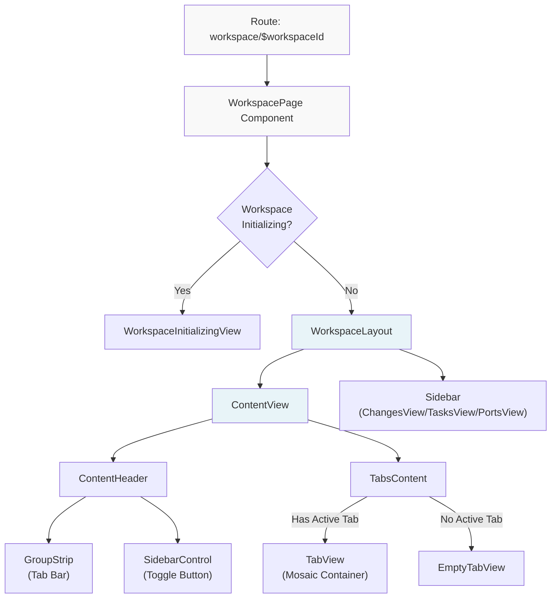
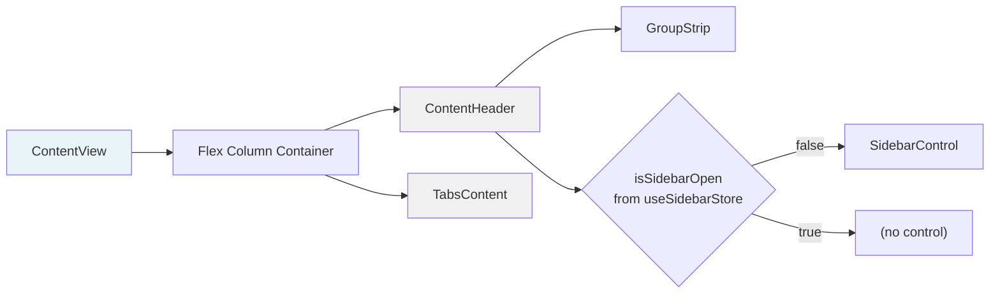
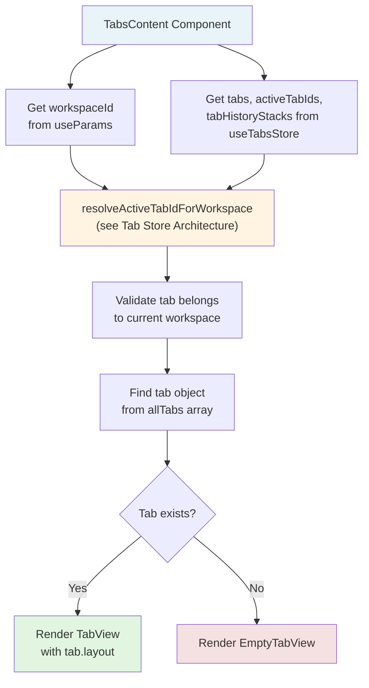
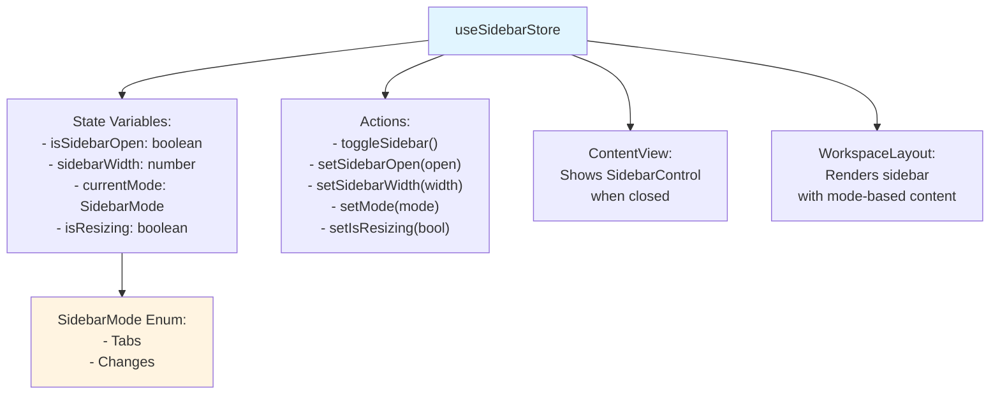
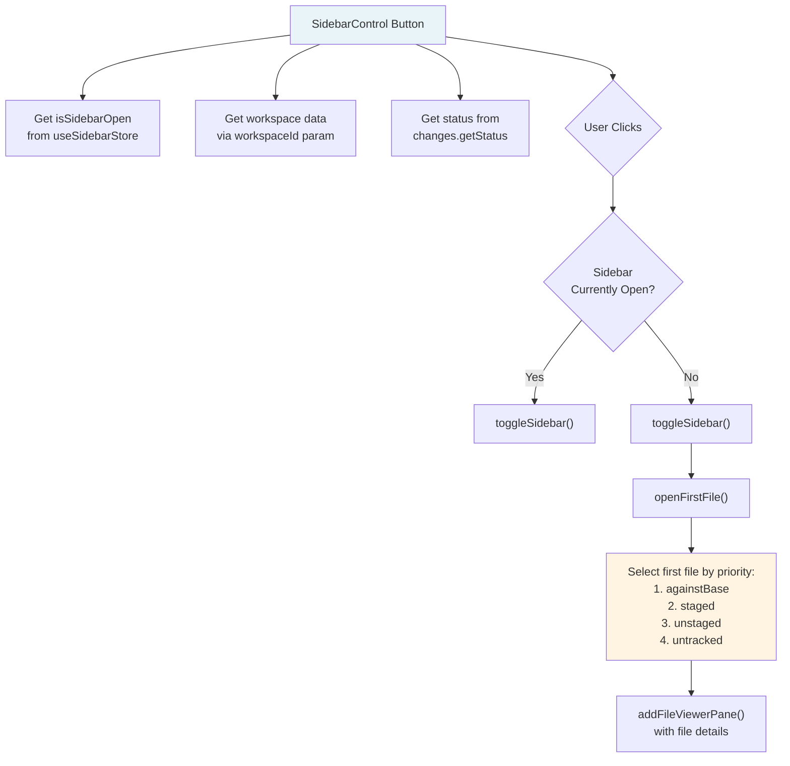
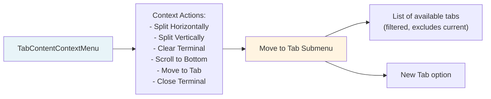
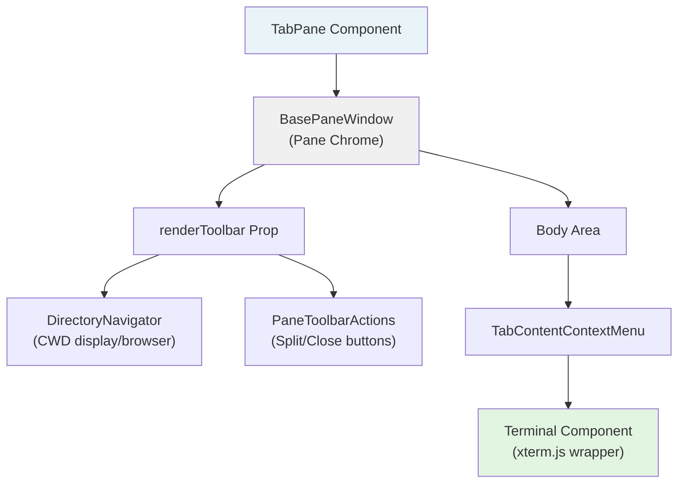
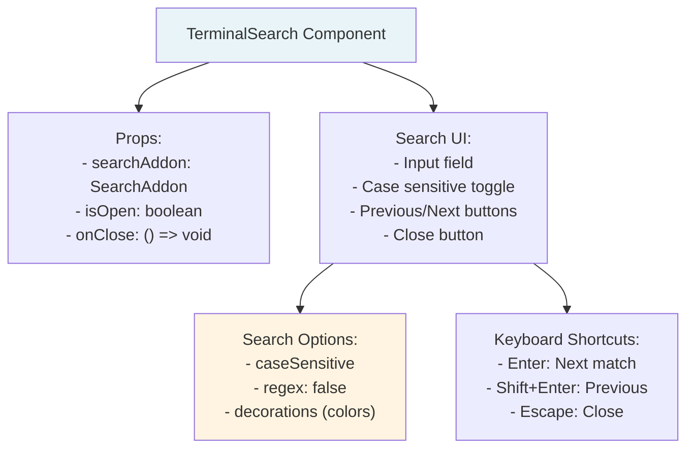
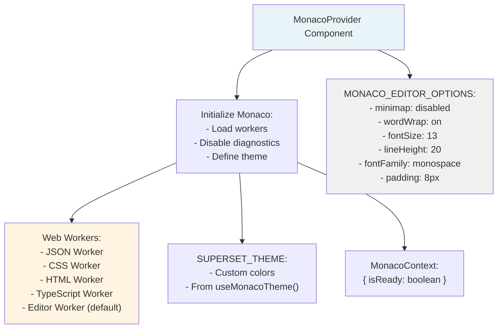
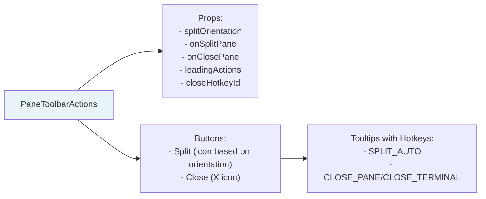

# UI Layout and Components

<details>
<summary>Relevant source files</summary>

The following files were used as context for generating this wiki page:

- [apps/desktop/src/lib/trpc/routers/external/helpers.test.ts](apps/desktop/src/lib/trpc/routers/external/helpers.test.ts)
- [apps/desktop/src/lib/trpc/routers/external/helpers.ts](apps/desktop/src/lib/trpc/routers/external/helpers.ts)
- [apps/desktop/src/lib/trpc/routers/external/index.ts](apps/desktop/src/lib/trpc/routers/external/index.ts)
- [apps/desktop/src/lib/trpc/routers/ui-state/index.ts](apps/desktop/src/lib/trpc/routers/ui-state/index.ts)
- [apps/desktop/src/renderer/assets/app-icons/android-studio.svg](apps/desktop/src/renderer/assets/app-icons/android-studio.svg)
- [apps/desktop/src/renderer/assets/app-icons/antigravity.svg](apps/desktop/src/renderer/assets/app-icons/antigravity.svg)
- [apps/desktop/src/renderer/assets/app-icons/sublime.svg](apps/desktop/src/renderer/assets/app-icons/sublime.svg)
- [apps/desktop/src/renderer/assets/app-icons/zed.png](apps/desktop/src/renderer/assets/app-icons/zed.png)
- [apps/desktop/src/renderer/components/OpenInButton/OpenInButton.tsx](apps/desktop/src/renderer/components/OpenInButton/OpenInButton.tsx)
- [apps/desktop/src/renderer/components/OpenInExternalDropdown/OpenInExternalDropdownItems.tsx](apps/desktop/src/renderer/components/OpenInExternalDropdown/OpenInExternalDropdownItems.tsx)
- [apps/desktop/src/renderer/components/OpenInExternalDropdown/constants.ts](apps/desktop/src/renderer/components/OpenInExternalDropdown/constants.ts)
- [apps/desktop/src/renderer/components/OpenInExternalDropdown/index.ts](apps/desktop/src/renderer/components/OpenInExternalDropdown/index.ts)
- [apps/desktop/src/renderer/routes/_authenticated/_dashboard/components/TopBar/TopBar.tsx](apps/desktop/src/renderer/routes/_authenticated/_dashboard/components/TopBar/TopBar.tsx)
- [apps/desktop/src/renderer/routes/_authenticated/_dashboard/components/TopBar/components/OpenInMenuButton/OpenInMenuButton.tsx](apps/desktop/src/renderer/routes/_authenticated/_dashboard/components/TopBar/components/OpenInMenuButton/OpenInMenuButton.tsx)
- [apps/desktop/src/renderer/routes/_authenticated/_dashboard/workspace/$workspaceId/page.tsx](apps/desktop/src/renderer/routes/_authenticated/_dashboard/workspace/$workspaceId/page.tsx)
- [apps/desktop/src/renderer/routes/_authenticated/settings/components/ClickablePath/ClickablePath.tsx](apps/desktop/src/renderer/routes/_authenticated/settings/components/ClickablePath/ClickablePath.tsx)
- [apps/desktop/src/renderer/screens/main/components/WorkspaceView/ContentView/TabsContent/GroupStrip/GroupItem.tsx](apps/desktop/src/renderer/screens/main/components/WorkspaceView/ContentView/TabsContent/GroupStrip/GroupItem.tsx)
- [apps/desktop/src/renderer/screens/main/components/WorkspaceView/ContentView/TabsContent/GroupStrip/GroupStrip.tsx](apps/desktop/src/renderer/screens/main/components/WorkspaceView/ContentView/TabsContent/GroupStrip/GroupStrip.tsx)
- [apps/desktop/src/renderer/screens/main/components/WorkspaceView/ContentView/TabsContent/TabContentContextMenu.tsx](apps/desktop/src/renderer/screens/main/components/WorkspaceView/ContentView/TabsContent/TabContentContextMenu.tsx)
- [apps/desktop/src/renderer/screens/main/components/WorkspaceView/ContentView/TabsContent/TabView/FileViewerPane/FileViewerPane.tsx](apps/desktop/src/renderer/screens/main/components/WorkspaceView/ContentView/TabsContent/TabView/FileViewerPane/FileViewerPane.tsx)
- [apps/desktop/src/renderer/screens/main/components/WorkspaceView/ContentView/TabsContent/TabView/FileViewerPane/components/DiffViewerContextMenu/DiffViewerContextMenu.tsx](apps/desktop/src/renderer/screens/main/components/WorkspaceView/ContentView/TabsContent/TabView/FileViewerPane/components/DiffViewerContextMenu/DiffViewerContextMenu.tsx)
- [apps/desktop/src/renderer/screens/main/components/WorkspaceView/ContentView/TabsContent/TabView/FileViewerPane/components/FileEditorContextMenu/FileEditorContextMenu.tsx](apps/desktop/src/renderer/screens/main/components/WorkspaceView/ContentView/TabsContent/TabView/FileViewerPane/components/FileEditorContextMenu/FileEditorContextMenu.tsx)
- [apps/desktop/src/renderer/screens/main/components/WorkspaceView/ContentView/TabsContent/TabView/FileViewerPane/components/FileViewerContent/FileViewerContent.tsx](apps/desktop/src/renderer/screens/main/components/WorkspaceView/ContentView/TabsContent/TabView/FileViewerPane/components/FileViewerContent/FileViewerContent.tsx)
- [apps/desktop/src/renderer/screens/main/components/WorkspaceView/ContentView/TabsContent/TabView/TabPane.tsx](apps/desktop/src/renderer/screens/main/components/WorkspaceView/ContentView/TabsContent/TabView/TabPane.tsx)
- [apps/desktop/src/renderer/screens/main/components/WorkspaceView/ContentView/TabsContent/TabView/index.tsx](apps/desktop/src/renderer/screens/main/components/WorkspaceView/ContentView/TabsContent/TabView/index.tsx)
- [apps/desktop/src/renderer/screens/main/components/WorkspaceView/ContentView/components/EditorContextMenu/EditorContextMenu.tsx](apps/desktop/src/renderer/screens/main/components/WorkspaceView/ContentView/components/EditorContextMenu/EditorContextMenu.tsx)
- [apps/desktop/src/renderer/screens/main/components/WorkspaceView/ContentView/components/PaneContextMenuItems/PaneContextMenuItems.tsx](apps/desktop/src/renderer/screens/main/components/WorkspaceView/ContentView/components/PaneContextMenuItems/PaneContextMenuItems.tsx)
- [apps/desktop/src/renderer/screens/main/components/WorkspaceView/ContentView/components/index.ts](apps/desktop/src/renderer/screens/main/components/WorkspaceView/ContentView/components/index.ts)
- [apps/desktop/src/renderer/stores/tabs/store.ts](apps/desktop/src/renderer/stores/tabs/store.ts)
- [apps/desktop/src/renderer/stores/tabs/terminal-callbacks.ts](apps/desktop/src/renderer/stores/tabs/terminal-callbacks.ts)
- [apps/desktop/src/renderer/stores/tabs/types.ts](apps/desktop/src/renderer/stores/tabs/types.ts)
- [apps/desktop/src/renderer/stores/tabs/utils.test.ts](apps/desktop/src/renderer/stores/tabs/utils.test.ts)
- [apps/desktop/src/renderer/stores/tabs/utils.ts](apps/desktop/src/renderer/stores/tabs/utils.ts)
- [apps/desktop/src/shared/hotkeys.ts](apps/desktop/src/shared/hotkeys.ts)
- [apps/desktop/src/shared/tabs-types.ts](apps/desktop/src/shared/tabs-types.ts)
- [docs/issues/linux-open-editor-fix.md](docs/issues/linux-open-editor-fix.md)
- [packages/local-db/src/schema/zod.ts](packages/local-db/src/schema/zod.ts)

</details>


This document provides an overview of the main UI layout structure and component organization in Superset's desktop application. It covers the high-level component hierarchy, layout composition patterns, and how different views integrate together. For detailed information about specific subsystems, see [Start View](#2.11.1), [Main Workspace View](#2.11.2), [Sidebar System](#2.11.3), and [Top Bar and Workspace Tabs](#2.11.4). For tab and pane management, see [Tab and Pane System](#2.7).

## Overall Layout Architecture

The application uses a hierarchical layout structure with clearly separated concerns. The root-level routing determines whether to show the start view (no workspace) or the workspace view (active workspace).



**Sources:** [apps/desktop/src/renderer/routes/_authenticated/_dashboard/workspace/$workspaceId/page.tsx:1-353](), [apps/desktop/src/renderer/screens/main/components/WorkspaceView/ContentView/index.tsx:1-21](), [apps/desktop/src/renderer/screens/main/components/WorkspaceView/ContentView/TabsContent/index.tsx:1-41]()

## Component Hierarchy and Responsibilities

The main UI is organized into distinct layers, each with specific responsibilities:

| Component | File Path | Responsibility |
|-----------|-----------|----------------|
| `WorkspacePage` | `workspace/$workspaceId/page.tsx` | Route component, handles workspace loading and initialization states |
| `WorkspaceLayout` | Referenced in route | Top-level layout container, orchestrates sidebar and content areas |
| `ContentView` | `ContentView/index.tsx` | Main content area container, manages header and tab content |
| `ContentHeader` | `ContentView/ContentHeader` | Top bar with tab strip and controls |
| `TabsContent` | `ContentView/TabsContent/index.tsx` | Resolves and renders active tab or empty state |
| `TabView` | `ContentView/TabsContent/TabView` | Mosaic container for pane layout (see [Tab and Pane System](#2.7)) |
| `GroupStrip` | `ContentView/TabsContent/GroupStrip` | Tab bar with drag-and-drop support |
| `SidebarControl` | `SidebarControl/SidebarControl.tsx` | Toggle button for sidebar visibility |

**Sources:** [apps/desktop/src/renderer/routes/_authenticated/_dashboard/workspace/$workspaceId/page.tsx:55-352](), [apps/desktop/src/renderer/screens/main/components/WorkspaceView/ContentView/index.tsx:7-20]()

## ContentView Structure

The `ContentView` component serves as the main content container, orchestrating the tab bar and content rendering:



The `ContentView` implementation demonstrates a clean composition pattern:

[apps/desktop/src/renderer/screens/main/components/WorkspaceView/ContentView/index.tsx:7-20]()

- Uses `useSidebarStore` to conditionally render `SidebarControl`
- Passes `GroupStrip` as children to `ContentHeader`
- Renders `TabsContent` as the main content area
- Uses flexbox layout with `overflow-hidden` to prevent scroll issues

**Sources:** [apps/desktop/src/renderer/screens/main/components/WorkspaceView/ContentView/index.tsx:1-21](), [apps/desktop/src/renderer/stores/sidebar-state.ts:1-123]()

## TabsContent Resolution Logic

The `TabsContent` component handles workspace-scoped tab resolution and rendering:



The resolution process at [apps/desktop/src/renderer/screens/main/components/WorkspaceView/ContentView/TabsContent/index.tsx:14-28]() ensures:

1. **Workspace Isolation:** Only tabs belonging to the current workspace are considered
2. **MRU History:** Uses `resolveActiveTabIdForWorkspace` to respect tab history stacks
3. **Validation:** Validates the resolved tab actually exists and belongs to the workspace
4. **Fallback:** Returns `null` if no valid tab is found, triggering `EmptyTabView`

This pattern prevents rendering bugs where a tab from a different workspace might be shown when switching workspaces.

**Sources:** [apps/desktop/src/renderer/screens/main/components/WorkspaceView/ContentView/TabsContent/index.tsx:1-41]()

## Sidebar Integration

The sidebar system operates independently from the main content area, with its state managed by `useSidebarStore`:



The sidebar width is clamped between `MIN_SIDEBAR_WIDTH` (200px) and `MAX_SIDEBAR_WIDTH` (500px) at [apps/desktop/src/renderer/stores/sidebar-state.ts:9-11](). The store uses Zustand's persist middleware to save sidebar preferences across sessions.

Key behaviors:
- When toggling closed, `currentMode` is set to `SidebarMode.Tabs` and saved to `lastMode`
- When toggling open, restores `lastMode` and `lastOpenSidebarWidth`
- Width changes automatically set `isSidebarOpen: true` if width > 0

**Sources:** [apps/desktop/src/renderer/stores/sidebar-state.ts:1-123](), [apps/desktop/src/renderer/screens/main/components/WorkspaceView/ContentView/index.tsx:7-20]()

## SidebarControl Component

The `SidebarControl` component provides a toggle button with intelligent file opening:



The priority-based file selection at [apps/desktop/src/renderer/screens/main/components/SidebarControl/SidebarControl.tsx:14-23]() ensures users see the most relevant changes first:

1. **Against Base:** Files changed compared to base branch (most important for PRs)
2. **Staged:** Files ready to commit
3. **Unstaged:** Modified files not yet staged
4. **Untracked:** New files not in git

The component only fetches changes data when the sidebar is closed ([SidebarControl/SidebarControl.tsx:40-48]()), optimizing performance by avoiding unnecessary queries.

**Sources:** [apps/desktop/src/renderer/screens/main/components/SidebarControl/SidebarControl.tsx:1-151]()

## Responsive Layout Patterns

The application uses several CSS patterns for responsive layout:

**Flex Layout with Overflow Control:**
```css
/* From ContentView */
.h-full .flex .flex-col .overflow-hidden
  └── ContentHeader (fixed height)
  └── TabsContent (.flex-1 .min-h-0 .flex .overflow-hidden)
```

The `min-h-0` on flex children is critical for proper scrolling behavior - it allows the child to shrink below its content size, enabling overflow handling.

**Mosaic Theme Customization:**

The Mosaic layout system is heavily customized via CSS at [apps/desktop/src/renderer/screens/main/components/WorkspaceView/ContentView/TabsContent/TabView/mosaic-theme.css:1-107]():

- `.mosaic-window`: 0.5px border, no box shadow, custom border color
- `.mosaic-window-toolbar`: 28px height, custom background colors
- `.mosaic-window-controls`: Fade in on hover/focus (opacity 0 → 1)
- `.mosaic-split`: Transparent background with cursor indicators

The focused state uses `var(--color-secondary)` background ([mosaic-theme.css:59-61]()) to provide visual feedback on the active pane.

**Sources:** [apps/desktop/src/renderer/screens/main/components/WorkspaceView/ContentView/index.tsx:10-19](), [apps/desktop/src/renderer/screens/main/components/WorkspaceView/ContentView/TabsContent/TabView/mosaic-theme.css:1-107]()

## State Management Integration

The UI components integrate with multiple Zustand stores to maintain their state:

| Store | Purpose | Key Selectors Used |
|-------|---------|-------------------|
| `useTabsStore` | Tab and pane management | `tabs`, `activeTabIds`, `focusedPaneIds`, `tabHistoryStacks`, `panes` |
| `useSidebarStore` | Sidebar visibility and mode | `isSidebarOpen`, `sidebarWidth`, `currentMode` |
| `useChangesStore` | Git changes view state | `selectedFiles`, `viewMode`, `baseBranch` |
| `useDragPaneStore` | Drag-and-drop state | `draggingPaneId`, `draggingSourceTabId` |
| `useTerminalCallbacksStore` | Terminal action callbacks | `clearCallbacks`, `scrollToBottomCallbacks` |

The stores are workspace-scoped where appropriate. For example, `activeTabIds` in `useTabsStore` is a map of `workspaceId → tabId`, ensuring each workspace maintains its own active tab.

**Workspace Resolution Pattern:**

At [apps/desktop/src/renderer/routes/_authenticated/_dashboard/workspace/$workspaceId/page.tsx:89-106](), the workspace page demonstrates proper filtering:

```typescript
const tabs = useMemo(
  () => allTabs.filter((tab) => tab.workspaceId === workspaceId),
  [workspaceId, allTabs]
);

const activeTabId = useMemo(() => {
  return resolveActiveTabIdForWorkspace({
    workspaceId, tabs, activeTabIds, tabHistoryStacks
  });
}, [workspaceId, tabs, activeTabIds, tabHistoryStacks]);
```

This pattern ensures UI components only render data for the current workspace, preventing cross-workspace state pollution.

**Sources:** [apps/desktop/src/renderer/routes/_authenticated/_dashboard/workspace/$workspaceId/page.tsx:78-108](), [apps/desktop/src/renderer/stores/tabs/store.ts:1-353](), [apps/desktop/src/renderer/stores/sidebar-state.ts:1-123]()

## Context Menu Integration

Components throughout the UI support context menus for pane operations. The `TabContentContextMenu` component provides a reusable wrapper:



The context menu implementation at [apps/desktop/src/renderer/screens/main/components/WorkspaceView/ContentView/TabsContent/TabContentContextMenu.tsx:38-113]() filters available tabs to exclude the current tab ([TabContentContextMenu.tsx:51]()) and includes hotkey shortcuts where assigned.

The menu wraps child components and triggers on right-click, providing quick access to common operations without cluttering the UI with buttons.

**Sources:** [apps/desktop/src/renderer/screens/main/components/WorkspaceView/ContentView/TabsContent/TabContentContextMenu.tsx:1-114](), [apps/desktop/src/renderer/screens/main/components/WorkspaceView/ContentView/TabsContent/TabView/TabPane.tsx:114-129]()

## Terminal UI Components

Terminal panes use a specialized component structure:



The `DirectoryNavigator` component at [apps/desktop/src/renderer/screens/main/components/WorkspaceView/ContentView/TabsContent/Terminal/DirectoryNavigator/DirectoryNavigator.tsx:1-238]() provides:

- **CWD Display:** Shows current working directory basename
- **Directory Browser:** Popover with breadcrumb navigation and subdirectory list
- **Quick Navigation:** Click subdirectory names to browse, or "cd" button to navigate
- **OSC-7 Integration:** Uses `cwdConfirmed` flag to distinguish seeded vs. confirmed paths

The directory path is tracked via OSC 7 escape sequences parsed at [apps/desktop/src/renderer/screens/main/components/WorkspaceView/ContentView/TabsContent/Terminal/parseCwd.ts:8-36](). The `cwdConfirmed` flag is set to `true` only when an OSC 7 sequence is received, indicating the shell has explicitly reported its location.

**Sources:** [apps/desktop/src/renderer/screens/main/components/WorkspaceView/ContentView/TabsContent/TabView/TabPane.tsx:1-132](), [apps/desktop/src/renderer/screens/main/components/WorkspaceView/ContentView/TabsContent/Terminal/DirectoryNavigator/DirectoryNavigator.tsx:1-238](), [apps/desktop/src/renderer/screens/main/components/WorkspaceView/ContentView/TabsContent/Terminal/parseCwd.ts:1-37]()

## Search Integration

Terminal panes include an integrated search UI provided by the xterm.js `SearchAddon`:



The search UI at [apps/desktop/src/renderer/screens/main/components/WorkspaceView/ContentView/TabsContent/Terminal/TerminalSearch/TerminalSearch.tsx:22-191]() renders as an absolute-positioned overlay at the top-right of the terminal. It uses custom decoration colors defined at [TerminalSearch.tsx:13-20]() for match highlighting.

The search automatically focuses the input when opened ([TerminalSearch.tsx:42-47]()) and clears decorations when closed ([TerminalSearch.tsx:50-54]()).

**Sources:** [apps/desktop/src/renderer/screens/main/components/WorkspaceView/ContentView/TabsContent/Terminal/TerminalSearch/TerminalSearch.tsx:1-192]()

## Monaco Editor Integration

File viewer panes use Monaco Editor, configured via the `MonacoProvider`:



The provider initializes Monaco at [apps/desktop/src/renderer/providers/MonacoProvider/MonacoProvider.tsx:36-55]() and configures web workers for language support at [MonacoProvider.tsx:12-28](). TypeScript and JavaScript diagnostics are disabled ([MonacoProvider.tsx:44-51]()) since the editor is primarily used for viewing diffs, not active development.

The `useMonacoReady()` hook at [MonacoProvider.tsx:65-67]() allows components to wait for initialization before rendering, preventing errors from accessing Monaco before it's loaded.

**Sources:** [apps/desktop/src/renderer/providers/MonacoProvider/MonacoProvider.tsx:1-136]()

## Toolbar Component Pattern

Panes use a consistent toolbar pattern via `PaneToolbarActions`:



The component at [apps/desktop/src/renderer/screens/main/components/WorkspaceView/ContentView/TabsContent/TabView/components/PaneToolbarActions/PaneToolbarActions.tsx:1-65]() provides a reusable toolbar implementation. It automatically displays the correct split icon based on `splitOrientation` ([PaneToolbarActions.tsx:24-29]()) and includes hotkey labels in tooltips.

The `closeHotkeyId` prop allows customization - terminal panes use `"CLOSE_TERMINAL"` ([TabPane.tsx:109]()) while other pane types might use `"CLOSE_PANE"`.

**Sources:** [apps/desktop/src/renderer/screens/main/components/WorkspaceView/ContentView/TabsContent/TabView/components/PaneToolbarActions/PaneToolbarActions.tsx:1-65](), [apps/desktop/src/renderer/screens/main/components/WorkspaceView/ContentView/TabsContent/TabView/TabPane.tsx:96-111]()