# Git Operations and Safety

Relevant source files

The following files were used as context for generating this wiki page:

- [apps/desktop/src/lib/trpc/routers/changes/git-operations.ts](apps/desktop/src/lib/trpc/routers/changes/git-operations.ts)
- [apps/desktop/src/lib/trpc/routers/changes/utils/pull-request-url.ts](apps/desktop/src/lib/trpc/routers/changes/utils/pull-request-url.ts)
- [apps/desktop/src/lib/trpc/routers/workspaces/utils/git.test.ts](apps/desktop/src/lib/trpc/routers/workspaces/utils/git.test.ts)
- [apps/desktop/src/lib/trpc/routers/workspaces/utils/git.ts](apps/desktop/src/lib/trpc/routers/workspaces/utils/git.ts)
- [apps/desktop/src/lib/trpc/routers/workspaces/utils/github/github.test.ts](apps/desktop/src/lib/trpc/routers/workspaces/utils/github/github.test.ts)
- [apps/desktop/src/lib/trpc/routers/workspaces/utils/github/github.ts](apps/desktop/src/lib/trpc/routers/workspaces/utils/github/github.ts)
- [apps/desktop/src/lib/trpc/routers/workspaces/utils/github/types.ts](apps/desktop/src/lib/trpc/routers/workspaces/utils/github/types.ts)
- [apps/desktop/src/lib/trpc/routers/workspaces/utils/upstream-ref.test.ts](apps/desktop/src/lib/trpc/routers/workspaces/utils/upstream-ref.test.ts)
- [apps/desktop/src/lib/trpc/routers/workspaces/utils/upstream-ref.ts](apps/desktop/src/lib/trpc/routers/workspaces/utils/upstream-ref.ts)
- [apps/desktop/src/renderer/screens/main/components/PRIcon/PRIcon.tsx](apps/desktop/src/renderer/screens/main/components/PRIcon/PRIcon.tsx)
- [apps/desktop/src/renderer/screens/main/components/PRIcon/index.ts](apps/desktop/src/renderer/screens/main/components/PRIcon/index.ts)
- [apps/desktop/src/renderer/screens/main/components/WorkspaceSidebar/WorkspaceListItem/components/WorkspaceHoverCard/WorkspaceHoverCard.tsx](apps/desktop/src/renderer/screens/main/components/WorkspaceSidebar/WorkspaceListItem/components/WorkspaceHoverCard/WorkspaceHoverCard.tsx)
- [apps/desktop/src/renderer/screens/main/components/WorkspaceSidebar/WorkspaceListItem/components/WorkspaceHoverCard/components/ReviewStatus/ReviewStatus.tsx](apps/desktop/src/renderer/screens/main/components/WorkspaceSidebar/WorkspaceListItem/components/WorkspaceHoverCard/components/ReviewStatus/ReviewStatus.tsx)
- [apps/desktop/src/renderer/screens/main/hooks/usePRStatus/index.ts](apps/desktop/src/renderer/screens/main/hooks/usePRStatus/index.ts)
- [apps/desktop/src/renderer/screens/main/hooks/usePRStatus/usePRStatus.ts](apps/desktop/src/renderer/screens/main/hooks/usePRStatus/usePRStatus.ts)
- [packages/host-service/src/git/createGitFactory/createGitFactory.ts](packages/host-service/src/git/createGitFactory/createGitFactory.ts)
- [scripts/check-desktop-git-env.sh](scripts/check-desktop-git-env.sh)

This document covers the safety mechanisms, error handling, and defensive programming patterns used throughout Git operations in the Desktop application. It focuses on preventing data loss, handling edge cases gracefully, and providing clear error messages to users.

For worktree creation mechanics, see [2.6.2 Git Worktree Management](#2.6.2). For GitHub PR operations and status fetching, see [2.6.5 GitHub Integration](#2.6.5). For project-level Git repository management, see [2.6.1 Projects and Git Repositories](#2.6.1).

## Safety Principles

All Git operations in Superset adhere to strict safety principles to prevent data loss and provide reliable operation even in edge cases:

**Key Safety Mechanisms:**

| Mechanism            | Purpose                           | Implementation                                      |
| -------------------- | --------------------------------- | --------------------------------------------------- |
| Lock-free status     | Prevent blocking other operations | `--no-optional-locks` flag in status checks         |
| Hook tolerance       | Continue despite hook failures    | Verify operation success independently of exit code |
| Error categorization | Provide actionable error messages | Pattern matching on stderr/exit codes               |
| Upstream validation  | Prevent divergence and conflicts  | Check ahead/behind status before operations         |
| Path validation      | Prevent arbitrary file access     | `assertRegisteredWorktree()` security check         |

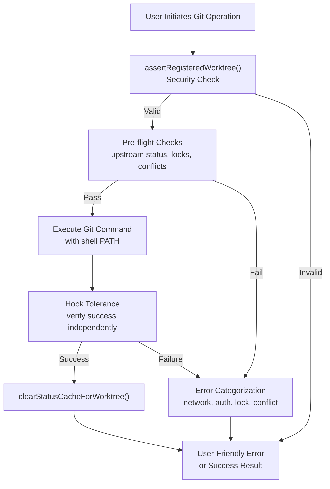

**Sources:** [apps/desktop/src/lib/trpc/routers/changes/git-operations.ts:16-23](), [apps/desktop/src/lib/trpc/routers/workspaces/utils/git.ts:128-172]()

## Lock-Free Status Operations

Git operations can create lock files (`.git/index.lock`, `.git/config.lock`) that block concurrent operations. To prevent blocking, all status checks use `--no-optional-locks`:

### getStatusNoLock Implementation

The `getStatusNoLock()` function performs repository status checks without acquiring locks:

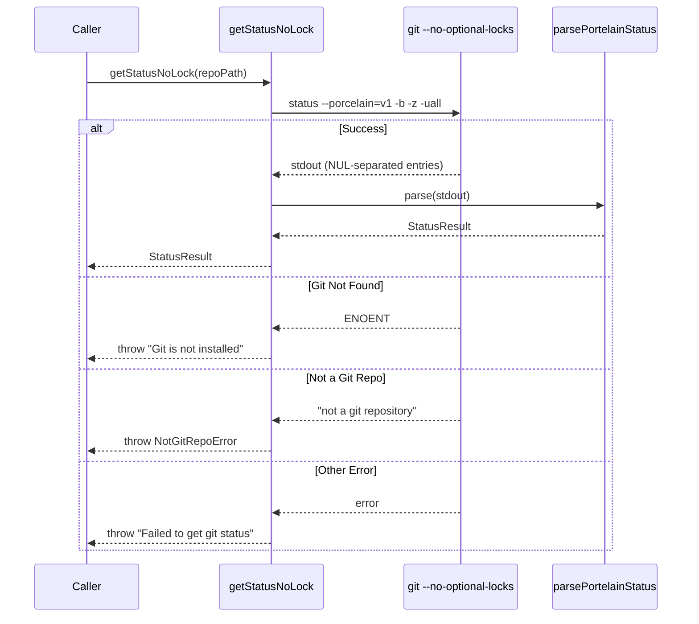

**Key Features:**

- **NUL-terminated output** (`-z` flag): Safely handles filenames with spaces, newlines, or special characters
- **Individual untracked files** (`-uall`): Shows all files in untracked directories, not just the directory name
- **Porcelain v1 format**: Machine-parseable output with consistent format across Git versions
- **No lock acquisition**: `--no-optional-locks` prevents blocking other Git operations

**Sources:** [apps/desktop/src/lib/trpc/routers/workspaces/utils/git.ts:128-172](), [apps/desktop/src/lib/trpc/routers/workspaces/utils/git.ts:179-308]()

## Branch and Remote Verification

Before performing operations on remote branches, the system verifies their existence and categorizes errors for user-friendly feedback.

### branchExistsOnRemote Error Categorization

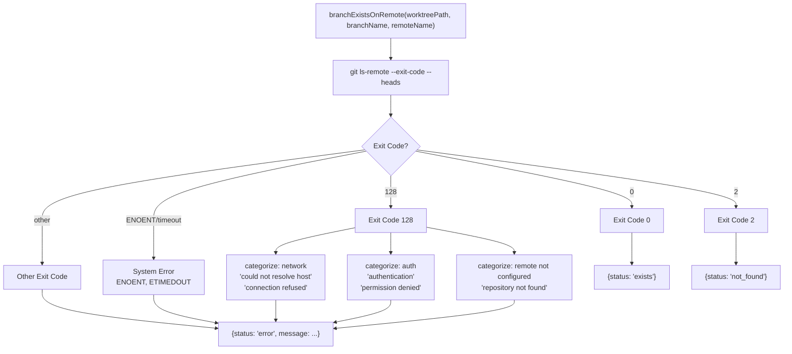

**Error Categories:**

| Category              | Patterns                                                    | User Message                                                         |
| --------------------- | ----------------------------------------------------------- | -------------------------------------------------------------------- |
| Network               | `could not resolve host`, `connection refused`, `timed out` | "Cannot connect to remote. Check your network connection."           |
| Authentication        | `authentication`, `permission denied`, `403`, `401`         | "Authentication failed. Check your Git credentials."                 |
| Remote not configured | `repository not found`, `no such remote`                    | "Remote 'origin' is not configured or the repository was not found." |
| Git not installed     | `ENOENT` error code                                         | "Git is not installed or not found in PATH."                         |

**Sources:** [apps/desktop/src/lib/trpc/routers/workspaces/utils/git.ts:1035-1180](), [apps/desktop/src/lib/trpc/routers/workspaces/utils/git.ts:1045-1106]()

## Hook Tolerance in Worktree Operations

Git hooks can exit with non-zero status even after successfully performing their work. Superset tolerates hook failures by verifying operation success independently:

### runWithPostCheckoutHookTolerance Pattern

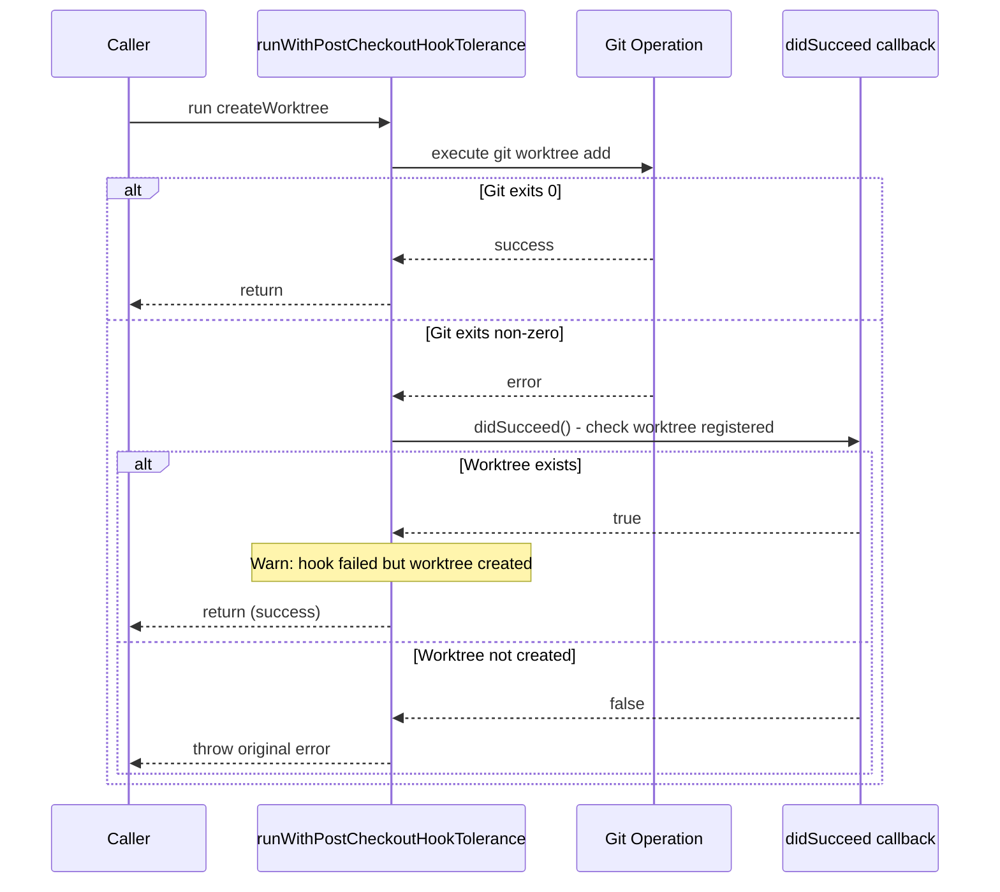

**Implementation for Worktree Creation:**

The `execWorktreeAdd()` function wraps `git worktree add` with hook tolerance:

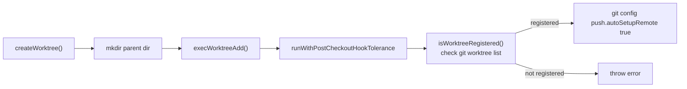

**Why Hook Tolerance Matters:**

- Some repositories have post-checkout hooks that perform side effects (npm install, file generation) but exit non-zero on warnings
- Without tolerance, these repositories would fail to create worktrees despite successful Git operations
- Verification ensures we don't silently ignore actual failures

**Sources:** [apps/desktop/src/lib/trpc/routers/workspaces/utils/git.ts:84-103](), [apps/desktop/src/lib/trpc/routers/workspaces/utils/git.ts:48-77](), [apps/desktop/src/lib/trpc/utils/git-hook-tolerance.ts]()

## Push/Pull/Sync Safety

Push and pull operations include multiple safety checks to prevent data loss and provide clear error recovery paths.

### Upstream Tracking Status

Before push/pull operations, the system checks the relationship between the local branch and its upstream:

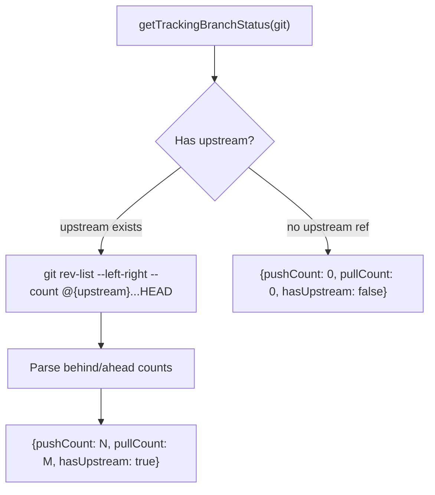

**Sources:** [apps/desktop/src/lib/trpc/routers/changes/git-operations.ts:129-171]()

### Push Operation Flow

The `push` tRPC procedure implements defensive pushing with automatic upstream setup:

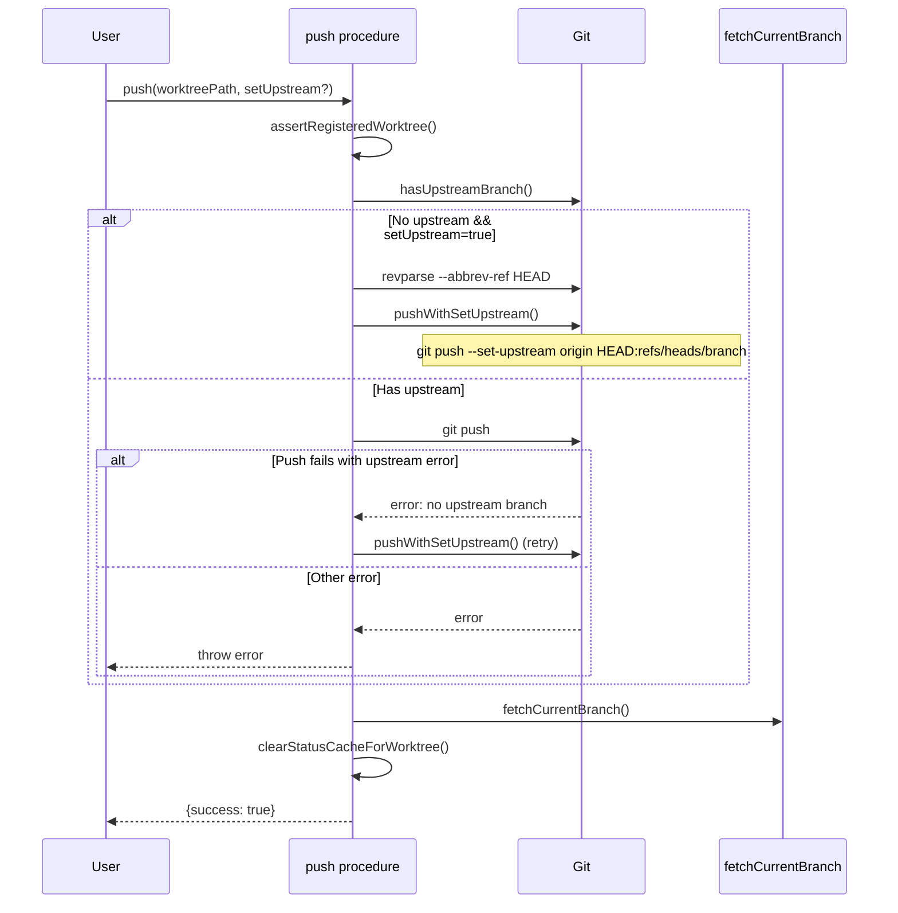

**Push Error Patterns:**

| Pattern                    | Action                            |
| -------------------------- | --------------------------------- |
| `no upstream branch`       | Retry with `--set-upstream`       |
| `no tracking information`  | Retry with `--set-upstream`       |
| `couldn't find remote ref` | Retry with `--set-upstream`       |
| `non-fast-forward`         | Throw error (requires pull first) |

**Sources:** [apps/desktop/src/lib/trpc/routers/changes/git-operations.ts:380-413](), [apps/desktop/src/lib/trpc/routers/changes/git-operations.ts:75-102](), [apps/desktop/src/lib/trpc/routers/changes/git-operations.ts:104-127]()

### Pull Operation with Upstream Missing Detection

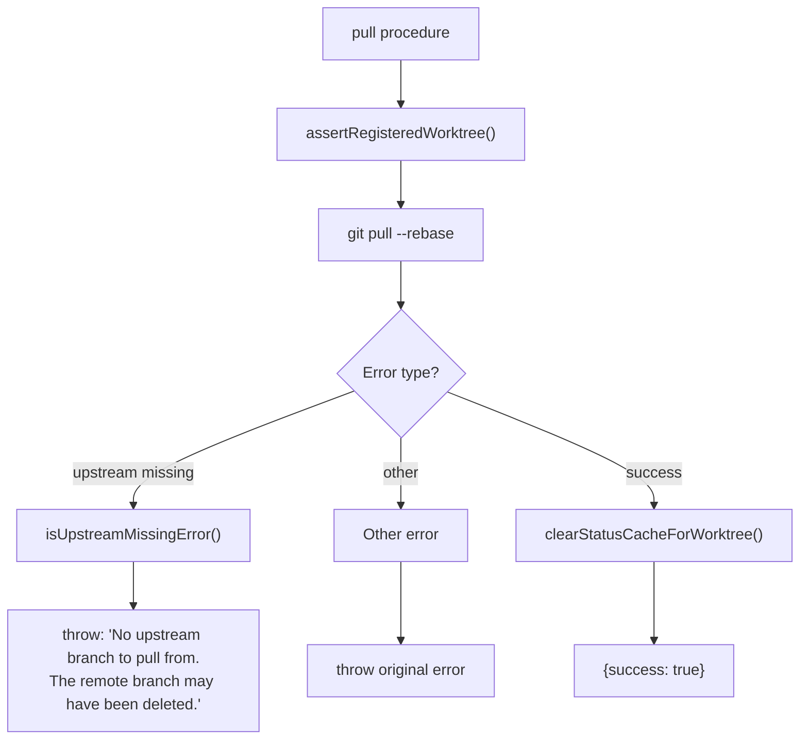

**Sources:** [apps/desktop/src/lib/trpc/routers/changes/git-operations.ts:415-439](), [apps/desktop/src/lib/trpc/routers/changes/git-utils.ts]()

### Sync Operation (Pull + Push)

The `sync` procedure combines pull and push with automatic upstream setup when needed:

**Flow:**

1. Attempt `git pull --rebase`
2. If upstream missing error → `pushWithSetUpstream()` (first push to remote)
3. If pull succeeds → `git push`
4. Fetch updated remote state
5. Clear status cache

This handles the case where a workspace has local commits but no remote branch yet.

**Sources:** [apps/desktop/src/lib/trpc/routers/changes/git-operations.ts:441-469]()

## PR Creation Safety Checks

Creating a pull request requires careful validation to prevent user confusion and ensure the PR reflects the current local state.

### createPR Pre-flight Checks

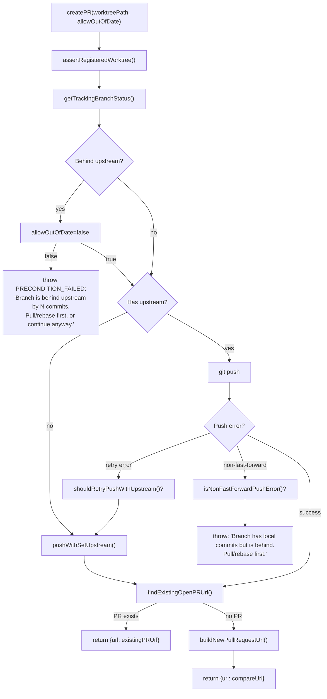

**Safety Guarantees:**

1. **Upstream synchronization**: Warns if branch is behind (prevents creating PR with outdated code)
2. **Remote branch exists**: Automatically pushes before PR creation (GitHub requires remote branch)
3. **Idempotency**: Detects existing open PR and returns its URL instead of creating duplicate
4. **Fork handling**: Uses correct upstream repository for fork PRs via `getRepoContext()`

**Sources:** [apps/desktop/src/lib/trpc/routers/changes/git-operations.ts:481-569](), [apps/desktop/src/lib/trpc/routers/changes/git-operations.ts:173-214]()

### Existing PR Detection

To prevent duplicate PRs, the system checks for existing open PRs using two methods:

**Method 1: Tracking-based lookup** (`gh pr view`)

- Uses the branch's tracking ref to find PR
- Essential for fork PRs that track `refs/pull/XXX/head`
- Validates PR head branch matches local branch to avoid stale tracking refs

**Method 2: Commit-based search** (`gh pr list --search`)

- Searches for PRs with HEAD commit as `headRefOid`
- Fallback when tracking-based lookup fails or returns mismatched PR
- Handles cases where tracking ref is stale or missing

**Sources:** [apps/desktop/src/lib/trpc/routers/changes/git-operations.ts:173-263]()

## Lock Error Handling

Git lock errors occur when another process holds a lock file or a previous operation crashed without cleanup.

### Lock Error Detection

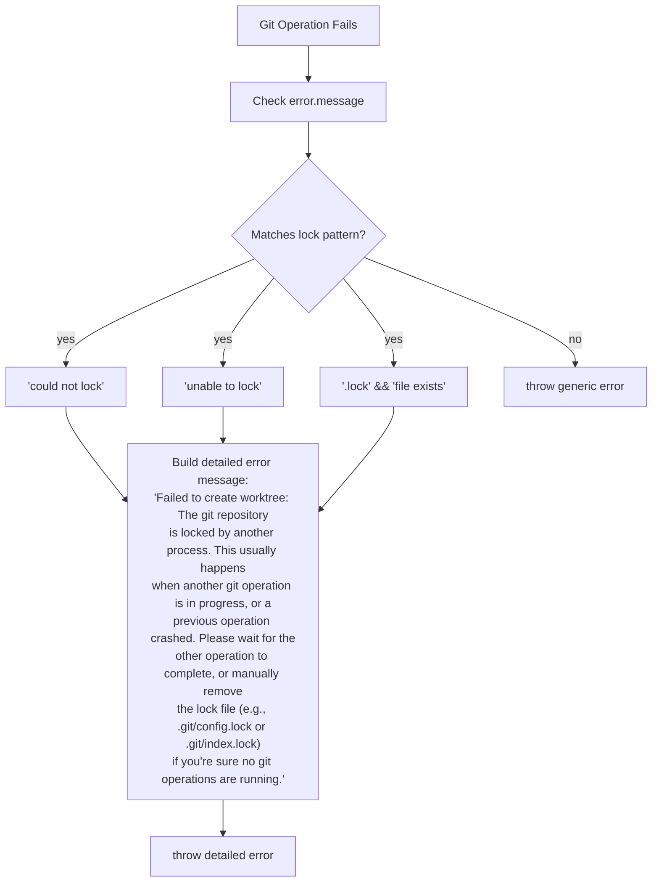

**Lock Error Handling in createWorktree:**

The function detects lock errors and provides actionable guidance:

- Explains the likely cause (concurrent operation or crash)
- Suggests waiting for other operations
- Provides manual recovery path (delete lock file)
- Lists specific lock file names (`.git/config.lock`, `.git/index.lock`)

**Sources:** [apps/desktop/src/lib/trpc/routers/workspaces/utils/git.ts:499-518](), [apps/desktop/src/lib/trpc/routers/workspaces/utils/git.ts:588-602]()

## Detached HEAD Safety

Operations refuse to proceed from detached HEAD state where the branch name is ambiguous:

**pushWithSetUpstream Detached HEAD Check:**

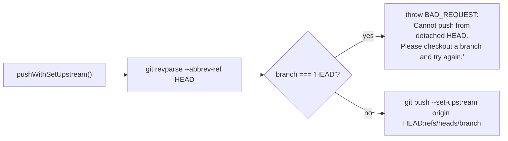

**Why This Matters:**

In detached HEAD state, `git rev-parse --abbrev-ref HEAD` returns the string `"HEAD"`, not a branch name. Attempting to push would fail or create a branch named "HEAD" on the remote, which is confusing and incorrect.

**Sources:** [apps/desktop/src/lib/trpc/routers/changes/git-operations.ts:75-102]()

## Path Validation Security

All Git operations validate that the worktree path is registered before allowing file system access:

**Security Pattern:**

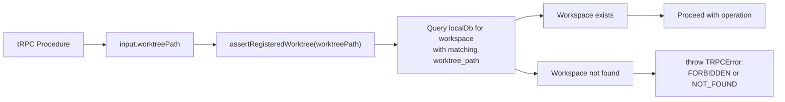

This prevents:

- Arbitrary file system access via crafted paths
- Operations on deleted/unregistered workspaces
- Race conditions between workspace deletion and ongoing operations

**Sources:** [apps/desktop/src/lib/trpc/routers/changes/security/path-validation.ts](), [apps/desktop/src/lib/trpc/routers/changes/git-operations.ts:371]()

## Test Coverage

The test suite validates safety mechanisms across various edge cases:

**Hook Tolerance Tests:**

- Post-checkout hook exits non-zero but worktree is created → operation succeeds with warning
- Worktree directory exists but Git operation fails → throws error (not silent failure)

**Branch Verification Tests:**

- Remote branch exists → returns `{status: 'exists'}`
- Remote branch doesn't exist (exit code 2) → returns `{status: 'not_found'}`
- Network error → returns `{status: 'error', message: 'Cannot connect to remote...'}`
- Auth error → returns `{status: 'error', message: 'Authentication failed...'}`

**getCurrentBranch Tests:**

- Empty repo with unborn HEAD → returns branch name (not null)
- Detached HEAD state → returns null

**Shell Environment Tests:**

- Validates that Git commands use enriched PATH from shell environment
- Ensures tools installed via Homebrew/nvm/volta are accessible
- Verifies delimiter markers don't leak into environment variables

**Sources:** [apps/desktop/src/lib/trpc/routers/workspaces/utils/git.test.ts:390-441](), [apps/desktop/src/lib/trpc/routers/workspaces/utils/git.test.ts:506-544](), [apps/desktop/src/lib/trpc/routers/workspaces/utils/git.test.ts:443-504]()
