# Git Worktree Management

<details>
<summary>Relevant source files</summary>

The following files were used as context for generating this wiki page:

- [apps/desktop/src/lib/trpc/routers/changes/git-operations.ts](apps/desktop/src/lib/trpc/routers/changes/git-operations.ts)
- [apps/desktop/src/lib/trpc/routers/changes/utils/pull-request-url.ts](apps/desktop/src/lib/trpc/routers/changes/utils/pull-request-url.ts)
- [apps/desktop/src/lib/trpc/routers/workspaces/utils/git.test.ts](apps/desktop/src/lib/trpc/routers/workspaces/utils/git.test.ts)
- [apps/desktop/src/lib/trpc/routers/workspaces/utils/git.ts](apps/desktop/src/lib/trpc/routers/workspaces/utils/git.ts)
- [apps/desktop/src/lib/trpc/routers/workspaces/utils/github/github.test.ts](apps/desktop/src/lib/trpc/routers/workspaces/utils/github/github.test.ts)
- [apps/desktop/src/lib/trpc/routers/workspaces/utils/github/github.ts](apps/desktop/src/lib/trpc/routers/workspaces/utils/github/github.ts)
- [apps/desktop/src/lib/trpc/routers/workspaces/utils/github/types.ts](apps/desktop/src/lib/trpc/routers/workspaces/utils/github/types.ts)
- [apps/desktop/src/lib/trpc/routers/workspaces/utils/upstream-ref.test.ts](apps/desktop/src/lib/trpc/routers/workspaces/utils/upstream-ref.test.ts)
- [apps/desktop/src/lib/trpc/routers/workspaces/utils/upstream-ref.ts](apps/desktop/src/lib/trpc/routers/workspaces/utils/upstream-ref.ts)
- [apps/desktop/src/renderer/screens/main/components/PRIcon/PRIcon.tsx](apps/desktop/src/renderer/screens/main/components/PRIcon/PRIcon.tsx)
- [apps/desktop/src/renderer/screens/main/components/PRIcon/index.ts](apps/desktop/src/renderer/screens/main/components/PRIcon/index.ts)
- [apps/desktop/src/renderer/screens/main/components/WorkspaceSidebar/WorkspaceListItem/components/WorkspaceHoverCard/WorkspaceHoverCard.tsx](apps/desktop/src/renderer/screens/main/components/WorkspaceSidebar/WorkspaceListItem/components/WorkspaceHoverCard/WorkspaceHoverCard.tsx)
- [apps/desktop/src/renderer/screens/main/components/WorkspaceSidebar/WorkspaceListItem/components/WorkspaceHoverCard/components/ReviewStatus/ReviewStatus.tsx](apps/desktop/src/renderer/screens/main/components/WorkspaceSidebar/WorkspaceListItem/components/WorkspaceHoverCard/components/ReviewStatus/ReviewStatus.tsx)
- [apps/desktop/src/renderer/screens/main/hooks/usePRStatus/index.ts](apps/desktop/src/renderer/screens/main/hooks/usePRStatus/index.ts)
- [apps/desktop/src/renderer/screens/main/hooks/usePRStatus/usePRStatus.ts](apps/desktop/src/renderer/screens/main/hooks/usePRStatus/usePRStatus.ts)
- [packages/host-service/src/git/createGitFactory/createGitFactory.ts](packages/host-service/src/git/createGitFactory/createGitFactory.ts)
- [scripts/check-desktop-git-env.sh](scripts/check-desktop-git-env.sh)

</details>

## Purpose and Scope

This document describes the Git worktree management system in Superset. Worktrees enable multiple working directories for the same repository, allowing parallel development on different branches without the overhead of full repository clones. This is essential for Superset's core use case: running multiple CLI coding agents in parallel, each in its own isolated worktree.

This page covers worktree creation, branch naming, removal, and safety validation. For project-level Git operations, see [Projects and Git Repositories](#2.6.1). For workspace lifecycle management that uses worktrees, see [Workspace Creation and Lifecycle](#2.6.3). For broader Git operations like status and checkout, see [Git Operations and Safety](#2.6.4).

**Sources:** [apps/desktop/src/lib/trpc/routers/workspaces/utils/git.ts:1-1077]()

---

## Worktree Creation Process

### createWorktree Function

The `createWorktree` function creates a new Git worktree with a new branch starting from a specified commit. It uses post-checkout hook tolerance to continue even if Git hooks fail after the worktree is created.

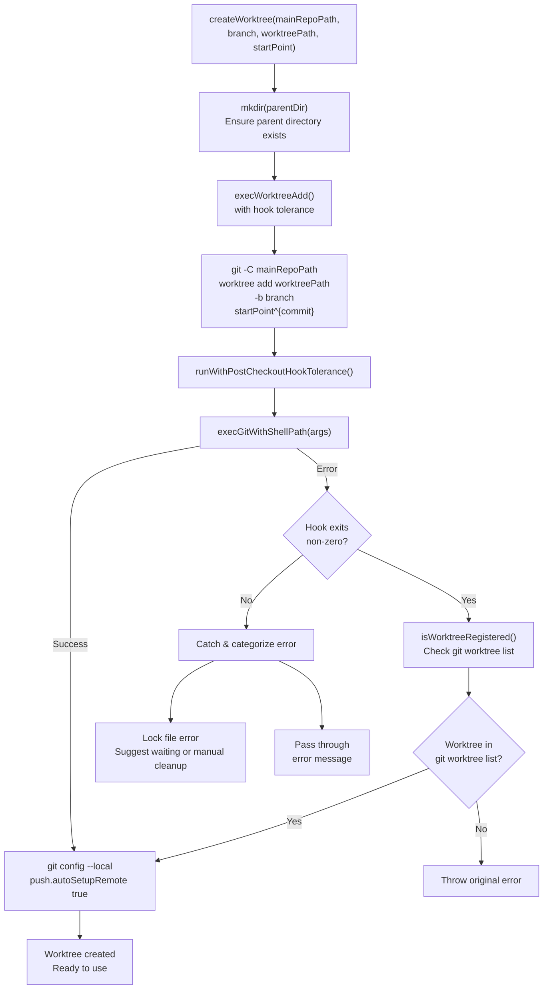

**Sources:** [apps/desktop/src/lib/trpc/routers/workspaces/utils/git.ts:457-519]()

### Post-Checkout Hook Tolerance

The `runWithPostCheckoutHookTolerance` helper handles a common edge case: Git's post-checkout hook can fail after successfully creating the worktree. This happens when hooks perform non-critical operations (like updating node_modules) that fail but shouldn't block worktree creation.

The tolerance mechanism:

1. Runs the Git command (e.g., `git worktree add`)
2. If the command fails, checks if the worktree was actually created successfully
3. If created, logs a warning but continues; otherwise, throws the error

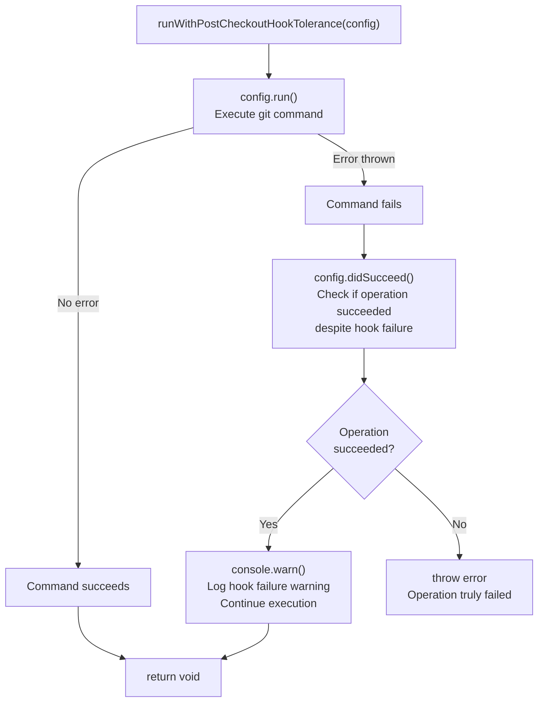

**Sources:** [apps/desktop/src/lib/trpc/routers/utils/git-hook-tolerance.ts:1-38](), [apps/desktop/src/lib/trpc/routers/workspaces/utils/git.ts:84-122]()

### The ^{commit} Suffix Pattern

The `createWorktree` function appends `^{commit}` to the `startPoint` parameter, forcing Git to dereference it to a commit SHA rather than treating it as a branch reference.

```javascript
// From createWorktree at line 480
;`${startPoint}^{commit}`
```

This prevents automatic upstream tracking. Without this suffix, `-b newBranch origin/main` would set `origin/main` as the upstream branch, which would:

- Allow accidental pushes to protected branches
- Confuse the tracking status of the new local branch
- Bypass the explicit `push.autoSetupRemote` configuration

**Sources:** [apps/desktop/src/lib/trpc/routers/workspaces/utils/git.ts:469-480]()

### createWorktreeFromExistingBranch Function

This variant creates a worktree for an already-existing branch (local or remote) without creating a new branch:

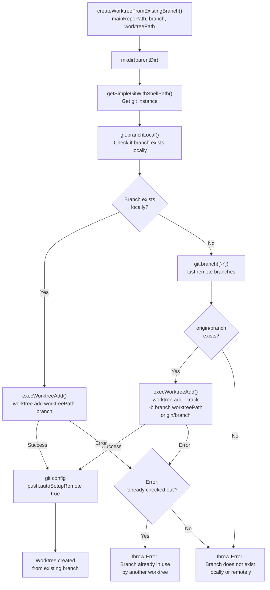

This function is used when opening an existing workspace or linking to a PR's branch that already exists.

**Sources:** [apps/desktop/src/lib/trpc/routers/workspaces/utils/git.ts:521-619]()

### Auto-Setup Remote Configuration

Both `createWorktree` and `createWorktreeFromExistingBranch` configure `push.autoSetupRemote` in the new worktree. This Git config option automatically runs `git push -u origin <branch>` on the first push, eliminating the need for manual upstream setup.

```bash
# Set in worktree at line 487-490 and 574-577
git config --local push.autoSetupRemote true
```

This makes the first `git push` in the worktree create the remote branch and set upstream tracking automatically.

**Sources:** [apps/desktop/src/lib/trpc/routers/workspaces/utils/git.ts:486-490](), [apps/desktop/src/lib/trpc/routers/workspaces/utils/git.ts:574-579]()

### Error Categorization

Both worktree creation functions categorize errors to provide actionable feedback:

| Error Pattern                                                  | User Message                                                                                 | When It Occurs                                                |
| -------------------------------------------------------------- | -------------------------------------------------------------------------------------------- | ------------------------------------------------------------- |
| `could not lock`, `unable to lock`, `.lock` with `file exists` | Git repository is locked by another process. Wait for other operations or remove lock files. | Another Git command is running, or a previous command crashed |
| `already checked out`                                          | Branch is already checked out in another worktree. Each branch can only be in one worktree.  | User tries to create multiple worktrees for the same branch   |

**Sources:** [apps/desktop/src/lib/trpc/routers/workspaces/utils/git.ts:495-518](), [apps/desktop/src/lib/trpc/routers/workspaces/utils/git.ts:584-617]()

---

## Branch Name Generation

The `generateBranchName` function creates unique, human-friendly branch names using the `friendly-words` library, optionally prefixed with an author identifier.

### Branch Prefix Modes

The system supports multiple prefix modes controlled by the `BranchPrefixMode` setting:

| Mode               | Behavior                                 | Example                |
| ------------------ | ---------------------------------------- | ---------------------- |
| `"auto"` (default) | GitHub username → Git author name → none | `username/happy-dog`   |
| `"author"`         | Git author name (sanitized)              | `john-smith/happy-dog` |
| `"custom"`         | User-defined custom prefix               | `feature/happy-dog`    |
| `"none"`           | No prefix                                | `happy-dog`            |

The `getBranchPrefix` function resolves the mode to an actual prefix string:

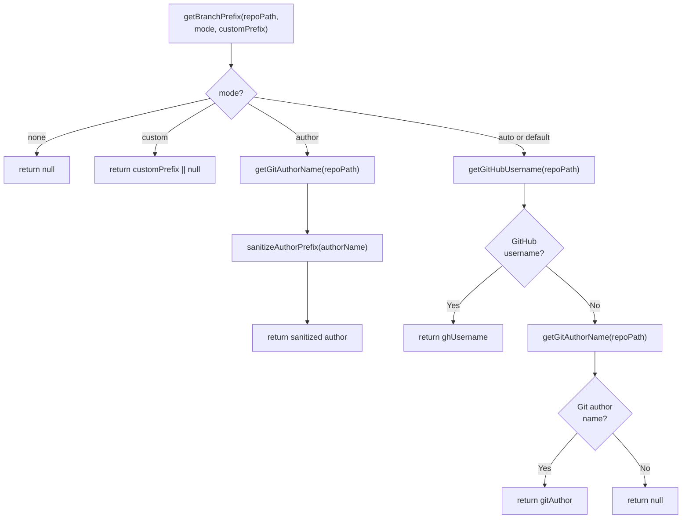

**Sources:** [apps/desktop/src/lib/trpc/routers/workspaces/utils/git.ts:363-403]()

### GitHub Username Resolution

The `getGitHubUsername` function queries the GitHub CLI (`gh`) to get the authenticated user's login:

```bash
# Executed at line 345-349
gh api user --jq .login
```

Results are cached for 5 minutes to avoid repeated API calls. If `gh` is not installed or not authenticated, the function falls back to Git author name.

**Sources:** [apps/desktop/src/lib/trpc/routers/workspaces/utils/git.ts:328-361]()

### Generation Algorithm with Prefix

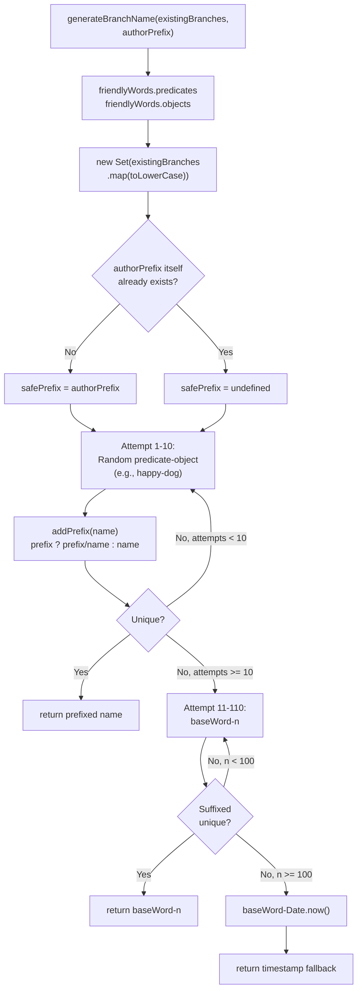

### Branch Name Sanitization

The `sanitizeBranchName` function normalizes names to be Git-safe:

- Converts to lowercase
- Replaces spaces and underscores with hyphens
- Removes non-alphanumeric characters except hyphens and slashes
- Prevents consecutive or trailing hyphens

**Sources:** [apps/desktop/src/lib/trpc/routers/workspaces/utils/git.ts:411-455](), [shared/utils/branch.ts:1-50]()

---

## Worktree Removal

### removeWorktree Function

The `removeWorktree` function uses a rename-then-background-delete strategy to safely remove worktrees without blocking the user:

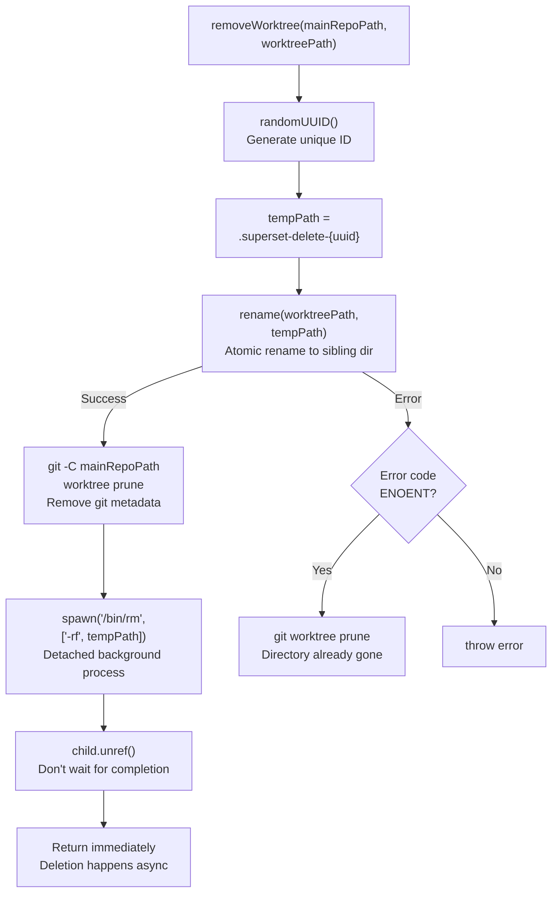

**Why rename-then-background-delete?**

1. **Atomic rename**: Moving to a temp name immediately frees the worktree path for reuse
2. **Background deletion**: Large directories (e.g., `node_modules`) can take seconds to delete; spawning `/bin/rm` avoids blocking the user
3. **Same filesystem**: Renaming to a sibling directory (same parent) avoids `EXDEV` (cross-device) errors
4. **Detached process**: `child.unref()` lets the app exit without waiting for deletion to complete

The function uses `/bin/rm -rf` instead of Node's `fs.rm` because `fs.rm` can hang on macOS when encountering `.app` bundles with extended attributes.

**Sources:** [apps/desktop/src/lib/trpc/routers/workspaces/utils/git.ts:644-697]()

### Worktree Listing and Validation

The system provides functions to list and validate worktrees:

**`worktreeExists`**: Checks if a specific worktree is registered

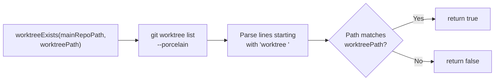

**`listExternalWorktrees`**: Returns all worktrees with their metadata

```typescript
interface ExternalWorktree {
  path: string
  branch: string | null
  isDetached: boolean
  isBare: boolean
}
```

The parser reads `git worktree list --porcelain` and extracts:

- `worktree <path>`: Worktree location
- `branch refs/heads/<name>`: Current branch
- `detached`: Worktree is in detached HEAD state
- `bare`: Worktree is a bare repository

**Sources:** [apps/desktop/src/lib/trpc/routers/workspaces/utils/git.ts:713-781]()

### Branch Worktree Path Lookup

The `getBranchWorktreePath` function checks if a branch is currently checked out in any worktree:

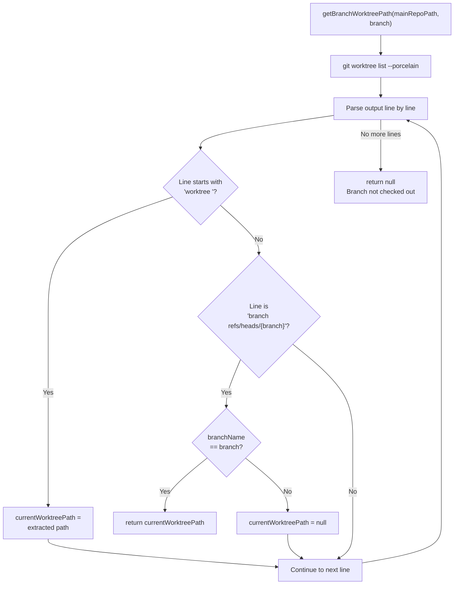

This is used to prevent creating multiple worktrees for the same branch, which Git forbids.

**Sources:** [apps/desktop/src/lib/trpc/routers/workspaces/utils/git.ts:783-823]()

---

## Remote Branch Verification

### branchExistsOnRemote Function

The `branchExistsOnRemote` function checks if a branch exists on a remote (defaulting to `origin`) using `git ls-remote --exit-code`. It categorizes errors into network, authentication, and configuration issues.

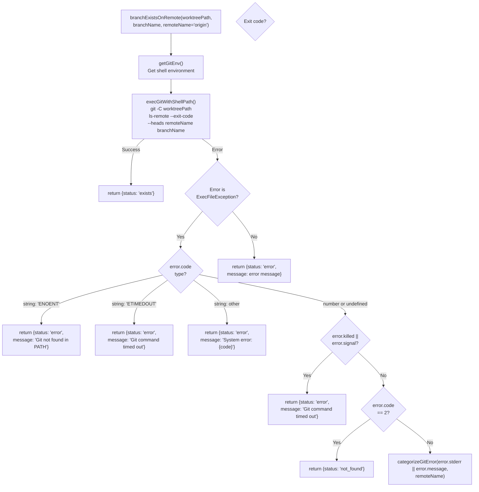

### Git Exit Code Handling

The function uses `git ls-remote --exit-code` which returns:

| Exit Code | Meaning                                   | Result                  |
| --------- | ----------------------------------------- | ----------------------- |
| 0         | Refs found (branch exists)                | `{status: 'exists'}`    |
| 2         | No matching refs                          | `{status: 'not_found'}` |
| 128       | Fatal error (auth, network, invalid repo) | Categorize using stderr |
| Other     | Unexpected error                          | Categorize using stderr |

**Sources:** [apps/desktop/src/lib/trpc/routers/workspaces/utils/git.ts:1024-1040](), [apps/desktop/src/lib/trpc/routers/workspaces/utils/git.ts:1108-1180]()

### Error Categorization

The `categorizeGitError` function uses pattern matching on error messages:

| Pattern Group  | Patterns                                                                                                                                       | User Message                                                               |
| -------------- | ---------------------------------------------------------------------------------------------------------------------------------------------- | -------------------------------------------------------------------------- |
| Network        | `could not resolve host`, `unable to access`, `connection refused`, `network is unreachable`, `timed out`, `ssl`, `could not read from remote` | "Cannot connect to remote. Check your network connection."                 |
| Authentication | `authentication`, `permission denied`, `403`, `401`, `permission denied (publickey)`, `host key verification failed`                           | "Authentication failed. Check your Git credentials."                       |
| Remote Config  | `does not appear to be a git repository`, `no such remote`, `repository not found`, `remote not found`, `remote origin not found`              | "Remote '{remoteName}' is not configured or the repository was not found." |
| Generic        | All others                                                                                                                                     | "Failed to verify branch: {errorMessage}"                                  |

**Sources:** [apps/desktop/src/lib/trpc/routers/workspaces/utils/git.ts:1042-1106]()

### Tracking Remote Name Resolution

The system uses `getTrackingRemoteNameForWorktree` to determine which remote to check when the branch has an upstream tracking relationship:

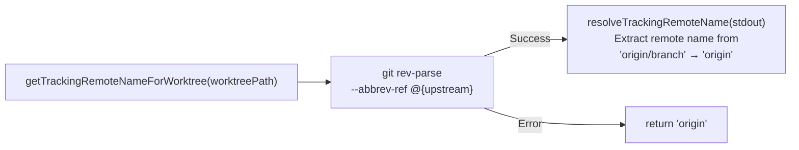

This is used in PR status checking where fork PRs may track a remote other than `origin` (e.g., `contributor-fork/feature-branch`).

**Sources:** [apps/desktop/src/lib/trpc/routers/workspaces/utils/git.ts:1182-1194](), [apps/desktop/src/lib/trpc/routers/workspaces/utils/upstream-ref.ts:20-29]()

---

## Git Status Without Locks

### getStatusNoLock Function

The `getStatusNoLock` function retrieves repository status without acquiring optional locks, preventing conflicts with other Git operations:

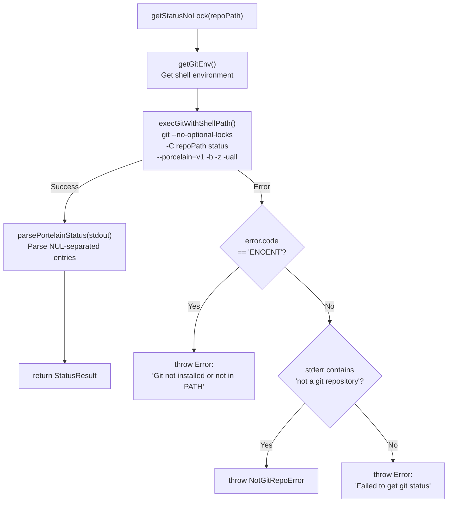

**Why `--no-optional-locks`?**

Git normally acquires locks on `.git/index` during status operations. If another process (e.g., a background Git operation or IDE plugin) holds the lock, `git status` blocks. The `--no-optional-locks` flag tells Git to skip lock acquisition and read stale data if necessary, preventing deadlocks.

**Porcelain Format Details**

| Flag             | Purpose                                                 |
| ---------------- | ------------------------------------------------------- |
| `--porcelain=v1` | Machine-parseable output with consistent format         |
| `-b`             | Include branch information header                       |
| `-z`             | NUL-terminate entries (handles filenames with newlines) |
| `-uall`          | Show individual files in untracked directories          |

**Sources:** [apps/desktop/src/lib/trpc/routers/workspaces/utils/git.ts:128-172]()

### parsePortelainStatus Parser

The parser converts `git status --porcelain=v1 -z` output into a `StatusResult` object:

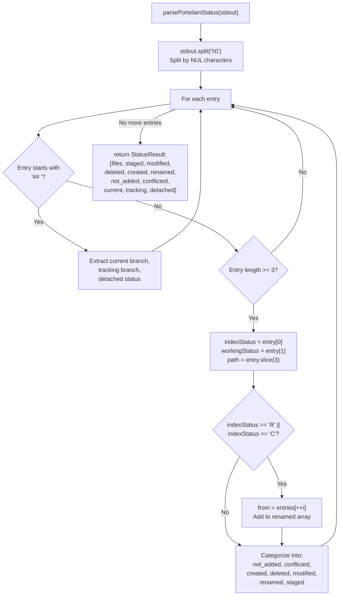

**Status Codes**

The parser interprets two-character codes (index status + working tree status):

| Code         | Meaning                  | Arrays Updated       |
| ------------ | ------------------------ | -------------------- |
| `??`         | Untracked file           | `not_added`          |
| `A `         | Added to index           | `created`, `staged`  |
| `M `         | Modified in index        | `modified`, `staged` |
| ` M`         | Modified in working tree | `modified`           |
| `MM`         | Modified in both         | `modified`, `staged` |
| `D `         | Deleted in index         | `deleted`, `staged`  |
| ` D`         | Deleted in working tree  | `deleted`            |
| `R `         | Renamed in index         | `renamed`, `staged`  |
| `U?` or `?U` | Merge conflict           | `conflicted`         |

**Sources:** [apps/desktop/src/lib/trpc/routers/workspaces/utils/git.ts:174-308]()

---

## Default Branch Detection

### getDefaultBranch Function

The `getDefaultBranch` function determines a repository's main branch through multiple fallback strategies:

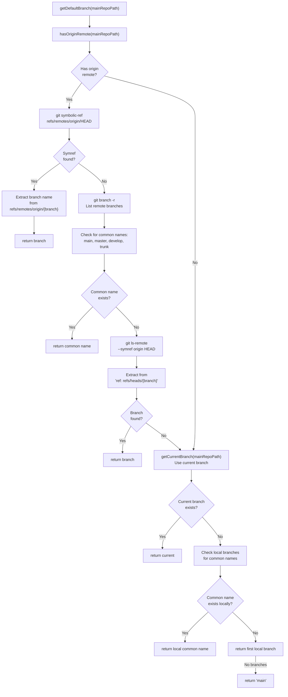

### refreshDefaultBranch Function

The `refreshDefaultBranch` function updates `origin/HEAD` to detect when the remote's default branch has changed:

```bash
# Executed at line 928
git remote set-head origin --auto
```

This command queries the remote and updates `refs/remotes/origin/HEAD` to point to the remote's current HEAD. This is necessary because Git doesn't automatically update `origin/HEAD` during `git fetch`.

**Sources:** [apps/desktop/src/lib/trpc/routers/workspaces/utils/git.ts:825-950]()

### Base Branch Detection

The `detectBaseBranch` function uses `git merge-base` to find which branch a worktree was likely branched from:

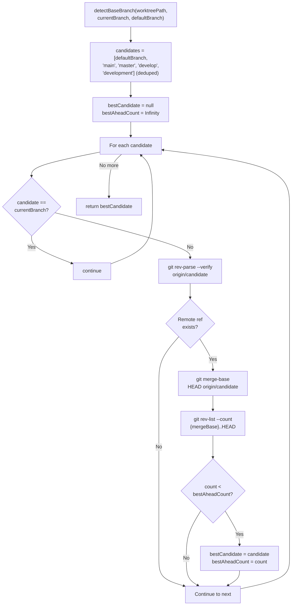

This is used to suggest the correct base branch when creating a PR.

**Sources:** [apps/desktop/src/lib/trpc/routers/workspaces/utils/git.ts:1196-1246]()

---

## Environment Configuration

### Shell Environment for Git Operations

All Git operations use `getGitEnv()` to ensure proper PATH configuration, particularly on macOS where GUI apps don't inherit shell environment:

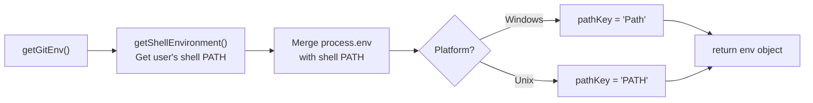

This ensures Git and Git LFS are found even when:

- Git is installed via Homebrew on macOS
- The application is launched from the GUI (not terminal)
- Custom shell configurations modify PATH

**Sources:** [apps/desktop/src/lib/trpc/routers/workspaces/utils/git.ts:33-49]()

---

## Command Execution Details

### execFileAsync Wrapper

All Git commands use Node's `execFileAsync` instead of `simple-git` for operations requiring precise exit code handling or timeout control:

| Parameter | Value               | Purpose                     |
| --------- | ------------------- | --------------------------- |
| `command` | `"git"`             | Direct Git CLI invocation   |
| `args`    | Array of strings    | Command arguments           |
| `env`     | `await getGitEnv()` | Shell environment with PATH |
| `timeout` | 30-120 seconds      | Prevent hanging operations  |

Example from `createWorktree`:

```javascript
await execFileAsync(
  'git',
  [
    '-C',
    mainRepoPath,
    'worktree',
    'add',
    worktreePath,
    '-b',
    branch,
    `${startPoint}^{commit}`,
  ],
  { env, timeout: 120_000 }
)
```

**Sources:** [apps/desktop/src/lib/trpc/routers/workspaces/utils/git.ts:355-371]()

---

## Teardown Integration

When worktrees are removed, the system can execute optional teardown scripts defined in `.superset/config.json`. This is handled separately from Git worktree removal to allow cleanup of processes, databases, or other resources.

For details on teardown script execution, see [Setup and Teardown Scripts](#2.6.5).

**Sources:** [apps/desktop/src/lib/trpc/routers/workspaces/utils/teardown.ts:1-81]()
