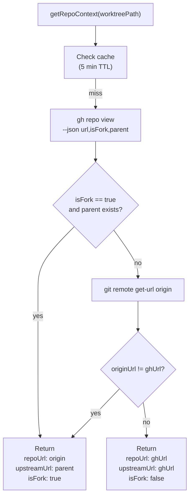
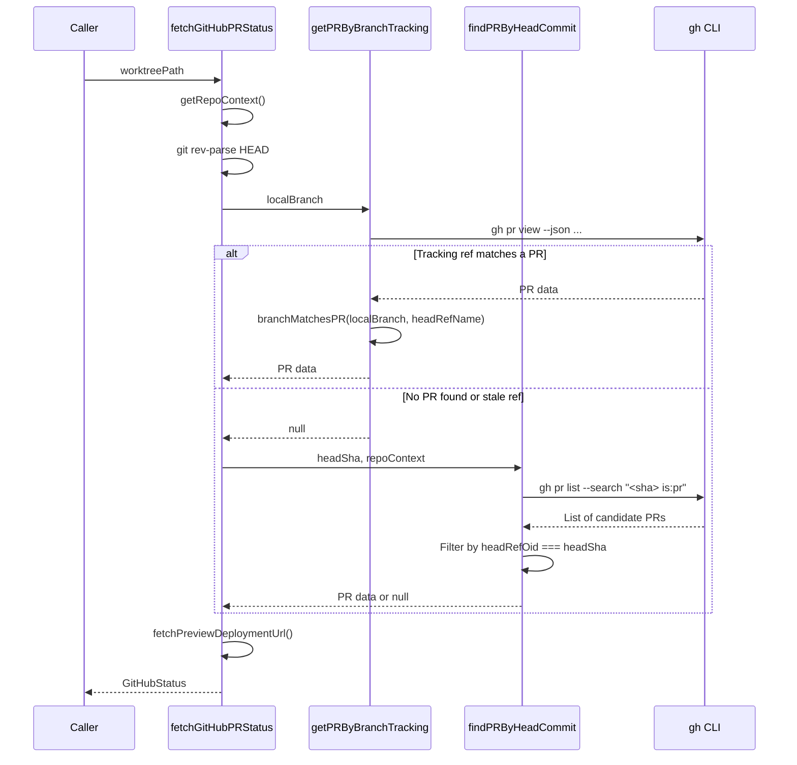
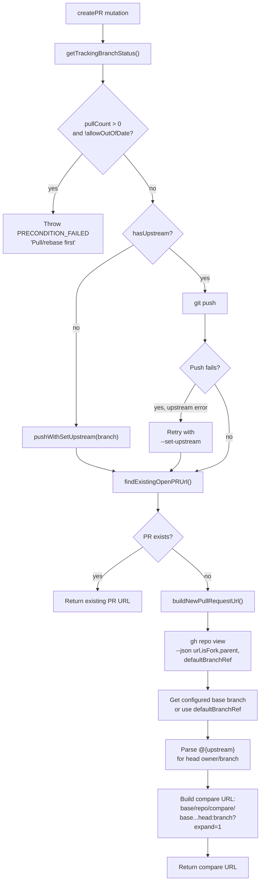

# GitHub Integration

<details>
<summary>Relevant source files</summary>

The following files were used as context for generating this wiki page:

- [apps/desktop/src/lib/trpc/routers/changes/git-operations.ts](apps/desktop/src/lib/trpc/routers/changes/git-operations.ts)
- [apps/desktop/src/lib/trpc/routers/changes/utils/pull-request-url.ts](apps/desktop/src/lib/trpc/routers/changes/utils/pull-request-url.ts)
- [apps/desktop/src/lib/trpc/routers/workspaces/utils/git.test.ts](apps/desktop/src/lib/trpc/routers/workspaces/utils/git.test.ts)
- [apps/desktop/src/lib/trpc/routers/workspaces/utils/git.ts](apps/desktop/src/lib/trpc/routers/workspaces/utils/git.ts)
- [apps/desktop/src/lib/trpc/routers/workspaces/utils/github/github.test.ts](apps/desktop/src/lib/trpc/routers/workspaces/utils/github/github.test.ts)
- [apps/desktop/src/lib/trpc/routers/workspaces/utils/github/github.ts](apps/desktop/src/lib/trpc/routers/workspaces/utils/github/github.ts)
- [apps/desktop/src/lib/trpc/routers/workspaces/utils/github/types.ts](apps/desktop/src/lib/trpc/routers/workspaces/utils/github/types.ts)
- [apps/desktop/src/lib/trpc/routers/workspaces/utils/upstream-ref.test.ts](apps/desktop/src/lib/trpc/routers/workspaces/utils/upstream-ref.test.ts)
- [apps/desktop/src/lib/trpc/routers/workspaces/utils/upstream-ref.ts](apps/desktop/src/lib/trpc/routers/workspaces/utils/upstream-ref.ts)
- [apps/desktop/src/renderer/screens/main/components/PRIcon/PRIcon.tsx](apps/desktop/src/renderer/screens/main/components/PRIcon/PRIcon.tsx)
- [apps/desktop/src/renderer/screens/main/components/PRIcon/index.ts](apps/desktop/src/renderer/screens/main/components/PRIcon/index.ts)
- [apps/desktop/src/renderer/screens/main/components/WorkspaceSidebar/WorkspaceListItem/components/WorkspaceHoverCard/WorkspaceHoverCard.tsx](apps/desktop/src/renderer/screens/main/components/WorkspaceSidebar/WorkspaceListItem/components/WorkspaceHoverCard/WorkspaceHoverCard.tsx)
- [apps/desktop/src/renderer/screens/main/components/WorkspaceSidebar/WorkspaceListItem/components/WorkspaceHoverCard/components/ReviewStatus/ReviewStatus.tsx](apps/desktop/src/renderer/screens/main/components/WorkspaceSidebar/WorkspaceListItem/components/WorkspaceHoverCard/components/ReviewStatus/ReviewStatus.tsx)
- [apps/desktop/src/renderer/screens/main/hooks/usePRStatus/index.ts](apps/desktop/src/renderer/screens/main/hooks/usePRStatus/index.ts)
- [apps/desktop/src/renderer/screens/main/hooks/usePRStatus/usePRStatus.ts](apps/desktop/src/renderer/screens/main/hooks/usePRStatus/usePRStatus.ts)
- [packages/host-service/src/git/createGitFactory/createGitFactory.ts](packages/host-service/src/git/createGitFactory/createGitFactory.ts)
- [scripts/check-desktop-git-env.sh](scripts/check-desktop-git-env.sh)

</details>

## Purpose and Scope

This document describes the GitHub-specific integration features in the Superset desktop application, including pull request status fetching, PR creation workflows, deployment preview URLs, and the GitHub CLI integration layer. This builds on the Git operations foundation to provide rich GitHub-specific functionality.

For general Git operations (commit, push, pull), see [Git Operations and Safety](#2.6.4). For workspace and worktree management, see [Git Worktree Management](#2.6.2).

---

## GitHub CLI Integration

The desktop application uses the `gh` CLI tool as its primary interface to the GitHub API, rather than direct HTTP calls. This approach leverages the user's existing GitHub authentication and provides consistent behavior with other Git tools.

### Command Execution via Shell Environment

All `gh` commands are executed through `execWithShellEnv`, which ensures the shell's PATH includes directories where `gh` might be installed (e.g., `/opt/homebrew/bin`, `/usr/local/bin`). This is critical for macOS GUI applications launched from Finder/Dock, which have a minimal PATH environment.

[apps/desktop/src/lib/trpc/routers/workspaces/utils/shell-env.ts:1-200]()

### Authentication Requirements

The application assumes `gh` is authenticated via `gh auth login`. If `gh` is not installed or not authenticated, GitHub integration features gracefully degrade—workspaces still function, but PR status and creation features are unavailable.

Sources: [apps/desktop/src/lib/trpc/routers/workspaces/utils/github/github.ts:21-85]()

---

## Repository Context Detection

Before querying for PRs or creating new ones, the application determines whether the local repository is a fork and identifies the upstream repository. This affects where PRs are created and which remote is queried.

### RepoContext Structure

```typescript
interface RepoContext {
  repoUrl: string // Local repo's GitHub URL (fork if forked)
  upstreamUrl: string // Upstream repo URL (parent if forked, else same as repoUrl)
  isFork: boolean // Whether the local repo is a fork
}
```

### Detection Strategy

The `getRepoContext` function uses `gh repo view --json url,isFork,parent` to query GitHub metadata. If the repository is marked as a fork in GitHub, it extracts the parent URL. Additionally, it compares the `gh`-reported URL with the local `origin` remote URL to detect forks that aren't marked as such in GitHub (e.g., manually configured forks).



**Diagram: Repository Context Detection Flow**

### Remote URL Normalization

The `normalizeGitHubUrl` function converts SSH, HTTPS, and SSH-over-HTTPS Git remote URLs to a canonical HTTPS format (`https://github.com/owner/repo`):

| Input Format                          | Normalized Output                |
| ------------------------------------- | -------------------------------- |
| `git@github.com:owner/repo.git`       | `https://github.com/owner/owner` |
| `ssh://git@github.com/owner/repo.git` | `https://github.com/owner/repo`  |
| `https://github.com/owner/repo.git`   | `https://github.com/owner/repo`  |
| `https://github.com/owner/repo/`      | `https://github.com/owner/repo`  |

Sources: [apps/desktop/src/lib/trpc/routers/workspaces/utils/github/github.ts:93-180](), [apps/desktop/src/lib/trpc/routers/changes/utils/pull-request-url.ts:13-28]()

---

## Pull Request Status Fetching

The `fetchGitHubPRStatus` function is the primary entry point for retrieving PR information for a workspace. It aggregates PR metadata, branch status, and deployment URLs into a single `GitHubStatus` object.

### GitHubStatus Type

```typescript
interface GitHubStatus {
  pr: {
    number: number
    title: string
    url: string
    state: 'open' | 'draft' | 'merged' | 'closed'
    mergedAt?: number
    additions: number
    deletions: number
    reviewDecision: 'approved' | 'changes_requested' | 'pending'
    checksStatus: 'success' | 'failure' | 'pending' | 'none'
    checks: CheckItem[]
    requestedReviewers: string[]
  } | null
  repoUrl: string
  upstreamUrl: string
  isFork: boolean
  branchExistsOnRemote: boolean
  previewUrl?: string
  lastRefreshed: number
}
```

### PR Lookup Strategies

The application uses two strategies to find PRs, executed sequentially until one succeeds:

1. **Tracking-based lookup**: Executes `gh pr view` (no arguments), which matches the current branch's tracking reference. This is essential for fork PRs that track `refs/pull/XXX/head` after `gh pr checkout`.

2. **Head commit lookup**: Queries `gh pr list --search "<sha> is:pr"` to find PRs where the current HEAD commit is the PR's head commit. This avoids matching unrelated PRs that merely contain the same commit in their history.



**Diagram: PR Lookup Sequence**

### Branch Name Matching for Forks

The `branchMatchesPR` function handles fork scenarios where the local branch name differs from the PR's head branch name. For example, a fork PR might have:

- PR `headRefName`: `feature/my-thing`
- Local branch: `forkowner/feature/my-thing`

The function returns `true` if the local branch name equals the PR head name, or if it ends with `/${prHeadRefName}`.

[apps/desktop/src/lib/trpc/routers/workspaces/utils/github/github.ts:236-244]()

### Caching

PR status is cached for 10 seconds to reduce redundant API calls during rapid UI updates or multiple component renders.

Sources: [apps/desktop/src/lib/trpc/routers/workspaces/utils/github/github.ts:14-85](), [apps/desktop/src/lib/trpc/routers/workspaces/utils/github/github.test.ts:4-30]()

---

## Pull Request Creation Flow

The `createPR` tRPC procedure orchestrates the PR creation workflow, including branch validation, push operations, and URL generation.

### Pre-Creation Validation

Before creating a PR, the procedure checks the branch's tracking status:

| Condition                     | Action                                                                |
| ----------------------------- | --------------------------------------------------------------------- |
| No upstream configured        | Push with `--set-upstream`                                            |
| Behind upstream by N commits  | Throw `PRECONDITION_FAILED` error unless `allowOutOfDate` flag is set |
| Has unpushed commits          | Push to remote                                                        |
| Push fails (non-fast-forward) | Throw error advising rebase                                           |

[apps/desktop/src/lib/trpc/routers/changes/git-operations.ts:481-569]()

### Existing PR Detection

After pushing, the application checks if a PR already exists using `findExistingOpenPRUrl`. If found, it returns the existing PR's URL instead of creating a new one. This uses the same two-strategy approach as status fetching (tracking-based, then commit-based).

### New PR URL Generation

If no PR exists, `buildNewPullRequestUrl` constructs a GitHub compare URL:

1. Query `gh repo view --json url,isFork,parent,defaultBranchRef` for repository metadata
2. Determine base branch (configured via `branch.<branch>.gh-merge-base` git config, or default branch)
3. Parse upstream tracking reference to extract head repository owner and branch name
4. Build URL: `https://github.com/<base-owner>/<repo>/compare/<base-branch>...<head-owner>:<head-branch>?expand=1`



**Diagram: PR Creation Flow**

### Upstream Reference Parsing

The `parseUpstreamRef` function extracts the remote name and branch name from a tracking reference like `contributor-fork/feature/branch-name`. The first `/` separates the remote name from the branch name, which may itself contain slashes.

[apps/desktop/src/lib/trpc/routers/workspaces/utils/upstream-ref.ts:1-29]()

### Fork PR Handling

When creating a PR from a fork, `getPullRequestRepoArgs` returns `--repo <upstream-owner>/<upstream-repo>` arguments to ensure `gh pr list` queries the upstream repository, not the fork.

[apps/desktop/src/lib/trpc/routers/workspaces/utils/github/github.ts:199-213]()

Sources: [apps/desktop/src/lib/trpc/routers/changes/git-operations.ts:481-569](), [apps/desktop/src/lib/trpc/routers/changes/utils/pull-request-url.ts:1-42](), [apps/desktop/src/lib/trpc/routers/workspaces/utils/upstream-ref.ts:1-29]()

---

## Deployment Preview URLs

The application fetches preview deployment URLs (e.g., Vercel, Netlify) using the GitHub Deployments API via `gh api`. This allows users to quickly access preview environments from the workspace hover card.

### Query Strategies

Three strategies are attempted in sequence:

1. **By commit SHA**: `gh api repos/<owner>/<repo>/deployments?sha=<headSha>`
2. **By branch reference**: `gh api repos/<owner>/<repo>/deployments?ref=<branchName>`
3. **By PR merge reference** (if PR number is known): `gh api repos/<owner>/<repo>/deployments?ref=refs/pull/<number>/merge`

### Deployment Status Resolution

For each deployment found, the application queries its latest status:

```bash
gh api repos/<owner>/<repo>/deployments/<id>/statuses?per_page=1
```

If the status is `"success"` and has an `environment_url`, that URL is returned. Multiple deployments are checked in parallel to minimize latency.

### URL Safety Validation

Only HTTP/HTTPS URLs are considered valid preview URLs. `isSafeHttpUrl` rejects other protocols (e.g., `javascript:`, `file:`).

[apps/desktop/src/lib/trpc/routers/workspaces/utils/github/github.ts:473-561]()

Sources: [apps/desktop/src/lib/trpc/routers/workspaces/utils/github/github.ts:473-561](), [apps/desktop/src/lib/trpc/routers/workspaces/utils/github/types.ts:68-86]()

---

## GitHub API Response Parsing

The application uses Zod schemas to validate and parse GitHub API responses from `gh` CLI commands. This provides type safety and runtime validation.

### PR Response Schema

```typescript
const GHPRResponseSchema = z.object({
  number: z.number(),
  title: z.string(),
  url: z.string(),
  state: z.enum(["OPEN", "CLOSED", "MERGED\
```
