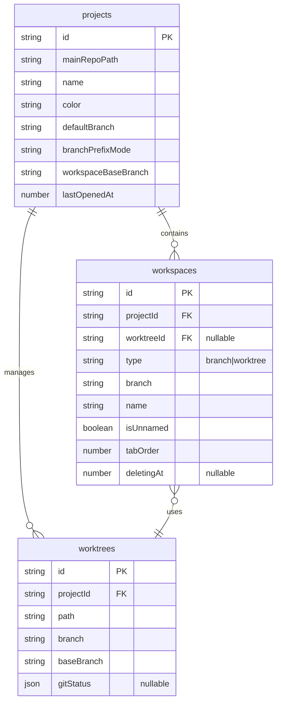
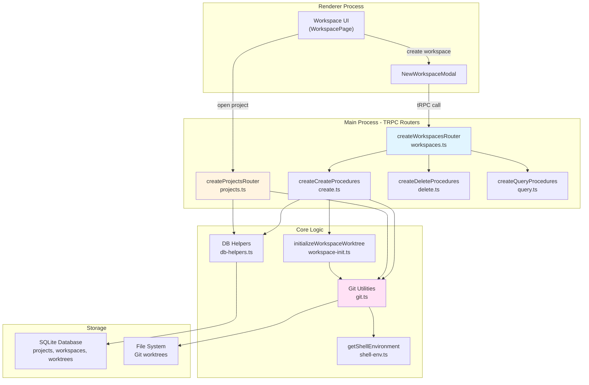
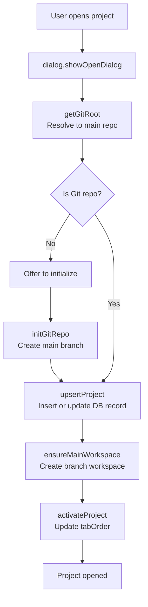
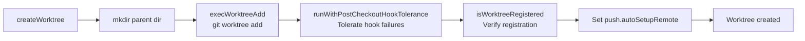
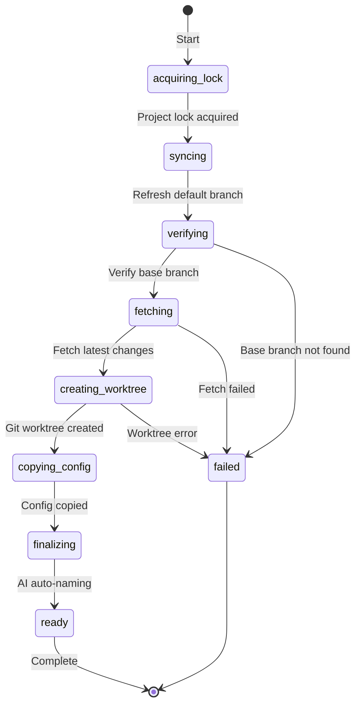

# Workspace System

<details>
<summary>Relevant source files</summary>

The following files were used as context for generating this wiki page:

- [apps/desktop/src/lib/trpc/routers/changes/git-operations.ts](apps/desktop/src/lib/trpc/routers/changes/git-operations.ts)
- [apps/desktop/src/lib/trpc/routers/changes/utils/pull-request-url.ts](apps/desktop/src/lib/trpc/routers/changes/utils/pull-request-url.ts)
- [apps/desktop/src/lib/trpc/routers/projects/projects.ts](apps/desktop/src/lib/trpc/routers/projects/projects.ts)
- [apps/desktop/src/lib/trpc/routers/workspaces/utils/git.test.ts](apps/desktop/src/lib/trpc/routers/workspaces/utils/git.test.ts)
- [apps/desktop/src/lib/trpc/routers/workspaces/utils/git.ts](apps/desktop/src/lib/trpc/routers/workspaces/utils/git.ts)
- [apps/desktop/src/lib/trpc/routers/workspaces/utils/github/github.test.ts](apps/desktop/src/lib/trpc/routers/workspaces/utils/github/github.test.ts)
- [apps/desktop/src/lib/trpc/routers/workspaces/utils/github/github.ts](apps/desktop/src/lib/trpc/routers/workspaces/utils/github/github.ts)
- [apps/desktop/src/lib/trpc/routers/workspaces/utils/github/types.ts](apps/desktop/src/lib/trpc/routers/workspaces/utils/github/types.ts)
- [apps/desktop/src/lib/trpc/routers/workspaces/utils/upstream-ref.test.ts](apps/desktop/src/lib/trpc/routers/workspaces/utils/upstream-ref.test.ts)
- [apps/desktop/src/lib/trpc/routers/workspaces/utils/upstream-ref.ts](apps/desktop/src/lib/trpc/routers/workspaces/utils/upstream-ref.ts)
- [apps/desktop/src/renderer/components/NewWorkspaceModal/NewWorkspaceModal.tsx](apps/desktop/src/renderer/components/NewWorkspaceModal/NewWorkspaceModal.tsx)
- [apps/desktop/src/renderer/components/NewWorkspaceModal/NewWorkspaceModalDraftContext.tsx](apps/desktop/src/renderer/components/NewWorkspaceModal/NewWorkspaceModalDraftContext.tsx)
- [apps/desktop/src/renderer/components/NewWorkspaceModal/components/NewWorkspaceModalContent/NewWorkspaceModalContent.tsx](apps/desktop/src/renderer/components/NewWorkspaceModal/components/NewWorkspaceModalContent/NewWorkspaceModalContent.tsx)
- [apps/desktop/src/renderer/components/NewWorkspaceModal/components/NewWorkspaceModalContent/index.ts](apps/desktop/src/renderer/components/NewWorkspaceModal/components/NewWorkspaceModalContent/index.ts)
- [apps/desktop/src/renderer/components/NewWorkspaceModal/components/PromptGroup/PromptGroup.tsx](apps/desktop/src/renderer/components/NewWorkspaceModal/components/PromptGroup/PromptGroup.tsx)
- [apps/desktop/src/renderer/components/NewWorkspaceModal/components/PromptGroup/components/PRLinkCommand/PRLinkCommand.tsx](apps/desktop/src/renderer/components/NewWorkspaceModal/components/PromptGroup/components/PRLinkCommand/PRLinkCommand.tsx)
- [apps/desktop/src/renderer/components/NewWorkspaceModal/components/PromptGroup/components/PromptGroupAdvancedOptions/PromptGroupAdvancedOptions.tsx](apps/desktop/src/renderer/components/NewWorkspaceModal/components/PromptGroup/components/PromptGroupAdvancedOptions/PromptGroupAdvancedOptions.tsx)
- [apps/desktop/src/renderer/components/NewWorkspaceModal/components/PromptGroup/components/PromptGroupAdvancedOptions/index.ts](apps/desktop/src/renderer/components/NewWorkspaceModal/components/PromptGroup/components/PromptGroupAdvancedOptions/index.ts)
- [apps/desktop/src/renderer/react-query/workspaces/useOpenTrackedWorktree.ts](apps/desktop/src/renderer/react-query/workspaces/useOpenTrackedWorktree.ts)
- [apps/desktop/src/renderer/screens/main/components/PRIcon/PRIcon.tsx](apps/desktop/src/renderer/screens/main/components/PRIcon/PRIcon.tsx)
- [apps/desktop/src/renderer/screens/main/components/PRIcon/index.ts](apps/desktop/src/renderer/screens/main/components/PRIcon/index.ts)
- [apps/desktop/src/renderer/screens/main/components/WorkspaceSidebar/WorkspaceListItem/components/WorkspaceHoverCard/WorkspaceHoverCard.tsx](apps/desktop/src/renderer/screens/main/components/WorkspaceSidebar/WorkspaceListItem/components/WorkspaceHoverCard/WorkspaceHoverCard.tsx)
- [apps/desktop/src/renderer/screens/main/components/WorkspaceSidebar/WorkspaceListItem/components/WorkspaceHoverCard/components/ReviewStatus/ReviewStatus.tsx](apps/desktop/src/renderer/screens/main/components/WorkspaceSidebar/WorkspaceListItem/components/WorkspaceHoverCard/components/ReviewStatus/ReviewStatus.tsx)
- [apps/desktop/src/renderer/screens/main/hooks/usePRStatus/index.ts](apps/desktop/src/renderer/screens/main/hooks/usePRStatus/index.ts)
- [apps/desktop/src/renderer/screens/main/hooks/usePRStatus/usePRStatus.ts](apps/desktop/src/renderer/screens/main/hooks/usePRStatus/usePRStatus.ts)
- [apps/desktop/src/renderer/stores/new-workspace-modal.ts](apps/desktop/src/renderer/stores/new-workspace-modal.ts)
- [packages/host-service/src/git/createGitFactory/createGitFactory.ts](packages/host-service/src/git/createGitFactory/createGitFactory.ts)
- [scripts/check-desktop-git-env.sh](scripts/check-desktop-git-env.sh)

</details>


## Purpose and Scope

The Workspace System manages projects and workspaces within the Superset desktop application. A **project** represents a Git repository, while a **workspace** is an isolated work context within that project—either the main branch or a separate Git worktree. This system enables users to work on multiple branches simultaneously without switching contexts, leveraging Git worktrees to maintain separate working directories.

For information about workspace initialization progress tracking, see [2.6.3](#2.6.3). For Git operations and safety mechanisms, see [2.6.4](#2.6.4). For UI components related to workspace creation, see [2.12](#2.12).

---

## Core Concepts

### Projects

A **project** is a Git repository tracked in the local SQLite database. Projects store metadata including:
- Repository path (`mainRepoPath`)
- Display name and color
- Default branch
- Branch prefix configuration
- Base worktree directory
- Last opened timestamp

Projects are managed through the `createProjectsRouter` in [apps/desktop/src/lib/trpc/routers/projects/projects.ts:259-1258]().

### Workspaces

A **workspace** represents an active work context within a project. Each workspace has:
- A unique ID
- A reference to its parent project
- A workspace type: `"branch"` or `"worktree"`
- A branch name
- A display name
- Tab ordering metadata
- Optional worktree reference (for `"worktree"` type)

### Worktrees

A **worktree** is a Git worktree—a separate working directory that checks out a different branch. Worktrees are tracked with:
- Path on disk
- Branch name
- Base branch (for rebase/merge operations)
- Git status cache
- Reference to parent project

**Sources:** [apps/desktop/src/lib/trpc/routers/projects/projects.ts:1-1258](), [apps/desktop/src/lib/trpc/routers/workspaces/procedures/create.ts:1-1014]()

---

## Data Model

The workspace system uses three primary tables in the local SQLite database:

| Table | Purpose | Key Fields |
|-------|---------|------------|
| `projects` | Git repositories | `id`, `mainRepoPath`, `name`, `color`, `defaultBranch`, `branchPrefixMode` |
| `workspaces` | Work contexts | `id`, `projectId`, `worktreeId`, `type`, `branch`, `name`, `tabOrder` |
| `worktrees` | Git worktrees | `id`, `projectId`, `path`, `branch`, `baseBranch`, `gitStatus` |



**Relationship Rules:**
- A **branch workspace** has `type="branch"` and `worktreeId=null`, working directly in `mainRepoPath`
- A **worktree workspace** has `type="worktree"` and references a `worktrees` entry
- Each project can have at most one branch workspace (enforced by unique partial index)
- Multiple worktree workspaces can exist per project
- Orphaned worktrees (no active workspace) can be reopened

**Sources:** [apps/desktop/src/lib/trpc/routers/projects/projects.ts:99-128](), [apps/desktop/src/lib/trpc/routers/workspaces/procedures/create.ts:43-74]()

---

## Architecture Overview



**Sources:** [apps/desktop/src/lib/trpc/routers/workspaces/workspaces.ts:1-23](), [apps/desktop/src/lib/trpc/routers/projects/projects.ts:259-315]()

---

## Workspace Types

### Branch Workspace

A branch workspace works directly in the project's main repository directory (`mainRepoPath`). Each project can have exactly one branch workspace.

**Creation:** Automatically created when opening a project for the first time via `ensureMainWorkspace` [apps/desktop/src/lib/trpc/routers/projects/projects.ts:131-209]().

**Properties:**
- `type: "branch"`
- `worktreeId: null`
- `branch`: Current branch in main repo
- Uses `tabOrder: 0` (leftmost position)

**Use Case:** Primary workspace for the default branch, or when working directly on the main repository.

### Worktree Workspace

A worktree workspace uses a Git worktree—a separate directory that checks out a different branch. This enables parallel development on multiple branches without switching.

**Creation:** Created via `create` mutation with optional branch name, prompt, or base branch [apps/desktop/src/lib/trpc/routers/workspaces/procedures/create.ts:288-529]().

**Properties:**
- `type: "worktree"`
- `worktreeId`: References `worktrees` table entry
- `branch`: Branch checked out in worktree
- `name`: User-defined or auto-generated from prompt

**Worktree Path Resolution:**
The system resolves worktree paths using `resolveWorktreePath`, which:
1. Uses `project.worktreeBaseDir` if configured
2. Falls back to `.superset/worktrees/` in project directory
3. Creates subdirectories based on sanitized branch names

**Sources:** [apps/desktop/src/lib/trpc/routers/projects/projects.ts:131-209](), [apps/desktop/src/lib/trpc/routers/workspaces/procedures/create.ts:288-529]()

---

## Project Lifecycle

### Opening a Project



**Key Functions:**

| Function | Location | Purpose |
|----------|----------|---------|
| `getGitRoot` | [git.ts:706-718]() | Resolves folder to Git repository root |
| `initGitRepo` | [projects.ts:67-97]() | Initializes empty Git repository with main branch |
| `upsertProject` | [projects.ts:99-129]() | Creates or updates project record |
| `ensureMainWorkspace` | [projects.ts:131-209]() | Creates branch workspace if missing |
| `activateProject` | [db-helpers.ts]() | Assigns `tabOrder` for project strip |

**Sources:** [apps/desktop/src/lib/trpc/routers/projects/projects.ts:654-705](), [apps/desktop/src/lib/trpc/routers/workspaces/utils/git.ts:706-718]()

### Cloning a Repository

The `cloneRepo` procedure handles Git clone operations:

1. **URL Validation:** Uses `extractRepoName` [apps/desktop/src/lib/trpc/routers/projects/projects.ts:216-257]() to parse repository name from URL
2. **Destination Selection:** Shows directory picker if not provided
3. **Duplicate Check:** Verifies no existing project uses the target path
4. **Clone Operation:** Executes `git.clone()` via `simpleGit`
5. **Project Creation:** Calls `upsertProject` and `ensureMainWorkspace`

**Supported URL Formats:**
- HTTPS: `https://github.com/owner/repo.git`
- SSH: `git@github.com:owner/repo.git`
- Protocol-less: `github.com/owner/repo`

**Sources:** [apps/desktop/src/lib/trpc/routers/projects/projects.ts:777-931]()

---

## Worktree Operations

### Creating Worktrees

The `createWorktree` function [apps/desktop/src/lib/trpc/routers/workspaces/utils/git.ts:458-521]() executes `git worktree add` with safety measures:



**Hook Tolerance:** Post-checkout hooks may fail after worktree creation (e.g., npm install errors). The function checks if the worktree was successfully registered using `git worktree list --porcelain` before propagating errors [apps/desktop/src/lib/trpc/routers/workspaces/utils/git.ts:79-103]().

**Configuration:** Sets `push.autoSetupRemote=true` so the first `git push` automatically creates the remote tracking branch [apps/desktop/src/lib/trpc/routers/workspaces/utils/git.ts:486-493]().

**Sources:** [apps/desktop/src/lib/trpc/routers/workspaces/utils/git.ts:458-521]()

### Creating from Existing Branch

`createWorktreeFromExistingBranch` [apps/desktop/src/lib/trpc/routers/workspaces/utils/git.ts:527-622]() checks out an existing branch:

1. **Branch Resolution:** Checks if branch exists locally
2. **Local Branch:** Uses `git worktree add <path> <branch>`
3. **Remote Branch:** Uses `git worktree add --track -b <branch> <path> origin/<branch>`
4. **Conflict Detection:** Throws error if branch is already checked out elsewhere

**Sources:** [apps/desktop/src/lib/trpc/routers/workspaces/utils/git.ts:527-622]()

### Removing Worktrees

`removeWorktree` [apps/desktop/src/lib/trpc/routers/workspaces/utils/git.ts:649-704]() deletes worktrees efficiently:

1. **Rename:** Moves worktree to temporary sibling directory (avoids cross-device errors)
2. **Prune:** Runs `git worktree prune` to clean Git metadata
3. **Background Delete:** Spawns detached `rm -rf` process (non-blocking)
4. **Unref:** Unreferences child process so it doesn't keep app alive

This approach prevents blocking the main thread on large directories and avoids macOS issues with `.app` bundles.

**Sources:** [apps/desktop/src/lib/trpc/routers/workspaces/utils/git.ts:649-704]()

### External Worktree Import

`listExternalWorktrees` [apps/desktop/src/lib/trpc/routers/workspaces/utils/git.ts:744-788]() discovers worktrees not tracked by Superset:

1. Parses `git worktree list --porcelain` output
2. Returns worktree path, branch, detached state, and bare flag
3. UI displays external worktrees with "Import" option

`openExternalWorktree` procedure [apps/desktop/src/lib/trpc/routers/workspaces/procedures/create.ts:724-912]() imports them:
- Verifies worktree still exists on disk
- Creates `worktrees` and `workspaces` records
- Copies `.superset/` configuration
- Resolves base branch using `resolveWorkspaceBaseBranch`

**Sources:** [apps/desktop/src/lib/trpc/routers/workspaces/utils/git.ts:744-788](), [apps/desktop/src/lib/trpc/routers/workspaces/procedures/create.ts:724-912]()

---

## Workspace Creation Flows

The `create` procedure [apps/desktop/src/lib/trpc/routers/workspaces/procedures/create.ts:288-529]() supports multiple creation methods:

### Method 1: New Branch with Prompt

**Input:** `{ projectId, prompt, applyPrefix }`

**Flow:**
1. Generate branch name using `generateBranchName` [apps/desktop/src/lib/trpc/routers/workspaces/utils/git.ts:412-456]()
2. Apply author prefix if enabled (e.g., `username/clever-giraffe`)
3. Resolve base branch using `resolveWorkspaceBaseBranch`
4. Create worktree record and workspace record
5. Start `initializeWorkspaceWorktree` background job
6. Attempt AI-based auto-naming from prompt

### Method 2: Existing Branch

**Input:** `{ projectId, branchName, useExistingBranch: true }`

**Flow:**
1. Validate branch exists using `listBranches` [apps/desktop/src/lib/trpc/routers/workspaces/utils/git.ts:1244-1268]()
2. Check if branch is already checked out elsewhere
3. Create worktree using `createWorktreeFromExistingBranch`
4. Skip branch creation step in initialization

### Method 3: Custom Branch Name

**Input:** `{ projectId, branchName, baseBranch? }`

**Flow:**
1. Sanitize branch name using `sanitizeBranchNameWithMaxLength`
2. Check for existing workspace with same branch
3. Reuse orphaned worktree if found
4. Otherwise create new worktree

### Method 4: Pull Request

**Input:** `{ projectId, prUrl }`

Handled by separate `createFromPr` procedure [apps/desktop/src/lib/trpc/routers/workspaces/procedures/create.ts:914-1014]():

1. Parse PR URL using `parsePrUrl` [apps/desktop/src/lib/trpc/routers/workspaces/utils/git.ts:1572-1588]()
2. Fetch PR info using `getPrInfo` [apps/desktop/src/lib/trpc/routers/workspaces/utils/git.ts:1617-1710]() (requires `gh` CLI)
3. Determine local branch name via `getPrLocalBranchName`
4. Create worktree from PR using `createWorktreeFromPr` [apps/desktop/src/lib/trpc/routers/workspaces/utils/git.ts:1712-1750]()
5. Set workspace name to PR title

**Sources:** [apps/desktop/src/lib/trpc/routers/workspaces/procedures/create.ts:288-529](), [apps/desktop/src/lib/trpc/routers/workspaces/procedures/create.ts:914-1014]()

---

## Workspace Initialization

Workspace creation returns immediately, but initialization runs asynchronously to avoid blocking the UI. The `initializeWorkspaceWorktree` function [apps/desktop/src/lib/trpc/routers/workspaces/utils/workspace-init.ts:43-512]() handles this background work.

### Initialization Steps



| Step | Description | Progress Label |
|------|-------------|----------------|
| `acquiring_lock` | Waits for project-level lock (prevents parallel operations) | "Initializing..." |
| `syncing` | Calls `refreshDefaultBranch` to detect remote branch changes | "Syncing with remote..." |
| `verifying` | Validates base branch exists or resolves fallback | "Verifying base branch..." |
| `fetching` | Runs `fetchDefaultBranch` to get latest commits | "Fetching latest changes..." |
| `creating_worktree` | Executes `createWorktree` or `createWorktreeFromExistingBranch` | "Creating git worktree..." |
| `copying_config` | Copies `.superset/` directory using `copySupersetConfigToWorktree` | "Copying configuration..." |
| `finalizing` | Updates `worktrees.gitStatus` field | "Finalizing setup..." |
| `ready` | Attempts AI auto-naming from prompt | "Ready" |

### Base Branch Resolution

The initialization prioritizes base branch sources in this order:

1. **Git config:** `branch.<name>.supersetBase` (explicit user override)
2. **Explicit parameter:** `baseBranch` argument passed to `create`
3. **Project setting:** `project.workspaceBaseBranch`
4. **Project default:** `project.defaultBranch`
5. **Fallback:** `"main"`

If the chosen base branch doesn't exist, the system attempts fallback to `["main", "master", "develop", "trunk"]` unless the base was explicitly set [apps/desktop/src/lib/trpc/routers/workspaces/utils/workspace-init.ts:206-260]().

### Cancellation Handling

Workspace deletion during initialization triggers cancellation:
- Checks `manager.isCancellationRequested(workspaceId)` at each step
- Cleans up partial worktrees if creation succeeded
- Does NOT emit "failed" event to avoid UI race condition
- Still calls `manager.finalizeJob()` to unblock `waitForInit()` callers

**Sources:** [apps/desktop/src/lib/trpc/routers/workspaces/utils/workspace-init.ts:43-512]()

---

## Git Status and Safety

### Status Parsing

`getStatusNoLock` [apps/desktop/src/lib/trpc/routers/workspaces/utils/git.ts:133-173]() retrieves Git status without holding repository locks:

```
git --no-optional-locks -C <repo> status --porcelain=v1 -b -z -uall
```

Flags:
- `--no-optional-locks`: Prevents blocking other Git operations
- `--porcelain=v1`: Machine-readable format
- `-b`: Include branch info
- `-z`: NUL-separated entries (handles filenames with special chars)
- `-uall`: Show individual untracked files

The function parses output into `StatusResult` format compatible with `simple-git` [apps/desktop/src/lib/trpc/routers/workspaces/utils/git.ts:180-309]().

### Safety Checks

Git operations use several safety mechanisms:

**Branch Checkout Safety:**
`safeCheckoutBranch` verifies no uncommitted changes before switching branches [apps/desktop/src/lib/trpc/routers/workspaces/utils/git.ts:1486-1512]().

**Worktree Uniqueness:**
`getBranchWorktreePath` [apps/desktop/src/lib/trpc/routers/workspaces/utils/git.ts:796-830]() checks if a branch is already checked out, preventing conflicts.

**Hook Tolerance:**
`runWithPostCheckoutHookTolerance` [apps/desktop/src/lib/trpc/routers/utils/git-hook-tolerance.ts]() allows worktree creation to succeed even if hooks fail, provided the worktree was registered.

**Lock Detection:**
Operations detect `.lock` file errors and provide helpful messages [apps/desktop/src/lib/trpc/routers/workspaces/utils/git.ts:501-516]().

**Sources:** [apps/desktop/src/lib/trpc/routers/workspaces/utils/git.ts:133-173](), [apps/desktop/src/lib/trpc/routers/workspaces/utils/git.ts:1486-1512]()

---

## Shell Environment Resolution

Git commands require proper PATH resolution to find tools like `git`, `gh`, and `node`. The `shell-env` module [apps/desktop/src/lib/trpc/routers/workspaces/utils/shell-env.ts:1-263]() handles this.

### Problem: macOS GUI App PATH

When launched from Finder/Dock, macOS apps receive a minimal PATH (`/usr/bin:/bin:/usr/sbin:/sbin`) that excludes:
- Homebrew binaries (`/opt/homebrew/bin`)
- User-installed tools (`/usr/local/bin`)
- Version managers (nvm, volta, fnm configured in `.zshrc`)

### Solution: Interactive Shell Sourcing

`getShellEnvironment` [apps/desktop/src/lib/trpc/routers/workspaces/utils/shell-env.ts:60-95]() spawns an **interactive login shell** (`-ilc`) to capture the full environment:

| Flag | Purpose |
|------|---------|
| `-i` | Interactive mode → sources `.zshrc`/`.bashrc` |
| `-l` | Login mode → sources `.zprofile`/`.profile` |
| `-c` | Command mode → runs `printenv` and exits |

**Caching:** Results are cached for 1 minute to avoid repeated shell spawns. Fallback cache (10 seconds) used if shell fails.

### Usage Patterns

| Function | Use Case |
|----------|----------|
| `getProcessEnvWithShellPath` | Merge shell PATH with process env |
| `getProcessEnvWithShellEnv` | Merge all shell variables (preserves existing) |
| `execWithShellEnv` | Execute command with auto-retry on ENOENT |
| `applyShellEnvToProcess` | Enrich `process.env` for child processes |

**Lazy PATH Fix:** `execWithShellEnv` [apps/desktop/src/lib/trpc/routers/workspaces/utils/shell-env.ts:179-245]() attempts commands with current env first, only deriving shell env on ENOENT (command not found). On success, persists PATH to `process.env.PATH`.

**Sources:** [apps/desktop/src/lib/trpc/routers/workspaces/utils/shell-env.ts:1-263]()

---

## Branch Naming

### Generation

`generateBranchName` [apps/desktop/src/lib/trpc/routers/workspaces/utils/git.ts:412-456]() creates unique, friendly branch names:

1. **Word Generation:** Selects random predicate + object from `friendly-words` library
2. **Prefix Collision Check:** Skips prefix if it would collide with existing branch
3. **Uniqueness:** Tries 10 random combinations, then falls back to numbered suffixes
4. **Format:** `<prefix>/<predicate>-<object>` (e.g., `alice/brave-turtle`)

### Prefixing

Branch prefixes are configured per-project with inheritance:

| Mode | Description | Source |
|------|-------------|--------|
| `"auto"` | GitHub username → Git username | `getAuthorPrefix` |
| `"author"` | Git `user.name` sanitized | `getGitAuthorName` |
| `"custom"` | User-specified string | `project.branchPrefixCustom` |
| `"none"` | No prefix | — |

**Resolution Order:**
1. Project-level setting (`project.branchPrefixMode`)
2. Global setting (`settings.branchPrefixMode`)
3. Default: `"none"`

**Sanitization:** `sanitizeAuthorPrefix` [apps/desktop/src/lib/trpc/routers/workspaces/utils/git.ts:10-12]() removes special characters and normalizes whitespace.

**Sources:** [apps/desktop/src/lib/trpc/routers/workspaces/utils/git.ts:364-410](), [apps/desktop/src/lib/trpc/routers/workspaces/utils/git.ts:412-456]()

---

## Database Helpers

The `db-helpers` module provides common query patterns:

| Function | Purpose | Returns |
|----------|---------|---------|
| `getProject(id)` | Fetch project by ID | `SelectProject \| undefined` |
| `getWorktree(id)` | Fetch worktree by ID | `SelectWorktree \| undefined` |
| `getBranchWorkspace(projectId)` | Get project's branch workspace | `SelectWorkspace \| undefined` |
| `findWorktreeWorkspaceByBranch` | Find workspace+worktree by branch | `{ workspace, worktree } \| null` |
| `findOrphanedWorktreeByBranch` | Find worktree without workspace | `SelectWorktree \| undefined` |
| `activateProject(project)` | Add to project strip | Updates `tabOrder` |
| `setLastActiveWorkspace(id)` | Persist last active workspace | Updates settings |
| `touchWorkspace(id)` | Update `lastOpenedAt` | Updates timestamp |

**Orphaned Worktrees:** A worktree without an active workspace (e.g., workspace was deleted). These can be reopened via `openWorktree` procedure or reused when creating a workspace for the same branch.

**Sources:** Referenced in [apps/desktop/src/lib/trpc/routers/workspaces/procedures/create.ts]() throughout

---

## Configuration and Setup

### Superset Config Directory

Each project has a `.superset/` directory containing:
- `config.json`: Workspace-specific settings
- `setup.sh` / `teardown.sh`: Lifecycle scripts

**Copying:** `copySupersetConfigToWorktree` [referenced in apps/desktop/src/lib/trpc/routers/workspaces/utils/workspace-init.ts:442]() copies config from main repo to new worktrees.

**Loading:** `loadSetupConfig` [referenced in apps/desktop/src/lib/trpc/routers/workspaces/procedures/create.ts:148-153]() reads config and returns setup commands for initial terminal.

### Base Branch Config

Git config stores workspace base branches:

```
git config branch.<branchName>.supersetBase <baseBranch>
```

**Setting:** `setBranchBaseConfig` [referenced in apps/desktop/src/lib/trpc/routers/workspaces/procedures/create.ts:496-501]() writes config.

**Reading:** `getBranchBaseConfig` [referenced in apps/desktop/src/lib/trpc/routers/workspaces/utils/workspace-init.ts:94-98]() reads config with `isExplicit` flag.

**Purpose:** Persists user's base branch choice across restarts. Explicit bases are never overridden by fallback logic.

**Sources:** [apps/desktop/src/lib/trpc/routers/workspaces/procedures/create.ts:496-501]()