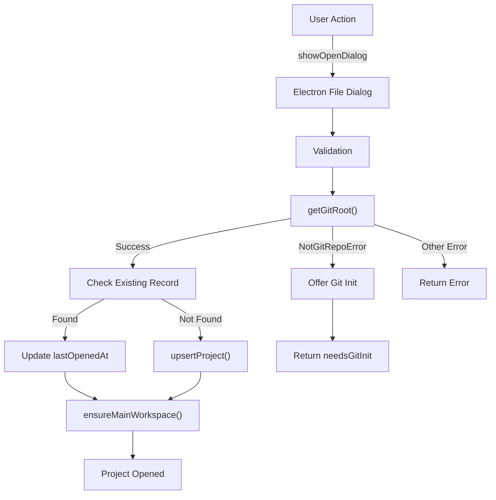
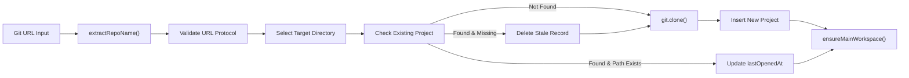

# Projects and Git Repositories

<details>
<summary>Relevant source files</summary>

The following files were used as context for generating this wiki page:

- [apps/desktop/src/lib/trpc/routers/projects/projects.ts](apps/desktop/src/lib/trpc/routers/projects/projects.ts)
- [apps/desktop/src/lib/trpc/routers/projects/utils/favicon-discovery.ts](apps/desktop/src/lib/trpc/routers/projects/utils/favicon-discovery.ts)
- [apps/desktop/src/lib/trpc/routers/settings/index.ts](apps/desktop/src/lib/trpc/routers/settings/index.ts)
- [apps/desktop/src/main/lib/project-icons.ts](apps/desktop/src/main/lib/project-icons.ts)
- [apps/desktop/src/renderer/components/NewWorkspaceModal/NewWorkspaceModal.tsx](apps/desktop/src/renderer/components/NewWorkspaceModal/NewWorkspaceModal.tsx)
- [apps/desktop/src/renderer/components/NewWorkspaceModal/NewWorkspaceModalDraftContext.tsx](apps/desktop/src/renderer/components/NewWorkspaceModal/NewWorkspaceModalDraftContext.tsx)
- [apps/desktop/src/renderer/components/NewWorkspaceModal/components/NewWorkspaceModalContent/NewWorkspaceModalContent.tsx](apps/desktop/src/renderer/components/NewWorkspaceModal/components/NewWorkspaceModalContent/NewWorkspaceModalContent.tsx)
- [apps/desktop/src/renderer/components/NewWorkspaceModal/components/NewWorkspaceModalContent/index.ts](apps/desktop/src/renderer/components/NewWorkspaceModal/components/NewWorkspaceModalContent/index.ts)
- [apps/desktop/src/renderer/components/NewWorkspaceModal/components/PromptGroup/PromptGroup.tsx](apps/desktop/src/renderer/components/NewWorkspaceModal/components/PromptGroup/PromptGroup.tsx)
- [apps/desktop/src/renderer/components/NewWorkspaceModal/components/PromptGroup/components/PRLinkCommand/PRLinkCommand.tsx](apps/desktop/src/renderer/components/NewWorkspaceModal/components/PromptGroup/components/PRLinkCommand/PRLinkCommand.tsx)
- [apps/desktop/src/renderer/components/NewWorkspaceModal/components/PromptGroup/components/PromptGroupAdvancedOptions/PromptGroupAdvancedOptions.tsx](apps/desktop/src/renderer/components/NewWorkspaceModal/components/PromptGroup/components/PromptGroupAdvancedOptions/PromptGroupAdvancedOptions.tsx)
- [apps/desktop/src/renderer/components/NewWorkspaceModal/components/PromptGroup/components/PromptGroupAdvancedOptions/index.ts](apps/desktop/src/renderer/components/NewWorkspaceModal/components/PromptGroup/components/PromptGroupAdvancedOptions/index.ts)
- [apps/desktop/src/renderer/react-query/workspaces/useOpenTrackedWorktree.ts](apps/desktop/src/renderer/react-query/workspaces/useOpenTrackedWorktree.ts)
- [apps/desktop/src/renderer/routes/_authenticated/settings/behavior/components/BehaviorSettings/BehaviorSettings.tsx](apps/desktop/src/renderer/routes/_authenticated/settings/behavior/components/BehaviorSettings/BehaviorSettings.tsx)
- [apps/desktop/src/renderer/routes/_authenticated/settings/project/$projectId/components/ProjectSettings/ProjectSettings.tsx](apps/desktop/src/renderer/routes/_authenticated/settings/project/$projectId/components/ProjectSettings/ProjectSettings.tsx)
- [apps/desktop/src/renderer/routes/_authenticated/settings/project/$projectId/general/page.tsx](apps/desktop/src/renderer/routes/_authenticated/settings/project/$projectId/general/page.tsx)
- [apps/desktop/src/renderer/routes/_authenticated/settings/utils/settings-search/settings-search.ts](apps/desktop/src/renderer/routes/_authenticated/settings/utils/settings-search/settings-search.ts)
- [apps/desktop/src/renderer/stores/new-workspace-modal.ts](apps/desktop/src/renderer/stores/new-workspace-modal.ts)
- [apps/desktop/src/shared/constants.ts](apps/desktop/src/shared/constants.ts)
- [packages/local-db/drizzle/meta/_journal.json](packages/local-db/drizzle/meta/_journal.json)
- [packages/local-db/src/schema/schema.ts](packages/local-db/src/schema/schema.ts)

</details>


This document covers the project model, which represents Git repositories that users have opened in Superset. It explains how projects are stored, created, opened, and configured, including metadata like icons, colors, and project-specific settings.

For information about Git worktree management within projects, see [Git Worktree Management](#2.6.2). For workspace creation flows, see [Workspace Creation Flow](#2.6.3). For Git operations and safety checks, see [Git Operations and Safety](#2.6.4).

## Project Data Model

Projects are the top-level organizational unit in Superset. Each project represents a Git repository on disk and serves as a container for workspaces.

### Database Schema

The `projects` table stores project records in the local SQLite database:

| Column | Type | Description |
|--------|------|-------------|
| `id` | text | UUID primary key |
| `mainRepoPath` | text | Absolute path to the Git repository root |
| `name` | text | Display name (defaults to directory basename) |
| `color` | text | Color identifier for UI theming |
| `tabOrder` | integer | Position in the project bar (null if not pinned) |
| `lastOpenedAt` | integer | Unix timestamp of last access |
| `defaultBranch` | text | Repository's default branch (e.g., "main") |
| `githubOwner` | text | GitHub organization/user name |
| `branchPrefixMode` | text | Per-project branch prefix override |
| `branchPrefixCustom` | text | Custom prefix string when mode is "custom" |
| `workspaceBaseBranch` | text | Default base branch for new workspaces |
| `worktreeBaseDir` | text | Per-project worktree storage location override |
| `hideImage` | boolean | Whether to hide the project icon |
| `iconUrl` | text | Protocol URL for custom project icon |
| `neonProjectId` | text | Associated Neon database project ID |
| `defaultApp` | text | Default external editor/terminal for this project |

**Sources:** [packages/local-db/src/schema/schema.ts:20-54]()

### Project Color System

Projects use a predefined set of color values for visual identification. Colors are assigned sequentially when creating projects to ensure variety.

```typescript
function getDefaultProjectColor(): string {
  // Cycles through PROJECT_COLOR_VALUES
  // Returns the next color in sequence based on existing projects
}
```

**Sources:** [apps/desktop/src/lib/trpc/routers/projects/utils/colors.ts](), [shared/constants/project-colors.ts]()

## Opening and Importing Projects

### Opening Existing Repositories

Projects are created by opening directories that contain Git repositories. The system supports opening single or multiple folders simultaneously.

#### Project Opening Flow



**Sources:** [apps/desktop/src/lib/trpc/routers/projects/projects.ts:874-925]()

### Key Operations

#### `openNew` Mutation

Opens one or more project directories via file dialog:

```typescript
openNew: publicProcedure.mutation(async (): Promise<OpenNewMultiResult> => {
  const result = await dialog.showOpenDialog(window, {
    properties: ["openDirectory", "multiSelections"],
  });
  
  for (const selectedPath of result.filePaths) {
    const mainRepoPath = await getGitRoot(selectedPath);
    const project = upsertProject(mainRepoPath, defaultBranch);
    await ensureMainWorkspace(project);
  }
})
```

**Sources:** [apps/desktop/src/lib/trpc/routers/projects/projects.ts:874-925]()

#### `openFromPath` Mutation

Opens a project from a specific path (used for drag-and-drop):

```typescript
openFromPath: publicProcedure
  .input(z.object({ path: z.string() }))
  .mutation(async ({ input }): Promise<OpenNewResult> => {
    // Validates directory exists
    // Calls getGitRoot() to find repository root
    // Returns needsGitInit if not a Git repository
  })
```

**Sources:** [apps/desktop/src/lib/trpc/routers/projects/projects.ts:927-979]()

#### `upsertProject` Function

Inserts or updates a project record:

```typescript
function upsertProject(mainRepoPath: string, defaultBranch: string): Project {
  const existing = localDb
    .select()
    .from(projects)
    .where(eq(projects.mainRepoPath, mainRepoPath))
    .get();
    
  if (existing) {
    // Update lastOpenedAt and defaultBranch
    return updated;
  }
  
  // Insert new project with auto-generated UUID
  return project;
}
```

**Sources:** [apps/desktop/src/lib/trpc/routers/projects/projects.ts:103-134]()

#### `ensureMainWorkspace` Function

Automatically creates the main workspace (type `"branch"`) for the project's current branch:

```typescript
async function ensureMainWorkspace(project: Project): Promise<void> {
  const existingBranchWorkspace = getBranchWorkspace(project.id);
  if (existingBranchWorkspace) {
    touchWorkspace(existingBranchWorkspace.id);
    return;
  }
  
  const branch = await getCurrentBranch(project.mainRepoPath);
  // Creates workspace with type="branch"
  // Unique partial index prevents duplicates: projectId WHERE type='branch'
}
```

**Sources:** [apps/desktop/src/lib/trpc/routers/projects/projects.ts:136-214]()

## Creating New Projects

Users can create new projects from scratch using three methods:

### Clone Repository



**Sources:** [apps/desktop/src/lib/trpc/routers/projects/projects.ts:997-1151]()

#### Clone Implementation

```typescript
cloneRepo: publicProcedure
  .input(z.object({
    url: z.string().refine(/* validates HTTPS or SSH */),
    targetDirectory: z.string().optional()
  }))
  .mutation(async ({ input }) => {
    const repoName = extractRepoName(input.url);
    const clonePath = join(targetDir, repoName);
    
    // Check for existing project at this path
    if (existingProject && existsSync(clonePath)) {
      // Reuse existing project record
      return { project: existingProject };
    }
    
    // Perform clone
    await git.clone(input.url, clonePath);
    
    const project = localDb.insert(projects).values({
      mainRepoPath: clonePath,
      name: basename(clonePath),
      color: getDefaultProjectColor(),
      defaultBranch: await getDefaultBranch(clonePath),
    }).returning().get();
  })
```

**Sources:** [apps/desktop/src/lib/trpc/routers/projects/projects.ts:997-1151]()

#### URL Parsing

The `extractRepoName` function extracts repository names from various Git URL formats:

```typescript
function extractRepoName(urlInput: string): string | null {
  // Supports:
  // - HTTPS: https://github.com/org/repo.git
  // - SSH: git@github.com:org/repo.git
  // - git:// protocol
  
  // Strips .git suffix, query params, fragments
  // Validates against SAFE_REPO_NAME_REGEX
}
```

**Sources:** [apps/desktop/src/lib/trpc/routers/projects/projects.ts:222-264]()

### Initialize Empty Repository

Creates a new directory with `git init`:

```typescript
createEmptyRepo: publicProcedure
  .input(z.object({
    name: z.string().refine(/* validates SAFE_REPO_NAME_REGEX */),
    parentDir: z.string()
  }))
  .mutation(async ({ input }) => {
    const repoPath = join(input.parentDir, input.name);
    await mkdir(repoPath, { recursive: true });
    
    const { defaultBranch } = await initGitRepo(repoPath);
    
    const project = upsertProject(repoPath, defaultBranch);
    await ensureMainWorkspace(project);
  })
```

**Sources:** [apps/desktop/src/lib/trpc/routers/projects/projects.ts:1153-1212]()

#### Git Initialization

```typescript
async function initGitRepo(path: string): Promise<{ defaultBranch: string }> {
  const git = await getSimpleGitWithShellPath(path);
  
  try {
    await git.init(["--initial-branch=main\