# Workspace Creation Flow

<details>
<summary>Relevant source files</summary>

The following files were used as context for generating this wiki page:

- [apps/desktop/src/lib/trpc/routers/projects/projects.ts](apps/desktop/src/lib/trpc/routers/projects/projects.ts)
- [apps/desktop/src/renderer/components/NewWorkspaceModal/NewWorkspaceModal.tsx](apps/desktop/src/renderer/components/NewWorkspaceModal/NewWorkspaceModal.tsx)
- [apps/desktop/src/renderer/components/NewWorkspaceModal/NewWorkspaceModalDraftContext.tsx](apps/desktop/src/renderer/components/NewWorkspaceModal/NewWorkspaceModalDraftContext.tsx)
- [apps/desktop/src/renderer/components/NewWorkspaceModal/components/NewWorkspaceModalContent/NewWorkspaceModalContent.tsx](apps/desktop/src/renderer/components/NewWorkspaceModal/components/NewWorkspaceModalContent/NewWorkspaceModalContent.tsx)
- [apps/desktop/src/renderer/components/NewWorkspaceModal/components/NewWorkspaceModalContent/index.ts](apps/desktop/src/renderer/components/NewWorkspaceModal/components/NewWorkspaceModalContent/index.ts)
- [apps/desktop/src/renderer/components/NewWorkspaceModal/components/PromptGroup/PromptGroup.tsx](apps/desktop/src/renderer/components/NewWorkspaceModal/components/PromptGroup/PromptGroup.tsx)
- [apps/desktop/src/renderer/components/NewWorkspaceModal/components/PromptGroup/components/PRLinkCommand/PRLinkCommand.tsx](apps/desktop/src/renderer/components/NewWorkspaceModal/components/PromptGroup/components/PRLinkCommand/PRLinkCommand.tsx)
- [apps/desktop/src/renderer/components/NewWorkspaceModal/components/PromptGroup/components/PromptGroupAdvancedOptions/PromptGroupAdvancedOptions.tsx](apps/desktop/src/renderer/components/NewWorkspaceModal/components/PromptGroup/components/PromptGroupAdvancedOptions/PromptGroupAdvancedOptions.tsx)
- [apps/desktop/src/renderer/components/NewWorkspaceModal/components/PromptGroup/components/PromptGroupAdvancedOptions/index.ts](apps/desktop/src/renderer/components/NewWorkspaceModal/components/PromptGroup/components/PromptGroupAdvancedOptions/index.ts)
- [apps/desktop/src/renderer/react-query/workspaces/useOpenTrackedWorktree.ts](apps/desktop/src/renderer/react-query/workspaces/useOpenTrackedWorktree.ts)
- [apps/desktop/src/renderer/stores/new-workspace-modal.ts](apps/desktop/src/renderer/stores/new-workspace-modal.ts)

</details>

This page documents the UI flow and state management for creating new workspaces through the `NewWorkspaceModal` component. This covers project selection, branch configuration, prompt input, and the final workspace creation submission process.

For the underlying Git worktree implementation details, see [2.6.2](#2.6.2). For GitHub pull request integration, see [2.6.5](#2.6.5). For workspace runtime management after creation, see the Workspace System overview at [2.6](#2.6).

---

## Architecture Overview

The workspace creation flow is implemented as a modal dialog with multi-layered state management:

**Modal Lifecycle Flow**

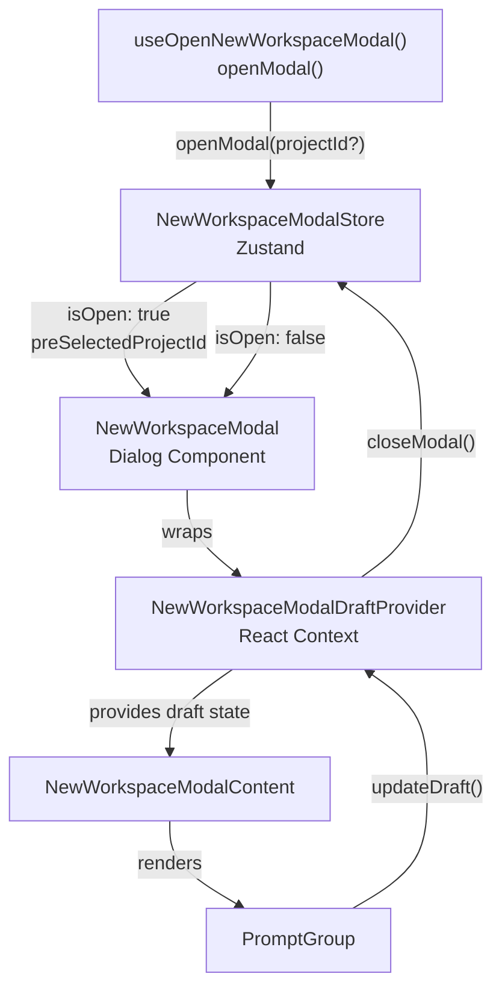

**Sources:**

- [apps/desktop/src/renderer/stores/new-workspace-modal.ts:1-37]()
- [apps/desktop/src/renderer/components/NewWorkspaceModal/NewWorkspaceModal.tsx:1-98]()
- [apps/desktop/src/renderer/components/NewWorkspaceModal/NewWorkspaceModalDraftContext.tsx:1-216]()

---

## State Management

### Zustand Modal Store

The `NewWorkspaceModalStore` manages the modal's open/closed state and optional project pre-selection:

| State Field             | Type             | Purpose                               |
| ----------------------- | ---------------- | ------------------------------------- |
| `isOpen`                | `boolean`        | Controls Dialog visibility            |
| `preSelectedProjectId`  | `string \| null` | Pre-selects project when modal opens  |
| `openModal(projectId?)` | `function`       | Opens modal with optional project     |
| `closeModal()`          | `function`       | Closes modal and clears pre-selection |

**Sources:**

- [apps/desktop/src/renderer/stores/new-workspace-modal.ts:4-27]()

### Draft Context State

The `NewWorkspaceModalDraftProvider` maintains all user input state during workspace creation:

**Draft State Schema**

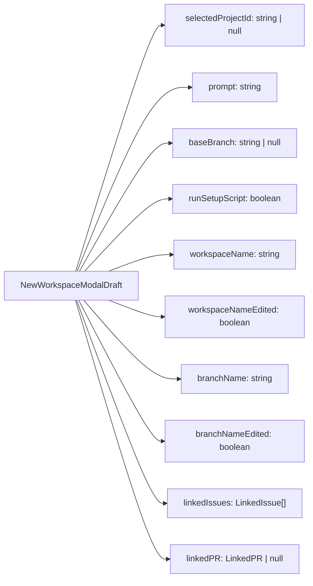

The draft also tracks `draftVersion` (incremented on each update) and `resetKey` (incremented when draft is fully reset) for lifecycle management.

**Sources:**

- [apps/desktop/src/renderer/components/NewWorkspaceModal/NewWorkspaceModalDraftContext.tsx:27-64]()

---

## Component Hierarchy

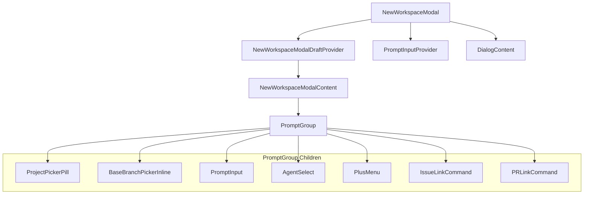

**Sources:**

- [apps/desktop/src/renderer/components/NewWorkspaceModal/NewWorkspaceModal.tsx:45-97]()
- [apps/desktop/src/renderer/components/NewWorkspaceModal/components/NewWorkspaceModalContent/NewWorkspaceModalContent.tsx:13-96]()
- [apps/desktop/src/renderer/components/NewWorkspaceModal/components/PromptGroup/PromptGroup.tsx:107-912]()

---

## Project Selection

### Initial Project Selection Logic

When the modal opens, `NewWorkspaceModalContent` applies the following project selection priority:

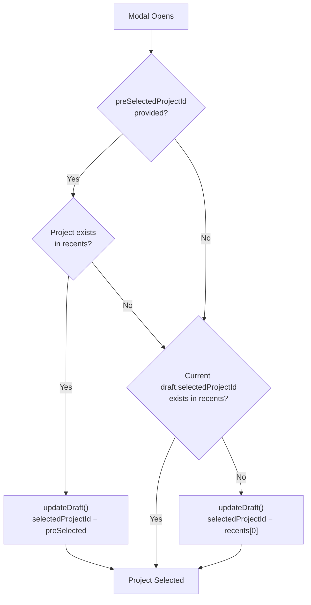

**Sources:**

- [apps/desktop/src/renderer/components/NewWorkspaceModal/components/NewWorkspaceModalContent/NewWorkspaceModalContent.tsx:41-76]()

### ProjectPickerPill Component

The `ProjectPickerPill` displays the selected project with its thumbnail and provides a dropdown to switch projects:

| Feature   | Implementation                                                                        |
| --------- | ------------------------------------------------------------------------------------- |
| Display   | `ProjectThumbnail` with name and chevron icon                                         |
| Search    | `CommandInput` filters projects by name                                               |
| Actions   | "Open project" → triggers import flow<br/>"New project" → navigates to `/new-project` |
| Thumbnail | Shows project icon, GitHub avatar, or colored placeholder                             |

**Sources:**

- [apps/desktop/src/renderer/components/NewWorkspaceModal/components/PromptGroup/PromptGroup.tsx:144-240]()

---

## Branch Configuration

### Base Branch Selection

The effective base branch is resolved through a hierarchy:

**Base Branch Resolution Logic**

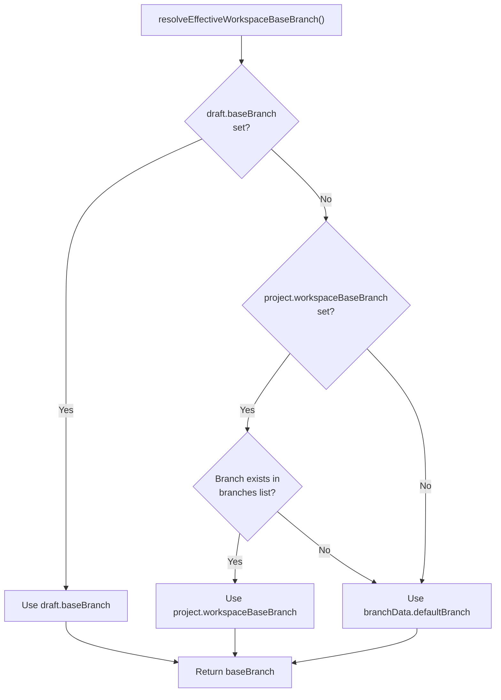

**Sources:**

- [apps/desktop/src/renderer/components/NewWorkspaceModal/components/PromptGroup/PromptGroup.tsx:508-513]()
- [apps/desktop/src/renderer/lib/workspaceBaseBranch.ts]() (referenced)

### BaseBranchPickerInline Component

Displays the current base branch and allows selection from a filterable list:

| Feature      | Details                                              |
| ------------ | ---------------------------------------------------- |
| Display      | Shows branch name with git branch icon               |
| Loading      | Skeleton placeholder while fetching                  |
| Filter Modes | "All" or "Worktrees" (filters to existing worktrees) |
| Search       | Client-side substring filtering (case-insensitive)   |
| Metadata     | Shows last commit date, "default" badge              |
| Sorting      | Default branch first, then by commit date            |

**Sources:**

- [apps/desktop/src/renderer/components/NewWorkspaceModal/components/PromptGroup/PromptGroup.tsx:242-384]()

### Branch Name Generation

Branch names are auto-generated from user input with prefix resolution:

**Branch Name Preview Logic**

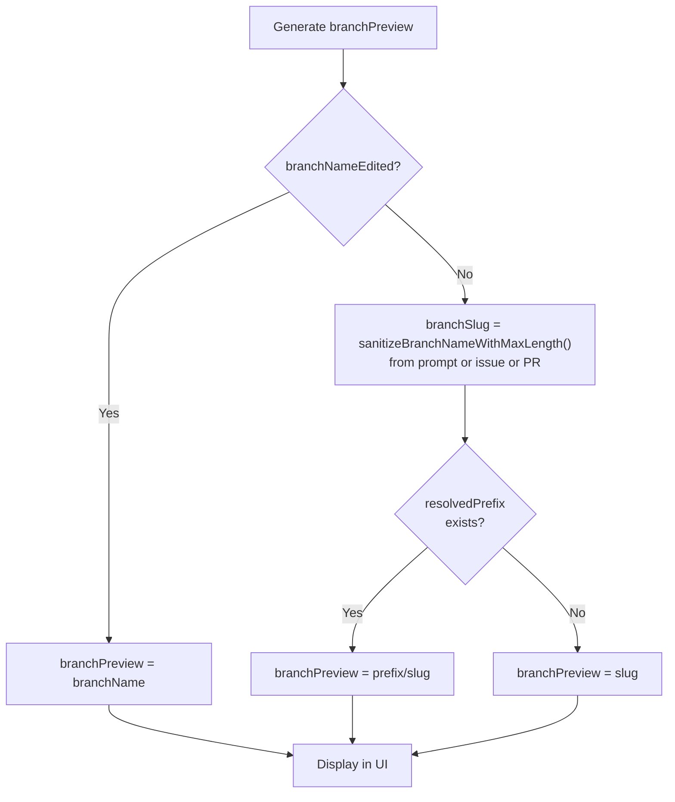

The prefix is resolved through `resolveBranchPrefix()` with the following precedence:

1. Project-specific mode (`project.branchPrefixMode`) if set
2. Global mode (`globalBranchPrefix.mode`) otherwise
3. Modes: `"none"`, `"author"`, `"github"`, `"custom"`

**Sources:**

- [apps/desktop/src/renderer/components/NewWorkspaceModal/components/PromptGroup/PromptGroup.tsx:515-526]()
- [apps/desktop/src/renderer/components/NewWorkspaceModal/components/PromptGroup/PromptGroup.tsx:475-487]()

---

## Prompt Input and Agent Selection

### PromptInput Integration

The modal uses `@superset/ui/ai-elements/prompt-input` components:

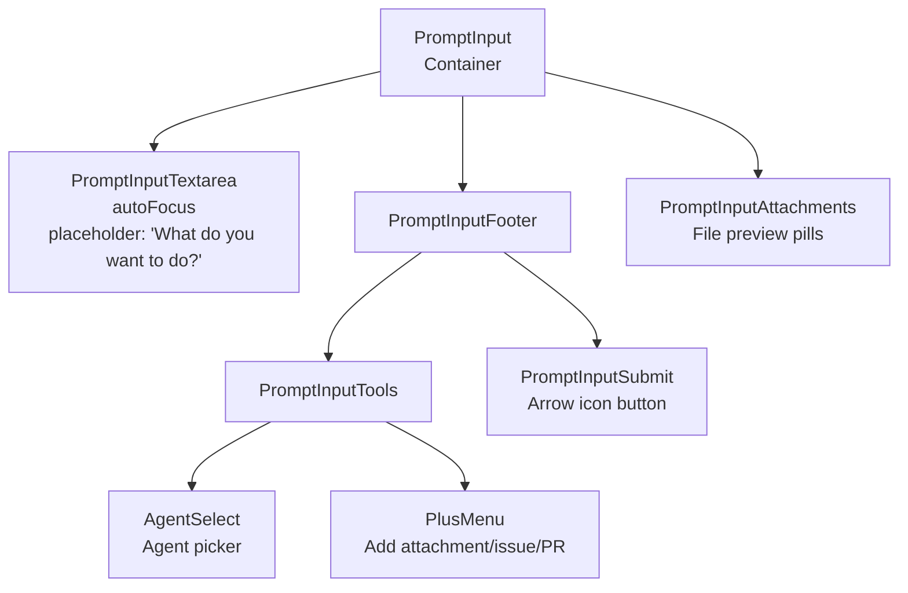

**Key Features:**

| Feature            | Implementation                                                          |
| ------------------ | ----------------------------------------------------------------------- |
| Multi-line input   | `PromptInputTextarea` with auto-resize                                  |
| File attachments   | Max 5 files, 10MB each                                                  |
| Keyboard shortcuts | Cmd/Ctrl+Enter to submit                                                |
| Agent selection    | Persisted to localStorage with key `"lastSelectedWorkspaceCreateAgent"` |
| Linked issues      | Pills displayed above textarea                                          |
| Linked PR          | Replaces base branch UI when set                                        |

**Sources:**

- [apps/desktop/src/renderer/components/NewWorkspaceModal/components/PromptGroup/PromptGroup.tsx:743-860]()
- [apps/desktop/src/renderer/components/NewWorkspaceModal/components/PromptGroup/PromptGroup.tsx:78-87]()

### Agent Selection Persistence

The `useAgentLaunchPreferences` hook manages agent selection:

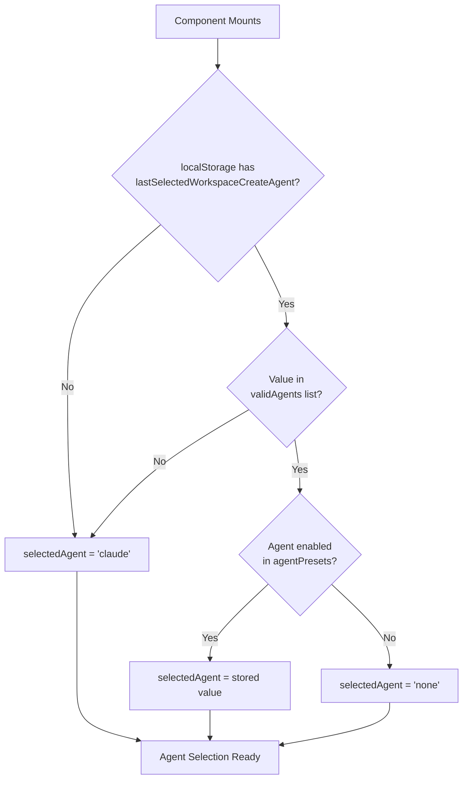

**Sources:**

- [apps/desktop/src/renderer/components/NewWorkspaceModal/components/PromptGroup/PromptGroup.tsx:432-439]()

---

## Linking Issues and Pull Requests

### Issue Linking

The `IssueLinkCommand` component allows searching and linking Linear issues:

- Opens via "+" menu → "Link issue"
- Searches across issue ID and title
- Stores linked issues as `{slug, title}` in draft
- Displayed as dismissible pills above textarea
- First issue slug used for branch name generation

**Sources:**

- [apps/desktop/src/renderer/components/NewWorkspaceModal/components/PromptGroup/PromptGroup.tsx:830-836]()
- [apps/desktop/src/renderer/components/NewWorkspaceModal/components/PromptGroup/PromptGroup.tsx:680-689]()

### PR Linking

The `PRLinkCommand` component fetches open PRs from GitHub:

**PR Linking Flow**

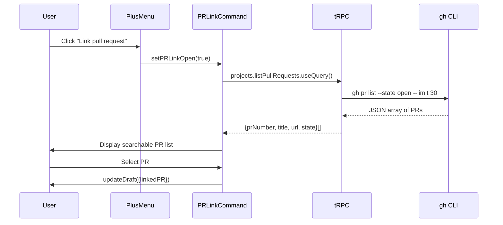

When a PR is linked:

- Replaces base branch UI with "based off PR #123"
- Triggers `createFromPr` mutation instead of `createWorktree`
- Branch name auto-generated as `"pr-{number}"` if no prompt

**Sources:**

- [apps/desktop/src/renderer/components/NewWorkspaceModal/components/PromptGroup/components/PRLinkCommand/PRLinkCommand.tsx:37-160]()
- [apps/desktop/src/renderer/components/NewWorkspaceModal/components/PromptGroup/PromptGroup.tsx:872-904]()
- [apps/desktop/src/lib/trpc/routers/projects/projects.ts:303-361]()

---

## Workspace Creation Submission

### Validation and Preparation

**Pre-Submission Validation**

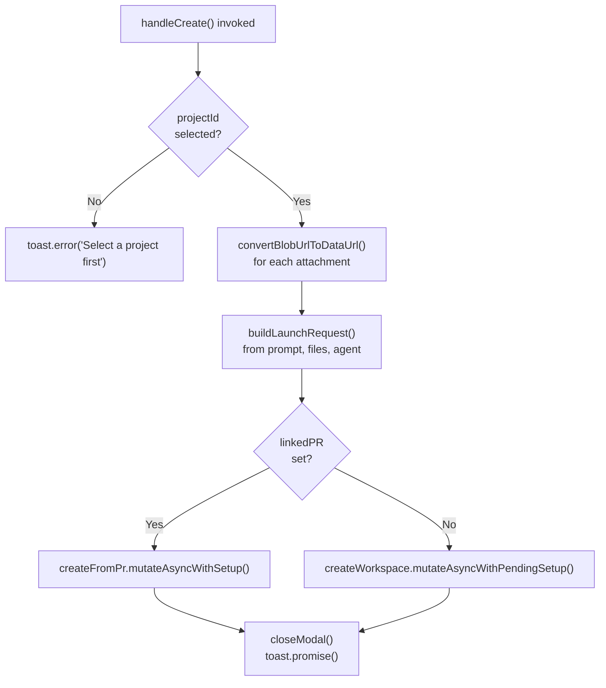

**Sources:**

- [apps/desktop/src/renderer/components/NewWorkspaceModal/components/PromptGroup/PromptGroup.tsx:572-670]()

### File Attachment Conversion

Files are converted from blob URLs to data URLs before submission:

```typescript
// Each attachment becomes:
{
  data: "data:image/png;base64,iVBORw0KGgo...",
  mediaType: "image/png",
  filename: "screenshot.png"
}
```

**Sources:**

- [apps/desktop/src/renderer/components/NewWorkspaceModal/components/PromptGroup/PromptGroup.tsx:553-595]()

### Agent Launch Request Building

The `buildPromptAgentLaunchRequest()` utility constructs the agent launch payload:

| Parameter       | Value                               |
| --------------- | ----------------------------------- |
| `workspaceId`   | `"pending-workspace"` (placeholder) |
| `source`        | `"new-workspace"`                   |
| `selectedAgent` | Current agent selection or `"none"` |
| `prompt`        | Trimmed prompt text                 |
| `initialFiles`  | Converted file attachments          |
| `taskSlug`      | First linked issue slug (if any)    |
| `configsById`   | Indexed agent configurations        |

**Sources:**

- [apps/desktop/src/renderer/components/NewWorkspaceModal/components/PromptGroup/PromptGroup.tsx:538-551]()

### Workspace Creation Mutations

Two mutation paths exist based on whether a PR is linked:

**Standard Workspace Creation**

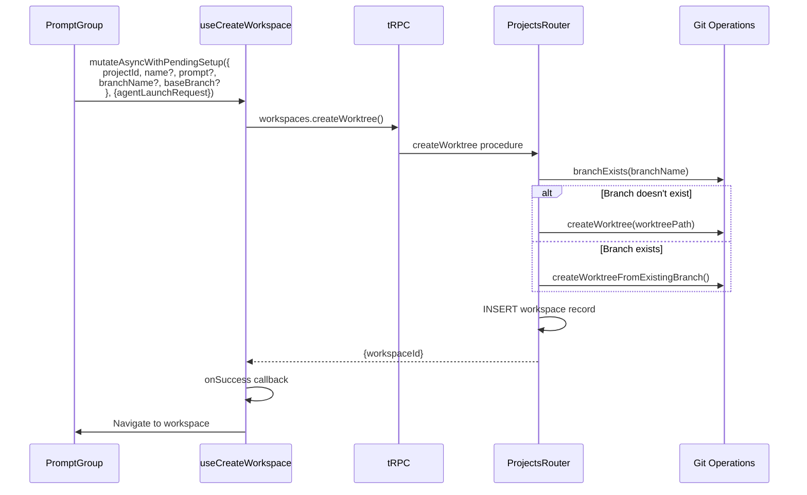

**PR-Based Workspace Creation**

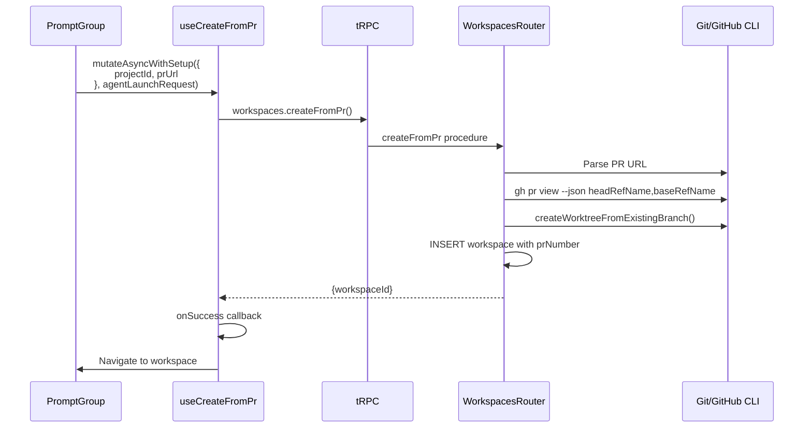

**Sources:**

- [apps/desktop/src/renderer/components/NewWorkspaceModal/components/PromptGroup/PromptGroup.tsx:608-653]()
- [apps/desktop/src/renderer/react-query/workspaces/useCreateWorkspace.ts]() (referenced)
- [apps/desktop/src/renderer/react-query/workspaces/useCreateFromPr.ts]() (referenced)

### Toast Notifications and Draft Reset

The `runAsyncAction()` wrapper manages user feedback:

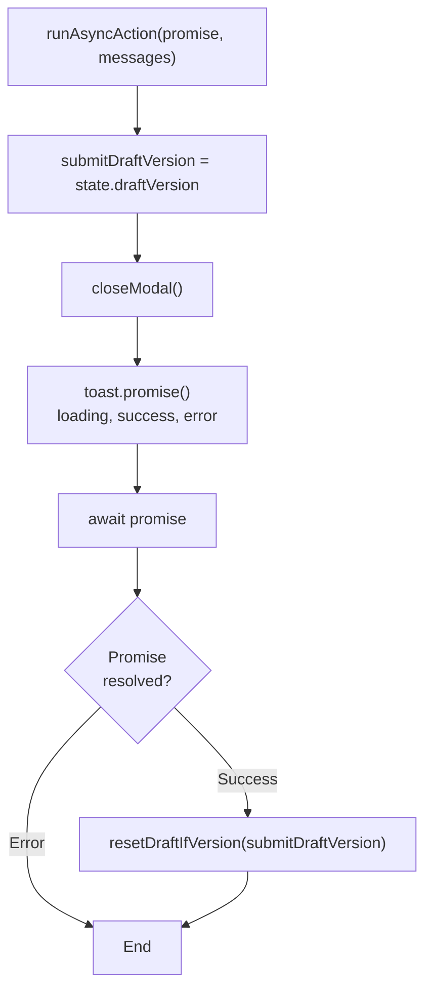

**Version-Based Reset:**

- Captures `draftVersion` before submission
- Only resets draft if version unchanged
- Prevents resetting if user opened modal again while creation was in progress

**Sources:**

- [apps/desktop/src/renderer/components/NewWorkspaceModal/NewWorkspaceModalDraftContext.tsx:139-156]()

---

## Advanced Options

The `PromptGroupAdvancedOptions` component (currently referenced but not rendered in the standard flow) would provide:

| Option                  | Purpose                        |
| ----------------------- | ------------------------------ |
| Branch name override    | Manual branch name entry       |
| Base branch selection   | Override resolved base branch  |
| Edit prefix button      | Navigate to settings           |
| Run setup script toggle | Control setup script execution |

**Sources:**

- [apps/desktop/src/renderer/components/NewWorkspaceModal/components/PromptGroup/components/PromptGroupAdvancedOptions/PromptGroupAdvancedOptions.tsx:27-215]()

---

## Branch Query Optimization

The modal uses a two-tier branch fetching strategy:

**Branch Data Loading Strategy**

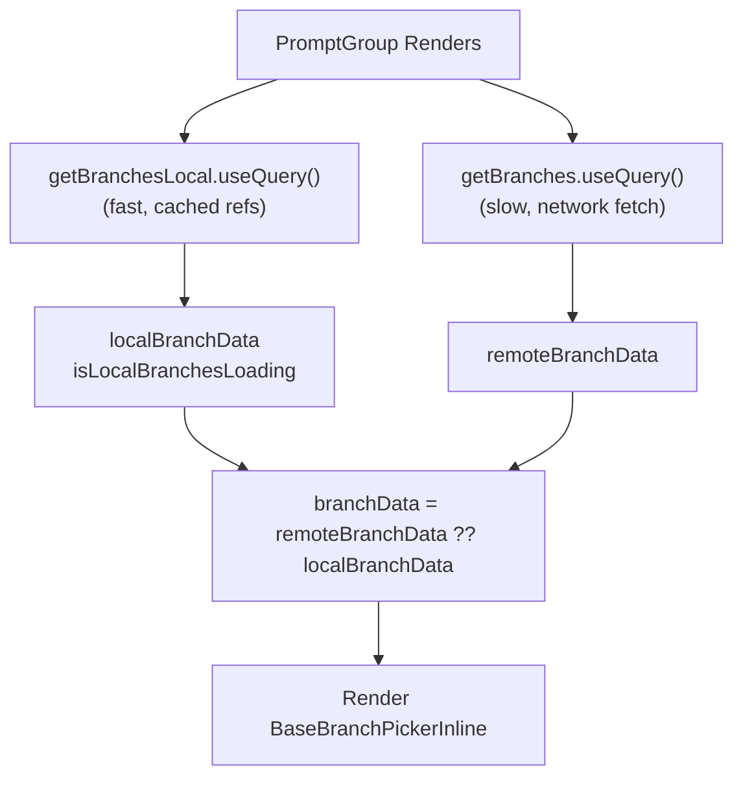

This pattern provides:

- **Instant feedback**: Local refs displayed immediately (no network)
- **Fresh data**: Remote data replaces local when available
- **Offline support**: Falls back to cached refs if network unavailable

**Sources:**

- [apps/desktop/src/renderer/components/NewWorkspaceModal/components/PromptGroup/PromptGroup.tsx:450-465]()
- [apps/desktop/src/lib/trpc/routers/projects/projects.ts:385-539]() (getBranchesLocal)
- [apps/desktop/src/lib/trpc/routers/projects/projects.ts:542-724]() (getBranches)

---

## Summary

The workspace creation flow provides a streamlined UI for:

1. **Project selection** with recent project persistence
2. **Branch configuration** with intelligent base branch resolution and auto-generated branch names
3. **Prompt input** with file attachments, issue linking, and agent selection
4. **PR-based workflows** as an alternative creation path
5. **Optimistic feedback** with toast notifications and draft state management

The modal architecture separates concerns between:

- **Zustand store** for modal lifecycle (open/close)
- **React Context** for draft state and mutations
- **tRPC queries** for branch/project/PR data
- **UI components** for user interaction

This design enables the modal to survive across multiple open/close cycles while maintaining user preferences and providing fast, responsive UI updates.
