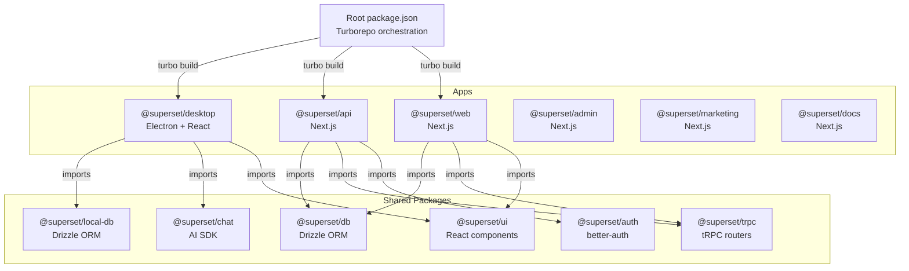
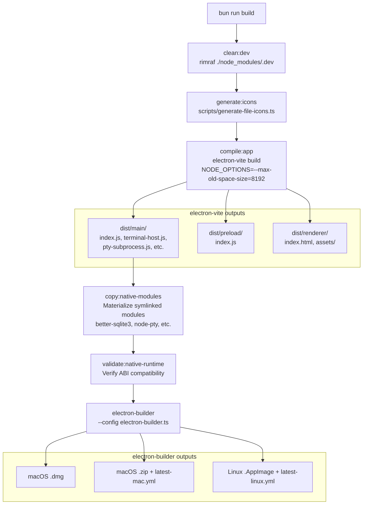
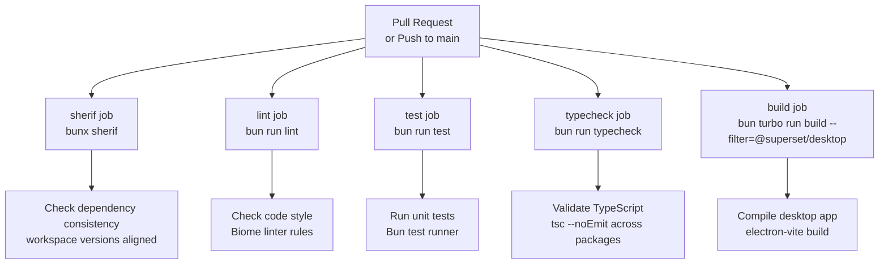
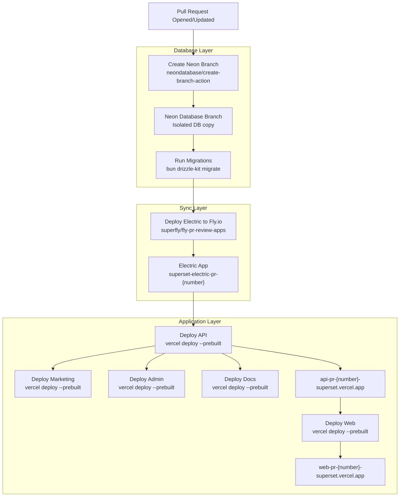
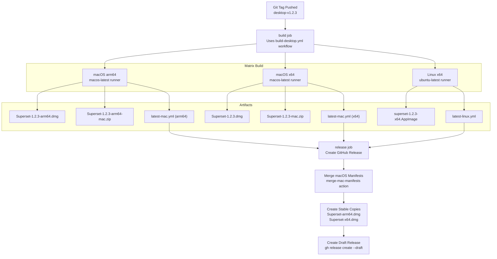

# Building and Testing

<details>
<summary>Relevant source files</summary>

The following files were used as context for generating this wiki page:

- [.github/actions/merge-mac-manifests/action.yml](.github/actions/merge-mac-manifests/action.yml)
- [.github/actions/merge-mac-manifests/merge-mac-manifests.mjs](.github/actions/merge-mac-manifests/merge-mac-manifests.mjs)
- [.github/templates/cleanup-comment.md](.github/templates/cleanup-comment.md)
- [.github/templates/preview-comment.md](.github/templates/preview-comment.md)
- [.github/workflows/build-desktop.yml](.github/workflows/build-desktop.yml)
- [.github/workflows/ci.yml](.github/workflows/ci.yml)
- [.github/workflows/cleanup-preview.yml](.github/workflows/cleanup-preview.yml)
- [.github/workflows/deploy-preview.yml](.github/workflows/deploy-preview.yml)
- [.github/workflows/deploy-production.yml](.github/workflows/deploy-production.yml)
- [.github/workflows/release-desktop-canary.yml](.github/workflows/release-desktop-canary.yml)
- [.github/workflows/release-desktop.yml](.github/workflows/release-desktop.yml)
- [apps/admin/src/trpc/react.tsx](apps/admin/src/trpc/react.tsx)
- [apps/api/package.json](apps/api/package.json)
- [apps/api/src/app/api/auth/desktop/connect/route.ts](apps/api/src/app/api/auth/desktop/connect/route.ts)
- [apps/api/src/app/api/electric/[...path]/route.ts](apps/api/src/app/api/electric/[...path]/route.ts)
- [apps/api/src/app/api/electric/[...path]/utils.ts](apps/api/src/app/api/electric/[...path]/utils.ts)
- [apps/api/src/env.ts](apps/api/src/env.ts)
- [apps/api/src/proxy.ts](apps/api/src/proxy.ts)
- [apps/api/src/trpc/context.ts](apps/api/src/trpc/context.ts)
- [apps/desktop/BUILDING.md](apps/desktop/BUILDING.md)
- [apps/desktop/RELEASE.md](apps/desktop/RELEASE.md)
- [apps/desktop/create-release.sh](apps/desktop/create-release.sh)
- [apps/desktop/electron-builder.ts](apps/desktop/electron-builder.ts)
- [apps/desktop/electron.vite.config.ts](apps/desktop/electron.vite.config.ts)
- [apps/desktop/package.json](apps/desktop/package.json)
- [apps/desktop/scripts/copy-native-modules.ts](apps/desktop/scripts/copy-native-modules.ts)
- [apps/desktop/src/main/env.main.ts](apps/desktop/src/main/env.main.ts)
- [apps/desktop/src/main/index.ts](apps/desktop/src/main/index.ts)
- [apps/desktop/src/main/lib/auto-updater.ts](apps/desktop/src/main/lib/auto-updater.ts)
- [apps/desktop/src/renderer/env.renderer.ts](apps/desktop/src/renderer/env.renderer.ts)
- [apps/desktop/src/renderer/index.html](apps/desktop/src/renderer/index.html)
- [apps/desktop/src/renderer/routes/_authenticated/providers/CollectionsProvider/CollectionsProvider.tsx](apps/desktop/src/renderer/routes/_authenticated/providers/CollectionsProvider/CollectionsProvider.tsx)
- [apps/desktop/src/renderer/routes/_authenticated/providers/CollectionsProvider/collections.ts](apps/desktop/src/renderer/routes/_authenticated/providers/CollectionsProvider/collections.ts)
- [apps/desktop/vite/helpers.ts](apps/desktop/vite/helpers.ts)
- [apps/web/src/app/auth/desktop/success/page.tsx](apps/web/src/app/auth/desktop/success/page.tsx)
- [apps/web/src/trpc/react.tsx](apps/web/src/trpc/react.tsx)
- [biome.jsonc](biome.jsonc)
- [bun.lock](bun.lock)
- [fly.toml](fly.toml)
- [package.json](package.json)
- [packages/ui/package.json](packages/ui/package.json)
- [scripts/lint.sh](scripts/lint.sh)

</details>


This document covers the build systems, test execution, and quality assurance processes for the Superset monorepo. It explains how to compile applications, run tests, execute CI checks, and validate code changes before deployment.

For information about deployment pipelines and infrastructure, see [3.3 Deployment Pipeline](#3.3). For setup and installation instructions, see [4.2 Setup and Installation](#4.2).

---

## Monorepo Build System

The Superset monorepo uses **Turborepo** for orchestrating builds across multiple packages and **Bun** as the package manager and test runner. The workspace is organized with apps in `apps/*` and shared packages in `packages/*`.

### Package Manager and Workspace Configuration

The repository requires **Bun 1.3.6** as specified in [package.json:16](). All dependency installation uses `bun install --frozen` to ensure reproducible builds from the lockfile [bun.lock:1-2]().

Key monorepo scripts from [package.json:18-40]():

| Script | Command | Purpose |
|--------|---------|---------|
| `build` | `turbo build --filter=@superset/desktop` | Build desktop app only |
| `dev` | `turbo run dev --filter=@superset/api --filter=@superset/web --filter=@superset/desktop` | Start development servers |
| `test` | `turbo test` | Run all tests |
| `typecheck` | `turbo typecheck` | Type check all packages |
| `lint` | `./scripts/lint.sh` | Run Biome linter |

**Turbo Build Orchestration Diagram**



**Sources:** [package.json:1-56](), [bun.lock:1-13]()

---

## Desktop Application Build

The desktop app uses a multi-stage build process: **electron-vite** for compilation and **electron-builder** for packaging into distributable formats.

### Compilation with electron-vite

The build configuration is defined in [apps/desktop/electron.vite.config.ts:1-264](). It compiles three separate bundles:

1. **Main process** - Node.js runtime, outputs to `dist/main/`
2. **Preload scripts** - Sandboxed bridge layer, outputs to `dist/preload/`
3. **Renderer process** - React UI, outputs to `dist/renderer/`

**Main Process Build Configuration:**

[apps/desktop/electron.vite.config.ts:47-127]() defines multiple entrypoints:

```
input: {
  index: "src/main/index.ts"                    // Main Electron entry
  terminal-host: "src/main/terminal-host/index.ts"  // Terminal daemon
  pty-subprocess: "src/main/terminal-host/pty-subprocess.ts"  // PTY process
  git-task-worker: "src/main/git-task-worker.ts"  // Git worker thread
  host-service: "src/main/host-service/index.ts"  // Host HTTP server
}
```

The renderer build uses Vite plugins [apps/desktop/electron.vite.config.ts:216-237]():
- `@tanstack/router-plugin` - Generate type-safe routes
- `@tailwindcss/vite` - Tailwind CSS compilation
- `@vitejs/plugin-react` - React transformation
- Sentry plugin - Source map uploads (when `SENTRY_AUTH_TOKEN` is set)

**Desktop Build Commands**

From [apps/desktop/package.json:16-35]():

| Script | Purpose |
|--------|---------|
| `clean:dev` | Remove `.cache`, `.turbo`, `dist`, `node_modules/.dev` |
| `generate:icons` | Generate file type icons from Material Icon Theme |
| `compile:app` | Run electron-vite build with environment variables |
| `copy:native-modules` | Materialize symlinked native modules for packaging |
| `validate:native-runtime` | Verify native modules match Electron ABI |
| `prebuild` | Run clean, generate icons, compile, copy/validate natives |
| `build` | Run electron-builder with `--publish never` |
| `package` | Run electron-builder with custom config |

**Build Process Flow Diagram**



**Sources:** [apps/desktop/package.json:16-35](), [apps/desktop/electron.vite.config.ts:1-264]()

### Native Module Handling

Desktop apps include native Node.js addons that must be copied and rebuilt for Electron's Node.js version. The script [apps/desktop/scripts/copy-native-modules.ts:1-298]() handles this:

1. **Detect symlinks** - Bun 1.3+ uses isolated installs with symlinks to `.bun/` store
2. **Materialize packages** - Replace symlinks with actual file copies
3. **Platform-specific binaries** - Fetch correct arch/platform variants from npm if cross-compiling

Required native modules from [apps/desktop/runtime-dependencies.ts]():
- `better-sqlite3` - SQLite database
- `node-pty` - Pseudoterminal for terminal sessions
- `@parcel/watcher` - File system watching
- `@superset/macos-process-metrics` - macOS-specific native addon

The `TARGET_ARCH` environment variable enables cross-compilation [apps/desktop/scripts/copy-native-modules.ts:33-34]():
```typescript
const TARGET_ARCH = process.env.TARGET_ARCH || process.arch;
const TARGET_PLATFORM = process.env.TARGET_PLATFORM || process.platform;
```

**Sources:** [apps/desktop/scripts/copy-native-modules.ts:1-298](), [apps/desktop/package.json:23-27]()

### Packaging with electron-builder

Configuration in [apps/desktop/electron-builder.ts:1-153]() defines:

**Packaging Strategy:**

| Configuration | Value | Purpose |
|---------------|-------|---------|
| `asar` | `true` | Bundle app into archive for faster loading |
| `asarUnpack` | Native modules, sounds, tray icons | Extract files that need direct filesystem access |
| `extraResources` | Database migrations | Place outside asar for drizzle-orm to read |
| `npmRebuild` | `true` | Rebuild native modules for Electron's Node.js |

**Platform Configurations:**

**macOS** [apps/desktop/electron-builder.ts:90-117]():
- Signing: `hardenedRuntime: true`, requires `CSC_LINK` certificate
- Notarization: `notarize: true`, requires `APPLE_ID` credentials
- Entitlements: Microphone, local network, Apple Events permissions
- Output: `.dmg` installer + `.zip` for auto-update

**Linux** [apps/desktop/electron-builder.ts:126-132]():
- Target: AppImage (portable executable)
- Artifact naming: `superset-${version}-${arch}.AppImage`

**Update Manifests:**

electron-builder generates auto-update manifests [apps/desktop/electron-builder.ts:28-37]():
- `latest-mac.yml` - macOS Squirrel.Mac format
- `latest-linux.yml` - Generic provider format
- `generateUpdatesFilesForAllChannels: true` - Enables channel-based updates (stable, canary)

**Sources:** [apps/desktop/electron-builder.ts:1-153](), [apps/desktop/package.json:26-30]()

---

## Web and API Application Build

All Next.js applications (web, api, admin, marketing, docs) use the standard Next.js build process with additional Vercel deployment configuration.

### Next.js Build Process

From [apps/api/package.json:6-11]():

```json
{
  "scripts": {
    "build": "next build",
    "dev": "dotenv -e ../../.env -- sh -c 'next dev --port ${API_PORT:-3001}'",
    "start": "next start --port 3001"
  }
}
```

The build process:
1. Reads environment variables from root `.env` file via `dotenv -e ../../.env`
2. Validates environment schema in `src/env.ts` using `@t3-oss/env-nextjs`
3. Compiles Next.js pages, API routes, and server components
4. Outputs to `.next/` directory

**API Environment Validation:**

[apps/api/src/env.ts:1-76]() validates 40+ required environment variables:

```typescript
export const env = createEnv({
  server: {
    DATABASE_URL: z.string(),
    DATABASE_URL_UNPOOLED: z.string(),
    ELECTRIC_URL: z.string().url(),
    ELECTRIC_SECRET: z.string().min(16),
    // ... 40+ more variables
  },
  client: {
    NEXT_PUBLIC_API_URL: z.string().url(),
    NEXT_PUBLIC_WEB_URL: z.string().url(),
    // ...
  },
  skipValidation: !!process.env.SKIP_ENV_VALIDATION,
});
```

Build fails early if any required variable is missing or invalid.

**Sources:** [apps/api/package.json:1-62](), [apps/api/src/env.ts:1-76]()

### Vercel Deployment Build

The production deployment workflow [.github/workflows/deploy-production.yml:42-174]() uses Vercel CLI:

```bash
vercel pull --yes --environment=production --token=$VERCEL_TOKEN
vercel build --prod --token=$VERCEL_TOKEN
vercel deploy --prod --prebuilt --archive=tgz --token=$VERCEL_TOKEN \
  --env DATABASE_URL=$DATABASE_URL \
  --env NEXT_PUBLIC_API_URL=$NEXT_PUBLIC_API_URL \
  # ... 40+ environment variables passed at deploy time
```

The `--archive=tgz` flag compresses the `.next/` output before uploading to Vercel, reducing upload time.

**Build Verification in CI:**

[.github/workflows/ci.yml:108-132]() verifies desktop app can build in CI:

```yaml
- name: Build Desktop
  env:
    NEXT_PUBLIC_OUTLIT_KEY: ${{ secrets.NEXT_PUBLIC_OUTLIT_KEY || 'ci-outlit-placeholder-key' }}
  run: bun turbo run build --filter=@superset/desktop
```

The placeholder key allows CI to pass even when secrets aren't available on external PRs.

**Sources:** [.github/workflows/deploy-production.yml:42-174](), [.github/workflows/ci.yml:108-132]()

---

## Testing

The repository uses **Bun's built-in test runner** for unit and integration tests.

### Test Execution

Root command from [package.json:25]():
```bash
bun run test  # Runs `turbo test` across all packages
```

Desktop test script from [apps/desktop/package.json:35]():
```bash
bun test  # Executes Bun test runner on *.test.ts files
```

**CI Test Workflow:**

[.github/workflows/ci.yml:58-82]() runs tests on every PR:

```yaml
test:
  name: Test
  runs-on: ubuntu-latest
  steps:
    - name: Cache dependencies
      uses: actions/cache@v4
      with:
        path: ~/.bun/install/cache
        key: ${{ runner.os }}-bun-${{ hashFiles('bun.lock') }}
    
    - name: Install dependencies
      run: bun install --frozen
    
    - name: Test
      env:
        NEXT_PUBLIC_OUTLIT_KEY: ${{ secrets.NEXT_PUBLIC_OUTLIT_KEY || 'ci-outlit-placeholder-key' }}
      run: bun run test
```

Tests use frozen lockfile installs to ensure consistent dependency versions across CI and local development.

**Sources:** [package.json:25](), [apps/desktop/package.json:35](), [.github/workflows/ci.yml:58-82]()

---

## Linting and Type Checking

### Biome Linter

The project uses **Biome** (formerly Rome) for fast, TypeScript-aware linting and formatting.

Configuration in [biome.jsonc:1-57]():

```json
{
  "vcs": {
    "enabled": true,
    "clientKind": "git",
    "useIgnoreFile": true
  },
  "formatter": {
    "formatWithErrors": true
  },
  "css": {
    "parser": {
      "cssModules": true,
      "tailwindDirectives": true
    }
  },
  "linter": {
    "rules": {
      "recommended": true
    }
  }
}
```

**Renderer-Specific Rules:**

[biome.jsonc:31-55]() enforces browser compatibility in the desktop renderer:

```json
{
  "overrides": [
    {
      "includes": ["apps/desktop/src/renderer/**"],
      "linter": {
        "rules": {
          "style": {
            "noRestrictedImports": {
              "level": "error",
              "options": {
                "paths": {
                  "@superset/workspace-fs/host": "Renderer code must stay browser-compatible.",
                  "@superset/workspace-fs/server": "Renderer code must stay browser-compatible."
                },
                "patterns": [
                  {
                    "group": ["node:*"],
                    "message": "Renderer code must not import Node builtins."
                  }
                ]
              }
            }
          }
        }
      }
    }
  ]
}
```

This prevents accidental Node.js imports in browser-side code.

**Lint Scripts:**

From [package.json:26-29]():

```bash
bun run lint         # Run ./scripts/lint.sh
bun run lint:fix     # Auto-fix issues with --write --unsafe
bun run format       # Format all files
bun run format:check # Check formatting without changes
```

**Sources:** [biome.jsonc:1-57](), [package.json:26-29]()

### TypeScript Validation

Type checking runs via Turborepo across all packages [package.json:31]():

```bash
bun run typecheck  # Runs `turbo typecheck`
```

Each package defines its own `typecheck` script. Desktop example from [apps/desktop/package.json:33-34]():

```bash
bun run pretypecheck  # Generate icons and routes first
bun run typecheck     # tsc --noEmit
```

The `pretypecheck` hook ensures generated files (file icons, TanStack Router routes) exist before type checking.

**CI Type Check Workflow:**

[.github/workflows/ci.yml:84-106]() validates types on every commit:

```yaml
typecheck:
  name: Typecheck
  runs-on: ubuntu-latest
  steps:
    - name: Cache dependencies
      uses: actions/cache@v4
      with:
        path: ~/.bun/install/cache
        key: ${{ runner.os }}-bun-${{ hashFiles('bun.lock') }}
    
    - name: Install dependencies
      run: bun install --frozen
    
    - name: Typecheck
      run: bun run typecheck
```

**Sources:** [package.json:31](), [apps/desktop/package.json:33-34](), [.github/workflows/ci.yml:84-106]()

### Dependency Consistency with Sherif

**Sherif** validates workspace dependencies are correctly declared and versioned.

[.github/workflows/ci.yml:10-32]() runs Sherif on every PR:

```yaml
sherif:
  name: Sherif
  runs-on: ubuntu-latest
  steps:
    - name: Install dependencies
      run: bun install --frozen
    
    - name: Sherif
      run: bunx sherif
```

Sherif detects:
- Missing dependencies in package.json that are imported in code
- Version mismatches between workspace packages
- Unused dependencies declared but not imported

**Sources:** [.github/workflows/ci.yml:10-32](), [package.json:10]()

---

## CI/CD Pipeline

### Continuous Integration Workflow

[.github/workflows/ci.yml:1-133]() defines the CI pipeline that runs on all PRs and main branch pushes:

**CI Pipeline Diagram**



All jobs run in parallel using `ubuntu-latest` runners with Bun caching enabled:

```yaml
- name: Cache dependencies
  uses: actions/cache@v4
  with:
    path: ~/.bun/install/cache
    key: ${{ runner.os }}-bun-${{ hashFiles('bun.lock') }}
```

Cache key based on `bun.lock` ensures cache invalidation when dependencies change.

**Sources:** [.github/workflows/ci.yml:1-133]()

### Preview Deployment Pipeline

[.github/workflows/deploy-preview.yml:1-700]() creates ephemeral preview environments for each PR:

**Preview Environment Architecture**



Each PR gets:
1. **Isolated Neon database branch** - Copy of production schema with test data
2. **Dedicated Electric sync server** - Deployed to Fly.io with unique app name
3. **Five Vercel preview deployments** - API, Web, Marketing, Admin, Docs with PR-specific URLs

Environment variables are passed at deploy time [.github/workflows/deploy-preview.yml:163-269]():
```bash
vercel deploy --prebuilt --archive=tgz --token=$VERCEL_TOKEN \
  --env DATABASE_URL=$DATABASE_URL \
  --env ELECTRIC_URL=$ELECTRIC_URL \
  --env NEXT_PUBLIC_API_URL=https://api-pr-${{ PR_NUMBER }}-superset.vercel.app \
  # ... 40+ environment variables
```

**Cleanup on PR Close:**

[.github/workflows/cleanup-preview.yml:1-60]() deletes preview resources:

```yaml
on:
  pull_request:
    types: [closed]

jobs:
  cleanup:
    steps:
      - name: Delete Neon branch
        uses: neondatabase/delete-branch-action@v3
      
      - name: Delete Electric Fly.io app
        run: flyctl apps destroy "superset-electric-pr-${{ PR_NUMBER }}" --yes
```

This prevents accumulation of unused preview infrastructure.

**Sources:** [.github/workflows/deploy-preview.yml:1-700](), [.github/workflows/cleanup-preview.yml:1-60]()

---

## Release Process

### Desktop Release Workflow

Desktop releases are triggered by pushing tags matching `desktop-v*.*.*` pattern.

**Release Script:**

[apps/desktop/create-release.sh:1-500]() automates the release process:

1. **Version selection** - Interactive prompt for patch/minor/major or custom version
2. **Prerequisite checks** - Verify git is clean, `gh` CLI is authenticated
3. **Cleanup existing releases** - Delete tag/release if republishing same version
4. **Update package.json** - Bump version and commit change
5. **Push and create PR** - Push to feature branch, open PR if not on main
6. **Create git tag** - Push tag to trigger [.github/workflows/release-desktop.yml:1-147]()
7. **Monitor build** - Stream GitHub Actions logs in real-time
8. **Publish or leave draft** - With `--publish` flag, auto-publish when build completes

Example usage:
```bash
./apps/desktop/create-release.sh              # Interactive version prompt
./apps/desktop/create-release.sh 1.2.3        # Explicit version
./apps/desktop/create-release.sh --publish    # Auto-publish when ready
./apps/desktop/create-release.sh --publish --merge  # Auto-merge PR after publish
```

**GitHub Actions Release Pipeline:**

[.github/workflows/release-desktop.yml:1-147]() orchestrates the build:



**Build Matrix Configuration:**

[.github/workflows/build-desktop.yml:38-40]() defines the matrix:

```yaml
strategy:
  fail-fast: false
  matrix:
    arch: [arm64, x64]
```

Each macOS build:
1. Installs dependencies with `bun install --frozen`
2. Sets version suffix if canary build [.github/workflows/build-desktop.yml:63-78]()
3. Compiles app with electron-vite [.github/workflows/build-desktop.yml:88-104]()
4. Packages with electron-builder [.github/workflows/build-desktop.yml:106-115]()
5. Signs with Apple Developer ID certificate
6. Notarizes with Apple ID credentials
7. Verifies `app-update.yml` exists in bundle [.github/workflows/build-desktop.yml:117-131]()
8. Uploads DMG, ZIP, and manifest as artifacts

**Update Manifest Merging:**

electron-builder generates separate manifests for arm64 and x64. The action [.github/actions/merge-mac-manifests]() combines them into a single `latest-mac.yml` with both architectures:

```yaml
version: 1.2.3
files:
  - url: Superset-1.2.3-arm64.dmg
    sha512: ...
    size: 123456789
  - url: Superset-1.2.3.dmg
    sha512: ...
    size: 123456789
path: Superset-1.2.3-arm64.dmg
sha512: ...
releaseDate: '2024-01-15T12:00:00.000Z'
```

This allows electron-updater to download the correct architecture automatically.

**Stable-Named Artifacts:**

[.github/workflows/release-desktop.yml:66-111]() creates version-less copies:

```bash
# From: Superset-1.2.3-arm64.dmg
# To:   Superset-arm64.dmg

for file in *.dmg; do
  arch=$(echo "$file" | sed -E 's/.*-([^-]+)\.dmg$/\1/')
  cp "$file" "Superset-${arch}.dmg"
done
```

These enable stable download URLs: `https://github.com/superset-sh/superset/releases/latest/download/Superset-arm64.dmg`

**Sources:** [apps/desktop/create-release.sh:1-500](), [.github/workflows/release-desktop.yml:1-147](), [.github/workflows/build-desktop.yml:1-255]()

### Canary Release Automation

[.github/workflows/release-desktop-canary.yml:1-180]() publishes pre-release builds:

**Schedule:** Every 12 hours (12 AM and 12 PM UTC) via cron trigger

**Change Detection:**

```yaml
steps:
  - name: Check for changes since last canary
    run: |
      LAST_CANARY_SHA=$(git rev-parse desktop-canary 2>/dev/null || echo "")
      if [ "$LAST_CANARY_SHA" = "$(git rev-parse HEAD)" ]; then
        echo "should_build=false" >> $GITHUB_OUTPUT
      else
        echo "should_build=true" >> $GITHUB_OUTPUT
      fi
```

Canary only builds if commits exist since last canary tag.

**Version Stamping:**

Canary versions use timestamp suffix [.github/workflows/release-desktop-canary.yml:44-47]():

```bash
VERSION_TIMESTAMP=$(date -u +'%Y%m%d%H%M%S')
# Example: 1.2.0-canary.20240115120000
```

This ensures each canary has a unique, incrementing version for auto-update detection.

**Rolling Tag:**

The workflow force-pushes the `desktop-canary` tag [.github/workflows/release-desktop-canary.yml:125-135]():

```bash
git tag -f desktop-canary ${{ github.sha }}
git push origin desktop-canary --force
```

This maintains a stable download URL while allowing continuous updates.

**Sources:** [.github/workflows/release-desktop-canary.yml:1-180]()

---

## Environment Variable Management

### Build-Time vs Runtime Variables

**Desktop App:**

The desktop app uses two separate environment schemas:

1. **Main process** - [apps/desktop/src/main/env.main.ts:1-52]() - Node.js runtime, reads `process.env`
2. **Renderer process** - [apps/desktop/src/renderer/env.renderer.ts:1-50]() - Browser context, uses Vite `define` to inline values at build time

**Vite `define` Configuration:**

[apps/desktop/electron.vite.config.ts:50-96]() replaces environment references with string literals:

```typescript
define: {
  "process.env.NODE_ENV": defineEnv(process.env.NODE_ENV, "production"),
  "process.env.NEXT_PUBLIC_API_URL": defineEnv(
    process.env.NEXT_PUBLIC_API_URL,
    "https://api.superset.sh",
  ),
  // ... 15+ variables
}
```

The `defineEnv` helper [apps/desktop/vite/helpers.ts:19-24]() stringifies values:

```typescript
export function defineEnv(value: string | undefined, fallback?: string): string {
  return JSON.stringify(value ?? fallback);
}
```

This ensures sensitive values aren't exposed in the renderer bundle.

**API/Web Apps:**

Next.js apps use `@t3-oss/env-nextjs` for validation [apps/api/src/env.ts:1-76](). Variables prefixed with `NEXT_PUBLIC_` are inlined at build time; server-only variables remain in Node.js environment.

**Sources:** [apps/desktop/src/main/env.main.ts:1-52](), [apps/desktop/src/renderer/env.renderer.ts:1-50](), [apps/desktop/electron.vite.config.ts:50-96](), [apps/desktop/vite/helpers.ts:19-24](), [apps/api/src/env.ts:1-76]()

---

## Resource Bundling

### Static Assets and Migrations

The desktop app includes non-code resources that must be accessible at runtime:

**Resource Copy Plugin:**

[apps/desktop/vite/helpers.ts:26-51]() defines resources to copy:

```typescript
const RESOURCES_TO_COPY = [
  {
    src: resolve(__dirname, "..", resources, "sounds"),
    dest: resolve(__dirname, "..", devPath, "resources/sounds"),
  },
  {
    src: resolve(__dirname, "..", resources, "tray"),
    dest: resolve(__dirname, "..", devPath, "resources/tray"),
  },
  {
    src: resolve(__dirname, "../../../packages/local-db/drizzle"),
    dest: resolve(__dirname, "..", devPath, "resources/migrations"),
  },
  {
    src: resolve(__dirname, "../../../packages/host-service/drizzle"),
    dest: resolve(__dirname, "..", devPath, "resources/host-migrations"),
  },
];
```

These are copied during build and placed in `extraResources` [apps/desktop/electron-builder.ts:56-68]():

```typescript
extraResources: [
  {
    from: "dist/resources/migrations",
    to: "resources/migrations",
    filter: ["**/*"],
  },
  {
    from: "dist/resources/host-migrations",
    to: "resources/host-migrations",
    filter: ["**/*"],
  },
]
```

At runtime, migrations are accessible via `process.resourcesPath + "/resources/migrations"`.

**ASAR Unpacking:**

Certain resources must be unpacked from the asar archive [apps/desktop/electron-builder.ts:47-53]():

```typescript
asarUnpack: [
  ...packagedAsarUnpackGlobs,
  "**/resources/sounds/**/*",    // For afplay/paplay external players
  "**/resources/tray/**/*",      // For Electron Tray API
]
```

Native modules are also unpacked so Node.js can load them correctly.

**Sources:** [apps/desktop/vite/helpers.ts:26-51](), [apps/desktop/electron-builder.ts:46-68]()