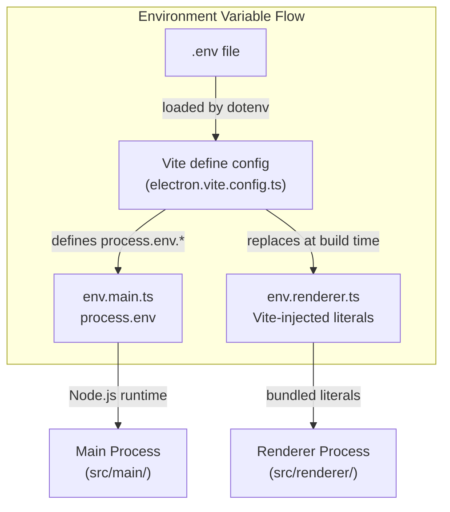

# Development Workflow

<details>
<summary>Relevant source files</summary>

The following files were used as context for generating this wiki page:

- [.github/actions/merge-mac-manifests/action.yml](.github/actions/merge-mac-manifests/action.yml)
- [.github/actions/merge-mac-manifests/merge-mac-manifests.mjs](.github/actions/merge-mac-manifests/merge-mac-manifests.mjs)
- [.github/workflows/build-desktop.yml](.github/workflows/build-desktop.yml)
- [.github/workflows/release-desktop-canary.yml](.github/workflows/release-desktop-canary.yml)
- [.github/workflows/release-desktop.yml](.github/workflows/release-desktop.yml)
- [apps/api/src/app/api/auth/desktop/connect/route.ts](apps/api/src/app/api/auth/desktop/connect/route.ts)
- [apps/desktop/BUILDING.md](apps/desktop/BUILDING.md)
- [apps/desktop/RELEASE.md](apps/desktop/RELEASE.md)
- [apps/desktop/create-release.sh](apps/desktop/create-release.sh)
- [apps/desktop/electron-builder.ts](apps/desktop/electron-builder.ts)
- [apps/desktop/electron.vite.config.ts](apps/desktop/electron.vite.config.ts)
- [apps/desktop/package.json](apps/desktop/package.json)
- [apps/desktop/scripts/copy-native-modules.ts](apps/desktop/scripts/copy-native-modules.ts)
- [apps/desktop/src/main/env.main.ts](apps/desktop/src/main/env.main.ts)
- [apps/desktop/src/main/index.ts](apps/desktop/src/main/index.ts)
- [apps/desktop/src/main/lib/auto-updater.ts](apps/desktop/src/main/lib/auto-updater.ts)
- [apps/desktop/src/renderer/env.renderer.ts](apps/desktop/src/renderer/env.renderer.ts)
- [apps/desktop/src/renderer/index.html](apps/desktop/src/renderer/index.html)
- [apps/desktop/vite/helpers.ts](apps/desktop/vite/helpers.ts)
- [apps/web/src/app/auth/desktop/success/page.tsx](apps/web/src/app/auth/desktop/success/page.tsx)
- [biome.jsonc](biome.jsonc)
- [bun.lock](bun.lock)
- [package.json](package.json)
- [packages/ui/package.json](packages/ui/package.json)
- [scripts/lint.sh](scripts/lint.sh)

</details>

## Purpose and Scope

This page documents the day-to-day development workflow for working with the Superset codebase: running development servers, hot reload behavior, code generation tasks, environment variable management, quality checks, and debugging techniques. For initial repository setup and dependency installation, see [Setup and Installation](#4.2). For building production artifacts and running tests in CI, see [Building and Testing](#4.4).

---

## Running Development Servers

### Desktop App Development

The desktop app uses `electron-vite` with hot reload for the renderer process and automatic restart for the main process.

**Start desktop dev server:**

```bash
cd apps/desktop
bun run dev
```

This executes the `predev` hook before starting:

[apps/desktop/package.json:20]()

```json
"predev": "cross-env NODE_ENV=development bun run clean:dev && bun run generate:icons && cross-env NODE_ENV=development bun run scripts/clean-launch-services.ts && cross-env NODE_ENV=development bun run scripts/patch-dev-protocol.ts"
```

**Predev steps:**

1. **`clean:dev`**: Removes `node_modules/.dev` cache directory
2. **`generate:icons`**: Generates file type icons from Material Icon Theme JSON
3. **`clean-launch-services.ts`**: (macOS only) Clears Launch Services cache to register protocol handler
4. **`patch-dev-protocol.ts`**: (macOS only) Patches Electron binary for `superset://` deep links in development

**Dev mode initialization:**

[apps/desktop/src/main/index.ts:44-56]()

```typescript
const IS_DEV = process.env.NODE_ENV === "development";

void applyShellEnvToProcess().catch((error) => {
\tconsole.error("[main] Failed to apply shell environment:", error);
});

// Dev mode: label the app with the workspace name so multiple worktrees are distinguishable
if (IS_DEV) {
\tconst workspaceName = resolveDevWorkspaceName();
\tif (workspaceName) {
\t\tapp.setName(`Superset (${workspaceName})`);
\t}
}
```

The desktop app name includes the Git worktree name in development, allowing multiple dev instances to run simultaneously from different branches.

**Dev server port configuration:**

[electron.vite.config.ts:23-24]()

```typescript
const DEV_SERVER_PORT = Number(process.env.DESKTOP_VITE_PORT)
```

The renderer dev server port is configurable via `DESKTOP_VITE_PORT` environment variable (default from `.env`).

**Sources:** [apps/desktop/package.json:16-35](), [apps/desktop/src/main/index.ts:1-50](), [electron.vite.config.ts:1-265]()

---

### Full Stack Development

**Run all development servers:**

```bash
bun run dev
```

This starts API, Web, Desktop, and the local Caddy reverse proxy via Turborepo:

[package.json:19]()

```json
"dev": "turbo run dev dev:caddy --filter=@superset/api --filter=@superset/web --filter=@superset/desktop --filter=electric-proxy --filter=//"
```

**Individual app servers:**

| Command                 | Apps Started            |
| ----------------------- | ----------------------- |
| `bun run dev:docs`      | Documentation site only |
| `bun run dev:marketing` | Marketing + Docs        |
| `bun run dev:all`       | All apps in monorepo    |

**Turbo caching:** Turborepo caches build and test outputs in `.turbo/` and `node_modules/.cache/turbo/`. Use `bun run clean:workspaces` to clear workspace-level caches.

**Sources:** [package.json:18-24]()

---

## Hot Reload and Watch Mode

### Electron-vite Watch Behavior

[apps/desktop/package.json:21]()

```json
"dev": "cross-env NODE_ENV=development electron-vite dev --watch"
```

The `--watch` flag enables:

- **Renderer process**: HMR (Hot Module Replacement) via Vite
- **Main process**: Full restart on file changes
- **Preload scripts**: Full restart on file changes

### Build Targets and Entry Points

[electron.vite.config.ts:99-119]()

```typescript
build: {
  rollupOptions: {
    input: {
      index: resolve("src/main/index.ts"),
      "terminal-host": resolve("src/main/terminal-host/index.ts"),
      "pty-subprocess": resolve("src/main/terminal-host/pty-subprocess.ts"),
      "git-task-worker": resolve("src/main/git-task-worker.ts"),
      "host-service": resolve("src/main/host-service/index.ts"),
    },
  },
},
```

Each entry point is built separately:

- **`index`**: Main Electron process
- **`terminal-host`**: Terminal daemon subprocess (persists across app restarts)
- **`pty-subprocess`**: PTY shell process
- **`git-task-worker`**: Heavy Git operations worker thread
- **`host-service`**: HTTP/tRPC server per organization

**Terminal session persistence:** The `terminal-host` daemon runs as a separate Node process and survives main process restarts, preserving terminal sessions during hot reload.

### What Triggers Rebuilds

**Renderer rebuild:**

- Any file in `src/renderer/`
- Imported workspace packages (`@superset/ui`, `@superset/trpc`, etc.)
- CSS/Tailwind changes

**Main process restart:**

- Any file in `src/main/`
- Changes to `preload/` scripts
- Environment variable changes (requires restart)

**Full restart required:**

- `package.json` dependency changes
- Native module updates (`node-pty`, `better-sqlite3`)
- `electron.vite.config.ts` changes

**Sources:** [electron.vite.config.ts:46-264](), [apps/desktop/package.json:16-35]()

---

## Code Generation

### File Icons Generation

Material Icon Theme provides file icons as JSON mappings. These must be generated before building:

[apps/desktop/package.json:19]()

```json
"generate:icons": "bun run scripts/generate-file-icons.ts"
```

This script:

1. Reads icon definitions from `material-icon-theme` package
2. Generates TypeScript constants mapping file extensions to icon names
3. Outputs to `src/renderer/lib/file-icons.generated.ts`

**When to run:** After updating `material-icon-theme` or when icon mappings are missing.

### Route Generation

TanStack Router uses file-based routing with code generation:

[apps/desktop/package.json:32-33]()

```json
"generate:routes": "tsr generate",
"pretypecheck": "bun run generate:icons && bun run generate:routes"
```

**Route configuration:**

[electron.vite.config.ts:217-226]()

```typescript
tanstackRouter({
  target: "react",
  routesDirectory: resolve("src/renderer/routes"),
  generatedRouteTree: resolve("src/renderer/routeTree.gen.ts"),
  indexToken: "page",
  routeToken: "layout",
  autoCodeSplitting: true,
  routeFileIgnorePattern: "^(?!(__root|page|layout)\\.tsx$).*\\.(tsx?|jsx?)$",
}),
```

**File naming convention:**

- `__root.tsx`: Root layout
- `page.tsx`: Route component (leaf node)
- `layout.tsx`: Layout wrapper (intermediate node)
- Other `.tsx` files: Ignored (components, utilities)

Generated output: `src/renderer/routeTree.gen.ts`

**When to run:** Automatically runs before `typecheck`. Run manually if route types are stale.

**Sources:** [apps/desktop/package.json:19-35](), [electron.vite.config.ts:217-226]()

---

## Environment Variables

### Build-time vs Runtime Injection

Environment variables are handled differently in main and renderer processes:



### Main Process Environment

[apps/desktop/src/main/env.main.ts:9-52]()

```typescript
export const env = createEnv({
  server: {
    NODE_ENV: z.enum(["development", "production", "test\
```
