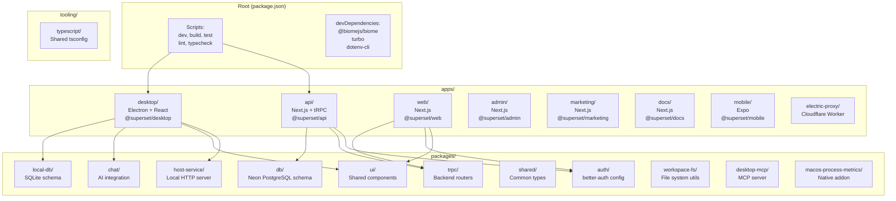
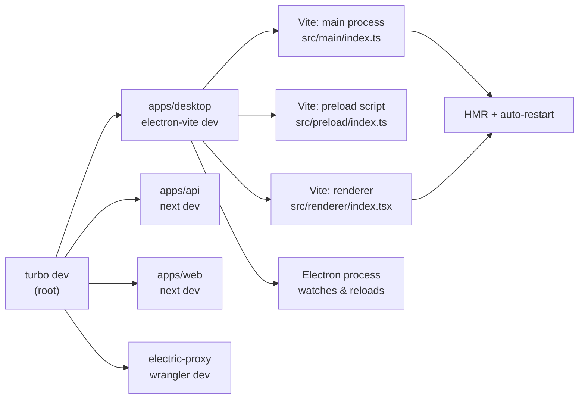
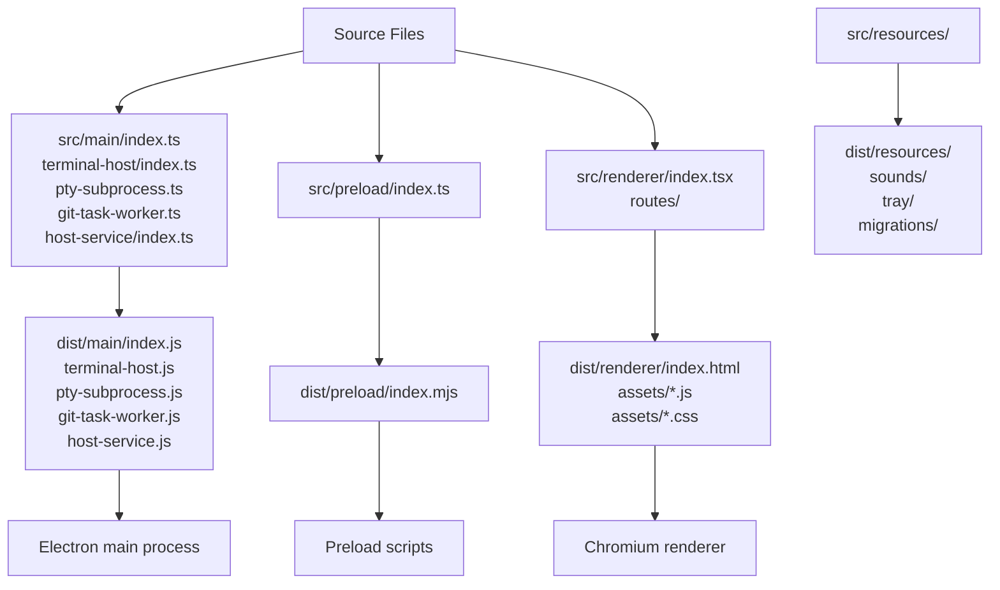
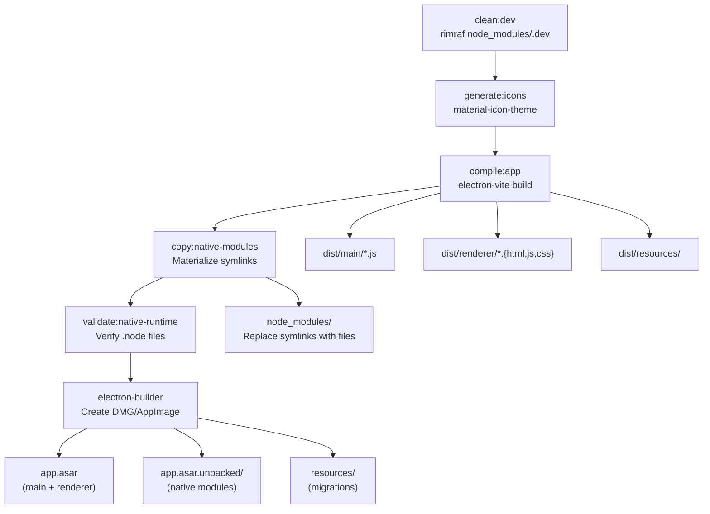
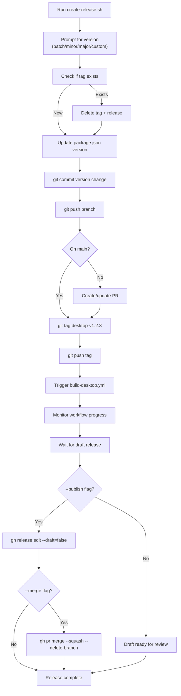

# Development Guide

<details>
<summary>Relevant source files</summary>

The following files were used as context for generating this wiki page:

- [.github/actions/merge-mac-manifests/action.yml](.github/actions/merge-mac-manifests/action.yml)
- [.github/actions/merge-mac-manifests/merge-mac-manifests.mjs](.github/actions/merge-mac-manifests/merge-mac-manifests.mjs)
- [.github/workflows/build-desktop.yml](.github/workflows/build-desktop.yml)
- [.github/workflows/release-desktop-canary.yml](.github/workflows/release-desktop-canary.yml)
- [.github/workflows/release-desktop.yml](.github/workflows/release-desktop.yml)
- [apps/api/src/app/api/auth/desktop/connect/route.ts](apps/api/src/app/api/auth/desktop/connect/route.ts)
- [apps/desktop/BUILDING.md](apps/desktop/BUILDING.md)
- [apps/desktop/RELEASE.md](apps/desktop/RELEASE.md)
- [apps/desktop/create-release.sh](apps/desktop/create-release.sh)
- [apps/desktop/electron-builder.ts](apps/desktop/electron-builder.ts)
- [apps/desktop/electron.vite.config.ts](apps/desktop/electron.vite.config.ts)
- [apps/desktop/package.json](apps/desktop/package.json)
- [apps/desktop/scripts/copy-native-modules.ts](apps/desktop/scripts/copy-native-modules.ts)
- [apps/desktop/src/main/env.main.ts](apps/desktop/src/main/env.main.ts)
- [apps/desktop/src/main/index.ts](apps/desktop/src/main/index.ts)
- [apps/desktop/src/main/lib/auto-updater.ts](apps/desktop/src/main/lib/auto-updater.ts)
- [apps/desktop/src/renderer/env.renderer.ts](apps/desktop/src/renderer/env.renderer.ts)
- [apps/desktop/src/renderer/index.html](apps/desktop/src/renderer/index.html)
- [apps/desktop/vite/helpers.ts](apps/desktop/vite/helpers.ts)
- [apps/web/src/app/auth/desktop/success/page.tsx](apps/web/src/app/auth/desktop/success/page.tsx)
- [biome.jsonc](biome.jsonc)
- [bun.lock](bun.lock)
- [package.json](package.json)
- [packages/ui/package.json](packages/ui/package.json)
- [scripts/lint.sh](scripts/lint.sh)

</details>

This guide covers setting up the Superset development environment, running development servers, building applications, and understanding the monorepo structure. For deployment and CI/CD workflows, see [Deployment Pipeline](#3.3). For desktop app release procedures, see [Build and Release System](#2.2) and [Auto-Update System](#2.3).

---

## Workspace Organization

The Superset repository is a Bun workspace monorepo managed by Turborepo. All packages share dependencies through workspace linking, with Bun 1.3+ using isolated installs that store packages in `node_modules/.bun/`.

### Directory Structure



**Sources:** [package.json:43-46](), [bun.lock:4-887]()

### Workspace Dependencies

Workspace packages are linked using the `workspace:*` protocol. The root [package.json:48-51]() defines dependency overrides for custom Mastra builds:

```typescript
// Custom Mastra fork with Superset patches
"mastracode": "https://github.com/superset-sh/mastra/releases/download/mastracode-v0.4.0-superset.12/mastracode-0.4.0-superset.12.tgz"
```

Desktop app workspace dependencies include:

| Package                  | Purpose                                        |
| ------------------------ | ---------------------------------------------- |
| `@superset/local-db`     | SQLite schema and migrations                   |
| `@superset/chat`         | AI chat integration with Mastra                |
| `@superset/ui`           | Shared React components                        |
| `@superset/trpc`         | Type-safe API client types                     |
| `@superset/host-service` | Local HTTP/tRPC server per workspace           |
| `@superset/workspace-fs` | File system utilities for workspace operations |
| `@superset/desktop-mcp`  | Model Context Protocol server                  |

**Sources:** [apps/desktop/package.json:83-93](), [bun.lock:111-328]()

---

## Setup and Installation

### Prerequisites

- **Bun 1.3.6** - Package manager and runtime ([package.json:16]())
- **Node.js 24+** - Required for Electron and some build tools
- **Git** - Version control
- **GitHub CLI (`gh`)** - Optional, for release automation

### Initial Setup

```bash
# Clone repository
git clone https://github.com/superset-sh/superset.git
cd superset

# Install dependencies (uses bun.lock)
bun install --frozen

# Run postinstall scripts (automated)
# - Applies patches from patches/ directory
# - Sets up git hooks if configured
```

The [package.json:33]() `postinstall` script runs `./scripts/postinstall.sh` automatically after dependency installation.

**Sources:** [package.json:16](), [package.json:33]()

### Environment Variables

Create a `.env` file at the monorepo root:

```bash
# Required for desktop development
SKIP_ENV_VALIDATION=1  # Skip validation during local dev

# Optional - Production API URLs (defaults work for local dev)
NEXT_PUBLIC_API_URL=https://api.superset.sh
NEXT_PUBLIC_WEB_URL=https://app.superset.sh
NEXT_PUBLIC_ELECTRIC_URL=https://electric-proxy.avi-6ac.workers.dev

# Optional - Analytics
NEXT_PUBLIC_POSTHOG_KEY=your_key_here
NEXT_PUBLIC_POSTHOG_HOST=https://us.i.posthog.com

# Optional - Error tracking
SENTRY_DSN_DESKTOP=your_dsn_here
```

Environment variables are validated using `@t3-oss/env-core` with Zod schemas:

- **Main process:** [apps/desktop/src/main/env.main.ts:12-52]() validates Node.js env vars
- **Renderer process:** [apps/desktop/src/renderer/env.renderer.ts:14-62]() validates browser-injected vars

Vite injects renderer env vars at build time via `define` in [electron.vite.config.ts:161-208]().

**Sources:** [apps/desktop/src/main/env.main.ts:1-53](), [apps/desktop/src/renderer/env.renderer.ts:1-63](), [electron.vite.config.ts:50-97]()

### Workspace-Specific Setup

Desktop app setup after initial `bun install`:

```bash
cd apps/desktop

# Clean dev artifacts
bun run clean:dev

# Generate file type icons from material-icon-theme
bun run generate:icons

# Generate TanStack Router routes
bun run generate:routes
```

**Sources:** [apps/desktop/package.json:16-35]()

---

## Development Workflow

### Starting Development Servers



**Primary development command** (runs desktop, API, web, and proxy):

```bash
bun run dev
```

This executes [package.json:19]():

```bash
turbo run dev dev:caddy --filter=@superset/api --filter=@superset/web --filter=@superset/desktop --filter=electric-proxy --filter=//
```

**Sources:** [package.json:19]()

### Desktop App Development

Desktop uses `electron-vite` for fast HMR and automatic process reloading:

```bash
cd apps/desktop

# Start with env validation skipped
SKIP_ENV_VALIDATION=1 bun run dev

# Runs: cross-env NODE_ENV=development electron-vite dev --watch
```

The [apps/desktop/package.json:20-21]() `predev` script runs before `dev`:

1. Cleans dev artifacts via `clean:dev`
2. Generates file icons via `generate:icons`
3. Patches macOS launch services via `clean-launch-services.ts`
4. Patches deep linking protocol via `patch-dev-protocol.ts`

Vite dev server configuration ([electron.vite.config.ts:211-214]()):

```typescript
server: {
  port: DEV_SERVER_PORT,  // From DESKTOP_VITE_PORT env var
  strictPort: false,
}
```

**Sources:** [apps/desktop/package.json:20-21](), [electron.vite.config.ts:211-214]()

### Development Build Outputs



The [electron.vite.config.ts:99-118]() main process build configuration creates five entry points:

| Entry             | Source                                     | Purpose                          |
| ----------------- | ------------------------------------------ | -------------------------------- |
| `index`           | `src/main/index.ts`                        | Main Electron process            |
| `terminal-host`   | `src/main/terminal-host/index.ts`          | Terminal daemon subprocess       |
| `pty-subprocess`  | `src/main/terminal-host/pty-subprocess.ts` | PTY subprocess wrapper           |
| `git-task-worker` | `src/main/git-task-worker.ts`              | Worker thread for Git operations |
| `host-service`    | `src/main/host-service/index.ts`           | Local HTTP/tRPC server           |

**Sources:** [electron.vite.config.ts:99-118](), [vite/helpers.ts:26-51]()

### Hot Module Replacement

- **Renderer process:** Full HMR with React Fast Refresh
- **Main process:** Automatic restart on file changes
- **Preload script:** Automatic reload on changes

TanStack Router enables automatic code splitting per route ([electron.vite.config.ts:217-226]()):

```typescript
tanstackRouter({
  target: 'react',
  routesDirectory: resolve('src/renderer/routes'),
  generatedRouteTree: resolve('src/renderer/routeTree.gen.ts'),
  autoCodeSplitting: true,
  routeFileIgnorePattern: '^(?!(__root|page|layout)\\.tsx$).*\\.(tsx?|jsx?)$',
})
```

**Sources:** [electron.vite.config.ts:217-226]()

---

## Building and Testing

### Type Checking

```bash
# Check all workspaces
bun run typecheck

# Runs: turbo typecheck
```

Desktop app type checking requires route generation first ([apps/desktop/package.json:33-34]()):

```bash
cd apps/desktop
bun run pretypecheck  # Generates icons and routes
bun run typecheck     # tsc --noEmit
```

**Sources:** [package.json:31](), [apps/desktop/package.json:33-34]()

### Linting and Formatting

Biome is configured in [biome.jsonc:1-58]() with custom rules:

```bash
# Lint all files (fails on any diagnostic)
bun run lint

# Auto-fix issues
bun run lint:fix

# Format only
bun run format
```

The [scripts/lint.sh:1-17]() wrapper fails on any Biome diagnostic (errors, warnings, or info).

Renderer process has special import restrictions ([biome.jsonc:32-55]()):

```jsonc
{
  "overrides": [
    {
      "includes": ["apps/desktop/src/renderer/**"],
      "linter": {
        "rules": {
          "style": {
            "noRestrictedImports": {
              "level": "error",
              "options": {
                "paths": {
                  "@superset/workspace-fs/host": "Renderer code must stay browser-compatible...",
                  "@superset/workspace-fs/server": "Renderer code must stay browser-compatible...",
                },
                "patterns": [
                  {
                    "group": ["node:*"],
                    "message": "Renderer code must not import Node builtins.",
                  },
                ],
              },
            },
          },
        },
      },
    },
  ],
}
```

**Sources:** [package.json:26-30](), [scripts/lint.sh:1-17](), [biome.jsonc:32-55]()

### Testing

```bash
# Run all tests
bun run test

# Runs: turbo test
```

Desktop app uses Bun's built-in test runner ([apps/desktop/package.json:35]()):

```bash
cd apps/desktop
bun test
```

**Sources:** [package.json:25](), [apps/desktop/package.json:35]()

### Building Desktop App



Full build process ([apps/desktop/package.json:25-28]()):

```bash
cd apps/desktop

# 1. prebuild hook runs:
bun run clean:dev
bun run generate:icons
bun run compile:app            # electron-vite build
bun run copy:native-modules    # Materialize Bun symlinks
bun run validate:native-runtime # Verify native modules

# 2. build runs:
bun run build                  # electron-builder --publish never
```

**Sources:** [apps/desktop/package.json:25-28]()

### Native Module Handling

Electron cannot follow Bun 1.3+ symlinks in `node_modules/`. The [apps/desktop/scripts/copy-native-modules.ts:1-383]() script:

1. Detects symlinked packages in `node_modules/`
2. Resolves them to real paths in `node_modules/.bun/`
3. Replaces symlinks with actual file copies
4. Handles cross-compilation by fetching missing platform packages from npm

Modules requiring materialization ([apps/desktop/runtime-dependencies.ts]() - not shown in files but referenced):

- `better-sqlite3` - SQLite native bindings
- `node-pty` - PTY native bindings
- `libsql` - Platform-specific SQLite implementation
- `@ast-grep/napi` - AST parsing native module
- `@parcel/watcher` - File system watcher native module

**Sources:** [apps/desktop/scripts/copy-native-modules.ts:1-383]()

### Electron Builder Configuration

[electron-builder.ts:22-153]() defines packaging rules:

```typescript
// ASAR archive configuration
asar: true,
asarUnpack: [
  ...packagedAsarUnpackGlobs,
  "**/resources/sounds/**/*",     // External audio playback
  "**/resources/tray/**/*",       // Tray icon loading
]

// Extra resources outside asar (for drizzle-orm file access)
extraResources: [
  { from: "dist/resources/migrations", to: "resources/migrations" },
  { from: "dist/resources/host-migrations", to: "resources/host-migrations" },
]
```

macOS-specific configuration ([electron-builder.ts:90-117]()):

- **Hardened Runtime:** Enabled for notarization
- **Entitlements:** Microphone, local network, Apple Events permissions
- **Notarization:** Automatic via `APPLE_ID`, `APPLE_APP_SPECIFIC_PASSWORD`, `APPLE_TEAM_ID`

**Sources:** [electron-builder.ts:22-153]()

### CI/CD Build Matrix

GitHub Actions workflow [.github/workflows/build-desktop.yml:32-156]() builds:

| Platform | Architectures | Outputs                     |
| -------- | ------------- | --------------------------- |
| macOS    | arm64, x64    | `.dmg`, `.zip`, `*-mac.yml` |
| Linux    | x64           | `.AppImage`, `*-linux.yml`  |

The workflow:

1. Checks out code
2. Installs Bun 1.3.2 (pinned)
3. Runs `bun install --frozen`
4. Compiles with `electron-vite`
5. Packages with `electron-builder`
6. Uploads artifacts (DMG, ZIP, AppImage, update manifests)

**Sources:** [.github/workflows/build-desktop.yml:32-156]()

### Auto-Update Manifest Merging

macOS builds produce separate manifests for arm64 and x64. The [.github/actions/merge-mac-manifests/merge-mac-manifests.mjs:1-279]() script:

1. Parses `*-arm64-mac.yml` and `*-x64-mac.yml`
2. Merges file entries from both architectures
3. Uses arm64 as canonical base (version, path, sha512)
4. Writes unified `latest-mac.yml` with both architectures

This allows electron-updater to fetch the correct binary for the running architecture.

**Sources:** [.github/actions/merge-mac-manifests/merge-mac-manifests.mjs:1-279](), [.github/actions/merge-mac-manifests/action.yml:1-43]()

---

## Release Process

### Desktop Release Automation

The [apps/desktop/create-release.sh:1-460]() script automates releases:

```bash
cd apps/desktop

# Interactive version selection
./create-release.sh

# Explicit version
./create-release.sh 1.2.3

# Auto-publish (skip draft review)
./create-release.sh 1.2.3 --publish

# Auto-publish and merge PR
./create-release.sh --publish --merge
```

**Release workflow:**



The script uses GitHub CLI (`gh`) to:

- Find previous release tags ([create-release.sh:120-129]())
- Delete existing releases for republishing ([create-release.sh:230-244]())
- Create/update pull requests ([create-release.sh:296-317]())
- Monitor workflow progress ([create-release.sh:339-388]())
- Publish releases ([create-release.sh:417-431]())

**Sources:** [apps/desktop/create-release.sh:1-460]()

### Release Channels

Two release channels are supported:

**Stable** ([.github/workflows/release-desktop.yml:1-147]()):

- Triggered by: Git tags matching `desktop-v*.*.*`
- Update feed: `https://github.com/superset-sh/superset/releases/latest/download`
- Manifest: `latest-mac.yml`, `latest-linux.yml`
- Example version: `1.2.0`

**Canary** ([.github/workflows/release-desktop-canary.yml:1-158]()):

- Triggered by: Schedule (every 12 hours) or manual dispatch
- Update feed: `https://github.com/superset-sh/superset/releases/download/desktop-canary`
- Manifest: `canary-mac.yml`, `canary-linux.yml`, `latest-mac.yml`, `latest-linux.yml`
- Example version: `1.2.0-canary.20241225120000`
- Only builds if changes detected since last canary ([.github/workflows/release-desktop-canary.yml:35-68]())

Auto-updater detects channel via semver prerelease component ([apps/desktop/src/main/lib/auto-updater.ts:17-23]()):

```typescript
function isPrereleaseBuild(): boolean {
  const version = app.getVersion()
  const prereleaseComponents = prerelease(version)
  return prereleaseComponents !== null && prereleaseComponents.length > 0
}
```

**Sources:** [.github/workflows/release-desktop.yml:1-147](), [.github/workflows/release-desktop-canary.yml:1-158](), [apps/desktop/src/main/lib/auto-updater.ts:17-23]()

### Local Build Testing

Test packaging locally without publishing:

```bash
cd apps/desktop

# Clean and compile
bun run clean:dev
bun run compile:app

# Package without publishing
bun run package -- --publish never --config electron-builder.ts

# Outputs: release/*.dmg, release/*.AppImage, release/*-mac.yml, release/*-linux.yml
```

Verify auto-update manifests exist:

```bash
ls -la release/*.AppImage      # Linux binary
ls -la release/*-linux.yml     # Linux update manifest
ls -la release/*.dmg           # macOS binary
ls -la release/*-mac.yml       # macOS update manifest
```

**Sources:** [apps/desktop/BUILDING.md:1-39](), [apps/desktop/RELEASE.md:73-81]()

---

## Common Development Tasks

### Adding Dependencies

```bash
# Add to desktop app
cd apps/desktop
bun add some-package

# Add to workspace package
cd packages/ui
bun add --dev some-dev-package

# Add to root (for tooling)
bun add --dev --cwd . some-tool
```

After adding dependencies, re-run `bun install` at root to update the lockfile.

### Debugging

**Main process:**

1. Start with `bun run dev`
2. Attach VSCode debugger to Electron process
3. Set breakpoints in `src/main/` files

**Renderer process:**

1. Press `Cmd+Option+I` (macOS) or `Ctrl+Shift+I` (Linux) to open DevTools
2. Use React DevTools extension (auto-loaded in dev mode)
3. Set breakpoints in `src/renderer/` files

**Terminal daemon:**

1. Add `console.log()` to `src/main/terminal-host/index.ts`
2. Check logs in main process console (not renderer DevTools)
3. Daemon stdout/stderr goes to main process

**Sources:** [apps/desktop/src/main/index.ts:1-367]()

### Working with Database Migrations

```bash
# Generate desktop local DB migrations (Drizzle + SQLite)
bun run db:generate:desktop

# Apply cloud DB migrations (Drizzle + Neon PostgreSQL)
bun run db:migrate

# Push schema changes to cloud DB
bun run db:push
```

Migrations are stored outside the asar archive so Drizzle can read them at runtime:

- Desktop local DB: `dist/resources/migrations/` → `resources/migrations/` (via [electron-builder.ts:57-62]())
- Host service DB: `dist/resources/host-migrations/` → `resources/host-migrations/` (via [electron-builder.ts:63-67]())

**Sources:** [package.json:38-40](), [electron-builder.ts:57-67]()

### Code Inspector

Press `Alt` + click on any UI element to jump to its source code in your editor. Configured in [electron.vite.config.ts:229-234]():

```typescript
codeInspectorPlugin({
  bundler: 'vite',
  hotKeys: ['altKey'],
  hideConsole: true,
})
```

**Sources:** [electron.vite.config.ts:229-234]()
