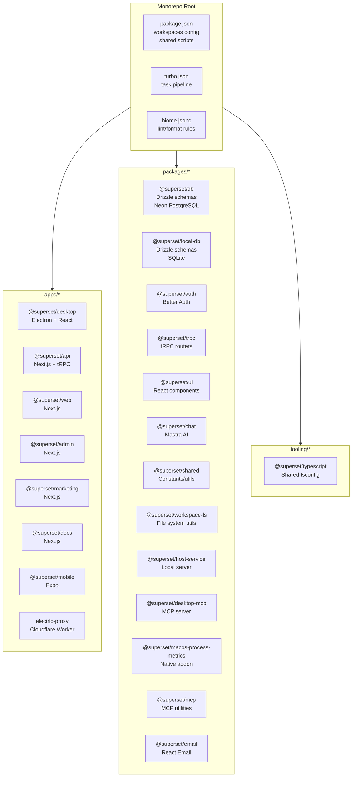
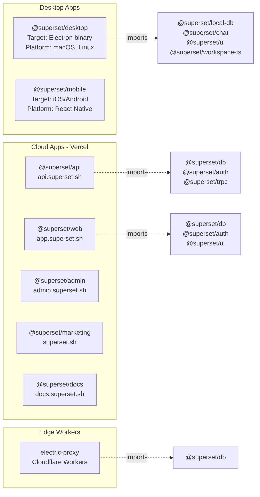
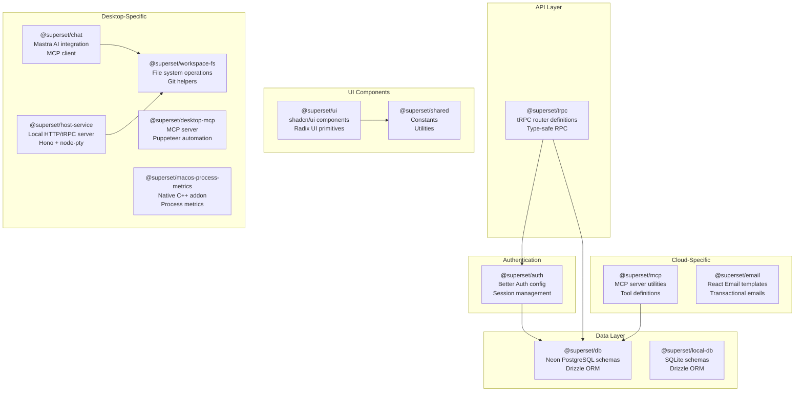
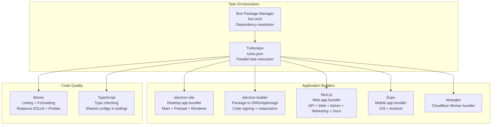
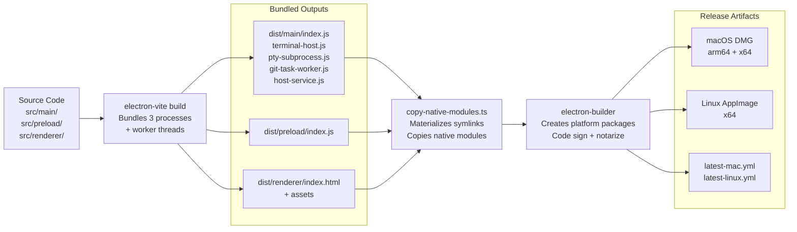
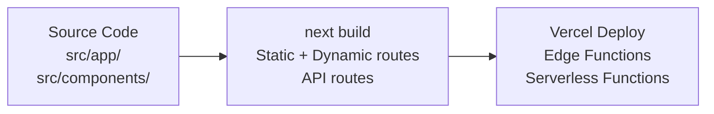
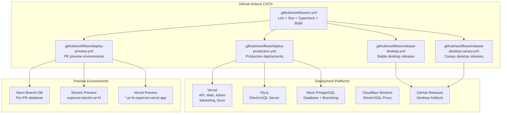
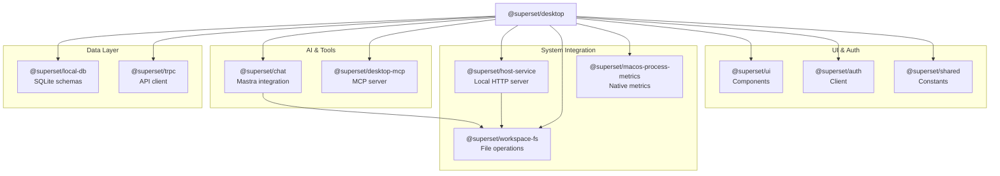
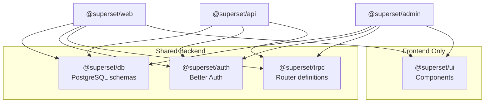

# Monorepo Structure

<details>
<summary>Relevant source files</summary>

The following files were used as context for generating this wiki page:

- [.github/actions/merge-mac-manifests/action.yml](.github/actions/merge-mac-manifests/action.yml)
- [.github/actions/merge-mac-manifests/merge-mac-manifests.mjs](.github/actions/merge-mac-manifests/merge-mac-manifests.mjs)
- [.github/templates/cleanup-comment.md](.github/templates/cleanup-comment.md)
- [.github/templates/preview-comment.md](.github/templates/preview-comment.md)
- [.github/workflows/build-desktop.yml](.github/workflows/build-desktop.yml)
- [.github/workflows/ci.yml](.github/workflows/ci.yml)
- [.github/workflows/cleanup-preview.yml](.github/workflows/cleanup-preview.yml)
- [.github/workflows/deploy-preview.yml](.github/workflows/deploy-preview.yml)
- [.github/workflows/deploy-production.yml](.github/workflows/deploy-production.yml)
- [.github/workflows/release-desktop-canary.yml](.github/workflows/release-desktop-canary.yml)
- [.github/workflows/release-desktop.yml](.github/workflows/release-desktop.yml)
- [apps/admin/src/trpc/react.tsx](apps/admin/src/trpc/react.tsx)
- [apps/api/package.json](apps/api/package.json)
- [apps/api/src/app/api/auth/desktop/connect/route.ts](apps/api/src/app/api/auth/desktop/connect/route.ts)
- [apps/api/src/app/api/electric/[...path]/route.ts](apps/api/src/app/api/electric/[...path]/route.ts)
- [apps/api/src/app/api/electric/[...path]/utils.ts](apps/api/src/app/api/electric/[...path]/utils.ts)
- [apps/api/src/env.ts](apps/api/src/env.ts)
- [apps/api/src/proxy.ts](apps/api/src/proxy.ts)
- [apps/api/src/trpc/context.ts](apps/api/src/trpc/context.ts)
- [apps/desktop/BUILDING.md](apps/desktop/BUILDING.md)
- [apps/desktop/RELEASE.md](apps/desktop/RELEASE.md)
- [apps/desktop/create-release.sh](apps/desktop/create-release.sh)
- [apps/desktop/electron-builder.ts](apps/desktop/electron-builder.ts)
- [apps/desktop/electron.vite.config.ts](apps/desktop/electron.vite.config.ts)
- [apps/desktop/package.json](apps/desktop/package.json)
- [apps/desktop/scripts/copy-native-modules.ts](apps/desktop/scripts/copy-native-modules.ts)
- [apps/desktop/src/main/env.main.ts](apps/desktop/src/main/env.main.ts)
- [apps/desktop/src/main/index.ts](apps/desktop/src/main/index.ts)
- [apps/desktop/src/main/lib/auto-updater.ts](apps/desktop/src/main/lib/auto-updater.ts)
- [apps/desktop/src/renderer/env.renderer.ts](apps/desktop/src/renderer/env.renderer.ts)
- [apps/desktop/src/renderer/index.html](apps/desktop/src/renderer/index.html)
- [apps/desktop/src/renderer/routes/\_authenticated/providers/CollectionsProvider/CollectionsProvider.tsx](apps/desktop/src/renderer/routes/_authenticated/providers/CollectionsProvider/CollectionsProvider.tsx)
- [apps/desktop/src/renderer/routes/\_authenticated/providers/CollectionsProvider/collections.ts](apps/desktop/src/renderer/routes/_authenticated/providers/CollectionsProvider/collections.ts)
- [apps/desktop/vite/helpers.ts](apps/desktop/vite/helpers.ts)
- [apps/web/src/app/auth/desktop/success/page.tsx](apps/web/src/app/auth/desktop/success/page.tsx)
- [apps/web/src/trpc/react.tsx](apps/web/src/trpc/react.tsx)
- [biome.jsonc](biome.jsonc)
- [bun.lock](bun.lock)
- [fly.toml](fly.toml)
- [package.json](package.json)
- [packages/ui/package.json](packages/ui/package.json)
- [scripts/lint.sh](scripts/lint.sh)

</details>

This document describes the organization of the Superset monorepo, including workspace layout, package interdependencies, build tooling, and deployment targets. It provides a technical overview of how applications and shared packages are structured and connected.

For information about development workflows and build commands, see [Setup and Installation](#4.2) and [Development Workflow](#4.3). For application-specific architecture, see [Desktop Application](#2) and [Backend Services](#3).

---

## Workspace Organization

The repository uses **Bun workspaces** with **Turborepo** for task orchestration. The workspace is divided into three top-level directories defined in [package.json:43-47]():

| Directory    | Purpose                                  | Managed By                           |
| ------------ | ---------------------------------------- | ------------------------------------ |
| `apps/*`     | Deployable applications                  | Turborepo + individual build configs |
| `packages/*` | Shared libraries and utilities           | Turborepo                            |
| `tooling/*`  | Development tooling (TypeScript configs) | N/A                                  |

**Package Manager Configuration:**

- **Runtime**: Bun 1.3.6 ([package.json:16]())
- **Workspace Protocol**: `workspace:*` for internal dependencies
- **Lock File**: `bun.lock` (Bun's native lock format)

**Monorepo Orchestration:**

- **Task Runner**: Turborepo 2.8.7 ([package.json:11]())
- **Code Quality**: Biome 2.4.2 for linting and formatting ([package.json:8]())
- **Dependency Validation**: Sherif 1.10.0 ([package.json:10]())

### Workspace Diagram



**Sources:** [package.json:1-57](), [bun.lock:1-13]()

---

## Applications

The monorepo contains 8 distinct applications, each with independent deployment targets and build configurations.

### Applications Overview



### Application Details

| Application           | Framework                              | Build Tool                       | Deployment                     | Key Dependencies                 |
| --------------------- | -------------------------------------- | -------------------------------- | ------------------------------ | -------------------------------- |
| `@superset/desktop`   | Electron 40.2.1 + React 19.2.0         | electron-vite + electron-builder | GitHub Releases (DMG/AppImage) | local-db, chat, ui, workspace-fs |
| `@superset/api`       | Next.js 16.0.10                        | Next.js                          | Vercel (Edge)                  | db, auth, trpc, mcp              |
| `@superset/web`       | Next.js 16.0.10                        | Next.js                          | Vercel (Edge)                  | db, auth, ui, trpc               |
| `@superset/admin`     | Next.js 16.0.10                        | Next.js                          | Vercel (Edge)                  | db, auth, ui, trpc               |
| `@superset/marketing` | Next.js 16.0.10                        | Next.js                          | Vercel (Edge)                  | auth, ui                         |
| `@superset/docs`      | Next.js 16.0.10 + Fumadocs             | Next.js                          | Vercel (Edge)                  | shared                           |
| `@superset/mobile`    | Expo 55.0.0-beta + React Native 0.83.1 | Expo                             | iOS/Android                    | db, trpc                         |
| `electric-proxy`      | Cloudflare Worker                      | Wrangler                         | Cloudflare Workers             | db                               |

**Sources:** [apps/desktop/package.json:1-251](), [apps/api/package.json:1-62](), [bun.lock:14-571]()

---

## Shared Packages

Shared packages provide reusable functionality across applications. They follow the `workspace:*` protocol for version resolution.

### Package Dependency Graph



### Package Exports and Dependencies

#### Core Data Packages

**`@superset/db`** ([packages/db/package.json]())

- **Purpose**: Shared database schema for Neon PostgreSQL
- **Tech**: Drizzle ORM 0.45.1, Neon serverless driver
- **Exports**: Schema definitions, migration utilities
- **Used By**: API, Web, Admin, Mobile, electric-proxy, MCP

**`@superset/local-db`** ([packages/local-db/package.json]())

- **Purpose**: SQLite schema for Desktop app local storage
- **Tech**: Drizzle ORM 0.45.1
- **Exports**: Schema definitions for settings, projects, tabs, workspaces
- **Used By**: Desktop only

#### Authentication & API

**`@superset/auth`** ([packages/auth/package.json]())

- **Purpose**: Authentication configuration and session management
- **Tech**: Better Auth 1.4.18, Stripe integration
- **Exports**: `auth` instance, session utilities
- **Dependencies**: `@superset/db`, `@superset/email`
- **Used By**: API, Web, Admin, Marketing

**`@superset/trpc`** ([packages/trpc/package.json]())

- **Purpose**: Type-safe RPC router definitions
- **Tech**: tRPC 11.7.1, SuperJSON
- **Exports**: `AppRouter` type, router factories
- **Dependencies**: `@superset/auth`, `@superset/db`
- **Used By**: API, Web, Admin, Desktop, Mobile

#### UI & Utilities

**`@superset/ui`** ([packages/ui/package.json:1-93]())

- **Purpose**: Shared React component library
- **Tech**: Radix UI, shadcn/ui patterns, React 19.2.0
- **Exports**: 50+ UI components, hooks, utilities
- **Key Exports**:
  - `./globals.css` - Tailwind CSS base
  - `./*` - UI components (Button, Dialog, etc.)
  - `./hooks/*` - React hooks
  - `./ai-elements/*` - AI-specific components
- **Used By**: Desktop, Web, Admin, Marketing

**`@superset/shared`** ([packages/shared/package.json]())

- **Purpose**: Constants and utilities shared across all apps
- **Tech**: Zod for validation
- **Exports**: Feature flags, constants, type utilities
- **Used By**: All applications

#### Desktop-Specific Packages

**`@superset/chat`** ([packages/chat/package.json]())

- **Purpose**: AI chat integration using Mastra framework
- **Tech**: Mastra 1.3.0, Anthropic/OpenAI SDKs
- **Exports**: Chat router, MCP client, AI tools
- **Dependencies**: `@superset/trpc`, `@superset/workspace-fs`
- **Used By**: Desktop only

**`@superset/workspace-fs`** ([packages/workspace-fs/package.json]())

- **Purpose**: File system operations for workspace management
- **Tech**: Parcel Watcher, fast-glob, Fuse.js
- **Exports**: File search, Git utilities, watcher
- **Used By**: Desktop, Chat

**`@superset/host-service`** ([packages/host-service/package.json]())

- **Purpose**: Local HTTP/tRPC server for per-org workspace services
- **Tech**: Hono, node-pty, simple-git
- **Exports**: Server factory, terminal management
- **Used By**: Desktop (spawned as subprocess)

**`@superset/desktop-mcp`** ([packages/desktop-mcp/package.json]())

- **Purpose**: MCP server for desktop automation
- **Tech**: MCP SDK, Puppeteer
- **Exports**: CLI binary at `./src/bin.ts`
- **Used By**: Desktop (spawned as subprocess)

**`@superset/macos-process-metrics`** ([packages/macos-process-metrics/package.json]())

- **Purpose**: Native C++ addon for macOS process metrics
- **Tech**: node-addon-api
- **Used By**: Desktop (macOS only)

#### Cloud-Specific Packages

**`@superset/mcp`** ([packages/mcp/package.json]())

- **Purpose**: MCP server utilities for cloud API
- **Tech**: MCP SDK
- **Dependencies**: `@superset/db`, `@superset/shared`
- **Used By**: API

**`@superset/email`** ([packages/email/package.json]())

- **Purpose**: Transactional email templates
- **Tech**: React Email, Tailwind CSS
- **Exports**: Email components and templates
- **Used By**: Auth package

**Sources:** [bun.lock:572-883](), [packages/ui/package.json:1-93]()

---

## Build System Architecture

The monorepo uses a multi-layered build system with different tools for different targets.

### Build Tool Chain



### Build Configurations by Application

#### Desktop App Build Chain

The Desktop app has the most complex build pipeline with multiple stages:



**electron-vite Configuration** ([apps/desktop/electron.vite.config.ts:1-265]())

- **Main Process**: Bundles 5 entry points (index, terminal-host, pty-subprocess, git-task-worker, host-service)
- **Preload Process**: Single entry point with context isolation
- **Renderer Process**: React + Vite with Tanstack Router code-splitting

**electron-builder Configuration** ([apps/desktop/electron-builder.ts:1-154]())

- **ASAR Packing**: Native modules unpacked ([electron-builder.ts:47-53]())
- **Extra Resources**: Database migrations, sounds, tray icons ([electron-builder.ts:56-68]())
- **Platform Configs**: macOS (notarization), Linux (AppImage), Windows (NSIS)

**Native Module Handling** ([apps/desktop/scripts/copy-native-modules.ts:1-300]())

- Detects Bun workspace symlinks
- Materializes symlinks to actual files for electron-builder
- Handles platform-specific native binaries (better-sqlite3, node-pty)

#### Cloud App Build Chain

All Next.js apps follow the same pattern:



**Next.js Apps:**

- **API** ([apps/api/package.json:1-62]()): tRPC endpoints, auth callbacks, webhooks
- **Web** ([apps/web/package.json]()): Main user interface
- **Admin**: Internal admin dashboard
- **Marketing**: Public marketing site
- **Docs**: Documentation site using Fumadocs

**Sources:** [apps/desktop/electron.vite.config.ts:1-265](), [apps/desktop/electron-builder.ts:1-154](), [apps/desktop/scripts/copy-native-modules.ts:1-300]()

---

## Development Workflow

### Common Development Commands

Root-level commands defined in [package.json:18-41]():

| Command             | Purpose                                    | Execution      |
| ------------------- | ------------------------------------------ | -------------- |
| `bun dev`           | Start desktop + API + web + electric-proxy | Turbo parallel |
| `bun dev:all`       | Start all apps                             | Turbo parallel |
| `bun dev:docs`      | Start docs site                            | Turbo filter   |
| `bun dev:marketing` | Start marketing + docs                     | Turbo filter   |
| `bun build`         | Build desktop app                          | Turbo filter   |
| `bun test`          | Run all tests                              | Turbo          |
| `bun lint`          | Run Biome linter                           | Shell script   |
| `bun typecheck`     | Type check all packages                    | Turbo          |

### Desktop-Specific Commands

Desktop app commands in [apps/desktop/package.json:16-36]():

| Command                   | Purpose                                     | Notes                             |
| ------------------------- | ------------------------------------------- | --------------------------------- |
| `bun predev`              | Clean + generate icons + patch dev protocol | Pre-dev setup                     |
| `bun dev`                 | Start Electron in dev mode with watch       | Hot reload enabled                |
| `bun compile:app`         | Bundle with electron-vite                   | Build without packaging           |
| `bun copy:native-modules` | Materialize symlinks                        | Required before packaging         |
| `bun prebuild`            | Full pre-build pipeline                     | Clean + compile + copy + validate |
| `bun build`               | Package to DMG/AppImage                     | Uses electron-builder             |
| `bun release`             | Build + publish to GitHub                   | electron-builder publish          |

### Dependency Management

**Installation:**

```bash
bun install --frozen  # Use lockfile exactly (CI mode)
bun install           # Update dependencies
```

**Workspace Dependencies:**

- Internal packages use `workspace:*` protocol
- Bun resolves to local packages during development
- Published packages (for mobile) use actual versions

**Version Resolutions** ([package.json:48-51]())

- Custom Mastra builds pinned to GitHub releases
- Patched dependencies in `patches/` directory

**Sources:** [package.json:18-41](), [apps/desktop/package.json:16-36]()

---

## Deployment Architecture

Each application has a distinct deployment target and CI/CD pipeline.

### Deployment Targets



### CI/CD Workflows

#### Pull Request Preview Flow

[.github/workflows/deploy-preview.yml:1-699]() implements a full-stack preview environment:

1. **Database**: Create Neon branch from main database
2. **ElectricSQL**: Deploy to Fly.io with PR-specific app name
3. **API**: Deploy to Vercel with preview URL
4. **Web/Admin/Marketing/Docs**: Deploy to Vercel with preview URLs
5. **Comment**: Post deployment status to PR

**Preview URLs:**

- Database: `neon-branch-{pr-number}`
- Electric: `https://superset-electric-pr-{pr-number}.fly.dev`
- API: `https://api-pr-{pr-number}-superset.vercel.app`
- Web: `https://web-pr-{pr-number}-superset.vercel.app`

**Cleanup** ([.github/workflows/cleanup-preview.yml:1-70]()): Automatically deletes all preview resources when PR closes

#### Production Deployment Flow

[.github/workflows/deploy-production.yml:1-541]() deploys on merge to `main`:

1. **Database Migrations**: Run Drizzle migrations on production Neon
2. **API**: Deploy to `api.superset.sh`
3. **Web**: Deploy to `app.superset.sh`
4. **Marketing**: Deploy to `superset.sh`
5. **Admin**: Deploy to `admin.superset.sh`
6. **Docs**: Deploy to `docs.superset.sh`

#### Desktop Release Flow

**Stable Releases** ([.github/workflows/release-desktop.yml:1-147]()):

- Triggered by tags matching `desktop-v*.*.*`
- Builds for macOS (arm64 + x64) and Linux (x64)
- Creates draft GitHub release with artifacts
- Generates auto-update manifests (`latest-mac.yml`, `latest-linux.yml`)

**Canary Releases** ([.github/workflows/release-desktop-canary.yml:1-180]()):

- Runs on schedule (every 12 hours) or manual trigger
- Checks for changes since last canary
- Appends `-canary.{timestamp}` to version
- Updates rolling `desktop-canary` tag
- Separate update channel from stable

**Release Script** ([apps/desktop/create-release.sh:1-400]()):

- Interactive version selection (patch/minor/major)
- Updates `package.json` version
- Creates and pushes git tag
- Monitors GitHub Actions workflow
- Optional auto-publish and PR merge

### Platform-Specific Configuration

#### Vercel Configuration

Each Next.js app has a Vercel project ID configured as a GitHub secret. Environment variables are passed via CLI during deployment:

```bash
vercel deploy --prebuilt --archive=tgz \
  --env DATABASE_URL=$DATABASE_URL \
  --env NEXT_PUBLIC_API_URL=$NEXT_PUBLIC_API_URL \
  ...
```

#### Fly.io Configuration

ElectricSQL server configuration in [fly.toml:1-23]():

- **Image**: `electricsql/electric:1.4.13`
- **Region**: `iad` (US East)
- **Resources**: 8GB RAM, 4 CPU cores (performance)
- **Auto-scaling**: Single always-running machine

#### Electron Builder Configuration

Platform-specific packaging in [apps/desktop/electron-builder.ts:22-151]():

- **macOS**: DMG + ZIP, notarization, entitlements
- **Linux**: AppImage
- **Update Feed**: GitHub Releases with channel-specific manifests

**Sources:** [.github/workflows/deploy-preview.yml:1-699](), [.github/workflows/deploy-production.yml:1-541](), [.github/workflows/release-desktop.yml:1-147](), [.github/workflows/release-desktop-canary.yml:1-180](), [fly.toml:1-23](), [apps/desktop/electron-builder.ts:22-151]()

---

## Package Interdependencies

### Desktop App Dependencies

The desktop app has the most complex dependency graph:



**Key Dependencies** ([apps/desktop/package.json:37-218]()):

- **Database**: `@superset/local-db` (SQLite), `better-sqlite3`, `drizzle-orm`
- **Terminal**: `@xterm/xterm`, `@xterm/headless`, `node-pty`
- **Git**: `simple-git`, GitHub CLI (`gh`)
- **AI**: `@superset/chat`, `@ai-sdk/anthropic`, `@ai-sdk/openai`
- **UI**: `@superset/ui`, `react`, `react-dom`, `@tanstack/react-router`

### Cloud App Dependencies

API, Web, and Admin apps share similar dependency patterns:



**API Dependencies** ([apps/api/package.json:13-50]()):

- **Core**: `next`, `@trpc/server`, `better-auth`
- **Database**: `@superset/db`, `drizzle-orm`, `@neondatabase/serverless`
- **Integrations**: `@octokit/rest`, `@slack/web-api`, `@linear/sdk`, `stripe`

**Web/Admin Dependencies** ([apps/web/src/trpc/react.tsx:1-62](), [apps/admin/src/trpc/react.tsx:1-62]()):

- **Core**: `next`, `@trpc/tanstack-react-query`, `better-auth`
- **UI**: `@superset/ui`, `framer-motion`, `lucide-react`
- **State**: `@tanstack/react-query`, Zustand (for Desktop)

### Workspace Protocol Resolution

Internal dependencies use `workspace:*` which Bun resolves to local packages:

```json
{
  "dependencies": {
    "@superset/db": "workspace:*",
    "@superset/auth": "workspace:*",
    "@superset/ui": "workspace:*"
  }
}
```

At build time, these resolve to:

- **Development**: Symlinks to `../../packages/{package}`
- **Published (mobile)**: Actual version numbers from lockfile

**Sources:** [apps/desktop/package.json:37-218](), [apps/api/package.json:13-50](), [bun.lock:1-893]()

---

## Environment Configuration

Each application manages environment variables independently, with validation using `@t3-oss/env-*` packages.

### Environment Variable Patterns

| Pattern                           | Example                                   | Usage                             |
| --------------------------------- | ----------------------------------------- | --------------------------------- |
| `NEXT_PUBLIC_*`                   | `NEXT_PUBLIC_API_URL`                     | Client-side accessible in Next.js |
| `DATABASE_*`                      | `DATABASE_URL`, `DATABASE_URL_UNPOOLED`   | Database connection strings       |
| `ELECTRIC_*`                      | `ELECTRIC_URL`, `ELECTRIC_SECRET`         | ElectricSQL configuration         |
| `*_CLIENT_ID` / `*_CLIENT_SECRET` | `GOOGLE_CLIENT_ID`                        | OAuth provider credentials        |
| `SENTRY_*`                        | `SENTRY_DSN_DESKTOP`, `SENTRY_AUTH_TOKEN` | Error tracking                    |

### Desktop Environment Configuration

**Main Process** ([apps/desktop/src/main/env.main.ts:1-53]()):

- Uses `@t3-oss/env-core` with Node.js `process.env`
- Validates at app startup
- Supports `SKIP_ENV_VALIDATION` in development

**Renderer Process** ([apps/desktop/src/renderer/env.renderer.ts:1-54]()):

- Values injected at build time by Vite's `define` in [electron.vite.config.ts:161-209]()
- Not read from `process.env` at runtime
- Baked into bundle as string literals

### API Environment Configuration

API environment schema ([apps/api/src/env.ts:1-77]()):

- Validates 40+ environment variables
- Separate `server` and `client` schemas
- Uses `@t3-oss/env-nextjs` for Next.js integration

**Critical Variables:**

- `DATABASE_URL` / `DATABASE_URL_UNPOOLED`
- `ELECTRIC_URL` / `ELECTRIC_SECRET`
- OAuth credentials (Google, GitHub, Slack, Linear)
- `BETTER_AUTH_SECRET`
- `STRIPE_SECRET_KEY`

### Electric Proxy Authentication

The API acts as an authentication proxy for ElectricSQL ([apps/api/src/app/api/electric/[...path]/route.ts:1-75]()):

1. Authenticates user via JWT or session
2. Validates organization membership
3. Builds row-level security WHERE clause
4. Proxies request to Electric server with secret
5. Streams response back to client

**Sources:** [apps/desktop/src/main/env.main.ts:1-53](), [apps/desktop/src/renderer/env.renderer.ts:1-54](), [apps/api/src/env.ts:1-77](), [apps/api/src/app/api/electric/[...path]/route.ts:1-75]()

---

## Code Quality Tools

### Biome Configuration

Single Biome config for the entire monorepo ([biome.jsonc:1-58]()):

**Features:**

- **Linting**: Replaces ESLint with faster Rust-based linter
- **Formatting**: Replaces Prettier
- **VCS Integration**: Respects `.gitignore`
- **CSS Support**: Tailwind directives, CSS modules

**Renderer-Specific Rules** ([biome.jsonc:32-56]()):

- Forbids Node.js imports in `apps/desktop/src/renderer/**`
- Prevents file system package imports in browser code
- Ensures renderer stays browser-compatible

### TypeScript Configuration

Shared TypeScript config in `tooling/typescript`:

- Base config extends `@superset/typescript`
- Per-app `tsconfig.json` for specific paths
- Strict mode enabled across all packages

### Sherif Validation

Sherif enforces monorepo best practices:

- Validates workspace dependency versions
- Ensures consistent peer dependencies
- Detects phantom dependencies (imports without declarations)

**Run:** `bunx sherif` ([package.json:10]())

**Sources:** [biome.jsonc:1-58](), [.github/workflows/ci.yml:10-33]()
