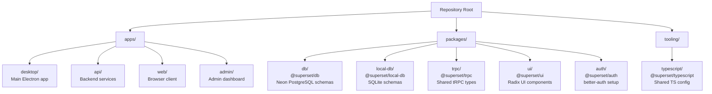
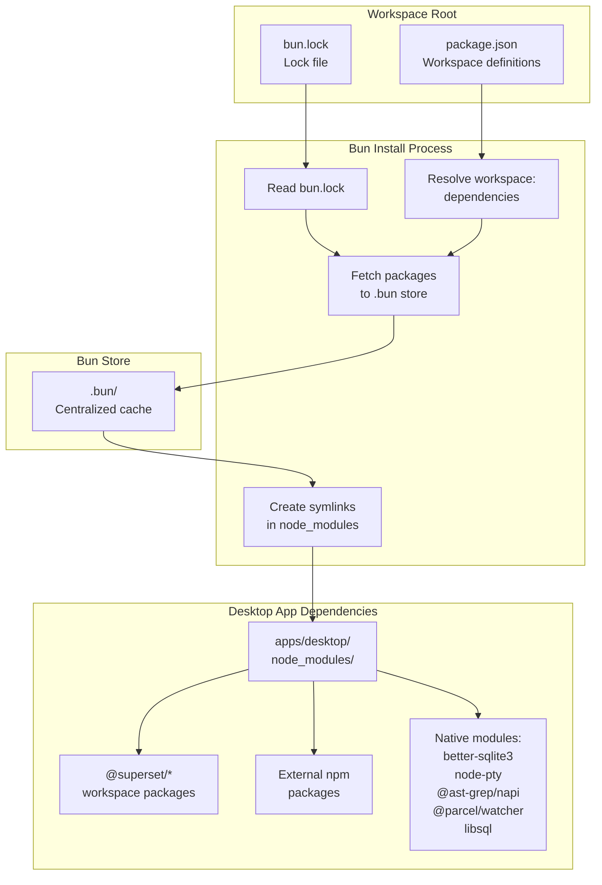
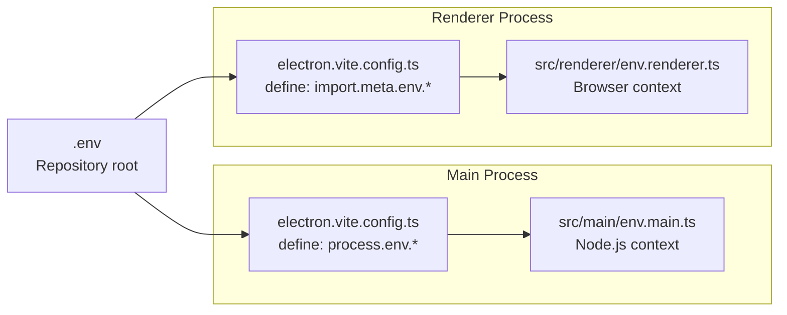
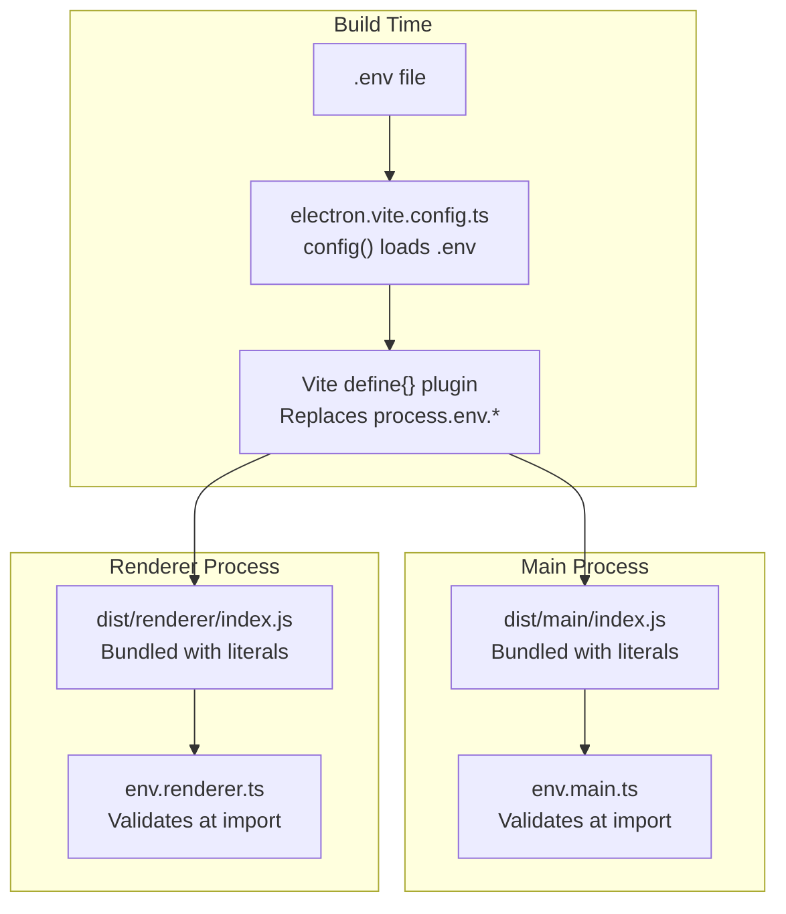

# Setup and Installation

<details>
<summary>Relevant source files</summary>

The following files were used as context for generating this wiki page:

- [.github/actions/merge-mac-manifests/action.yml](.github/actions/merge-mac-manifests/action.yml)
- [.github/actions/merge-mac-manifests/merge-mac-manifests.mjs](.github/actions/merge-mac-manifests/merge-mac-manifests.mjs)
- [.github/workflows/build-desktop.yml](.github/workflows/build-desktop.yml)
- [.github/workflows/release-desktop-canary.yml](.github/workflows/release-desktop-canary.yml)
- [.github/workflows/release-desktop.yml](.github/workflows/release-desktop.yml)
- [apps/api/src/app/api/auth/desktop/connect/route.ts](apps/api/src/app/api/auth/desktop/connect/route.ts)
- [apps/desktop/BUILDING.md](apps/desktop/BUILDING.md)
- [apps/desktop/RELEASE.md](apps/desktop/RELEASE.md)
- [apps/desktop/create-release.sh](apps/desktop/create-release.sh)
- [apps/desktop/electron-builder.ts](apps/desktop/electron-builder.ts)
- [apps/desktop/electron.vite.config.ts](apps/desktop/electron.vite.config.ts)
- [apps/desktop/package.json](apps/desktop/package.json)
- [apps/desktop/scripts/copy-native-modules.ts](apps/desktop/scripts/copy-native-modules.ts)
- [apps/desktop/src/main/env.main.ts](apps/desktop/src/main/env.main.ts)
- [apps/desktop/src/main/index.ts](apps/desktop/src/main/index.ts)
- [apps/desktop/src/main/lib/auto-updater.ts](apps/desktop/src/main/lib/auto-updater.ts)
- [apps/desktop/src/renderer/env.renderer.ts](apps/desktop/src/renderer/env.renderer.ts)
- [apps/desktop/src/renderer/index.html](apps/desktop/src/renderer/index.html)
- [apps/desktop/vite/helpers.ts](apps/desktop/vite/helpers.ts)
- [apps/web/src/app/auth/desktop/success/page.tsx](apps/web/src/app/auth/desktop/success/page.tsx)
- [biome.jsonc](biome.jsonc)
- [bun.lock](bun.lock)
- [package.json](package.json)
- [packages/ui/package.json](packages/ui/package.json)
- [scripts/lint.sh](scripts/lint.sh)

</details>


This page covers the initial setup required to develop and run the Superset desktop application locally. It includes installing prerequisites, cloning the repository, installing dependencies, and configuring environment variables. For information about running the application in development mode after setup, see [Running in Development](#4.3). For details about the build system configuration, see [Build System](#4.4).

---

## Prerequisites

### Bun Package Manager

Superset requires **Bun 1.3.2 or later** as its package manager. The monorepo uses Bun workspaces for dependency management and native module handling.

**Installation:**

```bash
# macOS/Linux (via curl)
curl -fsSL https://bun.sh/install | bash

# macOS (via Homebrew)
brew install oven-sh/bun/bun

# Windows (via PowerShell)
powershell -c "irm bun.sh/install.ps1 | iex"
```

**Verify installation:**

```bash
bun --version
# Should output 1.3.2 or later
```

The exact required version is pinned in [package.json:16]() via the `packageManager` field.

**Sources:** [package.json:16](), [.github/workflows/build-desktop.yml:48-49]()

---

## Repository Structure

The Superset monorepo uses Bun workspaces with the following layout:



**Sources:** [package.json:43-47](), [apps/desktop/package.json:83-93]()

---

## Clone Repository

```bash
git clone https://github.com/superset-sh/superset.git
cd superset
```

**Sources:** [apps/desktop/package.json:8-11]()

---

## Install Dependencies

### Using Frozen Lockfile (Recommended for CI)

```bash
bun install --frozen
```

This ensures exact dependency versions from `bun.lock` are used without modification. Used in CI workflows to guarantee reproducibility.

### Standard Installation (Development)

```bash
bun install
```

This installs all dependencies and runs postinstall scripts automatically.

**Sources:** [package.json:33](), [.github/workflows/build-desktop.yml:61]()

---

### Dependency Installation Process

The following diagram shows how Bun resolves and installs dependencies in the monorepo:



**Key Points:**

- **Workspace packages** (e.g., `@superset/local-db`) are symlinked from `packages/` to `apps/desktop/node_modules/`
- **External packages** are fetched to `node_modules/.bun/` (Bun's isolated store)
- **Native modules** require materialization before packaging (see [Native Module Handling](#native-module-handling))

**Sources:** [bun.lock:1-7](), [package.json:43-47](), [apps/desktop/runtime-dependencies.ts:33-70]()

---

### Native Module Handling

Superset uses several native Node.js addons that require special build-time treatment:

| Module | Purpose | Unpacked in ASAR |
|--------|---------|------------------|
| `better-sqlite3` | Local SQLite database | Yes |
| `node-pty` | Terminal PTY processes | Yes |
| `@ast-grep/napi` | Code search/analysis | Yes |
| `@parcel/watcher` | File system watching | Yes |
| `libsql` | Turso/libSQL database client | Yes |

These modules are **externalized** from the main bundle and must be:

1. **Materialized** from Bun's symlinks to real files before packaging
2. **Unpacked** from the ASAR archive so native bindings can be loaded at runtime

The `copy:native-modules` script handles materialization:

```bash
bun run --cwd apps/desktop copy:native-modules
```

This script ([apps/desktop/scripts/copy-native-modules.ts:1-382]()) resolves Bun symlinks and copies platform-specific binaries to `apps/desktop/node_modules/`.

**Sources:** [apps/desktop/runtime-dependencies.ts:33-70](), [apps/desktop/scripts/copy-native-modules.ts:1-382](), [apps/desktop/electron-builder.ts:46-53]()

---

## Environment Configuration

Superset uses environment variables for configuration. A root `.env` file at the repository root configures all apps.

### Environment File Structure



**Important:** Environment variables are **injected at build time** by electron-vite. They are not read from `process.env` at runtime in the renderer process.

**Sources:** [apps/desktop/src/main/env.main.ts:1-53](), [apps/desktop/src/renderer/env.renderer.ts:1-63](), [apps/desktop/electron.vite.config.ts:50-97]()

---

### Required Environment Variables

Create a `.env` file in the repository root:

```bash
# Core API URLs
NEXT_PUBLIC_API_URL=https://api.superset.sh
NEXT_PUBLIC_WEB_URL=https://app.superset.sh
NEXT_PUBLIC_ELECTRIC_URL=https://electric-proxy.avi-6ac.workers.dev
NEXT_PUBLIC_DOCS_URL=https://docs.superset.sh
NEXT_PUBLIC_STREAMS_URL=https://streams.superset.sh

# Authentication (required for OAuth)
GOOGLE_CLIENT_ID=your-google-client-id
GH_CLIENT_ID=your-github-client-id

# Analytics (optional)
NEXT_PUBLIC_POSTHOG_KEY=
NEXT_PUBLIC_POSTHOG_HOST=https://us.i.posthog.com

# Error tracking (optional)
SENTRY_DSN_DESKTOP=

# Development ports
DESKTOP_VITE_PORT=5173
DESKTOP_NOTIFICATIONS_PORT=3042
ELECTRIC_PORT=3000

# Development workspace name (optional)
SUPERSET_WORKSPACE_NAME=superset
```

**Environment Variable Loading:**

The root `.env` file is loaded by:
- [apps/desktop/electron.vite.config.ts:21]() during build configuration
- Individual apps load it via `dotenv` at runtime

**Sources:** [apps/desktop/electron.vite.config.ts:20-21](), [apps/desktop/src/main/env.main.ts:12-52](), [apps/desktop/src/renderer/env.renderer.ts:14-27]()

---

### Environment Variable Flow



**Key Points:**

- Environment variables are **baked into bundles** at build time as string literals
- `env.main.ts` and `env.renderer.ts` use Zod schemas to validate at runtime
- Development can skip validation via `SKIP_ENV_VALIDATION=1`

**Sources:** [apps/desktop/electron.vite.config.ts:20-21](), [apps/desktop/src/main/env.main.ts:30-45](), [apps/desktop/src/renderer/env.renderer.ts:35-51]()

---

## Verification

After installation, verify the setup:

### Check Bun Version

```bash
bun --version
# Should output 1.3.2 or later
```

### Verify Workspace Packages

```bash
ls -la packages/
# Should show: auth, chat, chat-mastra, db, local-db, mcp, shared, trpc, ui, workspace-fs
```

### Test TypeScript Compilation

```bash
bun run typecheck
# Should run tsc --noEmit across all workspaces
```

This runs the `typecheck` script from [package.json:31](), which executes Turbo's type checking for all workspace packages.

### Verify Native Modules (Desktop Only)

```bash
bun run --cwd apps/desktop copy:native-modules
bun run --cwd apps/desktop validate:native-runtime
```

The first command materializes native modules from Bun symlinks. The second validates that:
- Native modules are not bundled into `dist/main/`
- Platform-specific packages exist in `node_modules/`
- Workspace packages are bundled (not externalized)

**Sources:** [apps/desktop/package.json:23-25](), [apps/desktop/scripts/validate-native-runtime.ts:1-462]()

---

## Build Prerequisites Summary

Before running development or building the desktop app, ensure:

| Requirement | Check Command | Purpose |
|-------------|---------------|---------|
| Bun 1.3.2+ | `bun --version` | Package manager |
| Dependencies installed | `ls node_modules` | All packages fetched |
| `.env` configured | `cat .env` | Environment variables |
| Native modules ready | `bun run --cwd apps/desktop validate:native-runtime` | Desktop-specific |

**Next Steps:**

- To run the desktop app in development mode, see [Running in Development](#4.3)
- To build production packages, see [Build System](#4.4)
- For understanding the monorepo organization, see [Monorepo Structure](#4.1)

**Sources:** [package.json:1-56](), [apps/desktop/package.json:1-251](), [.github/workflows/build-desktop.yml:43-105]()

---

## Common Setup Issues

### Issue: Native Module Symlinks in Packaged App

**Symptom:** `electron-builder` fails with "cannot follow symlink" errors

**Solution:** Run `bun run --cwd apps/desktop copy:native-modules` before packaging

**Explanation:** Bun 1.3+ creates symlinks to `.bun/node_modules/`. These must be materialized to real files before `electron-builder` can package them into the ASAR archive.

**Sources:** [apps/desktop/scripts/copy-native-modules.ts:1-14](), [apps/desktop/package.json:23]()

---

### Issue: Missing Environment Variables

**Symptom:** Build fails with "Environment validation failed"

**Solution:** Create `.env` file at repository root with required variables (see [Required Environment Variables](#required-environment-variables))

**Explanation:** The main and renderer processes use `@t3-oss/env-core` to validate environment variables at startup. Missing required variables cause immediate failure.

**Sources:** [apps/desktop/src/main/env.main.ts:9-52](), [apps/desktop/src/renderer/env.renderer.ts:12-62]()

---

### Issue: Workspace Package Not Found

**Symptom:** TypeScript errors about missing `@superset/*` packages

**Solution:** Re-run `bun install` from repository root

**Explanation:** Bun workspaces require installation from the root to properly link workspace packages. Installing from a subdirectory may not resolve workspace dependencies.

**Sources:** [package.json:43-47](), [bun.lock:1-7]()