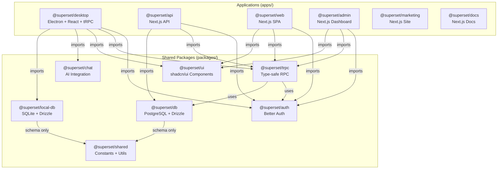
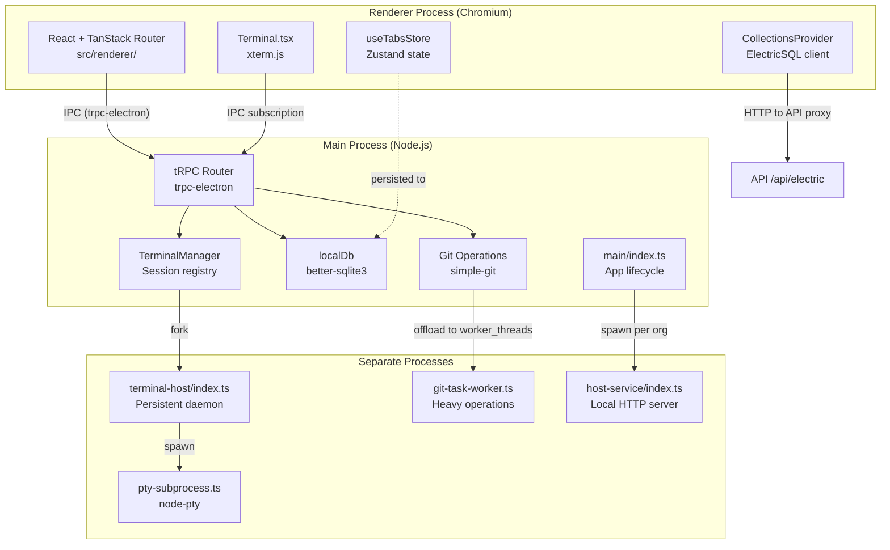
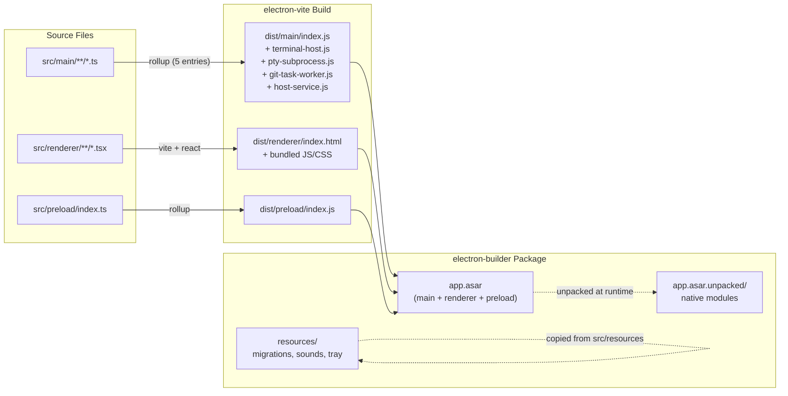
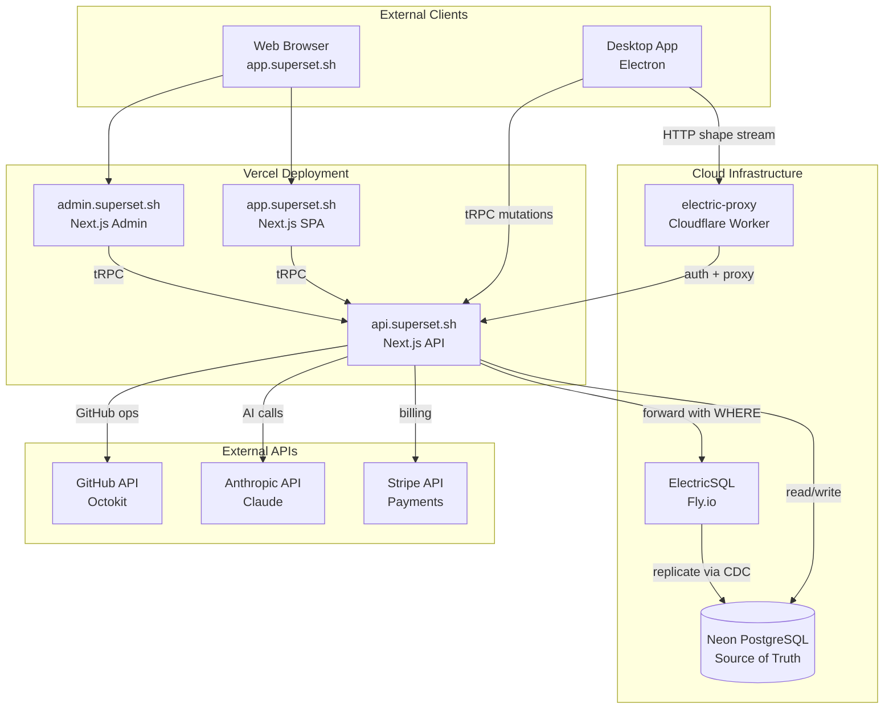
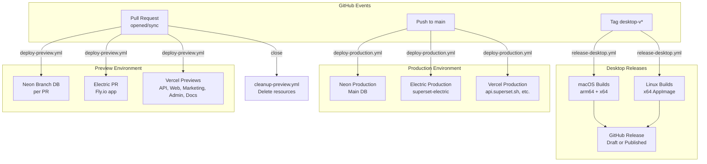
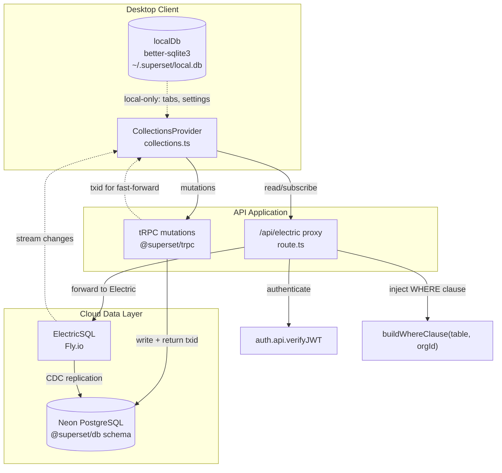
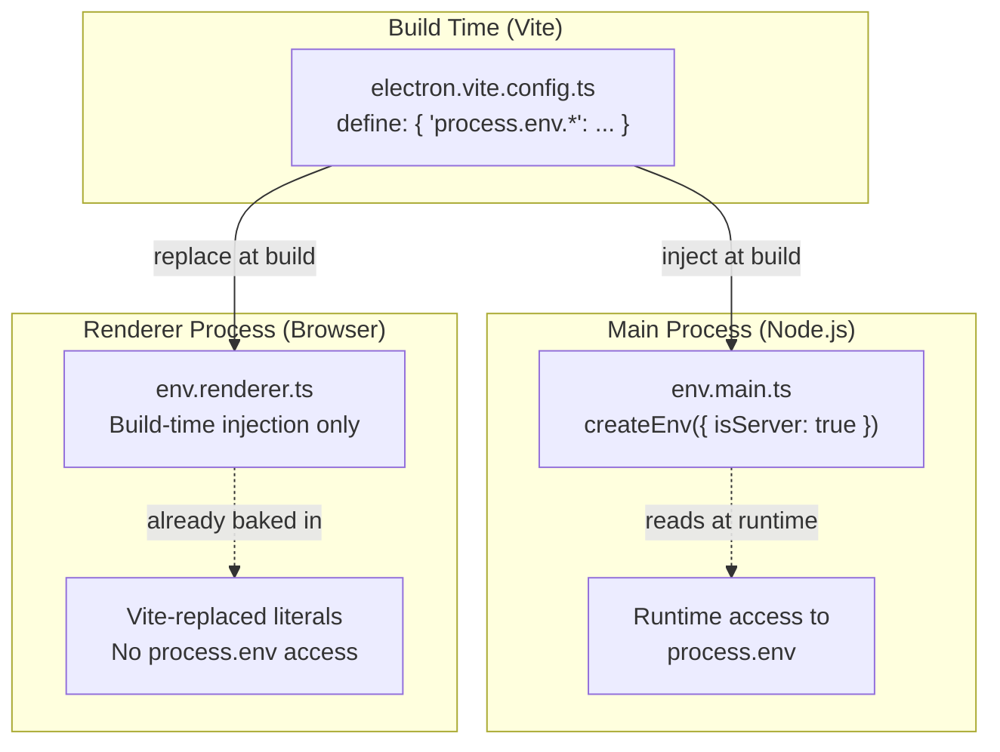

# Architecture Overview

Relevant source files

The following files were used as context for generating this wiki page:

- [.github/actions/merge-mac-manifests/action.yml](.github/actions/merge-mac-manifests/action.yml)
- [.github/actions/merge-mac-manifests/merge-mac-manifests.mjs](.github/actions/merge-mac-manifests/merge-mac-manifests.mjs)
- [.github/templates/cleanup-comment.md](.github/templates/cleanup-comment.md)
- [.github/templates/preview-comment.md](.github/templates/preview-comment.md)
- [.github/workflows/build-desktop.yml](.github/workflows/build-desktop.yml)
- [.github/workflows/ci.yml](.github/workflows/ci.yml)
- [.github/workflows/cleanup-preview.yml](.github/workflows/cleanup-preview.yml)
- [.github/workflows/deploy-preview.yml](.github/workflows/deploy-preview.yml)
- [.github/workflows/deploy-production.yml](.github/workflows/deploy-production.yml)
- [.github/workflows/release-desktop-canary.yml](.github/workflows/release-desktop-canary.yml)
- [.github/workflows/release-desktop.yml](.github/workflows/release-desktop.yml)
- [apps/admin/src/trpc/react.tsx](apps/admin/src/trpc/react.tsx)
- [apps/api/package.json](apps/api/package.json)
- [apps/api/src/app/api/auth/desktop/connect/route.ts](apps/api/src/app/api/auth/desktop/connect/route.ts)
- [apps/api/src/app/api/electric/[...path]/route.ts](apps/api/src/app/api/electric/[...path]/route.ts)
- [apps/api/src/app/api/electric/[...path]/utils.ts](apps/api/src/app/api/electric/[...path]/utils.ts)
- [apps/api/src/env.ts](apps/api/src/env.ts)
- [apps/api/src/proxy.ts](apps/api/src/proxy.ts)
- [apps/api/src/trpc/context.ts](apps/api/src/trpc/context.ts)
- [apps/desktop/BUILDING.md](apps/desktop/BUILDING.md)
- [apps/desktop/RELEASE.md](apps/desktop/RELEASE.md)
- [apps/desktop/create-release.sh](apps/desktop/create-release.sh)
- [apps/desktop/electron-builder.ts](apps/desktop/electron-builder.ts)
- [apps/desktop/electron.vite.config.ts](apps/desktop/electron.vite.config.ts)
- [apps/desktop/package.json](apps/desktop/package.json)
- [apps/desktop/scripts/copy-native-modules.ts](apps/desktop/scripts/copy-native-modules.ts)
- [apps/desktop/src/main/env.main.ts](apps/desktop/src/main/env.main.ts)
- [apps/desktop/src/main/index.ts](apps/desktop/src/main/index.ts)
- [apps/desktop/src/main/lib/auto-updater.ts](apps/desktop/src/main/lib/auto-updater.ts)
- [apps/desktop/src/renderer/env.renderer.ts](apps/desktop/src/renderer/env.renderer.ts)
- [apps/desktop/src/renderer/index.html](apps/desktop/src/renderer/index.html)
- [apps/desktop/src/renderer/routes/_authenticated/providers/CollectionsProvider/CollectionsProvider.tsx](apps/desktop/src/renderer/routes/_authenticated/providers/CollectionsProvider/CollectionsProvider.tsx)
- [apps/desktop/src/renderer/routes/_authenticated/providers/CollectionsProvider/collections.ts](apps/desktop/src/renderer/routes/_authenticated/providers/CollectionsProvider/collections.ts)
- [apps/desktop/vite/helpers.ts](apps/desktop/vite/helpers.ts)
- [apps/web/src/app/auth/desktop/success/page.tsx](apps/web/src/app/auth/desktop/success/page.tsx)
- [apps/web/src/trpc/react.tsx](apps/web/src/trpc/react.tsx)
- [biome.jsonc](biome.jsonc)
- [bun.lock](bun.lock)
- [fly.toml](fly.toml)
- [package.json](package.json)
- [packages/ui/package.json](packages/ui/package.json)
- [scripts/lint.sh](scripts/lint.sh)

This document provides a high-level overview of the Superset system architecture, explaining how the monorepo is organized, how applications relate to each other, and the key architectural patterns used throughout the codebase. For detailed information about specific technologies, see [Technology Stack](#1.2). For fundamental concepts like workspaces and worktrees, see [Core Concepts](#1.3).

## System Scope and Structure

Superset is a developer tool combining an integrated terminal, Git worktree management, and AI assistance. The system is organized as a **monorepo** containing six primary applications and multiple shared packages, all managed by Bun and Turborepo [package.json:42-46]().

The **Desktop application** (`@superset/desktop`) is the flagship product, delivered as an Electron-based native application for macOS and Linux. The **Cloud services** provide authentication, data synchronization, and web-based interfaces. All applications share common packages for authentication, database schemas, tRPC routers, and UI components.

## Monorepo Organization

**Package Interdependencies**: The `@superset/trpc` package defines routers that depend on `@superset/db` and `@superset/auth`. The `@superset/ui` package provides shared React components used by all frontend applications. The `@superset/local-db` package defines the SQLite schema for desktop-local data, while `@superset/db` defines the PostgreSQL schema for cloud data.

**Workspace Configuration**: All packages are defined in [package.json:43-46]() and managed via Bun workspaces. The monorepo uses Turborepo for task orchestration [package.json:11]() with shared TypeScript, ESLint, and Biome configurations in `tooling/typescript`.

**Sources**: [package.json:1-56](), [apps/desktop/package.json:1-251](), [apps/api/package.json:1-62](), [bun.lock:1-893]()

## Desktop Application Architecture

The desktop application uses a **multi-process Electron architecture** with specialized subprocesses for different concerns. The main process coordinates IPC, manages windows, and spawns worker processes, while the renderer process runs the React UI.

### Process Architecture

**Main Process Entry Point**: The application starts in [apps/desktop/src/main/index.ts:1-367]() which initializes Sentry, registers protocol handlers, sets up auto-updater, and creates the main window via `makeAppSetup(() => MainWindow())`.

**Renderer Process Entry Point**: The renderer initializes in [apps/desktop/src/renderer/index.html:1-28]() with a React app using TanStack Router. The root route initializes `CollectionsProvider` for ElectricSQL sync and `QueryClientProvider` for TanStack Query.

**IPC Communication**: The renderer communicates with the main process exclusively through tRPC via `trpc-electron` [apps/desktop/package.json:211](). The preload script in [apps/desktop/src/preload/index.ts]() exposes the `window.electron.trpc` API.

**Sources**: [apps/desktop/src/main/index.ts:1-367](), [apps/desktop/src/renderer/index.html:1-28](), [apps/desktop/electron.vite.config.ts:1-265]()

### Build Configuration

**Multi-Entry Main Process**: The main process has five entry points defined in [apps/desktop/electron.vite.config.ts:102-111](): `index.ts` (main app), `terminal-host/index.ts` (daemon), `pty-subprocess.ts` (PTY), `git-task-worker.ts` (worker thread), and `host-service/index.ts` (local server).

**ASAR Packaging**: The electron-builder configuration [apps/desktop/electron-builder.ts:46-53]() creates an ASAR archive with specific unpack patterns for native modules (`better-sqlite3`, `node-pty`) and external resources (sounds, tray icons) that must be accessible outside the archive.

**Native Module Handling**: Before packaging, [apps/desktop/scripts/copy-native-modules.ts:1-259]() materializes symlinked native modules created by Bun's isolated installs, replacing symlinks with actual file copies so electron-builder can properly package them.

**Sources**: [apps/desktop/electron.vite.config.ts:1-265](), [apps/desktop/electron-builder.ts:1-154](), [apps/desktop/scripts/copy-native-modules.ts:1-259]()

## Cloud Backend Architecture

The cloud backend provides authentication, data synchronization, and web interfaces. All backend services are deployed on Vercel, with ElectricSQL on Fly.io and the database on Neon.

### Service Topology

**API Application**: The `@superset/api` app [apps/api/package.json:1-62]() is a Next.js application serving tRPC routers at `/api/trpc` and proxying ElectricSQL at `/api/electric`. It connects to Neon PostgreSQL via Drizzle ORM and integrates with GitHub, Anthropic, Slack, Linear, and Stripe.

**ElectricSQL Proxy**: Desktop clients don't connect directly to ElectricSQL. Instead, they connect to `/api/electric` [apps/api/src/app/api/electric/[...path]/route.ts:1-125]() which authenticates the user, injects row-level security filters into the `WHERE` clause, and forwards the request to the ElectricSQL server on Fly.io.

**Authentication Flow**: Both desktop and web apps use Better Auth [apps/api/package.json:38](). Desktop apps authenticate via OAuth callback deep links (e.g., `superset://auth/callback`) handled in [apps/desktop/src/main/index.ts:69-92](), which parses the auth token and stores it.

**Sources**: [apps/api/package.json:1-62](), [apps/api/src/app/api/electric/[...path]/route.ts:1-125](), [apps/api/src/env.ts:1-77]()

### Deployment Pipeline

**Preview Environments**: Each pull request gets isolated preview environments via [.github/workflows/deploy-preview.yml:1-664](). The workflow creates a Neon branch database, deploys ElectricSQL to Fly.io with a unique app name, and deploys all five Vercel apps with preview URLs.

**Production Deployment**: Merges to main trigger [.github/workflows/deploy-production.yml:1-542]() which runs database migrations on Neon production, then deploys API, Web, Marketing, Admin, and Docs to Vercel in parallel.

**Desktop Releases**: Pushing a tag like `desktop-v1.0.0` triggers [.github/workflows/release-desktop.yml:1-147]() which builds macOS (arm64/x64) and Linux (x64) artifacts via [.github/workflows/build-desktop.yml:1-256](), then creates a GitHub release with DMG files, ZIP files, AppImages, and auto-update manifests.

**Resource Cleanup**: When a PR closes, [.github/workflows/cleanup-preview.yml:1-62]() deletes the Neon branch, destroys the Fly.io app, and posts a cleanup comment on the PR.

**Sources**: [.github/workflows/deploy-preview.yml:1-664](), [.github/workflows/deploy-production.yml:1-542](), [.github/workflows/release-desktop.yml:1-147](), [.github/workflows/build-desktop.yml:1-256]()

## Data Synchronization Layer

Superset uses a **dual data architecture**: local SQLite for desktop-only data and cloud PostgreSQL for synced data. ElectricSQL provides real-time synchronization between desktop clients and the cloud.

### Data Flow

**Collections Architecture**: The renderer uses `CollectionsProvider` [apps/desktop/src/renderer/routes/_authenticated/providers/CollectionsProvider/collections.ts:1-572]() which creates TanStack Electric collections for each table (tasks, projects, workspaces, etc.). Each collection is keyed by organization ID and cached in a `Map`.

**Row-Level Security**: The `/api/electric` proxy [apps/api/src/app/api/electric/[...path]/route.ts:34-125]() authenticates the user, extracts their organization IDs, and builds a `WHERE` clause via `buildWhereClause()` [apps/api/src/app/api/electric/[...path]/utils.ts:28-164]() that filters data to only the organizations the user has access to.

**Optimistic Updates**: When mutating data, the renderer calls tRPC mutations [apps/desktop/src/renderer/routes/_authenticated/providers/CollectionsProvider/collections.ts:188-206]() which write to Neon and return a `txid`. The collection client fast-forwards to that transaction ID, ensuring the local view reflects the mutation immediately.

**Local-Only Data**: Tabs, panes, and settings are stored in `localDb` [apps/desktop/src/main/lib/local-db.ts]() (SQLite) and never synced to the cloud. These use the `@superset/local-db` schema [packages/local-db/]() while cloud data uses the `@superset/db` schema.

**Sources**: [apps/desktop/src/renderer/routes/_authenticated/providers/CollectionsProvider/collections.ts:1-572](), [apps/api/src/app/api/electric/[...path]/route.ts:1-125](), [apps/api/src/app/api/electric/[...path]/utils.ts:1-164]()

## Environment Configuration

All applications use type-safe environment variables via `@t3-oss/env-core` or `@t3-oss/env-nextjs`. The desktop app has separate environment schemas for the main process and renderer process due to their different runtime contexts.

### Desktop Environment Separation

**Main Process Environment**: The main process uses [apps/desktop/src/main/env.main.ts:1-53]() which reads from `process.env` at runtime. Values are also injected at build time via Vite's `define` in [apps/desktop/electron.vite.config.ts:50-97]().

**Renderer Process Environment**: The renderer uses [apps/desktop/src/renderer/env.renderer.ts:1-53]() but **cannot access** `process.env` at runtime due to browser context. Instead, Vite replaces all environment variable references with literal strings at build time [apps/desktop/electron.vite.config.ts:161-208]().

**API Environment**: The API app uses standard Next.js environment variables via [apps/api/src/env.ts:1-77]() with both server-side and client-side schemas.

**Sources**: [apps/desktop/src/main/env.main.ts:1-53](), [apps/desktop/src/renderer/env.renderer.ts:1-53](), [apps/desktop/electron.vite.config.ts:1-265](), [apps/api/src/env.ts:1-77]()

## Release Channels

The desktop application supports two release channels: **stable** and **canary**. Each channel has its own update feed URL, GitHub release tag, and auto-update manifest.

### Channel Configuration

| Channel | Tag Pattern | Update Feed URL | Build Config | Frequency |
|---------|-------------|----------------|--------------|-----------|
| Stable | `desktop-v1.0.0` | `/releases/latest/download` | `electron-builder.ts` | Manual (on tag push) |
| Canary | `desktop-canary` | `/releases/download/desktop-canary` | `electron-builder.canary.ts` | Automated (12hr schedule) |

**Stable Releases**: Triggered by pushing a semver tag like `desktop-v1.0.0` via [apps/desktop/create-release.sh:1-501](). The workflow [.github/workflows/release-desktop.yml:1-147]() builds artifacts, creates a draft GitHub release, and generates `latest-mac.yml` and `latest-linux.yml` manifests.

**Canary Releases**: Scheduled every 12 hours [.github/workflows/release-desktop-canary.yml:5-6]() but only builds if commits exist since the last canary. Canary builds append a version suffix like `-canary.20240115120000` [.github/workflows/release-desktop-canary.yml:76]() and use a separate electron-builder config.

**Channel Detection**: The auto-updater [apps/desktop/src/main/lib/auto-updater.ts:17-23]() detects if the app is a prerelease build by checking `semver.prerelease(version)`. If the version contains prerelease components (e.g., `1.0.0-canary`), it uses the canary feed URL.

**Update Manifests**: The electron-builder config [apps/desktop/electron-builder.ts:29-30]() enables `generateUpdatesFilesForAllChannels` which creates separate manifests for each channel (`latest.yml`, `canary.yml`, etc.).

**Sources**: [apps/desktop/create-release.sh:1-501](), [.github/workflows/release-desktop.yml:1-147](), [.github/workflows/release-desktop-canary.yml:1-178](), [apps/desktop/src/main/lib/auto-updater.ts:1-157](), [apps/desktop/electron-builder.ts:1-154]()