# Core Concepts

<details>
<summary>Relevant source files</summary>

The following files were used as context for generating this wiki page:

- [apps/desktop/src/lib/trpc/routers/projects/projects.ts](apps/desktop/src/lib/trpc/routers/projects/projects.ts)
- [apps/desktop/src/lib/trpc/routers/ui-state/index.ts](apps/desktop/src/lib/trpc/routers/ui-state/index.ts)
- [apps/desktop/src/renderer/components/NewWorkspaceModal/NewWorkspaceModal.tsx](apps/desktop/src/renderer/components/NewWorkspaceModal/NewWorkspaceModal.tsx)
- [apps/desktop/src/renderer/components/NewWorkspaceModal/NewWorkspaceModalDraftContext.tsx](apps/desktop/src/renderer/components/NewWorkspaceModal/NewWorkspaceModalDraftContext.tsx)
- [apps/desktop/src/renderer/components/NewWorkspaceModal/components/NewWorkspaceModalContent/NewWorkspaceModalContent.tsx](apps/desktop/src/renderer/components/NewWorkspaceModal/components/NewWorkspaceModalContent/NewWorkspaceModalContent.tsx)
- [apps/desktop/src/renderer/components/NewWorkspaceModal/components/NewWorkspaceModalContent/index.ts](apps/desktop/src/renderer/components/NewWorkspaceModal/components/NewWorkspaceModalContent/index.ts)
- [apps/desktop/src/renderer/components/NewWorkspaceModal/components/PromptGroup/PromptGroup.tsx](apps/desktop/src/renderer/components/NewWorkspaceModal/components/PromptGroup/PromptGroup.tsx)
- [apps/desktop/src/renderer/components/NewWorkspaceModal/components/PromptGroup/components/PRLinkCommand/PRLinkCommand.tsx](apps/desktop/src/renderer/components/NewWorkspaceModal/components/PromptGroup/components/PRLinkCommand/PRLinkCommand.tsx)
- [apps/desktop/src/renderer/components/NewWorkspaceModal/components/PromptGroup/components/PromptGroupAdvancedOptions/PromptGroupAdvancedOptions.tsx](apps/desktop/src/renderer/components/NewWorkspaceModal/components/PromptGroup/components/PromptGroupAdvancedOptions/PromptGroupAdvancedOptions.tsx)
- [apps/desktop/src/renderer/components/NewWorkspaceModal/components/PromptGroup/components/PromptGroupAdvancedOptions/index.ts](apps/desktop/src/renderer/components/NewWorkspaceModal/components/PromptGroup/components/PromptGroupAdvancedOptions/index.ts)
- [apps/desktop/src/renderer/react-query/workspaces/useOpenTrackedWorktree.ts](apps/desktop/src/renderer/react-query/workspaces/useOpenTrackedWorktree.ts)
- [apps/desktop/src/renderer/routes/_authenticated/_dashboard/workspace/$workspaceId/page.tsx](apps/desktop/src/renderer/routes/_authenticated/_dashboard/workspace/$workspaceId/page.tsx)
- [apps/desktop/src/renderer/screens/main/components/WorkspaceView/ContentView/TabsContent/GroupStrip/GroupItem.tsx](apps/desktop/src/renderer/screens/main/components/WorkspaceView/ContentView/TabsContent/GroupStrip/GroupItem.tsx)
- [apps/desktop/src/renderer/screens/main/components/WorkspaceView/ContentView/TabsContent/GroupStrip/GroupStrip.tsx](apps/desktop/src/renderer/screens/main/components/WorkspaceView/ContentView/TabsContent/GroupStrip/GroupStrip.tsx)
- [apps/desktop/src/renderer/screens/main/components/WorkspaceView/ContentView/TabsContent/TabContentContextMenu.tsx](apps/desktop/src/renderer/screens/main/components/WorkspaceView/ContentView/TabsContent/TabContentContextMenu.tsx)
- [apps/desktop/src/renderer/screens/main/components/WorkspaceView/ContentView/TabsContent/TabView/FileViewerPane/FileViewerPane.tsx](apps/desktop/src/renderer/screens/main/components/WorkspaceView/ContentView/TabsContent/TabView/FileViewerPane/FileViewerPane.tsx)
- [apps/desktop/src/renderer/screens/main/components/WorkspaceView/ContentView/TabsContent/TabView/FileViewerPane/components/DiffViewerContextMenu/DiffViewerContextMenu.tsx](apps/desktop/src/renderer/screens/main/components/WorkspaceView/ContentView/TabsContent/TabView/FileViewerPane/components/DiffViewerContextMenu/DiffViewerContextMenu.tsx)
- [apps/desktop/src/renderer/screens/main/components/WorkspaceView/ContentView/TabsContent/TabView/FileViewerPane/components/FileEditorContextMenu/FileEditorContextMenu.tsx](apps/desktop/src/renderer/screens/main/components/WorkspaceView/ContentView/TabsContent/TabView/FileViewerPane/components/FileEditorContextMenu/FileEditorContextMenu.tsx)
- [apps/desktop/src/renderer/screens/main/components/WorkspaceView/ContentView/TabsContent/TabView/FileViewerPane/components/FileViewerContent/FileViewerContent.tsx](apps/desktop/src/renderer/screens/main/components/WorkspaceView/ContentView/TabsContent/TabView/FileViewerPane/components/FileViewerContent/FileViewerContent.tsx)
- [apps/desktop/src/renderer/screens/main/components/WorkspaceView/ContentView/TabsContent/TabView/TabPane.tsx](apps/desktop/src/renderer/screens/main/components/WorkspaceView/ContentView/TabsContent/TabView/TabPane.tsx)
- [apps/desktop/src/renderer/screens/main/components/WorkspaceView/ContentView/TabsContent/TabView/index.tsx](apps/desktop/src/renderer/screens/main/components/WorkspaceView/ContentView/TabsContent/TabView/index.tsx)
- [apps/desktop/src/renderer/screens/main/components/WorkspaceView/ContentView/components/EditorContextMenu/EditorContextMenu.tsx](apps/desktop/src/renderer/screens/main/components/WorkspaceView/ContentView/components/EditorContextMenu/EditorContextMenu.tsx)
- [apps/desktop/src/renderer/screens/main/components/WorkspaceView/ContentView/components/PaneContextMenuItems/PaneContextMenuItems.tsx](apps/desktop/src/renderer/screens/main/components/WorkspaceView/ContentView/components/PaneContextMenuItems/PaneContextMenuItems.tsx)
- [apps/desktop/src/renderer/screens/main/components/WorkspaceView/ContentView/components/index.ts](apps/desktop/src/renderer/screens/main/components/WorkspaceView/ContentView/components/index.ts)
- [apps/desktop/src/renderer/stores/new-workspace-modal.ts](apps/desktop/src/renderer/stores/new-workspace-modal.ts)
- [apps/desktop/src/renderer/stores/tabs/store.ts](apps/desktop/src/renderer/stores/tabs/store.ts)
- [apps/desktop/src/renderer/stores/tabs/terminal-callbacks.ts](apps/desktop/src/renderer/stores/tabs/terminal-callbacks.ts)
- [apps/desktop/src/renderer/stores/tabs/types.ts](apps/desktop/src/renderer/stores/tabs/types.ts)
- [apps/desktop/src/renderer/stores/tabs/utils.test.ts](apps/desktop/src/renderer/stores/tabs/utils.test.ts)
- [apps/desktop/src/renderer/stores/tabs/utils.ts](apps/desktop/src/renderer/stores/tabs/utils.ts)
- [apps/desktop/src/shared/hotkeys.ts](apps/desktop/src/shared/hotkeys.ts)
- [apps/desktop/src/shared/tabs-types.ts](apps/desktop/src/shared/tabs-types.ts)

</details>


This document introduces the fundamental concepts and data structures that form the foundation of the Superset desktop application. Understanding these concepts is essential for working with the codebase.

For information about the workspace creation flow and Git operations, see [Workspace System](#2.6). For details about terminal architecture, see [Terminal System](#2.8). For data synchronization mechanics, see [Data Synchronization](#2.10).

---

## Workspaces

A **workspace** represents a distinct development context tied to a specific Git branch. Workspaces are the primary organizational unit in Superset, allowing developers to work on multiple branches simultaneously without switching contexts.

### Workspace Types

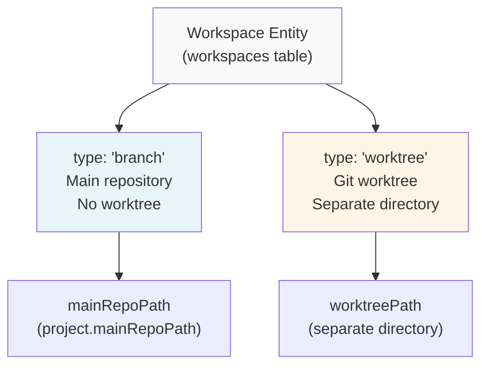

**Sources:** [apps/desktop/src/lib/trpc/routers/projects/projects.ts:136-214](), [packages/local-db/src/schema.ts]()

| Type | Description | Filesystem | Use Case |
|------|-------------|------------|----------|
| `branch` | Workspace for the main repository's current branch | Uses `project.mainRepoPath` directly | Default workspace, represents the repository's HEAD |
| `worktree` | Workspace backed by a Git worktree | Separate directory in `.worktrees/` or custom location | Feature branches, PRs, parallel development |

The workspace type is determined by the `type` field in the `workspaces` table. Branch workspaces are automatically created when a project is opened ([apps/desktop/src/lib/trpc/routers/projects/projects.ts:136-214]()), while worktree workspaces are created explicitly by the user through the New Workspace modal.

**Sources:** [apps/desktop/src/lib/trpc/routers/projects/projects.ts:1-50](), [packages/local-db/src/schema.ts]()

---

## Projects

A **project** represents a Git repository and serves as the parent container for all workspaces associated with that repository.

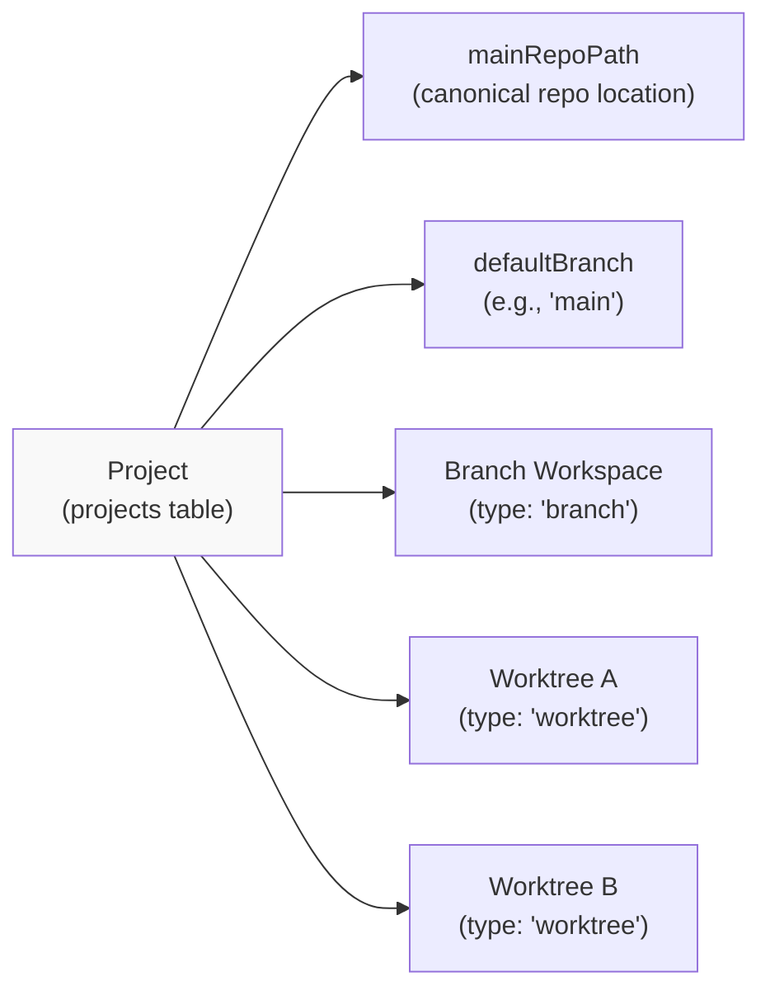

**Sources:** [apps/desktop/src/lib/trpc/routers/projects/projects.ts:51-134]()

### Key Project Properties

- **`mainRepoPath`**: Absolute filesystem path to the primary Git repository
- **`defaultBranch`**: The repository's default branch (detected from `origin/HEAD` or Git config)
- **`workspaceBaseBranch`**: Optional project-level override for the base branch used when creating new worktrees
- **`branchPrefixMode`**: Controls automatic branch naming (`author`, `custom`, or `none`)
- **`worktreeBaseDir`**: Optional custom directory for storing worktrees (defaults to `.worktrees/`)

**Sources:** [packages/local-db/src/schema.ts](), [apps/desktop/src/lib/trpc/routers/projects/projects.ts:103-134]()

---

## Tabs and Panes

Superset uses a hierarchical container model where **tabs** contain one or more **panes** arranged in a split layout.

### Container Hierarchy

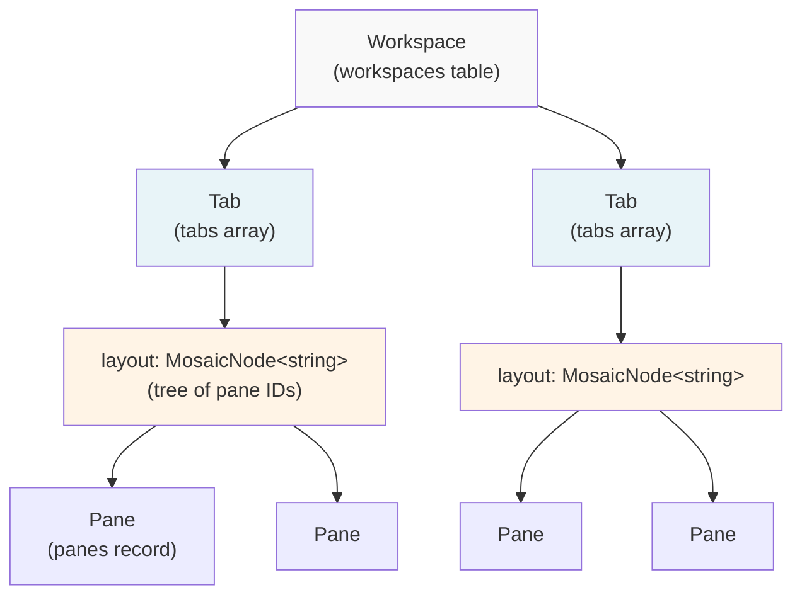

**Sources:** [apps/desktop/src/renderer/stores/tabs/types.ts:1-232]()

### Tab Structure

A **tab** is defined by the `Tab` interface and contains:

```typescript
interface Tab extends BaseTab {
  id: string;
  workspaceId: string;
  name: string;
  layout: MosaicNode<string>; // Tree structure of pane IDs
  createdAt: number;
  userTitle?: string;
}
```

The `layout` field uses `react-mosaic-component`'s `MosaicNode` type, which is either:
- A **string** (leaf node): A single pane ID
- An **object** (branch node): A split with `direction`, `first`, `second`, and `splitPercentage`

**Sources:** [apps/desktop/src/renderer/stores/tabs/types.ts:28-34](), [apps/desktop/src/renderer/stores/tabs/utils.ts:127-138]()

### Pane Structure

A **pane** represents an individual content container:

```typescript
interface Pane {
  id: string;
  tabId: string;
  type: PaneType;
  name: string;
  status?: PaneStatus;
  
  // Type-specific state (only one populated based on type)
  fileViewer?: FileViewerState;
  browser?: BrowserPaneState;
  chat?: ChatPaneState;
  devtools?: DevToolsPaneState;
  
  // Optional metadata
  isNew?: boolean;
  initialCwd?: string;
}
```

**Sources:** [apps/desktop/src/shared/tabs-types.ts:102-183]()

### Layout Navigation

Panes are extracted from the layout tree in **visual order** (left-to-right, top-to-bottom):

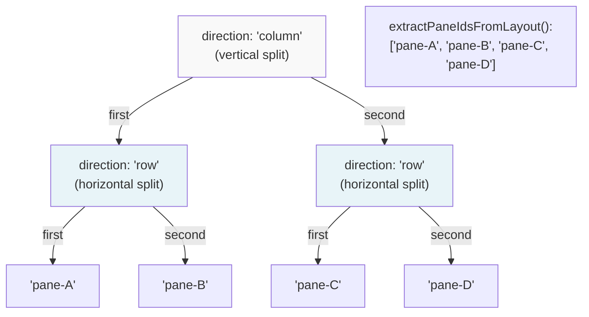

The `extractPaneIdsFromLayout()` function traverses the tree in pre-order, visiting `first` before `second` at each node, producing left-to-right and top-to-bottom ordering.

**Sources:** [apps/desktop/src/renderer/stores/tabs/utils.ts:106-142]()

---

## Pane Types

Superset supports five distinct pane types, each rendering different content.

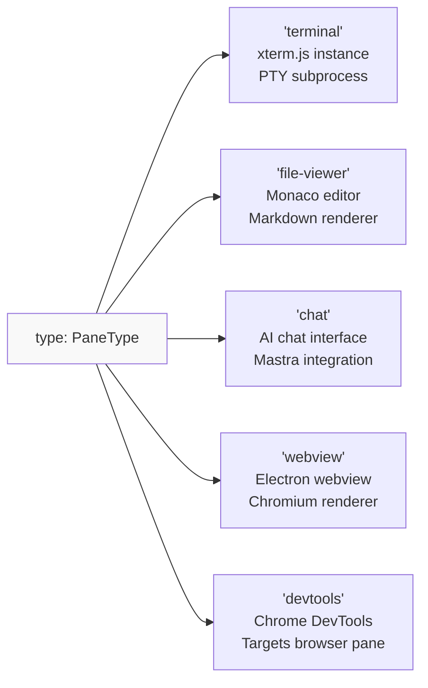

**Sources:** [apps/desktop/src/shared/tabs-types.ts:8-16]()

| Type | Component | State Field | Purpose |
|------|-----------|-------------|---------|
| `terminal` | `Terminal.tsx` | None (session managed via tRPC) | Interactive shell with terminal emulator |
| `file-viewer` | `FileViewerPane.tsx` | `fileViewer: FileViewerState` | View/edit files with diff support |
| `chat` | `ChatPane.tsx` | `chat: ChatPaneState` | AI-assisted development chat |
| `webview` | `BrowserPane.tsx` | `browser: BrowserPaneState` | Embedded web browser with history |
| `devtools` | `DevToolsPane.tsx` | `devtools: DevToolsPaneState` | Chrome DevTools for browser panes |

**Sources:** [apps/desktop/src/renderer/screens/main/components/WorkspaceView/ContentView/TabsContent/TabView/index.tsx:156-267]()

### File Viewer Modes

File viewer panes have three view modes controlled by the `viewMode` field:

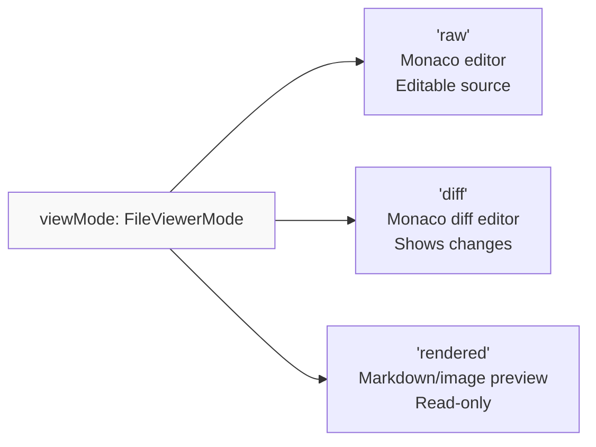

The default mode is determined by `resolveFileViewerMode()`, which considers file type, diff category, and file status.

**Sources:** [apps/desktop/src/renderer/stores/tabs/utils.ts:18-40](), [apps/desktop/src/shared/tabs-types.ts:222-234]()

---

## Pane Status

The `status` field tracks agent lifecycle states for UI indicators (dots shown on tabs and panes).

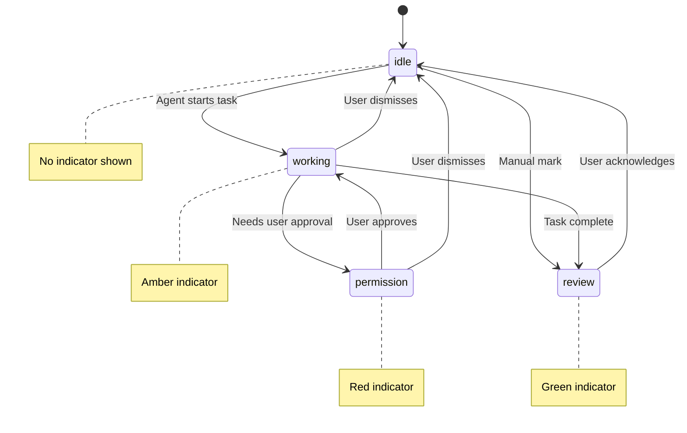

**Sources:** [apps/desktop/src/shared/tabs-types.ts:8-98]()

### Status Aggregation

When multiple panes have different statuses, the highest priority status is displayed on the tab:

```typescript
STATUS_PRIORITY = {
  idle: 0,
  review: 1,
  working: 2,
  permission: 3  // Highest priority (most urgent)
}
```

The `pickHigherStatus()` function compares two statuses and returns the one with higher priority, enabling aggregation via `reduce()` or iteration.

**Sources:** [apps/desktop/src/shared/tabs-types.ts:31-73](), [apps/desktop/src/renderer/screens/main/components/WorkspaceView/ContentView/TabsContent/GroupStrip/GroupStrip.tsx:124-135]()

---

## Sessions

**Sessions** are persistent terminal instances that survive application restarts. Unlike panes (which are UI containers), sessions represent the actual terminal state.

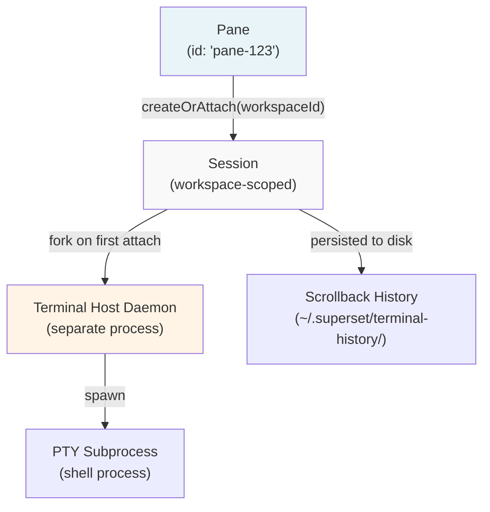

**Sources:** [apps/desktop/src/lib/trpc/routers/terminal/terminal.ts]()

### Session Lifecycle

1. **Creation**: When a terminal pane is created, `createOrAttach` is called with the workspace ID
2. **Attachment**: The session manager either creates a new session or attaches to an existing one
3. **Persistence**: Terminal output is continuously written to disk with metadata (CWD, exit status)
4. **Cold Restore**: On app restart, sessions are restored from disk, showing the last scrollback state

Sessions are scoped per workspace, meaning each workspace has its own independent terminal session that persists across pane and tab creation/deletion.

**Sources:** [apps/desktop/src/lib/trpc/routers/terminal/terminal.ts]()

---

## Collections and Shapes

**Collections** are reactive data stores backed by ElectricSQL, providing real-time synchronization between the local SQLite database and the cloud PostgreSQL database.

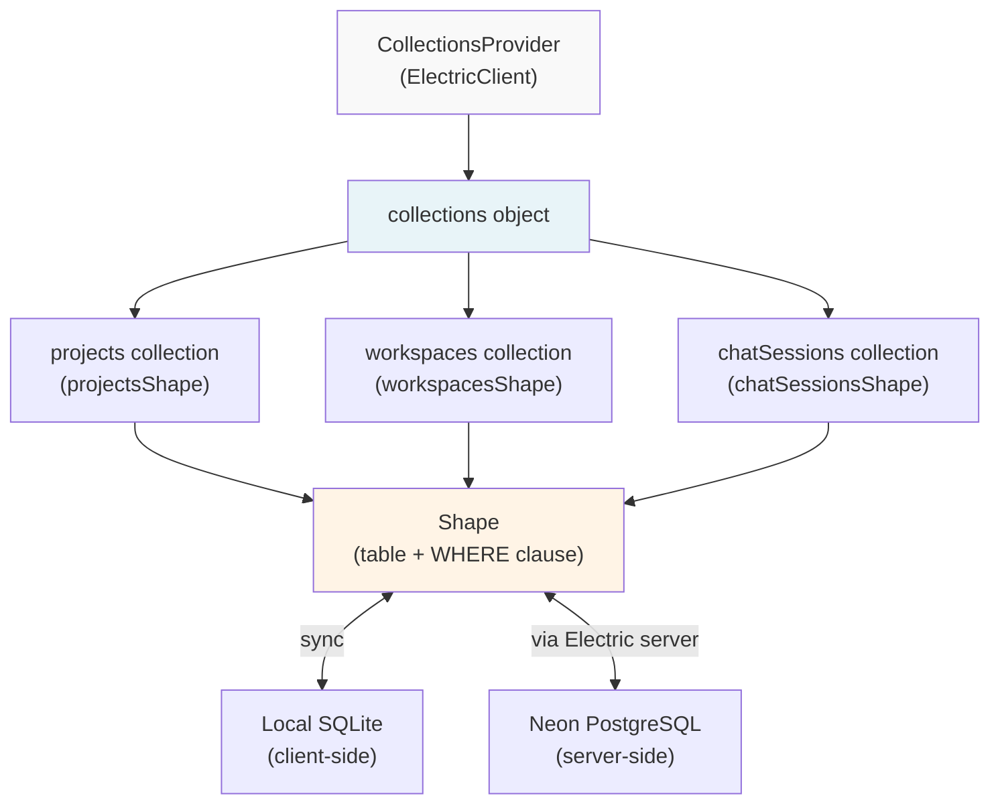

**Sources:** Diagram 3 from high-level architecture

### Shape Subscriptions

A **shape** is a filtered subscription to a database table. The `WHERE` clause is dynamically constructed to enforce row-level security:

```
Shape = {
  table: "workspaces",
  where: "organization_id = 'org-123'"
}
```

Shapes are cached per organization, enabling instant workspace switching without re-downloading data.

**Sources:** Diagram 3 from high-level architecture, [apps/desktop/src/renderer/routes/_authenticated/providers/CollectionsProvider.tsx]()

### Collections Usage

Collections are accessed via the `useCollections()` hook and queried using TanStack Query's `useLiveQuery()`:

```typescript
const collections = useCollections();
const { data: workspaces } = useLiveQuery(
  (q) => q
    .from({ workspaces: collections.workspaces })
    .where(({ workspaces }) => eq(workspaces.projectId, projectId))
    .select(({ workspaces }) => workspaces)
);
```

The query automatically updates when the underlying shape receives changes from the sync layer.

**Sources:** [apps/desktop/src/renderer/screens/main/components/WorkspaceView/ContentView/TabsContent/GroupStrip/GroupStrip.tsx:167-192]()

---

## State Management

### Zustand Stores

The application uses several Zustand stores for client-side state:

| Store | Purpose | Persisted | File |
|-------|---------|-----------|------|
| `useTabsStore` | Tab and pane state, layouts, focus tracking | Yes (via middleware) | [apps/desktop/src/renderer/stores/tabs/store.ts]() |
| `useSidebarStore` | Sidebar visibility and mode | Yes | [apps/desktop/src/renderer/stores/sidebar-state.ts]() |
| `useChangesStore` | Git changes view preferences | Yes | [apps/desktop/src/renderer/stores/changes.ts]() |
| `useHotkeysStore` | Keyboard shortcut bindings | Synced with main process | [apps/desktop/src/renderer/stores/hotkeys/store.ts]() |

**Sources:** [apps/desktop/src/renderer/stores/tabs/store.ts:141-150]()

### Tab History Stacks

Each workspace maintains a **tab history stack** for MRU (Most Recently Used) tab navigation:

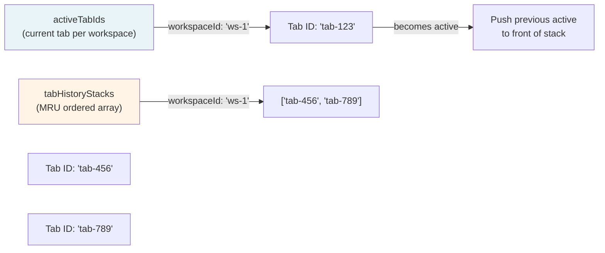

When a tab is closed, the system finds the next tab to activate by:
1. Checking the history stack for the most recently used tab
2. Falling back to adjacent tabs by position
3. Selecting any remaining tab in the workspace

**Sources:** [apps/desktop/src/renderer/stores/tabs/store.ts:56-100](), [apps/desktop/src/renderer/stores/tabs/store.ts:390-431]()

---

## Summary

The core concepts form a layered hierarchy:

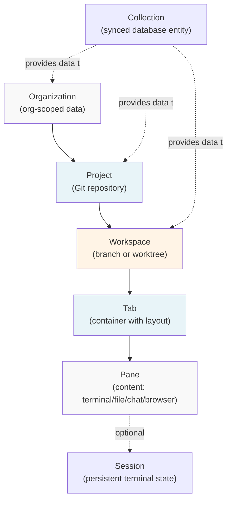

These concepts work together to enable Superset's core workflow: multi-branch development with persistent terminal sessions, synchronized cloud data, and flexible workspace layouts.

**Sources:** All files referenced throughout this document