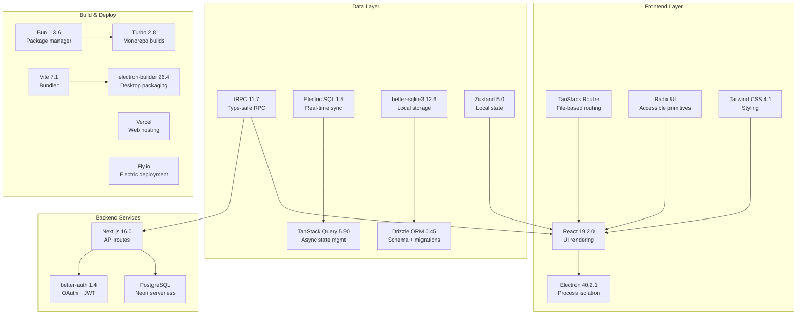
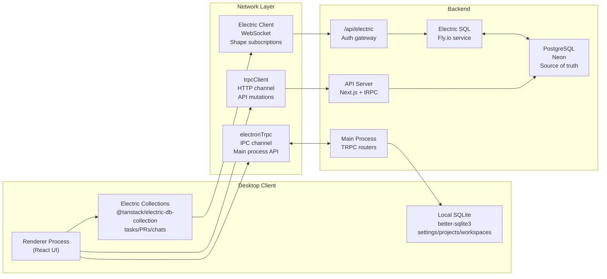
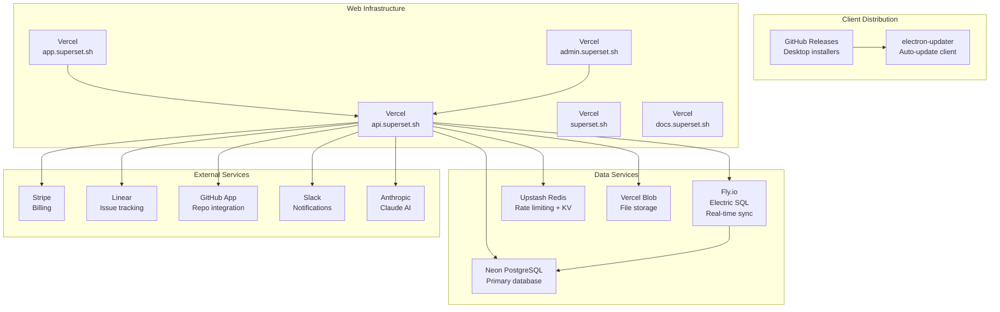

# Overview

<details>
<summary>Relevant source files</summary>

The following files were used as context for generating this wiki page:

- [.github/actions/merge-mac-manifests/action.yml](.github/actions/merge-mac-manifests/action.yml)
- [.github/actions/merge-mac-manifests/merge-mac-manifests.mjs](.github/actions/merge-mac-manifests/merge-mac-manifests.mjs)
- [.github/templates/cleanup-comment.md](.github/templates/cleanup-comment.md)
- [.github/templates/preview-comment.md](.github/templates/preview-comment.md)
- [.github/workflows/build-desktop.yml](.github/workflows/build-desktop.yml)
- [.github/workflows/ci.yml](.github/workflows/ci.yml)
- [.github/workflows/cleanup-preview.yml](.github/workflows/cleanup-preview.yml)
- [.github/workflows/deploy-preview.yml](.github/workflows/deploy-preview.yml)
- [.github/workflows/deploy-production.yml](.github/workflows/deploy-production.yml)
- [.github/workflows/release-desktop-canary.yml](.github/workflows/release-desktop-canary.yml)
- [.github/workflows/release-desktop.yml](.github/workflows/release-desktop.yml)
- [apps/admin/src/trpc/react.tsx](apps/admin/src/trpc/react.tsx)
- [apps/api/package.json](apps/api/package.json)
- [apps/api/src/app/api/auth/desktop/connect/route.ts](apps/api/src/app/api/auth/desktop/connect/route.ts)
- [apps/api/src/app/api/electric/[...path]/route.ts](apps/api/src/app/api/electric/[...path]/route.ts)
- [apps/api/src/app/api/electric/[...path]/utils.ts](apps/api/src/app/api/electric/[...path]/utils.ts)
- [apps/api/src/env.ts](apps/api/src/env.ts)
- [apps/api/src/proxy.ts](apps/api/src/proxy.ts)
- [apps/api/src/trpc/context.ts](apps/api/src/trpc/context.ts)
- [apps/desktop/BUILDING.md](apps/desktop/BUILDING.md)
- [apps/desktop/RELEASE.md](apps/desktop/RELEASE.md)
- [apps/desktop/create-release.sh](apps/desktop/create-release.sh)
- [apps/desktop/electron-builder.ts](apps/desktop/electron-builder.ts)
- [apps/desktop/electron.vite.config.ts](apps/desktop/electron.vite.config.ts)
- [apps/desktop/package.json](apps/desktop/package.json)
- [apps/desktop/scripts/copy-native-modules.ts](apps/desktop/scripts/copy-native-modules.ts)
- [apps/desktop/src/main/env.main.ts](apps/desktop/src/main/env.main.ts)
- [apps/desktop/src/main/index.ts](apps/desktop/src/main/index.ts)
- [apps/desktop/src/main/lib/auto-updater.ts](apps/desktop/src/main/lib/auto-updater.ts)
- [apps/desktop/src/renderer/env.renderer.ts](apps/desktop/src/renderer/env.renderer.ts)
- [apps/desktop/src/renderer/index.html](apps/desktop/src/renderer/index.html)
- [apps/desktop/src/renderer/routes/_authenticated/providers/CollectionsProvider/CollectionsProvider.tsx](apps/desktop/src/renderer/routes/_authenticated/providers/CollectionsProvider/CollectionsProvider.tsx)
- [apps/desktop/src/renderer/routes/_authenticated/providers/CollectionsProvider/collections.ts](apps/desktop/src/renderer/routes/_authenticated/providers/CollectionsProvider/collections.ts)
- [apps/desktop/vite/helpers.ts](apps/desktop/vite/helpers.ts)
- [apps/web/src/app/auth/desktop/success/page.tsx](apps/web/src/app/auth/desktop/success/page.tsx)
- [apps/web/src/trpc/react.tsx](apps/web/src/trpc/react.tsx)
- [biome.jsonc](biome.jsonc)
- [bun.lock](bun.lock)
- [fly.toml](fly.toml)
- [package.json](package.json)
- [packages/ui/package.json](packages/ui/package.json)
- [scripts/lint.sh](scripts/lint.sh)

</details>


Superset is a developer tool desktop application designed to streamline software development workflows. This page provides a high-level introduction to the codebase architecture, monorepo organization, and core technologies.

For detailed information about specific subsystems:
- Architecture patterns and process model: see [Architecture Overview](#1.1)
- Technology choices and rationale: see [Technology Stack](#1.2)
- Core domain models: see [Core Concepts](#1.3)

---

## What is Superset

Superset is an Electron-based desktop application described as "The last developer tool you'll ever need" [apps/desktop/package.json:4](). The application integrates terminal management, Git worktree workflows, AI-assisted development, and real-time collaboration features into a unified interface.

The desktop application is the flagship product, complemented by web, API, and admin applications that provide backend services, user management, and browser-based access.

**Sources:** [apps/desktop/package.json:1-251](), [apps/desktop/src/main/index.ts:1-328]()

---

## Monorepo Structure

```mermaid
graph TB
    ROOT["@superset/repo<br/>(Root)"]
    
    subgraph APPS["apps/"]
        DESKTOP["@superset/desktop<br/>Electron app"]
        API["@superset/api<br/>Next.js backend"]
        WEB["@superset/web<br/>Next.js web client"]
        ADMIN["@superset/admin<br/>Next.js admin panel"]
        MARKETING["@superset/marketing<br/>Next.js marketing site"]
        DOCS["@superset/docs<br/>Documentation"]
        MOBILE["@superset/mobile<br/>React Native (WIP)"]
        ELECTRIC_PROXY["electric-proxy<br/>Cloudflare Worker"]
        STREAMS["streams<br/>Durable stream service"]
    end
    
    subgraph PACKAGES["packages/"]
        DB["@superset/db<br/>Drizzle ORM schemas"]
        LOCAL_DB["@superset/local-db<br/>SQLite schemas"]
        TRPC["@superset/trpc<br/>Shared tRPC routers"]
        AUTH["@superset/auth<br/>better-auth setup"]
        SHARED["@superset/shared<br/>Constants & utils"]
        UI["@superset/ui<br/>Radix UI components"]
        CHAT["@superset/chat<br/>AI chat base"]
        CHAT_MASTRA["@superset/chat-mastra<br/>Mastra integration"]
        MCP["@superset/mcp<br/>MCP server"]
        DESKTOP_MCP["@superset/desktop-mcp<br/>Desktop MCP tools"]
        HOST_SERVICE["@superset/host-service<br/>Local tRPC server"]
        WORKSPACE_FS["@superset/workspace-fs<br/>File system utilities"]
        EMAIL["@superset/email<br/>Email templates"]
        AGENT["@superset/agent<br/>Agent framework"]
    end
    
    subgraph TOOLING["tooling/"]
        TYPESCRIPT["@superset/typescript<br/>Shared TS config"]
    end
    
    ROOT --> APPS
    ROOT --> PACKAGES
    ROOT --> TOOLING
    
    DESKTOP --> DB
    DESKTOP --> LOCAL_DB
    DESKTOP --> TRPC
    DESKTOP --> AUTH
    DESKTOP --> UI
    DESKTOP --> CHAT_MASTRA
    DESKTOP --> DESKTOP_MCP
    DESKTOP --> HOST_SERVICE
    DESKTOP --> WORKSPACE_FS
    
    API --> DB
    API --> TRPC
    API --> AUTH
    API --> MCP
    
    WEB --> DB
    WEB --> TRPC
    WEB --> AUTH
    WEB --> UI
    
    ADMIN --> DB
    ADMIN --> TRPC
    ADMIN --> AUTH
    ADMIN --> UI

    style ROOT fill:#e1f5ff
    style DESKTOP fill:#4A90E2
    style API fill:#E24A90
```



The repository is a Bun workspace monorepo [package.json:43-46]() organized into three top-level directories:

| Directory | Purpose | Package Count |
|-----------|---------|---------------|
| `apps/` | Deployable applications | 9 applications |
| `packages/` | Shared libraries | 13 packages |
| `tooling/` | Development configuration | 1 package |

**Build Orchestration:** Turbo handles monorepo task execution with caching and parallel builds [package.json:11]().

**Package Manager:** Bun 1.3.6+ with isolated installs [package.json:16]().

**Sources:** [package.json:1-56](), [bun.lock:1-100]()

---

## Core Applications

### Desktop Application (`apps/desktop`)

The flagship Electron application providing the primary user interface. Built with:
- **Framework:** Electron 40.2.1 [apps/desktop/package.json:239]()
- **UI:** React 19.2.0 + TanStack Router [apps/desktop/package.json:187,99]()
- **Build System:** electron-vite + electron-builder [apps/desktop/package.json:240-241]()
- **Local Database:** SQLite via better-sqlite3 [apps/desktop/package.json:148]()
- **Real-time Sync:** Electric SQL client [apps/desktop/package.json:68]()
- **Terminal:** XTerm.js 6.1.0-beta [apps/desktop/package.json:145]()
- **AI:** Mastra + Anthropic SDK [apps/desktop/package.json:74,38]()

**Distribution:** Native installers for macOS (DMG), Linux (AppImage), and Windows (NSIS) via electron-builder [apps/desktop/electron-builder.ts:1-149]().

**Auto-Updates:** electron-updater with GitHub Releases feed [apps/desktop/package.json:158](), [apps/desktop/src/main/lib/auto-updater.ts:1-150]().

**Sources:** [apps/desktop/package.json:1-251](), [apps/desktop/electron-builder.ts:1-149]()

---

### API Application (`apps/api`)

Next.js backend providing tRPC endpoints, authentication, and Electric SQL proxy:
- **Framework:** Next.js 16.0.10 [apps/api/package.json:44]()
- **Database:** PostgreSQL via Drizzle ORM [apps/api/package.json:40]()
- **Authentication:** better-auth with OAuth [apps/api/package.json:38]()
- **API Protocol:** tRPC for type-safe endpoints [apps/api/package.json:31]()
- **External Integrations:** GitHub App, Linear, Slack, Stripe [apps/api/package.json:19-25,48]()

**Deployment:** Vercel with production and preview environments [.github/workflows/deploy-production.yml:42-175]().

**Electric Proxy:** Authenticates and filters Electric SQL shape requests at `/api/electric` [apps/api/src/app/api/electric/[...path]/route.ts:1-90]().

**Sources:** [apps/api/package.json:1-62](), [apps/api/src/env.ts:1-77](), [apps/api/src/app/api/electric/[...path]/route.ts:1-90]()

---

### Web Application (`apps/web`)

Browser-based client for accessing Superset functionality without installing the desktop app. Built with Next.js and shares UI components with the desktop application via the `@superset/ui` package.

**Sources:** [bun.lock:524-571]()

---

### Admin Application (`apps/admin`)

Internal administration panel for managing users, organizations, and system monitoring.

**Sources:** [bun.lock:14-57]()

---

## Technology Stack Overview



**Key Technology Decisions:**

| Technology | Purpose | Rationale |
|------------|---------|-----------|
| Electron | Desktop platform | Native OS integration, mature ecosystem |
| React 19 | UI framework | Latest features (React Compiler ready) |
| TanStack Router | Routing | File-based, type-safe routing for Electron |
| tRPC | API layer | End-to-end type safety, no code generation |
| Electric SQL | Real-time sync | Local-first, offline-capable data layer |
| Drizzle ORM | Database | Type-safe SQL with minimal overhead |
| better-auth | Authentication | Flexible OAuth + session management |
| Bun | Package manager | Fast installs, native TypeScript support |

**Sources:** [apps/desktop/package.json:37-217](), [apps/api/package.json:13-50]()

---

## Data Architecture

### Diagram: Multi-Database Architecture



**Data Flow Patterns:**

1. **Local State:** Settings, projects, and workspace metadata stored in SQLite [apps/desktop/src/main/lib/local-db.ts]()
2. **Real-time Subscriptions:** Tasks, PRs, and chat messages synced via Electric SQL shapes [apps/desktop/src/renderer/routes/_authenticated/providers/CollectionsProvider/collections.ts:1-455]()
3. **Command Mutations:** Writes go through tRPC → API → PostgreSQL, then sync back via Electric [apps/desktop/src/renderer/routes/_authenticated/providers/CollectionsProvider/collections.ts:119-136]()
4. **Authentication:** JWT tokens for desktop, session cookies for web [apps/api/src/app/api/electric/[...path]/route.ts:11-32]()

**Data Isolation:** Organization-scoped WHERE clauses injected at the Electric proxy [apps/api/src/app/api/electric/[...path]/utils.ts:1-120]().

**Sources:** [apps/desktop/src/renderer/routes/_authenticated/providers/CollectionsProvider/collections.ts:1-455](), [apps/api/src/app/api/electric/[...path]/route.ts:1-90](), [apps/api/src/app/api/electric/[...path]/utils.ts:1-120]()

---

## Deployment Architecture

### Diagram: Production Infrastructure



**Deployment Targets:**

| Application | Platform | Environment Variables | CI/CD Workflow |
|-------------|----------|----------------------|----------------|
| Desktop | GitHub Releases | Build-time env injection | [.github/workflows/release-desktop.yml]() |
| API | Vercel | Runtime secrets | [.github/workflows/deploy-production.yml:42-175]() |
| Web | Vercel | Runtime secrets | [.github/workflows/deploy-production.yml:176-264]() |
| Admin | Vercel | Runtime secrets | [.github/workflows/deploy-production.yml:350-440]() |
| Marketing | Vercel | Runtime secrets | [.github/workflows/deploy-production.yml:266-348]() |
| Electric SQL | Fly.io | DATABASE_URL secret | [fly.toml:1-33]() |

**Preview Environments:** Each pull request creates:
- Neon database branch [.github/workflows/deploy-preview.yml:47-63]()
- Electric SQL app instance on Fly.io [.github/workflows/deploy-preview.yml:99-110]()
- Vercel preview deployments for all web apps [.github/workflows/deploy-preview.yml:160-271]()

**Sources:** [.github/workflows/deploy-production.yml:1-450](), [.github/workflows/deploy-preview.yml:1-700](), [fly.toml:1-33]()

---

## Development Workflow

### Build System

The monorepo uses **Turbo** for orchestrated builds with caching:

```bash
# Run all apps in development mode
bun dev

# Build desktop app only
bun run build  # Defaults to --filter=@superset/desktop

# Type-check all packages
bun run typecheck

# Lint with Biome
bun run lint
```

**Desktop-Specific Scripts:**

| Command | Purpose | Implementation |
|---------|---------|----------------|
| `bun run dev` | Development with hot reload | [apps/desktop/package.json:21]() |
| `bun run compile:app` | electron-vite build | [apps/desktop/package.json:22]() |
| `bun run copy:native-modules` | Materialize Bun symlinks | [apps/desktop/scripts/copy-native-modules.ts:1-300]() |
| `bun run validate:native-runtime` | Verify native deps | [apps/desktop/scripts/validate-native-runtime.ts:1-200]() |
| `bun run package` | Create installers | [apps/desktop/package.json:28]() |

**Sources:** [package.json:18-40](), [apps/desktop/package.json:16-36]()

---

### Native Module Handling

Bun 1.3+ uses isolated installs with symlinks in `node_modules/`. electron-builder cannot follow these symlinks when creating asar archives. The build process materializes native modules:

1. **Detection:** [apps/desktop/scripts/copy-native-modules.ts:66-111]() checks if modules are symlinks
2. **Materialization:** Replaces symlinks with actual files from `.bun/` store
3. **Validation:** [apps/desktop/scripts/validate-native-runtime.ts:1-200]() ensures no accidental bundling

**Critical Native Modules:**
- `better-sqlite3` - SQLite database driver
- `node-pty` - Terminal pseudoterminal
- `@parcel/watcher` - File system monitoring
- `libsql` - Turso database client

**Sources:** [apps/desktop/scripts/copy-native-modules.ts:1-300](), [apps/desktop/scripts/validate-native-runtime.ts:1-200]()

---

### Environment Variables

Environment variables are validated using **@t3-oss/env-core** with Zod schemas:

**Main Process:** [apps/desktop/src/main/env.main.ts:1-53]()
- Node.js `process.env` available at runtime
- Used for server-side operations (API calls, database connections)

**Renderer Process:** [apps/desktop/src/renderer/env.renderer.ts:1-70]()
- Values injected at BUILD TIME by Vite's `define` [apps/desktop/electron.vite.config.ts:161-208]()
- String replacement in compiled bundles (not runtime `process.env`)

**API Server:** [apps/api/src/env.ts:1-77]()
- Next.js environment variable validation
- Runtime secrets for integrations (Stripe, GitHub, Linear, etc.)

**Sources:** [apps/desktop/src/main/env.main.ts:1-53](), [apps/desktop/src/renderer/env.renderer.ts:1-70](), [apps/api/src/env.ts:1-77]()

---

### Release Process

**Stable Releases:**
1. Tag commit with `desktop-v*.*.*` format
2. GitHub Actions builds for macOS (arm64 + x64) and Linux [.github/workflows/build-desktop.yml:1-256]()
3. Artifacts uploaded to GitHub Releases [.github/workflows/release-desktop.yml:138-146]()
4. electron-updater polls `/releases/latest/download/` feed [apps/desktop/src/main/lib/auto-updater.ts:29-32]()

**Canary Releases:**
1. Automated builds every 12 hours via cron [.github/workflows/release-desktop-canary.yml:4-6]()
2. Version format: `1.1.5-canary.20250215120000` (timestamp suffix)
3. Publishes to `desktop-canary` rolling tag [.github/workflows/release-desktop-canary.yml:140-157]()
4. Prerelease builds check `/releases/download/desktop-canary/` feed [apps/desktop/src/main/lib/auto-updater.ts:16-23]()

**Code Signing:** macOS apps are notarized with Apple Developer credentials [.github/workflows/build-desktop.yml:109-113]().

**Sources:** [.github/workflows/release-desktop.yml:1-147](), [.github/workflows/release-desktop-canary.yml:1-158](), [apps/desktop/src/main/lib/auto-updater.ts:1-150]()

---

## Entry Points

Key files to begin exploring the codebase:

| File | Purpose |
|------|---------|
| [apps/desktop/src/main/index.ts:1-328]() | Main process entry point, app lifecycle |
| [apps/desktop/src/renderer/index.tsx]() | Renderer process entry point |
| [apps/desktop/electron.vite.config.ts:1-265]() | Build configuration |
| [apps/api/src/app/api/trpc/[trpc]/route.ts]() | API tRPC handler |
| [apps/desktop/src/renderer/routes/_authenticated/providers/CollectionsProvider/collections.ts:1-455]() | Electric SQL collections setup |
| [packages/local-db/drizzle/schema.ts]() | Local SQLite schema |
| [packages/db/schema/index.ts]() | PostgreSQL schema |

**Sources:** [apps/desktop/src/main/index.ts:1-328](), [apps/desktop/electron.vite.config.ts:1-265]()