# Technology Stack

<details>
<summary>Relevant source files</summary>

The following files were used as context for generating this wiki page:

- [.github/actions/merge-mac-manifests/action.yml](.github/actions/merge-mac-manifests/action.yml)
- [.github/actions/merge-mac-manifests/merge-mac-manifests.mjs](.github/actions/merge-mac-manifests/merge-mac-manifests.mjs)
- [.github/templates/cleanup-comment.md](.github/templates/cleanup-comment.md)
- [.github/templates/preview-comment.md](.github/templates/preview-comment.md)
- [.github/workflows/build-desktop.yml](.github/workflows/build-desktop.yml)
- [.github/workflows/ci.yml](.github/workflows/ci.yml)
- [.github/workflows/cleanup-preview.yml](.github/workflows/cleanup-preview.yml)
- [.github/workflows/deploy-preview.yml](.github/workflows/deploy-preview.yml)
- [.github/workflows/deploy-production.yml](.github/workflows/deploy-production.yml)
- [.github/workflows/release-desktop-canary.yml](.github/workflows/release-desktop-canary.yml)
- [.github/workflows/release-desktop.yml](.github/workflows/release-desktop.yml)
- [apps/admin/src/trpc/react.tsx](apps/admin/src/trpc/react.tsx)
- [apps/api/package.json](apps/api/package.json)
- [apps/api/src/app/api/auth/desktop/connect/route.ts](apps/api/src/app/api/auth/desktop/connect/route.ts)
- [apps/api/src/app/api/electric/[...path]/route.ts](apps/api/src/app/api/electric/[...path]/route.ts)
- [apps/api/src/app/api/electric/[...path]/utils.ts](apps/api/src/app/api/electric/[...path]/utils.ts)
- [apps/api/src/env.ts](apps/api/src/env.ts)
- [apps/api/src/proxy.ts](apps/api/src/proxy.ts)
- [apps/api/src/trpc/context.ts](apps/api/src/trpc/context.ts)
- [apps/desktop/BUILDING.md](apps/desktop/BUILDING.md)
- [apps/desktop/RELEASE.md](apps/desktop/RELEASE.md)
- [apps/desktop/create-release.sh](apps/desktop/create-release.sh)
- [apps/desktop/electron-builder.ts](apps/desktop/electron-builder.ts)
- [apps/desktop/electron.vite.config.ts](apps/desktop/electron.vite.config.ts)
- [apps/desktop/package.json](apps/desktop/package.json)
- [apps/desktop/scripts/copy-native-modules.ts](apps/desktop/scripts/copy-native-modules.ts)
- [apps/desktop/src/main/env.main.ts](apps/desktop/src/main/env.main.ts)
- [apps/desktop/src/main/index.ts](apps/desktop/src/main/index.ts)
- [apps/desktop/src/main/lib/auto-updater.ts](apps/desktop/src/main/lib/auto-updater.ts)
- [apps/desktop/src/renderer/env.renderer.ts](apps/desktop/src/renderer/env.renderer.ts)
- [apps/desktop/src/renderer/index.html](apps/desktop/src/renderer/index.html)
- [apps/desktop/src/renderer/routes/\_authenticated/providers/CollectionsProvider/CollectionsProvider.tsx](apps/desktop/src/renderer/routes/_authenticated/providers/CollectionsProvider/CollectionsProvider.tsx)
- [apps/desktop/src/renderer/routes/\_authenticated/providers/CollectionsProvider/collections.ts](apps/desktop/src/renderer/routes/_authenticated/providers/CollectionsProvider/collections.ts)
- [apps/desktop/vite/helpers.ts](apps/desktop/vite/helpers.ts)
- [apps/web/src/app/auth/desktop/success/page.tsx](apps/web/src/app/auth/desktop/success/page.tsx)
- [apps/web/src/trpc/react.tsx](apps/web/src/trpc/react.tsx)
- [biome.jsonc](biome.jsonc)
- [bun.lock](bun.lock)
- [fly.toml](fly.toml)
- [package.json](package.json)
- [packages/ui/package.json](packages/ui/package.json)
- [scripts/lint.sh](scripts/lint.sh)

</details>

This document provides a comprehensive inventory of the technologies, frameworks, libraries, and tools used throughout the Superset codebase. It focuses on the production runtime dependencies, build tools, and infrastructure that power the Desktop application, backend API, and supporting services. For architectural patterns and system design, see [Architecture Overview](#1.1).

---

## Runtime & Language Foundation

The entire Superset monorepo is built on **TypeScript 5.9** and uses **Bun 1.3.6** as the package manager and runtime for development tooling. The monorepo structure uses Bun workspaces with Turbo for orchestrated builds.

**Monorepo Structure:**

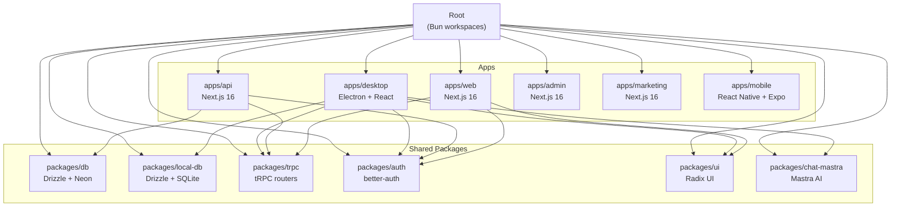

**Core Language & Runtime:**

| Technology | Version        | Usage                                       |
| ---------- | -------------- | ------------------------------------------- |
| TypeScript | 5.9.3          | All code (main, renderer, preload, backend) |
| Bun        | 1.3.6          | Package manager, dev tooling, scripts       |
| Node.js    | (via Electron) | Main process runtime                        |
| React      | 19.2.0         | UI framework for all apps                   |

**Sources:** [package.json:16](), [apps/desktop/package.json:187](), [apps/api/package.json:46]()

---

## Desktop Application Stack

### Electron Framework

The Desktop app is built on **Electron 40.2.1**, providing native desktop capabilities while running a Chromium-based renderer process for the UI.

**Process Architecture:**

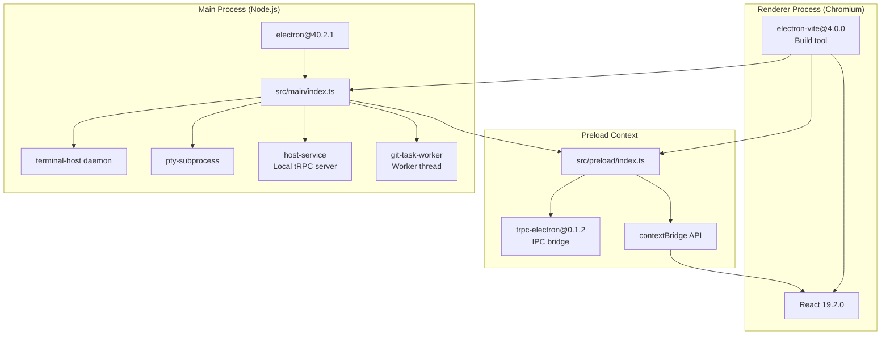

**Key Technologies:**

- **electron@40.2.1**: Desktop runtime ([apps/desktop/package.json:239]())
- **electron-vite@4.0.0**: Build tool with HMR for main/preload/renderer ([apps/desktop/package.json:241]())
- **electron-builder@26.4.0**: Packaging and distribution ([apps/desktop/package.json:240]())
- **electron-updater@6.7.3**: Auto-update system ([apps/desktop/package.json:158]())
- **trpc-electron@0.1.2**: IPC communication bridge ([apps/desktop/package.json:211]())

**Sources:** [apps/desktop/package.json:37-217](), [apps/desktop/electron.vite.config.ts:1-264]()

### Frontend Framework & Routing

**React Ecosystem:**

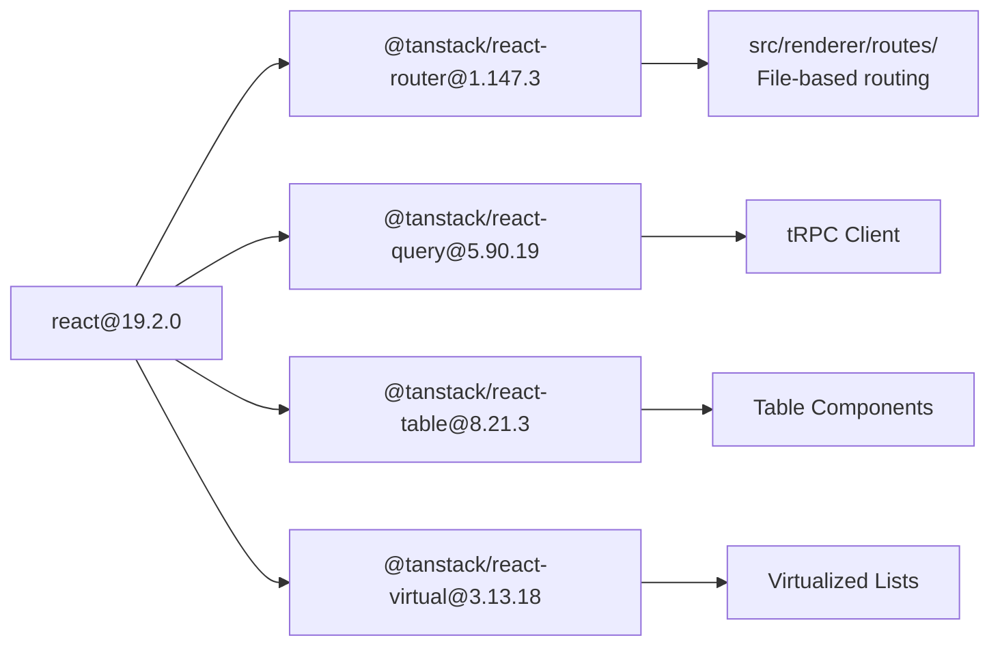

**Key Libraries:**

| Library                 | Version | Purpose                                        |
| ----------------------- | ------- | ---------------------------------------------- |
| react                   | 19.2.0  | UI framework                                   |
| react-dom               | 19.2.0  | DOM rendering                                  |
| @tanstack/react-router  | 1.147.3 | File-based routing with `src/renderer/routes/` |
| @tanstack/react-query   | 5.90.19 | Server state management, tRPC integration      |
| @tanstack/react-table   | 8.21.3  | Data tables                                    |
| @tanstack/react-virtual | 3.13.18 | Virtualized scrolling                          |

**Sources:** [apps/desktop/package.json:187-217](), [apps/desktop/electron.vite.config.ts:217-226]()

### State Management

**Zustand Stores:**

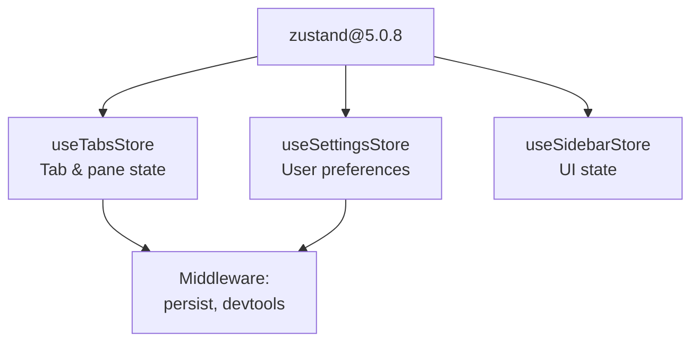

- **zustand@5.0.8**: Lightweight state management ([apps/desktop/package.json:217]())
- Used for UI state (tabs, sidebar, modals) and local preferences
- Stores persist to SQLite via middleware

**Sources:** [apps/desktop/package.json:217]()

### UI Component Libraries

**Component Architecture:**

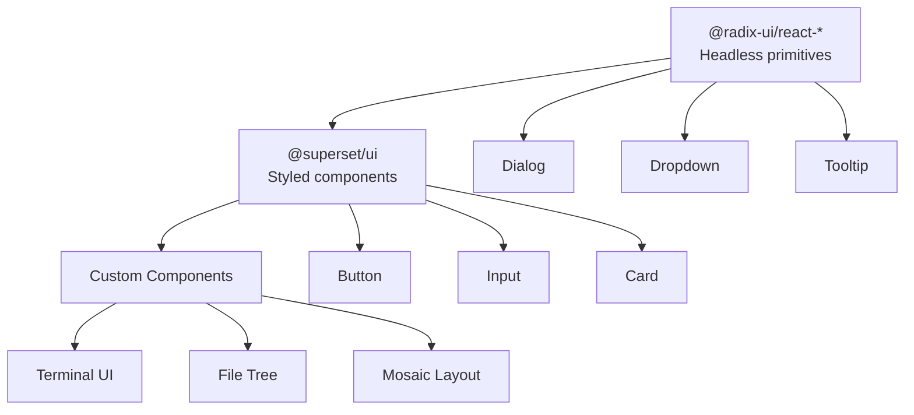

**Key Libraries:**

- **@radix-ui/react-\***: Unstyled, accessible UI primitives (Dialog, Dropdown, etc.) ([apps/desktop/package.json:79-80]())
- **@superset/ui**: Shared component library built on Radix ([packages/ui/package.json:1-93]())
- **react-mosaic-component@6.1.1**: Tiled window layout system ([apps/desktop/package.json:194]())
- **framer-motion@12.23.26**: Animation library ([apps/desktop/package.json:163]())
- **lucide-react@0.563.0**: Icon library ([apps/desktop/package.json:176]())
- **tailwindcss@4.1.18**: Utility-first CSS framework ([apps/desktop/package.json:245]())

**Sources:** [apps/desktop/package.json:79-80](), [packages/ui/package.json:23-80]()

### Terminal & PTY Management

**Terminal Stack:**

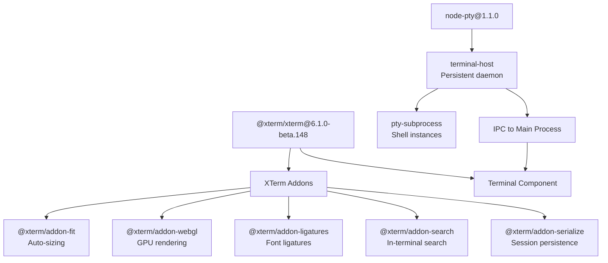

**Key Technologies:**

- **@xterm/xterm@6.1.0-beta.148**: Terminal emulator UI ([apps/desktop/package.json:145]())
- **@xterm/addon-fit**: Auto-resize terminal to container ([apps/desktop/package.json:137]())
- **@xterm/addon-webgl**: GPU-accelerated rendering ([apps/desktop/package.json:143]())
- **@xterm/addon-ligatures**: Programming font ligatures ([apps/desktop/package.json:139]())
- **@xterm/addon-search**: Find in terminal ([apps/desktop/package.json:140]())
- **@xterm/addon-serialize**: Session snapshot/restore ([apps/desktop/package.json:141]())
- **node-pty@1.1.0**: Native PTY bindings for shell processes ([apps/desktop/package.json:180]())

**Sources:** [apps/desktop/package.json:136-180](), [apps/desktop/electron.vite.config.ts:104-111]()

### Code Editor

**CodeMirror Stack:**

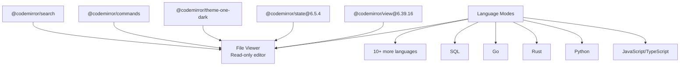

**Key Libraries:**

- **@codemirror/view**: Editor UI and rendering ([apps/desktop/package.json:63]())
- **@codemirror/state**: Editor state management ([apps/desktop/package.json:61]())
- **@codemirror/lang-\***: Language support for JavaScript, Python, Rust, Go, SQL, CSS, HTML, Markdown, JSON, YAML, PHP, Java, C++ ([apps/desktop/package.json:44-57]())
- **@codemirror/theme-one-dark**: Dark theme ([apps/desktop/package.json:62]())

**Sources:** [apps/desktop/package.json:44-63]()

---

## Data & Sync Layer

### tRPC Communication

**Desktop Communication Patterns:**

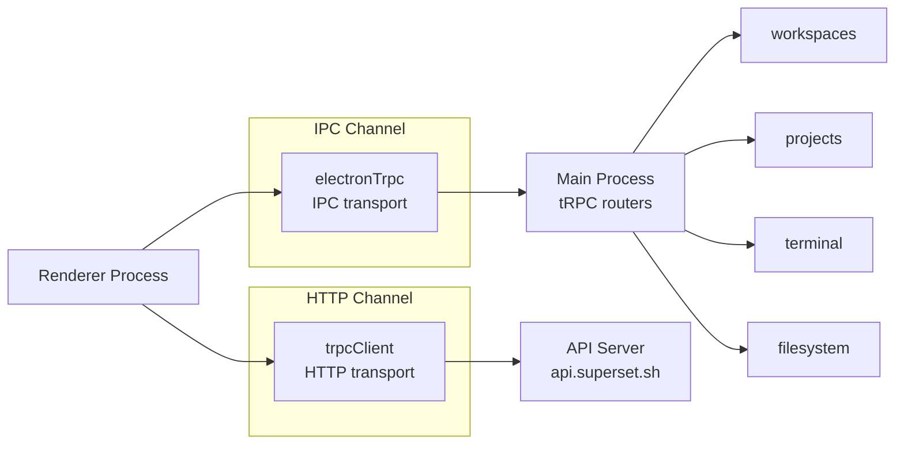

**tRPC Stack:**

| Package           | Version | Purpose                                   |
| ----------------- | ------- | ----------------------------------------- |
| @trpc/server      | 11.7.1  | Server-side tRPC implementation           |
| @trpc/client      | 11.7.1  | Client-side tRPC queries/mutations        |
| @trpc/react-query | 11.7.1  | React hooks for tRPC                      |
| trpc-electron     | 0.1.2   | IPC transport for Electron                |
| superjson         | 2.2.5   | JSON superset with Date, Map, Set support |

**Sources:** [apps/desktop/package.json:130-132](), [apps/desktop/package.json:211]()

### Electric SQL Real-Time Sync

**Electric Sync Architecture:**

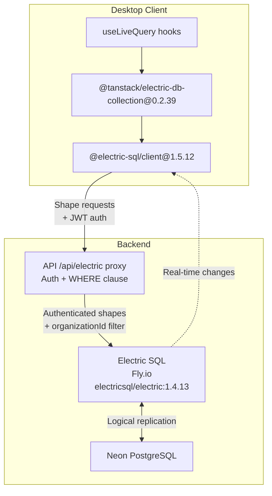

**Key Technologies:**

- **@electric-sql/client@1.5.12**: Electric SQL client library ([apps/desktop/package.json:68]())
- **@tanstack/electric-db-collection@0.2.39**: Collection API for Electric shapes ([apps/desktop/package.json:96]())
- **@tanstack/react-db@0.1.75**: React hooks for collections ([apps/desktop/package.json:97]())
- **Electric SQL Server**: Deployed on Fly.io at `electricsql/electric:1.4.13` ([fly.toml:5]())

**Shape Subscription Example:**

Collections are defined per organization in [apps/desktop/src/renderer/routes/\_authenticated/providers/CollectionsProvider/collections.ts:105-406](). Each collection subscribes to a PostgreSQL table filtered by `organizationId`:

```typescript
// Example: tasks collection
const tasks = createCollection(
  electricCollectionOptions<SelectTask>({
    id: `tasks-${organizationId}`,
    shapeOptions: {
      url: electricUrl,
      params: {
        table: 'tasks',
        organizationId, // Server-side WHERE filter
      },
      headers: electricHeaders,
      columnMapper,
    },
    getKey: (item) => item.id,
    onInsert: async ({ transaction }) => {
      // Write-through to PostgreSQL via tRPC
      const result = await apiClient.task.create.mutate(item)
      return { txid: result.txid } // Reconcile with Electric
    },
  })
)
```

**Sources:** [apps/desktop/package.json:68](), [apps/desktop/src/renderer/routes/\_authenticated/providers/CollectionsProvider/collections.ts:105-406](), [fly.toml:1-33]()

### Local Database (SQLite)

**SQLite Stack:**

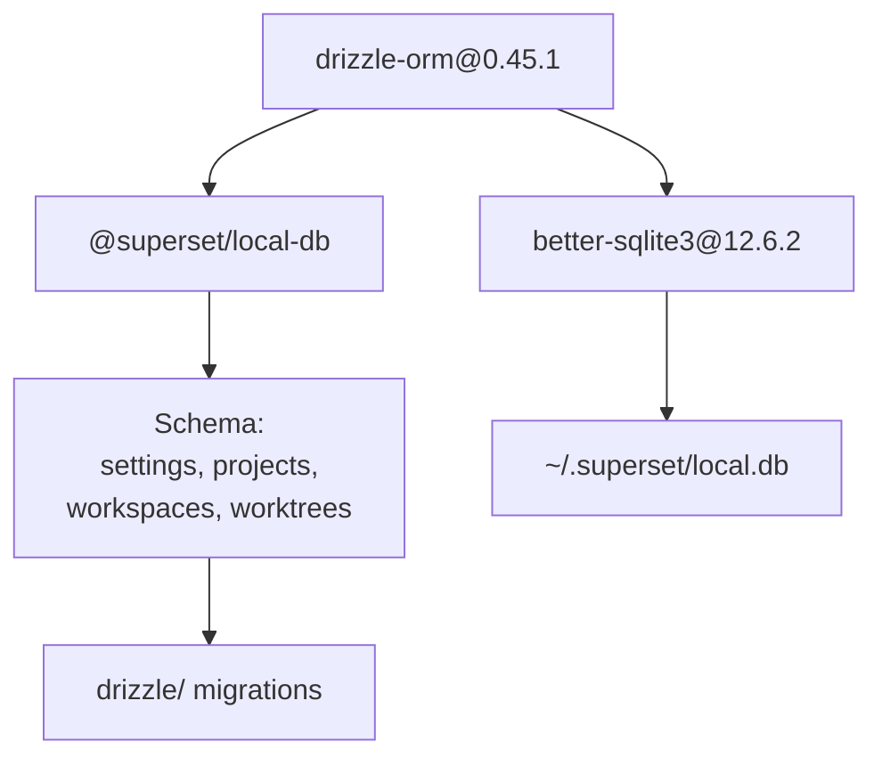

**Key Technologies:**

- **drizzle-orm@0.45.1**: TypeScript ORM ([apps/desktop/package.json:157]())
- **better-sqlite3@12.6.2**: Native SQLite bindings ([apps/desktop/package.json:148]())
- **@superset/local-db**: Local database schema package ([packages/local-db/package.json:1-19]())
- **drizzle-kit@0.31.8**: Schema migrations tool ([packages/local-db/package.json:17]())

**Local Tables:**

- `settings`: User preferences and configuration
- `projects`: Git repository metadata
- `workspaces`: Worktree instances
- `worktrees`: Git worktree paths

**Migration Path:** Migrations are stored in `packages/local-db/drizzle/` and copied to `dist/resources/migrations/` during build ([apps/desktop/electron-builder.ts:57-63]()).

**Sources:** [apps/desktop/package.json:148-157](), [packages/local-db/package.json:1-19](), [apps/desktop/electron-builder.ts:57-63]()

### Remote Database (PostgreSQL)

**PostgreSQL Stack:**

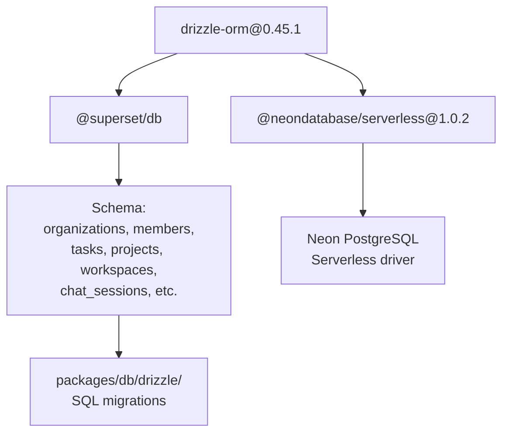

**Key Technologies:**

- **drizzle-orm@0.45.1**: TypeScript ORM ([packages/db/package.json:14]())
- **@neondatabase/serverless@1.0.2**: Neon PostgreSQL driver ([packages/db/package.json:13]())
- **@superset/db**: Shared database schema ([packages/db/package.json:1-24]())
- **drizzle-kit@0.31.8**: Schema push and migrations ([packages/db/package.json:21]())

**Deployment:** Neon branches are created per PR via GitHub Actions ([.github/workflows/deploy-preview.yml:47-62]()). Migrations run automatically via `bun drizzle-kit migrate` ([.github/workflows/deploy-preview.yml:60-62]()).

**Sources:** [packages/db/package.json:1-24](), [.github/workflows/deploy-preview.yml:47-62]()

---

## AI & Chat System

**Mastra Stack:**

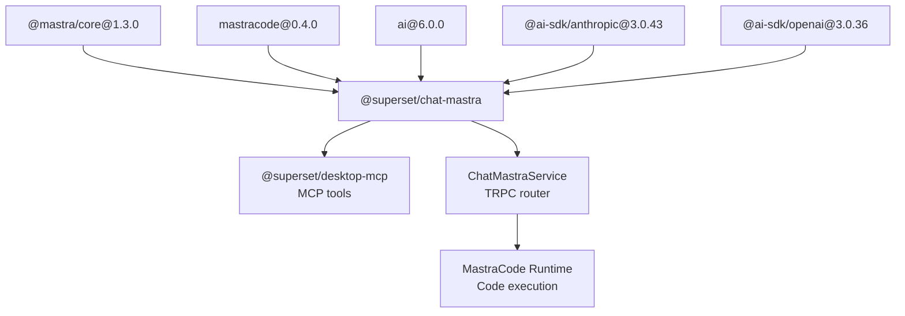

**Key Technologies:**

| Package               | Version      | Purpose                                                           |
| --------------------- | ------------ | ----------------------------------------------------------------- |
| @mastra/core          | 1.3.0        | AI agent framework ([apps/desktop/package.json:74]())             |
| mastracode            | 0.4.0        | Sandboxed code execution ([apps/desktop/package.json:177]())      |
| ai                    | 6.0.0        | Vercel AI SDK for streaming ([apps/desktop/package.json:146]())   |
| @ai-sdk/anthropic     | 3.0.43       | Claude models ([apps/desktop/package.json:38]())                  |
| @ai-sdk/openai        | 3.0.36       | OpenAI models ([apps/desktop/package.json:39]())                  |
| @superset/desktop-mcp | workspace:\* | MCP tool definitions ([packages/desktop-mcp/package.json:1-24]()) |

**Custom Mastra Build:** The project uses forked Mastra packages from `github.com/superset-sh/mastra` with Superset-specific patches ([package.json:49-51]()).

**Sources:** [apps/desktop/package.json:38-146](), [packages/desktop-mcp/package.json:1-24](), [package.json:49-51]()

---

## Backend API Technologies

### Next.js Framework

**Next.js Stack:**

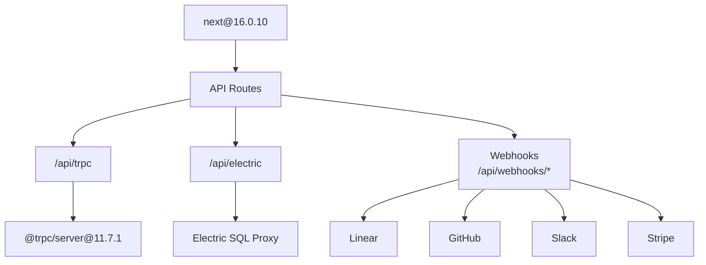

**Key Technologies:**

- **next@16.0.10**: React framework with API routes ([apps/api/package.json:44]())
- **@trpc/server@11.7.1**: tRPC server implementation ([apps/api/package.json:33]())
- **@superset/trpc**: Shared tRPC router definitions ([apps/api/package.json:30]())

**Deployment:** All Next.js apps deploy to Vercel via GitHub Actions ([.github/workflows/deploy-production.yml:1-533]()).

**Sources:** [apps/api/package.json:1-62](), [.github/workflows/deploy-production.yml:42-174]()

### Authentication

**better-auth Stack:**

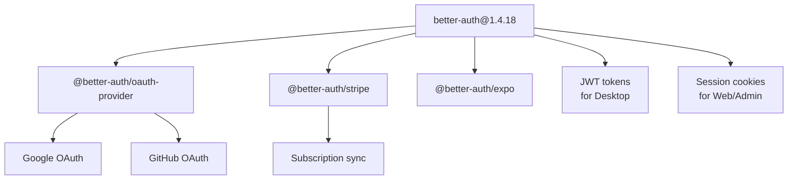

**Key Technologies:**

- **better-auth@1.4.18**: Full-stack auth framework ([apps/api/package.json:38]())
- **@better-auth/oauth-provider@1.4.18**: OAuth integration ([apps/api/package.json:15]())
- **@better-auth/stripe@1.4.18**: Stripe subscription sync ([apps/desktop/package.json:42]())
- **jose@6.1.3**: JWT signing and verification ([apps/api/package.json:42]())

**Auth Flow:** Desktop uses JWT tokens via Authorization header, Web/Admin use session cookies. All auth is handled via `@superset/auth` package ([packages/auth/package.json:1-36]()).

**Sources:** [apps/api/package.json:38](), [packages/auth/package.json:1-36]()

### External Service Integrations

**Integration Stack:**

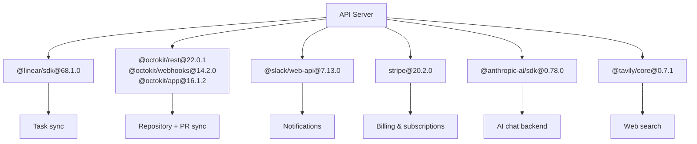

**Key Integrations:**

| Service   | SDK                      | Purpose                                                        |
| --------- | ------------------------ | -------------------------------------------------------------- |
| Linear    | @linear/sdk@68.1.0       | Issue tracking sync ([apps/api/package.json:18]())             |
| GitHub    | @octokit/rest@22.0.1     | Repository and PR management ([apps/api/package.json:20-22]()) |
| Slack     | @slack/web-api@7.13.0    | Notifications and webhooks ([apps/api/package.json:25]())      |
| Stripe    | stripe@20.2.0            | Billing and subscriptions ([apps/api/package.json:49]())       |
| Anthropic | @anthropic-ai/sdk@0.78.0 | Claude AI models ([apps/api/package.json:14]())                |
| Tavily    | @tavily/core@0.7.1       | AI web search ([apps/api/package.json:32]())                   |

**Sources:** [apps/api/package.json:14-49]()

### Background Jobs & Queue

**QStash & Upstash:**

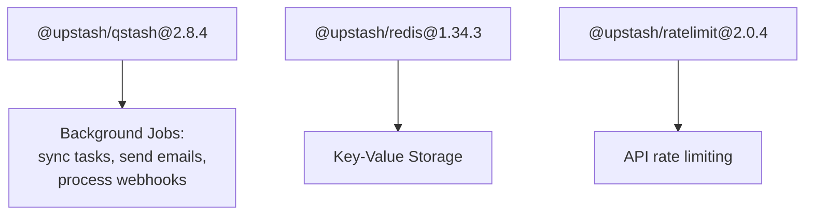

**Key Technologies:**

- **@upstash/qstash@2.8.4**: Serverless message queue ([apps/api/package.json:34]())
- **@upstash/redis@1.34.3**: Redis client for KV storage ([apps/api/package.json:36]())
- **@upstash/ratelimit@2.0.4**: Rate limiting ([apps/api/package.json:35]())

**Sources:** [apps/api/package.json:34-36]()

---

## Build & Development Tools

### Monorepo Tooling

**Build System:**

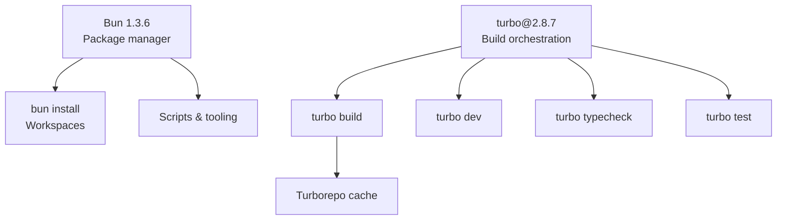

**Key Tools:**

- **Bun 1.3.6**: Package manager with workspace support ([package.json:16]())
- **turbo@2.8.7**: Monorepo build orchestration ([package.json:11]())
- **sherif@1.10.0**: Dependency validation ([package.json:10]())
- **@biomejs/biome@2.4.2**: Fast linter and formatter ([package.json:8]())

**Sources:** [package.json:1-56](), [biome.jsonc:1-32]()

### Desktop Build Pipeline

**Electron Build Chain:**

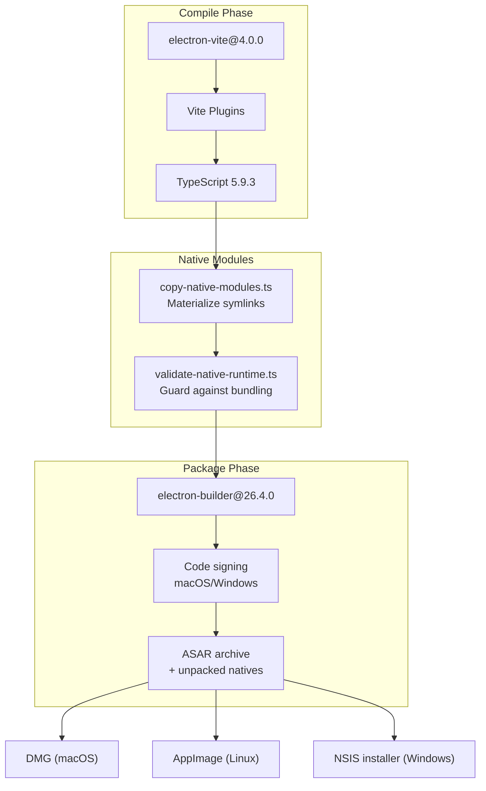

**Vite Configuration:**

The build is configured in [apps/desktop/electron.vite.config.ts:1-264]() with three separate entry points:

- **Main process**: [apps/desktop/electron.vite.config.ts:47-127]()
- **Preload scripts**: [apps/desktop/electron.vite.config.ts:129-158]()
- **Renderer process**: [apps/desktop/electron.vite.config.ts:160-263]()

**Key Plugins:**

- **@tanstack/router-plugin**: File-based routing code generation ([apps/desktop/electron.vite.config.ts:217-226]())
- **@tailwindcss/vite**: Tailwind CSS integration ([apps/desktop/electron.vite.config.ts:228]())
- **@vitejs/plugin-react**: React Fast Refresh ([apps/desktop/electron.vite.config.ts:235]())
- **@sentry/vite-plugin**: Sourcemap upload ([apps/desktop/electron.vite.config.ts:37-44]())

**Native Module Handling:**

Bun 1.3+ uses symlinks for workspace dependencies. Before packaging, [apps/desktop/scripts/copy-native-modules.ts:1-290]() materializes these symlinks into real files so `electron-builder` can package them into the ASAR archive.

**Sources:** [apps/desktop/electron.vite.config.ts:1-264](), [apps/desktop/scripts/copy-native-modules.ts:1-290](), [apps/desktop/scripts/validate-native-runtime.ts:1-290](), [apps/desktop/electron-builder.ts:1-149]()

### CI/CD Pipeline

**GitHub Actions Workflows:**

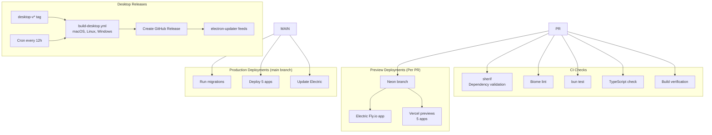

**Workflow Files:**

| Workflow                   | Trigger          | Purpose                                                                         |
| -------------------------- | ---------------- | ------------------------------------------------------------------------------- |
| ci.yml                     | Push, PR         | Run sherif, lint, test, typecheck, build ([.github/workflows/ci.yml:1-133]())   |
| deploy-preview.yml         | PR open/sync     | Deploy preview environments ([.github/workflows/deploy-preview.yml:1-659]())    |
| deploy-production.yml      | Push to main     | Deploy to production ([.github/workflows/deploy-production.yml:1-533]())        |
| build-desktop.yml          | Reusable         | Build Desktop for all platforms ([.github/workflows/build-desktop.yml:1-256]()) |
| release-desktop.yml        | `desktop-v*` tag | Stable Desktop release ([.github/workflows/release-desktop.yml:1-147]())        |
| release-desktop-canary.yml | Cron (12h)       | Canary Desktop release ([.github/workflows/release-desktop-canary.yml:1-158]()) |
| cleanup-preview.yml        | PR closed        | Delete preview resources ([.github/workflows/cleanup-preview.yml:1-58]())       |

**Sources:** [.github/workflows/ci.yml:1-133](), [.github/workflows/deploy-preview.yml:1-659](), [.github/workflows/build-desktop.yml:1-256]()

---

## Infrastructure & Deployment

### Hosting Platforms

**Deployment Architecture:**

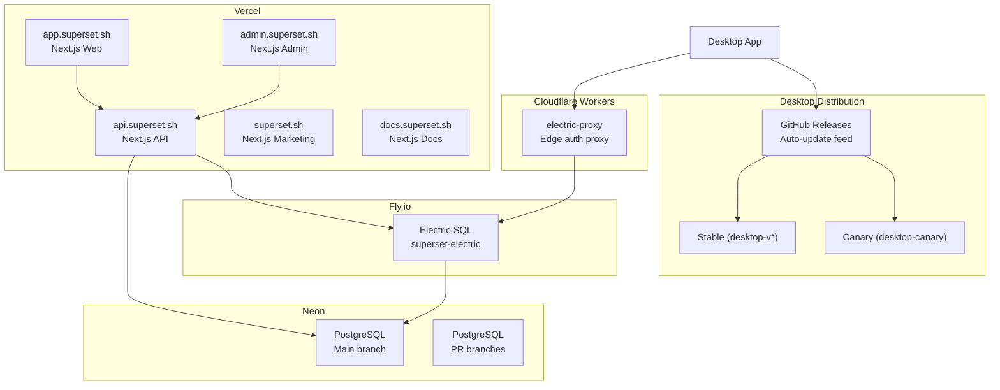

**Infrastructure Components:**

| Service          | Platform           | Purpose                   | Configuration                             |
| ---------------- | ------------------ | ------------------------- | ----------------------------------------- |
| API              | Vercel             | Backend API and tRPC      | [apps/api/package.json]()                 |
| Web              | Vercel             | Browser application       | [apps/web/package.json]()                 |
| Admin            | Vercel             | Admin dashboard           | [apps/admin/package.json]()               |
| Marketing        | Vercel             | Marketing site            | [apps/marketing/package.json]()           |
| Docs             | Vercel             | Documentation             | [apps/docs/package.json]()                |
| Electric SQL     | Fly.io             | Real-time sync service    | [fly.toml:1-33]()                         |
| Electric Proxy   | Cloudflare Workers | Auth gateway for Electric | [apps/electric-proxy/]()                  |
| PostgreSQL       | Neon               | Primary database          | Via GitHub Actions                        |
| Desktop Releases | GitHub Releases    | Auto-update feed          | [.github/workflows/release-desktop.yml]() |

**Vercel Deployment:** All Next.js apps use `vercel@50.22.1` CLI for builds ([.github/workflows/deploy-production.yml:9]()).

**Electric SQL:** Runs `electricsql/electric:1.4.13` image on Fly.io with 8GB RAM and 4 performance CPUs ([fly.toml:5-10]()).

**Sources:** [fly.toml:1-33](), [.github/workflows/deploy-production.yml:1-533]()

### Monitoring & Observability

**Observability Stack:**

```mermaid
graph TB
    subgraph "Error Tracking"
        SENTRY["@sentry/electron@7.7.0<br/>@sentry/nextjs@10.36.0"]
        SENTRY_VITE["@sentry/vite-plugin<br/>Sourcemap upload"]
    end

    subgraph "Analytics"
        POSTHOG["posthog-js@1.310.1<br/>posthog-node@5.24.7"]
    end

    subgraph "Session Recording"
        OUTLIT["@outlit/browser@1.4.3<br/>@outlit/node@1.4.3"]
    end

    DESKTOP["Desktop App"] --> SENTRY
    DESKTOP --> POSTHOG
    DESKTOP --> OUTLIT

    API["API Server"] --> SENTRY
    API --> POSTHOG

    WEB["Web/Admin Apps"] --> SENTRY
    WEB --> POSTHOG
    WEB --> OUTLIT

    SENTRY_VITE --> SENTRY
```

**Key Technologies:**

- **Sentry**: Error tracking and performance monitoring
  - Desktop: `@sentry/electron@7.7.0` ([apps/desktop/package.json:81]())
  - Next.js: `@sentry/nextjs@10.36.0` ([apps/api/package.json:23]())
  - Sourcemaps: `@sentry/vite-plugin@4.7.0` ([apps/desktop/package.json:220]())

- **PostHog**: Product analytics and feature flags
  - Browser: `posthog-js@1.310.1` ([apps/desktop/package.json:184]())
  - Node: `posthog-node@5.24.7` ([apps/api/package.json:45]())

- **Outlit**: Session recording and replay
  - Browser: `@outlit/browser@1.4.3` ([apps/desktop/package.json:75]())
  - Node: `@outlit/node@1.4.3` ([apps/desktop/package.json:76]())

**Sources:** [apps/desktop/package.json:75-184](), [apps/api/package.json:23-45]()

---

## Environment Configuration

**Environment Variable Management:**

```mermaid
graph TB
    ROOT_ENV[".env<br/>Monorepo root"]

    subgraph "Main Process"
        MAIN_ENV["src/main/env.main.ts<br/>@t3-oss/env-core"]
    end

    subgraph "Renderer Process"
        RENDERER_ENV["src/renderer/env.renderer.ts<br/>Build-time injection"]
    end

    subgraph "API Server"
        API_ENV["apps/api/src/env.ts<br/>@t3-oss/env-nextjs"]
    end

    ROOT_ENV --> MAIN_ENV
    ROOT_ENV --> RENDERER_ENV
    ROOT_ENV --> API_ENV

    MAIN_ENV --> RUNTIME["process.env<br/>Node.js runtime"]
    RENDERER_ENV --> BUILD_TIME["Vite define<br/>Compile-time strings"]
    API_ENV --> NEXTJS["Next.js runtime"]
```

**Environment Variable Tools:**

- **@t3-oss/env-core**: Type-safe env validation for Node.js ([apps/desktop/src/main/env.main.ts:9]())
- **@t3-oss/env-nextjs**: Type-safe env validation for Next.js ([apps/api/src/env.ts:1]())
- **zod@4.3.5**: Schema validation ([apps/desktop/package.json:216]())
- **dotenv@17.3.1**: Load `.env` files ([apps/desktop/package.json:156]())

**Main Process Variables:**

- `NODE_ENV`, `NEXT_PUBLIC_API_URL`, `NEXT_PUBLIC_ELECTRIC_URL`, `SENTRY_DSN_DESKTOP`, `NEXT_PUBLIC_POSTHOG_KEY` ([apps/desktop/src/main/env.main.ts:13-28]())

**API Variables:**

- `DATABASE_URL`, `ELECTRIC_URL`, `ELECTRIC_SECRET`, OAuth credentials, API keys for all external services ([apps/api/src/env.ts:10-49]())

**Validation:** Env validation runs at build time and fails the build if required variables are missing ([apps/desktop/electron.vite.config.ts:25-26]()).

**Sources:** [apps/desktop/src/main/env.main.ts:1-53](), [apps/desktop/src/renderer/env.renderer.ts:1-56](), [apps/api/src/env.ts:1-77]()

---

## Summary Table

### Desktop Application

| Category      | Key Technologies                                             |
| ------------- | ------------------------------------------------------------ |
| Runtime       | Electron 40.2.1, Node.js (via Electron), React 19.2.0        |
| Build         | electron-vite 4.0.0, Vite 7.1.3, TypeScript 5.9.3            |
| Packaging     | electron-builder 26.4.0, electron-updater 6.7.3              |
| UI Framework  | React 19.2.0, TanStack Router 1.147.3                        |
| Components    | Radix UI, @superset/ui, react-mosaic-component 6.1.1         |
| Styling       | Tailwind CSS 4.1.18, Framer Motion 12.23.26                  |
| State         | Zustand 5.0.8, TanStack Query 5.90.19                        |
| Communication | tRPC 11.7.1, trpc-electron 0.1.2                             |
| Data Sync     | Electric SQL 1.5.12, @tanstack/electric-db-collection 0.2.39 |
| Local DB      | Drizzle ORM 0.45.1, better-sqlite3 12.6.2                    |
| Terminal      | XTerm.js 6.1.0-beta.148, node-pty 1.1.0                      |
| Editor        | CodeMirror 6.x with 15+ language modes                       |
| AI            | Mastra 1.3.0, mastracode 0.4.0, Anthropic SDK 0.78.0         |
| Observability | Sentry 7.7.0, PostHog 1.310.1, Outlit 1.4.3                  |

### Backend Services

| Category      | Key Technologies                                |
| ------------- | ----------------------------------------------- |
| Framework     | Next.js 16.0.10, React 19.2.0                   |
| API           | tRPC 11.7.1, superjson 2.2.5                    |
| Database      | Drizzle ORM 0.45.1, Neon serverless 1.0.2       |
| Real-time     | Electric SQL 1.4.13 (Fly.io)                    |
| Auth          | better-auth 1.4.18, jose 6.1.3                  |
| Payments      | Stripe 20.2.0                                   |
| Integrations  | Linear SDK 68.1.0, Octokit 22.0.1, Slack 7.13.0 |
| AI            | Anthropic SDK 0.78.0, Tavily 0.7.1              |
| Queue         | Upstash QStash 2.8.4, Upstash Redis 1.34.3      |
| Observability | Sentry 10.36.0, PostHog (node) 5.24.7           |

### Infrastructure

| Category        | Key Technologies                             |
| --------------- | -------------------------------------------- |
| Package Manager | Bun 1.3.6                                    |
| Monorepo        | Turbo 2.8.7, Bun workspaces                  |
| Linting         | Biome 2.4.2                                  |
| CI/CD           | GitHub Actions                               |
| Hosting         | Vercel (Next.js apps), Fly.io (Electric SQL) |
| Database        | Neon PostgreSQL                              |
| Edge            | Cloudflare Workers (Electric proxy)          |
| Distribution    | GitHub Releases (Desktop auto-updates)       |

**Sources:** [apps/desktop/package.json:1-251](), [apps/api/package.json:1-62](), [package.json:1-56](), [fly.toml:1-33]()
