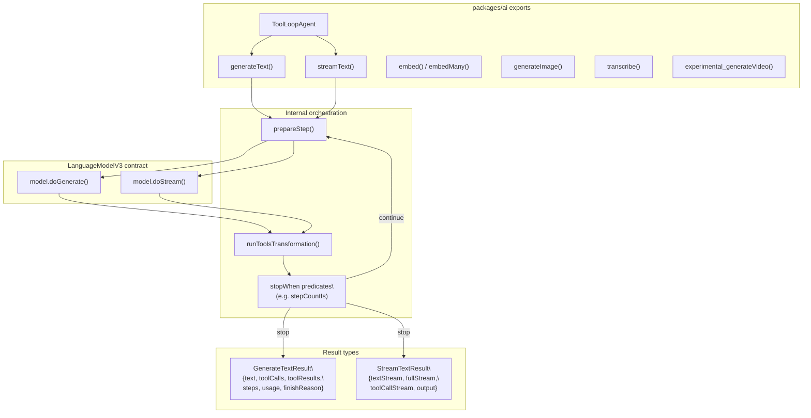
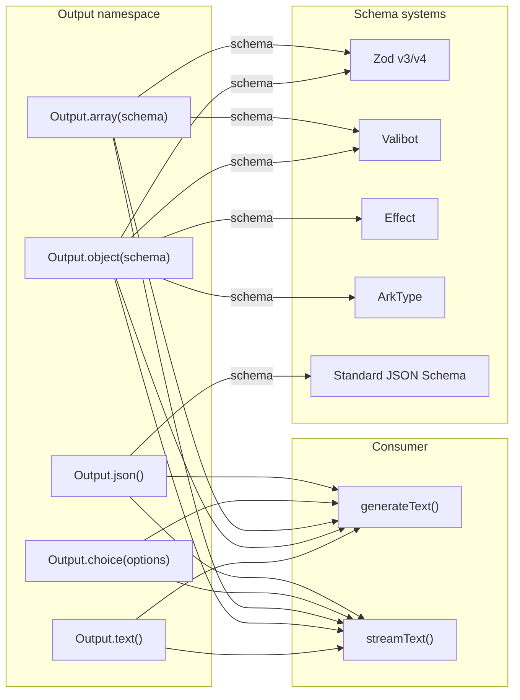
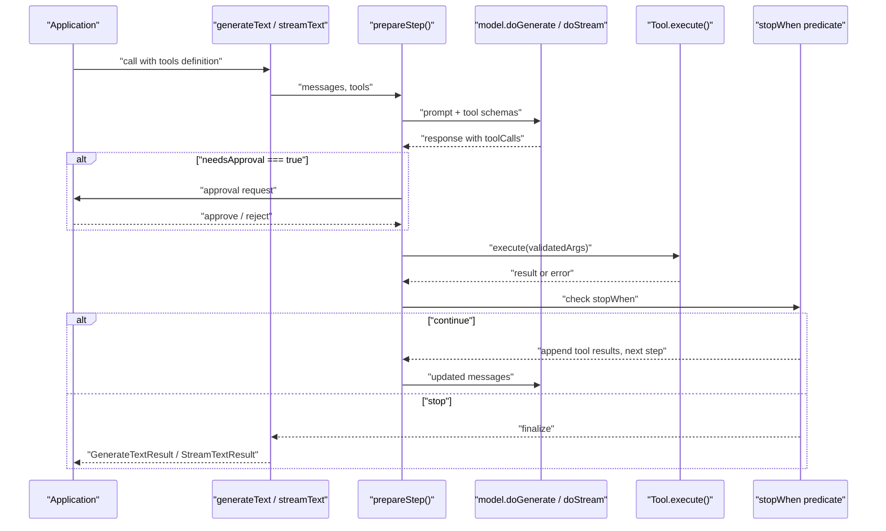
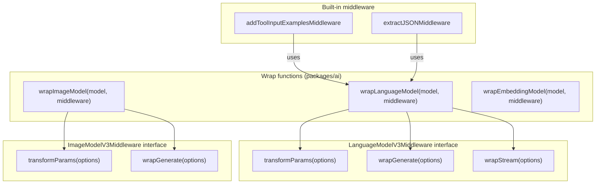
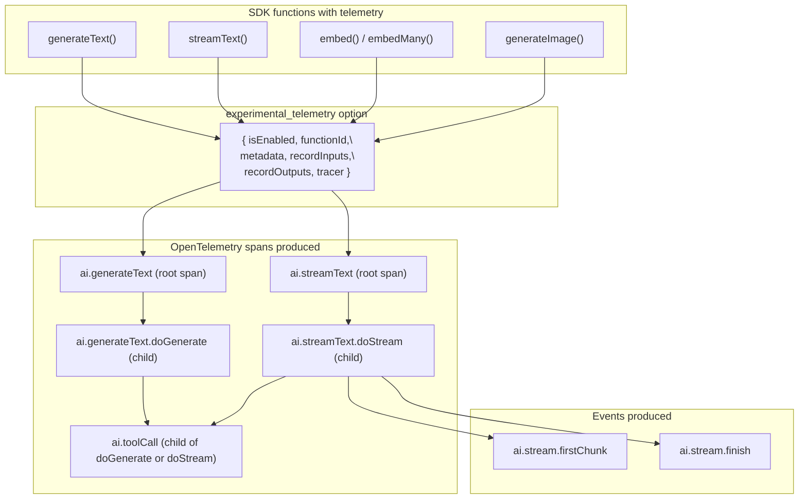

# Core SDK Functionality

Relevant source files

The following files were used as context for generating this wiki page:

- [content/docs/03-ai-sdk-core/60-telemetry.mdx](content/docs/03-ai-sdk-core/60-telemetry.mdx)
- [content/docs/07-reference/05-ai-sdk-errors/ai-no-object-generated-error.mdx](content/docs/07-reference/05-ai-sdk-errors/ai-no-object-generated-error.mdx)
- [packages/ai/CHANGELOG.md](packages/ai/CHANGELOG.md)
- [packages/ai/package.json](packages/ai/package.json)
- [packages/react/CHANGELOG.md](packages/react/CHANGELOG.md)
- [packages/react/package.json](packages/react/package.json)
- [packages/rsc/CHANGELOG.md](packages/rsc/CHANGELOG.md)
- [packages/rsc/package.json](packages/rsc/package.json)
- [packages/rsc/tests/e2e/next-server/CHANGELOG.md](packages/rsc/tests/e2e/next-server/CHANGELOG.md)
- [packages/svelte/CHANGELOG.md](packages/svelte/CHANGELOG.md)
- [packages/svelte/package.json](packages/svelte/package.json)
- [packages/vue/CHANGELOG.md](packages/vue/CHANGELOG.md)
- [packages/vue/package.json](packages/vue/package.json)

The core SDK, published as the `ai` package (`packages/ai`), provides the foundational APIs for building AI-powered applications. It implements provider-agnostic text generation, structured output validation, tool execution workflows, streaming, embedding, image generation, transcription, and observability primitives. This package is the primary entry point for developers, abstracting provider differences through a unified API.

For provider-specific implementations, see [Provider Ecosystem](#3). For UI framework integrations (React, Vue, Svelte), see [UI Framework Integrations](#4). For detailed coverage of individual subsystems, refer to child pages: [Text Generation](#2.1), [Structured Output](#2.2), [Tool Calling](#2.3), [Message Processing](#2.4), [Observability](#2.5), and [Middleware](#2.6).

---

## Package Structure and Dependencies

The `ai` package is the monorepo's central package, located at `packages/ai`, with exports defined in [packages/ai/package.json:42-61](). It depends on four workspace packages:

| Dependency               | Purpose                                                                          |
| ------------------------ | -------------------------------------------------------------------------------- |
| `@ai-sdk/provider`       | `LanguageModelV3`, `ImageModelV3`, `EmbeddingModelV3`, `VideoModelV3` interfaces |
| `@ai-sdk/provider-utils` | Schema validation, streaming utilities, error handling, retry logic              |
| `@ai-sdk/gateway`        | Default gateway for model routing via the Vercel AI Gateway                      |
| `@opentelemetry/api`     | OpenTelemetry integration for tracing and observability                          |

The package exports three entrypoints ([packages/ai/package.json:42-61]()):

| Entrypoint   | Purpose                                                                                                                    |
| ------------ | -------------------------------------------------------------------------------------------------------------------------- |
| `.`          | Main API surface: `generateText`, `streamText`, `embed`, `generateImage`, `transcribe`, tools, Output API, `ToolLoopAgent` |
| `./internal` | Internal utilities consumed by framework integration packages                                                              |
| `./test`     | Test helpers for SDK consumers                                                                                             |

**Sources:** [packages/ai/package.json:1-117]()

---

## Core Generation Functions

The following diagram shows the main callable functions exported from `packages/ai` and their relationship to the provider interface.

**Sources:** [packages/ai/package.json:42-61]()

### generateText

`generateText()` executes text generation and returns when complete. It accepts a `LanguageModelV3` model, a prompt (string or messages array), optional tools, and configuration options including `stopWhen`, `experimental_telemetry`, `timeout`, `output`, and `system`/`instructions`.

`GenerateTextResult` fields:

- `text` — Concatenated text from all steps
- `toolCalls` — Tool invocations with arguments
- `toolResults` — Execution results from tools
- `steps` — Full history of generation rounds
- `usage` — Token consumption metrics aggregated across steps
- `finishReason` — Completion status: `stop`, `length`, `content-filter`, `tool-calls`, `error`, `other`, `unknown`
- `output` — Validated structured output when using the Output API

### streamText

`streamText()` returns immediately with a `StreamTextResult` containing async iterables for incremental consumption:

- `textStream` — Raw text tokens as they arrive
- `fullStream` — Comprehensive stream including text deltas, tool calls, tool results, reasoning
- `toolCallStream` — Isolated stream of tool invocations
- `output` — Promise resolving to structured output when the Output API is used
- `elementStream` — Incremental array elements when using `Output.array()`

Both functions support multi-step tool calling loops via `stopWhen` conditions (e.g., `stepCountIs(n)`) and per-step timeouts via the `timeout` option.

### Other Generation Functions

| Function                       | Purpose                                              |
| ------------------------------ | ---------------------------------------------------- |
| `embed()` / `embedMany()`      | Generate text embeddings using an `EmbeddingModelV3` |
| `generateImage()`              | Generate images using an `ImageModelV3`              |
| `transcribe()`                 | Audio transcription                                  |
| `experimental_generateVideo()` | Video generation using a `VideoModelV3`              |

### ToolLoopAgent

`ToolLoopAgent` is a stable higher-level construct that wraps `generateText`/`streamText` in a configurable multi-step tool loop. It exposes `agent.generate()` and `agent.stream()` methods and accepts `onStepFinish`, `onFinish`, `stopWhen` (defaults to `stepCountIs(20)`), and `experimental_context`.

**Sources:** [packages/ai/package.json:1-117](), [packages/ai/CHANGELOG.md:718-719](), [content/docs/03-ai-sdk-core/60-telemetry.mdx:78-143]()

---

## Structured Output API

The Output API is passed as the `output` parameter to `generateText` or `streamText`. It integrates schema validation with generation, replacing the now-deprecated `generateObject` and `streamObject` functions.

| Output Mode              | Purpose                             | Schema Support                |
| ------------------------ | ----------------------------------- | ----------------------------- |
| `Output.text()`          | Default unstructured text (default) | N/A                           |
| `Output.object(schema)`  | Single validated object             | Zod, Valibot, Effect, ArkType |
| `Output.array(schema)`   | Array of validated objects          | Zod, Valibot, Effect, ArkType |
| `Output.choice(options)` | Discriminated union validation      | Zod, Valibot, Effect, ArkType |
| `Output.json()`          | Raw JSON with standard JSON Schema  | JSON Schema                   |

When used with `streamText`, the `output` property resolves once the stream is complete. `elementStream` on `StreamTextResult` provides incremental access to individual array elements when `Output.array()` is used. Type inference is fully supported — TypeScript infers the output type from the schema.

Note: `generateObject` and `streamObject` are deprecated in favour of the `output` parameter on `generateText`/`streamText`.

**Sources:** [packages/ai/package.json:82-84](), [packages/ai/CHANGELOG.md:540-541]()

---

## Tool Execution Framework

Tool definitions consist of:

| Field           | Type                                          | Purpose                                           |
| --------------- | --------------------------------------------- | ------------------------------------------------- |
| `description`   | `string` (optional)                           | Human-readable description for the model          |
| `parameters`    | Zod / Valibot / Effect / ArkType schema       | Validates tool call arguments                     |
| `execute`       | `async (args, options) => result`             | Runs client-side; receives `ToolExecutionOptions` |
| `needsApproval` | `boolean` or `(toolCall) => Promise<boolean>` | Triggers approval flow before execution           |
| `inputExamples` | array                                         | Example inputs to improve model tool usage        |
| `strict`        | `boolean`                                     | Tool-specific strict mode for schema enforcement  |

### Tool Categories

**User-defined tools** — Executed client-side. The SDK validates arguments against the schema before calling `execute`. Results are appended to the conversation context.

**Provider-defined tools** — Executed server-side by the AI provider (`providerExecuted: true`). No client-side `execute` is required. Examples: `openai.file_search`, `anthropic.computer_20251124`, `google.googleSearch`, `xai.x_search`.

### Multi-Step Execution

Tool execution loops are controlled by `stopWhen` predicates:

- `stepCountIs(n)` — Stop after `n` steps (default for `ToolLoopAgent` is 20)
- Custom predicate `(steps) => boolean`

Each step's tool results are appended to the conversation before the next provider call. Token usage is aggregated across all steps.

### Approval Workflow

When `needsApproval` is `true` (or a function returning `true`), the UI layer surfaces an approval request before the tool runs. This integrates with the `chat.addToolOutput()` method in the UI packages.

**Sources:** [packages/ai/CHANGELOG.md:599-603](), [packages/ai/CHANGELOG.md:670-675]()

---

## Middleware System

The middleware system enables transparent interception and transformation of model calls without modifying application code.

### Language Model Middleware

`wrapLanguageModel(model, middleware)` composes one or more middleware layers onto a `LanguageModelV3`. Middleware implements the `LanguageModelV3Middleware` interface:

| Hook              | Purpose                                                                    |
| ----------------- | -------------------------------------------------------------------------- |
| `transformParams` | Modify call parameters (prompt, tools, settings) before provider execution |
| `wrapGenerate`    | Intercept `doGenerate` — pre/post processing or response substitution      |
| `wrapStream`      | Intercept `doStream` — stream transformation or mock responses             |

Common patterns:

| Pattern       | Approach                                                               |
| ------------- | ---------------------------------------------------------------------- |
| Logging       | Wrap `doGenerate`/`doStream` to capture inputs and outputs             |
| Cost tracking | Extract `usage` from results in `wrapGenerate`                         |
| Caching       | Return cached response from `wrapGenerate` before calling `doGenerate` |
| Testing       | Return mock responses via `experimental_simulate`                      |

### Image and Embedding Middleware

`wrapImageModel` (added in [packages/ai/CHANGELOG.md:493-494]()) and `wrapEmbeddingModel` provide equivalent interception for `ImageModelV3` and `EmbeddingModelV3`.

### Built-in Middleware

- `addToolInputExamplesMiddleware` — Injects example inputs into tool definitions to improve model tool usage
- `extractJSONMiddleware` — Extracts JSON from model responses that may wrap JSON in prose

**Sources:** [packages/ai/CHANGELOG.md:493-494](), [packages/ai/CHANGELOG.md:622-623]()

---

## Observability and Telemetry

Telemetry is opt-in and configured per call via `experimental_telemetry`. The dependency on `@opentelemetry/api` is pinned at `1.9.0` ([packages/ai/package.json:66]()).

### Telemetry Configuration

The `experimental_telemetry` object accepts:

| Field           | Type                               | Default            | Purpose                                         |
| --------------- | ---------------------------------- | ------------------ | ----------------------------------------------- |
| `isEnabled`     | `boolean`                          | `false`            | Activate tracing                                |
| `functionId`    | `string`                           | —                  | Identifies the trace in observability platforms |
| `metadata`      | `Record<string, string \| number>` | —                  | Arbitrary metadata attached to spans            |
| `recordInputs`  | `boolean`                          | `true`             | Whether to record prompt and parameters         |
| `recordOutputs` | `boolean`                          | `true`             | Whether to record generated text and tool calls |
| `tracer`        | `Tracer`                           | global OTel tracer | Custom `TracerProvider`-sourced tracer          |

### Span Hierarchy

For `generateText`:

- `ai.generateText` — root span, full execution including all steps
  - `ai.generateText.doGenerate` — individual provider call
    - `ai.toolCall` — each tool execution

For `streamText`:

- `ai.streamText` — root span, full streaming session
  - `ai.streamText.doStream` — provider streaming call
    - `ai.stream.firstChunk` event — time to first token
    - `ai.toolCall` — each tool execution

Key span attributes include: model ID, provider, token usage (`promptTokens`, `completionTokens`, `totalTokens`), finish reason, time to first chunk, completion tokens per second. Full attribute reference: [content/docs/03-ai-sdk-core/60-telemetry.mdx:76-258]().

**Sources:** [content/docs/03-ai-sdk-core/60-telemetry.mdx:1-258](), [packages/ai/package.json:62-67]()

---

## Message Processing and Content Types

The core SDK implements standardized message types used by generation functions and UI packages.

### Model Message Types

| Type                    | Role        | Allowed Content Parts            |
| ----------------------- | ----------- | -------------------------------- |
| `UserModelMessage`      | `user`      | `text`, `file`, `tool-result`    |
| `AssistantModelMessage` | `assistant` | `text`, `tool-call`, `reasoning` |
| `SystemModelMessage`    | `system`    | `text`                           |
| `ToolModelMessage`      | `tool`      | `tool-result`                    |

### Content Part Types

| Part Type     | Description                                              |
| ------------- | -------------------------------------------------------- |
| `text`        | Plain text                                               |
| `file`        | File with MIME type; URL or base64 data URI              |
| `tool-call`   | Tool invocation with name, args, and ID                  |
| `tool-result` | Result or error from a tool call, linked by tool call ID |
| `reasoning`   | Reasoning traces (o1/o3-style models)                    |
| `source`      | Source attribution for grounding (e.g., Google Gemini)   |

### Key Conversion and Validation Functions

| Function                   | Purpose                                                                                                                                                 |
| -------------------------- | ------------------------------------------------------------------------------------------------------------------------------------------------------- |
| `convertToModelMessages()` | Converts `UIMessage[]` to `ModelMessage[]` for provider calls; handles file downloads, tool result mapping, and `convertDataPart` for custom data parts |
| `toResponseMessages()`     | Converts generation results back to messages for appending to conversation history                                                                      |
| `safeValidateUIMessages()` | Validates `UIMessage[]` without throwing; returns a success/failure result object (similar to Zod's `safeParse`)                                        |
| `pruneMessages()`          | Removes old messages to stay within context limits, with configurable `toolCalls` preservation strategy (`'before-last-message'`, `'all'`, `'none'`)    |

**Sources:** [packages/ai/CHANGELOG.md:718-720](), [packages/ai/CHANGELOG.md:858-859]()

---

## Version History and Stability

The core SDK is at major version 6, with version 6.0.81 as of [packages/ai/package.json:3](). The current major version introduced significant architectural changes:

- **V3 Provider Specification** - `LanguageModelV3`, `ImageModelV3`, `EmbeddingModelV3` interfaces
- **Stable Structured Outputs** - Output API moved from experimental to stable
- **Extended Token Usage** - Detailed token consumption metrics including reasoning tokens
- **Backwards Compatibility** - V2 provider adapters maintained during transition

The SDK follows a patch-only versioning policy during active development, with all changes defaulting to patch versions unless explicitly labeled for minor/major releases, as documented in the monorepo's CI configuration.

**Sources:** [packages/ai/package.json:1-117](), [packages/ai/CHANGELOG.md:584-765]()
