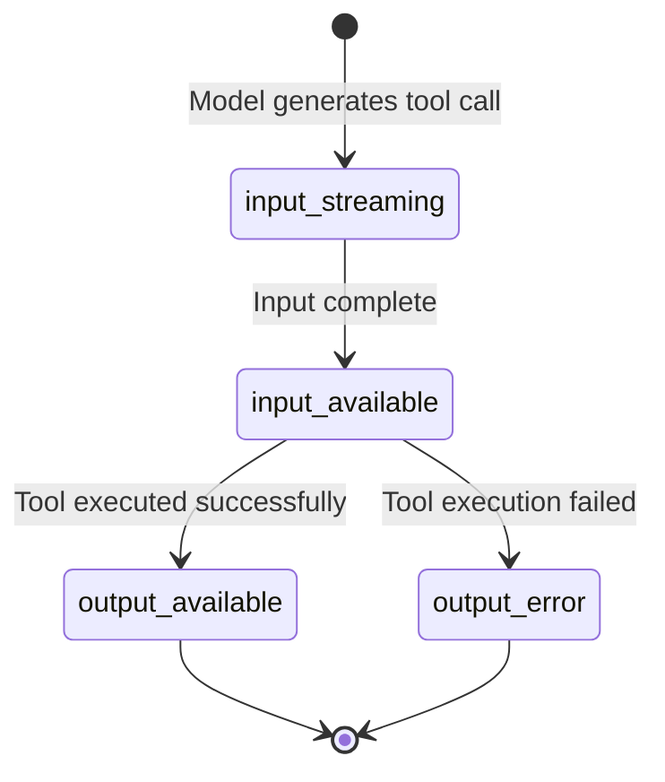
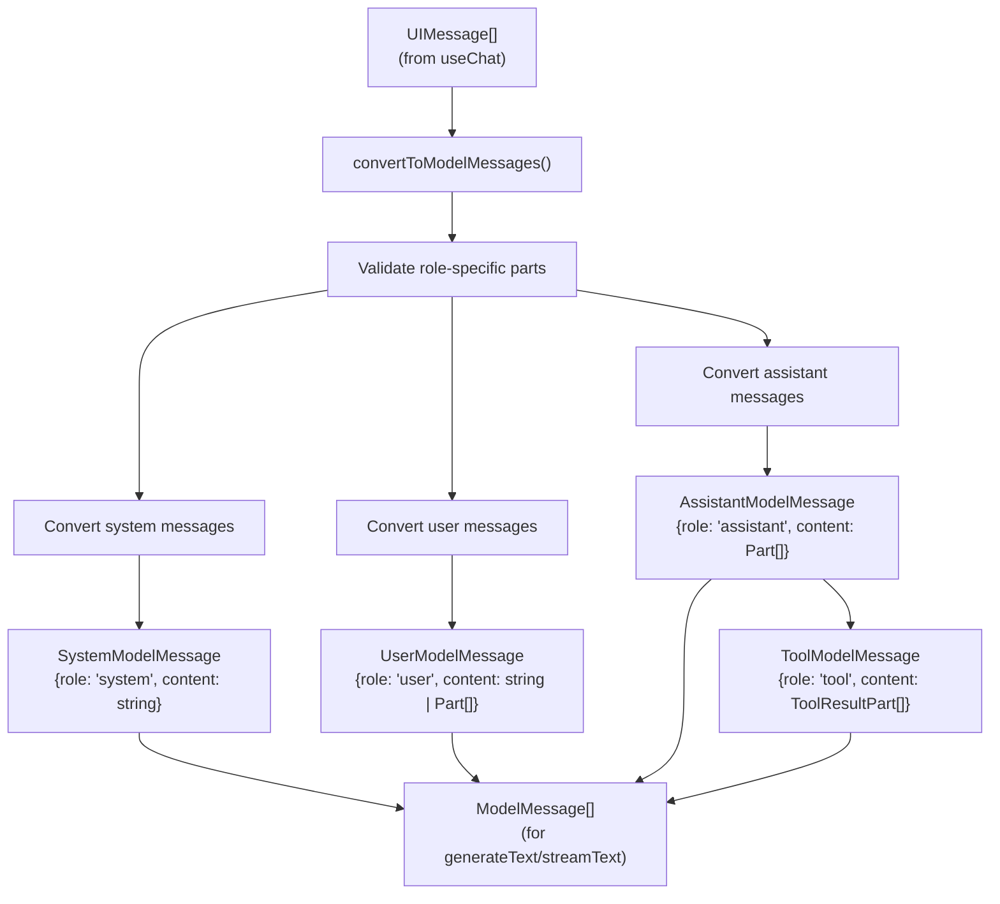
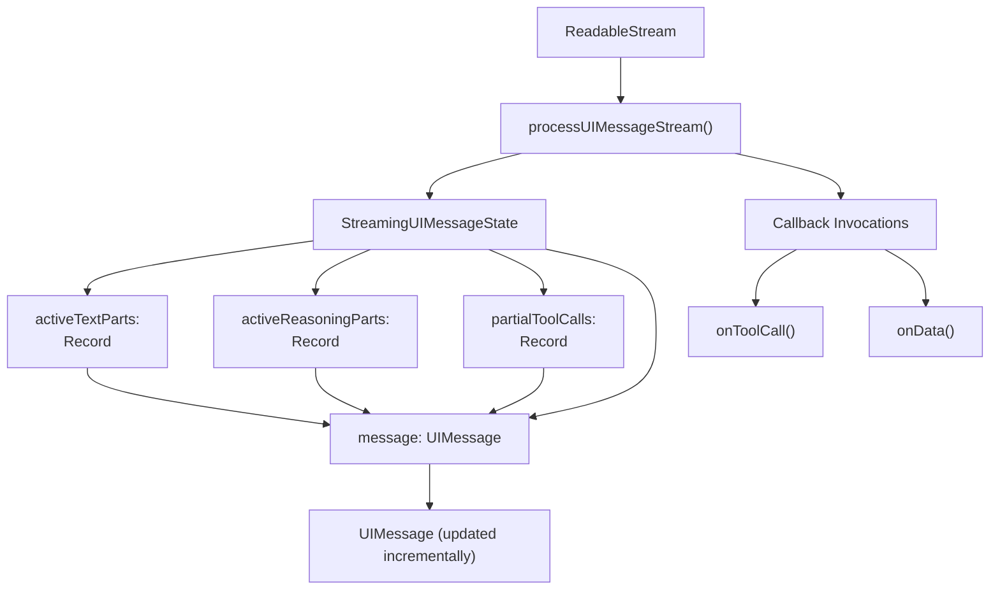
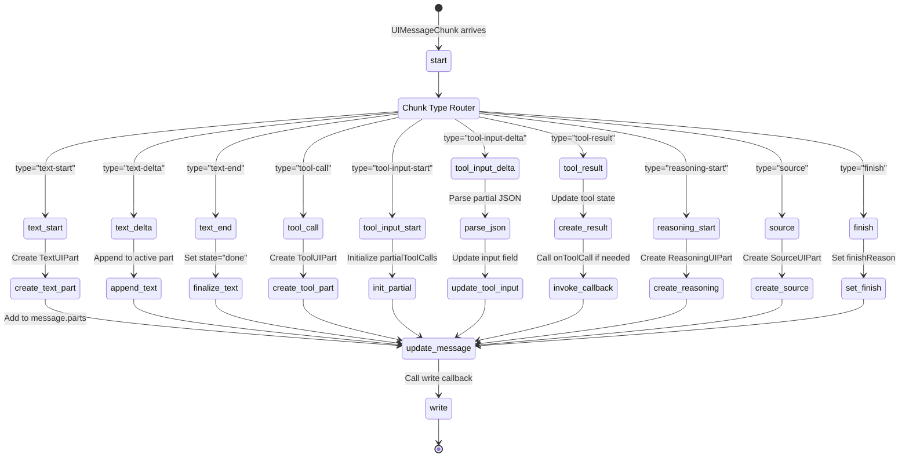
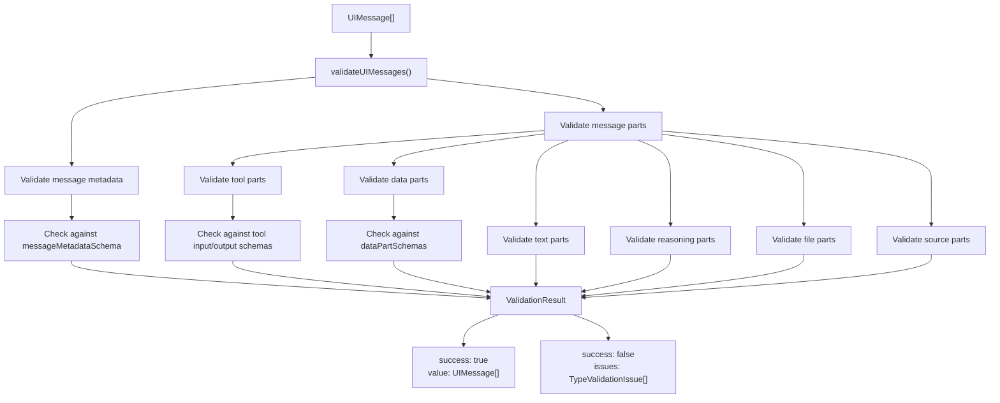

# Message Processing and Content Types

<details>
<summary>Relevant source files</summary>

The following files were used as context for generating this wiki page:

- [.changeset/calm-squids-sparkle.md](.changeset/calm-squids-sparkle.md)
- [.changeset/curvy-doors-shake.md](.changeset/curvy-doors-shake.md)
- [.changeset/serious-houses-argue.md](.changeset/serious-houses-argue.md)
- [content/docs/03-ai-sdk-core/05-generating-text.mdx](content/docs/03-ai-sdk-core/05-generating-text.mdx)
- [content/docs/03-ai-sdk-core/15-tools-and-tool-calling.mdx](content/docs/03-ai-sdk-core/15-tools-and-tool-calling.mdx)
- [content/docs/07-reference/01-ai-sdk-core/01-generate-text.mdx](content/docs/07-reference/01-ai-sdk-core/01-generate-text.mdx)
- [content/docs/07-reference/01-ai-sdk-core/02-stream-text.mdx](content/docs/07-reference/01-ai-sdk-core/02-stream-text.mdx)
- [content/docs/07-reference/02-ai-sdk-ui/01-use-chat.mdx](content/docs/07-reference/02-ai-sdk-ui/01-use-chat.mdx)
- [examples/ai-e2e-next/app/api/chat/tool-approval-options/route.ts](examples/ai-e2e-next/app/api/chat/tool-approval-options/route.ts)
- [examples/ai-e2e-next/app/chat/test-tool-approval-options/page.tsx](examples/ai-e2e-next/app/chat/test-tool-approval-options/page.tsx)
- [examples/ai-e2e-next/components/tool/dynamic-tool-with-approval-view.tsx](examples/ai-e2e-next/components/tool/dynamic-tool-with-approval-view.tsx)
- [packages/ai/src/generate-text/__snapshots__/generate-text.test.ts.snap](packages/ai/src/generate-text/__snapshots__/generate-text.test.ts.snap)
- [packages/ai/src/generate-text/__snapshots__/stream-text.test.ts.snap](packages/ai/src/generate-text/__snapshots__/stream-text.test.ts.snap)
- [packages/ai/src/generate-text/content-part.ts](packages/ai/src/generate-text/content-part.ts)
- [packages/ai/src/generate-text/execute-tool-call.test.ts](packages/ai/src/generate-text/execute-tool-call.test.ts)
- [packages/ai/src/generate-text/execute-tool-call.ts](packages/ai/src/generate-text/execute-tool-call.ts)
- [packages/ai/src/generate-text/generate-text-result.ts](packages/ai/src/generate-text/generate-text-result.ts)
- [packages/ai/src/generate-text/generate-text.test.ts](packages/ai/src/generate-text/generate-text.test.ts)
- [packages/ai/src/generate-text/generate-text.ts](packages/ai/src/generate-text/generate-text.ts)
- [packages/ai/src/generate-text/index.ts](packages/ai/src/generate-text/index.ts)
- [packages/ai/src/generate-text/run-tools-transformation.test.ts](packages/ai/src/generate-text/run-tools-transformation.test.ts)
- [packages/ai/src/generate-text/run-tools-transformation.ts](packages/ai/src/generate-text/run-tools-transformation.ts)
- [packages/ai/src/generate-text/stream-text-result.ts](packages/ai/src/generate-text/stream-text-result.ts)
- [packages/ai/src/generate-text/stream-text.test.ts](packages/ai/src/generate-text/stream-text.test.ts)
- [packages/ai/src/generate-text/stream-text.ts](packages/ai/src/generate-text/stream-text.ts)
- [packages/ai/src/telemetry/get-global-telemetry-integration.test.ts](packages/ai/src/telemetry/get-global-telemetry-integration.test.ts)
- [packages/ai/src/telemetry/get-global-telemetry-integration.ts](packages/ai/src/telemetry/get-global-telemetry-integration.ts)
- [packages/ai/src/telemetry/telemetry-integration.ts](packages/ai/src/telemetry/telemetry-integration.ts)
- [packages/ai/src/ui-message-stream/ui-message-chunks.ts](packages/ai/src/ui-message-stream/ui-message-chunks.ts)
- [packages/ai/src/ui/chat.test.ts](packages/ai/src/ui/chat.test.ts)
- [packages/ai/src/ui/chat.ts](packages/ai/src/ui/chat.ts)
- [packages/ai/src/ui/convert-to-model-messages.test.ts](packages/ai/src/ui/convert-to-model-messages.test.ts)
- [packages/ai/src/ui/convert-to-model-messages.ts](packages/ai/src/ui/convert-to-model-messages.ts)
- [packages/ai/src/ui/index.ts](packages/ai/src/ui/index.ts)
- [packages/ai/src/ui/process-ui-message-stream.test.ts](packages/ai/src/ui/process-ui-message-stream.test.ts)
- [packages/ai/src/ui/process-ui-message-stream.ts](packages/ai/src/ui/process-ui-message-stream.ts)
- [packages/ai/src/ui/ui-messages.ts](packages/ai/src/ui/ui-messages.ts)
- [packages/ai/src/ui/validate-ui-messages.test.ts](packages/ai/src/ui/validate-ui-messages.test.ts)
- [packages/ai/src/ui/validate-ui-messages.ts](packages/ai/src/ui/validate-ui-messages.ts)
- [packages/ai/src/util/notify.ts](packages/ai/src/util/notify.ts)
- [packages/react/src/use-chat.ts](packages/react/src/use-chat.ts)
- [packages/react/src/use-chat.ui.test.tsx](packages/react/src/use-chat.ui.test.tsx)
- [packages/svelte/src/chat.svelte.test.ts](packages/svelte/src/chat.svelte.test.ts)
- [packages/svelte/src/chat.svelte.ts](packages/svelte/src/chat.svelte.ts)

</details>


This page documents the message structures, content part types, and processing flows used throughout the AI SDK. Messages serve as the primary data structure for conversations between users and AI models, both in UI frameworks and in the core generation functions.

For information about tool calling and multi-step execution, see [Tool Calling and Multi-Step Agents](#2.3). For structured output generation, see [Structured Output (Output API)](#2.2).

## Overview

The AI SDK uses two primary message representations:

- **UIMessage**: Used in frontend frameworks (`useChat`, `Chat`) and for client-server communication
- **ModelMessage**: Used internally by `generateText` and `streamText` for LLM API calls

Messages are composed of **parts** - typed content segments that represent different kinds of information (text, tool calls, files, reasoning, etc.). The SDK handles conversion between these formats and validation of message structures.

## UIMessage Structure

### Message Schema

```mermaid
classDiagram
    class UIMessage {
        +string id
        +string role
        +METADATA metadata
        +Array~UIMessagePart~ parts
    }
    
    class UIMessagePart {
        <<interface>>
    }
    
    class TextUIPart {
        +type: "text"
        +string text
        +state: "streaming" | "done"
        +ProviderMetadata providerMetadata
    }
    
    class ReasoningUIPart {
        +type: "reasoning"
        +string text
        +state: "streaming" | "done"
        +ProviderMetadata providerMetadata
    }
    
    class ToolUIPart {
        +type: "tool-{toolName}"
        +string toolCallId
        +state: "input-streaming" | "input-available" | "output-available" | "output-error"
        +unknown input
        +unknown output
        +string errorText
        +boolean providerExecuted
    }
    
    class FileUIPart {
        +type: "file"
        +string url
        +string mediaType
        +string filename
    }
    
    class SourceUrlUIPart {
        +type: "source-url"
        +string sourceId
        +string url
        +string title
    }
    
    class SourceDocumentUIPart {
        +type: "source-document"
        +string sourceId
        +string mediaType
        +string title
        +string filename
    }
    
    class DataUIPart {
        +type: "data-{dataType}"
        +unknown data
    }
    
    class StepStartUIPart {
        +type: "step-start"
    }
    
    UIMessage --> UIMessagePart
    UIMessagePart <|-- TextUIPart
    UIMessagePart <|-- ReasoningUIPart
    UIMessagePart <|-- ToolUIPart
    UIMessagePart <|-- FileUIPart
    UIMessagePart <|-- SourceUrlUIPart
    UIMessagePart <|-- SourceDocumentUIPart
    UIMessagePart <|-- DataUIPart
    UIMessagePart <|-- StepStartUIPart
```

**UIMessage Properties**:
- `id`: Unique identifier for the message
- `role`: One of `"system"`, `"user"`, or `"assistant"`
- `metadata`: Optional typed metadata (defined by `METADATA` generic)
- `parts`: Array of content parts that compose the message

Sources: [packages/ai/src/ui/ui-messages.ts:42-73]()

### Role-Specific Part Constraints

| Role | Allowed Part Types |
|------|-------------------|
| `system` | `text` |
| `user` | `text`, `file` |
| `assistant` | `text`, `reasoning`, `tool-*`, `file`, `source-url`, `source-document`, `data-*`, `step-start` |

Sources: [packages/ai/src/ui/ui-messages.ts:42-73](), [packages/ai/src/ui/validate-ui-messages.ts:1-20]()

## Content Part Types

### Text Parts

```typescript
type TextUIPart = {
  type: 'text';
  text: string;
  state?: 'streaming' | 'done';
  providerMetadata?: ProviderMetadata;
}
```

Text parts represent natural language content. The `state` field tracks streaming progress:
- `'streaming'`: Content is still being generated
- `'done'`: Content generation is complete
- `undefined`: State not tracked (typically for completed messages)

Sources: [packages/ai/src/ui/ui-messages.ts:89-109]()

### Reasoning Parts

```typescript
type ReasoningUIPart = {
  type: 'reasoning';
  text: string;
  state?: 'streaming' | 'done';
  providerMetadata?: ProviderMetadata;
}
```

Reasoning parts contain the model's internal reasoning process (e.g., chain-of-thought). Only supported by specific models like OpenAI's reasoning models (`o1`, `o3-mini`) and Anthropic's thinking models.

Sources: [packages/ai/src/ui/ui-messages.ts:111-131]()

### Tool Invocation Parts

Tool parts track the lifecycle of tool calls from input generation through execution:



**Static Tool Parts** (type-safe):
```typescript
type ToolUIPart<TOOLS extends UITools> = {
  type: `tool-${keyof TOOLS & string}`;
  toolCallId: string;
  state: 'input-streaming' | 'input-available' | 'output-available' | 'output-error';
  input: TOOLS[NAME]['input'];
  output?: TOOLS[NAME]['output'];
  errorText?: string;
  providerExecuted?: boolean;
  title?: string;
  callProviderMetadata?: ProviderMetadata;
  resultProviderMetadata?: ProviderMetadata;
}
```

**Dynamic Tool Parts** (runtime-typed):
```typescript
type DynamicToolUIPart = {
  type: 'tool-dynamic';
  toolName: string;
  toolCallId: string;
  state: 'input-streaming' | 'input-available' | 'output-available' | 'output-error';
  input: unknown;
  output?: unknown;
  errorText?: string;
  providerExecuted?: boolean;
  title?: string;
}
```

The `providerExecuted` flag indicates whether the tool was executed by the provider (server-side) or requires client-side execution.

Sources: [packages/ai/src/ui/ui-messages.ts:144-236]()

### File Parts

```typescript
type FileUIPart = {
  type: 'file';
  url: string;
  mediaType: string;
  filename?: string;
}
```

File parts represent attachments in user messages or generated files in assistant messages. The `url` can be:
- Base64 data URL (`data:image/png;base64,...`)
- HTTP/HTTPS URL
- Object URL (for browser File objects)

Sources: [packages/ai/src/ui/ui-messages.ts:238-249]()

### Source Parts

**URL Sources**:
```typescript
type SourceUrlUIPart = {
  type: 'source-url';
  sourceId: string;
  url: string;
  title?: string;
  providerMetadata?: ProviderMetadata;
}
```

**Document Sources**:
```typescript
type SourceDocumentUIPart = {
  type: 'source-document';
  sourceId: string;
  mediaType: string;
  title?: string;
  filename?: string;
  providerMetadata?: ProviderMetadata;
}
```

Source parts indicate references used by the model (e.g., web search results, document retrieval). Generated by provider-executed tools like `web_search` or `googleSearch`.

Sources: [packages/ai/src/ui/ui-messages.ts:133-142](), [packages/ai/src/ui/ui-messages.ts:251-264]()

### Data Parts

```typescript
type DataUIPart<DATA_TYPES extends UIDataTypes> = {
  type: `data-${keyof DATA_TYPES & string}`;
  data: DATA_TYPES[KEY];
}
```

Data parts allow applications to embed custom typed data in messages. The data type must be registered in the chat's `dataPartSchemas`:

```typescript
const chat = new Chat({
  dataPartSchemas: {
    'user-sentiment': z.object({
      sentiment: z.enum(['positive', 'negative', 'neutral']),
      confidence: z.number()
    })
  }
});
```

Sources: [packages/ai/src/ui/ui-messages.ts:266-272]()

### Step Start Parts

```typescript
type StepStartUIPart = {
  type: 'step-start';
}
```

Step start parts mark the beginning of a new generation step in multi-step interactions (when using `stopWhen` conditions).

Sources: [packages/ai/src/ui/ui-messages.ts:274-279]()

## Message Conversion Flow

### UIMessage to ModelMessage Conversion



The conversion process handles several transformations:

1. **Text part aggregation**: Multiple text parts are concatenated
2. **Tool call extraction**: Tool parts in `input-available` state become `tool-call` parts
3. **Tool result extraction**: Tool parts in `output-available` or `output-error` state become `tool-result` parts
4. **Reasoning extraction**: Reasoning parts are converted to model reasoning format
5. **File preservation**: File parts are preserved as-is
6. **Provider metadata merging**: Metadata from multiple parts is merged

Sources: [packages/ai/src/ui/convert-to-model-messages.ts:42-241]()

### Conversion Example

**Input UIMessage**:
```typescript
{
  id: 'msg-1',
  role: 'assistant',
  parts: [
    { type: 'text', text: 'Let me check the weather.', state: 'done' },
    {
      type: 'tool-weather',
      toolCallId: 'call-123',
      state: 'output-available',
      input: { location: 'San Francisco' },
      output: { temperature: 72, conditions: 'sunny' }
    },
    { type: 'text', text: 'The weather is 72°F and sunny.', state: 'done' }
  ]
}
```

**Output ModelMessages**:
```typescript
[
  {
    role: 'assistant',
    content: [
      { type: 'text', text: 'Let me check the weather.' },
      {
        type: 'tool-call',
        toolCallId: 'call-123',
        toolName: 'weather',
        input: { location: 'San Francisco' }
      },
      { type: 'text', text: 'The weather is 72°F and sunny.' }
    ]
  },
  {
    role: 'tool',
    content: [
      {
        type: 'tool-result',
        toolCallId: 'call-123',
        toolName: 'weather',
        result: { temperature: 72, conditions: 'sunny' }
      }
    ]
  }
]
```

Sources: [packages/ai/src/ui/convert-to-model-messages.ts:42-241](), [packages/ai/src/ui/convert-to-model-messages.test.ts:1-50]()

### Handling Incomplete Tool Calls

When `ignoreIncompleteToolCalls: true`, tool parts in `input-streaming` or `input-available` states are filtered out before conversion. This is useful for creating clean conversation histories.

Sources: [packages/ai/src/ui/convert-to-model-messages.ts:54-64]()

## Stream Processing

### UIMessageChunk to UIMessage Assembly



**StreamingUIMessageState Structure**:
- `message`: The UIMessage being built
- `activeTextParts`: Map of streaming text parts by chunk ID
- `activeReasoningParts`: Map of streaming reasoning parts by chunk ID
- `partialToolCalls`: Map of in-progress tool calls
- `finishReason`: The reason generation finished (set on completion)

Sources: [packages/ai/src/ui/process-ui-message-stream.ts:33-74]()

### Chunk Processing Logic



Key processing steps:

1. **Text streaming**: Text parts accumulate deltas until `text-end`, then state changes to `'done'`
2. **Tool input streaming**: JSON is parsed incrementally using `parsePartialJson()`, allowing UI to display in-progress tool calls
3. **Tool execution**: When `tool-result` arrives, the part state transitions to `output-available` or `output-error`
4. **Validation**: Data parts and message metadata are validated against schemas
5. **Callback invocation**: `onToolCall` and `onData` callbacks fire synchronously during processing

Sources: [packages/ai/src/ui/process-ui-message-stream.ts:76-550]()

### Tool Call Streaming Example

**Chunk sequence**:
```typescript
// 1. Tool call announced
{ type: 'tool-call', toolName: 'weather', toolCallId: 'call-1' }

// 2. Input starts streaming
{ type: 'tool-input-start', toolName: 'weather', toolCallId: 'call-1' }

// 3. Input chunks arrive
{ type: 'tool-input-delta', toolCallId: 'call-1', delta: '{"loc' }
{ type: 'tool-input-delta', toolCallId: 'call-1', delta: 'ation":"' }
{ type: 'tool-input-delta', toolCallId: 'call-1', delta: 'SF"}' }

// 4. Input complete
{ type: 'tool-input-delta', toolCallId: 'call-1', delta: '', state: 'input-available' }

// 5. Result arrives
{ type: 'tool-result', toolCallId: 'call-1', result: { temp: 72 } }
```

**Resulting UIMessage parts**:
```typescript
[
  {
    type: 'tool-weather',
    toolCallId: 'call-1',
    state: 'output-available',
    input: { location: 'SF' },
    output: { temp: 72 }
  }
]
```

Sources: [packages/ai/src/ui/process-ui-message-stream.ts:226-398](), [packages/ai/src/ui/process-ui-message-stream.test.ts:400-500]()

## Message Validation

### Validation Process



**Validation Scopes**:
- **Message metadata**: Validated against `messageMetadataSchema` if provided
- **Tool inputs**: Validated against tool's `inputSchema` when in `input-available` or later states
- **Tool outputs**: Validated against tool's `outputSchema` when in `output-available` state
- **Data parts**: Validated against corresponding schema in `dataPartSchemas`
- **Part structure**: Type-checked for required fields and valid states

Sources: [packages/ai/src/ui/validate-ui-messages.ts:1-300]()

### Safe Validation

```typescript
const result = safeValidateUIMessages({
  messages,
  messageMetadataSchema,
  dataPartSchemas,
  tools
});

if (!result.success) {
  for (const issue of result.issues) {
    console.error(`Validation error at ${issue.path.join('.')}:`, issue.message);
  }
}
```

The `safeValidateUIMessages()` function returns a result object instead of throwing, allowing graceful error handling.

Sources: [packages/ai/src/ui/validate-ui-messages.ts:230-250]()

## Provider Metadata

Provider metadata flows through message parts to preserve provider-specific information:

| Part Type | Metadata Fields |
|-----------|----------------|
| Text | `providerMetadata` |
| Reasoning | `providerMetadata` |
| Tool (call) | `callProviderMetadata` |
| Tool (result) | `resultProviderMetadata` |
| Source | `providerMetadata` |
| File | `providerMetadata` |

During `convertToModelMessages()`, provider metadata from multiple parts is merged and attached to the corresponding `ModelMessage` as `providerOptions`.

Sources: [packages/ai/src/ui/ui-messages.ts:89-264](), [packages/ai/src/ui/convert-to-model-messages.ts:70-85]()

## Integration Points

### useChat Integration

The `useChat` hook receives messages from `processUIMessageStream()` and maintains them in reactive state:

```typescript
const { messages } = useChat({
  onToolCall: async ({ toolCall }) => {
    // Automatically invoked when tool-call chunk arrives
    // Can return tool output for immediate execution
  }
});
```

Messages flow: Server → UIMessageChunk stream → `processUIMessageStream()` → UIMessage → React state

Sources: [packages/react/src/use-chat.ts:58-173](), [packages/ai/src/ui/chat.ts:1-700]()

### generateText/streamText Integration

Core generation functions produce `ContentPart[]` which are converted to UIMessages when using `toUIMessageStreamResponse()`:

```typescript
const result = streamText({
  model,
  tools,
  prompt
});

return result.toUIMessageStreamResponse();
```

Content flow: LLM response → `ContentPart[]` → `runToolsTransformation()` → `TextStreamPart[]` → UIMessageChunk stream

Sources: [packages/ai/src/generate-text/stream-text.ts:1-1500](), [packages/ai/src/generate-text/run-tools-transformation.ts:1-500]()