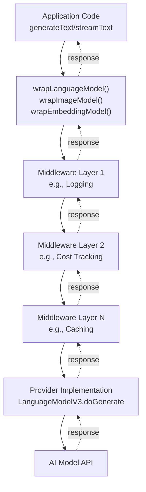
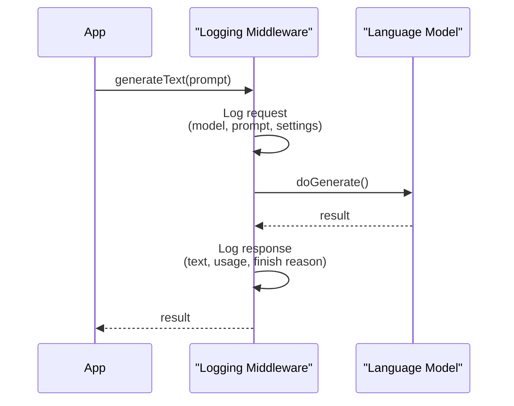
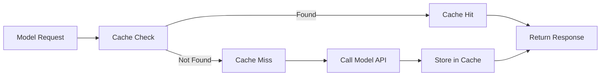
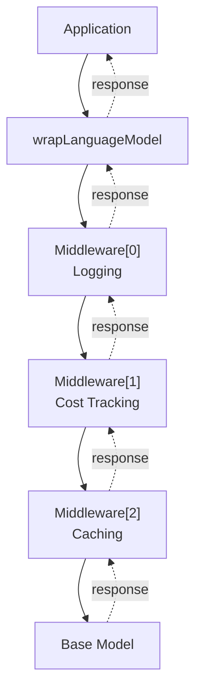
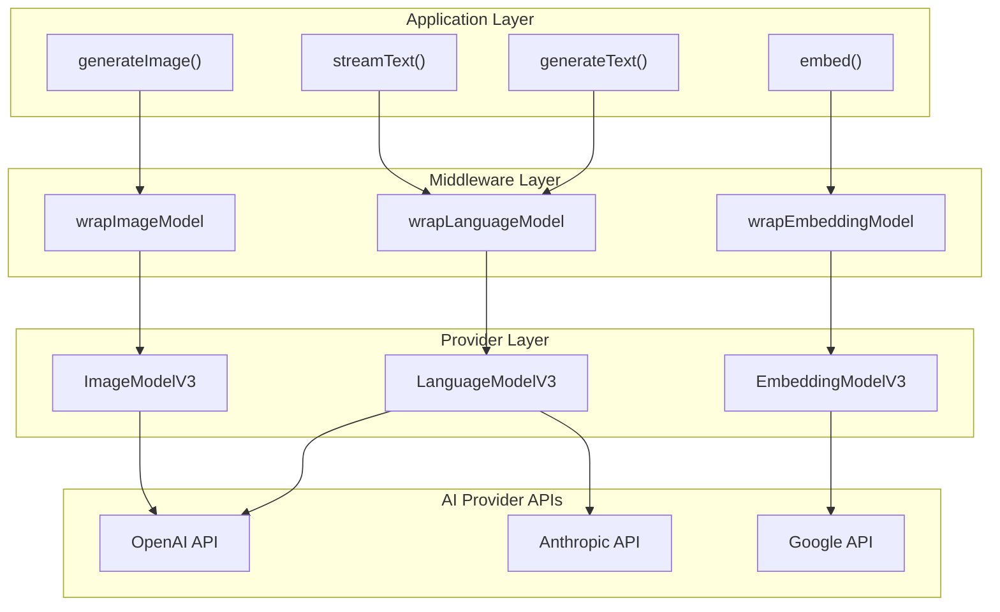

# Middleware System

Relevant source files

The following files were used as context for generating this wiki page:

- [packages/ai/CHANGELOG.md](packages/ai/CHANGELOG.md)
- [packages/ai/package.json](packages/ai/package.json)
- [packages/react/CHANGELOG.md](packages/react/CHANGELOG.md)
- [packages/react/package.json](packages/react/package.json)
- [packages/rsc/CHANGELOG.md](packages/rsc/CHANGELOG.md)
- [packages/rsc/package.json](packages/rsc/package.json)
- [packages/rsc/tests/e2e/next-server/CHANGELOG.md](packages/rsc/tests/e2e/next-server/CHANGELOG.md)
- [packages/svelte/CHANGELOG.md](packages/svelte/CHANGELOG.md)
- [packages/svelte/package.json](packages/svelte/package.json)
- [packages/vue/CHANGELOG.md](packages/vue/CHANGELOG.md)
- [packages/vue/package.json](packages/vue/package.json)

## Purpose and Scope

The middleware system provides a mechanism to intercept and modify AI model calls at runtime, enabling cross-cutting concerns such as logging, cost tracking, caching, and custom transformations. This document covers the three core middleware wrappers (`wrapLanguageModel`, `wrapImageModel`, `wrapEmbeddingModel`) and their application patterns.

For information about the core text generation APIs that middleware wraps, see [Text Generation (generateText and streamText)](#2.1). For tool-related middleware specifically, see [Tool Calling and Multi-Step Agents](#2.3). For observability features that complement middleware, see [Observability and Telemetry](#2.5).

---

## Middleware Architecture

The middleware system operates as an interception layer between the application and provider implementations, allowing modification of model calls without changing the underlying provider code.

### System Overview

**Diagram: Middleware Execution Flow**

Middleware wraps the model in layers, with each layer intercepting both the request (top-to-bottom) and response (bottom-to-top) flows. Multiple middleware functions can be composed, executing in the order they are applied.

Sources: [packages/ai/CHANGELOG.md:494](), [packages/ai/CHANGELOG.md:624]()

---

## Core Middleware Wrappers

### wrapLanguageModel

The `wrapLanguageModel` function intercepts language model calls made through `generateText`, `streamText`, and agent operations. It returns a new `LanguageModelV3` instance with middleware applied.

#### Parameters

| Parameter    | Type                                                       | Required | Description                                                  |
| ------------ | ---------------------------------------------------------- | -------- | ------------------------------------------------------------ |
| `model`      | `LanguageModelV3`                                          | Yes      | The original model to wrap                                   |
| `middleware` | `LanguageModelV3Middleware \| LanguageModelV3Middleware[]` | Yes      | One or more middleware to apply                              |
| `modelId`    | `string`                                                   | No       | Custom model ID to override the original model's ID          |
| `providerId` | `string`                                                   | No       | Custom provider ID to override the original model's provider |

#### LanguageModelV3Middleware Interface

`LanguageModelV3Middleware` allows interception of:

- `wrapGenerate`: Intercepts `doGenerate` calls (non-streaming)
- `wrapStream`: Intercepts `doStream` calls (streaming)
- `transformParams`: Transforms call parameters before forwarding to next layer

Each method receives the wrapped model and call parameters, enabling:

- Pre-processing of inputs (prompts, tools, settings)
- Post-processing of outputs (text, tool calls, usage)
- Error handling and transformation
- Bypassing the underlying model entirely (e.g., for caching)

**Sources:** [content/docs/07-reference/01-ai-sdk-core/60-wrap-language-model.mdx](), [packages/ai/CHANGELOG.md:620-628]()

### wrapImageModel

The `wrapImageModel` function intercepts image generation model calls. Added in `ai@6.0.12`.

#### Parameters

| Parameter    | Type                                                 | Required | Description                      |
| ------------ | ---------------------------------------------------- | -------- | -------------------------------- |
| `model`      | `ImageModelV3`                                       | Yes      | The original image model to wrap |
| `middleware` | `ImageModelV3Middleware \| ImageModelV3Middleware[]` | Yes      | One or more middleware to apply  |

#### ImageModelV3Middleware Interface

`ImageModelV3Middleware` intercepts:

- `wrapGenerate`: Image generation calls (`doGenerate`)
- `transformParams`: Transforms generation parameters (prompt, size, aspect ratio, etc.)

**Sources:** [packages/ai/CHANGELOG.md:620-628]()

### wrapEmbeddingModel

The `wrapEmbeddingModel` function intercepts embedding model calls. Added in `ai@6.0.0`.

#### Parameters

| Parameter    | Type                                                         | Required | Description                          |
| ------------ | ------------------------------------------------------------ | -------- | ------------------------------------ |
| `model`      | `EmbeddingModelV3`                                           | Yes      | The original embedding model to wrap |
| `middleware` | `EmbeddingModelV3Middleware \| EmbeddingModelV3Middleware[]` | Yes      | One or more middleware to apply      |

#### EmbeddingModelV3Middleware Interface

`EmbeddingModelV3Middleware` intercepts:

- `wrapEmbed`: Single embedding calls
- `wrapEmbedMany`: Batch embedding calls

**Sources:** [packages/ai/CHANGELOG.md:753-754]()

---

## Common Middleware Use Cases

### Logging Middleware

Logging middleware captures model inputs and outputs for debugging and audit purposes.

**Diagram: Logging Middleware Flow**

The logging middleware records both the request parameters and response data, providing visibility into model interactions without modifying behavior.

**Sources:** [packages/ai/CHANGELOG.md:494]()

### Cost Tracking Middleware

Cost tracking middleware calculates and accumulates token usage costs across model calls.

**Typical Implementation:**

- Intercept `doGenerate` and `doStream` calls
- Extract token usage from results
- Calculate cost based on model pricing
- Accumulate costs in external store or context
- Optionally enforce budget limits

**Sources:** [packages/ai/CHANGELOG.md:494]()

### Caching Middleware

Caching middleware stores and retrieves model responses to reduce API calls and latency.

**Diagram: Caching Middleware Decision Flow**

The caching middleware checks for previously stored responses before calling the underlying model, storing new results for future use.

**Sources:** [packages/ai/CHANGELOG.md:494]()

### Tool Input Examples Middleware

The tool input examples middleware automatically enriches tool definitions with example inputs to improve model understanding.

**Functionality:**

- Intercepts tool definitions before sending to model
- Adds `inputExamples` field based on schema
- Helps models generate more accurate tool calls
- Automatically infers examples from schema types

**Sources:** [packages/ai/CHANGELOG.md:1032](), [packages/ai/CHANGELOG.md:3d83f38]()

### JSON Extraction Middleware

The JSON extraction middleware processes model outputs to extract structured JSON data.

**Functionality:**

- Parses text responses for JSON content
- Validates against expected schemas
- Handles partial or malformed JSON
- Useful for extracting structured data from freeform responses

**Sources:** [packages/ai/CHANGELOG.md:406]()

---

## Middleware Composition

### Multiple Middleware Application

Multiple middleware functions can be composed by passing an array to the wrapper function. Middleware executes in array order for requests and reverse order for responses.

**Diagram: Middleware Composition Chain**

Middleware composition allows layering of concerns, with each middleware focusing on a specific aspect of model interaction.

**Important Behavior:**

- Request flow: `[0] → [1] → [2] → model`
- Response flow: `model → [2] → [1] → [0]`
- Each middleware can short-circuit the chain by not calling the next layer
- Middleware can transform both requests and responses

**Sources:** [packages/ai/CHANGELOG.md:d59ce25]()

### Middleware Array Mutation

The middleware system does not mutate the input middleware array when wrapping models, ensuring the original array remains unchanged for reuse.

**Sources:** [packages/ai/CHANGELOG.md:d59ce25]()

---

## Implementation Patterns

### Basic Middleware Structure

A typical middleware function follows this pattern:

1. **Receive wrapped model and parameters**
2. **Pre-process inputs** (optional)
3. **Call next layer** (wrapped model's method)
4. **Post-process outputs** (optional)
5. **Return result**

### Middleware with State

Middleware can maintain state across calls, useful for:

- Accumulating costs or usage statistics
- Building request/response histories
- Implementing rate limiting
- Tracking performance metrics

### Middleware with Context

Middleware can access and modify experimental context during execution:

- Read context values set by application
- Set context values for downstream middleware
- Pass contextual information to callbacks

**Sources:** [packages/ai/CHANGELOG.md:bbdcb81](), [packages/ai/CHANGELOG.md:81e29ab]()

### Error Handling in Middleware

Middleware can catch and transform errors from underlying models:

- Retry transient failures
- Convert error formats
- Add context to error messages
- Implement fallback strategies

### Bypassing the Underlying Model

Middleware can bypass the wrapped model entirely by:

- Returning cached results
- Implementing mock responses for testing
- Enforcing usage quotas before model calls
- Providing synthetic responses based on rules

---

## Integration with Provider System

### Provider V3 Compatibility

Middleware operates on the Provider V3 specification interfaces:

- `LanguageModelV3` with `doGenerate` and `doStream` methods
- `ImageModelV3` with `doGenerate` method
- `EmbeddingModelV3` with `embed` and `embedMany` methods

For details on the provider interfaces, see [Provider Architecture and V3 Specification](#3.1).

### Middleware Application Points

**Diagram: Middleware Integration Points**

Middleware wraps provider models before they are used by the high-level APIs, ensuring consistent interception across all model types.

**Sources:** [packages/ai/CHANGELOG.md:494](), [packages/ai/CHANGELOG.md:624]()

---

## Middleware and V2 Provider Support

The middleware system supports both V3 and V2 provider specifications through adapter layers. When wrapping V2 models, the system automatically provides V3-compatible interfaces.

**Backward Compatibility:**

- V2 models can be wrapped with V3 middleware
- Adapters handle interface translation
- Warnings issued when using V2 models with V6 SDK

**Sources:** [packages/ai/CHANGELOG.md:67a407c](), [packages/ai/CHANGELOG.md:a5e152d](), [packages/ai/CHANGELOG.md:846e80e]()

---

## Framework-Specific Middleware Considerations

### UI Framework Integration

Middleware applied at the model level affects all calls made through UI framework hooks:

- `useChat` (React) - see [@ai-sdk/react](#4.2)
- Vue composables - see [@ai-sdk/vue](#4.3)
- Svelte stores - see [@ai-sdk/svelte](#4.3)

**Sources:** [packages/react/package.json](), [packages/vue/package.json](), [packages/svelte/package.json]()

### React Server Components

Middleware can be applied in RSC contexts for server-side model wrapping:

- Affects `streamUI` and `createStreamableUI` calls
- Enables server-side logging and cost tracking
- Supports in-process model execution patterns

For RSC-specific patterns, see [React Server Components (@ai-sdk/rsc)](#4.5).

**Sources:** [packages/rsc/package.json]()

---

## Performance Considerations

### Middleware Overhead

Each middleware layer adds computational overhead:

- Function call overhead for each layer
- Memory allocation for context passing
- Serialization costs for logging/caching

**Best Practices:**

- Minimize middleware layers in performance-critical paths
- Use conditional logic within middleware to skip unnecessary work
- Consider async operations impact on streaming performance

### Streaming Implications

Middleware affects streaming behavior differently than synchronous calls:

- `doStream` middleware can transform streaming chunks
- Buffering in middleware may reduce streaming benefits
- Middleware should preserve streaming semantics when possible

**Sources:** [packages/ai/CHANGELOG.md:494]()

---

## Testing with Middleware

### Mock Middleware

Middleware enables powerful testing patterns:

- Bypass actual model calls with mock responses
- Inject controlled responses for specific test cases
- Simulate errors and edge cases
- Track model calls in tests without external dependencies

### Test Utilities

The SDK provides test utilities compatible with middleware:

- Mock model implementations
- Test server infrastructure
- Assertion helpers for middleware behavior

**Sources:** [packages/ai/package.json:69]()

---

## Summary

The middleware system provides a flexible, composable mechanism for intercepting and modifying AI model calls. The three core wrappers (`wrapLanguageModel`, `wrapImageModel`, `wrapEmbeddingModel`) enable cross-cutting concerns such as logging, cost tracking, and caching without modifying provider implementations. Middleware composition allows layering of concerns, with each layer operating on standardized V3 provider interfaces. The system integrates seamlessly with UI frameworks and supports both synchronous and streaming operations.

**Sources:** [packages/ai/CHANGELOG.md:494](), [packages/ai/CHANGELOG.md:624](), [packages/ai/CHANGELOG.md:406](), [packages/ai/CHANGELOG.md:1032]()
