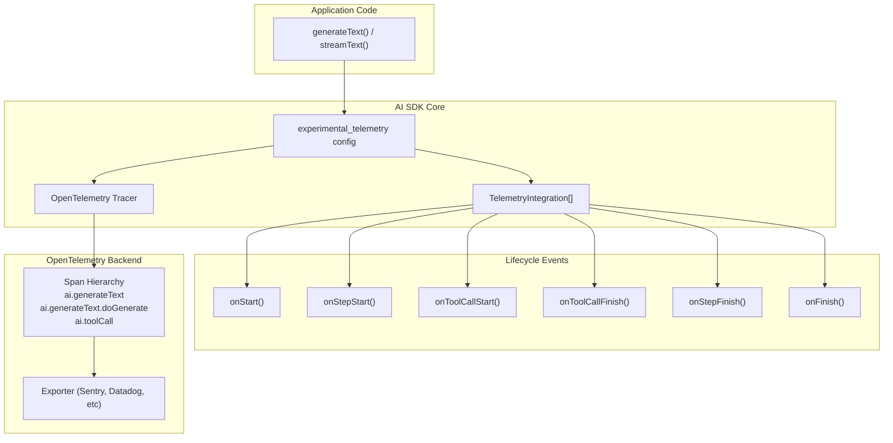
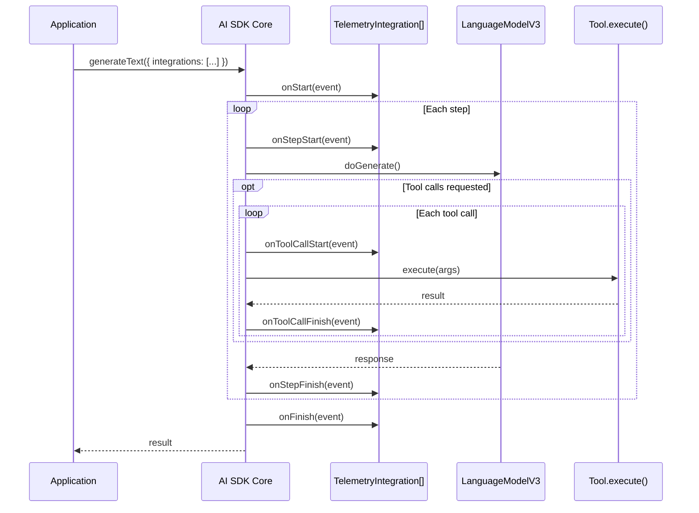
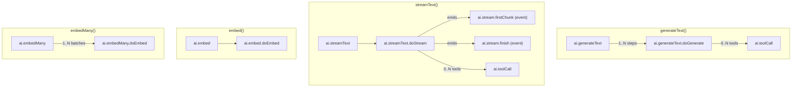

# Observability and Telemetry

<details>
<summary>Relevant source files</summary>

The following files were used as context for generating this wiki page:

- [content/docs/03-ai-sdk-core/60-telemetry.mdx](content/docs/03-ai-sdk-core/60-telemetry.mdx)
- [content/docs/07-reference/05-ai-sdk-errors/ai-no-object-generated-error.mdx](content/docs/07-reference/05-ai-sdk-errors/ai-no-object-generated-error.mdx)
- [packages/ai/CHANGELOG.md](packages/ai/CHANGELOG.md)
- [packages/ai/package.json](packages/ai/package.json)
- [packages/react/CHANGELOG.md](packages/react/CHANGELOG.md)
- [packages/react/package.json](packages/react/package.json)
- [packages/rsc/CHANGELOG.md](packages/rsc/CHANGELOG.md)
- [packages/rsc/package.json](packages/rsc/package.json)
- [packages/rsc/tests/e2e/next-server/CHANGELOG.md](packages/rsc/tests/e2e/next-server/CHANGELOG.md)
- [packages/svelte/CHANGELOG.md](packages/svelte/CHANGELOG.md)
- [packages/svelte/package.json](packages/svelte/package.json)
- [packages/vue/CHANGELOG.md](packages/vue/CHANGELOG.md)
- [packages/vue/package.json](packages/vue/package.json)

</details>


This page documents the observability and telemetry capabilities built into the AI SDK Core (`packages/ai`). The SDK provides two complementary systems:

1. **Telemetry Integrations** — lifecycle hooks for building custom observability, logging, analytics, or monitoring systems
2. **OpenTelemetry Integration** — automatic span instrumentation for distributed tracing

Both systems use the `experimental_telemetry` configuration option on core functions (`generateText`, `streamText`, `embed`, `embedMany`). For middleware that intercepts model calls, see [Middleware System](#2.6). For production observability examples using Sentry or other backends, see [Production Feature Examples](#5.4).

> **Note:** AI SDK Telemetry is experimental and may change in future releases.

---

## Overview

The AI SDK provides two observability mechanisms:

**Telemetry Integrations** implement the `TelemetryIntegration` interface and receive lifecycle events (onStart, onStepStart, onToolCallStart, onToolCallFinish, onStepFinish, onFinish). Multiple integrations can be composed together, and they execute independently of the generation flow. This is the recommended approach for building custom logging, analytics, or DevTools.

**OpenTelemetry Spans** are automatically created when telemetry is enabled. The SDK produces a hierarchical span structure that captures the full lifecycle of a request — from the top-level function call down to individual provider calls and tool executions. This integrates with standard OpenTelemetry exporters and backends.

**Diagram: Telemetry Architecture Overview**



Sources: [content/docs/03-ai-sdk-core/60-telemetry.mdx:1-193](), [packages/ai/CHANGELOG.md:107-128]()

---

## Enabling Telemetry

Telemetry is enabled per function call using the `experimental_telemetry` option. It is available on `generateText`, `streamText`, `embed`, and `embedMany`.

```ts
experimental_telemetry: {
  isEnabled: true,
  recordInputs: true,   // default: true
  recordOutputs: true,  // default: true
  functionId: 'my-awesome-function',
  metadata: {
    key: 'value',
  },
  integrations: [myIntegration()],  // custom integrations
  tracer: tracerProvider.getTracer('ai'), // optional custom Tracer
}
```

| Option | Type | Default | Description |
|---|---|---|---|
| `isEnabled` | `boolean` | `false` | Activates telemetry (integrations and spans) |
| `recordInputs` | `boolean` | `true` | Whether prompt/message inputs are recorded |
| `recordOutputs` | `boolean` | `true` | Whether generated text/embeddings are recorded |
| `functionId` | `string` | — | Identifier for this operation |
| `metadata` | `Record<string, string>` | — | Custom key-value pairs passed to integrations and spans |
| `integrations` | `TelemetryIntegration[]` | — | Custom telemetry integrations (see below) |
| `tracer` | `Tracer` | global OTel tracer | Custom `Tracer` for OpenTelemetry spans |

Sources: [content/docs/03-ai-sdk-core/60-telemetry.mdx:19-74]()

---

## Telemetry Integrations

Telemetry integrations allow you to hook into the generation lifecycle to build custom observability — logging, analytics, DevTools, or any monitoring system. Instead of wiring up individual callbacks on every call, you implement a `TelemetryIntegration` once and pass it via `experimental_telemetry.integrations`.

### Using an Integration

Pass one or more integrations to any `generateText` or `streamText` call:

```ts
import { streamText } from 'ai';
import { devToolsIntegration } from '@ai-sdk/devtools';

const result = streamText({
  model: openai('gpt-4o'),
  prompt: 'Hello!',
  experimental_telemetry: {
    isEnabled: true,
    integrations: [devToolsIntegration()],
  },
});
```

You can combine multiple integrations — they all receive the same lifecycle events:

```ts
experimental_telemetry: {
  isEnabled: true,
  integrations: [devToolsIntegration(), otelIntegration(), customLogger()],
},
```

Errors inside integrations are caught and do not break the generation flow.

Sources: [content/docs/03-ai-sdk-core/60-telemetry.mdx:76-108]()

### Building a Custom Integration

Implement the `TelemetryIntegration` interface from the `ai` package. All methods are optional — implement only the lifecycle events you care about:

```ts
import type { TelemetryIntegration } from 'ai';
import { bindTelemetryIntegration } from 'ai';

class MyIntegration implements TelemetryIntegration {
  async onStart(event) {
    console.log('Generation started:', event.model.modelId);
  }

  async onStepFinish(event) {
    console.log(
      `Step ${event.stepNumber} done:`,
      event.usage.totalTokens,
      'tokens',
    );
  }

  async onToolCallFinish(event) {
    if (event.success) {
      console.log(
        `Tool "${event.toolCall.toolName}" took ${event.durationMs}ms`,
      );
    } else {
      console.error(`Tool "${event.toolCall.toolName}" failed:`, event.error);
    }
  }

  async onFinish(event) {
    console.log('Done. Total tokens:', event.totalUsage.totalTokens);
  }
}

export function myIntegration(): TelemetryIntegration {
  return bindTelemetryIntegration(new MyIntegration());
}
```

Use `bindTelemetryIntegration` for class-based integrations to ensure `this` is correctly bound when methods are extracted and called as callbacks.

Sources: [content/docs/03-ai-sdk-core/60-telemetry.mdx:110-150]()

### Available Lifecycle Methods

The `TelemetryIntegration` interface defines six lifecycle methods. Each receives an event object with metadata about the current operation:

| Method | Signature | Description |
|---|---|---|
| `onStart` | `(event: OnStartEvent) => void \| PromiseLike<void>` | Called when the generation operation begins, before any LLM calls |
| `onStepStart` | `(event: OnStepStartEvent) => void \| PromiseLike<void>` | Called when a step (LLM call) begins, before the provider is called |
| `onToolCallStart` | `(event: OnToolCallStartEvent) => void \| PromiseLike<void>` | Called when a tool's execute function is about to run |
| `onToolCallFinish` | `(event: OnToolCallFinishEvent) => void \| PromiseLike<void>` | Called when a tool's execute function completes or errors |
| `onStepFinish` | `(event: OnStepFinishEvent) => void \| PromiseLike<void>` | Called when a step (LLM call) completes |
| `onFinish` | `(event: OnFinishEvent) => void \| PromiseLike<void>` | Called when the entire generation completes (all steps finished) |

The event types for each method are the same as the corresponding [event callbacks](/docs/ai-sdk-core/event-listeners). See page [2.1](#2.1) for details on event callback properties.

**Diagram: Integration Lifecycle for Multi-Step Generation**



Sources: [content/docs/03-ai-sdk-core/60-telemetry.mdx:152-193](), [packages/ai/CHANGELOG.md:128]()

---

## OpenTelemetry Spans and Traces

When `experimental_telemetry.isEnabled` is true, the AI SDK automatically creates OpenTelemetry spans for each operation. These spans form a hierarchical trace that can be exported to any OpenTelemetry-compatible backend (Sentry, Datadog, Honeycomb, etc.).

For Next.js applications, follow the [Next.js OpenTelemetry guide](https://nextjs.org/docs/app/building-your-application/optimizing/open-telemetry) to set up the base instrumentation before enabling AI SDK telemetry.

---

### Span Hierarchy by Function

The SDK creates different span structures for each core function:

**Diagram: Span hierarchy for generateText, streamText, embed, embedMany**



Sources: [content/docs/03-ai-sdk-core/60-telemetry.mdx:196-273]()

### generateText Spans

`generateText` produces a two-level span hierarchy: one outer span covering the full call (including retries and multi-step loops), and one inner span per provider `doGenerate` call.

| Span Name | Parent | Key Attributes |
|---|---|---|
| `ai.generateText` | — | `ai.prompt`, `ai.response.text`, `ai.response.toolCalls`, `ai.response.finishReason`, `ai.settings.maxOutputTokens` |
| `ai.generateText.doGenerate` | `ai.generateText` | `ai.prompt.messages`, `ai.prompt.tools`, `ai.prompt.toolChoice`, `ai.response.text`, `ai.response.toolCalls`, `ai.response.finishReason` |
| `ai.toolCall` | `ai.generateText.doGenerate` | `ai.toolCall.name`, `ai.toolCall.id`, `ai.toolCall.args`, `ai.toolCall.result` |

Sources: [content/docs/03-ai-sdk-core/60-telemetry.mdx:196-226]()

### streamText Spans

`streamText` adds timing attributes and two events to the inner `doStream` span.

| Span/Event Name | Parent | Key Attributes |
|---|---|---|
| `ai.streamText` | — | Same as `ai.generateText` |
| `ai.streamText.doStream` | `ai.streamText` | Same as `ai.generateText.doGenerate`, plus `ai.response.msToFirstChunk`, `ai.response.msToFinish`, `ai.response.avgCompletionTokensPerSecond` |
| `ai.stream.firstChunk` (event) | `ai.streamText.doStream` | `ai.response.msToFirstChunk` |
| `ai.stream.finish` (event) | `ai.streamText.doStream` | — |
| `ai.toolCall` | `ai.streamText.doStream` | Same as `generateText` |

Sources: [content/docs/03-ai-sdk-core/60-telemetry.mdx:227-262]()

### embed and embedMany Spans

Embedding functions produce a simpler two-level hierarchy. `embedMany` may issue multiple provider calls if the input is batched.

| Span Name | Parent | Key Attributes |
|---|---|---|
| `ai.embed` | — | `ai.value`, `ai.embedding` |
| `ai.embed.doEmbed` | `ai.embed` | `ai.values` (array), `ai.embeddings` (array) |
| `ai.embedMany` | — | `ai.values`, `ai.embeddings` |
| `ai.embedMany.doEmbed` | `ai.embedMany` | `ai.values`, `ai.embeddings` |

Sources: [content/docs/03-ai-sdk-core/60-telemetry.mdx:263-273]()

---

## Span Attribute Reference

### Basic LLM Span Attributes

These attributes are present on all top-level and call-level LLM spans (`ai.generateText`, `ai.generateText.doGenerate`, `ai.streamText`, `ai.streamText.doStream`).

| Attribute | Description |
|---|---|
| `resource.name` | Value of `telemetry.functionId` |
| `ai.model.id` | Model identifier |
| `ai.model.provider` | Provider name |
| `ai.request.headers.*` | HTTP headers passed via the `headers` option |
| `ai.response.providerMetadata` | Provider-specific metadata from the response |
| `ai.settings.maxRetries` | Max retry count |
| `ai.telemetry.functionId` | Value of `telemetry.functionId` |
| `ai.telemetry.metadata.*` | Custom metadata fields |
| `ai.usage.completionTokens` | Completion tokens consumed |
| `ai.usage.promptTokens` | Prompt tokens consumed |

Sources: [content/docs/03-ai-sdk-core/60-telemetry.mdx:212-226]()

---

### Call LLM Span Attributes

These attributes are present on the inner provider-call spans (`ai.generateText.doGenerate`, `ai.streamText.doStream`) in addition to the basic LLM attributes.

| Attribute | Description |
|---|---|
| `ai.response.model` | Actual model used (may differ from requested, e.g. for aliases) |
| `ai.response.id` | Provider-assigned response ID |
| `ai.response.timestamp` | Provider-assigned response timestamp |
| `gen_ai.system` | Provider name (OpenTelemetry GenAI semantic conventions) |
| `gen_ai.request.model` | Requested model name |
| `gen_ai.request.temperature` | Temperature setting |
| `gen_ai.request.max_tokens` | Max tokens setting |
| `gen_ai.request.frequency_penalty` | Frequency penalty |
| `gen_ai.request.presence_penalty` | Presence penalty |
| `gen_ai.request.top_k` | Top-K setting |
| `gen_ai.request.top_p` | Top-P setting |
| `gen_ai.request.stop_sequences` | Stop sequences |
| `gen_ai.response.finish_reasons` | Finish reasons from provider |
| `gen_ai.response.model` | Model used in response |
| `gen_ai.response.id` | Response ID |
| `gen_ai.usage.input_tokens` | Prompt tokens (GenAI convention alias) |
| `gen_ai.usage.output_tokens` | Completion tokens (GenAI convention alias) |

Sources: [content/docs/03-ai-sdk-core/60-telemetry.mdx:227-250]()

---

### Basic Embedding Span Attributes

These attributes are present on all embedding spans (`ai.embed`, `ai.embed.doEmbed`, `ai.embedMany`, `ai.embedMany.doEmbed`).

| Attribute | Description |
|---|---|
| `resource.name` | Value of `telemetry.functionId` |
| `ai.model.id` | Model identifier |
| `ai.model.provider` | Provider name |
| `ai.request.headers.*` | HTTP headers passed via the `headers` option |
| `ai.settings.maxRetries` | Max retry count |
| `ai.telemetry.functionId` | Value of `telemetry.functionId` |
| `ai.telemetry.metadata.*` | Custom metadata fields |
| `ai.usage.tokens` | Tokens consumed |

Sources: [content/docs/03-ai-sdk-core/60-telemetry.mdx:251-262]()

---

### Span Naming Convention

The naming pattern is consistent across all functions:

```
ai.<functionName>              — outer span (full function duration)
ai.<functionName>.doGenerate   — inner span (single provider call, generate)
ai.<functionName>.doStream     — inner span (single provider call, stream)
ai.toolCall                    — child span (individual tool execution)
ai.stream.firstChunk           — event on doStream span
ai.stream.finish               — event on doStream span
```

The `operation.name` attribute on each span is formatted as `<spanName> <functionId>`, where `<functionId>` is the value of `telemetry.functionId` if set.

Sources: [content/docs/03-ai-sdk-core/60-telemetry.mdx:196-273]()

---

## Deprecated Object API Spans

`generateObject` and `streamObject` are deprecated in favor of `generateText`/`streamText` with the `output` option. Their legacy span names are:

| Function | Span names |
|---|---|
| `generateObject` | `ai.generateObject`, `ai.generateObject.doGenerate` |
| `streamObject` | `ai.streamObject`, `ai.streamObject.doStream`, `ai.stream.firstChunk` |

Legacy object spans include the same core metadata as LLM spans, with additional object-specific attributes: `ai.schema.*`, `ai.response.object`, and `ai.settings.output`.

Sources: [content/docs/03-ai-sdk-core/60-telemetry.mdx:154-168]()

---

### Custom Tracer

By default the SDK uses the global `TracerProvider` singleton from `@opentelemetry/api` (version 1.9.0). To use a different provider, pass a `Tracer` instance via `experimental_telemetry.tracer`:

```ts
import { NodeTracerProvider } from '@opentelemetry/sdk-trace-node';

const tracerProvider = new NodeTracerProvider();
experimental_telemetry: {
  isEnabled: true,
  tracer: tracerProvider.getTracer('ai'),
}
```

This is useful in environments where you control the `TracerProvider` lifecycle independently (e.g., Lambda cold starts, test isolation).

Sources: [content/docs/03-ai-sdk-core/60-telemetry.mdx:59-74](), [packages/ai/package.json:66]()

---

## Privacy and Performance Flags

The `recordInputs` and `recordOutputs` flags control whether prompt text and generated content are stored on spans.

| Flag | What it suppresses |
|---|---|
| `recordInputs: false` | `ai.prompt`, `ai.prompt.messages`, `ai.prompt.tools`, `ai.prompt.toolChoice`, `ai.value`, `ai.values` |
| `recordOutputs: false` | `ai.response.text`, `ai.response.toolCalls`, `ai.response.object`, `ai.embedding`, `ai.embeddings`, `ai.toolCall.args`, `ai.toolCall.result` |

Setting these to `false` reduces payload size in trace exports, avoids transmitting sensitive user data, and lowers serialization overhead on high-throughput paths.

Sources: [content/docs/03-ai-sdk-core/60-telemetry.mdx:33-37]()