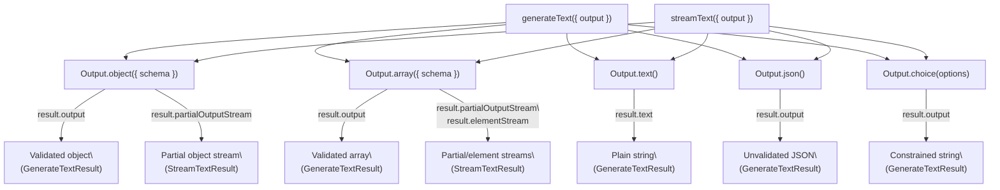
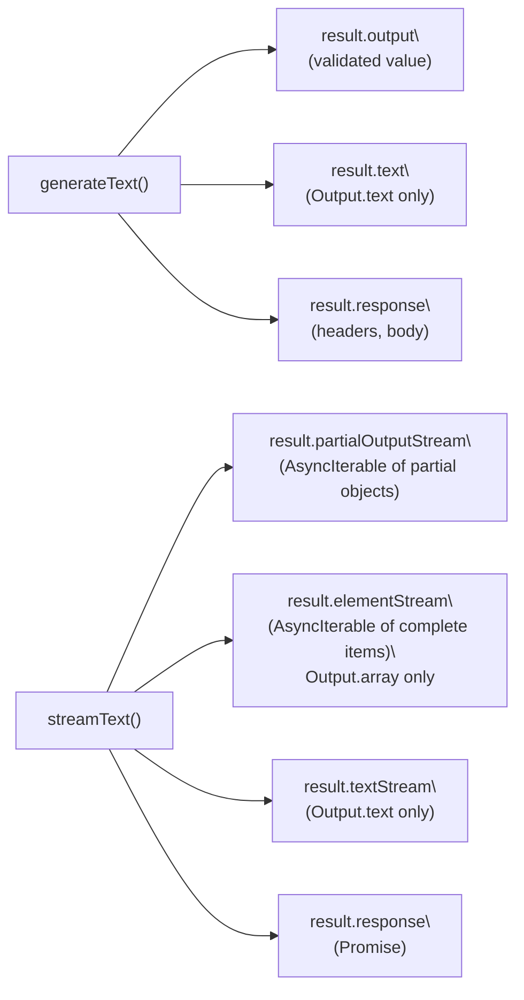
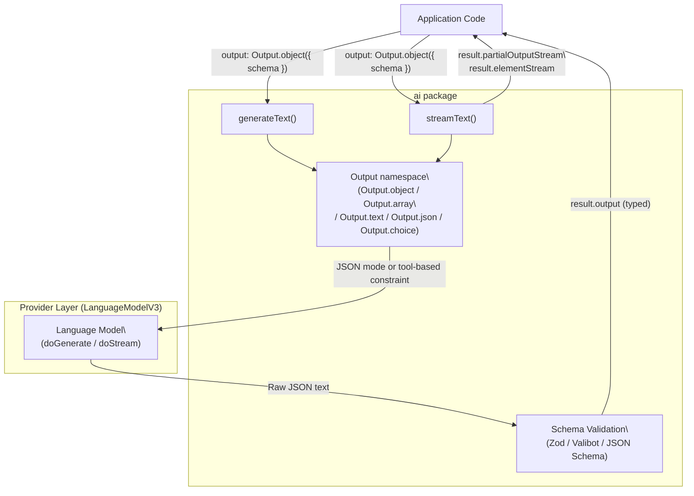

# Structured Output (Output API)

Relevant source files

The following files were used as context for generating this wiki page:

- [content/docs/03-ai-sdk-core/60-telemetry.mdx](content/docs/03-ai-sdk-core/60-telemetry.mdx)
- [content/docs/07-reference/05-ai-sdk-errors/ai-no-object-generated-error.mdx](content/docs/07-reference/05-ai-sdk-errors/ai-no-object-generated-error.mdx)
- [packages/ai/CHANGELOG.md](packages/ai/CHANGELOG.md)
- [packages/ai/package.json](packages/ai/package.json)
- [packages/react/CHANGELOG.md](packages/react/CHANGELOG.md)
- [packages/react/package.json](packages/react/package.json)
- [packages/rsc/CHANGELOG.md](packages/rsc/CHANGELOG.md)
- [packages/rsc/package.json](packages/rsc/package.json)
- [packages/rsc/tests/e2e/next-server/CHANGELOG.md](packages/rsc/tests/e2e/next-server/CHANGELOG.md)
- [packages/svelte/CHANGELOG.md](packages/svelte/CHANGELOG.md)
- [packages/svelte/package.json](packages/svelte/package.json)
- [packages/vue/CHANGELOG.md](packages/vue/CHANGELOG.md)
- [packages/vue/package.json](packages/vue/package.json)

This page documents the Output API — the `Output` namespace and the `output` parameter accepted by `generateText` and `streamText` — which enables schema-validated structured data generation from language models.

`generateObject` and `streamObject` are **deprecated** as of AI SDK 6. The Output API described here is the current replacement. For text generation without structured output, see page [2.1](#2.1). For tool calling (which can be combined with structured output in the same request), see page [2.3](#2.3).

---

## Overview

The Output API is the standard mechanism for requesting structured, typed responses from language models. It is surfaced as the `output` option on `generateText` and `streamText`, populated using factory methods on the `Output` namespace exported from the `ai` package.

The schema for the expected output is provided via Zod, Valibot, or a plain JSON Schema object. The SDK validates the model's response against the schema before returning it to the caller.

**Diagram: Output API — Entry Points and Result Properties**

Sources: [content/docs/03-ai-sdk-core/10-generating-structured-data.mdx:1-110]()

---

## Output Types

The `Output` namespace provides five factory methods. The chosen factory is passed to the `output` parameter of `generateText` or `streamText`.

| Factory                     | Schema Required | Validated | Streaming Support                      | Description                          |
| --------------------------- | --------------- | --------- | -------------------------------------- | ------------------------------------ |
| `Output.object({ schema })` | Yes             | Yes       | `partialOutputStream`                  | Validated structured object          |
| `Output.array({ schema })`  | Yes             | Yes       | `partialOutputStream`, `elementStream` | Validated array of objects           |
| `Output.text()`             | No              | N/A       | text chunks                            | Plain text (default mode)            |
| `Output.json()`             | No              | No        | `partialOutputStream`                  | Parsed JSON, no schema validation    |
| `Output.choice(options)`    | No              | Enum-like | N/A                                    | Constrained string from a fixed list |

Sources: [content/docs/03-ai-sdk-core/10-generating-structured-data.mdx:131-300](), [packages/ai/CHANGELOG.md:540-545](), [packages/ai/CHANGELOG.md:823-826]()

---

## Schema Types

The `schema` property in `Output.object` and `Output.array` accepts three schema formats:

| Format         | Package          | Notes                                         |
| -------------- | ---------------- | --------------------------------------------- |
| Zod schema     | `zod` (peer dep) | Most common; `z.object({...})`                |
| Valibot schema | `valibot`        | Optional alternative                          |
| JSON Schema    | Native JS object | Plain `{ type: "object", properties: {...} }` |

Standard JSON Schema support was added in AI SDK 6 (changelog: `763d04a`).

Sources: [content/docs/03-ai-sdk-core/10-generating-structured-data.mdx:17-18](), [packages/ai/CHANGELOG.md:999-1003]()

---

## `Output.object` — Generating Structured Objects

Pass `Output.object({ schema })` as the `output` option to request a validated structured response.

**With `generateText` (blocking):**

The result's `output` property contains the validated object after the call completes. The result's `response` property provides the raw HTTP response headers and body.

Reference: [content/docs/03-ai-sdk-core/10-generating-structured-data.mdx:27-75]()

**With `streamText` (streaming):**

The result's `partialOutputStream` is an `AsyncIterable` that emits partial objects as the model generates them. Each emitted value is a deeply-partial version of the schema's type, suitable for progressive rendering.

Error handling during streaming is done via the `onError` callback (errors during streaming are not thrown; they are delivered through `onError` to avoid crashing the stream).

Reference: [content/docs/03-ai-sdk-core/10-generating-structured-data.mdx:78-128]()

---

## `Output.array` — Generating Arrays

`Output.array({ schema })` wraps the provided item schema in an array. In addition to `partialOutputStream`, `streamText` exposes `elementStream`, which emits one **complete, validated** array element at a time as each finishes generating.

This is useful when processing results incrementally — for example, rendering list items as they arrive rather than waiting for the full array.

**Changelog:** `b64f256` — added `elementStream` to `streamText` for `Output.array()`.

Sources: [content/docs/03-ai-sdk-core/10-generating-structured-data.mdx:131-180](), [packages/ai/CHANGELOG.md:540-545]()

---

## `Output.text` — Plain Text (Default)

`Output.text()` is the default output mode when no `output` option is provided. It produces a plain string accessible via `result.text`. There is no schema or validation step. This mode is equivalent to omitting the `output` parameter entirely.

**Changelog:** `22ef5c6` — `Output.text()` became the default output mode.

Sources: [packages/ai/CHANGELOG.md:826-827]()

---

## `Output.json` — Unvalidated JSON

`Output.json()` instructs the model to emit JSON and the SDK parses it, but applies **no schema validation**. The parsed value is available as `result.output`. This is appropriate when the exact shape of the JSON is not known in advance or when custom validation is handled separately.

**Changelog:** `e1f6e8e` — added `Output.json()`.

Sources: [packages/ai/CHANGELOG.md:823]()

---

## `Output.choice` — Constrained String

`Output.choice(options: string[])` restricts the model's output to one of the strings in the provided array. This behaves similarly to an enum constraint. The result is a string matching one of the allowed options, available as `result.output`.

**Changelog:** `d7bae86` — added `Output.choice()`.

Sources: [packages/ai/CHANGELOG.md:825]()

---

## Result Properties Reference

**Diagram: Code Symbols — generateText and streamText Output Properties**

Sources: [content/docs/03-ai-sdk-core/10-generating-structured-data.mdx:58-106](), [packages/ai/CHANGELOG.md:819-820]()

| Property                     | Function       | Available When                                                  |
| ---------------------------- | -------------- | --------------------------------------------------------------- |
| `result.output`              | `generateText` | `Output.object`, `Output.array`, `Output.json`, `Output.choice` |
| `result.text`                | `generateText` | `Output.text`                                                   |
| `result.response`            | `generateText` | Always                                                          |
| `result.partialOutputStream` | `streamText`   | `Output.object`, `Output.array`, `Output.json`                  |
| `result.elementStream`       | `streamText`   | `Output.array` only                                             |
| `result.textStream`          | `streamText`   | `Output.text`                                                   |

---

## Schema Metadata

When using `Output.object` or `Output.array`, the schema can be annotated with a `name` and `description`. These are forwarded to the model provider as schema metadata, which can improve model compliance with the schema.

**Changelog:** `db62f7d` — added schema name and description for `generateText` output.

Sources: [packages/ai/CHANGELOG.md:1057]()

---

## Interaction with Tool Calling

Structured output via the `output` parameter can be combined with tool calling in a single `generateText` or `streamText` call. Structured output generation counts as one step in the multi-step execution model. When configuring `stopWhen` for multi-step loops with both tools and structured output, this step count must be accounted for.

See page [2.3](#2.3) for full documentation on tool calling and multi-step agents.

Sources: [content/docs/03-ai-sdk-core/10-generating-structured-data.mdx:52-56]()

---

## Deprecation: `generateObject` and `streamObject`

`generateObject` and `streamObject` are deprecated as of AI SDK 6 (`614599a`). They are superseded by `generateText` + `Output.object()` and `streamText` + `Output.object()` respectively, which provide equivalent functionality while allowing combination with tool calling in the same call.

Sources: [packages/ai/CHANGELOG.md:1223-1224]()

---

## Data Flow Summary

**Diagram: Full Data Flow — Structured Output Pipeline**

Sources: [content/docs/03-ai-sdk-core/10-generating-structured-data.mdx:1-130](), [packages/ai/CHANGELOG.md:770-780]()
