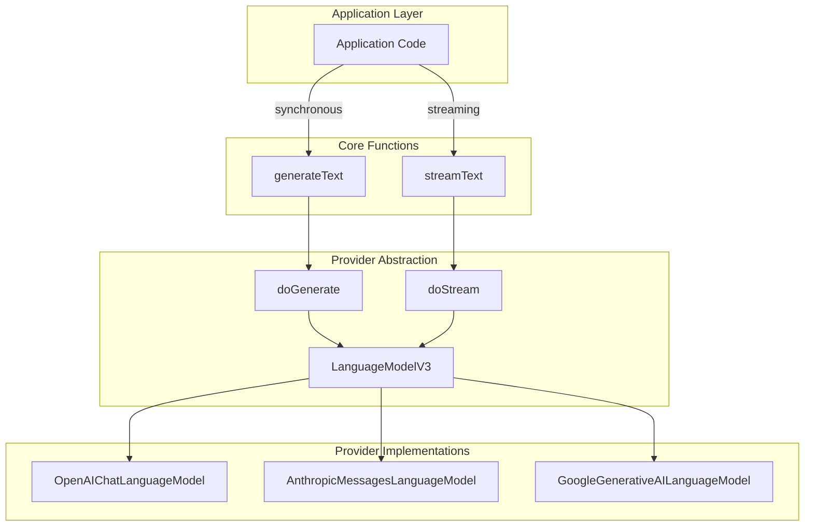
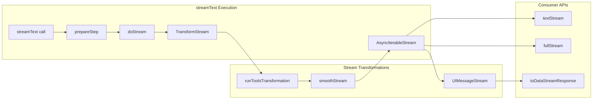
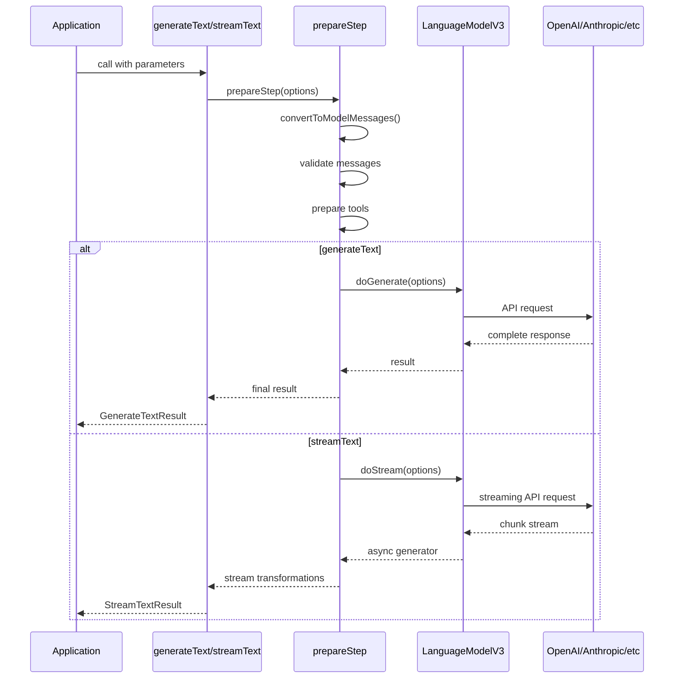
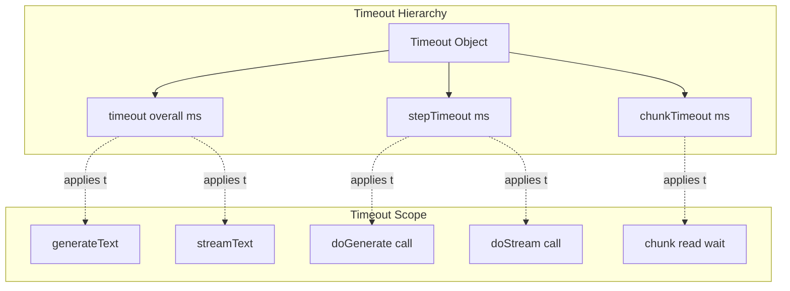

# Text Generation (generateText and streamText)

<details>
<summary>Relevant source files</summary>

The following files were used as context for generating this wiki page:

- [content/docs/03-ai-sdk-core/60-telemetry.mdx](content/docs/03-ai-sdk-core/60-telemetry.mdx)
- [content/docs/07-reference/05-ai-sdk-errors/ai-no-object-generated-error.mdx](content/docs/07-reference/05-ai-sdk-errors/ai-no-object-generated-error.mdx)
- [packages/ai/CHANGELOG.md](packages/ai/CHANGELOG.md)
- [packages/ai/package.json](packages/ai/package.json)
- [packages/react/CHANGELOG.md](packages/react/CHANGELOG.md)
- [packages/react/package.json](packages/react/package.json)
- [packages/rsc/CHANGELOG.md](packages/rsc/CHANGELOG.md)
- [packages/rsc/package.json](packages/rsc/package.json)
- [packages/rsc/tests/e2e/next-server/CHANGELOG.md](packages/rsc/tests/e2e/next-server/CHANGELOG.md)
- [packages/svelte/CHANGELOG.md](packages/svelte/CHANGELOG.md)
- [packages/svelte/package.json](packages/svelte/package.json)
- [packages/vue/CHANGELOG.md](packages/vue/CHANGELOG.md)
- [packages/vue/package.json](packages/vue/package.json)

</details>


This page documents the two core text generation functions in the AI SDK: `generateText` and `streamText`. These functions provide the foundation for all language model interactions in the SDK, handling both synchronous and streaming text generation with unified parameters and provider abstraction.

For information about structured output generation, see [Output API](#2.2). For tool calling and multi-step agents, see [Tool Calling and Multi-Step Agents](#2.3). For observability features, see [Observability and Telemetry](#2.5).

## Function Overview

The AI SDK provides two primary functions for text generation:

- **`generateText`**: Executes a synchronous generation request and returns the complete result after the model finishes processing
- **`streamText`**: Executes a streaming generation request and returns an asynchronous stream of partial results as the model generates text

Both functions share the same parameter interface and use the same underlying `LanguageModelV3` provider specification, differing only in their execution pattern and return types.



**Sources**: [packages/ai/CHANGELOG.md:1-900](), Diagram 2 and 4 from high-level architecture

## Core Parameters

Both `generateText` and `streamText` accept the same core parameter set, defined in their shared call options interface:

| Parameter | Type | Description |
|-----------|------|-------------|
| `model` | `LanguageModelV3` | The language model instance to use for generation |
| `prompt` | `string` or prompt array | The input prompt (simple string or complex message array) |
| `system` | `string` or `SystemModelMessage[]` | System instructions for the model |
| `messages` | `CoreMessage[]` | Message history for conversational contexts |
| `tools` | `Record<string, CoreTool>` | Tool definitions for function calling |
| `maxOutputTokens` | `number` | Maximum number of tokens to generate |
| `temperature` | `number` | Controls randomness in generation (0.0-2.0) |
| `topP` | `number` | Nucleus sampling parameter |
| `topK` | `number` | Top-k sampling parameter |
| `presencePenalty` | `number` | Reduces repetition of content |
| `frequencyPenalty` | `number` | Reduces repetition of token sequences |
| `stopSequences` | `string[]` | Sequences that halt generation |
| `seed` | `number` | Deterministic generation seed |
| `maxSteps` | `number` | Maximum tool execution steps |
| `experimental_telemetry` | `TelemetrySettings` | Telemetry configuration |
| `abortSignal` | `AbortSignal` | Cancellation signal |
| `headers` | `Record<string, string>` | Custom HTTP headers |

**Sources**: [packages/ai/CHANGELOG.md:200-250](), [content/docs/03-ai-sdk-core/60-telemetry.mdx:1-100]()

## Streaming Architecture

The `streamText` function implements a sophisticated streaming architecture using `TransformStream` and `AsyncIterableStream` to provide incremental results.



### AsyncIterableStream

The `AsyncIterableStream` class provides the core streaming primitive. It wraps a `ReadableStream` and provides multiple consumption patterns:

- Direct async iteration: `for await (const chunk of stream)`
- Text stream extraction: `.textStream` property
- Full stream access: `.fullStream` property
- Completion promises: `.text`, `.toolCalls`, `.usage`, `.finishReason`

**Sources**: [packages/ai/CHANGELOG.md:704-710](), [packages/ai/CHANGELOG.md:659-662]()

### Transform Pipeline

The streaming pipeline applies transformations in sequence:

1. **Provider Stream**: Raw chunks from `LanguageModelV3.doStream()`
2. **Tool Transformation**: `runToolsTransformation` executes tool calls and injects results
3. **Smooth Streaming**: Optional `smoothStream` for word-by-word delivery
4. **UI Message Stream**: `processUIMessageStream` converts to client-consumable format

**Sources**: [packages/ai/CHANGELOG.md:799-800](), [packages/ai/CHANGELOG.md:717-719]()

## Provider Lifecycle

Both functions delegate to the `LanguageModelV3` interface methods, which implement the provider-agnostic generation contract.



### doGenerate Lifecycle

The `doGenerate` method executes a complete generation request:

1. Receives prepared model messages and settings
2. Makes synchronous API call to provider
3. Returns complete response with text, tool calls, and metadata
4. Includes usage information and finish reason

### doStream Lifecycle

The `doStream` method executes a streaming generation request:

1. Receives prepared model messages and settings
2. Initiates streaming API connection to provider
3. Returns async generator yielding partial chunks
4. Each chunk contains delta text, tool call deltas, and metadata
5. Final chunk includes complete usage and finish reason

**Sources**: [packages/ai/CHANGELOG.md:195-230](), Diagram 4 from high-level architecture

## Timeout Configuration

The SDK provides granular timeout control at multiple levels to handle slow or stalled generations.



### Timeout Types

| Timeout | Scope | Throws When |
|---------|-------|-------------|
| `timeout` (overall) | Entire generation | Total time exceeds limit |
| `stepTimeout` | Per LLM call step | Single step exceeds limit |
| `chunkTimeout` | Per stream chunk | Time between chunks exceeds limit |

### Configuration

Timeouts are configured via the `timeout` parameter object:

```typescript
// Example timeout configuration structure
{
  timeout: {
    total: 60000,      // 60 seconds for entire operation
    step: 30000,       // 30 seconds per model call
    chunk: 5000        // 5 seconds between stream chunks
  }
}
```

### Legacy Format

The SDK also accepts a direct millisecond number for backward compatibility, which sets the overall timeout:

```typescript
{ timeout: 30000 }  // equivalent to { timeout: { total: 30000 } }
```

**Sources**: [packages/ai/CHANGELOG.md:729-731](), [packages/ai/CHANGELOG.md:765-766](), [packages/ai/CHANGELOG.md:775-776](), [packages/ai/CHANGELOG.md:781-782](), [packages/ai/CHANGELOG.md:793-794]()

## Return Types and Results

### GenerateTextResult

The `generateText` function returns a `GenerateTextResult` object containing:

| Property | Type | Description |
|----------|------|-------------|
| `text` | `string` | Complete generated text |
| `toolCalls` | `ToolCall[]` | Tool calls made during generation |
| `toolResults` | `ToolResult[]` | Results from executed tools |
| `finishReason` | `FinishReason` | Reason generation stopped |
| `usage` | `TokenUsage` | Token counts (prompt, completion, total) |
| `rawResponse` | `RawResponse` | Provider-specific response metadata |
| `response` | `ResponseMetadata` | Response ID, timestamp, model ID |
| `warnings` | `Warning[]` | Model capability warnings |
| `experimental_providerMetadata` | `ProviderMetadata` | Provider-specific metadata |

### StreamTextResult

The `streamText` function returns a `StreamTextResult` object containing:

| Property | Type | Description |
|----------|------|-------------|
| `textStream` | `AsyncIterableStream<string>` | Stream of text deltas |
| `fullStream` | `AsyncIterableStream<TextStreamPart>` | Stream of all chunk types |
| `text` | `Promise<string>` | Promise resolving to complete text |
| `toolCalls` | `Promise<ToolCall[]>` | Promise resolving to all tool calls |
| `toolResults` | `Promise<ToolResult[]>` | Promise resolving to all tool results |
| `usage` | `Promise<TokenUsage>` | Promise resolving to token usage |
| `finishReason` | `Promise<FinishReason>` | Promise resolving to finish reason |
| `response` | `ResponseMetadata` | Response metadata (available immediately) |
| `warnings` | `Warning[]` | Model capability warnings |
| `toDataStreamResponse()` | `Function` | Converts to HTTP streaming response |
| `pipeDataStreamToResponse()` | `Function` | Pipes stream to HTTP response |

### Stream Chunk Types

The `fullStream` emits typed chunks:

- `text-delta`: Incremental text content
- `tool-call`: Complete tool call definition
- `tool-call-delta`: Incremental tool call construction
- `tool-result`: Tool execution result
- `finish`: Final chunk with finish reason and usage
- `error`: Error that occurred during generation
- `reasoning-delta`: Reasoning/thinking content (for supported models)

**Sources**: [packages/ai/CHANGELOG.md:787-788](), [packages/ai/CHANGELOG.md:723-725](), [packages/ai/CHANGELOG.md:1-50]()

## Error Handling

Both functions throw specific error types for different failure modes:

| Error Class | Thrown When |
|-------------|-------------|
| `AI_APICallError` | Provider API returns error response |
| `AI_InvalidPromptError` | Prompt format is invalid |
| `AI_InvalidModelResponseError` | Model response cannot be parsed |
| `AI_NoObjectGeneratedError` | Object generation fails with structured output |
| `AI_LoadSettingError` | Settings loading fails |
| `AI_TimeoutError` | Any timeout is exceeded |

The `AI_TimeoutError` includes a `cause` property indicating which timeout was exceeded (overall, step, or chunk).

**Sources**: [packages/ai/CHANGELOG.md:775-776](), [content/docs/07-reference/05-ai-sdk-errors/ai-no-object-generated-error.mdx:1-44]()

## Integration Points

### Tool Execution

When tools are provided, both functions automatically handle tool call execution via `runToolsTransformation`. For streaming, tool execution happens asynchronously while text continues to stream. For details on tool execution lifecycle, approval mechanisms, and multi-step agents, see [Tool Calling and Multi-Step Agents](#2.3).

### Structured Output

Both functions support structured output generation through the `output` parameter accepting `Output.object()`, `Output.array()`, `Output.choice()`, or `Output.text()`. See [Structured Output (Output API)](#2.2) for complete documentation.

### Message Processing

Both functions use `convertToModelMessages()` to transform UI messages into the provider-specific format. Message validation and content filtering occurs during this conversion. See [Message Processing and Content Types](#2.4) for details.

### Telemetry

Both functions support OpenTelemetry tracing through `experimental_telemetry` configuration. Spans are recorded for the overall operation (`ai.generateText` or `ai.streamText`) and individual provider calls (`ai.generateText.doGenerate` or `ai.streamText.doStream`). See [Observability and Telemetry](#2.5) for complete tracing documentation.

**Sources**: [packages/ai/CHANGELOG.md:822-824](), [content/docs/03-ai-sdk-core/60-telemetry.mdx:195-250]()

## Middleware Support

Both functions support language model middleware through `wrapLanguageModel()`, enabling custom transformations and extensions. Middleware can modify prompts, inject tool examples, add logging, or implement custom caching. See [Middleware System](#2.6) for details.

**Sources**: [packages/ai/CHANGELOG.md:718-720]()