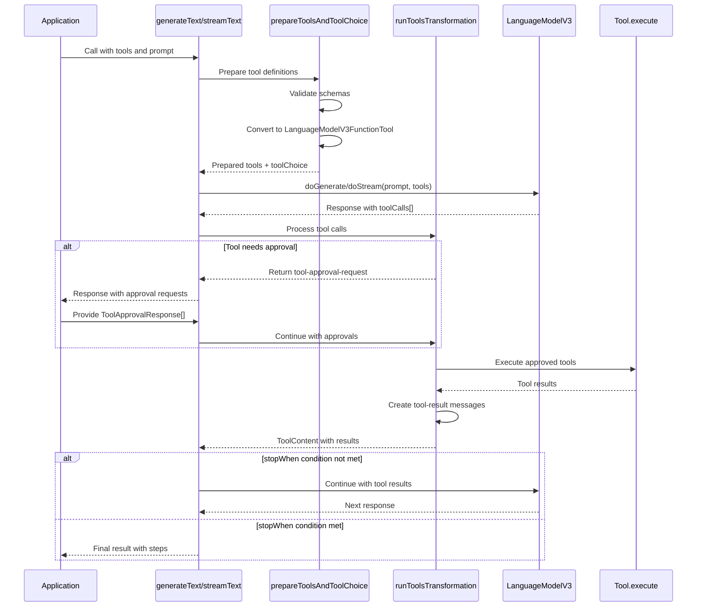
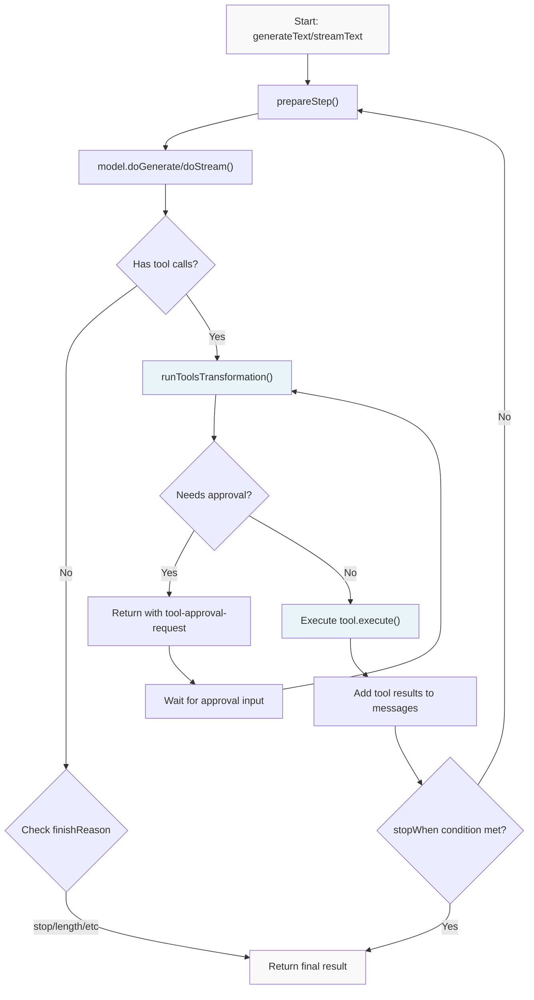
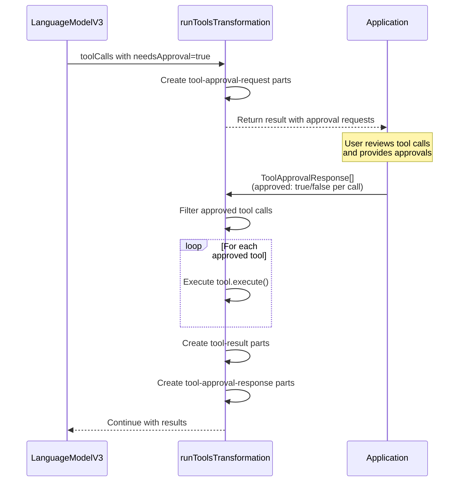
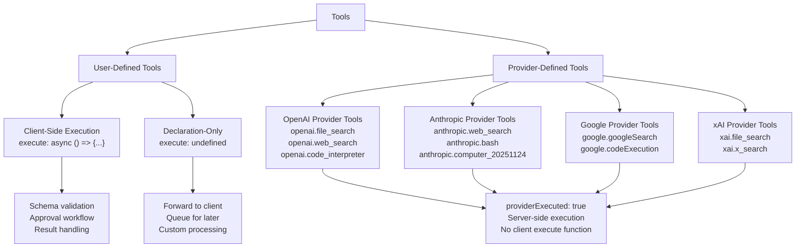
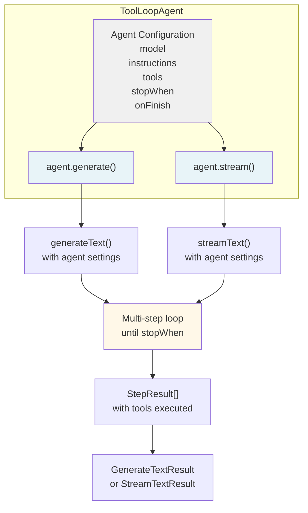

# Tool Calling and Multi-Step Agents

<details>
<summary>Relevant source files</summary>

The following files were used as context for generating this wiki page:

- [.changeset/calm-squids-sparkle.md](.changeset/calm-squids-sparkle.md)
- [.changeset/serious-houses-argue.md](.changeset/serious-houses-argue.md)
- [content/docs/03-ai-sdk-core/05-generating-text.mdx](content/docs/03-ai-sdk-core/05-generating-text.mdx)
- [content/docs/03-ai-sdk-core/15-tools-and-tool-calling.mdx](content/docs/03-ai-sdk-core/15-tools-and-tool-calling.mdx)
- [content/docs/03-ai-sdk-core/60-telemetry.mdx](content/docs/03-ai-sdk-core/60-telemetry.mdx)
- [content/docs/07-reference/01-ai-sdk-core/01-generate-text.mdx](content/docs/07-reference/01-ai-sdk-core/01-generate-text.mdx)
- [content/docs/07-reference/01-ai-sdk-core/02-stream-text.mdx](content/docs/07-reference/01-ai-sdk-core/02-stream-text.mdx)
- [content/docs/07-reference/05-ai-sdk-errors/ai-no-object-generated-error.mdx](content/docs/07-reference/05-ai-sdk-errors/ai-no-object-generated-error.mdx)
- [packages/ai/src/generate-text/__snapshots__/generate-text.test.ts.snap](packages/ai/src/generate-text/__snapshots__/generate-text.test.ts.snap)
- [packages/ai/src/generate-text/__snapshots__/stream-text.test.ts.snap](packages/ai/src/generate-text/__snapshots__/stream-text.test.ts.snap)
- [packages/ai/src/generate-text/content-part.ts](packages/ai/src/generate-text/content-part.ts)
- [packages/ai/src/generate-text/execute-tool-call.test.ts](packages/ai/src/generate-text/execute-tool-call.test.ts)
- [packages/ai/src/generate-text/execute-tool-call.ts](packages/ai/src/generate-text/execute-tool-call.ts)
- [packages/ai/src/generate-text/generate-text-result.ts](packages/ai/src/generate-text/generate-text-result.ts)
- [packages/ai/src/generate-text/generate-text.test.ts](packages/ai/src/generate-text/generate-text.test.ts)
- [packages/ai/src/generate-text/generate-text.ts](packages/ai/src/generate-text/generate-text.ts)
- [packages/ai/src/generate-text/index.ts](packages/ai/src/generate-text/index.ts)
- [packages/ai/src/generate-text/run-tools-transformation.test.ts](packages/ai/src/generate-text/run-tools-transformation.test.ts)
- [packages/ai/src/generate-text/run-tools-transformation.ts](packages/ai/src/generate-text/run-tools-transformation.ts)
- [packages/ai/src/generate-text/stream-text-result.ts](packages/ai/src/generate-text/stream-text-result.ts)
- [packages/ai/src/generate-text/stream-text.test.ts](packages/ai/src/generate-text/stream-text.test.ts)
- [packages/ai/src/generate-text/stream-text.ts](packages/ai/src/generate-text/stream-text.ts)
- [packages/ai/src/telemetry/get-global-telemetry-integration.test.ts](packages/ai/src/telemetry/get-global-telemetry-integration.test.ts)
- [packages/ai/src/telemetry/get-global-telemetry-integration.ts](packages/ai/src/telemetry/get-global-telemetry-integration.ts)
- [packages/ai/src/telemetry/telemetry-integration.ts](packages/ai/src/telemetry/telemetry-integration.ts)
- [packages/ai/src/ui-message-stream/ui-message-chunks.ts](packages/ai/src/ui-message-stream/ui-message-chunks.ts)
- [packages/ai/src/ui/convert-to-model-messages.test.ts](packages/ai/src/ui/convert-to-model-messages.test.ts)
- [packages/ai/src/ui/convert-to-model-messages.ts](packages/ai/src/ui/convert-to-model-messages.ts)
- [packages/ai/src/ui/process-ui-message-stream.test.ts](packages/ai/src/ui/process-ui-message-stream.test.ts)
- [packages/ai/src/ui/process-ui-message-stream.ts](packages/ai/src/ui/process-ui-message-stream.ts)
- [packages/ai/src/ui/ui-messages.ts](packages/ai/src/ui/ui-messages.ts)
- [packages/ai/src/ui/validate-ui-messages.test.ts](packages/ai/src/ui/validate-ui-messages.test.ts)
- [packages/ai/src/ui/validate-ui-messages.ts](packages/ai/src/ui/validate-ui-messages.ts)
- [packages/ai/src/util/notify.ts](packages/ai/src/util/notify.ts)

</details>


This document covers the tool calling system in the AI SDK Core package, including tool definition, execution workflows, multi-step reasoning loops, and the ToolLoopAgent abstraction for building agentic applications. For information about basic text generation without tools, see [Text Generation (generateText and streamText)](#2.1). For structured output generation, see [Structured Output (Output API)](#2.2).

## Purpose and Scope

The AI SDK provides a comprehensive tool calling system that enables language models to execute functions and perform multi-step reasoning. This system allows models to:

- Call functions with validated inputs to retrieve information or perform actions
- Execute multiple reasoning steps iteratively until a goal is achieved
- Request approval before executing sensitive operations
- Use provider-defined server-side tools or user-defined client-side tools
- Build autonomous agents that combine reasoning with action

The tool system is implemented across `generateText` and `streamText` functions in [packages/ai/src/generate-text/](), with the core tool execution logic in [packages/ai/src/generate-text/run-tools-transformation.ts]().

---

## Tool Definition Structure

### Basic Tool Interface

Tools are defined using the `tool()` helper function from `@ai-sdk/provider-utils`. Each tool consists of:

```
tool({
  description: string,
  inputSchema: ZodSchema | JSONSchema,
  execute?: async (inputs) => result,
  needsApproval?: boolean | (args) => boolean,
  strict?: boolean,
  inputExamples?: Array<{ input: object }>
})
```

**Core Components:**
- **`description`**: Optional text that helps the model decide when to use the tool
- **`inputSchema`**: Zod schema or JSON schema defining valid inputs
- **`execute`**: Optional async function that processes tool calls
- **`needsApproval`**: Controls whether execution requires explicit approval
- **`strict`**: Enables strict schema validation (provider-dependent)
- **`inputExamples`**: Example inputs to guide the model

### Tool Schema Validation

The SDK validates tool inputs against the provided schema before execution. Supported schema libraries include:

| Library | Support Level |
|---------|--------------|
| Zod | Full support, type inference |
| Valibot | Full support via adapters |
| Effect Schema | Full support via adapters |
| ArkType | Full support via adapters |
| JSON Schema | Direct support |

Schema validation occurs in [packages/ai/src/prompt/prepare-tools-and-tool-choice.ts:187-267]() using the `prepareTool` function, which converts various schema formats into a unified `JSONSchema7` representation.

### Tool Execution Function

The `execute` function receives validated inputs and returns a result. The result type is inferred from the function signature:

```typescript
execute: async ({ location }: { location: string }) => {
  // Type-safe execution
  return { temperature: 72, conditions: 'sunny' };
}
```

If `execute` is omitted, the tool becomes a "declaration-only" tool useful for:
- Forwarding tool calls to clients (in UI frameworks)
- Queueing tool calls for later execution
- Provider-executed tools (see Provider-Defined Tools section)

Sources: [content/docs/03-ai-sdk-core/15-tools-and-tool-calling.mdx:8-49](), [packages/ai/src/generate-text/stream-text.test.ts:1-55]()

---

## Tool Execution Workflow

### Overview Diagram



### Preparation Phase

When `generateText` or `streamText` receives tools, the preparation phase:

1. **Validates tool definitions** - Ensures each tool has a valid name and schema
2. **Converts schemas** - Transforms Zod/other schemas to JSON Schema format
3. **Extracts tool choice** - Determines which tools the model can use
4. **Creates LanguageModelV3FunctionTool** - Converts to provider format

This occurs in [packages/ai/src/prompt/prepare-tools-and-tool-choice.ts:24-103]() via `prepareToolsAndToolChoice()`.

### Execution Phase

Tool execution is handled by [packages/ai/src/generate-text/run-tools-transformation.ts:30-380](). The workflow:

1. **Receive tool calls** from model response
2. **Validate inputs** against schemas
3. **Check approval requirements** - If `needsApproval` is set, pause execution
4. **Execute approved tools** - Call `execute()` functions in parallel
5. **Collect results** - Gather outputs and errors
6. **Format as messages** - Create `ToolModelMessage` with results

### Result Handling

Tool results are formatted into `ToolContent` objects containing:

```typescript
{
  toolCallId: string,
  toolName: string,
  args: Record<string, unknown>,
  result: unknown,
  providerMetadata?: ProviderMetadata
}
```

These are appended to the conversation history as `ToolModelMessage` entries, allowing the model to observe tool outputs in subsequent steps.

Sources: [packages/ai/src/generate-text/run-tools-transformation.ts:30-380](), [packages/ai/src/generate-text/stream-text.ts:1-1600]()

---

## Multi-Step Execution with stopWhen

### Multi-Step Loop Diagram



### Stop Conditions

The `stopWhen` parameter controls when multi-step execution terminates. Built-in conditions:

| Condition | Description | Implementation |
|-----------|-------------|----------------|
| `stepCountIs(n)` | Stop after exactly n steps | [packages/ai/src/generate-text/stop-condition.ts:8-14]() |
| `finishReasonIsIn([...])` | Stop on specific finish reasons | [packages/ai/src/generate-text/stop-condition.ts:16-28]() |
| `finishReasonIs(reason)` | Stop on specific finish reason | [packages/ai/src/generate-text/stop-condition.ts:30-38]() |

Custom conditions can be created by implementing:

```typescript
type StopCondition<CONTEXT> = (params: {
  step: StepResult<CONTEXT>;
  stepIndex: number;
}) => boolean;
```

### Step Management

Each execution step is tracked as a `StepResult` containing:

- `content`: Generated content parts (text, tool calls, reasoning)
- `text`: Concatenated text output
- `reasoning`: Reasoning/thinking content
- `toolCalls`: Array of tool invocations
- `toolResults`: Array of tool execution results
- `usage`: Token usage for this step
- `finishReason`: Why the step ended
- `experimental_context`: Custom context object

Steps are accumulated in [packages/ai/src/generate-text/stream-text.ts:500-600]() and accessible via `result.steps`.

### Usage Aggregation

Token usage is aggregated across all steps using `addLanguageModelUsage()` from [packages/ai/src/types/usage.ts:46-94](). This combines:

- Input tokens (including cache hits/writes)
- Output tokens (text and reasoning)
- Per-step breakdowns

The final aggregated usage appears in `result.usage`.

Sources: [packages/ai/src/generate-text/stop-condition.ts:1-38](), [packages/ai/src/generate-text/stream-text.ts:1-1600](), [content/docs/03-ai-sdk-core/15-tools-and-tool-calling.mdx:143-242]()

---

## Tool Approval Mechanism

### Approval Workflow Diagram



### Approval Configuration

Tools can require approval in two ways:

**Static approval:**
```typescript
needsApproval: true
```

**Dynamic approval:**
```typescript
needsApproval: (args) => {
  return args.amount > 1000; // Approve large transactions
}
```

The approval function is called in [packages/ai/src/generate-text/run-tools-transformation.ts:180-195]() to determine if a specific tool call needs approval.

### Approval Request Format

When approval is needed, the SDK returns `tool-approval-request` content parts:

```typescript
{
  type: 'tool-approval-request',
  toolCallId: string,
  toolName: string,
  args: Record<string, unknown>
}
```

These appear in:
- `result.content` for `generateText`
- Stream chunks for `streamText`
- UI message streams via `toUIMessageStream()`

### Approval Response Handling

Applications provide approvals via `ToolApprovalResponse[]`:

```typescript
{
  toolCallId: string,
  approved: boolean
}
```

The SDK processes approvals in [packages/ai/src/generate-text/run-tools-transformation.ts:140-270]():

1. Maps approval responses to tool call IDs
2. Filters approved vs. rejected tool calls
3. Executes only approved tools
4. Creates `tool-approval-response` parts for model context

If a required tool call lacks an approval response, `ToolCallNotFoundForApprovalError` is thrown [packages/ai/src/error/tool-call-not-found-for-approval-error.ts:1-20]().

Sources: [content/docs/03-ai-sdk-core/15-tools-and-tool-calling.mdx:108-242](), [packages/ai/src/generate-text/run-tools-transformation.ts:1-400]()

---

## Provider-Defined vs User-Defined Tools

### Tool Type Hierarchy



### Provider-Defined Tools

Provider-defined tools are executed by the AI provider's infrastructure rather than in your application code. They are identified by:

- **Prefixed tool names**: `openai.file_search`, `anthropic.bash`, `google.googleSearch`, `xai.x_search`
- **`providerExecuted: true` flag**: Indicates server-side execution
- **No `execute` function**: The SDK doesn't run client-side code

Implementation in [packages/ai/src/prompt/prepare-tools-and-tool-choice.ts:187-267]() converts provider tools to `LanguageModelV3ProviderTool`:

```typescript
{
  type: 'provider-defined',
  id: string, // e.g., 'openai.file_search'
  name?: string, // Custom display name
  args?: Record<string, unknown> // Provider-specific configuration
}
```

### Provider-Specific Tools

Each provider offers unique tools:

| Provider | Tool Examples | Use Cases |
|----------|--------------|-----------|
| OpenAI | `file_search`, `web_search`, `code_interpreter`, `mcp` | Document retrieval, web browsing, code execution |
| Anthropic | `web_search`, `bash`, `computer_20251124`, `textEditor` | Web access, shell commands, UI automation |
| Google | `googleSearch`, `codeExecution`, `vertexRagStore` | Search, code execution, RAG |
| xAI | `file_search`, `x_search`, `web_search` | File search, Twitter/X search |

Provider tools are documented in their respective provider packages (e.g., `@ai-sdk/openai`, `@ai-sdk/anthropic`).

### User-Defined Tools

User-defined tools are executed in your application code. They can:

- **Execute locally**: Define `execute` to run code in the same process
- **Require approval**: Set `needsApproval` for sensitive operations
- **Forward to clients**: Omit `execute` to handle tool calls in UI layer

Execution occurs in [packages/ai/src/generate-text/run-tools-transformation.ts:200-250]() via the tool's `execute` function.

### Deferred Tool Results

Provider-executed tools use "deferred" results - the SDK receives tool results from the provider after the provider executes them. This is indicated by:

- `providerExecuted: true` in tool call metadata
- Results appearing in subsequent model responses
- No client-side execution

The SDK skips validation for deferred results in [packages/ai/src/generate-text/run-tools-transformation.ts:140-160]().

Sources: [content/docs/03-ai-sdk-core/15-tools-and-tool-calling.mdx:244-356](), [packages/ai/src/prompt/prepare-tools-and-tool-choice.ts:1-270]()

---

## Dynamic Tools

### Overview

Dynamic tools are created at runtime using `dynamicTool()` from `@ai-sdk/provider-utils`. Unlike static tools defined upfront, dynamic tools:

- Generate schemas based on runtime conditions
- Adapt execution logic per invocation
- Support provider-defined tool creation

### Dynamic Tool Definition

```typescript
import { dynamicTool } from 'ai';

const dynamicWeatherTool = dynamicTool({
  description: 'Get weather for locations',
  execute: async ({ location }) => {
    // Execution logic
  },
  experimental_toToolCall: (options) => {
    // Called when tool is invoked
    return {
      toolCallId: options.toolCallId,
      toolName: options.toolName,
      args: options.args,
      providerExecuted: false,
    };
  },
  toModelOutput: async ({ toolCallId, args, result }) => {
    // Format result for model consumption
    return { content: [{ type: 'text', text: JSON.stringify(result) }] };
  },
})
```

### Use Cases

Dynamic tools are useful for:

1. **Context-dependent schemas**: Generate different schemas based on application state
2. **Provider tool wrapping**: Create abstractions over provider-defined tools
3. **Runtime tool registration**: Add tools based on user permissions or features
4. **Custom result formatting**: Transform tool outputs via `toModelOutput`

The `experimental_toToolCall` method is called in [packages/ai/src/generate-text/run-tools-transformation.ts:95-120]() when the model invokes the tool.

Sources: [packages/ai/src/generate-text/stream-text.test.ts:2000-2100](), [packages/ai/src/generate-text/generate-text.test.ts:1500-1600]()

---

## ToolLoopAgent

### Agent Architecture



### Agent Creation

The `ToolLoopAgent` provides a higher-level abstraction over `generateText`/`streamText` for multi-step agentic workflows. Defined in [packages/ai/src/agent/tool-loop-agent.ts:1-200]():

```typescript
const agent = new ToolLoopAgent({
  model,
  instructions: 'You are a helpful assistant',
  tools: { /* tool definitions */ },
  stopWhen: stepCountIs(10),
  onFinish: async ({ steps, usage }) => {
    // Called when agent completes
  },
})
```

### Agent Methods

**`agent.generate(options)`**

Synchronous generation with tool execution. Returns `GenerateTextResult` with:
- All steps executed
- Aggregated usage
- Final text/content

**`agent.stream(options)`**

Streaming generation with tool execution. Returns `StreamTextResult` with:
- Real-time text/tool call streaming
- Step-by-step updates
- Async iterators for consumption

Both methods accept:
- `prompt`: User input
- `messages`: Conversation history
- `context`: Custom context object
- `abortSignal`: Cancellation signal

### Agent Configuration

Agents support:

- **Static tools**: Defined at agent creation
- **Dynamic tools**: Provided per-call in options
- **Default stopWhen**: Defaults to `stepCountIs(20)` if not specified
- **Context passing**: `experimental_context` flows through all steps

### Callbacks

**`onStepFinish`**: Called after each step completes
**`onFinish`**: Called when agent terminates

Both receive:
- `steps`: All execution steps
- `usage`: Aggregated token usage
- `experimental_context`: Custom context

Implemented in [packages/ai/src/agent/tool-loop-agent.ts:80-150]().

Sources: [packages/ai/src/agent/tool-loop-agent.ts:1-200](), [packages/ai/src/agent/create-agent-ui-stream-response.test.ts:1-300]()

---

## Error Handling

### Tool Execution Errors

Tool execution errors are captured and handled in [packages/ai/src/generate-text/run-tools-transformation.ts:200-270]():

1. **Caught during execution**: Errors from `tool.execute()` are caught
2. **Formatted as results**: Errors become `{ error: string }` in tool results
3. **Included in messages**: Error results are sent to model as context
4. **Model observes failures**: Allows model to retry or adjust strategy

### Common Error Types

| Error Type | Cause | Location |
|------------|-------|----------|
| `NoOutputGeneratedError` | Model produced no content | [packages/ai/src/error/no-output-generated-error.ts]() |
| `ToolCallNotFoundForApprovalError` | Missing approval for tool call | [packages/ai/src/error/tool-call-not-found-for-approval-error.ts]() |
| `UnsupportedFunctionalityError` | Provider doesn't support feature | `@ai-sdk/provider` |
| `TypeValidationError` | Tool input schema validation failed | `@ai-sdk/provider-utils` |

### Error Propagation

Errors are propagated through:

1. **Result objects**: `result.error` contains error information
2. **Stream errors**: Errors emitted as stream events
3. **Callbacks**: `onError` handlers receive errors
4. **Telemetry**: Errors recorded in OpenTelemetry spans

Streaming errors are handled in [packages/ai/src/generate-text/stream-text.ts:1200-1300]().

Sources: [packages/ai/src/generate-text/run-tools-transformation.ts:1-400](), [packages/ai/src/error/]()

---

## Integration with UI Frameworks

### Tool Execution in UI

UI frameworks (`@ai-sdk/react`, `@ai-sdk/vue`, `@ai-sdk/svelte`) handle tools by:

1. **Receiving tool calls**: Stream chunks contain `tool-call-start`, `tool-call-delta`
2. **Rendering tool UI**: Display loading states for tool execution
3. **Showing results**: Render tool outputs in chat interface
4. **Approval UI**: Present approval requests to users

Implementation in [packages/react/src/use-chat.ts]() and related UI packages.

### Tool Call Streaming

Tool calls stream as:

```typescript
{ type: 'tool-call-start', toolCallId, toolName }
{ type: 'tool-call-delta', toolCallId, argsTextDelta }
{ type: 'tool-call', toolCallId, toolName, args }
{ type: 'tool-result', toolCallId, result }
```

These are processed by `parseJsonEventStream()` in [packages/ai/src/util/parse-json-event-stream.ts]().

### Automatic vs Manual Execution

UI frameworks support two modes:

**Automatic**: Tools with `execute` run automatically on the server
**Manual**: Tools without `execute` are forwarded to client for handling

This is controlled by the presence of the `execute` function in the tool definition.

Sources: [packages/react/src/use-chat.ts](), [content/docs/03-ai-sdk-core/15-tools-and-tool-calling.mdx:360-450]()