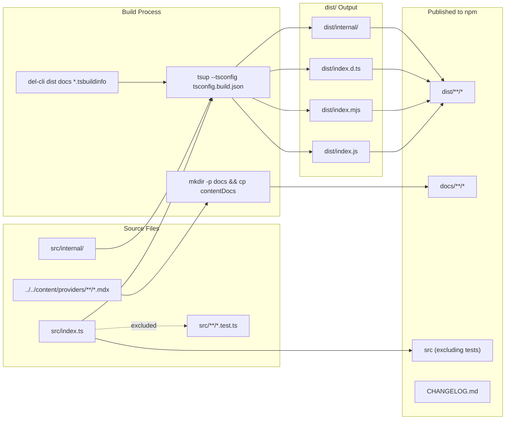

# Build, Test, and Quality Infrastructure

<details>
<summary>Relevant source files</summary>

The following files were used as context for generating this wiki page:

- [packages/azure/CHANGELOG.md](packages/azure/CHANGELOG.md)
- [packages/azure/package.json](packages/azure/package.json)
- [packages/mistral/CHANGELOG.md](packages/mistral/CHANGELOG.md)
- [packages/mistral/package.json](packages/mistral/package.json)
- [packages/openai/CHANGELOG.md](packages/openai/CHANGELOG.md)
- [packages/openai/package.json](packages/openai/package.json)
- [packages/provider-utils/CHANGELOG.md](packages/provider-utils/CHANGELOG.md)
- [packages/provider-utils/package.json](packages/provider-utils/package.json)
- [tools/tsconfig/base.json](tools/tsconfig/base.json)

</details>

This page covers the tooling and automated checks used to build, test, lint, and validate every package in the `vercel/ai` monorepo. It focuses on the configuration of individual package build pipelines, the test runner setup, linting and formatting rules, CI job definitions, and auxiliary quality gates such as bundle size checks and `publint`.

For information about how packages are laid out and named, see page [6.1](#6.1). For the changeset-based release workflow that this infrastructure feeds into, see page [6.3](#6.3).

---

## Monorepo Build Orchestration

[Turbo](https://turbo.build/) (version `2.4.4`, declared in [package.json:52]()) is the monorepo task runner. All top-level scripts delegate to Turbo, which runs tasks in dependency order with up to 16 concurrent workers and can use Vercel's remote cache (configured via `TURBO_TOKEN` and `TURBO_TEAM` environment variables in CI).

| Root Script      | Turbo Invocation                                   | Scope                       |
| ---------------- | -------------------------------------------------- | --------------------------- |
| `build`          | `turbo build --concurrency 16`                     | All packages and examples   |
| `build:packages` | `turbo build --filter=@ai-sdk/* --filter=ai`       | SDK packages only           |
| `build:examples` | `turbo build --filter=@example/*`                  | Example apps only           |
| `test`           | `turbo test --concurrency 16 --filter=!@example/*` | Packages only (no examples) |
| `lint`           | `turbo lint`                                       | All packages                |
| `publint`        | `turbo publint`                                    | All packages                |
| `clean`          | `turbo clean`                                      | All packages                |

Root scripts are defined in [package.json:4-23]().

**Diagram: Turbo Task Pipeline**

```mermaid
flowchart TD
    RootBuild["\"pnpm build\" (root)"]
    Turbo["\"turbo build --concurrency 16\""]
    PkgBuild["\"pnpm build\" (per package)"]
    Clean["\"del-cli dist docs *.tsbuildinfo\""]
    Tsup["\"tsup --tsconfig tsconfig.build.json\""]
    DistCJS["\"dist/index.js\" (CJS)"]
    DistESM["\"dist/index.mjs\" (ESM)"]
    DistDTS["\"dist/index.d.ts\" (types)"]

    RootBuild --> Turbo
    Turbo --> PkgBuild
    PkgBuild --> Clean
    Clean --> Tsup
    Tsup --> DistCJS
    Tsup --> DistESM
    Tsup --> DistDTS
```

Sources: [package.json:5-8](), [packages/anthropic/package.json:24-30]()

---

## Package Build Pipeline

Each SDK package (under `packages/`) uses `tsup` to compile TypeScript source into distributable artifacts. The pattern is identical across all provider and core packages.

### Per-Package Scripts

All SDK packages follow the same script structure. From `@ai-sdk/openai` ([packages/openai/package.json:24-37]()):

| Script           | Command                                                                                 | Purpose                        |
| ---------------- | --------------------------------------------------------------------------------------- | ------------------------------ |
| `build`          | `pnpm clean && tsup --tsconfig tsconfig.build.json`                                     | Clean and compile to dist/     |
| `build:watch`    | `pnpm clean && tsup --watch`                                                            | Watch mode for development     |
| `clean`          | `del-cli dist docs *.tsbuildinfo`                                                       | Remove build artifacts         |
| `prepack`        | `mkdir -p docs && cp ../../content/providers/01-ai-sdk-providers/03-openai.mdx ./docs/` | Copy docs before npm pack      |
| `postpack`       | `del-cli docs`                                                                          | Remove docs after npm pack     |
| `type-check`     | `tsc --build`                                                                           | TypeScript compilation check   |
| `prettier-check` | `prettier --check "./**/*.ts*"`                                                         | Validate code formatting       |
| `lint`           | `eslint "./**/*.ts*"`                                                                   | Run ESLint                     |
| `test`           | `pnpm test:node && pnpm test:edge`                                                      | Run all tests                  |
| `test:node`      | `vitest --config vitest.node.config.js --run`                                           | Node.js environment tests      |
| `test:edge`      | `vitest --config vitest.edge.config.js --run`                                           | Edge Runtime environment tests |
| `test:update`    | `pnpm test:node -u`                                                                     | Update test snapshots          |
| `test:watch`     | `vitest --config vitest.node.config.js`                                                 | Watch mode for tests           |

The same structure appears in all provider packages: `@ai-sdk/azure` ([packages/azure/package.json:24-36]()), `@ai-sdk/mistral` ([packages/mistral/package.json:24-36]()), `@ai-sdk/provider-utils` ([packages/provider-utils/package.json:22-32]()), and others.

### Dual CJS + ESM Output

Each package exposes three artifacts per entry point through the `exports` field in `package.json`. For example, from `@ai-sdk/openai` ([packages/openai/package.json:39-52]()):

```json
"exports": {
  "./package.json": "./package.json",
  ".": {
    "types": "./dist/index.d.ts",
    "import": "./dist/index.mjs",
    "require": "./dist/index.js"
  },
  "./internal": {
    "types": "./dist/internal/index.d.ts",
    "import": "./dist/internal/index.mjs",
    "module": "./dist/internal/index.mjs",
    "require": "./dist/internal/index.js"
  }
}
```

The `@ai-sdk/openai` package provides an `./internal` sub-path export for shared internal utilities. The `@ai-sdk/provider-utils` package exposes a `./test` export ([packages/provider-utils/package.json:41-46]()) for test utilities used across provider packages.

All packages set `"sideEffects": false` ([packages/openai/package.json:5]()) to enable tree-shaking in consuming applications.

### Published File Set

The `files` field in each package's `package.json` controls what is published to npm. From `@ai-sdk/openai` ([packages/openai/package.json:9-20]()):

```json
"files": [
  "dist/**/*",
  "docs/**/*",
  "src",
  "!src/**/*.test.ts",
  "!src/**/*.test-d.ts",
  "!src/**/__snapshots__",
  "!src/**/__fixtures__",
  "CHANGELOG.md",
  "README.md",
  "internal.d.ts"
]
```

Source code (`src`) is included to support debugging, but all test artifacts, snapshot files, and fixture directories are excluded. The `internal.d.ts` file (when present) provides type definitions for internal exports.

The `prepack` lifecycle script copies provider documentation from `content/providers/` into `./docs/` before packing ([packages/openai/package.json:28]()). The `postpack` script removes that directory afterwards ([packages/openai/package.json:29]()). This ensures documentation is bundled with the published package but not committed to git.

The `directories.doc` field points to `./docs` ([packages/openai/package.json:21-23]()), allowing npm to recognize the documentation directory.

**Diagram: Package Build and Publishing Pipeline**



Sources: [packages/openai/package.json:9-29](), [packages/openai/package.json:39-52](), [packages/azure/package.json:9-29](), [packages/mistral/package.json:9-29]()

---

## Test Framework

### Vitest Configuration

The test runner is Vitest. Each package defines two separate test configurations:

| Config File             | Command                                       | Environment             |
| ----------------------- | --------------------------------------------- | ----------------------- |
| `vitest.node.config.js` | `vitest --config vitest.node.config.js --run` | Node.js runtime         |
| `vitest.edge.config.js` | `vitest --config vitest.edge.config.js --run` | Edge Runtime simulation |

The dual-environment testing ensures that packages work correctly in both standard Node.js applications and edge environments like Vercel Edge Functions and Cloudflare Workers.

**Test Dependencies**

Provider packages use `@ai-sdk/test-server` (workspace dependency) for HTTP mocking. From `@ai-sdk/openai` ([packages/openai/package.json:58]()):

```json
"devDependencies": {
  "@ai-sdk/test-server": "workspace:*",
  "@types/node": "20.17.24",
  "@vercel/ai-tsconfig": "workspace:*",
  "tsup": "^8",
  "typescript": "5.8.3",
  "zod": "3.25.76"
}
```

The `@ai-sdk/provider-utils` package includes `msw@2.7.0` for HTTP mocking ([packages/provider-utils/package.json:56]()).

### Test Organization

Tests follow these conventions:

| Pattern          | Purpose                    | Published                                |
| ---------------- | -------------------------- | ---------------------------------------- |
| `*.test.ts`      | Unit and integration tests | No ([packages/openai/package.json:13]()) |
| `*.test-d.ts`    | Type-level tests           | No ([packages/openai/package.json:14]()) |
| `__snapshots__/` | Vitest snapshot files      | No ([packages/openai/package.json:15]()) |
| `__fixtures__/`  | Test fixture data          | No ([packages/openai/package.json:16]()) |

The `test:update` script (`pnpm test:node -u`) updates snapshot files ([packages/openai/package.json:34]()).

---

## Linting and Formatting

### ESLint

Each package runs ESLint via `eslint "./**/*.ts*"` ([packages/openai/package.json:30]()). All packages use `@vercel/ai-tsconfig` as a shared ESLint configuration ([packages/openai/package.json:60]()).

### Prettier

Each package validates formatting via `prettier --check "./**/*.ts*"` ([packages/openai/package.json:32]()). Prettier configuration is defined at the root level and applies to all packages.

---

## Type Checking

TypeScript `5.8.3` is used across all packages ([packages/openai/package.json:62]()). Each package runs `tsc --build` for type checking ([packages/openai/package.json:31]()).

### Shared TypeScript Configuration

The base TypeScript configuration is defined in `tools/tsconfig/base.json` ([tools/tsconfig/base.json:1-23]()):

| Compiler Option    | Value             | Purpose                                   |
| ------------------ | ----------------- | ----------------------------------------- |
| `module`           | `"ESNext"`        | Modern ESM modules                        |
| `moduleResolution` | `"Bundler"`       | Bundler-aware resolution                  |
| `strict`           | `true`            | All strict type checks enabled            |
| `declaration`      | `true`            | Generate `.d.ts` files                    |
| `declarationMap`   | `true`            | Generate source maps for types            |
| `skipLibCheck`     | `true`            | Skip type checking of `.d.ts` files       |
| `esModuleInterop`  | `true`            | Enable CommonJS/ESM interop               |
| `isolatedModules`  | `true`            | Each file can be transpiled independently |
| `types`            | `["@types/node"]` | Include Node.js type definitions          |

Individual packages extend this base configuration via `tsconfig.json` and use `tsconfig.build.json` for compilation with `tsup` ([packages/openai/package.json:25]()).

Build info files (`.tsbuildinfo`) are generated during type checking and cleaned by the `clean` script ([packages/openai/package.json:27]()).

Sources: [tools/tsconfig/base.json:1-23](), [packages/openai/package.json:25-32](), [packages/openai/package.json:62]()

---

## CI Workflow

The main CI workflow is defined in [.github/workflows/ci.yml](). It triggers on:

- Push to `main` or any `release-v*` branch
- Pull requests targeting `main` or `release-v*`

### CI Jobs

**Diagram: CI Job Dependency Flow**

```mermaid
flowchart LR
    trigger["\"push\" or \"pull_request\""]
    prettier["\"Prettier\" job"]
    eslint["\"ESLint\" job"]
    types["\"TypeScript\" job"]
    bundle["\"Bundle Size Check\" job"]
    test["\"Test\" matrix job\
(Node 20, Node 22)"]
    examples["\"Build Examples\" job"]

    trigger --> prettier
    trigger --> eslint
    trigger --> types
    trigger --> bundle
    trigger --> test
    trigger --> examples
```

| Job Name         | Key Step                                       | Notes                             |
| ---------------- | ---------------------------------------------- | --------------------------------- |
| `build-examples` | `pnpm run build:examples`                      | Verifies all example apps compile |
| `prettier`       | `pnpm run prettier-check`                      | Fails on any formatting deviation |
| `eslint`         | `pnpm run lint`                                | Runs ESLint across all packages   |
| `types`          | `pnpm run type-check:full`                     | Full tsc including examples       |
| `bundle-size`    | `cd packages/ai && pnpm run check-bundle-size` | Validates bundle size limits      |
| `test_matrix`    | `pnpm run test` (via Turbo)                    | Runs on Node 20 and 22            |

Sources: [.github/workflows/ci.yml:1-163]()

### Test Matrix

The `test_matrix` job runs tests on a matrix of Node.js versions:

```yaml
strategy:
  matrix:
    node-version: [20, 22]
```

All packages within `@ai-sdk/*` and `ai` run their `test:node` and `test:edge` suites. Examples are excluded via `--filter=!@example/*`.

### Turbo Remote Cache in CI

The `test_matrix` job sets `TURBO_TOKEN` and `TURBO_TEAM` environment variables to enable Vercel's remote Turbo cache. This allows CI jobs to skip rebuilding tasks whose inputs have not changed since a previous run.

---

## Bundle Size Check

The `packages/ai` package has a dedicated `check-bundle-size` script. CI runs this after building the packages ([.github/workflows/ci.yml:132-143]()):

```yaml
- name: Build packages
  run: pnpm run build:packages

- name: Check bundle size
  run: cd packages/ai && pnpm run check-bundle-size

- name: Upload bundle size metafiles
  if: ${{ always() }}
  uses: actions/upload-artifact@v4
  with:
    name: bundle-size-metafiles
    path: packages/ai/dist-bundle-check/*.json
```

The `dist-bundle-check/` directory is listed in [.gitignore:9](), so its contents are generated and not committed. The JSON metafiles contain per-entry-point size data that is uploaded as a CI artifact for every run.

---

## Package Export Correctness: publint

`publint@0.2.12` is installed as a root devDependency ([package.json:43]()) and run via:

```
"publint": "turbo publint"
```

`publint` validates that a package's `exports` map, `main`, `module`, and `types` fields are all consistent and resolvable. This catches mismatches between declared entry points and files that actually exist in `dist/`.

---

## Changeset Verification

A dedicated workflow at [.github/workflows/verify-changesets.yml]() enforces that all changeset files use `patch` bump level unless the PR carries a `minor` or `major` label:

```yaml
on:
  pull_request:
    types: [opened, synchronize, reopened, labeled, unlabeled]
    branches:
      - main
    paths:
      - '.changeset/*.md'
```

The verification logic lives in [.github/workflows/actions/verify-changesets/index.js](). The `BYPASS_LABELS` constant (`['minor', 'major']`) controls which labels allow non-patch bumps ([.github/workflows/actions/verify-changesets/index.js:3]()).

---

## Quality Gate Summary

**Diagram: Quality Gates per Pull Request**

```mermaid
flowchart TD
    PR["Pull Request"]

    subgraph precommit["Pre-commit (local)"]
        husky["\"husky\" hook"]
        lintstaged["\"lint-staged\" → prettier --write"]
    end

    subgraph ci["CI (.github/workflows/ci.yml)"]
        P["prettier-check"]
        E["turbo lint (eslint)"]
        T["tsc --build tsconfig.with-examples.json"]
        B["check-bundle-size (packages/ai)"]
        TST["vitest (node + edge, Node 20 & 22)"]
        EX["build:examples"]
        PUB["turbo publint"]
    end

    subgraph changesetci["Changeset CI"]
        VC["verify-changesets action\
(patch only unless minor/major label)"]
    end

    PR --> precommit
    PR --> ci
    PR --> changesetci
```

Sources: [package.json:4-29](), [.github/workflows/ci.yml:1-163](), [.github/workflows/verify-changesets.yml:1-41](), [.npmrc:1-4]()
