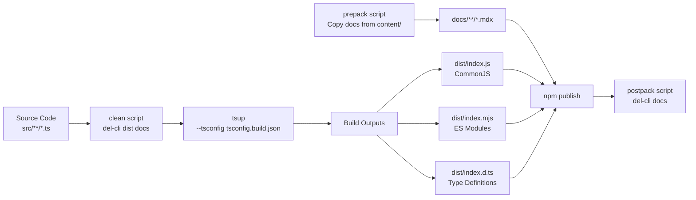
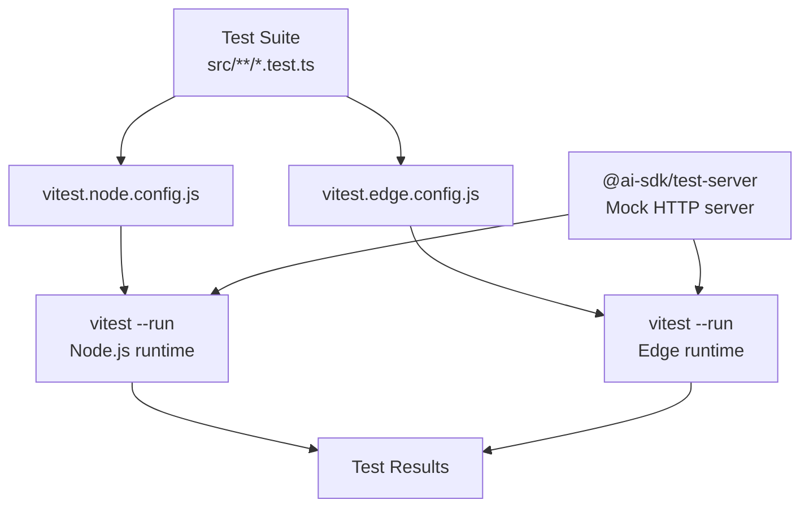
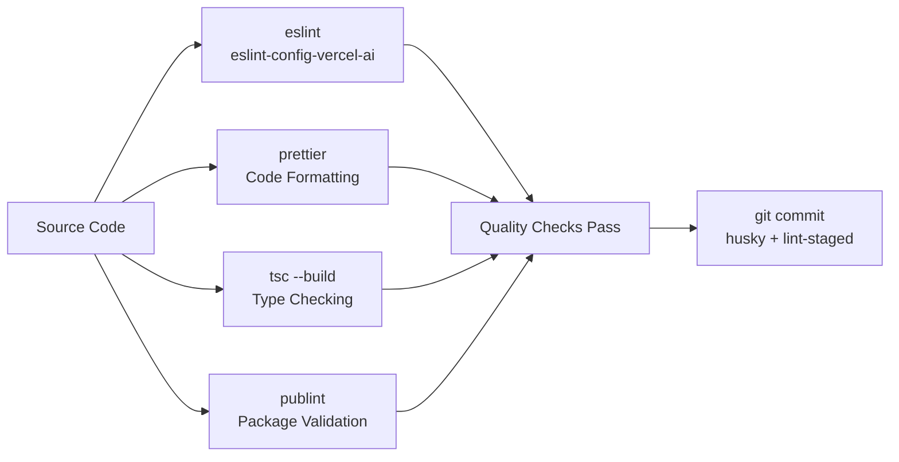
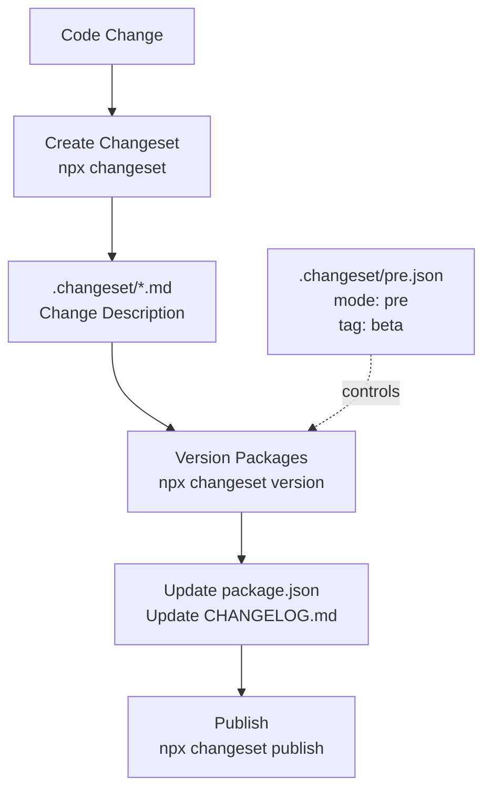
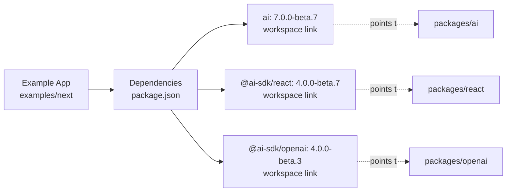
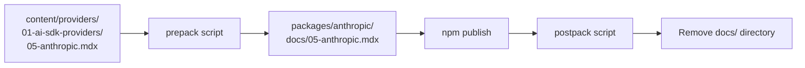

# Development and Contribution

<details>
<summary>Relevant source files</summary>

The following files were used as context for generating this wiki page:

- [.changeset/pre.json](.changeset/pre.json)
- [examples/express/package.json](examples/express/package.json)
- [examples/fastify/package.json](examples/fastify/package.json)
- [examples/hono/package.json](examples/hono/package.json)
- [examples/nest/package.json](examples/nest/package.json)
- [examples/next-fastapi/package.json](examples/next-fastapi/package.json)
- [examples/next-google-vertex/package.json](examples/next-google-vertex/package.json)
- [examples/next-langchain/package.json](examples/next-langchain/package.json)
- [examples/next-openai-kasada-bot-protection/package.json](examples/next-openai-kasada-bot-protection/package.json)
- [examples/next-openai-pages/package.json](examples/next-openai-pages/package.json)
- [examples/next-openai-telemetry-sentry/package.json](examples/next-openai-telemetry-sentry/package.json)
- [examples/next-openai-telemetry/package.json](examples/next-openai-telemetry/package.json)
- [examples/next-openai-upstash-rate-limits/package.json](examples/next-openai-upstash-rate-limits/package.json)
- [examples/node-http-server/package.json](examples/node-http-server/package.json)
- [examples/nuxt-openai/package.json](examples/nuxt-openai/package.json)
- [examples/sveltekit-openai/package.json](examples/sveltekit-openai/package.json)
- [packages/amazon-bedrock/CHANGELOG.md](packages/amazon-bedrock/CHANGELOG.md)
- [packages/amazon-bedrock/package.json](packages/amazon-bedrock/package.json)
- [packages/anthropic/CHANGELOG.md](packages/anthropic/CHANGELOG.md)
- [packages/anthropic/package.json](packages/anthropic/package.json)
- [packages/google-vertex/CHANGELOG.md](packages/google-vertex/CHANGELOG.md)
- [packages/google-vertex/package.json](packages/google-vertex/package.json)
- [packages/google/CHANGELOG.md](packages/google/CHANGELOG.md)
- [packages/google/package.json](packages/google/package.json)
- [pnpm-lock.yaml](pnpm-lock.yaml)
- [tools/tsconfig/base.json](tools/tsconfig/base.json)

</details>


This document provides guidance for contributors to the AI SDK repository, covering the monorepo development environment, build infrastructure, testing workflows, and release processes. It explains how to set up a local development environment, run tests, build packages, and understand the coordinated release system.

For information about the overall architecture and package structure, see [Architecture and Design Principles](#1.1) and [Package Structure and Organization](#1.2). For example applications demonstrating SDK usage, see [Examples and Getting Started](#5).

---

## Monorepo Structure

The AI SDK uses a **pnpm workspace-based monorepo** with three primary directories: `packages/` for SDK packages, `examples/` for demonstration applications, and `tools/` for shared development configurations.

### Workspace Directory Layout

```mermaid
graph TD
    ROOT[ai/ repository root]
    
    ROOT --> PACKAGES[packages/**]
    ROOT --> EXAMPLES[examples/**]
    ROOT --> TOOLS[tools/**]
    ROOT --> CONTENT[content/**]
    
    PACKAGES --> CORE[ai<br/>Core SDK]
    PACKAGES --> PROVIDER_PKG[@ai-sdk/provider<br/>Provider Interfaces]
    PACKAGES --> PROVIDER_UTILS[@ai-sdk/provider-utils<br/>Shared Utilities]
    
    PACKAGES --> PROVIDERS_GROUP[Provider Packages]
    PROVIDERS_GROUP --> OPENAI[@ai-sdk/openai]
    PROVIDERS_GROUP --> ANTHROPIC[@ai-sdk/anthropic]
    PROVIDERS_GROUP --> GOOGLE[@ai-sdk/google]
    PROVIDERS_GROUP --> BEDROCK[@ai-sdk/amazon-bedrock]
    PROVIDERS_GROUP --> VERTEX[@ai-sdk/google-vertex]
    
    PACKAGES --> UI_GROUP[UI Framework Packages]
    UI_GROUP --> REACT[@ai-sdk/react]
    UI_GROUP --> VUE[@ai-sdk/vue]
    UI_GROUP --> SVELTE[@ai-sdk/svelte]
    UI_GROUP --> ANGULAR[@ai-sdk/angular]
    
    EXAMPLES --> NEXT_EXAMPLES[next/<br/>next-agent/<br/>next-langchain/<br/>etc.]
    EXAMPLES --> SVELTEKIT[sveltekit-openai]
    EXAMPLES --> NUXT[nuxt-openai]
    EXAMPLES --> SERVER_EXAMPLES[express/<br/>fastify/<br/>hono/<br/>nest/]
    
    TOOLS --> TSCONFIG[tsconfig/base.json]
    TOOLS --> ESLINT[eslint-config]
    
    CONTENT --> PROVIDER_DOCS[providers/**/*.mdx]
```

**Sources**: [pnpm-lock.yaml:1-631]()

### Workspace Dependency Management

Packages within the monorepo reference each other using `workspace:*` protocol in their `package.json` files. This ensures local packages are linked during development and resolved to the correct published versions during release.

| Dependency Pattern | Usage | Example |
|-------------------|-------|---------|
| `workspace:*` | Link to any version of a workspace package | `"@ai-sdk/provider": "workspace:*"` |
| `link:../../packages/openai` | Direct path link in examples | Used by example applications |
| Version ranges | External dependencies | `"zod": "3.25.76"` |

**Sources**: [examples/sveltekit-openai/package.json:19-21](), [packages/google-vertex/package.json:64-69]()

---

## Development Environment Setup

### Prerequisites

1. **Node.js**: Version 18 or higher (specified in `engines` field)
2. **pnpm**: Package manager for workspace management
3. **Git**: Version control

### Installation Steps

```bash
# Clone the repository
git clone https://github.com/vercel/ai.git
cd ai

# Install dependencies across all workspaces
pnpm install

# Build all packages
pnpm build

# Run tests
pnpm test
```

The repository includes root-level development dependencies for tooling that spans the entire monorepo:

- `@changesets/cli`: Release management
- `@playwright/test`: End-to-end testing
- `eslint`: Code linting
- `prettier`: Code formatting
- `vitest`: Unit and integration testing
- `typescript`: Type checking
- `turbo`: Build orchestration

**Sources**: [pnpm-lock.yaml:10-63]()

---

## Package Build Pipeline

Each SDK package follows a standardized build pipeline using `tsup` for bundling and TypeScript for type generation.



### Build Configuration

All packages share a common build configuration pattern:

```json
{
  "scripts": {
    "build": "pnpm clean && tsup --tsconfig tsconfig.build.json",
    "clean": "del-cli dist docs *.tsbuildinfo",
    "prepack": "mkdir -p docs && cp ../../content/providers/... ./docs/",
    "postpack": "del-cli docs"
  }
}
```

The `prepack` script copies provider documentation from the `content/providers/` directory into each package's `docs/` directory, ensuring published packages include their documentation. The `postpack` script removes this temporary documentation after publishing.

**Sources**: [packages/google-vertex/package.json:26-31](), [packages/anthropic/package.json:25-30]()

### Package Exports

Packages use the `exports` field to provide multiple entry points and formats:

```json
{
  "exports": {
    "./package.json": "./package.json",
    ".": {
      "types": "./dist/index.d.ts",
      "import": "./dist/index.mjs",
      "require": "./dist/index.js"
    },
    "./internal": {
      "types": "./dist/internal/index.d.ts",
      "import": "./dist/internal/index.mjs",
      "require": "./dist/internal/index.js"
    }
  }
}
```

**Sources**: [packages/google/package.json:39-52](), [packages/anthropic/package.json:39-52]()

---

## Testing Infrastructure

The repository uses `vitest` for testing with separate configurations for Node.js and edge runtime environments.



### Test Script Structure

Each package defines multiple test commands:

| Script | Purpose | Command |
|--------|---------|---------|
| `test` | Run all tests | `pnpm test:node && pnpm test:edge` |
| `test:node` | Node.js environment tests | `vitest --config vitest.node.config.js --run` |
| `test:edge` | Edge runtime tests | `vitest --config vitest.edge.config.js --run` |
| `test:watch` | Watch mode for development | `vitest --config vitest.node.config.js` |
| `test:update` | Update snapshots | `pnpm test:node -u` |

The dual-environment testing ensures packages work correctly in both traditional Node.js environments and edge runtimes like Vercel Edge Functions.

**Sources**: [packages/google-vertex/package.json:35-39](), [packages/amazon-bedrock/package.json:33-37]()

### Test Server Infrastructure

Packages use `@ai-sdk/test-server` as a development dependency to provide mock HTTP servers for testing provider integrations. This package is explicitly listed in `devDependencies` to avoid bundling test utilities in production packages.

**Sources**: [packages/google-vertex/package.json:72](), [packages/anthropic/package.json:58]()

---

## Code Quality Tools

The monorepo enforces code quality through multiple automated checks:



### Linting Configuration

The repository uses a shared ESLint configuration package `eslint-config-vercel-ai` (also referenced as `@vercel/ai-tsconfig` in some packages):

```json
{
  "devDependencies": {
    "eslint": "8.57.1",
    "eslint-config-vercel-ai": "workspace:*"
  },
  "scripts": {
    "lint": "eslint \"./**/*.ts*\"",
    "prettier-check": "prettier --check \"./**/*.ts*\""
  }
}
```

**Sources**: [pnpm-lock.yaml:22-24](), [packages/google/package.json:30-32]()

### TypeScript Configuration

Packages extend a shared base TypeScript configuration from `tools/tsconfig/base.json`:

- **Module System**: ESNext with Bundler resolution
- **Strict Mode**: Enabled for type safety
- **Declaration Maps**: Generated for debugging
- **Isolated Modules**: Required for bundler compatibility

**Sources**: [tools/tsconfig/base.json:1-23]()

### Pre-commit Hooks

The repository uses `husky` and `lint-staged` to run quality checks before commits:

```json
{
  "devDependencies": {
    "husky": "^9.1.7",
    "lint-staged": "15.2.10"
  }
}
```

**Sources**: [pnpm-lock.yaml:25-30]()

---

## Release Management

The repository uses `@changesets/cli` for coordinated versioning and publishing across all packages. The entire repository is currently in **pre-release mode** with the `beta` tag.



### Pre-release Configuration

The `.changeset/pre.json` file indicates the repository is in beta mode with coordinated versioning:

```json
{
  "mode": "pre",
  "tag": "beta",
  "initialVersions": {
    "ai": "6.0.116",
    "@ai-sdk/openai": "3.0.41",
    "@ai-sdk/anthropic": "3.0.58",
    "@ai-sdk/google-vertex": "4.0.80"
  }
}
```

Current beta versions as of this pre-release:
- `ai` package: `7.0.0-beta.7`
- Provider packages: `4.0.0-beta.x` series
- UI framework packages: `3.0.0-beta.x` or `4.0.0-beta.x` series

**Sources**: [.changeset/pre.json:1-100]()

### Changelog Maintenance

Each package maintains its own `CHANGELOG.md` file documenting version history and changes. The changeset system automatically updates these files during version bumps.

Example changelog entry structure:

```markdown
## 5.0.0-beta.3

### Patch Changes

- Updated dependencies [531251e]
  - @ai-sdk/provider-utils@5.0.0-beta.1
  - @ai-sdk/anthropic@4.0.0-beta.1
  - @ai-sdk/google@4.0.0-beta.3
```

**Sources**: [packages/google-vertex/CHANGELOG.md:1-15](), [packages/amazon-bedrock/CHANGELOG.md:1-15]()

---

## Example Application Development

The `examples/` directory contains 50+ demonstration applications showing SDK usage across different frameworks. These examples use `workspace:*` dependencies to consume local package builds.

### Example Package Structure



Examples are organized by framework:
- **Next.js**: `next/`, `next-agent/`, `next-langchain/`, `next-openai-pages/`, etc.
- **SvelteKit**: `sveltekit-openai/`
- **Nuxt**: `nuxt-openai/`
- **Angular**: `angular/`
- **Server-side**: `express/`, `fastify/`, `hono/`, `nest/`, `node-http-server/`

**Sources**: [examples/sveltekit-openai/package.json:1-46](), [examples/nuxt-openai/package.json:1-34]()

### Running Examples

Each example includes standard development scripts:

```json
{
  "scripts": {
    "dev": "next dev",
    "build": "next build",
    "start": "next start"
  }
}
```

Examples can be run individually after building the monorepo:

```bash
# Build all packages first
pnpm build

# Navigate to example
cd examples/next

# Run development server
pnpm dev
```

**Sources**: [examples/next-google-vertex/package.json:5-9](), [examples/next-langchain/package.json:5-11]()

---

## Common Development Tasks

### Adding a New Package

1. Create package directory in `packages/`
2. Add `package.json` with exports and scripts
3. Configure `tsconfig.build.json`
4. Add `vitest.node.config.js` and `vitest.edge.config.js`
5. Update `pnpm-workspace.yaml` if needed
6. Run `pnpm install` to link workspace dependencies

### Adding a New Example

1. Create example directory in `examples/`
2. Add `package.json` with workspace dependencies
3. Use framework-specific setup (Next.js, SvelteKit, etc.)
4. Reference SDK packages using version from beta releases

### Updating Dependencies

```bash
# Update all dependencies
pnpm update

# Update TypeScript references
pnpm update-ts-references
```

**Sources**: [pnpm-lock.yaml:58-60]()

### Running Specific Package Tests

```bash
# From repository root
cd packages/openai
pnpm test

# Watch mode
pnpm test:watch

# Update snapshots
pnpm test:update
```

---

## Documentation Integration

The monorepo includes a `content/` directory containing provider documentation in MDX format. During the package publishing process, relevant documentation is copied into each package.

### Documentation Flow



**Sources**: [packages/anthropic/package.json:28-29](), [packages/google-vertex/package.json:30-31]()

For detailed information about specific development workflows:
- Monorepo workspace configuration and package linking: see [Monorepo Structure and Workspace Management](#6.1)
- Build tools, testing frameworks, and quality checks: see [Build, Test, and Quality Infrastructure](#6.2)
- Changeset workflow and version coordination: see [Release Process and Version Management](#6.3)
- Breaking changes and upgrade paths: see [Migration Guides](#6.4)