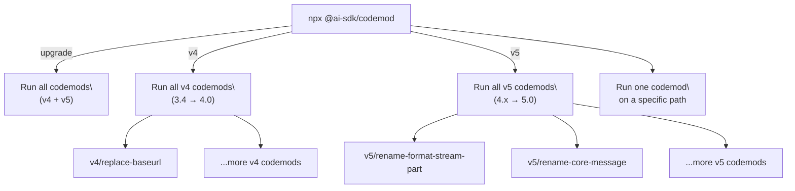
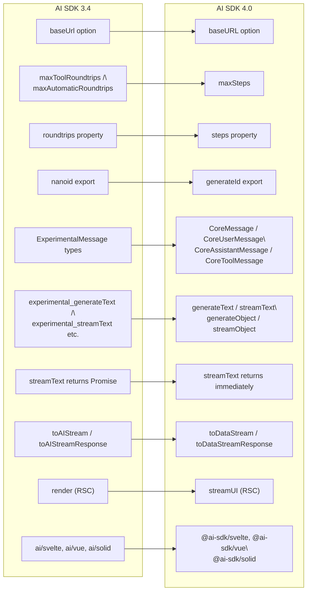
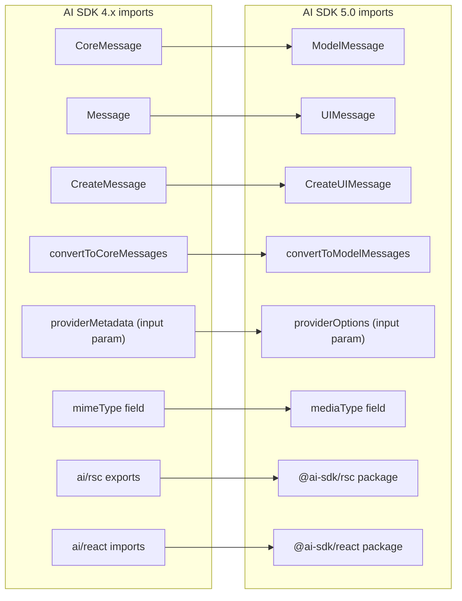

# Migration Guides

<details>
<summary>Relevant source files</summary>

The following files were used as context for generating this wiki page:

- [.changeset/pre.json](.changeset/pre.json)
- [examples/express/package.json](examples/express/package.json)
- [examples/fastify/package.json](examples/fastify/package.json)
- [examples/hono/package.json](examples/hono/package.json)
- [examples/nest/package.json](examples/nest/package.json)
- [examples/next-fastapi/package.json](examples/next-fastapi/package.json)
- [examples/next-google-vertex/package.json](examples/next-google-vertex/package.json)
- [examples/next-langchain/package.json](examples/next-langchain/package.json)
- [examples/next-openai-kasada-bot-protection/package.json](examples/next-openai-kasada-bot-protection/package.json)
- [examples/next-openai-pages/package.json](examples/next-openai-pages/package.json)
- [examples/next-openai-telemetry-sentry/package.json](examples/next-openai-telemetry-sentry/package.json)
- [examples/next-openai-telemetry/package.json](examples/next-openai-telemetry/package.json)
- [examples/next-openai-upstash-rate-limits/package.json](examples/next-openai-upstash-rate-limits/package.json)
- [examples/node-http-server/package.json](examples/node-http-server/package.json)
- [examples/nuxt-openai/package.json](examples/nuxt-openai/package.json)
- [examples/sveltekit-openai/package.json](examples/sveltekit-openai/package.json)
- [packages/ai/CHANGELOG.md](packages/ai/CHANGELOG.md)
- [packages/ai/package.json](packages/ai/package.json)
- [packages/amazon-bedrock/CHANGELOG.md](packages/amazon-bedrock/CHANGELOG.md)
- [packages/amazon-bedrock/package.json](packages/amazon-bedrock/package.json)
- [packages/anthropic/CHANGELOG.md](packages/anthropic/CHANGELOG.md)
- [packages/anthropic/package.json](packages/anthropic/package.json)
- [packages/google-vertex/CHANGELOG.md](packages/google-vertex/CHANGELOG.md)
- [packages/google-vertex/package.json](packages/google-vertex/package.json)
- [packages/google/CHANGELOG.md](packages/google/CHANGELOG.md)
- [packages/google/package.json](packages/google/package.json)
- [packages/react/CHANGELOG.md](packages/react/CHANGELOG.md)
- [packages/react/package.json](packages/react/package.json)
- [packages/rsc/CHANGELOG.md](packages/rsc/CHANGELOG.md)
- [packages/rsc/package.json](packages/rsc/package.json)
- [packages/rsc/tests/e2e/next-server/CHANGELOG.md](packages/rsc/tests/e2e/next-server/CHANGELOG.md)
- [packages/svelte/CHANGELOG.md](packages/svelte/CHANGELOG.md)
- [packages/svelte/package.json](packages/svelte/package.json)
- [packages/vue/CHANGELOG.md](packages/vue/CHANGELOG.md)
- [packages/vue/package.json](packages/vue/package.json)
- [pnpm-lock.yaml](pnpm-lock.yaml)

</details>


This page summarizes the migration guides covering all major AI SDK version transitions from 3.x through 5.0, including the automated codemod tooling, data migration strategies for persisted messages, and the AI SDK 5 Migration MCP Server. For details on the release process that produces these versions, see [Release Process and Version Management](#6.3). For the package structure that changes between versions, see [Package Structure and Organization](#1.2).

---

## Version History and Scope

The migration guide documents are located in [content/docs/08-migration-guides/]() and cover the following upgrade paths:

| Source Version | Target Version | Breaking Changes | Codemods Available | Guide File |
|---|---|---|---|---|
| 3.0 | 3.1 | Legacy providers → AI SDK Core, `render` → `streamUI` | No | `39-migration-guide-3-1.mdx` |
| 3.1 | 3.2 | `StreamingReactResponse` removed, UI framework packages separated | No | `38-migration-guide-3-2.mdx` |
| 3.2 | 3.3 | None | No | `37-migration-guide-3-3.mdx` |
| 3.3 | 3.4 | None | No | `36-migration-guide-3-4.mdx` |
| 3.4 | 4.0 | Significant (see below) | Yes (`npx @ai-sdk/codemod v4`) | `29-migration-guide-4-0.mdx` |
| 4.0 | 4.1 | None | No | `28-migration-guide-4-1.mdx` |
| 4.1 | 4.2 | Message parts redesign | No | `27-migration-guide-4-2.mdx` |
| 4.x | 5.0 | Significant (see below) | Yes (`npx @ai-sdk/codemod v5`) | `26-migration-guide-5-0.mdx` |
| 4.x | 5.0 (data) | Persisted message schema | Manual | `25-migration-guide-5-0-data.mdx` |

**Diagram: SDK version progression**

```mermaid
flowchart LR
    v30["v3.0\
(render, legacy providers)"]
    v31["v3.1\
(AI SDK Core, streamUI)"]
    v32["v3.2\
(UI package separation)"]
    v33["v3.3\
(OpenTelemetry, useObject)"]
    v34["v3.4\
(no breaking changes)"]
    v40["v4.0\
(factory fns, maxSteps,\
streamText sync)"]
    v41["v4.1\
(no breaking changes)"]
    v42["v4.2\
(message parts)"]
    v50["v5.0\
(UIMessage, stopWhen,\
createUIMessageStream)"]

    v30 --> v31 --> v32 --> v33 --> v34 --> v40 --> v41 --> v42 --> v50
```



Sources: [content/docs/08-migration-guides/index.mdx]()

---

## Codemod Tooling (`@ai-sdk/codemod`)

Codemods are automated AST transformations that rewrite source code to match renamed or restructured APIs. The `@ai-sdk/codemod` package ([packages/codemod/src/codemods/]()) is the primary tool for automating upgrade work.

**Diagram: `@ai-sdk/codemod` command structure**



### Running Codemods

```sh
# Run all codemods for the current major upgrade
npx @ai-sdk/codemod upgrade

# Run only v5 codemods (v4 → v5)
npx @ai-sdk/codemod v5

# Run only v4 codemods (v3.4 → v4)
npx @ai-sdk/codemod v4

# Run a single codemod on a specific directory
npx @ai-sdk/codemod v5/rename-format-stream-part src/
```

> **Note:** Codemods cover many but not all changes. Manual review is always required after running them.

Sources: [content/docs/08-migration-guides/26-migration-guide-5-0.mdx:72-115](), [content/docs/08-migration-guides/29-migration-guide-4-0.mdx:33-76]()

---

## 3.4 → 4.0 Breaking Changes

### Package Versions

| Package | Target Version |
|---|---|
| `ai` | `4.0.*` |
| `@ai-sdk/provider-utils` | `2.0.*` |
| `@ai-sdk/*` providers | `1.0.*` |

### Core API Changes

**Diagram: Key renames and removals in 4.0**



**Notable behavior changes:**

- `streamText` and `streamObject` no longer return Promises; remove `await` from call sites.
- `maxSteps` replaces `maxToolRoundtrips` / `maxAutomaticRoundtrips`. The equivalence is: `maxSteps = roundtrips + 1`.
- Provider class facades (`new OpenAI(...)`, `new Anthropic(...)`, `new Mistral(...)`, `new Google(...)`) are replaced with factory functions (`createOpenAI(...)`, `createAnthropic(...)`, etc.).
- `generateId()` replaces `nanoid`. It now generates 16-character IDs (previously 7), which may require database schema updates.
- `streamText` results: `warnings` becomes a `Promise` (must `await result.warnings`).
- `rawResponse` removed from all result types; use `response` instead.
- `responseMessages` removed from `generateText` / `streamText`; use `response.messages`.

Sources: [content/docs/08-migration-guides/29-migration-guide-4-0.mdx]()

---

## 4.1 → 4.2: Message Parts

Version 4.2 redesigned how `useChat` structures assistant messages. Tool calls, reasoning, and text output are now stored in a single `parts` array in order of occurrence, rather than as separate top-level properties. The old fields remain for backward compatibility.

```
// 4.1 (legacy)
message.content = "Final answer"
message.reasoning = "..."
message.toolInvocations = [{ toolName: "calculator", args: {...} }]

// 4.2 (parts array)
message.parts = [
  { type: "text", text: "Final answer" },
  { type: "reasoning", reasoning: "..." },
  { type: "tool-invocation", toolInvocation: { toolName: "calculator", args: {...} } }
]
```

Sources: [content/docs/08-migration-guides/27-migration-guide-4-2.mdx]()

---

## 4.x → 5.0 Breaking Changes

Version 5.0 is the largest breaking release. The recommended migration process is:

1. Backup project and commit all changes.
2. Upgrade packages to 5.0 versions.
3. Run codemods (`npx @ai-sdk/codemod v5`) or use the [MCP Server](#ai-sdk-5-migration-mcp-server).
4. Address remaining manual changes from the breaking changes list below.
5. Verify and commit.

### Package Versions

| Package | Required Version |
|---|---|
| `ai` | `5.0.0` |
| `@ai-sdk/provider` | `2.0.0` |
| `@ai-sdk/provider-utils` | `3.0.0` |
| `@ai-sdk/*` providers | `2.0.0` |
| `zod` | `4.1.8` or later (required peer dependency) |

> **Zod Requirement:** Upgrading to Zod 4.1.8+ is required to avoid TypeScript performance issues. If upgrading Zod is not immediately possible, set `moduleResolution: "nodenext"` in `tsconfig.json`. See [content/docs/09-troubleshooting/12-typescript-performance-zod.mdx]().

### Type and Import Renames

**Diagram: Core type renames in 5.0**



Sources: [content/docs/08-migration-guides/26-migration-guide-5-0.mdx:141-190](), [content/docs/08-migration-guides/26-migration-guide-5-0.mdx:1227-1259]()

### `UIMessage` Structure Changes

The `UIMessage` type (previously `Message`) replaces the flat `.content` property with a `parts` array. This is now the single source of truth for message content.

| 4.x Property | 5.0 Equivalent |
|---|---|
| `message.content` (string) | `{ type: 'text', text: '...' }` part in `message.parts` |
| `message.reasoning` (string) | `{ type: 'reasoning', text: '...' }` part |
| `message.toolInvocations` array | `tool-${toolName}` typed parts |
| `data` role | Custom `data-*` parts via `createUIMessageStream` |
| `part.reasoning` on reasoning parts | `part.text` on reasoning parts |

### Tool Definition Changes

| 4.x | 5.0 |
|---|---|
| `tool({ parameters: z.object({...}) })` | `tool({ inputSchema: z.object({...}) })` |
| `toolCall.args` | `toolCall.input` |
| `toolResult.result` | `toolResult.output` |
| `experimental_toToolResultContent` | `toModelOutput` |
| `ToolExecutionError` thrown as exception | `tool-error` content part in `result.steps` |
| `toolCallStreaming: true` option | Removed; always enabled by default |

### Tool UI Part State Changes

Tool UI parts use new state names in 5.0:

| 4.x State | 5.0 State | Meaning |
|---|---|---|
| `partial-call` | `input-streaming` | Tool input being streamed |
| `call` | `input-available` | Tool input complete, ready to execute |
| `result` | `output-available` | Tool execution successful |
| *(not present)* | `output-error` | Tool execution failed |

The generic `tool-invocation` part type is replaced with `tool-${toolName}` typed parts. Helper functions `isToolUIPart` and `getToolName` are exported from `ai` for catch-all rendering patterns.

### Multi-Step Control: `maxSteps` → `stopWhen`

`maxSteps` is replaced by `stopWhen`, which accepts predicate functions. The helper functions `stepCountIs` and `hasToolCall` are exported from `ai`.

```
// 4.x
generateText({ maxSteps: 5, ... })

// 5.0
import { stepCountIs, hasToolCall } from 'ai';

generateText({
  stopWhen: stepCountIs(5),      // equivalent to old maxSteps: 5
  // or:
  stopWhen: hasToolCall('done'), // stop when a specific tool is called
  // or array (any condition stops):
  stopWhen: [stepCountIs(10), hasToolCall('submitOrder')],
  ...
})
```

> `stopWhen` conditions are only evaluated when the last step contains tool results. `maxSteps` is also removed from `useChat`; use server-side `stopWhen` with client-side `sendAutomaticallyWhen: lastAssistantMessageIsCompleteWithToolCalls`.

### Reasoning Property Changes

| 4.x | 5.0 | Location |
|---|---|---|
| `result.reasoning` | `result.reasoningText` | `generateText` / `streamText` result |
| `result.reasoningDetails` | `result.reasoning` | `generateText` / `streamText` result |
| `step.reasoning` | `step.reasoningText` | Per-step access |

### Streaming and Data API Changes

`StreamData`, `createDataStreamResponse`, `writeMessageAnnotation`, and `writeData` are all removed. The replacement is `createUIMessageStream` with a `writer` API.

| 4.x | 5.0 |
|---|---|
| `new StreamData()` + `.append()` | `createUIMessageStream({ execute({ writer }) {...} })` |
| `dataStream.writeData(...)` | `writer.write({ type: 'data-*', id, data })` |
| `dataStream.writeMessageAnnotation(...)` | `writer.write({ type: 'data-*', id, data })` |
| `result.mergeIntoDataStream(dataStream)` | `writer.merge(result.toUIMessageStream())` |
| `createDataStreamResponse(...)` | `createUIMessageStreamResponse({ stream })` |

### Other Core Changes

- `maxTokens` → `maxOutputTokens`
- `step.stepType` removed; infer step role from index or `step.toolResults.length`
- `result.usage` now refers to the final step only; `result.totalUsage` is the aggregate
- `experimental_continueSteps` removed (use models with higher output token limits)
- Image model settings (`maxImagesPerCall`, `pollIntervalMillis`) moved to `providerOptions`

### `useChat` Changes

| 4.x | 5.0 |
|---|---|
| `initialMessages` option | `messages` option |
| `maxSteps` option | Server-side `stopWhen` + client-side `sendAutomaticallyWhen` |
| `append(message)` | `sendMessage(message)` |
| Shared state via same `id` | `chat-store` (`createChatStore`) |
| Managed `input` state | Removed; manage externally |

Sources: [content/docs/08-migration-guides/26-migration-guide-5-0.mdx]()

---

## Data Migration for Persisted Messages (4.x → 5.0)

Code migrations handle source files. Persisted messages in a database require a separate strategy because the `UIMessage` schema changed substantially.

**Diagram: Two-phase data migration strategy**

```mermaid
flowchart TD
    subgraph "Phase1[\"Phase 1 - Runtime Conversion (hours/days)\"]"
        P1A["Install ai-legacy alias\
npm:ai@^4.3.2"]
        P1B["Write convertV4MessageToV5()\
and convertV5MessageToV4()"]
        P1C["loadChat(): read from DB\
→ convertV4MessageToV5()"]
        P1D["POST handler: convertV5MessageToV4()\
before upsertMessage()"]
        P1A --> P1B --> P1C --> P1D
    end

    subgraph "Phase2[\"Phase 2 - Schema Migration (ongoing)\"]"
        P2A["Create messages_v5 table\
(same structure, v5 types)"]
        P2B["Dual-write: upsertMessage()\
writes to both messages and messages_v5"]
        P2C["Run migrateExistingMessages()\
script in background"]
        P2D["Switch loadChat() to read\
from messages_v5"]
        P2E["Stop dual-write,\
write to messages_v5 only"]
        P2F["Drop messages table\
(after safe period)"]
        P2A --> P2B --> P2C --> P2D --> P2E --> P2F
    end

    Phase1 --> Phase2
```

### Phase 1: Runtime Conversion

Install the v4 package alongside v5 for type safety during conversion:

```json
// package.json
{
  "dependencies": {
    "ai": "^5.0.0",
    "ai-legacy": "npm:ai@^4.3.2"
  }
}
```

The conversion layer consists of two functions defined in a shared module (e.g. `conversion.ts`):

- `convertV4MessageToV5(msg, index)` — converts a stored v4 `Message` to a v5 `UIMessage`, handling `toolInvocations`, `reasoning`, `parts`, `role: 'data'`, and file/source parts.
- `convertV5MessageToV4(msg)` — converts a v5 `UIMessage` back to the legacy format for writing to the existing DB table.

The state mapping between v4 and v5 tool states is:

| v4 `ToolInvocation.state` | v5 `ToolUIPart.state` |
|---|---|
| `partial-call` | `input-streaming` |
| `call` | `input-available` |
| `result` | `output-available` |

Key structural conversions handled by `convertV4MessageToV5`:

| v4 field | v5 part type |
|---|---|
| `toolInvocation` part / `toolInvocations` array | `tool-${toolName}` part |
| `reasoning` part (with `.reasoning` property) | `reasoning` part (with `.text` property) |
| `source` part | `source-url` part |
| `file` part (with `.mimeType`, `.data`) | `file` part (with `.mediaType`, `.url`) |
| `role: 'data'` message | `data-custom` part |

See [content/docs/08-migration-guides/25-migration-guide-5-0-data.mdx:100-320]() for the full conversion function implementations.

### Phase 2: Side-by-Side Schema Migration

Create a `messages_v5` table with the same structure as `messages` but typed for v5 `UIMessage['parts']`. The migration proceeds in stages:

1. Create `messages_v5` table.
2. Enable dual-write in `upsertMessage()` so new messages go to both tables.
3. Run a batched background migration script converting unmigrated rows from `messages` to `messages_v5`.
4. Verify row counts match between tables.
5. Switch `loadChat()` to read from `messages_v5` (no conversion needed).
6. Remove dual-write; write only to `messages_v5`.
7. Drop `messages` table after a monitoring period.

Sources: [content/docs/08-migration-guides/25-migration-guide-5-0-data.mdx]()

---

## AI SDK 5 Migration MCP Server

For projects using Cursor or another MCP-compatible coding agent, the [AI SDK 5 Migration MCP Server](https://github.com/vercel-labs/ai-sdk-5-migration-mcp-server) provides AI-assisted migration. It generates a migration checklist and guides the agent through each change.

**Setup in `.cursor/mcp.json`:**

```json
{
  "mcpServers": {
    "ai-sdk-5-migration": {
      "url": "https://ai-sdk-5-migration-mcp-server.vercel.app/api/mcp"
    }
  }
}
```

After enabling the server in Cursor's MCP settings, run the following prompt in the agent:

```
Please migrate this project to AI SDK 5 using the ai-sdk-5-migration mcp server. Start by creating a checklist.
```

Sources: [content/docs/08-migration-guides/26-migration-guide-5-0.mdx:19-43]()

---

## 3.x Minor Version Changes

### 3.0 → 3.1

- **AI SDK Core introduced**: `generateText`, `streamText`, `generateObject`, `streamObject` replace direct use of provider SDKs.
- **`streamUI` replaces `render`**: `render` from `@ai-sdk/rsc` is replaced by `streamUI`, which supports any compatible provider.
- Legacy provider pattern (direct `OpenAI` SDK + `OpenAIStream` + `StreamingTextResponse`) is superseded by the Core API pattern.

Sources: [content/docs/08-migration-guides/39-migration-guide-3-1.mdx]()

### 3.1 → 3.2

- `StreamingReactResponse` removed; use `@ai-sdk/rsc` instead.
- UI framework packages separated: `ai/svelte` → `@ai-sdk/svelte`, `ai/vue` → `@ai-sdk/vue`, `ai/solid` → `@ai-sdk/solid`.
- `nanoid` deprecated in favour of `generateId`.

Sources: [content/docs/08-migration-guides/38-migration-guide-3-2.mdx]()

### 3.2 → 3.3

No breaking changes. Notable additions: OpenTelemetry support, `useObject` hook, experimental attachment support in `useChat`, `setThreadId` for `useAssistant`.

Sources: [content/docs/08-migration-guides/37-migration-guide-3-3.mdx]()

### 3.3 → 3.4

No breaking changes.

Sources: [content/docs/08-migration-guides/36-migration-guide-3-4.mdx]()