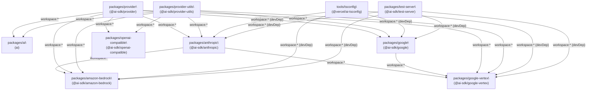
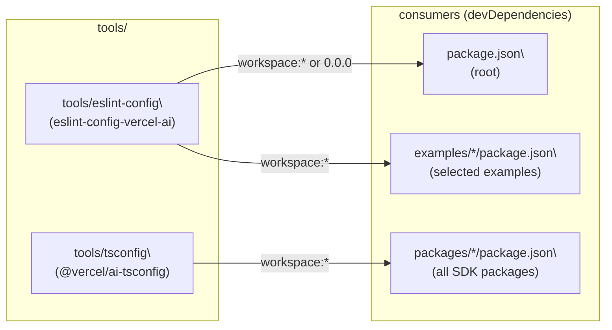
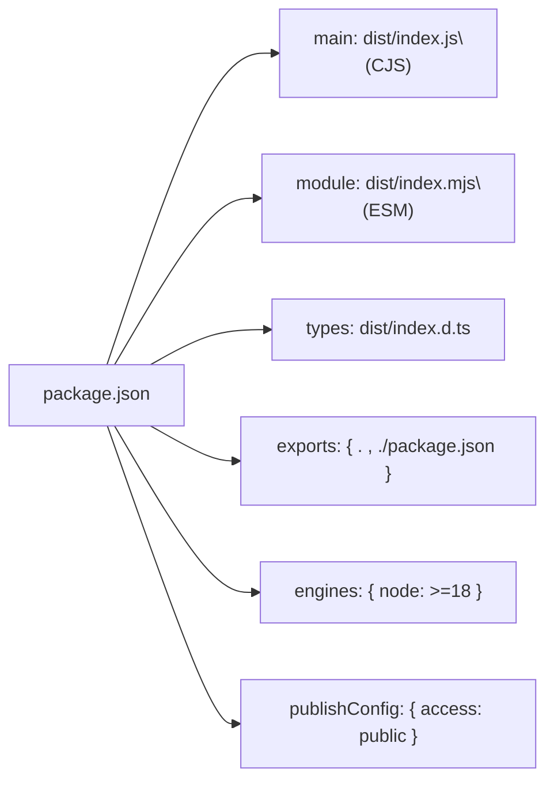

# Monorepo Structure and Workspace Management

<details>
<summary>Relevant source files</summary>

The following files were used as context for generating this wiki page:

- [.changeset/pre.json](.changeset/pre.json)
- [examples/express/package.json](examples/express/package.json)
- [examples/fastify/package.json](examples/fastify/package.json)
- [examples/hono/package.json](examples/hono/package.json)
- [examples/nest/package.json](examples/nest/package.json)
- [examples/next-fastapi/package.json](examples/next-fastapi/package.json)
- [examples/next-google-vertex/package.json](examples/next-google-vertex/package.json)
- [examples/next-langchain/package.json](examples/next-langchain/package.json)
- [examples/next-openai-kasada-bot-protection/package.json](examples/next-openai-kasada-bot-protection/package.json)
- [examples/next-openai-pages/package.json](examples/next-openai-pages/package.json)
- [examples/next-openai-telemetry-sentry/package.json](examples/next-openai-telemetry-sentry/package.json)
- [examples/next-openai-telemetry/package.json](examples/next-openai-telemetry/package.json)
- [examples/next-openai-upstash-rate-limits/package.json](examples/next-openai-upstash-rate-limits/package.json)
- [examples/node-http-server/package.json](examples/node-http-server/package.json)
- [examples/nuxt-openai/package.json](examples/nuxt-openai/package.json)
- [examples/sveltekit-openai/package.json](examples/sveltekit-openai/package.json)
- [packages/amazon-bedrock/CHANGELOG.md](packages/amazon-bedrock/CHANGELOG.md)
- [packages/amazon-bedrock/package.json](packages/amazon-bedrock/package.json)
- [packages/anthropic/CHANGELOG.md](packages/anthropic/CHANGELOG.md)
- [packages/anthropic/package.json](packages/anthropic/package.json)
- [packages/google-vertex/CHANGELOG.md](packages/google-vertex/CHANGELOG.md)
- [packages/google-vertex/package.json](packages/google-vertex/package.json)
- [packages/google/CHANGELOG.md](packages/google/CHANGELOG.md)
- [packages/google/package.json](packages/google/package.json)
- [pnpm-lock.yaml](pnpm-lock.yaml)
- [tools/tsconfig/base.json](tools/tsconfig/base.json)

</details>

This page documents the physical layout of the `vercel/ai` repository, the pnpm workspace configuration, package naming rules, the shared `tools/` directory, TypeScript project references, and the steps for adding new packages or examples.

For information on the _build pipeline_, testing, and CI quality checks, see [Build, Test, and Quality Infrastructure](#6.2). For the changeset-based release process, see [Release Process and Version Management](#6.3).

---

## Repository Layout

The repository root contains four main directories that are registered as pnpm workspaces, plus several configuration files.

**Workspace root directories:**

[pnpm-workspace.yaml:1-6]()

```
vercel/ai/
├── packages/          # All publishable SDK packages
├── tools/             # Shared internal tooling (eslint config, tsconfig)
├── examples/          # Example applications (not published to npm)
├── .changeset/        # Changeset files for versioning
├── .github/           # GitHub Actions workflows
├── content/           # Documentation source (mdx files)
├── contributing/      # Contributor guidelines
├── package.json       # Root workspace package (private)
└── pnpm-workspace.yaml
```

One extra entry, `packages/rsc/tests/e2e/next-server`, is registered as a workspace package to allow the RSC end-to-end test server to share dependencies through pnpm's linking mechanism.

Sources: [pnpm-workspace.yaml:1-6](), [package.json:1-89]()

---

## pnpm Workspace Configuration

The repository uses pnpm (pinned to `pnpm@10.11.0` via the `packageManager` field) and Turborepo for task orchestration.

**`pnpm-workspace.yaml`** declares which directories are workspace members:

```yaml
packages:
  - 'packages/*'
  - 'tools/*'
  - 'examples/*'
  - 'packages/rsc/tests/e2e/next-server'
```

**`.npmrc`** configures pnpm behavior:

[.npmrc:1-4]()

| Setting                   | Value                    | Effect                                                       |
| ------------------------- | ------------------------ | ------------------------------------------------------------ |
| `auto-install-peers`      | `true`                   | Peer dependencies are installed automatically                |
| `link-workspace-packages` | `true`                   | Local workspace packages are symlinked, not fetched from npm |
| `public-hoist-pattern`    | `*eslint*`, `*prettier*` | ESLint and Prettier are hoisted to the root `node_modules`   |

The `link-workspace-packages = true` setting is what makes `workspace:*` version specifiers work: pnpm resolves them to the locally built package rather than the npm registry.

Sources: [.npmrc:1-4](), [package.json:65]()

---

## Package Categories and Naming Conventions

Every entry under `packages/` follows one of these naming patterns:

**Workspace directory structure to npm package name mapping:**

| Directory                    | npm package name            | Category                              |
| ---------------------------- | --------------------------- | ------------------------------------- |
| `packages/ai`                | `ai`                        | Core SDK                              |
| `packages/provider`          | `@ai-sdk/provider`          | Provider specification interfaces     |
| `packages/provider-utils`    | `@ai-sdk/provider-utils`    | Shared HTTP/stream utilities          |
| `packages/gateway`           | `@ai-sdk/gateway`           | Vercel AI Gateway                     |
| `packages/openai`            | `@ai-sdk/openai`            | Provider                              |
| `packages/anthropic`         | `@ai-sdk/anthropic`         | Provider                              |
| `packages/google`            | `@ai-sdk/google`            | Provider                              |
| `packages/google-vertex`     | `@ai-sdk/google-vertex`     | Provider                              |
| `packages/amazon-bedrock`    | `@ai-sdk/amazon-bedrock`    | Provider                              |
| `packages/openai-compatible` | `@ai-sdk/openai-compatible` | Provider base class                   |
| `packages/react`             | `@ai-sdk/react`             | UI integration                        |
| `packages/vue`               | `@ai-sdk/vue`               | UI integration                        |
| `packages/svelte`            | `@ai-sdk/svelte`            | UI integration                        |
| `packages/angular`           | `@ai-sdk/angular`           | UI integration                        |
| `packages/solid`             | `@ai-sdk/solid`             | UI integration                        |
| `packages/rsc`               | `@ai-sdk/rsc`               | React Server Components               |
| `packages/langchain`         | `@ai-sdk/langchain`         | Adapter                               |
| `packages/llamaindex`        | `@ai-sdk/llamaindex`        | Adapter                               |
| `packages/mcp`               | `@ai-sdk/mcp`               | MCP integration                       |
| `packages/valibot`           | `@ai-sdk/valibot`           | Schema adapter                        |
| `packages/test-server`       | `@ai-sdk/test-server`       | Internal test utility (not published) |
| `examples/*`                 | `@example/<name>`           | Example apps (`private: true`)        |
| `tools/eslint-config`        | `eslint-config-vercel-ai`   | Shared linting config                 |
| `tools/tsconfig`             | `@vercel/ai-tsconfig`       | Shared TypeScript config              |

All packages under `@ai-sdk/*` and the `ai` package set `"publishConfig": { "access": "public" }` and are published to the public npm registry. All `@example/*` packages are `"private": true` and never published.

Sources: [packages/anthropic/package.json:1-85](), [packages/google-vertex/package.json:1-99](), [packages/amazon-bedrock/package.json:1-88](), [packages/google/package.json:1-85](), [tools/eslint-config/package.json:1-15]()

---

## Internal Dependency Convention: `workspace:*`

All cross-package dependencies within the monorepo use the `workspace:*` version specifier. This tells pnpm to link the local package rather than fetching from the registry.

**Dependency resolution diagram:**



**Example from `packages/anthropic/package.json`:**

```json
"dependencies": {
  "@ai-sdk/provider": "workspace:*",
  "@ai-sdk/provider-utils": "workspace:*"
},
"devDependencies": {
  "@ai-sdk/test-server": "workspace:*",
  "@vercel/ai-tsconfig": "workspace:*"
}
```

When `changeset version` runs to prepare a release, it replaces all `workspace:*` specifiers with the actual resolved version numbers before publishing to npm.

Sources: [packages/anthropic/package.json:52-64](), [packages/google-vertex/package.json:64-77](), [packages/amazon-bedrock/package.json:52-67]()

---

## Shared Tooling: `tools/` Directory

The `tools/` directory contains two workspace packages consumed as `devDependencies` across the entire repository.

**Tooling packages and their consumers:**



### `tools/eslint-config` → `eslint-config-vercel-ai`

[tools/eslint-config/package.json:1-15]()

Provides a shared ESLint configuration extending:

- `eslint-config-next`
- `eslint-config-prettier`
- `eslint-config-turbo`
- `eslint-plugin-react`

Referenced in `package.json` (root) as `"eslint-config-vercel-ai": "workspace:*"`. Some examples pin it as version `"0.0.0"` (the static version string in the tools package) because examples are private and never published.

### `tools/tsconfig` → `@vercel/ai-tsconfig`

[tools/tsconfig/base.json:1-18]()

Provides `base.json` with the canonical TypeScript compiler options used across SDK packages:

| Option            | Value                                                |
| ----------------- | ---------------------------------------------------- |
| `declaration`     | `true`                                               |
| `declarationMap`  | `true`                                               |
| `esModuleInterop` | `true`                                               |
| `isolatedModules` | `true`                                               |
| `module`          | `ESNext`                                             |
| `composite`       | `false` (base; packages override per build tsconfig) |

Individual packages extend this in their own `tsconfig.json` and `tsconfig.build.json` files.

Sources: [tools/eslint-config/package.json:1-15](), [tools/tsconfig/base.json:1-18](), [package.json:36]()

---

## Per-Package Internal Structure

Each SDK package under `packages/` follows an identical layout:

```
packages/<name>/
├── src/                   # TypeScript source files
├── dist/                  # Built output (gitignored)
│   ├── index.js           # CJS bundle
│   ├── index.mjs          # ESM bundle
│   └── index.d.ts         # Type declarations
├── docs/                  # Bundled documentation (populated during prepack)
├── package.json
├── tsconfig.json          # Extends @vercel/ai-tsconfig base
├── tsconfig.build.json    # Build-specific tsconfig (used by tsup)
├── vitest.node.config.js
├── vitest.edge.config.js
├── CHANGELOG.md
└── README.md
```

### Standard `package.json` fields

Every SDK package sets these fields consistently:



### Standard scripts

Every SDK package defines these npm scripts:

| Script           | Command                                                         | Purpose                                 |
| ---------------- | --------------------------------------------------------------- | --------------------------------------- |
| `build`          | `pnpm clean && tsup --tsconfig tsconfig.build.json`             | Compile CJS + ESM + types               |
| `build:watch`    | `pnpm clean && tsup --watch`                                    | Incremental watch mode                  |
| `clean`          | `del-cli dist docs *.tsbuildinfo`                               | Remove build artifacts                  |
| `lint`           | `eslint "./**/*.ts*"`                                           | Run ESLint                              |
| `type-check`     | `tsc --build`                                                   | TypeScript project reference type check |
| `prettier-check` | `prettier --check "./**/*.ts*"`                                 | Format check                            |
| `test`           | `pnpm test:node && pnpm test:edge`                              | Run both node and edge test suites      |
| `test:node`      | `vitest --config vitest.node.config.js --run`                   | Node.js environment tests               |
| `test:edge`      | `vitest --config vitest.edge.config.js --run`                   | Edge runtime tests                      |
| `prepack`        | `mkdir -p docs && cp ../../content/providers/.../*.mdx ./docs/` | Bundle docs before publishing           |
| `postpack`       | `del-cli docs`                                                  | Remove docs after publishing            |

The `prepack`/`postpack` pair copies the relevant documentation MDX file from `content/` into the package's `docs/` folder for inclusion in the published tarball, then removes it afterward.

Sources: [packages/anthropic/package.json:24-40](), [packages/google-vertex/package.json:26-40](), [packages/amazon-bedrock/package.json:24-40]()

---

## TypeScript Project References

The monorepo uses TypeScript project references so that `tsc --build` can incrementally type-check the whole dependency graph without re-checking unchanged packages.

- The root `tsconfig.json` references all packages.
- A separate `tsconfig.with-examples.json` extends this to also include example applications (used by the `type-check:full` script in CI).
- Each package has `composite: true` in its `tsconfig.build.json` (which overrides the base where `composite: false`).
- The `update-ts-references` tool (invoked as `pnpm run update-references`) regenerates the `references` arrays in `tsconfig.json` files to stay in sync with `workspace:*` dependencies in `package.json`.

[package.json:13-16]()

Sources: [package.json:14-16](), [tools/tsconfig/base.json:1-18]()

---

## Root-Level Turbo Scripts

The root `package.json` defines all cross-package tasks via Turborepo. Turbo reads `turbo.json` (not shown in the provided files) to determine task dependencies and caching behavior.

[package.json:4-23]()

| Script           | Turbo command                                         | Scope                                   |
| ---------------- | ----------------------------------------------------- | --------------------------------------- |
| `build`          | `turbo build --concurrency 16`                        | All workspaces                          |
| `build:packages` | `turbo build --filter=@ai-sdk/* --filter=ai`          | SDK packages only                       |
| `build:examples` | `turbo build --filter=@example/*`                     | Example apps only                       |
| `test`           | `turbo test --concurrency 16 --filter=!@example/*`    | All non-example packages                |
| `lint`           | `turbo lint`                                          | All workspaces                          |
| `clean`          | `turbo clean`                                         | All workspaces                          |
| `dev`            | `turbo dev --cache=local:r,remote:r --concurrency 25` | All workspaces (with remote cache read) |
| `publint`        | `turbo publint`                                       | All workspaces                          |
| `ci:release`     | `turbo clean && turbo build && changeset publish`     | Release pipeline                        |
| `ci:version`     | `changeset version && cleanup script && pnpm install` | Version bump pipeline                   |

The `--filter=!@example/*` flag on `test` excludes examples from the test run, since examples do not contain test suites.

Sources: [package.json:4-23]()

---

## Adding a New Package

To add a new SDK provider or utility package:

1. **Create the directory**: `packages/<package-name>/`
2. **Copy a similar package's structure**: use an existing provider (e.g., `packages/mistral/`) as a template.
3. **Set the package name** in `package.json` following the `@ai-sdk/<name>` convention.
4. **Reference shared tooling** in `devDependencies`:
   - `"@vercel/ai-tsconfig": "workspace:*"`
   - `"@ai-sdk/test-server": "workspace:*"` (if tests use the HTTP test server)
5. **Declare internal dependencies** using `workspace:*`:
   - At minimum: `"@ai-sdk/provider": "workspace:*"` and `"@ai-sdk/provider-utils": "workspace:*"`
6. **Run `pnpm run update-references`** from the repo root to regenerate TypeScript project references across all `tsconfig.json` files.
7. **Add a changeset** (`pnpm changeset`) describing the new package.
8. **Register docs integration** in `prepack` if the package has associated documentation in `content/providers/`.

For guidance on what the provider implementation itself should look like (interfaces, `doGenerate`/`doStream` contracts), see [Provider Architecture and V3 Specification](#3.1).

Sources: [packages/anthropic/package.json:1-85](), [contributing/providers.md:1-30](), [contributing/provider-architecture.md:1-30](), [package.json:13]()

---

## Adding a New Example

Example applications live in `examples/<name>/` and follow a looser structure since they are never published.

Key conventions for examples:

- **Package name**: `@example/<name>` with `"private": true`.
- **Version**: `"0.0.0"` (never bumped via changesets).
- **Internal package references**: Pin to the current explicit version number (e.g., `"ai": "6.0.99"`) rather than `workspace:*`, so that examples reflect a realistic consumer's install. The `pnpm-lock.yaml` resolves these to local `link:` paths.
- **No changesets required**: PRs that only touch `examples/` or `content/docs/` do not require a changeset file.
- **TypeScript**: Examples have their own standalone `tsconfig.json` and are included in `tsconfig.with-examples.json` for the full type-check.

Contrast of internal vs. example dependency declarations:

| Context                                    | Specifier                           | Resolves to               |
| ------------------------------------------ | ----------------------------------- | ------------------------- |
| `packages/google-vertex/package.json`      | `"@ai-sdk/google": "workspace:*"`   | Always the local package  |
| `examples/next-google-vertex/package.json` | `"@ai-sdk/google-vertex": "4.0.63"` | Local `link:` in lockfile |

Sources: [examples/next-google-vertex/package.json:1-28](), [examples/express/package.json:1-22](), [examples/next-langchain/package.json:1-40](), [pnpm-lock.yaml:856-897]()
