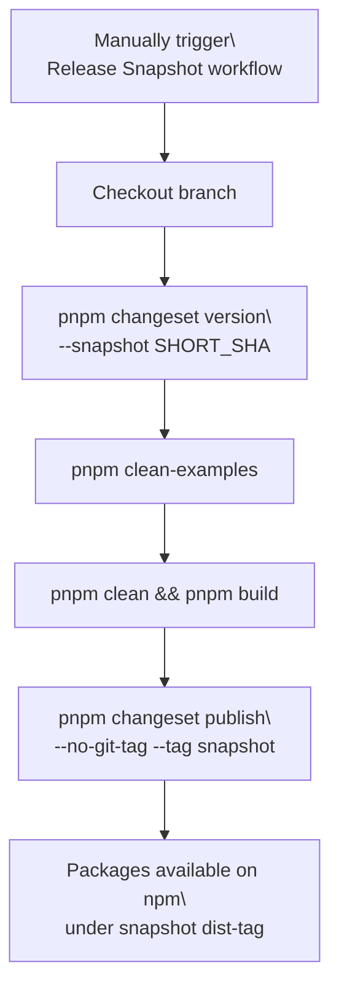
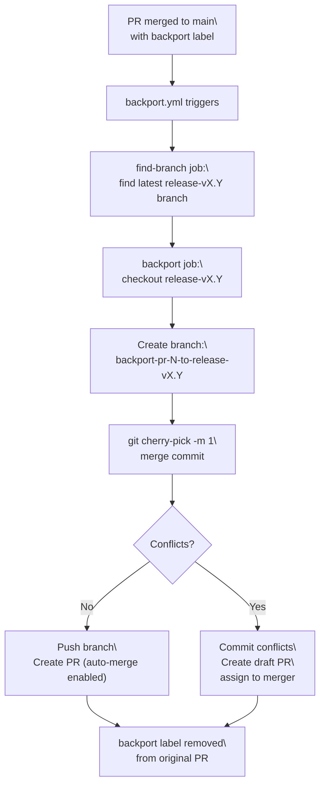
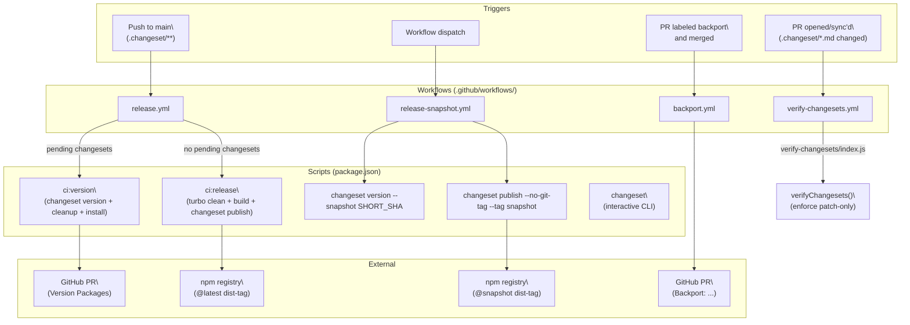

# Release Process and Version Management

<details>
<summary>Relevant source files</summary>

The following files were used as context for generating this wiki page:

- [.changeset/pre.json](.changeset/pre.json)
- [examples/express/package.json](examples/express/package.json)
- [examples/fastify/package.json](examples/fastify/package.json)
- [examples/hono/package.json](examples/hono/package.json)
- [examples/nest/package.json](examples/nest/package.json)
- [examples/next-fastapi/package.json](examples/next-fastapi/package.json)
- [examples/next-google-vertex/package.json](examples/next-google-vertex/package.json)
- [examples/next-langchain/package.json](examples/next-langchain/package.json)
- [examples/next-openai-kasada-bot-protection/package.json](examples/next-openai-kasada-bot-protection/package.json)
- [examples/next-openai-pages/package.json](examples/next-openai-pages/package.json)
- [examples/next-openai-telemetry-sentry/package.json](examples/next-openai-telemetry-sentry/package.json)
- [examples/next-openai-telemetry/package.json](examples/next-openai-telemetry/package.json)
- [examples/next-openai-upstash-rate-limits/package.json](examples/next-openai-upstash-rate-limits/package.json)
- [examples/node-http-server/package.json](examples/node-http-server/package.json)
- [examples/nuxt-openai/package.json](examples/nuxt-openai/package.json)
- [examples/sveltekit-openai/package.json](examples/sveltekit-openai/package.json)
- [packages/ai/CHANGELOG.md](packages/ai/CHANGELOG.md)
- [packages/ai/package.json](packages/ai/package.json)
- [packages/amazon-bedrock/CHANGELOG.md](packages/amazon-bedrock/CHANGELOG.md)
- [packages/amazon-bedrock/package.json](packages/amazon-bedrock/package.json)
- [packages/anthropic/CHANGELOG.md](packages/anthropic/CHANGELOG.md)
- [packages/anthropic/package.json](packages/anthropic/package.json)
- [packages/google-vertex/CHANGELOG.md](packages/google-vertex/CHANGELOG.md)
- [packages/google-vertex/package.json](packages/google-vertex/package.json)
- [packages/google/CHANGELOG.md](packages/google/CHANGELOG.md)
- [packages/google/package.json](packages/google/package.json)
- [packages/react/CHANGELOG.md](packages/react/CHANGELOG.md)
- [packages/react/package.json](packages/react/package.json)
- [packages/rsc/CHANGELOG.md](packages/rsc/CHANGELOG.md)
- [packages/rsc/package.json](packages/rsc/package.json)
- [packages/rsc/tests/e2e/next-server/CHANGELOG.md](packages/rsc/tests/e2e/next-server/CHANGELOG.md)
- [packages/svelte/CHANGELOG.md](packages/svelte/CHANGELOG.md)
- [packages/svelte/package.json](packages/svelte/package.json)
- [packages/vue/CHANGELOG.md](packages/vue/CHANGELOG.md)
- [packages/vue/package.json](packages/vue/package.json)
- [pnpm-lock.yaml](pnpm-lock.yaml)

</details>


This page documents how packages in the `vercel/ai` monorepo are versioned and published to npm. It covers the changeset authoring workflow, the CI-driven release pipeline, snapshot releases, maintenance branches, and backporting. For information about the build and test infrastructure that runs as part of CI, see [Build, Test, and Quality Infrastructure](#6.2). For information about how packages are structured within the workspace, see [Monorepo Structure and Workspace Management](#6.1).

---

## Versioning Policy

The monorepo does **not** follow strict semantic versioning. The convention is:

| Bump type | When used |
|-----------|-----------|
| `patch` | Default for all changes — both bug fixes and new features |
| `minor` | "Marketing releases" only, accompanied by a blog post and migration guide |
| `major` | Major breaking releases |

CI enforces this policy: any changeset file that uses `minor` or `major` as a version bump will fail the `Verify Changesets` check unless the pull request carries a `minor` or `major` label. The enforcement logic lives in [.github/workflows/actions/verify-changesets/index.js:50-137]().

The bypass label set is defined at [.github/workflows/actions/verify-changesets/index.js:3]():

```
const BYPASS_LABELS = ['minor', 'major'];
```

Sources: [.github/workflows/actions/verify-changesets/index.js]()

---

## Current Release State: V7 Beta

The repository is currently in **v7 beta pre-release mode**. This state is tracked in [.changeset/pre.json:1-100](), which records:

- The active pre-release mode (`"mode": "pre"`)
- The dist-tag (`"tag": "beta"`)
- Initial versions for all packages before entering pre-release
- Accumulated changesets during the pre-release phase

**Current version snapshot (as of latest commit):**

| Package | Version |
|---------|---------|
| `ai` | `7.0.0-beta.7` |
| `@ai-sdk/react` | `4.0.0-beta.7` |
| `@ai-sdk/vue` | `4.0.0-beta.7` |
| `@ai-sdk/svelte` | `5.0.0-beta.7` |
| `@ai-sdk/angular` | `3.0.0-beta.7` |
| `@ai-sdk/rsc` | `3.0.0-beta.7` |
| `@ai-sdk/langchain` | `3.0.0-beta.7` |
| `@ai-sdk/openai` | `4.0.0-beta.3` |
| `@ai-sdk/anthropic` | `4.0.0-beta.1` |
| `@ai-sdk/google` | `4.0.0-beta.3` |
| `@ai-sdk/google-vertex` | `5.0.0-beta.3` |
| `@ai-sdk/amazon-bedrock` | `5.0.0-beta.1` |
| `@ai-sdk/provider` | `4.0.0-beta.0` |
| `@ai-sdk/provider-utils` | `5.0.0-beta.1` |
| `@ai-sdk/gateway` | `4.0.0-beta.0` |

While in pre-release mode, all version bumps produce beta versions (e.g., `7.0.0-beta.8`, `7.0.0-beta.9`). The pre-release will continue until `pnpm changeset pre exit` is executed, at which point the next release will produce stable versions (`7.0.0`).

Sources: [.changeset/pre.json](), [packages/ai/package.json](), [packages/react/package.json](), [packages/vue/package.json](), [packages/svelte/package.json](), [packages/google-vertex/package.json](), [packages/amazon-bedrock/package.json]()

---

## Changesets

Every pull request that modifies production code (i.e., not `examples/` or documentation) must include a changeset. A changeset is a Markdown file placed in the `.changeset/` directory that declares which packages change and by how much.

**Creating a changeset:**

```bash
pnpm changeset
```

This runs the `@changesets/cli` (`@changesets/cli@2.27.10` per [pnpm-lock.yaml:10-12]()) interactively and writes a file such as `.changeset/purple-lions-shout.md`. The file has a YAML frontmatter block listing affected packages and their bump types, followed by a description.

**Example changeset file format:**

```markdown
---
"ai": patch
"@ai-sdk/openai": patch
---

Fix streaming timeout edge case in generateText
```

While in beta mode, this changeset would result in versions like `7.0.0-beta.8` for `ai` and `4.0.0-beta.4` for `@ai-sdk/openai`, rather than stable patch versions.

The `changeset` script is declared in the root [package.json:8]().

Sources: [pnpm-lock.yaml:10-12]()

### Changeset Verification Workflow

The `Verify Changesets` GitHub Actions workflow ([.github/workflows/verify-changesets.yml]()) runs on pull requests targeting `main` when `.changeset/*.md` files are modified. It:

1. Collects all changed `.changeset/*.md` files.
2. Reads the frontmatter of each file.
3. Rejects any file where a bump type is not `patch`, unless the PR has a `minor` or `major` label.
4. Writes a pass or fail summary to the GitHub Actions step summary.

Sources: [.github/workflows/verify-changesets.yml](), [.github/workflows/actions/verify-changesets/index.js]()

---

## Regular Release Flow

The regular release pipeline is fully automated using the `changesets/action` GitHub Action and the `release.yml` workflow.

**Release workflow trigger:** A push to `main` that touches `.changeset/**` or `.github/workflows/release.yml`.

**Workflow file:** [.github/workflows/release.yml]()

**Key scripts declared in [package.json:21-22]():**

| Script | Command |
|--------|---------|
| `ci:version` | `changeset version && node .github/scripts/cleanup-examples-changesets.mjs && pnpm install --no-frozen-lockfile` |
| `ci:release` | `turbo clean && turbo build && changeset publish` |

The `cleanup-examples-changesets.mjs` script removes any changesets that only affect example packages, which are not published to npm.

### Release State Machine

The `changesets/action` in [.github/workflows/release.yml:62-69]() decides at each invocation whether to open a pull request or publish packages, based on whether consumed changesets have already been versioned.

**Regular release state machine:**

```mermaid
flowchart TD
    A["Push to main\
(.changeset/** changed)"] --> B["release.yml triggers"]
    B --> C["changesets/action"]
    C --> D{"Unconsumed\
changesets?"}
    D -->|"Yes"| E["Open or update\
\"Version Packages\" PR\
(runs ci:version)"]
    D -->|"No"| F["Publish to npm\
(runs ci:release)"]
    E --> G["Team merges\
Version Packages PR"]
    G --> H["Push to main\
triggers release.yml again"]
    H --> F
    F --> I["Packages published\
to npm registry"]
```

Sources: [.github/workflows/release.yml](), [package.json:21-22]()

### ci:version Step

When `changesets/action` creates or updates the "Version Packages" PR, it runs `pnpm ci:version`, which:

1. Runs `changeset version` — consumes all pending `.changeset/*.md` files, bumps `package.json` versions, and updates `CHANGELOG.md` files. When in pre-release mode, this produces versions like `7.0.0-beta.N` and appends entries to the pre-release section of each `CHANGELOG.md`.
2. Runs `cleanup-examples-changesets.mjs` — removes changeset entries for non-publishable example packages (marked with `"version": "0.0.0"` in their `package.json`, such as [examples/next/package.json](), [examples/sveltekit-openai/package.json](), [examples/nuxt-openai/package.json]()).
3. Runs `pnpm install --no-frozen-lockfile` — updates `pnpm-lock.yaml` to reflect the new versions.

**CHANGELOG structure in pre-release mode:**

During beta, changelogs accumulate entries under a beta version header. For example, [packages/ai/CHANGELOG.md:3-66]() shows:

```markdown
# ai

## 7.0.0-beta.7

### Patch Changes

- 210ed3d: feat(ai): pass result provider metadata across the stream

## 7.0.0-beta.6
...
## 7.0.0-beta.0

### Major Changes

- 8359612: Start v7 pre-release
```

When pre-release mode exits, these beta entries are collapsed into the final `7.0.0` release entry.

Sources: [examples/next/package.json](), [examples/sveltekit-openai/package.json](), [examples/nuxt-openai/package.json](), [packages/ai/CHANGELOG.md:3-66]()

### ci:release Step

When the "Version Packages" PR is merged and there are no more pending changesets, `changesets/action` runs `pnpm ci:release`, which:

1. Runs `turbo clean` — removes stale build artifacts.
2. Runs `turbo build` — rebuilds all packages (CJS + ESM, as documented in [Build, Test, and Quality Infrastructure](#6.2)).
3. Runs `changeset publish` — publishes all changed packages to npm using the `NPM_TOKEN_ELEVATED` secret.

Sources: [package.json:21-22](), [.github/workflows/release.yml]()

---

## Snapshot Releases

Snapshot releases allow testing a specific branch on npm before making a full release. They avoid putting the repository into pre-release mode (which blocks stable releases of all other packages).

**Trigger:** Manual, via the `Release Snapshot` workflow dispatch in GitHub Actions.

**Workflow file:** [.github/workflows/release-snapshot.yml]()

**Published under:** the `snapshot` dist-tag on npm.

**Version format:** `<base-version>-<commit-hash>-<timestamp>` (e.g., `0.4.0-579bd13f016c7de43a2830340634b3948db358b6-20230913164912`)

### Snapshot Release Steps



The `SHORT_SHA` is the first 8 characters of `github.sha`, set via [.github/workflows/release-snapshot.yml:61]():

```
SHORT_SHA=`echo ${{ github.sha }} | cut -c1-8`
```

The publish command uses `--no-git-tag` to avoid creating git tags for snapshot versions, and `--tag snapshot` so consumers must explicitly opt in (`@snapshot`) rather than receiving a snapshot when installing the `@latest` tag.

Sources: [.github/workflows/release-snapshot.yml]()

---

## Maintenance Branches and Backporting

### Branch Naming Convention

Maintenance branches follow the pattern `release-vX.Y` (e.g., `release-v5.0`). CI workflows run on these branches in addition to `main` — see the `branches` list in [.github/workflows/ci.yml:7-8]() and [.github/workflows/triage.yml:9-10]().

### Automated Backporting

The backport workflow ([.github/workflows/backport.yml]()) automatically cherry-picks merged pull requests to the latest stable release branch.

**How to trigger:** Add the `backport` label to a pull request targeting `main`, either before or after merging.

**What happens:**



The `find-branch` job ([.github/workflows/backport.yml:33-58]()) uses `git branch -r | grep -E 'origin/release-v[0-9]+\.[0-9]+$' | sort -V` to always target the numerically latest release branch.

A special case exists for `release-v5.0`: files in `examples/ai-functions/` on `main` are remapped to `examples/ai-core/` before committing ([.github/workflows/backport.yml:124-149]()).

The backport PR title is prefixed with `Backport:`, which the triage workflow ([.github/workflows/triage.yml:108]()) uses to apply the `maintenance` label automatically.

Sources: [.github/workflows/backport.yml](), [.github/workflows/triage.yml:108]()

---

## Beta Releases

Beta releases use changesets' built-in pre-release mode. The repository is **currently in v7 beta mode** as of this writing.

### Pre-release Mode Structure

The [.changeset/pre.json:1-100]() file tracks pre-release state with the following structure:

```json
{
  "mode": "pre",
  "tag": "beta",
  "initialVersions": {
    "@ai-sdk/alibaba": "1.0.10",
    "@ai-sdk/amazon-bedrock": "4.0.77",
    "@ai-sdk/angular": "2.0.117",
    "@ai-sdk/anthropic": "3.0.58",
    "ai": "6.0.116",
    ...
  },
  "changesets": [
    "calm-squids-sparkle",
    "clean-peaches-fly",
    ...
  ]
}
```

**Key fields:**

- `mode`: Always `"pre"` when in pre-release mode
- `tag`: The npm dist-tag to use (e.g., `"beta"`, `"alpha"`, `"rc"`)
- `initialVersions`: A snapshot of all package versions at the moment pre-release mode was entered
- `changesets`: Array of changeset IDs consumed during the pre-release period

### Beta Release Workflow

The workflow documented in [contributing/releases.md]() is:

1. **Create a maintenance branch** for the current stable minor version before switching `main` to beta. For example, when entering v7 beta, a `release-v6.0` branch was created.

2. **Enter pre-release mode on `main`:**
   ```bash
   pnpm changeset pre enter beta
   ```
   This creates `.changeset/pre.json` that marks `main` as a beta channel. For v7, this set `initialVersions` to the v6 stable versions (e.g., `"ai": "6.0.116"`).

3. **Continue development:** All PRs still target `main`. The "Version Packages" PR will produce `x.y.z-beta.N` versions. In the current v7 cycle, versions increment as `7.0.0-beta.0`, `7.0.0-beta.1`, ..., `7.0.0-beta.7`.

4. **Backport to stable:** For any fix that should also ship in the stable release, add the `backport` label to the PR. The backport workflow handles cherry-picking to the `release-v*` branch.

5. **Exit pre-release mode:**
   ```bash
   pnpm changeset pre exit
   ```
   This removes `.changeset/pre.json`. The next "Version Packages" PR will bump to stable versions (e.g., `7.0.0`).

While in pre-release mode, the `release.yml` workflow runs on `main` and on the `release-v*` branch independently. Only `patch` releases are permitted on maintenance branches.

### Version Synchronization in Pre-release

During pre-release, packages do **not** share the same beta number. The core SDK and UI framework packages (e.g., `@ai-sdk/react`, `@ai-sdk/vue`) track the `ai` package's major version but maintain independent minor versions and beta numbers. For example:

- `ai@7.0.0-beta.7` pairs with `@ai-sdk/react@4.0.0-beta.7` (UI adapters jumped to v4 for this cycle)
- `@ai-sdk/provider@4.0.0-beta.0` and `@ai-sdk/provider-utils@5.0.0-beta.1` have different major versions due to independent breaking changes
- `@ai-sdk/google-vertex@5.0.0-beta.3` is on a different beta number because not all changesets affect all packages

This pattern is visible in the current versions across [packages/ai/package.json:3](), [packages/react/package.json:3](), [packages/vue/package.json:3](), [packages/google-vertex/package.json:3](), and other packages.

Sources: [.changeset/pre.json](), [contributing/releases.md](), [packages/ai/package.json:3](), [packages/react/package.json:3](), [packages/vue/package.json:3](), [packages/google-vertex/package.json:3]()

---

## Full Workflow Architecture

The following diagram maps all release-related GitHub Actions workflows to the events that trigger them and the scripts or tools they invoke.

**Release infrastructure component map:**



Sources: [.github/workflows/release.yml](), [.github/workflows/release-snapshot.yml](), [.github/workflows/backport.yml](), [.github/workflows/verify-changesets.yml](), [package.json:8-23]()

---

## Required Secrets and Tokens

| Secret | Used by | Purpose |
|--------|---------|---------|
| `NPM_TOKEN_ELEVATED` | `release.yml`, `release-snapshot.yml`, `validate-npm-token.yml` | Publish packages to npm |
| `VERCEL_AI_SDK_GITHUB_APP_PRIVATE_KEY_PKCS8` | `release.yml`, `backport.yml`, `triage.yml` | GitHub App token for creating PRs and pushing commits |
| `GITHUB_TOKEN` | `release-snapshot.yml`, `verify-changesets.yml` | Standard GitHub Actions token for reading repo |

The npm token is validated hourly by a dedicated `validate-npm-token.yml` workflow ([.github/workflows/validate-npm-token.yml]()) to detect expiry proactively.

Sources: [.github/workflows/release.yml:69-70](), [.github/workflows/release-snapshot.yml:55-57](), [.github/workflows/validate-npm-token.yml]()

---

## Summary Reference

| Operation | Command / Mechanism |
|-----------|---------------------|
| Create a changeset | `pnpm changeset` |
| Regular release (automated) | Merge "Version Packages" PR; `release.yml` calls `ci:release` |
| Version bump on PR | `changesets/action` calls `ci:version` |
| Snapshot release | Trigger `Release Snapshot` workflow dispatch |
| Backport a fix | Add `backport` label to merged PR |
| Enter beta mode | `pnpm changeset pre enter beta` |
| Exit beta mode | `pnpm changeset pre exit` |
| Check valid bumps in CI | `verify-changesets.yml` → `verifyChangesets()` in `index.js` |

Sources: [contributing/releases.md](), [package.json:8-23]()