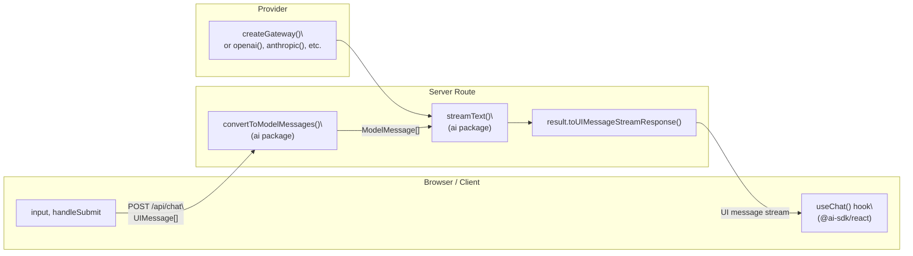
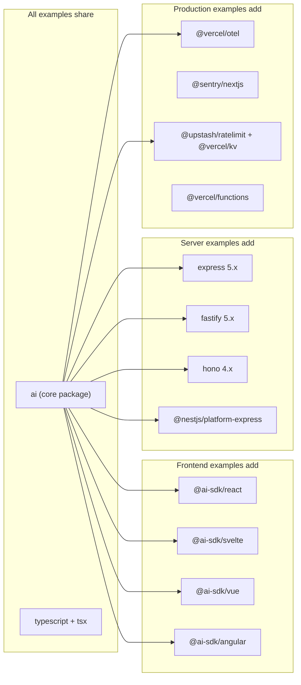

# Examples and Getting Started

Relevant source files

The following files were used as context for generating this wiki page:

- [.changeset/pre.json](.changeset/pre.json)
- [examples/express/package.json](examples/express/package.json)
- [examples/fastify/package.json](examples/fastify/package.json)
- [examples/hono/package.json](examples/hono/package.json)
- [examples/nest/package.json](examples/nest/package.json)
- [examples/next-fastapi/package.json](examples/next-fastapi/package.json)
- [examples/next-google-vertex/package.json](examples/next-google-vertex/package.json)
- [examples/next-langchain/package.json](examples/next-langchain/package.json)
- [examples/next-openai-kasada-bot-protection/package.json](examples/next-openai-kasada-bot-protection/package.json)
- [examples/next-openai-pages/package.json](examples/next-openai-pages/package.json)
- [examples/next-openai-telemetry-sentry/package.json](examples/next-openai-telemetry-sentry/package.json)
- [examples/next-openai-telemetry/package.json](examples/next-openai-telemetry/package.json)
- [examples/next-openai-upstash-rate-limits/package.json](examples/next-openai-upstash-rate-limits/package.json)
- [examples/node-http-server/package.json](examples/node-http-server/package.json)
- [examples/nuxt-openai/package.json](examples/nuxt-openai/package.json)
- [examples/sveltekit-openai/package.json](examples/sveltekit-openai/package.json)
- [packages/amazon-bedrock/CHANGELOG.md](packages/amazon-bedrock/CHANGELOG.md)
- [packages/amazon-bedrock/package.json](packages/amazon-bedrock/package.json)
- [packages/anthropic/CHANGELOG.md](packages/anthropic/CHANGELOG.md)
- [packages/anthropic/package.json](packages/anthropic/package.json)
- [packages/google-vertex/CHANGELOG.md](packages/google-vertex/CHANGELOG.md)
- [packages/google-vertex/package.json](packages/google-vertex/package.json)
- [packages/google/CHANGELOG.md](packages/google/CHANGELOG.md)
- [packages/google/package.json](packages/google/package.json)
- [pnpm-lock.yaml](pnpm-lock.yaml)

This page catalogs the quickstart guides and runnable example applications in the `vercel/ai` repository. It describes what each example demonstrates, which packages it uses, and where to find it in the source tree.

For deep documentation on the core SDK functions used across these examples — such as `streamText`, `generateText`, and `useChat` — see page [2](). For provider-specific setup, see page [3](). For UI integration details, see page [4]().

---

## Structure Overview

The repository splits learning material into two forms:

| Type              | Location                           | Purpose                                             |
| ----------------- | ---------------------------------- | --------------------------------------------------- |
| Quickstart guides | `content/docs/02-getting-started/` | Step-by-step instructions for building a first app  |
| Runnable examples | `examples/`                        | Fully wired applications that can be cloned and run |

Each quickstart document has a corresponding runnable example application. The examples are included in the pnpm workspace and reference workspace-local packages via `workspace:*` or pinned version links.

**Sources:** [pnpm-lock.yaml:65-211](), [content/docs/02-getting-started/02-nextjs-app-router.mdx:1-30]()

---

## Quickstart Guides

Quickstart guides live in `content/docs/02-getting-started/` and teach the minimal viable pattern: create a server route that calls `streamText`, return the stream via `toUIMessageStreamResponse()`, and connect a UI component using a framework hook or class.

All quickstart guides default to the Vercel AI Gateway as the model provider, configured via the `AI_GATEWAY_API_KEY` environment variable. The provider can be replaced with any SDK provider without changing other code.

| File                         | Framework            | UI Package       |
| ---------------------------- | -------------------- | ---------------- |
| `02-nextjs-app-router.mdx`   | Next.js App Router   | `@ai-sdk/react`  |
| `03-nextjs-pages-router.mdx` | Next.js Pages Router | `@ai-sdk/react`  |
| `04-svelte.mdx`              | SvelteKit            | `@ai-sdk/svelte` |
| `05-nuxt.mdx`                | Nuxt (Vue)           | `@ai-sdk/vue`    |
| `06-nodejs.mdx`              | Node.js (CLI)        | none             |
| `07-expo.mdx`                | Expo (React Native)  | `@ai-sdk/react`  |

**Sources:** [content/docs/02-getting-started/02-nextjs-app-router.mdx:1-130](), [content/docs/02-getting-started/04-svelte.mdx:1-80](), [content/docs/02-getting-started/05-nuxt.mdx:1-130](), [content/docs/02-getting-started/06-nodejs.mdx:1-70](), [content/docs/02-getting-started/07-expo.mdx:1-80]()

### Shared Quickstart Pattern

The following diagram maps the natural-language description of a quickstart to the actual code symbols used.

**Diagram: Quickstart Data Flow (Code Symbols)**

**Sources:** [content/docs/02-getting-started/02-nextjs-app-router.mdx:94-116](), [content/docs/02-getting-started/05-nuxt.mdx:96-124]()

---

## Example Applications Index

The `examples/` directory contains self-contained workspace packages. Each has its own `package.json` and can be run independently.

**Diagram: Example Applications Mapped to SDK Packages**

```mermaid
graph TD
    subgraph "Next.js Examples"
        EXN["examples/next"]
        EXNA["examples/next-agent"]
        EXNOP["examples/next-openai-pages"]
        EXNLC["examples/next-langchain"]
        EXNGV["examples/next-google-vertex"]
        EXNFP["examples/next-fastapi"]
    end

    subgraph "Production Feature Examples"
        EXNRL["examples/next-openai-upstash-rate-limits"]
        EXNKB["examples/next-openai-kasada-bot-protection"]
        EXNT["examples/next-openai-telemetry"]
        EXNTS["examples/next-openai-telemetry-sentry"]
    end

    subgraph "Frontend Frameworks"
        EXSV["examples/sveltekit-openai"]
        EXNU["examples/nuxt-openai"]
        EXANG["examples/angular"]
    end

    subgraph "Server Frameworks"
        EXEX["examples/express"]
        EXFT["examples/fastify"]
        EXHO["examples/hono"]
        EXNE["examples/nest"]
        EXNO["examples/node-http-server"]
    end

    subgraph "Specialized"
        EXMCP["examples/mcp"]
        EXAF["examples/ai-functions"]
        EXE2E["examples/ai-e2e-next"]
    end

    EXN --> AiReact["@ai-sdk/react"]
    EXNA --> AiReact
    EXNOP --> AiReact
    EXNLC --> AiLangchain["@ai-sdk/langchain"]
    EXNGV --> AiVertex["@ai-sdk/google-vertex"]
    EXNFP --> AiReact

    EXSV --> AiSvelte["@ai-sdk/svelte"]
    EXNU --> AiVue["@ai-sdk/vue"]
    EXANG --> AiAngular["@ai-sdk/angular"]

    EXEX --> AiCore["ai (core)"]
    EXFT --> AiCore
    EXHO --> AiCore
    EXNE --> AiCore
    EXNO --> AiCore

    EXNRL --> AiCore
    EXNKB --> AiCore
    EXNT --> AiCore
    EXNTS --> AiCore
    EXMCP --> AiMcp["@ai-sdk/mcp"]
    EXAF --> AiCore
```

**Sources:** [pnpm-lock.yaml:682-1130](), [examples/express/package.json:1-22](), [examples/hono/package.json:1-23](), [examples/angular/package.json:1-20]()

---

## Next.js Examples

For detailed documentation, see page [5.1]().

| Example                | Directory                     | Key Packages                                                |
| ---------------------- | ----------------------------- | ----------------------------------------------------------- |
| App Router basic chat  | `examples/next`               | `ai`, `@ai-sdk/react`, `resumable-stream`                   |
| Agent with tools       | `examples/next-agent`         | `ai`, `@ai-sdk/openai`, `@ai-sdk/react`                     |
| Pages Router           | `examples/next-openai-pages`  | `ai`, `@ai-sdk/openai`, `@ai-sdk/react`                     |
| LangChain + LangGraph  | `examples/next-langchain`     | `ai`, `@ai-sdk/langchain`, `@langchain/langgraph`           |
| Google Vertex AI       | `examples/next-google-vertex` | `ai`, `@ai-sdk/google-vertex`                               |
| Python FastAPI backend | `examples/next-fastapi`       | `ai`, `@ai-sdk/react` (frontend) + Python uvicorn (backend) |
| E2E test suite         | `examples/ai-e2e-next`        | Most provider packages, `@ai-sdk/mcp`, `resumable-stream`   |

The `examples/next` application demonstrates resumable streams using the `resumable-stream` package and `redis` for persistence. The `examples/next-agent` application adds OpenAI-specific tools on top of the basic pattern.

The `examples/ai-e2e-next` application is the broadest, pulling in nearly every first-party provider package (`@ai-sdk/openai`, `@ai-sdk/anthropic`, `@ai-sdk/google`, `@ai-sdk/groq`, `@ai-sdk/cohere`, etc.) and is used for integration testing across providers.

**Sources:** [pnpm-lock.yaml:682-802](), [examples/next-langchain/package.json:1-40](), [examples/next-google-vertex/package.json:1-28]()

---

## SvelteKit, Nuxt, and Other Frontend Examples

For detailed documentation, see page [5.2]().

| Example             | Directory                          | Key Packages                                   | Dev Script                             |
| ------------------- | ---------------------------------- | ---------------------------------------------- | -------------------------------------- |
| SvelteKit           | `examples/sveltekit-openai`        | `@ai-sdk/svelte`, `@ai-sdk/openai`, `ai`       | `vite dev`                             |
| Nuxt (Vue)          | `examples/nuxt-openai`             | `@ai-sdk/vue`, `@ai-sdk/openai`, `ai`          | `nuxt dev`                             |
| Angular             | `examples/angular`                 | `@ai-sdk/angular`, `@ai-sdk/openai`, `express` | `concurrently` (Angular CLI + Express) |
| Expo (React Native) | (quickstart only, no full example) | `@ai-sdk/react`, `ai`                          | —                                      |

The Angular example runs an Express server (`express: 5.0.1`) alongside the Angular dev server, managed with `concurrently`. The SvelteKit example uses Vite and the `@sveltejs/adapter-vercel` adapter.

**Sources:** [examples/sveltekit-openai/package.json:1-46](), [examples/nuxt-openai/package.json:1-34](), [examples/angular/package.json:1-20]()

---

## Server Framework Examples

For detailed documentation, see page [5.3]().

All server framework examples follow the same pattern: accept a POST request, pipe the body into `streamText`, and pipe the resulting stream back to the HTTP response. None include a browser-side UI component; they are designed to be called with `curl` or a custom client.

| Example      | Directory                   | Framework                               | Version |
| ------------ | --------------------------- | --------------------------------------- | ------- |
| Express      | `examples/express`          | `express`                               | 5.0.1   |
| Fastify      | `examples/fastify`          | `fastify`                               | 5.1.0   |
| Hono         | `examples/hono`             | `hono` + `@hono/node-server`            | 4.6.9   |
| NestJS       | `examples/nest`             | `@nestjs/platform-express`              | 10.x    |
| Node.js HTTP | `examples/node-http-server` | Node.js built-ins                       | —       |
| MCP server   | `examples/mcp`              | `express` + `@modelcontextprotocol/sdk` | —       |

All server examples use `tsx` for TypeScript execution during development. The `examples/hono` package also includes a `hono-streaming.ts` entry point demonstrating Hono's native streaming helpers alongside the AI SDK.

The `examples/mcp` example demonstrates hosting a Model Context Protocol server alongside an AI-powered Express route, using `@ai-sdk/mcp` (as a devDependency) and `@modelcontextprotocol/sdk`.

**Sources:** [examples/express/package.json:1-22](), [examples/fastify/package.json:1-19](), [examples/hono/package.json:1-23](), [examples/nest/package.json:1-66](), [examples/node-http-server/package.json:1-20](), [pnpm-lock.yaml:557-592]()

---

## Production Feature Examples

For detailed documentation, see page [5.4]().

These examples show how to layer production concerns on top of a working chat API.

| Example         | Directory                                    | Added Concern                 | Key Dependencies                                          |
| --------------- | -------------------------------------------- | ----------------------------- | --------------------------------------------------------- |
| Rate limiting   | `examples/next-openai-upstash-rate-limits`   | Upstash Ratelimit + Vercel KV | `@upstash/ratelimit`, `@vercel/kv`, `sonner`              |
| Bot protection  | `examples/next-openai-kasada-bot-protection` | Kasada bot detection          | `@vercel/functions`, `sonner`                             |
| OpenTelemetry   | `examples/next-openai-telemetry`             | `@vercel/otel` tracing        | `@vercel/otel`, `@opentelemetry/api-logs`                 |
| OTel + Sentry   | `examples/next-openai-telemetry-sentry`      | Sentry error reporting        | `@sentry/nextjs`, `@sentry/opentelemetry`, `@vercel/otel` |
| LangChain       | `examples/next-langchain`                    | LangGraph agent backend       | `@ai-sdk/langchain`, `@langchain/langgraph`               |
| Google Vertex   | `examples/next-google-vertex`                | Vertex AI auth                | `@ai-sdk/google-vertex`                                   |
| FastAPI backend | `examples/next-fastapi`                      | Python AI backend             | Python uvicorn + FastAPI (separate process)               |

**Sources:** [examples/next-openai-upstash-rate-limits/package.json:1-33](), [examples/next-openai-kasada-bot-protection/package.json:1-32](), [examples/next-openai-telemetry/package.json:1-35](), [examples/next-openai-telemetry-sentry/package.json:1-37]()

### Rate Limiting Pattern

The rate limiting example wires Upstash Ratelimit into a Next.js App Router route handler. The pattern from `content/docs/06-advanced/06-rate-limiting.mdx` uses `Ratelimit.fixedWindow(5, '30s')` to allow five requests per 30-second window per IP, and returns HTTP 429 when the limit is exceeded before calling `streamText`.

**Sources:** [content/docs/06-advanced/06-rate-limiting.mdx:1-61](), [examples/next-openai-upstash-rate-limits/package.json:11-19]()

---

## Comprehensive AI Functions Example

The `examples/ai-functions` package is a standalone script-based example that covers nearly every SDK capability and provider. It imports `workspace:*` versions of all first-party packages.

**Selected providers included:** `@ai-sdk/openai`, `@ai-sdk/anthropic`, `@ai-sdk/google`, `@ai-sdk/google-vertex`, `@ai-sdk/groq`, `@ai-sdk/mistral`, `@ai-sdk/cohere`, `@ai-sdk/deepseek`, `@ai-sdk/xai`, `@ai-sdk/fireworks`, `@ai-sdk/togetherai`, `@ai-sdk/cerebras`, `@ai-sdk/deepinfra`, `@ai-sdk/amazon-bedrock`, `@ai-sdk/azure`, `@ai-sdk/gateway`, `@ai-sdk/mcp`, and many community providers.

**Additional packages:** `zod`, `valibot`, `arktype`, `effect`, `@opentelemetry/sdk-node`, `@langfuse/otel`, `mathjs`, `sharp`, `image-type`.

This example is meant for verifying that SDK features work with each provider combination. It uses `tsx` for direct TypeScript execution and `dotenv` for loading provider API keys.

**Sources:** [pnpm-lock.yaml:213-404]()

---

## Dependency Summary by Category

**Sources:** [pnpm-lock.yaml:65-1200](), [examples/express/package.json:1-22](), [examples/next-openai-telemetry/package.json:1-35]()

---

## Sub-pages

| Page    | Content                                                                                          |
| ------- | ------------------------------------------------------------------------------------------------ |
| [5.1]() | Next.js App Router and Pages Router examples in detail                                           |
| [5.2]() | SvelteKit, Nuxt, and Expo examples                                                               |
| [5.3]() | Express, Fastify, Hono, NestJS, and Node.js HTTP server examples                                 |
| [5.4]() | Production examples: rate limiting, bot protection, telemetry, LangChain, Google Vertex, FastAPI |
