# Next.js Examples

<details>
<summary>Relevant source files</summary>

The following files were used as context for generating this wiki page:

- [.changeset/pre.json](.changeset/pre.json)
- [examples/express/package.json](examples/express/package.json)
- [examples/fastify/package.json](examples/fastify/package.json)
- [examples/hono/package.json](examples/hono/package.json)
- [examples/nest/package.json](examples/nest/package.json)
- [examples/next-fastapi/package.json](examples/next-fastapi/package.json)
- [examples/next-google-vertex/package.json](examples/next-google-vertex/package.json)
- [examples/next-langchain/package.json](examples/next-langchain/package.json)
- [examples/next-openai-kasada-bot-protection/package.json](examples/next-openai-kasada-bot-protection/package.json)
- [examples/next-openai-pages/package.json](examples/next-openai-pages/package.json)
- [examples/next-openai-telemetry-sentry/package.json](examples/next-openai-telemetry-sentry/package.json)
- [examples/next-openai-telemetry/package.json](examples/next-openai-telemetry/package.json)
- [examples/next-openai-upstash-rate-limits/package.json](examples/next-openai-upstash-rate-limits/package.json)
- [examples/node-http-server/package.json](examples/node-http-server/package.json)
- [examples/nuxt-openai/package.json](examples/nuxt-openai/package.json)
- [examples/sveltekit-openai/package.json](examples/sveltekit-openai/package.json)
- [packages/amazon-bedrock/CHANGELOG.md](packages/amazon-bedrock/CHANGELOG.md)
- [packages/amazon-bedrock/package.json](packages/amazon-bedrock/package.json)
- [packages/anthropic/CHANGELOG.md](packages/anthropic/CHANGELOG.md)
- [packages/anthropic/package.json](packages/anthropic/package.json)
- [packages/google-vertex/CHANGELOG.md](packages/google-vertex/CHANGELOG.md)
- [packages/google-vertex/package.json](packages/google-vertex/package.json)
- [packages/google/CHANGELOG.md](packages/google/CHANGELOG.md)
- [packages/google/package.json](packages/google/package.json)
- [pnpm-lock.yaml](pnpm-lock.yaml)

</details>

This page catalogs the Next.js example applications in the AI SDK repository, demonstrating integration patterns for chat interfaces, tool calling, file attachments, OpenAI Responses API, provider-specific features, production telemetry, rate limiting, bot protection, and multi-step agent workflows. These examples primarily use the App Router (React Server Components) pattern with Next.js 15+.

For examples using other frontend frameworks (SvelteKit, Nuxt, Angular), see [5.2](#5.2). For backend-only examples (Express, Fastify, Hono, NestJS), see [5.3](#5.3). For detailed coverage of production features like telemetry and rate limiting, see [5.4](#5.4).

---

## Example Repository Structure

The Next.js examples are located in the `examples/` directory and follow a consistent pattern: each example is a standalone Next.js application with its own `package.json`, dependencies, and configuration. All examples use workspace dependencies to the SDK packages (`@ai-sdk/react`, `ai`, provider packages) via the `pnpm` workspace.

```mermaid
graph TB
    subgraph "Next.js Examples Organization"
        BASIC["examples/next<br/>Basic chat implementation"]
        E2E["examples/ai-e2e-next<br/>Comprehensive testing suite"]
        AGENT["examples/next-agent<br/>Multi-step agent patterns"]
        PAGES["examples/next-openai-pages<br/>Pages Router variant"]
        VERTEX["examples/next-google-vertex<br/>Google Vertex AI"]
        LANGCHAIN["examples/next-langchain<br/>LangChain integration"]
        FASTAPI["examples/next-fastapi<br/>Python FastAPI backend"]
        KASADA["examples/next-openai-kasada-bot-protection<br/>Bot protection"]
        TELEMETRY["examples/next-openai-telemetry<br/>OpenTelemetry"]
        SENTRY["examples/next-openai-telemetry-sentry<br/>Sentry integration"]
        RATELIMIT["examples/next-openai-upstash-rate-limits<br/>Rate limiting"]
    end

    subgraph "Common Dependencies"
        REACT["@ai-sdk/react@4.0.0-beta.7<br/>useChat/useObject hooks"]
        AI["ai@7.0.0-beta.7<br/>Core SDK"]
        PROVIDERS["Provider packages<br/>@ai-sdk/openai, etc"]
    end

    BASIC --> REACT
    BASIC --> AI
    E2E --> REACT
    E2E --> PROVIDERS
    AGENT --> REACT
    PAGES --> REACT
    VERTEX --> AI
    LANGCHAIN --> REACT
    TELEMETRY --> REACT
    SENTRY --> REACT
    RATELIMIT --> REACT
```

**Sources:** [pnpm-lock.yaml:65-211](), [examples/next/package.json:1-41](), [examples/ai-e2e-next/package.json:1-211]()

---

## Basic Next.js Example (examples/next)

The `examples/next` directory provides the fundamental chat implementation pattern used across most examples. It demonstrates the standard App Router architecture with API routes for streaming and client-side React components using the `useChat` hook.

### Architecture Pattern

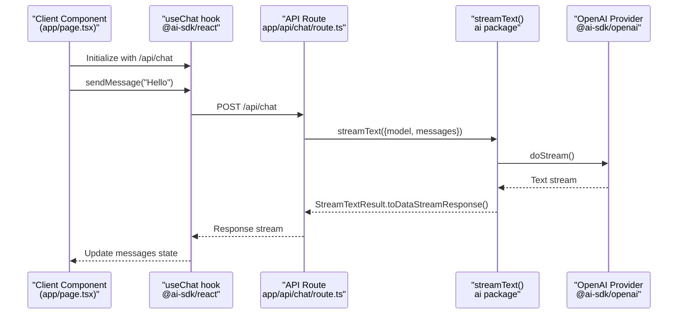

### File Structure

| File Path               | Purpose                                              |
| ----------------------- | ---------------------------------------------------- |
| `app/api/chat/route.ts` | API route handler using `streamText()`               |
| `app/page.tsx`          | Client component using `useChat()` hook              |
| `package.json`          | Dependencies: `@ai-sdk/react`, `ai`, `next`, `react` |

**Sources:** [examples/next/package.json:1-41]()

---

## App Router vs Pages Router

Most examples use the **App Router** (Next.js 13+), but `examples/next-openai-pages` demonstrates the **Pages Router** pattern for legacy compatibility.

### App Router Pattern

```typescript
// app/api/chat/route.ts
import { streamText } from 'ai'
import { openai } from '@ai-sdk/openai'

export async function POST(req: Request) {
  const { messages } = await req.json()
  const result = await streamText({
    model: openai('gpt-4'),
    messages,
  })
  return result.toDataStreamResponse()
}
```

### Pages Router Pattern

```typescript
// pages/api/chat.ts
import { streamText } from 'ai'
import { openai } from '@ai-sdk/openai'

export default async function handler(req, res) {
  const { messages } = req.body
  const result = await streamText({
    model: openai('gpt-4'),
    messages,
  })
  result.pipeDataStreamToResponse(res)
}
```

**Sources:** [examples/next-openai-pages/package.json:1-31]()

---

## Comprehensive Testing Example (examples/ai-e2e-next)

The `examples/ai-e2e-next` example serves as the **primary testing ground** for SDK features, integrating multiple providers and demonstrating advanced capabilities.

### Provider Coverage

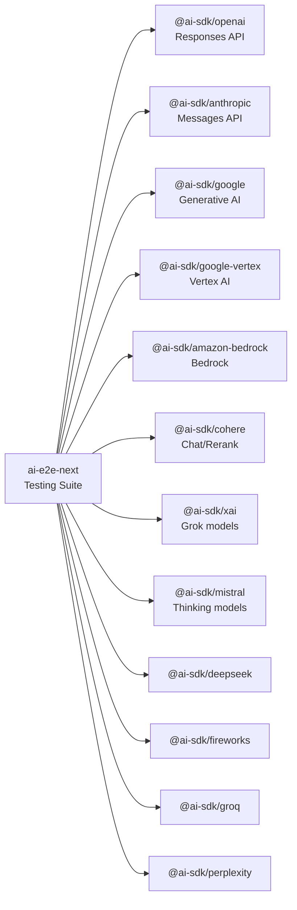

### Key Features Demonstrated

| Feature                    | Implementation                                         |
| -------------------------- | ------------------------------------------------------ |
| **Provider-defined tools** | OpenAI `web_search`, `file_search`, `code_interpreter` |
| **File attachments**       | `@vercel/blob` integration for image/document uploads  |
| **MCP integration**        | `@ai-sdk/mcp` package for Model Context Protocol       |
| **Structured outputs**     | `@ai-sdk/valibot` for schema validation                |
| **UI components**          | Radix UI, Tailwind CSS, Lucide icons                   |

**Dependencies:**

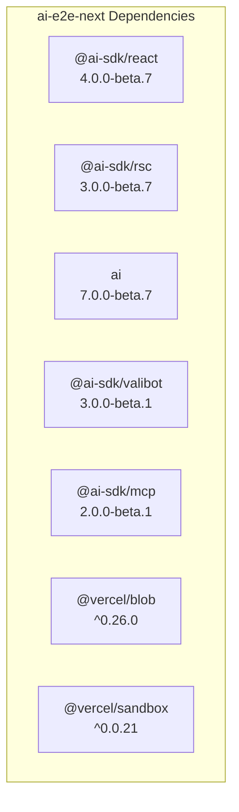

**Sources:** [pnpm-lock.yaml:65-211](), [examples/ai-e2e-next/package.json:1-211]()

---

## Agent Patterns (examples/next-agent)

The `examples/next-agent` directory demonstrates **multi-step agentic workflows** with tool calling, tool result handling, and iterative refinement.

### Agent Request Flow

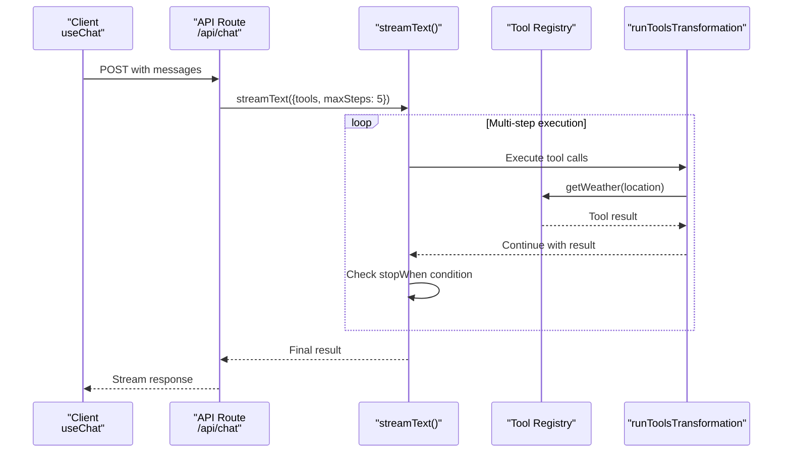

### Tool Configuration Example

The agent pattern uses `maxSteps` to control multi-turn tool execution and `stopWhen` conditions to determine when to halt:

```typescript
// Conceptual structure from examples/next-agent
const result = await streamText({
  model: openai('gpt-4'),
  messages,
  tools: {
    getWeather: tool({
      description: 'Get the weather for a location',
      parameters: z.object({ location: z.string() }),
      execute: async ({ location }) => fetchWeather(location),
    }),
  },
  maxSteps: 5, // Allow up to 5 tool calls
})
```

**Sources:** [examples/next-agent/package.json:1-31]()

---

## Provider-Specific Examples

### Google Vertex AI (examples/next-google-vertex)

The `examples/next-google-vertex` example demonstrates integration with Google Cloud's **Vertex AI** platform, including authentication with service accounts and enterprise features.

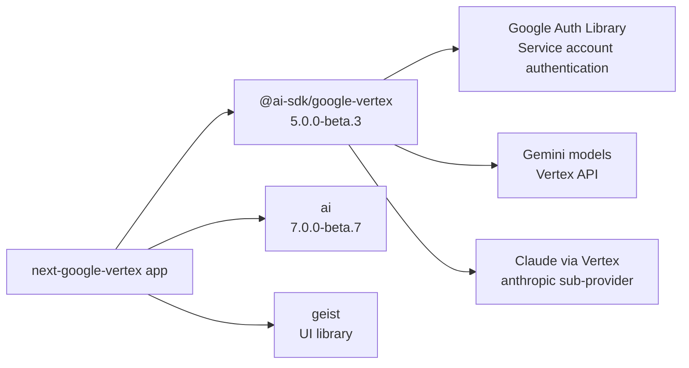

**Key Features:**

- Service account authentication via `google-auth-library`
- Access to Gemini models through Vertex AI
- Support for Claude models via `@ai-sdk/google-vertex/anthropic`
- Enterprise features: `trafficType`, `enterpriseWebSearch`, `vertexRagStore`

**Sources:** [examples/next-google-vertex/package.json:1-28](), [packages/google-vertex/package.json:1-99]()

### LangChain Integration (examples/next-langchain)

The `examples/next-langchain` example shows how to use **LangGraph** workflows with the AI SDK through the `@ai-sdk/langchain` adapter.

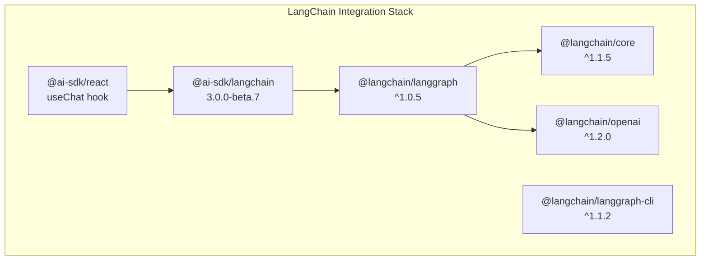

**Key Components:**

- `toUIMessageStream()`: Converts LangGraph output to AI SDK message format
- `parseLangGraphEvent()`: Parses LangGraph streaming events
- LangGraph server: Run via `@langchain/langgraph-cli dev`

**Sources:** [examples/next-langchain/package.json:1-40]()

---

## Production Features Integration

### Telemetry and Observability

Two examples demonstrate observability patterns:

#### OpenTelemetry (examples/next-openai-telemetry)

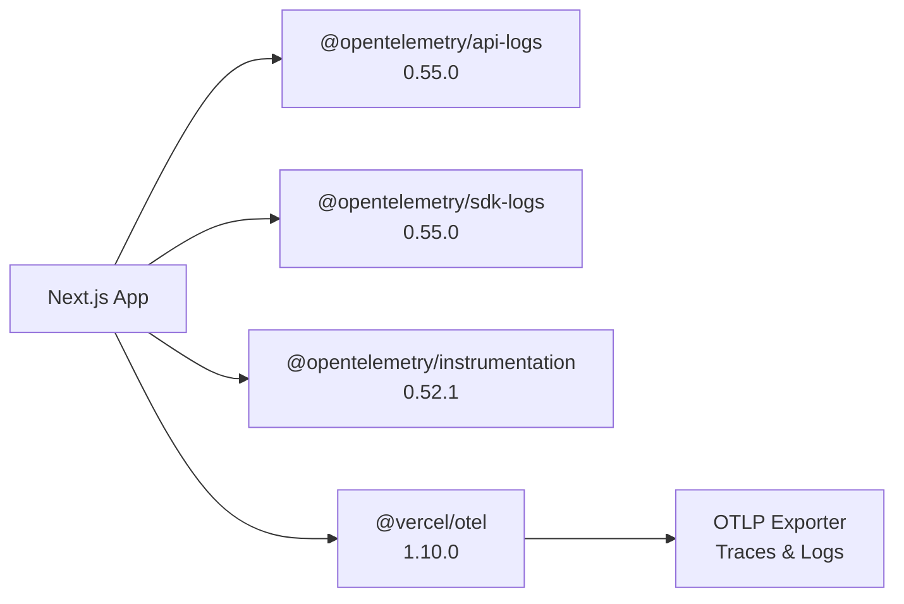

**Configuration:**

- Uses `@vercel/otel` for automatic Next.js instrumentation
- Exports traces and logs to OTLP-compatible backends
- Captures AI SDK telemetry through `experimental_telemetry` option

**Sources:** [examples/next-openai-telemetry/package.json:1-35]()

#### Sentry Integration (examples/next-openai-telemetry-sentry)

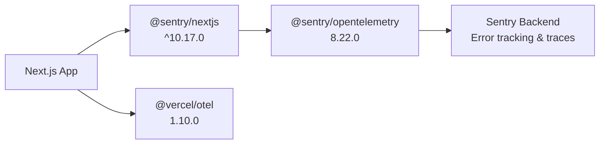

**Key Features:**

- Error tracking for AI generation failures
- Distributed tracing for request flows
- Performance monitoring for streaming responses

**Sources:** [examples/next-openai-telemetry-sentry/package.json:1-37]()

### Rate Limiting (examples/next-openai-upstash-rate-limits)

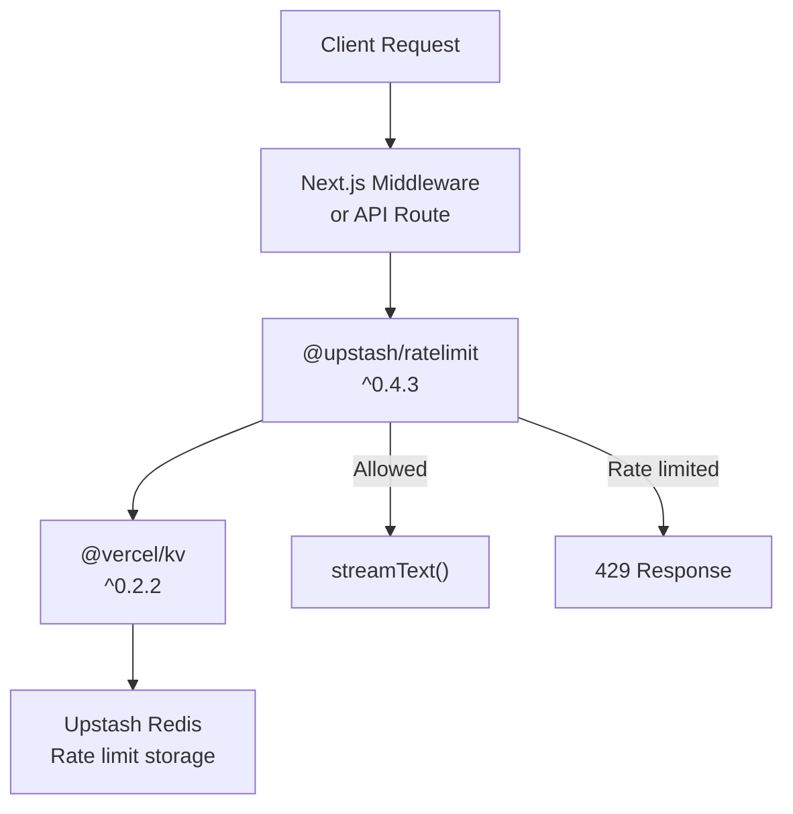

**Implementation Pattern:**

- `@upstash/ratelimit`: Sliding window or token bucket algorithms
- `@vercel/kv`: Serverless Redis storage via Vercel KV
- Integration point: Check rate limit before `streamText()` call

**Sources:** [examples/next-openai-upstash-rate-limits/package.json:1-33]()

### Bot Protection (examples/next-openai-kasada-bot-protection)

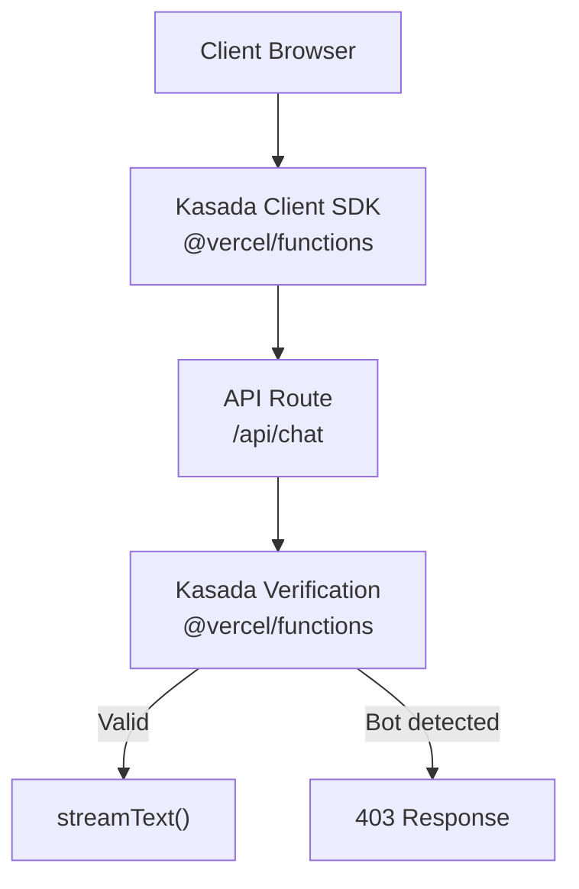

**Key Components:**

- `@vercel/functions`: Provides `getKasadaContext()` for bot detection
- Client-side Kasada SDK challenge
- Server-side verification before AI generation

**Sources:** [examples/next-openai-kasada-bot-protection/package.json:1-32]()

---

## FastAPI Integration (examples/next-fastapi)

The `examples/next-fastapi` example demonstrates a **hybrid architecture** where the AI logic runs in a Python FastAPI backend while the UI uses Next.js with `@ai-sdk/react`.

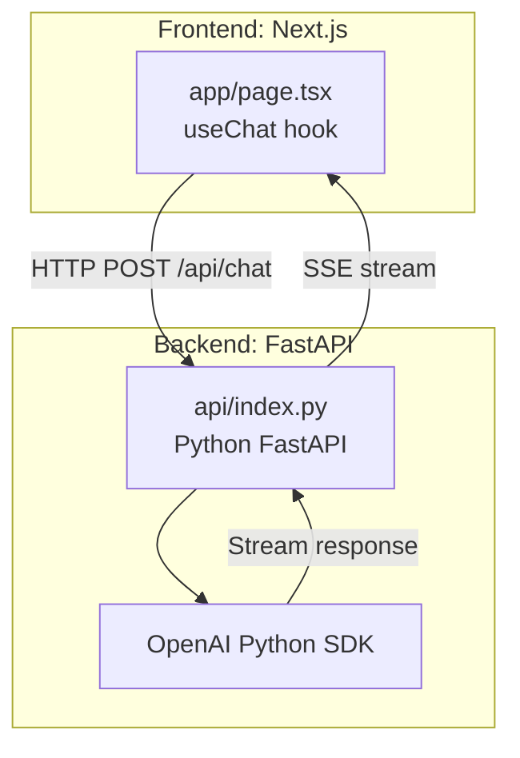

**Development Setup:**

- Frontend: `npm run next-dev` (Next.js dev server)
- Backend: `npm run fastapi-dev` (uvicorn with hot reload)
- Concurrent execution: `npm run dev` (both servers via `concurrently`)

**Key Dependencies:**

| Package                   | Purpose                      |
| ------------------------- | ---------------------------- |
| `@ai-sdk/react`           | Frontend `useChat()` hook    |
| `ai`                      | Message format compatibility |
| `concurrently`            | Run both dev servers         |
| Python `requirements.txt` | FastAPI, OpenAI SDK, uvicorn |

**Sources:** [examples/next-fastapi/package.json:1-33]()

---

## Pages Router Example (examples/next-openai-pages)

The `examples/next-openai-pages` provides a reference implementation for projects still using the **Next.js Pages Router** (pre-Next.js 13).

### Key Differences from App Router

| Aspect             | App Router                      | Pages Router                           |
| ------------------ | ------------------------------- | -------------------------------------- |
| API Route Location | `app/api/chat/route.ts`         | `pages/api/chat.ts`                    |
| Export Pattern     | `export async function POST()`  | `export default function handler()`    |
| Response Streaming | `result.toDataStreamResponse()` | `result.pipeDataStreamToResponse(res)` |
| Client Component   | `app/page.tsx`                  | `pages/index.tsx`                      |

**Sources:** [examples/next-openai-pages/package.json:1-31]()

---

## Common Patterns Across Examples

### Dependency Structure

All Next.js examples follow a consistent dependency pattern:

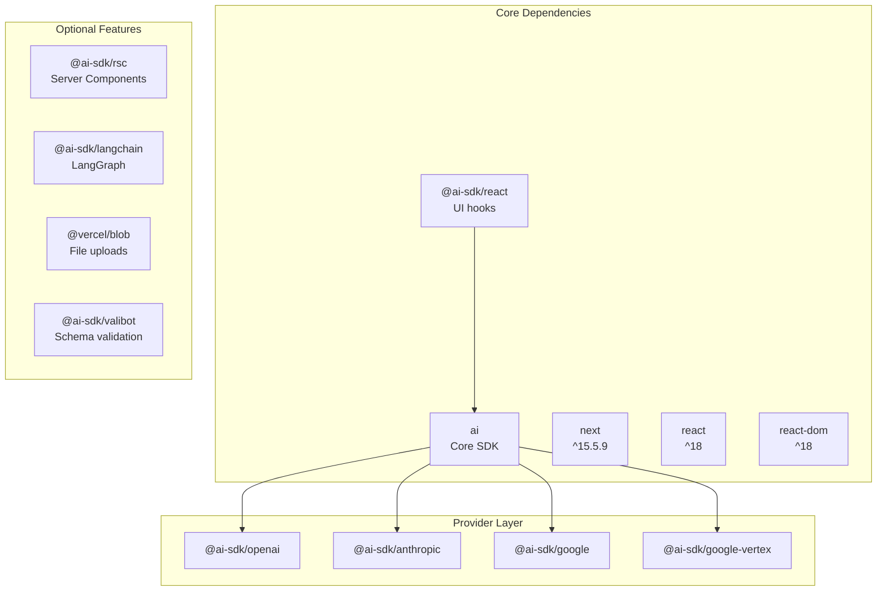

### Development Scripts

Standard scripts across all Next.js examples:

| Script  | Purpose                  | Implementation         |
| ------- | ------------------------ | ---------------------- |
| `dev`   | Start development server | `next dev` (port 3000) |
| `build` | Production build         | `next build`           |
| `start` | Run production server    | `next start`           |
| `lint`  | ESLint validation        | `next lint`            |

**Sources:** [examples/next/package.json:1-41](), [examples/next-agent/package.json:1-31]()

---

## Example Selection Guide

| Use Case                     | Recommended Example                          | Key Features                               |
| ---------------------------- | -------------------------------------------- | ------------------------------------------ |
| **Basic chat UI**            | `examples/next`                              | Simple `useChat()` integration             |
| **Multi-step agents**        | `examples/next-agent`                        | Tool calling with `maxSteps`               |
| **Google Vertex AI**         | `examples/next-google-vertex`                | Vertex authentication, enterprise features |
| **LangGraph workflows**      | `examples/next-langchain`                    | LangGraph server integration               |
| **Pages Router**             | `examples/next-openai-pages`                 | Legacy Next.js support                     |
| **Python backend**           | `examples/next-fastapi`                      | FastAPI + Next.js hybrid                   |
| **Production observability** | `examples/next-openai-telemetry`             | OpenTelemetry tracing                      |
| **Error tracking**           | `examples/next-openai-telemetry-sentry`      | Sentry integration                         |
| **Rate limiting**            | `examples/next-openai-upstash-rate-limits`   | Upstash Redis rate limiting                |
| **Bot protection**           | `examples/next-openai-kasada-bot-protection` | Kasada anti-bot verification               |
| **Comprehensive testing**    | `examples/ai-e2e-next`                       | All providers, tools, features             |

**Sources:** [pnpm-lock.yaml:65-211](), [.changeset/pre.json:1-100]()
