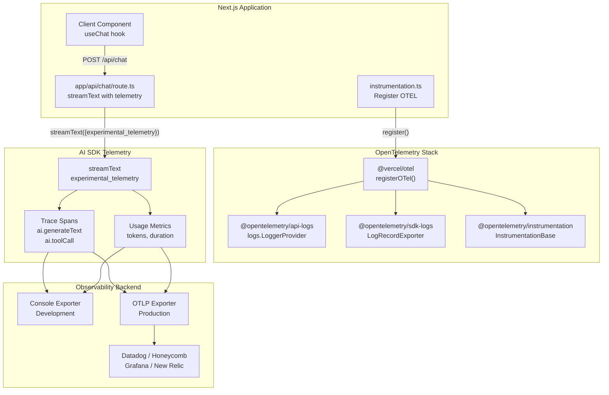
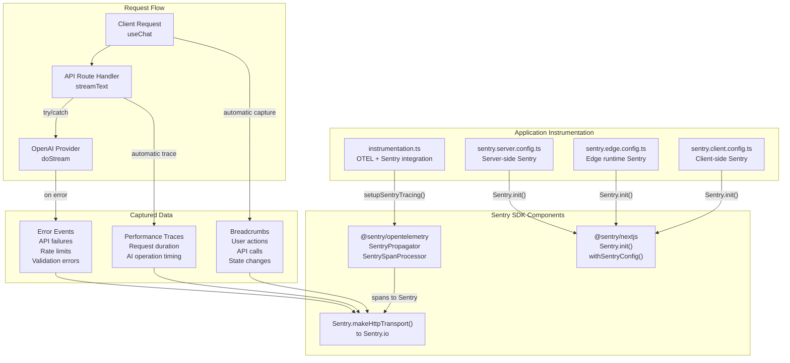
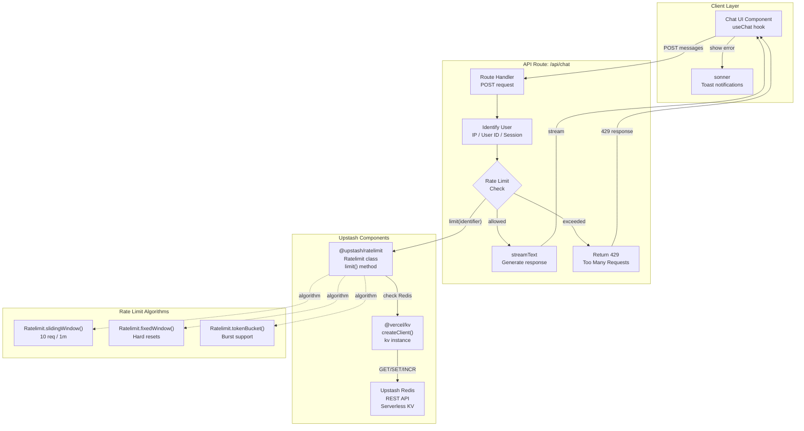
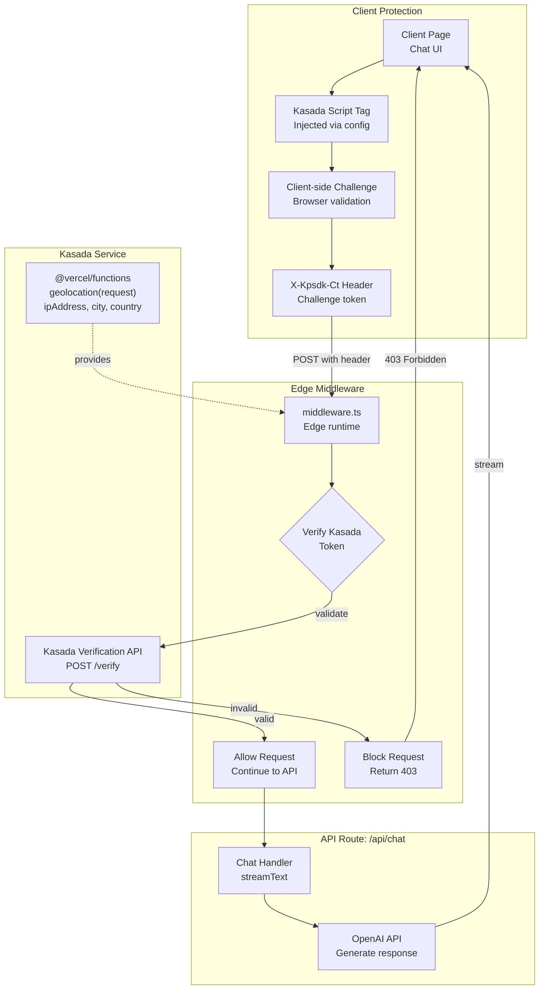
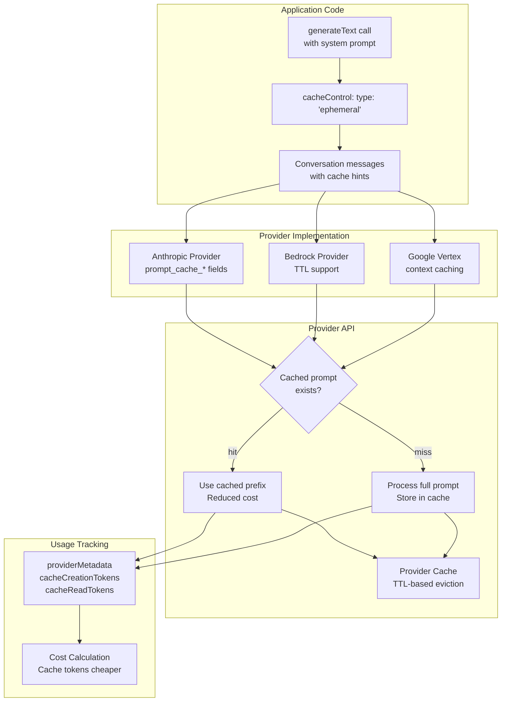
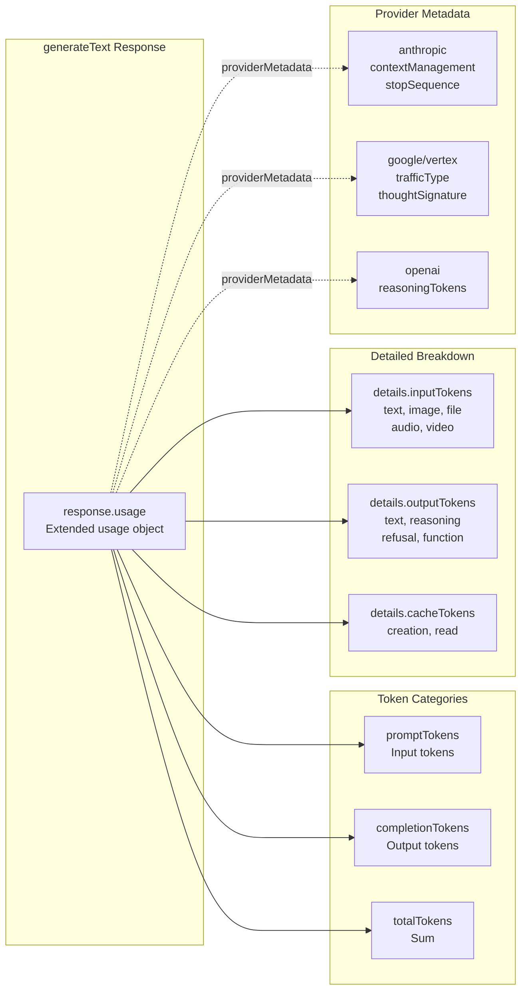

# Production Features Examples

<details>
<summary>Relevant source files</summary>

The following files were used as context for generating this wiki page:

- [.changeset/pre.json](.changeset/pre.json)
- [examples/express/package.json](examples/express/package.json)
- [examples/fastify/package.json](examples/fastify/package.json)
- [examples/hono/package.json](examples/hono/package.json)
- [examples/nest/package.json](examples/nest/package.json)
- [examples/next-fastapi/package.json](examples/next-fastapi/package.json)
- [examples/next-google-vertex/package.json](examples/next-google-vertex/package.json)
- [examples/next-langchain/package.json](examples/next-langchain/package.json)
- [examples/next-openai-kasada-bot-protection/package.json](examples/next-openai-kasada-bot-protection/package.json)
- [examples/next-openai-pages/package.json](examples/next-openai-pages/package.json)
- [examples/next-openai-telemetry-sentry/package.json](examples/next-openai-telemetry-sentry/package.json)
- [examples/next-openai-telemetry/package.json](examples/next-openai-telemetry/package.json)
- [examples/next-openai-upstash-rate-limits/package.json](examples/next-openai-upstash-rate-limits/package.json)
- [examples/node-http-server/package.json](examples/node-http-server/package.json)
- [examples/nuxt-openai/package.json](examples/nuxt-openai/package.json)
- [examples/sveltekit-openai/package.json](examples/sveltekit-openai/package.json)
- [packages/amazon-bedrock/CHANGELOG.md](packages/amazon-bedrock/CHANGELOG.md)
- [packages/amazon-bedrock/package.json](packages/amazon-bedrock/package.json)
- [packages/anthropic/CHANGELOG.md](packages/anthropic/CHANGELOG.md)
- [packages/anthropic/package.json](packages/anthropic/package.json)
- [packages/google-vertex/CHANGELOG.md](packages/google-vertex/CHANGELOG.md)
- [packages/google-vertex/package.json](packages/google-vertex/package.json)
- [packages/google/CHANGELOG.md](packages/google/CHANGELOG.md)
- [packages/google/package.json](packages/google/package.json)
- [pnpm-lock.yaml](pnpm-lock.yaml)

</details>


This page documents example applications that demonstrate production-ready features for AI-powered applications, including observability, rate limiting, bot protection, LangChain integration, FastAPI Python backends, and Google Vertex AI usage. These examples show how to integrate monitoring, cost control, security, and third-party frameworks with the AI SDK's core functionality.

For basic integration examples with different frameworks, see page 5.1 (Next.js Examples), page 5.2 (SvelteKit, Nuxt, and Other Frontend Examples), and page 5.3 (Server Framework Examples).

---

## Overview

The AI SDK repository includes several production-focused example applications that demonstrate how to implement critical features for deployed AI systems:

| Example Directory | Primary Feature | Key Dependencies |
|------------------|----------------|------------------|
| `examples/next-openai-telemetry/` | OpenTelemetry integration | `@vercel/otel`, `@opentelemetry/api-logs`, `@opentelemetry/sdk-logs` |
| `examples/next-openai-telemetry-sentry/` | Error monitoring with Sentry | `@sentry/nextjs`, `@sentry/opentelemetry` |
| `examples/next-openai-upstash-rate-limits/` | Rate limiting | `@upstash/ratelimit`, `@vercel/kv` |
| `examples/next-openai-kasada-bot-protection/` | Bot protection | `@vercel/functions` |
| `examples/next-langchain/` | LangChain + LangGraph integration | `@ai-sdk/langchain`, `@langchain/core`, `@langchain/langgraph` |
| `examples/next-fastapi/` | Python FastAPI backend | `@ai-sdk/react`, `ai`, FastAPI (Python) |
| `examples/next-google-vertex/` | Google Vertex AI provider | `@ai-sdk/google-vertex`, `ai` |

The telemetry, rate limiting, and bot protection examples use Next.js 15 App Router with `@ai-sdk/openai`, `@ai-sdk/react`, and the core `ai` package. The LangChain, FastAPI, and Google Vertex examples each substitute or extend the provider layer.

**Sources:** [examples/next-openai-telemetry/package.json:1-35](), [examples/next-openai-telemetry-sentry/package.json:1-37](), [examples/next-openai-upstash-rate-limits/package.json:1-33](), [examples/next-openai-kasada-bot-protection/package.json:1-32](), [examples/next-langchain/package.json:1-40](), [examples/next-fastapi/package.json:1-33](), [examples/next-google-vertex/package.json:1-28]()

---

## Observability with OpenTelemetry

### Basic OpenTelemetry Integration

The `next-openai-telemetry` example demonstrates how to instrument AI SDK operations with OpenTelemetry for distributed tracing and observability. This enables monitoring of token usage, request latency, error rates, and other key metrics across AI model interactions.



**Key Integration Points:**

1. **Instrumentation Registration**: The `instrumentation.ts` file at the root of the Next.js application registers OpenTelemetry before any other code runs using Next.js's instrumentation hook.

2. **Telemetry Configuration**: The AI SDK's `experimental_telemetry` option in `streamText()` or `generateText()` automatically creates spans and logs for AI operations, including:
   - Request/response timing
   - Token usage (prompt, completion, total)
   - Tool execution traces
   - Error conditions

3. **Exporter Configuration**: The example uses `@vercel/otel` which provides batteries-included OpenTelemetry setup with automatic detection of deployment environment (development console vs. production OTLP endpoints).

**Configuration Pattern:**

The telemetry integration requires configuring a tracer in the API route that handles AI operations. The `experimental_telemetry` option accepts `isEnabled` and `functionId` parameters to control span creation and identification.

**Sources:** [examples/next-openai-telemetry/package.json:1-35]()

---

### Sentry Integration for Error Monitoring

The `next-openai-telemetry-sentry` example extends the basic OpenTelemetry setup with Sentry for production-grade error tracking, performance monitoring, and alerting. This integration captures AI-specific errors (rate limits, API failures, invalid responses) alongside application errors.



**Sentry-Specific Features:**

1. **Distributed Tracing**: The `@sentry/opentelemetry` package provides `SentryPropagator` and `SentrySpanProcessor` that bridge OpenTelemetry spans to Sentry's performance monitoring, creating a unified view of AI operations within broader application traces.

2. **Multi-Environment Instrumentation**: The example configures Sentry separately for server, edge runtime, and client environments with appropriate DSN configuration and sampling rates.

3. **Error Context**: Sentry automatically captures context around AI errors including:
   - Model parameters (temperature, maxTokens)
   - Prompt content (with PII scrubbing options)
   - Token usage at time of failure
   - User session data

4. **Alerting**: Production deployments can configure Sentry alerts for specific AI-related error patterns like repeated API rate limits or unusually high token consumption.

**Sources:** [examples/next-openai-telemetry-sentry/package.json:1-37]()

---

## Rate Limiting with Upstash

The `next-openai-upstash-rate-limits` example demonstrates how to implement request rate limiting to prevent abuse and control costs. This pattern is essential for production applications that expose AI functionality to users.



**Implementation Pattern:**

1. **Rate Limiter Initialization**: Create a `Ratelimit` instance from `@upstash/ratelimit` with a chosen algorithm (sliding window, fixed window, or token bucket) and limit configuration.

2. **Identifier Selection**: Choose an identifier strategy based on authentication state:
   - Authenticated users: Use user ID for per-user limits
   - Anonymous users: Use IP address (via `request.headers.get('x-forwarded-for')`)
   - Session-based: Use session token for granular control

3. **Rate Check Logic**: Before invoking `streamText()` or `generateText()`, call `ratelimit.limit(identifier)` which returns:
   - `success`: Boolean indicating if request is allowed
   - `limit`: Maximum requests allowed
   - `remaining`: Requests remaining in window
   - `reset`: Timestamp when limit resets

4. **Error Handling**: When rate limit is exceeded, return HTTP 429 with `Retry-After` header. The client uses the `sonner` package to display toast notifications for user-friendly error messages.

**Cost Control**: Rate limiting is critical for managing OpenAI API costs in production. A compromised API key or bot traffic without rate limiting can result in unexpected charges. The sliding window algorithm provides smooth rate limiting without request spikes at window boundaries. The example uses `@vercel/kv` as the Redis client for Upstash, providing serverless-compatible key-value storage.

**Sources:** [examples/next-openai-upstash-rate-limits/package.json:1-33]()

---

## Bot Protection with Kasada

The `next-openai-kasada-bot-protection` example demonstrates integration with Kasada's bot protection service to prevent automated abuse of AI endpoints. This is particularly important for applications with public access where bot traffic can quickly exhaust quotas.



**Integration Components:**

1. **Client-Side Challenge**: Kasada's JavaScript SDK is loaded in the client application, which executes browser-based challenges to generate a cryptographic token (`X-Kpsdk-Ct` header) proving the request originates from a legitimate browser.

2. **Edge Middleware Verification**: Next.js middleware running on Vercel Edge Runtime intercepts requests to protected API routes, extracts the Kasada token, and validates it against Kasada's verification API before allowing the request to proceed.

3. **Protected Routes**: The middleware configuration specifies which routes require bot protection (typically `/api/chat` and other AI endpoints). Non-protected routes bypass verification.

4. **Geolocation Context**: The `@vercel/functions` package provides `geolocation(request)` helper to access user location data, which can be used for:
   - Geographic rate limiting
   - Region-based access control
   - Enhanced bot detection signals

**Security Benefits:**

- **Automated Bot Blocking**: Prevents scripted attacks that attempt to exhaust AI quotas
- **Credential Stuffing Protection**: Blocks automated login attempts
- **Scraping Prevention**: Protects AI-generated content from bulk extraction
- **DDoS Mitigation**: Filters volumetric attacks before they reach application logic

**Sources:** [examples/next-openai-kasada-bot-protection/package.json:1-32]()

---

## Prompt Caching

While not demonstrated in a dedicated example application, prompt caching is a production feature available across multiple providers (Anthropic, Google Vertex, Amazon Bedrock) that significantly reduces costs and latency for repeated prompts.



**Cache Control Implementation:**

Prompt caching is configured via the `cacheControl` property on message content parts:

```typescript
// Mark system prompt for caching (Anthropic)
const result = await generateText({
  model: anthropic('claude-3-5-sonnet-20241022'),
  messages: [
    {
      role: 'system',
      content: [
        {
          type: 'text',
          text: 'Large system prompt...',
          cacheControl: { type: 'ephemeral' }
        }
      ]
    }
  ]
});
```

**Provider-Specific Features:**

| Provider | Cache Feature | Token Field | Notes |
|----------|--------------|-------------|-------|
| Anthropic | `prompt_caching` | `cache_creation_input_tokens`, `cache_read_input_tokens` | Ephemeral caching, 5-minute TTL |
| Amazon Bedrock | TTL-based cache | Extended usage fields | Configurable cache duration |
| Google Vertex | Context caching | `cachedContentTokenCount` | Persistent across sessions |

**Cost Optimization:**

- Cache creation tokens: Billed at standard rate
- Cache read tokens: Billed at ~90% discount (provider-dependent)
- Typical use case: Large system prompts or RAG contexts that remain constant across requests

**Usage Tracking:**

The `response.usage` object includes cache-specific token counts:

```typescript
response.usage = {
  promptTokens: 100,
  completionTokens: 50,
  totalTokens: 150,
  details: {
    cacheCreationInputTokens: 1000,  // First request
    cacheReadInputTokens: 1000,       // Subsequent requests
  }
}
```

**Sources:** [packages/anthropic/CHANGELOG.md:1-600](), [packages/amazon-bedrock/CHANGELOG.md:94-96](), [packages/google-vertex/CHANGELOG.md:1-200]()

---

## Extended Token Usage Tracking

All providers support extended token usage tracking in the AI SDK, which provides granular visibility into token consumption patterns across different parts of the generation process. This feature is essential for cost monitoring and optimization.



**Usage Object Structure:**

The AI SDK normalizes token usage across providers into a consistent structure:

```typescript
interface Usage {
  promptTokens: number;        // Total input tokens
  completionTokens: number;    // Total output tokens
  totalTokens: number;         // Sum of prompt + completion
  
  details?: {
    // Input token breakdown
    inputTokens?: {
      text?: number;
      image?: number;
      file?: number;
      audio?: number;
      video?: number;
    };
    
    // Output token breakdown
    outputTokens?: {
      text?: number;
      reasoning?: number;       // o1/o3 reasoning tokens
      refusal?: number;          // Refusal to answer
      function?: number;         // Function call tokens
    };
    
    // Cache-specific tokens
    cacheCreationInputTokens?: number;
    cacheReadInputTokens?: number;
  };
  
  raw?: any;  // Provider-specific raw usage data
}
```

**Cost Calculation Pattern:**

Applications can implement cost tracking by multiplying token counts by provider-specific rates:

```typescript
// Example cost calculation
function calculateCost(usage: Usage, provider: string, model: string): number {
  const rates = getRatesForModel(provider, model);
  
  let cost = 0;
  cost += usage.promptTokens * rates.input;
  cost += usage.completionTokens * rates.output;
  
  // Apply cache discounts
  if (usage.details?.cacheReadInputTokens) {
    const cacheSavings = usage.details.cacheReadInputTokens * rates.input * 0.9;
    cost -= cacheSavings;
  }
  
  return cost;
}
```

**Multi-Step Aggregation:**

When using multi-step tool execution, the final `response.usage` aggregates tokens across all steps:

```typescript
const result = await generateText({
  model: openai('gpt-4'),
  tools: { /* ... */ },
  maxSteps: 5,
});

// Total usage includes all steps
console.log(result.usage.totalTokens);  // Sum across 5 steps
console.log(result.steps.length);       // 5
console.log(result.steps[0].usage);     // Individual step usage
```

**Sources:** [packages/anthropic/CHANGELOG.md:386-388](), [packages/google/CHANGELOG.md:240-242](), [packages/amazon-bedrock/CHANGELOG.md:681-686]()

---

## Provider Metadata

Each provider exposes additional metadata beyond standard token usage, accessible via `response.providerMetadata`. This metadata provides provider-specific insights useful for debugging, optimization, and compliance.

**Provider Metadata by Provider:**

| Provider | Metadata Fields | Purpose |
|----------|----------------|---------|
| **Anthropic** | `stopSequence` | Which stop sequence triggered completion |
| | `contextManagement` | Context window management stats |
| | `container` | Container ID for request correlation |
| **Google/Vertex** | `thoughtSignature` | Gemini 3 thinking mode signature |
| | `trafficType` | Traffic classification (online/batch) |
| | `groundingMetadata` | Search grounding sources |
| **OpenAI** | `reasoningTokens` | o1/o3 internal reasoning tokens |
| | `systemFingerprint` | Model version fingerprint |
| **Amazon Bedrock** | `stopSequence` | Stop sequence that halted generation |
| | `additionalModelResponseFields` | Custom response fields |

**Example Usage:**

```typescript
const result = await generateText({
  model: anthropic('claude-3-5-sonnet-20241022'),
  prompt: 'Explain quantum computing',
  maxTokens: 500,
});

// Access Anthropic-specific metadata
const metadata = result.providerMetadata?.anthropic;
console.log('Stop sequence:', metadata?.stopSequence);
console.log('Context management:', metadata?.contextManagement);
```

**Debugging Use Cases:**

- **Stop Sequence Analysis**: Understanding why generation stopped (maxTokens vs. natural completion vs. stop sequence)
- **Context Management**: Monitoring how providers manage large contexts (Anthropic's context management field)
- **Thinking Traces**: Accessing Gemini 3's internal reasoning paths via `thoughtSignature`
- **Version Tracking**: Using `systemFingerprint` to detect model updates

**Sources:** [packages/anthropic/CHANGELOG.md:368-374](), [packages/google/CHANGELOG.md:255-260](), [packages/amazon-bedrock/CHANGELOG.md:426-432]()

---

## Summary

Production deployment of AI-powered applications requires careful attention to observability, cost control, security, and performance optimization. The AI SDK's production features support these requirements through:

1. **Observability**: OpenTelemetry integration provides distributed tracing and metrics for AI operations, with first-class support for Sentry error monitoring.

2. **Cost Control**: Rate limiting with Upstash prevents abuse and manages API costs, while prompt caching reduces token consumption for repeated prompts.

3. **Security**: Bot protection via Kasada blocks automated abuse, and geolocation-based access control provides additional security layers.

4. **Optimization**: Extended token usage tracking and provider metadata enable fine-grained cost analysis and performance tuning.

These patterns are demonstrated in dedicated example applications that can be adapted for production use across different providers and deployment platforms.

**Sources:** [examples/next-openai-telemetry/package.json:1-35](), [examples/next-openai-telemetry-sentry/package.json:1-37](), [examples/next-openai-upstash-rate-limits/package.json:1-33](), [examples/next-openai-kasada-bot-protection/package.json:1-32](), [packages/anthropic/CHANGELOG.md:1-100](), [packages/google-vertex/CHANGELOG.md:1-100](), [packages/amazon-bedrock/CHANGELOG.md:1-100]()