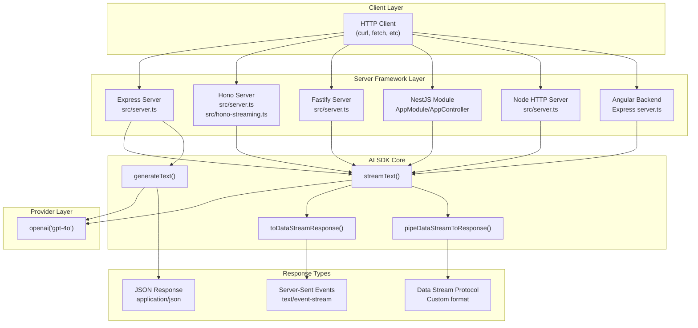
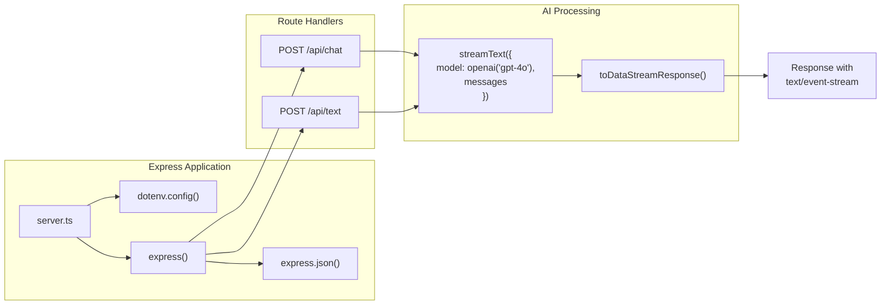
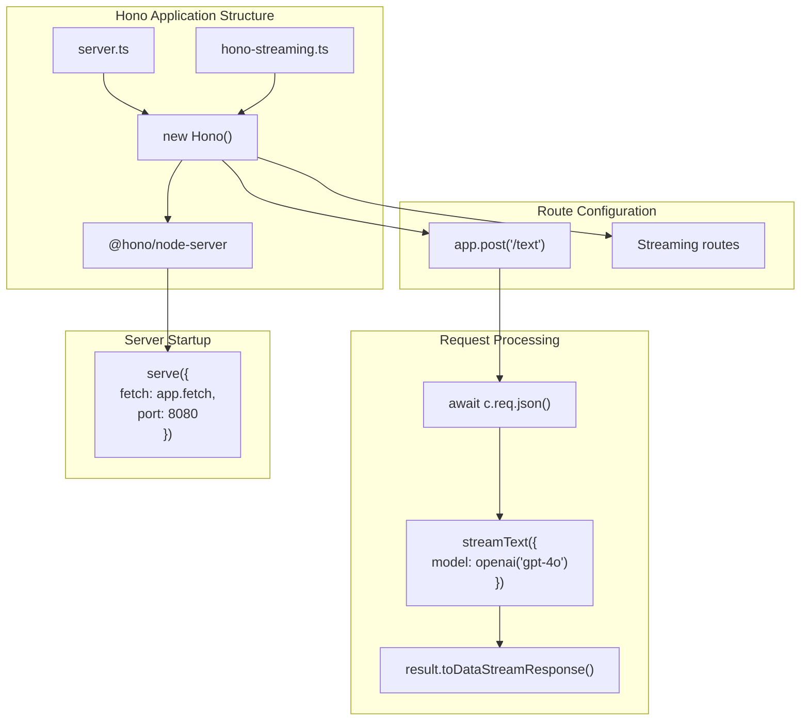
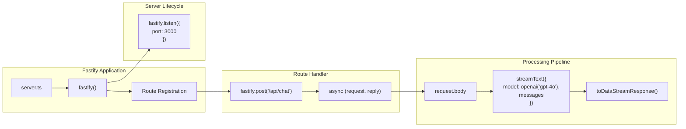
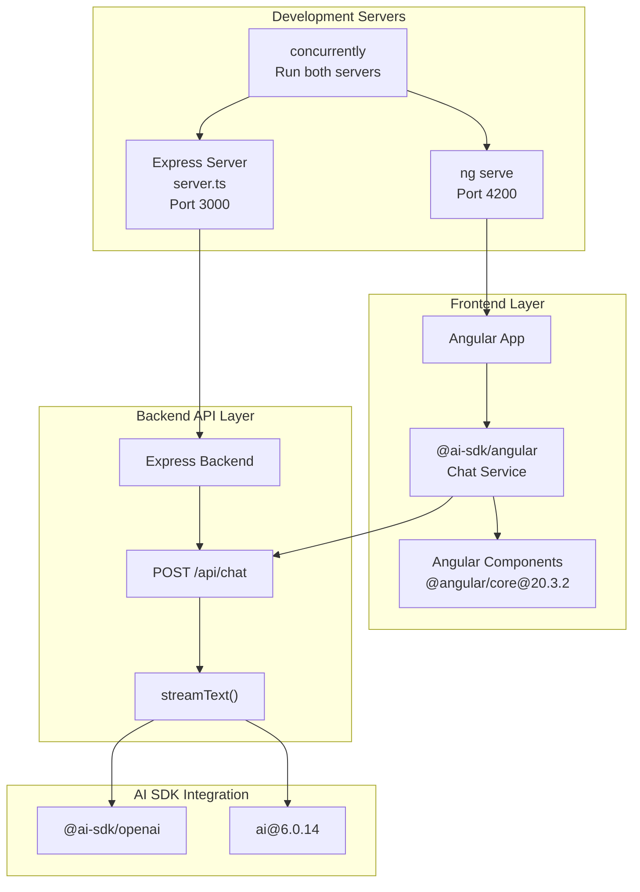
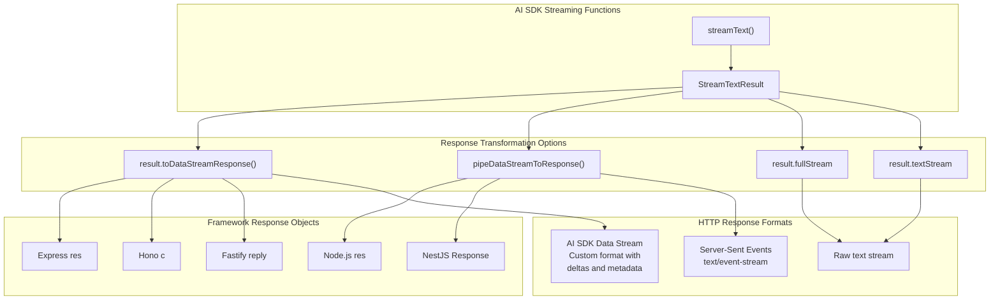

# Server Framework Examples

Relevant source files

The following files were used as context for generating this wiki page:

- [.changeset/pre.json](.changeset/pre.json)
- [examples/express/package.json](examples/express/package.json)
- [examples/fastify/package.json](examples/fastify/package.json)
- [examples/hono/package.json](examples/hono/package.json)
- [examples/nest/package.json](examples/nest/package.json)
- [examples/next-fastapi/package.json](examples/next-fastapi/package.json)
- [examples/next-google-vertex/package.json](examples/next-google-vertex/package.json)
- [examples/next-langchain/package.json](examples/next-langchain/package.json)
- [examples/next-openai-kasada-bot-protection/package.json](examples/next-openai-kasada-bot-protection/package.json)
- [examples/next-openai-pages/package.json](examples/next-openai-pages/package.json)
- [examples/next-openai-telemetry-sentry/package.json](examples/next-openai-telemetry-sentry/package.json)
- [examples/next-openai-telemetry/package.json](examples/next-openai-telemetry/package.json)
- [examples/next-openai-upstash-rate-limits/package.json](examples/next-openai-upstash-rate-limits/package.json)
- [examples/node-http-server/package.json](examples/node-http-server/package.json)
- [examples/nuxt-openai/package.json](examples/nuxt-openai/package.json)
- [examples/sveltekit-openai/package.json](examples/sveltekit-openai/package.json)
- [packages/amazon-bedrock/CHANGELOG.md](packages/amazon-bedrock/CHANGELOG.md)
- [packages/amazon-bedrock/package.json](packages/amazon-bedrock/package.json)
- [packages/anthropic/CHANGELOG.md](packages/anthropic/CHANGELOG.md)
- [packages/anthropic/package.json](packages/anthropic/package.json)
- [packages/google-vertex/CHANGELOG.md](packages/google-vertex/CHANGELOG.md)
- [packages/google-vertex/package.json](packages/google-vertex/package.json)
- [packages/google/CHANGELOG.md](packages/google/CHANGELOG.md)
- [packages/google/package.json](packages/google/package.json)
- [pnpm-lock.yaml](pnpm-lock.yaml)

## Purpose and Scope

This document covers the server-only framework examples in the Vercel AI SDK repository, demonstrating how to integrate AI text generation and streaming capabilities with backend frameworks including Express, Hono, Fastify, Nest.js, and Node.js HTTP servers. These examples focus on creating API endpoints that serve AI-generated content without frontend framework integration.

For frontend framework examples (SvelteKit, Nuxt, SolidStart), see [Other Framework Examples](#5.2). For Next.js examples with both frontend and backend integration, see [Next.js Examples](#5.1). For production features like telemetry and rate limiting, see [Production Features Examples](#5.4).

## Overview of Server Framework Examples

The repository contains six server framework examples, each demonstrating backend-only usage patterns for AI SDK integration:

| Example Directory | Framework | Version | Server Type | Primary Use Case |
|-------------------|-----------|---------|-------------|------------------|
| `examples/express` | Express | 5.0.1 | Traditional middleware-based | RESTful API endpoints |
| `examples/hono` | Hono | 4.6.9 | Modern lightweight | Edge-compatible streaming |
| `examples/fastify` | Fastify | 5.1.0 | High-performance | Low-latency APIs |
| `examples/nest` | Nest.js | 10.0.0 | Enterprise architecture | Modular service structure |
| `examples/node-http-server` | Node.js `http` | Built-in | Minimal dependency | Basic HTTP endpoints |
| `examples/angular` | Express + Angular | 5.0.1 + 20.3.2 | Full-stack | Integrated frontend/backend |

All examples share common dependencies: `@ai-sdk/openai@3.0.33` and `ai@6.0.99`, with TypeScript support via `tsx` or `ts-node` for development.

**Sources:** [examples/express/package.json:1-22](), [examples/hono/package.json:1-23](), [examples/fastify/package.json:1-20](), [examples/nest/package.json:1-66](), [examples/node-http-server/package.json:1-20](), [examples/angular/package.json:1-309]()

## Common Architecture Patterns

All server framework examples follow a consistent pattern:
1. HTTP endpoint receives request with prompt/messages
2. `streamText()` or `generateText()` is called with OpenAI model
3. Response is streamed using Server-Sent Events (SSE) or returned as JSON
4. Framework-specific utilities handle response piping

**Sources:** [examples/express/package.json:10-14](), [examples/hono/package.json:5-10](), [examples/fastify/package.json:6-9](), [examples/nest/package.json:8-15](), [examples/node-http-server/package.json:6-9]()

## Express Example Architecture

The Express example (`examples/express/`) demonstrates traditional middleware-based routing:

**Dependencies:**
- `express@5.0.1` - Latest Express version with enhanced TypeScript support
- `@ai-sdk/openai@3.0.33` - OpenAI provider integration
- `ai@6.0.99` - Core AI SDK functionality
- `dotenv@16.4.5` - Environment variable management

**Key Implementation Details:**
- Entry point: [examples/express/package.json:7]() references `tsx src/server.ts`
- Uses `express.json()` middleware for request body parsing
- Creates POST endpoints for text generation
- Leverages `toDataStreamResponse()` for SSE streaming to client
- Type definitions from `@types/express@5.0.0` provide full TypeScript support

**Development workflow:** Run `npm run dev` to start server with hot-reloading via `tsx`.

**Sources:** [examples/express/package.json:1-22]()

## Hono Example Architecture

The Hono example (`examples/hono/`) showcases a modern, lightweight framework designed for edge compatibility:

**Dependencies:**
- `hono@4.6.9` - Ultra-fast web framework
- `@hono/node-server@1.13.7` - Node.js adapter for Hono
- `@ai-sdk/openai@3.0.33` and `ai@6.0.99` - AI SDK packages

**Unique Features:**
- Two entry points: [examples/hono/package.json:13-14]()
  - `src/server.ts` - Standard server implementation
  - `src/hono-streaming.ts` - Dedicated streaming demonstration
- Uses Hono's context-based request handling (`c.req.json()`)
- Lightweight API surface optimized for performance
- Edge-compatible design (works in Cloudflare Workers, Deno, Bun)

**Development workflow:** 
- `npm run dev` - Standard server with watch mode
- `npm run dev:streaming` - Streaming-focused server
- `npm run curl` - Test endpoint with curl command

**Sources:** [examples/hono/package.json:1-23]()

## Fastify Example Architecture

The Fastify example (`examples/fastify/`) demonstrates high-performance API development:

**Dependencies:**
- `fastify@5.1.0` - Fast, low-overhead web framework
- `@ai-sdk/openai@3.0.33` and `ai@6.0.99` - AI SDK packages
- `dotenv@16.4.5` - Configuration management

**Performance Characteristics:**
- Schema-based validation (Fastify's strength)
- Automatic JSON parsing without explicit middleware
- Built-in logging and error handling
- Native TypeScript support

**Implementation Pattern:**
- Entry point: [examples/fastify/package.json:12]() - `tsx src/server.ts`
- Uses Fastify's `request` and `reply` objects for type-safe handling
- Leverages Fastify's plugin system for extensibility
- Automatic serialization and content-type handling

**Development workflow:** Run `npm run dev` for development server with hot-reloading.

**Sources:** [examples/fastify/package.json:1-20]()

## Nest.js Example Architecture

```mermaid
graph TB
    subgraph "NestJS Module System"
        MAIN["main.ts<br/>NestFactory.create()"]
        APP_MODULE["AppModule"]
        APP_CONTROLLER["AppController"]
        APP_SERVICE["AppService"]
    end
    
    subgraph "Dependency Injection"
        CORE["@nestjs/core"]
        PLATFORM_EXPRESS["@nestjs/platform-express"]
        DI_CONTAINER["DI Container"]
    end
    
    subgraph "Route Handling"
        POST_DECORATOR["@Post('/api/chat')"]
        CONTROLLER_METHOD["async generateText()"]
        SERVICE_METHOD["streamText logic"]
    end
    
    subgraph "AI SDK Integration"
        OPENAI_PROVIDER["openai('gpt-4o')"]
        STREAM_TEXT_NEST["streamText()"]
        RESPONSE["toDataStreamResponse()"]
    end
    
    MAIN --> APP_MODULE
    APP_MODULE --> APP_CONTROLLER
    APP_MODULE --> APP_SERVICE
    
    APP_MODULE --> CORE
    APP_MODULE --> PLATFORM_EXPRESS
    CORE --> DI_CONTAINER
    
    APP_CONTROLLER --> POST_DECORATOR
    POST_DECORATOR --> CONTROLLER_METHOD
    CONTROLLER_METHOD --> APP_SERVICE
    APP_SERVICE --> SERVICE_METHOD
    
    SERVICE_METHOD --> OPENAI_PROVIDER
    SERVICE_METHOD --> STREAM_TEXT_NEST
    STREAM_TEXT_NEST --> RESPONSE
```

The Nest.js example (`examples/nest/`) demonstrates enterprise-grade modular architecture:

**Dependencies:**
- `@nestjs/core@^10.0.0` - Core framework
- `@nestjs/platform-express@^10.4.9` - Express adapter
- `@nestjs/common@^10.4.15` - Common utilities (decorators, pipes, guards)
- `@ai-sdk/openai@3.0.33` and `ai@6.0.99` - AI SDK packages
- `rxjs@^7.8.1` - Reactive programming support

**Architectural Features:**
- Module-based organization with dependency injection
- Decorator-driven route definitions (`@Post`, `@Body`, etc.)
- Service layer separation for business logic
- Built-in testing infrastructure with Jest

**Development Infrastructure:**
- [examples/nest/package.json:8-15]() defines multiple scripts:
  - `build` - Production build via Nest CLI
  - `start:dev` - Development with watch mode
  - `start:debug` - Debug mode with source maps
  - `lint` - ESLint with auto-fix
- TypeScript configuration via `tsconfig-paths@^4.2.0`
- Testing configured with `ts-jest@^29.1.0` and `@nestjs/testing@^10.4.12`

**Type Safety:** Full TypeScript support with `@types/express@^5.0.0` and `@types/node@20.17.24`.

**Sources:** [examples/nest/package.json:1-66]()

## Node.js HTTP Server Example

```mermaid
graph LR
    subgraph "Native Node.js Server"
        SERVER_TS["server.ts"]
        HTTP_MODULE["http.createServer()"]
        REQUEST_LISTENER["(req, res) => {}"]
    end
    
    subgraph "Request Routing"
        URL_PARSING["url.parse(req.url)"]
        METHOD_CHECK["req.method === 'POST'"]
        PATH_CHECK["pathname === '/api/chat'"]
    end
    
    subgraph "Body Parsing"
        CHUNKS["req.on('data')"]
        BUFFER["Buffer.concat(chunks)"]
        JSON_PARSE["JSON.parse(body)"]
    end
    
    subgraph "AI Processing"
        STREAM_TEXT_NODE["streamText({<br/>model: openai('gpt-4o')<br/>})"]
        PIPE_RESPONSE["pipeDataStreamToResponse()"]
    end
    
    subgraph "Server Startup"
        LISTEN["server.listen(3000)"]
    end
    
    SERVER_TS --> HTTP_MODULE
    HTTP_MODULE --> REQUEST_LISTENER
    
    REQUEST_LISTENER --> URL_PARSING
    URL_PARSING --> METHOD_CHECK
    METHOD_CHECK --> PATH_CHECK
    
    PATH_CHECK --> CHUNKS
    CHUNKS --> BUFFER
    BUFFER --> JSON_PARSE
    
    JSON_PARSE --> STREAM_TEXT_NODE
    STREAM_TEXT_NODE --> PIPE_RESPONSE
    
    HTTP_MODULE --> LISTEN
```

The Node.js HTTP server example (`examples/node-http-server/`) demonstrates minimal-dependency implementation:

**Dependencies:**
- `@ai-sdk/openai@3.0.33` and `ai@6.0.99` - AI SDK packages only
- `zod@3.25.76` - Schema validation
- `dotenv@16.4.5` - Environment variables
- No web framework dependencies

**Implementation Characteristics:**
- Uses native `http` module from Node.js standard library
- Manual request body parsing via streams
- Manual routing via URL and method checks
- Direct response header and status code management
- Demonstrates `pipeDataStreamToResponse()` utility for streaming

**Use Case:** Ideal for understanding low-level HTTP handling, minimal Docker images, or embedding in larger applications without framework overhead.

**Development workflow:** [examples/node-http-server/package.json:13]() - `npm run dev` runs `tsx src/server.ts`.

**Sources:** [examples/node-http-server/package.json:1-20]()

## Angular Full-Stack Example

The Angular example (`examples/angular/`) is unique as a full-stack integration demonstrating both frontend and backend:

**Frontend Dependencies:**
- `@ai-sdk/angular@2.0.100` - Angular-specific AI SDK integration
- `@angular/core@^20.3.2` - Latest Angular framework
- `@angular/forms@^20.3.2` - Reactive forms support
- `@angular/router@^20.3.2` - Client-side routing
- `zone.js@~0.15.0` - Change detection mechanism

**Backend Dependencies:**
- `express@5.0.1` - Server framework
- `@ai-sdk/openai@3.0.33` and `ai@6.0.99` - AI SDK packages

**Development Workflow:**
- [examples/angular/package.json:301-303]() defines `concurrently@^9.1.0` for running both servers
- Frontend development: Angular Dev Server on port 4200
- Backend development: Express server (typically on port 3000)
- Type definitions: `@types/express@5.0.0` for backend TypeScript

**Build System:**
- `@angular-devkit/build-angular@^20.3.3` - Angular CLI build tools
- `@angular/compiler-cli@^20.3.2` - Ahead-of-Time compilation
- `typescript@5.8.3` - TypeScript compiler

**Unique Features:**
- Demonstrates frontend-backend integration pattern
- Uses Angular signals for reactive state management
- Shows how to consume streaming AI responses in Angular components
- Provides full-stack TypeScript development experience

**Sources:** [examples/angular/package.json:1-309]()

## Streaming Response Patterns

All server framework examples implement streaming using one of three patterns:

**Pattern 1: `toDataStreamResponse()`**
- Used in: Express, Hono, Fastify examples
- Returns: Web standard `Response` object
- Format: AI SDK data stream protocol with structured deltas
- Benefits: Automatic handling of headers and content-type
- Client compatibility: Works with `@ai-sdk/react` `useChat()` hook

**Pattern 2: `pipeDataStreamToResponse()`**
- Used in: Node.js HTTP server, Nest.js examples
- Returns: Pipes stream directly to framework response object
- Format: Server-Sent Events (SSE) compatible
- Benefits: Lower-level control, works with native Node.js responses

**Pattern 3: Direct Stream Access**
- Available via: `result.textStream` or `result.fullStream`
- Format: Raw AsyncIterable of text chunks or full stream data
- Use case: Custom streaming protocols or non-HTTP transports

**Common Headers Set:**
- `Content-Type: text/event-stream` or `text/plain; charset=utf-8`
- `Cache-Control: no-cache`
- `Connection: keep-alive`

**Sources:** [examples/express/package.json:10-14](), [examples/hono/package.json:13-14](), [examples/fastify/package.json:12](), [examples/nest/package.json:11](), [examples/node-http-server/package.json:13]()

## Example Dependencies Summary

| Package | Express | Hono | Fastify | Nest.js | Node HTTP | Angular |
|---------|---------|------|---------|---------|-----------|---------|
| `@ai-sdk/openai` | 3.0.33 | 3.0.33 | 3.0.33 | 3.0.33 | 3.0.33 | 3.0.33 |
| `ai` | 6.0.99 | 6.0.99 | 6.0.99 | 6.0.99 | 6.0.99 | 6.0.99 |
| `dotenv` | 16.4.5 | 16.4.5 | 16.4.5 | - | 16.4.5 | 16.4.5 |
| `zod` | - | - | - | - | 3.25.76 | 3.25.76 |
| Framework | express@5.0.1 | hono@4.6.9 | fastify@5.1.0 | @nestjs/core@10.0.0 | - | express@5.0.1 |
| Runtime | tsx@4.19.2 | tsx@4.19.2 | tsx@4.19.2 | ts-node@10.9.1 | tsx@4.19.2 | tsx@4.19.2 |
| TypeScript | 5.8.3 | 5.8.3 | 5.8.3 | 5.8.3 | 5.8.3 | 5.8.3 |

All examples use consistent versions of core AI SDK packages, ensuring compatibility and predictable behavior across different server frameworks.

**Sources:** [examples/express/package.json:10-20](), [examples/hono/package.json:5-21](), [examples/fastify/package.json:5-18](), [examples/nest/package.json:17-66](), [examples/node-http-server/package.json:5-18](), [examples/angular/package.json:236-309]()