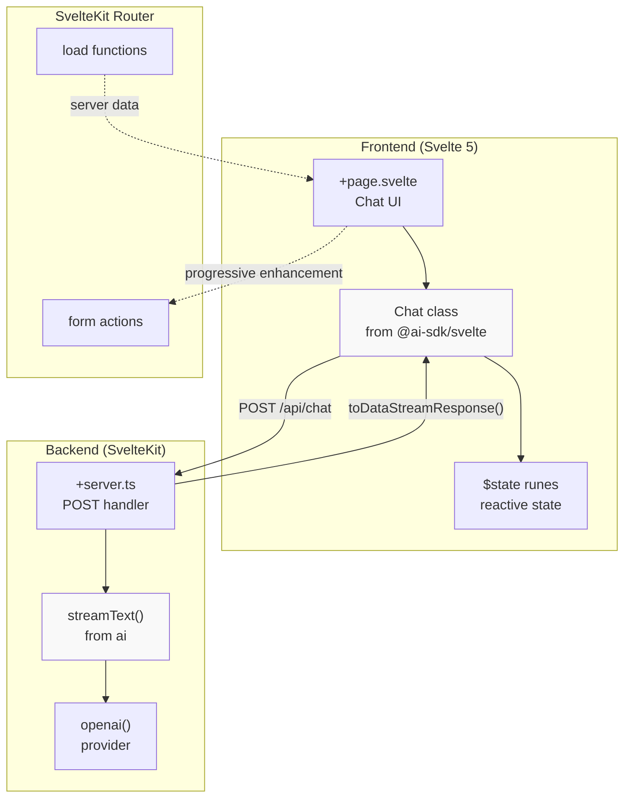
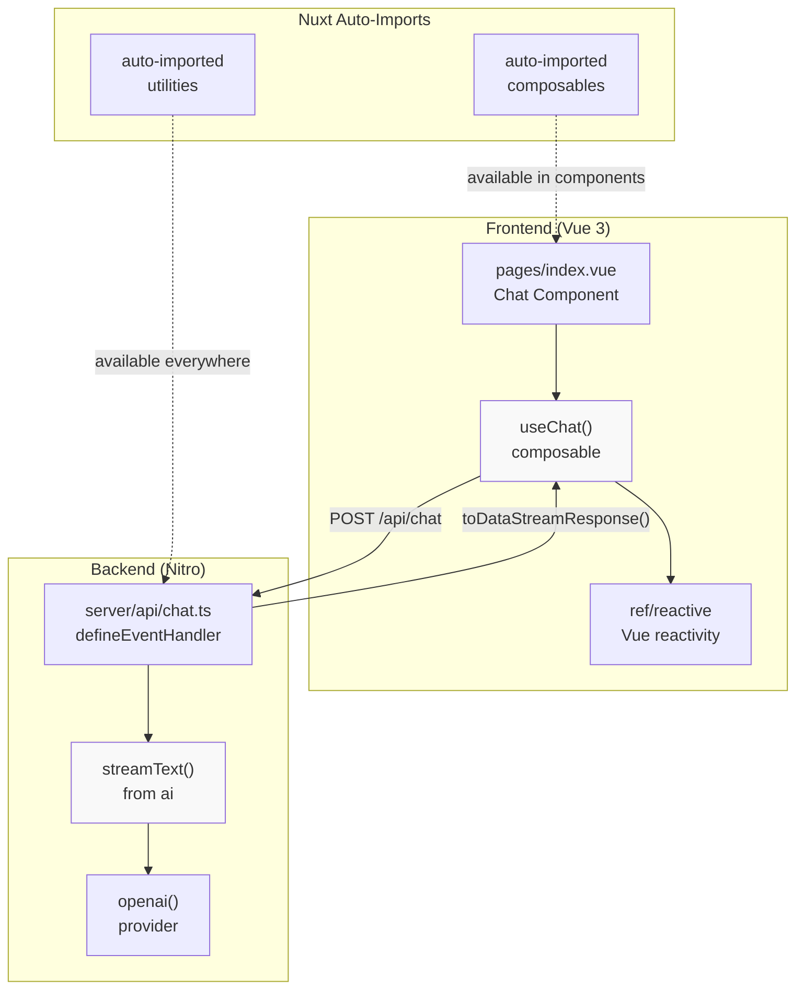
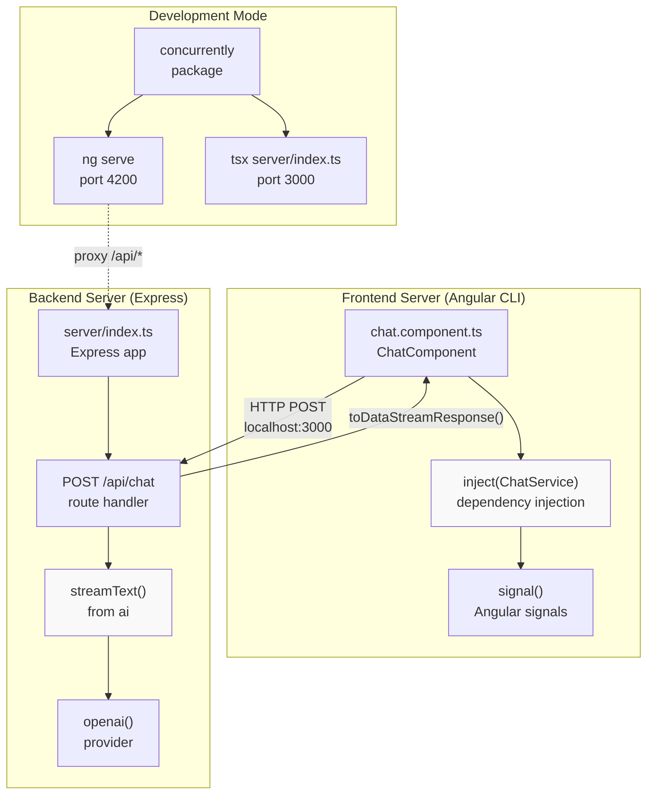
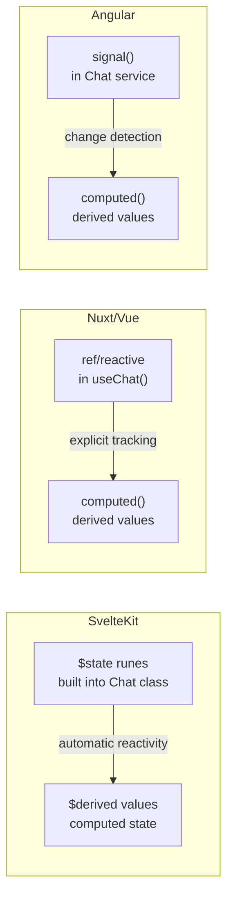
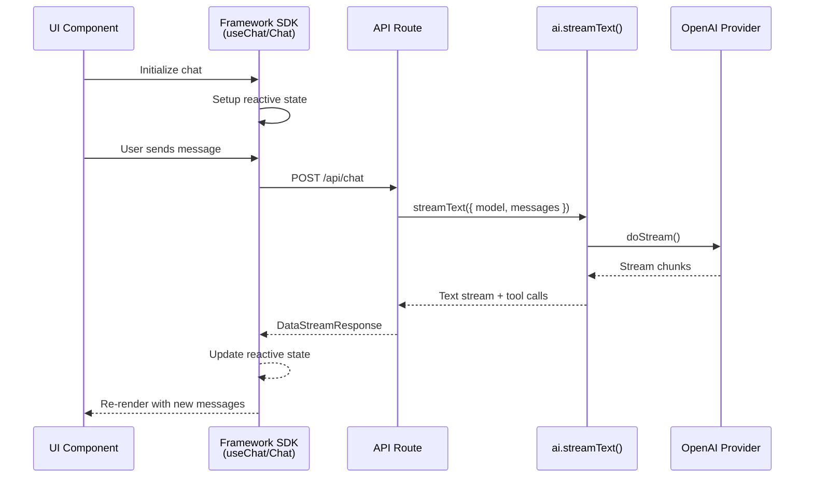

# SvelteKit, Nuxt, and Other Frontend Examples

<details>
<summary>Relevant source files</summary>

The following files were used as context for generating this wiki page:

- [.changeset/pre.json](.changeset/pre.json)
- [examples/express/package.json](examples/express/package.json)
- [examples/fastify/package.json](examples/fastify/package.json)
- [examples/hono/package.json](examples/hono/package.json)
- [examples/nest/package.json](examples/nest/package.json)
- [examples/next-fastapi/package.json](examples/next-fastapi/package.json)
- [examples/next-google-vertex/package.json](examples/next-google-vertex/package.json)
- [examples/next-langchain/package.json](examples/next-langchain/package.json)
- [examples/next-openai-kasada-bot-protection/package.json](examples/next-openai-kasada-bot-protection/package.json)
- [examples/next-openai-pages/package.json](examples/next-openai-pages/package.json)
- [examples/next-openai-telemetry-sentry/package.json](examples/next-openai-telemetry-sentry/package.json)
- [examples/next-openai-telemetry/package.json](examples/next-openai-telemetry/package.json)
- [examples/next-openai-upstash-rate-limits/package.json](examples/next-openai-upstash-rate-limits/package.json)
- [examples/node-http-server/package.json](examples/node-http-server/package.json)
- [examples/nuxt-openai/package.json](examples/nuxt-openai/package.json)
- [examples/sveltekit-openai/package.json](examples/sveltekit-openai/package.json)
- [packages/amazon-bedrock/CHANGELOG.md](packages/amazon-bedrock/CHANGELOG.md)
- [packages/amazon-bedrock/package.json](packages/amazon-bedrock/package.json)
- [packages/anthropic/CHANGELOG.md](packages/anthropic/CHANGELOG.md)
- [packages/anthropic/package.json](packages/anthropic/package.json)
- [packages/google-vertex/CHANGELOG.md](packages/google-vertex/CHANGELOG.md)
- [packages/google-vertex/package.json](packages/google-vertex/package.json)
- [packages/google/CHANGELOG.md](packages/google/CHANGELOG.md)
- [packages/google/package.json](packages/google/package.json)
- [pnpm-lock.yaml](pnpm-lock.yaml)

</details>

This document covers the SvelteKit, Nuxt, and Angular example applications in the repository. These examples demonstrate framework-specific integration patterns for building AI-powered chat interfaces using the AI SDK's framework bindings.

For details on the underlying framework packages (`@ai-sdk/svelte`, `@ai-sdk/vue`, `@ai-sdk/angular`), see [Vue and Svelte Integrations](#4.3) and [Angular and Solid Integrations](#4.4). For Next.js examples, see [Next.js Examples](#5.1). For server-only examples, see [Server Framework Examples](#5.3).

---

## Overview and Common Architecture

All three frontend examples demonstrate similar capabilities with framework-specific implementations:

| Feature             | SvelteKit                     | Nuxt                       | Angular                        |
| ------------------- | ----------------------------- | -------------------------- | ------------------------------ |
| Framework Version   | SvelteKit 2.x / Svelte 5.x    | Nuxt 3.14.x                | Angular 20.x                   |
| AI SDK Package      | `@ai-sdk/svelte` 5.0.0-beta.7 | `@ai-sdk/vue` 4.0.0-beta.7 | `@ai-sdk/angular` 3.0.0-beta.7 |
| Core Package        | `ai` 7.0.0-beta.7             | `ai` 7.0.0-beta.7          | `ai` 7.0.0-beta.7              |
| Provider            | `@ai-sdk/openai`              | `@ai-sdk/openai`           | `@ai-sdk/openai`               |
| Backend Integration | SvelteKit server routes       | Nuxt server routes         | Separate Express server        |
| State Management    | Svelte 5 runes (`$state`)     | Vue 3 Composition API      | Angular signals                |
| Styling             | Tailwind CSS                  | Tailwind CSS               | Angular CLI defaults           |

**Sources:** [examples/sveltekit-openai/package.json:1-46](), [examples/nuxt-openai/package.json:1-34](), [examples/angular/package.json:1-474]()

---

## SvelteKit Example Architecture

The SvelteKit example demonstrates the integration of `@ai-sdk/svelte` with SvelteKit's file-based routing and server endpoints.

### Project Structure

```
examples/sveltekit-openai/
├── src/
│   ├── routes/
│   │   ├── +page.svelte           # Chat UI component
│   │   └── api/
│   │       └── chat/
│   │           └── +server.ts      # API route handler
│   ├── lib/                        # Shared utilities
│   └── app.html                    # HTML template
├── package.json
└── svelte.config.js                # SvelteKit configuration
```

### SvelteKit Chat Implementation



**Diagram: SvelteKit Example Data Flow**

The SvelteKit example leverages:

1. **Svelte 5 Runes:** The `Chat` class from `@ai-sdk/svelte` uses `$state` runes for reactive state management, eliminating the need for stores or manual subscriptions
2. **SvelteKit Server Routes:** API routes follow the `+server.ts` convention, with handlers exported as `POST`, `GET`, etc.
3. **Type Safety:** Full TypeScript support across both frontend and backend with shared types
4. **Adapter Integration:** Configured with `@sveltejs/adapter-vercel` for deployment

**Key Dependencies:**

- `@ai-sdk/svelte`: Provides the `Chat` class with Svelte 5 reactivity
- `@sveltejs/kit`: SvelteKit framework (version 2.16.0)
- `svelte`: Core Svelte library (version 5.31.0)
- `bits-ui`: UI components for the chat interface
- `zod`: Schema validation for API requests

**Sources:** [examples/sveltekit-openai/package.json:1-46](), [pnpm-lock.yaml:2078-2110]()

---

## Nuxt Example Architecture

The Nuxt example demonstrates Vue 3 Composition API integration with Nuxt 3's server routes.

### Project Structure

```
examples/nuxt-openai/
├── pages/
│   └── index.vue                   # Chat page component
├── server/
│   └── api/
│       └── chat.ts                 # API route handler
├── composables/                    # Vue composables
├── nuxt.config.ts                  # Nuxt configuration
└── package.json
```

### Nuxt Chat Implementation



**Diagram: Nuxt Example Data Flow**

The Nuxt example demonstrates:

1. **Vue Composition API:** The `useChat()` composable from `@ai-sdk/vue` integrates with Vue 3's reactivity system
2. **Nitro Server Routes:** Server-side API routes use `defineEventHandler` and are automatically registered
3. **Auto-Imports:** Nuxt's auto-import feature makes composables and utilities available without explicit imports
4. **Hybrid Rendering:** Supports both SSR and client-side rendering patterns

**Key Dependencies:**

- `@ai-sdk/vue`: Provides the `useChat()` composable for Vue 3
- `nuxt`: Nuxt 3 framework (version 3.14.159)
- `vue`: Core Vue 3 library (version 3.5.13)
- `@nuxtjs/tailwindcss`: Tailwind CSS integration for Nuxt
- `zod`: Schema validation for API requests

**Sources:** [examples/nuxt-openai/package.json:1-34](), [pnpm-lock.yaml:2111-2164]()

---

## Angular Example Architecture

The Angular example differs from SvelteKit and Nuxt by using a separate Express backend server, demonstrating a more traditional client-server architecture.

### Project Structure

```
examples/angular/
├── src/
│   ├── app/
│   │   ├── app.component.ts        # Root component
│   │   ├── chat/
│   │   │   └── chat.component.ts   # Chat component
│   │   └── app.routes.ts           # Angular routing
│   ├── environments/               # Environment configs
│   └── main.ts                     # Bootstrap file
├── server/
│   └── index.ts                    # Express server
├── package.json
└── angular.json                    # Angular CLI config
```

### Angular Dual-Server Implementation



**Diagram: Angular Example Dual-Server Architecture**

The Angular example demonstrates:

1. **Separate Backend:** Unlike SvelteKit and Nuxt which have integrated server capabilities, Angular uses a standalone Express server running on port 3000
2. **Angular Signals:** The `@ai-sdk/angular` package provides signal-based state management (Angular 16+)
3. **Dependency Injection:** Services are injected using Angular's DI system with the `inject()` function
4. **Concurrent Development:** The `concurrently` package runs both Angular CLI dev server (port 4200) and Express server (port 3000) simultaneously
5. **API Proxying:** Angular CLI proxies `/api/*` requests to the Express backend during development

**Key Dependencies:**

- `@ai-sdk/angular`: Provides Angular-specific chat integration (version 3.0.0-beta.7)
- `@angular/core`: Angular framework (version 20.3.2)
- `@angular/forms`: Forms module for chat input
- `express`: Backend server (version 5.0.1)
- `concurrently`: Run multiple commands in parallel during development
- `tsx`: TypeScript execution for the Express server
- `zod`: Schema validation for API requests

**Build Scripts:**

The Angular example uses `concurrently` to manage both servers:

```json
{
  "scripts": {
    "dev": "concurrently \"ng serve\" \"tsx server/index.ts\""
  }
}
```

**Sources:** [examples/angular/package.json:1-474](), [pnpm-lock.yaml:406-474]()

---

## Framework-Specific Patterns Comparison

### State Management Approaches



**Diagram: Framework State Management Patterns**

| Framework     | State Primitive       | Reactivity Model                 | Change Detection          |
| ------------- | --------------------- | -------------------------------- | ------------------------- |
| **SvelteKit** | `$state` runes        | Compile-time reactive statements | Automatic, no virtual DOM |
| **Nuxt/Vue**  | `ref()`, `reactive()` | Runtime Proxy-based reactivity   | Automatic via Proxy traps |
| **Angular**   | `signal()`            | Push-based signals               | Explicit signal updates   |

**Sources:** [examples/sveltekit-openai/package.json:21-22](), [examples/nuxt-openai/package.json:13](), [examples/angular/package.json:408-410]()

### Routing Integration

| Framework     | Routing Type    | API Route Pattern                | File Convention                |
| ------------- | --------------- | -------------------------------- | ------------------------------ |
| **SvelteKit** | File-based      | `src/routes/api/chat/+server.ts` | `+server.ts` exports handlers  |
| **Nuxt**      | File-based      | `server/api/chat.ts`             | `defineEventHandler()` wrapper |
| **Angular**   | Component-based | Separate Express server          | Traditional Express routes     |

### Backend Integration Patterns

**SvelteKit:**

- Server routes are co-located with frontend pages
- Uses `RequestEvent` from SvelteKit for request handling
- Returns `Response` objects or uses `toDataStreamResponse()`

**Nuxt:**

- Server routes in `server/api/` directory
- Powered by Nitro engine
- Uses `defineEventHandler()` for type-safe event handling

**Angular:**

- Separate Express server in `server/` directory
- Full control over server middleware and configuration
- Requires CORS configuration for development

**Sources:** [examples/sveltekit-openai/package.json:9](), [examples/nuxt-openai/package.json:4-10](), [examples/angular/package.json:467]()

---

## Common Integration Pattern

Despite framework differences, all examples follow a similar integration pattern:



**Diagram: Common Integration Sequence Across All Frameworks**

**Shared Patterns:**

1. **Framework SDK Package:** Each framework has a dedicated package (`@ai-sdk/svelte`, `@ai-sdk/vue`, `@ai-sdk/angular`)
2. **Core AI Package:** All use `ai` package version 7.0.0-beta.7 for backend logic
3. **OpenAI Provider:** All examples use `@ai-sdk/openai` for model access
4. **Stream Handling:** All use `toDataStreamResponse()` to convert AI streams to framework-compatible responses
5. **TypeScript:** Full TypeScript support across all examples
6. **Zod Validation:** Schema validation with `zod` for API requests

**Sources:** [examples/sveltekit-openai/package.json:19-21](), [examples/nuxt-openai/package.json:13-15](), [examples/angular/package.json:408-412]()

---

## Development Setup Comparison

### Installation and Development

| Framework     | Install Command | Dev Command               | Build Command             |
| ------------- | --------------- | ------------------------- | ------------------------- |
| **SvelteKit** | `pnpm install`  | `pnpm dev` (vite dev)     | `pnpm build` (vite build) |
| **Nuxt**      | `pnpm install`  | `pnpm dev` (nuxt dev)     | `pnpm build` (nuxt build) |
| **Angular**   | `pnpm install`  | `pnpm dev` (concurrently) | `pnpm build` (ng build)   |

### Port Configuration

- **SvelteKit:** Runs on Vite's default port (typically 5173)
- **Nuxt:** Runs on port 3000 by default
- **Angular:** Frontend on 4200, backend on 3000

### Build Outputs

- **SvelteKit:** `.svelte-kit/` output, adapter-specific builds
- **Nuxt:** `.nuxt/` output, `.output/` for production
- **Angular:** `dist/` for frontend, `server/` runs directly with `tsx`

**Sources:** [examples/sveltekit-openai/package.json:6-8](), [examples/nuxt-openai/package.json:5-7](), [examples/angular/package.json:467]()

---

## Deployment Considerations

### SvelteKit Deployment

The example uses `@sveltejs/adapter-vercel` for Vercel deployment:

- Server routes automatically become serverless functions
- Static assets are optimized and deployed to CDN
- Edge runtime support available

### Nuxt Deployment

Nuxt 3 uses Nitro for universal deployment:

- Single output directory (`.output/`)
- Supports Vercel, Netlify, CloudFlare Workers, and more
- Server routes become serverless functions automatically

### Angular Deployment

Requires separate deployment for frontend and backend:

- **Frontend:** Deploy Angular build output to static hosting or CDN
- **Backend:** Deploy Express server to Node.js hosting (Vercel Serverless Functions, AWS Lambda, etc.)
- Environment variables must be configured separately for each

**Sources:** [examples/sveltekit-openai/package.json:24](), [examples/nuxt-openai/package.json:19](), [examples/angular/package.json:438-440]()

---

## Summary of Example Applications

All three examples demonstrate production-ready patterns for integrating AI chat functionality into modern frontend frameworks. The key differences lie in:

1. **Architecture:** SvelteKit and Nuxt have integrated server capabilities; Angular uses a separate Express server
2. **State Management:** Each framework uses its native reactivity system (Svelte runes, Vue Composition API, Angular signals)
3. **Developer Experience:** SvelteKit and Nuxt offer more streamlined development with single-command dev servers; Angular requires managing two processes

Choose based on your framework preference and existing infrastructure:

- **SvelteKit:** Best DX with compile-time optimizations and minimal runtime
- **Nuxt:** Mature ecosystem with excellent TypeScript support and hybrid rendering
- **Angular:** Enterprise-ready with powerful DI and signals, good for large teams

**Sources:** [examples/sveltekit-openai/package.json:1-46](), [examples/nuxt-openai/package.json:1-34](), [examples/angular/package.json:1-474]()
