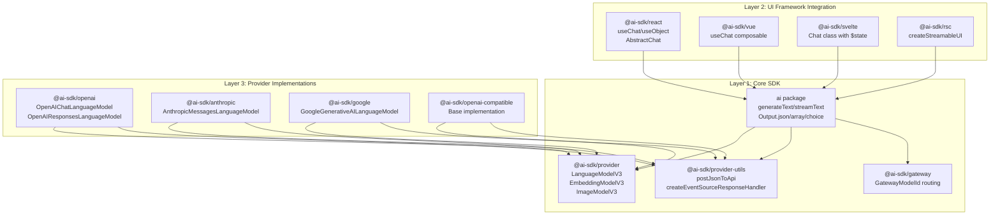
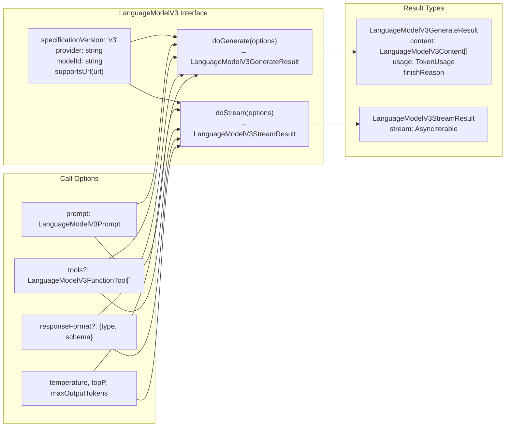
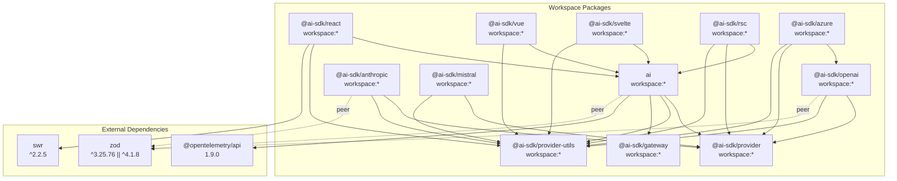
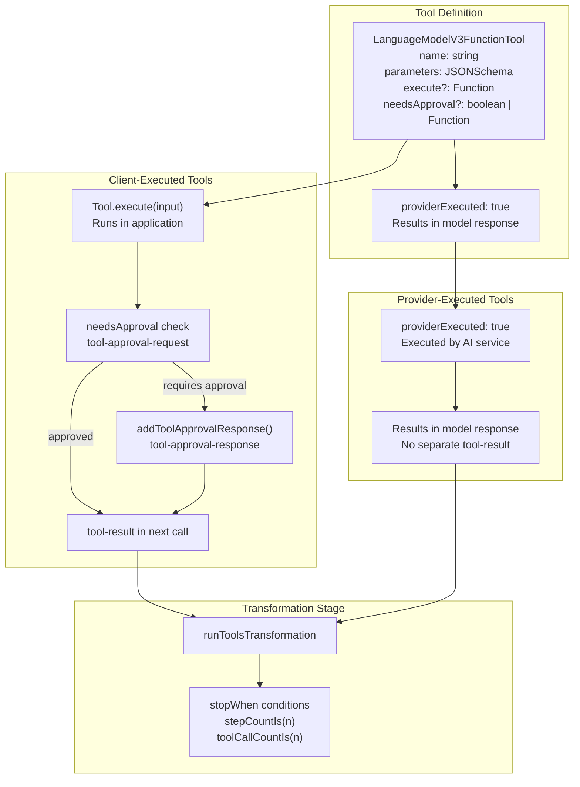
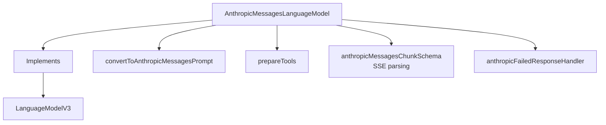
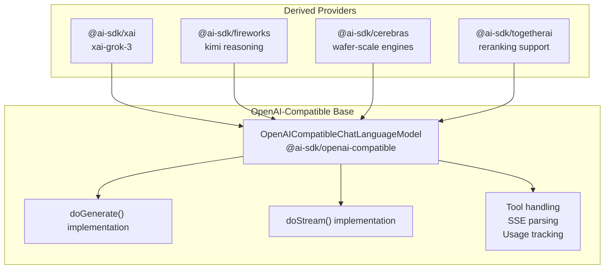
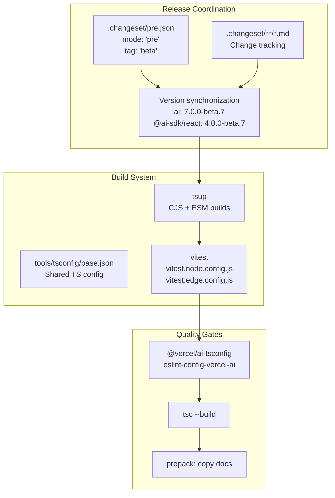
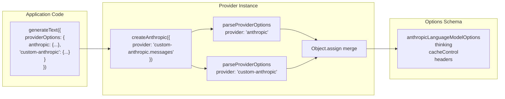

# Architecture and Design Principles

<details>
<summary>Relevant source files</summary>

The following files were used as context for generating this wiki page:

- [content/docs/02-foundations/02-providers-and-models.mdx](content/docs/02-foundations/02-providers-and-models.mdx)
- [content/providers/01-ai-sdk-providers/05-anthropic.mdx](content/providers/01-ai-sdk-providers/05-anthropic.mdx)
- [content/providers/01-ai-sdk-providers/index.mdx](content/providers/01-ai-sdk-providers/index.mdx)
- [examples/ai-functions/src/stream-text/anthropic/fine-grained-tool-streaming.ts](examples/ai-functions/src/stream-text/anthropic/fine-grained-tool-streaming.ts)
- [packages/ai/CHANGELOG.md](packages/ai/CHANGELOG.md)
- [packages/ai/package.json](packages/ai/package.json)
- [packages/anthropic/src/**snapshots**/anthropic-messages-language-model.test.ts.snap](packages/anthropic/src/__snapshots__/anthropic-messages-language-model.test.ts.snap)
- [packages/anthropic/src/anthropic-messages-api.ts](packages/anthropic/src/anthropic-messages-api.ts)
- [packages/anthropic/src/anthropic-messages-language-model.test.ts](packages/anthropic/src/anthropic-messages-language-model.test.ts)
- [packages/anthropic/src/anthropic-messages-language-model.ts](packages/anthropic/src/anthropic-messages-language-model.ts)
- [packages/anthropic/src/anthropic-messages-options.ts](packages/anthropic/src/anthropic-messages-options.ts)
- [packages/anthropic/src/anthropic-prepare-tools.test.ts](packages/anthropic/src/anthropic-prepare-tools.test.ts)
- [packages/anthropic/src/anthropic-prepare-tools.ts](packages/anthropic/src/anthropic-prepare-tools.ts)
- [packages/anthropic/src/anthropic-tools.ts](packages/anthropic/src/anthropic-tools.ts)
- [packages/anthropic/src/convert-anthropic-messages-usage.test.ts](packages/anthropic/src/convert-anthropic-messages-usage.test.ts)
- [packages/anthropic/src/convert-anthropic-messages-usage.ts](packages/anthropic/src/convert-anthropic-messages-usage.ts)
- [packages/anthropic/src/convert-to-anthropic-messages-prompt.test.ts](packages/anthropic/src/convert-to-anthropic-messages-prompt.test.ts)
- [packages/anthropic/src/convert-to-anthropic-messages-prompt.ts](packages/anthropic/src/convert-to-anthropic-messages-prompt.ts)
- [packages/azure/CHANGELOG.md](packages/azure/CHANGELOG.md)
- [packages/azure/package.json](packages/azure/package.json)
- [packages/mistral/CHANGELOG.md](packages/mistral/CHANGELOG.md)
- [packages/mistral/package.json](packages/mistral/package.json)
- [packages/openai/CHANGELOG.md](packages/openai/CHANGELOG.md)
- [packages/openai/package.json](packages/openai/package.json)
- [packages/provider-utils/CHANGELOG.md](packages/provider-utils/CHANGELOG.md)
- [packages/provider-utils/package.json](packages/provider-utils/package.json)
- [packages/react/CHANGELOG.md](packages/react/CHANGELOG.md)
- [packages/react/package.json](packages/react/package.json)
- [packages/rsc/CHANGELOG.md](packages/rsc/CHANGELOG.md)
- [packages/rsc/package.json](packages/rsc/package.json)
- [packages/rsc/tests/e2e/next-server/CHANGELOG.md](packages/rsc/tests/e2e/next-server/CHANGELOG.md)
- [packages/svelte/CHANGELOG.md](packages/svelte/CHANGELOG.md)
- [packages/svelte/package.json](packages/svelte/package.json)
- [packages/vue/CHANGELOG.md](packages/vue/CHANGELOG.md)
- [packages/vue/package.json](packages/vue/package.json)

</details>

## Purpose and Scope

This document describes the foundational architecture and design principles of the Vercel AI SDK. It covers the layered system architecture, the Provider-V3 specification that enables provider interoperability, streaming patterns, tool execution models, and the monorepo structure. For specific implementation details of individual components, see [Core SDK Functionality](#2), [Provider Ecosystem](#3), and [UI Framework Integrations](#4).

## Layered Architecture

The AI SDK implements a three-layer architecture that separates concerns and enables flexibility:



**Layer 1 (Core SDK)** provides framework-agnostic functions like `generateText` and `streamText` [packages/ai/src/index.ts:1-100](), along with the Provider-V3 specification interfaces [packages/provider/src/language-model/v3]() and shared utilities for HTTP communication.

**Layer 2 (UI Framework Integration)** offers reactive state management for React, Vue, Svelte, and other frameworks through the `AbstractChat` base class [packages/react/src/use-chat.ts:1-50]() and framework-specific adapters.

**Layer 3 (Provider Implementations)** contains concrete implementations of the Provider-V3 specification for OpenAI, Anthropic, Google, and other AI services.

**Sources:** [packages/ai/package.json:1-117](), [packages/react/package.json:1-84](), [packages/anthropic/src/anthropic-messages-language-model.ts:1-150]()

## Provider-V3 Specification

The Provider-V3 specification defines standardized interfaces that all providers must implement, enabling provider interoperability without vendor lock-in:



The specification defines:

- **Model metadata**: `provider`, `modelId`, `specificationVersion` fields identify the model
- **Core methods**: `doGenerate()` for non-streaming requests, `doStream()` for streaming
- **Prompt format**: `LanguageModelV3Prompt` standardizes message structures across providers
- **Tool calling**: `LanguageModelV3FunctionTool` interface with JSON schema support
- **Structured output**: `responseFormat` parameter for JSON/array/choice modes
- **Result types**: Consistent return structures with `content`, `usage`, and `finishReason`

**Example implementation in AnthropicMessagesLanguageModel:**

[packages/anthropic/src/anthropic-messages-language-model.ts:134-172]() defines the class implementing `LanguageModelV3`:

```typescript
export class AnthropicMessagesLanguageModel implements LanguageModelV3 {
  readonly specificationVersion = 'v3'
  readonly modelId: AnthropicMessagesModelId
  readonly provider: string

  async doGenerate(
    options: LanguageModelV3CallOptions
  ): Promise<LanguageModelV3GenerateResult>
  async doStream(
    options: LanguageModelV3CallOptions
  ): Promise<LanguageModelV3StreamResult>
}
```

**Sources:** [packages/anthropic/src/anthropic-messages-language-model.ts:1-50](), [content/docs/02-foundations/02-providers-and-models.mdx:1-20]()

## Package Dependency Graph

The monorepo uses strict dependency relationships to maintain architectural boundaries:



Key dependency patterns:

- **Core dependencies**: All packages use `workspace:*` for internal dependencies, ensuring version consistency
- **Provider dependencies**: Provider packages depend on `@ai-sdk/provider` (specification) and `@ai-sdk/provider-utils` (shared utilities)
- **UI framework dependencies**: UI packages depend on the core `ai` package and `@ai-sdk/provider-utils`
- **Peer dependencies**: Zod is a peer dependency (`^3.25.76 || ^4.1.8`) across packages for schema validation
- **Composition pattern**: Azure extends OpenAI rather than reimplementing the entire provider

**Sources:** [packages/ai/package.json:62-67](), [packages/react/package.json:39-44](), [packages/anthropic/package.json:1-50](), [packages/azure/package.json:46-50]()

## Streaming Architecture

The SDK implements a multi-stage streaming pipeline using Web Streams API:

```mermaid
graph LR
    subgraph "Provider Stream"
        DOSTREAM["doStream()<br/>→ AsyncIterable<StreamPart>"]
        PROVIDERSTREAM["text-delta<br/>tool-call<br/>tool-call-delta<br/>finish<br/>error"]
    end

    subgraph "Transformation Pipeline"
        RUNTOOLSTRANSFORM["runToolsTransformation<br/>executeToolCall()<br/>providerExecuted handling"]
        SMOOTHSTREAM["smoothStream<br/>DelayedAsyncIterableStream"]
        UIMESSAGESTREAM["createUIMessageStream<br/>UIMessageChunk encoding"]
    end

    subgraph "Transport Layer"
        ASYNCITERABLESTREAM["AsyncIterableStream<br/>pipeThrough()<br/>toReadableStream()"]
        READABLESTREAM["ReadableStream<br/>Web Streams API"]
        CHATRANSPORT["ChatTransport<br/>HttpChatTransport<br/>parseUIMessageStream()"]
    end

    DOSTREAM --> PROVIDERSTREAM
    PROVIDERSTREAM --> RUNTOOLSTRANSFORM
    RUNTOOLSTRANSFORM --> SMOOTHSTREAM
    SMOOTHSTREAM --> UIMESSAGESTREAM
    UIMESSAGESTREAM --> ASYNCITERABLESTREAM
    ASYNCITERABLESTREAM --> READABLESTREAM
    READABLESTREAM --> CHATRANSPORT
```



### Stream Processing Components

**AsyncIterableStream** [packages/ai/core/util/async-iterable-stream.ts:1-100]() provides:

- `pipeThrough()`: Chain transformations using TransformStreams
- `toReadableStream()`: Convert to Web Streams ReadableStream
- `splitTextDeltas()`: Split text deltas on boundaries

**runToolsTransformation** [packages/ai/core/generate-text/run-tools-transformation.ts:1-200]() handles:

- Tool call execution via `Tool.execute()`
- Provider-executed tool result processing (`providerExecuted: true`)
- Tool approval workflow with `needsApproval` checks
- Multi-step agent loops with `stopWhen` conditions

**smoothStream** [packages/ai/core/generate-text/smooth-stream.ts:1-100]() provides:

- Configurable chunk delay via `DelayedAsyncIterableStream`
- Maintains reasoning part boundaries
- Supports custom `Intl.Segmenter` for text splitting

**createUIMessageStream** [packages/ai/src/ui/create-ui-message-stream.ts:1-100]() creates:

- `UIMessageChunk` protocol for client-server communication
- Encodes `message-start`, `text-delta`, `tool-call`, `finish` events
- Handles `providerMetadata` propagation

**Sources:** [packages/ai/package.json:1-50](), High-level diagrams provided

## Tool Execution Model

The SDK supports two execution models for tool calls with optional approval workflows:



### Client-Executed Tools

Tools with `execute` functions run in the application environment:

1. Model generates `tool-call` with arguments
2. `runToolsTransformation` intercepts and checks `needsApproval`
3. If approval needed, emits `tool-approval-request` and pauses
4. Application calls `addToolApprovalResponse()` with approval
5. Tool executes and result is injected into next model call

**Example from tool preparation:**
[packages/anthropic/src/anthropic-prepare-tools.ts:1-100]() shows tool conversion with approval handling.

### Provider-Executed Tools

Tools marked `providerExecuted: true` run on the provider's infrastructure:

- OpenAI: `web_search`, `file_search`, `code_interpreter` [packages/openai/src/openai-tools.ts:1-100]()
- Anthropic: `web_search_20260209`, `code_execution`, `computer_20251124` [packages/anthropic/src/anthropic-tools.ts:1-100]()
- Google: `googleSearch`, `codeExecution`, `fileSearch` [packages/google/src/google-tools.ts:1-100]()

Results appear directly in the model response rather than requiring a separate `tool-result` message.

**Sources:** [packages/ai/core/generate-text/run-tools-transformation.ts:1-200](), High-level diagrams section 4

## Provider Implementation Patterns

The repository demonstrates three patterns for provider implementation:

### Native Implementation Pattern

Providers implement the full Provider-V3 specification directly:



**AnthropicMessagesLanguageModel** [packages/anthropic/src/anthropic-messages-language-model.ts:134-172]() demonstrates:

- Custom prompt conversion [packages/anthropic/src/convert-to-anthropic-messages-prompt.ts:1-100]()
- Provider-specific tool definitions [packages/anthropic/src/anthropic-tools.ts:1-50]()
- Cache control headers for context management
- Thinking/reasoning support via `thinking` configuration

### OpenAI-Compatible Bridge Pattern

Multiple providers share implementation through a base class:



This pattern enables rapid provider integration by sharing streaming logic, tool handling, and usage tracking across compatible APIs.

**Sources:** High-level diagrams section 3, [packages/openai-compatible/package.json:1-50]()

### Composition Pattern

Some providers extend existing implementations:

**Azure** [packages/azure/package.json:46-50]() extends **OpenAI** rather than reimplementing:

- Reuses `OpenAIChatLanguageModel` and `OpenAIResponsesLanguageModel`
- Adds Azure-specific authentication and API versioning
- Overrides `baseURL` and `headers` configuration

**Sources:** [packages/azure/package.json:1-50](), [packages/azure/CHANGELOG.md:1-100]()

## Monorepo Structure and Release Coordination

The repository uses pnpm workspaces with coordinated beta releases:



### Package Configuration Pattern

All packages follow consistent structure [packages/ai/package.json:1-117]():

- **Build**: `pnpm clean && tsup --tsconfig tsconfig.build.json`
- **Test**: `pnpm test:node && pnpm test:edge` for multi-runtime support
- **Exports**: Dual CJS/ESM exports via `main`, `module`, `types` fields
- **Tree-shaking**: `sideEffects: false` for optimal bundling
- **Documentation**: `prepack` script copies docs from `content/` to package

### Beta Pre-Release Mode

[.changeset/pre.json]() coordinates v7 beta releases:

- All packages maintain synchronized beta versions
- Core `ai` package at `7.0.0-beta.7`
- UI packages at `4.0.0-beta.7` (React), `5.0.0-beta.7` (Svelte)
- Provider packages at `4.0.0-beta.0+`

**Sources:** [packages/ai/package.json:1-117](), [packages/ai/CHANGELOG.md:1-50](), [packages/react/package.json:1-84]()

## Multi-Runtime Support

The SDK targets both Node.js and Edge runtimes through dual testing:

### Test Configuration

**Node.js tests** [vitest.node.config.js]():

- Standard Node.js environment
- Full filesystem and network access
- Used for integration tests with HTTP servers

**Edge tests** [vitest.edge.config.js]():

- Simulated edge runtime environment via `@edge-runtime/vm`
- Restricted APIs (no `fs`, limited globals)
- Validates compatibility with Vercel Edge Functions, Cloudflare Workers

### API Design Constraints

To maintain edge compatibility:

- Uses Web Streams API (`ReadableStream`, `TransformStream`)
- Avoids Node.js-specific APIs (`fs`, `path`, `buffer`)
- Uses `fetch` for HTTP (available in both environments)
- Lazy-loads Zod schemas to reduce bundle size [packages/ai/CHANGELOG.md:900-950]()

**Sources:** [packages/ai/package.json:35-39](), [packages/openai/package.json:33-37]()

## Provider Options and Configuration

The SDK supports flexible configuration through provider-specific options:

### Provider Options Pattern

Providers accept options under both canonical and custom keys:



[packages/anthropic/src/anthropic-messages-language-model.ts:163-261]() demonstrates:

- Extracts provider name from `config.provider` (e.g., `'my-custom-anthropic'` from `'my-custom-anthropic.messages'`)
- Parses both canonical `anthropic` key and custom key from `providerOptions`
- Merges options with custom key taking precedence
- Validates against `anthropicLanguageModelOptions` schema [packages/anthropic/src/anthropic-messages-options.ts:1-100]()

This enables multiple configured instances of the same provider with distinct settings.

**Sources:** [packages/anthropic/src/anthropic-messages-language-model.ts:163-261](), [packages/anthropic/src/anthropic-messages-options.ts:1-100]()

## Design Principles Summary

The architecture embodies these core principles:

| Principle                     | Implementation                                               |
| ----------------------------- | ------------------------------------------------------------ |
| **Provider Interoperability** | Provider-V3 specification with `LanguageModelV3` interface   |
| **Separation of Concerns**    | Three-layer architecture: Core SDK, UI Frameworks, Providers |
| **Code Reuse**                | OpenAI-compatible bridge, shared provider utilities          |
| **Multi-Runtime**             | Web Streams API, dual Node.js/Edge testing                   |
| **Streaming-First**           | `AsyncIterableStream`, `TransformStream` pipelines           |
| **Type Safety**               | TypeScript throughout, Zod schema validation                 |
| **Monorepo Coordination**     | Changesets, synchronized beta releases                       |
| **Framework Agnostic**        | Core functions work without UI framework dependencies        |

**Sources:** All files referenced above, High-level diagrams sections 1-6
